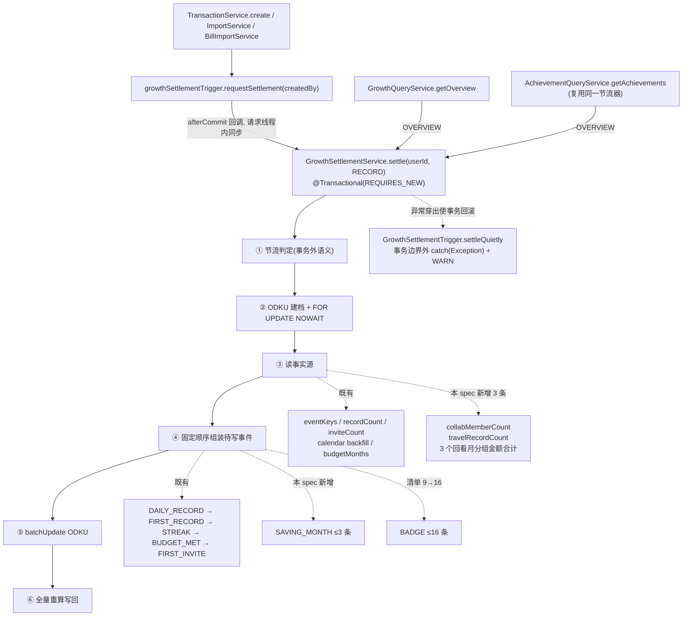
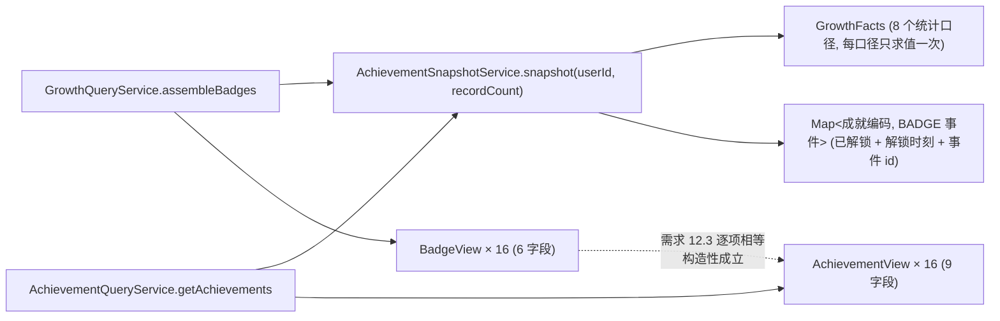
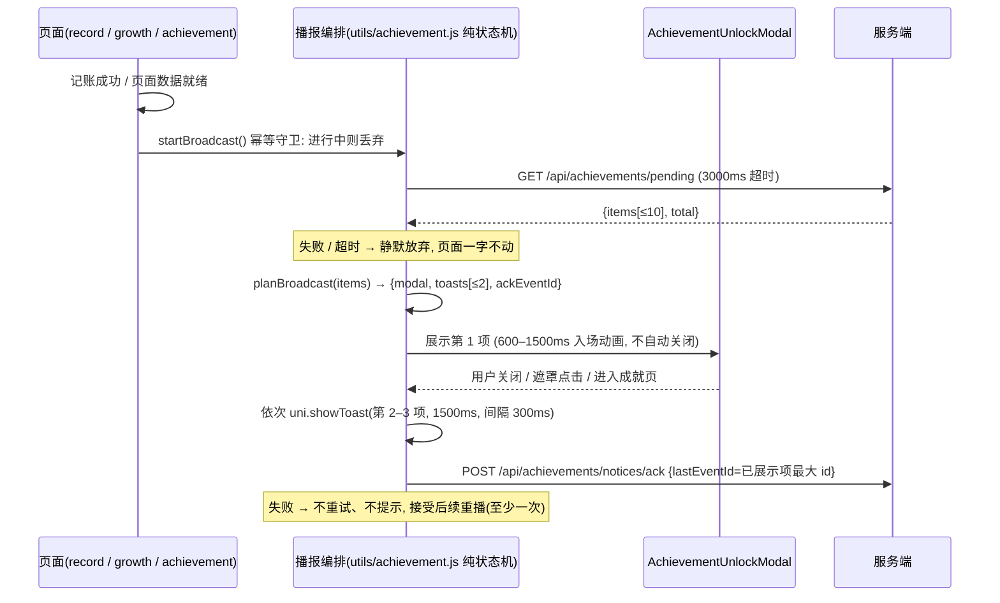

# Design Document

## Overview

本设计把 growth-level-system 已实现的「9 枚徽章」扩成一套完整的成就体验：清单扩到 16 枚并分五类、
新增「储蓄月」这一类零经验事实事件、新增播报游标使客户端能在解锁那一刻给出动画与 Toast、
并让已解锁的成就可以分享给微信好友或存成图片。

设计的全部取舍围绕一条主线：**成就不是第二套体系，而是既有成长体系的一次扩容**。
因此本设计做的是「在既有类上加字段、加分支、加常量」，而不是「新建一套并行的领域模型」。

### 边界（明确不做的事）

| 不做 | 理由 |
| --- | --- |
| 不新建成就表、不为成就新增数据库列 | 解锁状态的唯一事实源仍是 `growth_events` 的 `BADGE` 行，唯一索引 `uk_growth_events_user_key` 免费提供「一经解锁永不撤销 + 只解锁一次」 |
| 不改经验值、等级曲线与六类经验事件 | 新增事件 `exp_amount` 恒为 0，`GrowthLevelCurve` 一字不动 |
| 不新增结算触发时机、不引入定时任务 / 消息队列 / `@Async` / 线程池 | 成就判定寄生在 `GrowthSettlementService.settle` 的第 ③④ 步之内 |
| 不新增节流器 | 成就清单请求复用 `GrowthSettlementThrottle` 的概览侧 10 秒窗口 |
| 不放宽既有耗时预算 | 结算仍 ≤1000ms、记账接口端到端仍 ≤2000ms；新增读查询硬性 ≤3 条 |
| 服务端不产图、不存图、不缓存图 | 成就卡片由 miniapp 用 canvas 绘制，服务端只下发名称 / 描述 / 解锁时刻 |
| 只新增 1 个错误码 | `ACHIEVEMENT_ACK_PARAM_INVALID`，沿用成长体系「全 spec 只加一个错误码」的先例 |

### 新增 / 改动一览

**服务端新增（8 个类 + 1 个迁移）**

| 文件 | 职责 |
| --- | --- |
| `domain/AchievementNotice.java` | `achievement_notices` 实体 |
| `repository/AchievementNoticeRepository.java` | 游标读 + 注销硬删 |
| `service/AchievementCategory.java` | 五个分类枚举 + 中文展示名 |
| `service/AchievementSnapshotService.java` | **统一事实快照**：一处求值八个统计口径 + 已解锁映射 |
| `service/GrowthSavingMonthEvaluator.java` | 储蓄月判定（`GrowthBudgetEvaluator` 的同构兄弟） |
| `service/AchievementQueryService.java` | 成就清单 / 待播报 / 游标推进三个用例 |
| `service/AchievementView.java` 等 5 个 record | 响应 DTO |
| `api/AchievementController.java` | `/api/achievements` 三个端点 |
| `db/migration/V33__achievement.sql` | 建游标表 + 放宽 `ck_growth_events_type` + 回填游标 |

**服务端改动（6 处，全部是加法）**

| 文件 | 改动 |
| --- | --- |
| `service/GrowthBadgeCatalog.java` | 清单 9 → 16 枚；`BadgeDef` 加 `description` 与 `category`；启动自校验 |
| `service/BadgeMetric.java` | 5 → 8 个取值；`BUDGET_MET_EVENT` → `BUDGET_MET_COUNT` |
| `service/GrowthFacts.java` | 5 → 8 个分量（即「统计口径快照」） |
| `service/GrowthSettlementService.java` | 第 ③ 步多读 3 条查询；第 ④ 步插入 `SAVING_MONTH` 组装；上界 1016 → 1026 |
| `service/GrowthQueryService.java` | `assembleBadges` 改为委托 `AchievementSnapshotService`（保证需求 12.3 构造性成立） |
| `service/AccountDeletionService.java` | 注销序列插入第 12.6 步 |
| `domain/GrowthEventType.java` | 加 `SAVING_MONTH` 常量 |
| `deploy/reset-db.sql` | 加一条 `TRUNCATE` |

**miniapp 新增 4 个 / 改动 2 个**：`api/achievement.js`、`utils/achievement.js`、
`pages/achievement/achievement.vue`、`components/AchievementUnlockModal/AchievementUnlockModal.vue`；
改 `pages/growth/growth.vue`（入口 + 播报挂载）与 `pages.json`（注册页面）。

---

## Architecture

### 写入侧：成就判定寄生在既有结算之内



三条既有硬约束在本设计里**一条不改**：
`settle` 内刻意不 catch 任何异常；`REQUIRES_NEW` 不得改成 `REQUIRED`；批量插入只用
`ON DUPLICATE KEY UPDATE id = id`（绝不 `INSERT IGNORE`，否则会连 CHECK 违例一起静默掉）。
新增的成就判定与储蓄月判定因此**天然获得**与既有经验事件相同的故障隔离：
任何异常穿出 → `REQUIRES_NEW` 事务整体回滚 → 边界外吞掉只记 `[GROWTH_SETTLE_FAILED]` →
记账响应字段集与状态码一字不变 → 下一次结算幂等自愈。

### 读取侧：两个接口共用一份快照



需求 12.3 要求成长概览的徽章列表与成就清单在 6 项上逐项相等。做法不是「写两份实现再靠测试比对」，
而是**让两条路径调用同一个 `AchievementSnapshotService` 与同一份 `GrowthBadgeCatalog`**，
两个 DTO 只是同一快照的两种投影。这与既有 `recalculateOnly` / `settle` 共用
`recalculateAndWriteBack` 的思路一致：不变式靠构造成立，属性测试只负责把它锁住。

### miniapp 播报流程



---

## Components and Interfaces

### 1. 成就清单常量：`GrowthBadgeCatalog` 扩容

沿用既有类名与 `BADGE_KEY_PREFIX`，**不改名**（改名要么写迁移重写历史行、要么让代码与库里的字面量
长期不一致，两者都比保留旧名糟）。三处扩容：

```java
public record BadgeDef(String code, String name, String description,
                       AchievementCategory category, int target, BadgeMetric metric) {}

public enum BadgeMetric {
    RECORD_COUNT, MAX_STREAK, TOTAL_DAYS,
    BUDGET_MET_COUNT,        // 原 BUDGET_MET_EVENT：布尔 → 计数，门槛 1 时判定结果不变
    FIRST_INVITE_EVENT,      // 存在型，映射 1/0
    SAVING_MONTH_COUNT,      // 新增
    COLLAB_MEMBER_COUNT,     // 新增
    TRAVEL_RECORD_COUNT      // 新增
}

public enum AchievementCategory {
    START("起步"), STREAK("坚持"), VOLUME("积累"), SOCIAL("协作"), THEME("主题");
    private final String label;
    public String label() { return label; }
}
```

`BUDGET_MET_EVENT` → `BUDGET_MET_COUNT` 是本设计里唯一一次既有枚举取值改名。
它不落库（`BadgeMetric` 从来只在内存里用），因此改名零数据影响；
门槛 1 加「取值 ≥ 门槛」等价于「存在至少一条 `BUDGET_MET` 事件」，判定结果逐例相同（需求 1.5）。

16 项定义（下标顺序即展示顺序，同分类连续出现）：

| # | code | name | description | category | metric | target |
| --- | --- | --- | --- | --- | --- | --- |
| 1 | `FIRST_RECORD` | 开张 | 记下第 1 笔账，从今天开始 | `START` | `RECORD_COUNT` | 1 |
| 2 | `STREAK_7` | 七日不辍 | 连续记账满 7 天 | `STREAK` | `MAX_STREAK` | 7 |
| 3 | `STREAK_30` | 卅日成习 | 连续记账满 30 天，习惯已成 | `STREAK` | `MAX_STREAK` | 30 |
| 4 | `STREAK_100` | 百日不辍 | 连续记账满 100 天 | `STREAK` | `MAX_STREAK` | 100 |
| 5 | `STREAK_365` | 岁岁有余 | 连续记账满 365 天，整整一年 | `STREAK` | `MAX_STREAK` | 365 |
| 6 | `RECORD_10` | 小有账目 | 累计记账满 10 笔 | `VOLUME` | `RECORD_COUNT` | 10 |
| 7 | `RECORD_100` | 百笔有余 | 累计记账满 100 笔 | `VOLUME` | `RECORD_COUNT` | 100 |
| 8 | `RECORD_500` | 五百笔在册 | 累计记账满 500 笔 | `VOLUME` | `RECORD_COUNT` | 500 |
| 9 | `RECORD_1000` | 千笔如一 | 累计记账满 1000 笔 | `VOLUME` | `RECORD_COUNT` | 1000 |
| 10 | `DAYS_100` | 百日记账 | 累计记账天数满 100 天 | `VOLUME` | `TOTAL_DAYS` | 100 |
| 11 | `INVITE_1` | 同行有余 | 成功邀请第 1 位好友加入 | `SOCIAL` | `FIRST_INVITE_EVENT` | 1 |
| 12 | `COLLAB_1` | 共账之始 | 第 1 位成员加入你的账本 | `SOCIAL` | `COLLAB_MEMBER_COUNT` | 1 |
| 13 | `BUDGET_MET` | 预算达标 | 首次在一个月内守住预算 | `THEME` | `BUDGET_MET_COUNT` | 1 |
| 14 | `BUDGET_MASTER` | 预算达人 | 累计 3 个月达成预算 | `THEME` | `BUDGET_MET_COUNT` | 3 |
| 15 | `SAVING_MASTER` | 储蓄达人 | 累计 3 个月存下两成收入 | `THEME` | `SAVING_MONTH_COUNT` | 3 |
| 16 | `TRAVEL_MASTER` | 旅行达人 | 旅行支出累计满 10 笔 | `THEME` | `TRAVEL_RECORD_COUNT` | 10 |

既有 9 枚（1、2、3、6、7、9、10、13、11）的 code / name / target 与 `V32` 时期逐项相同，
因此已解锁用户零数据迁移。

**启动自校验**（需求 1.13）：`@PostConstruct` 断言 16 项、code 两两不同、name 两两不同、
name 长度 ∈ [2,10] 码点、description 长度 ∈ [6,30] 码点且两两不同、
`target ∈ [1,1000]`、存在型口径 target 恒为 1、同分类连续且分类首现顺序为
`START/STREAK/VOLUME/SOCIAL/THEME`。任一条不成立即抛 `IllegalStateException` 使应用启动失败——
清单缺陷在启动即暴露，绝不以一份错误清单对外服务。

**未知 `BADGE` 行的处理**（需求 1.12）：清单是权威，库里若出现 `BADGE:<不在清单里的编码>`
（例如清单曾误删过某个编码），读取侧一律忽略该行、列表项数仍为 16、记一条含 `event_key` 的
WARN、不报错、不改动该行。

### 2. 统计口径快照：`AchievementSnapshotService`

`GrowthFacts` 从 5 分量扩到 8 分量，它**就是**需求 3.16 要求的「每口径单次只求值一次」的载体：

```java
public record GrowthFacts(long recordCount, int maxStreakDays, int totalRecordDays,
                          long budgetMetCount, boolean firstInviteEvent,
                          long savingMonthCount, long collabMemberCount, long travelRecordCount) {
    public static final GrowthFacts EMPTY = new GrowthFacts(0, 0, 0, 0, false, 0, 0, 0);
}
```

八个口径的取值来源：

| 口径 | 来源 | 新增查询 |
| --- | --- | --- |
| `RECORD_COUNT` | `TransactionRepository.countValidRecordsByCreatedBy`（既有） | 否 |
| `MAX_STREAK` | `user_growth.max_streak_days`（结算侧用本次补发后的 `scan.maxStreak()`） | 否 |
| `TOTAL_DAYS` | `user_growth.total_record_days` / `scan.totalDays()` | 否 |
| `BUDGET_MET_COUNT` | 已读回的 `eventKeys` 里 `BUDGET_MET:` 前缀计数（结算侧再并上本次新判定的月份） | 否 |
| `SAVING_MONTH_COUNT` | 同上，`SAVING_MONTH:` 前缀计数 | 否 |
| `FIRST_INVITE_EVENT` | `eventKeys.contains("FIRST_INVITE")` | 否 |
| `COLLAB_MEMBER_COUNT` | 新增 1 条查询 | **1** |
| `TRAVEL_RECORD_COUNT` | 新增 1 条查询 | **1** |

三个基于 `eventKeys` 的口径**零新增查询**，因为结算第 ③ 步已用
`findEventKeysByUserId` 把该用户全部事件键一次读完了。这是既有设计留下的红利：
「不要为每个口径各写一个带过滤条件的查询」这条既有约定在这里直接兑现。

**协作成员数**（需求 3.3、3.4）：按**成员行**计数，不按去重用户；排除 `OWNER` 行、
排除 `user_id` 等于本人的行；账本归属只认 `ledgers.user_id`。

```sql
SELECT COUNT(*)
FROM ledger_members m
JOIN ledgers l ON l.id = m.ledger_id
WHERE l.user_id = :userId
  AND m.role = 'EDITOR'
  AND m.user_id <> :userId
```

同一个人以 `EDITOR` 加入本人 2 个账本计 2（成员行 2 行）。
`uk_ledger_member (ledger_id, user_id)` 保证同一账本内不重复计数。

**旅行记账笔数**（需求 3.9、3.10、3.11）：单条查询，`transactions` 与其分类 1:1 join，
因此同一交易至多被计 1 次；`categories` 只有一层 `parent_id`，故 `LEFT JOIN` 父分类一次即可覆盖
「父分类自身的交易」与「子分类的交易」两种情形，不需要递归 CTE：

```sql
SELECT COUNT(*)
FROM transactions t
JOIN categories c ON c.id = t.category_id
LEFT JOIN categories p ON p.id = c.parent_id
WHERE t.created_by = :userId
  AND t.type = 'expense'
  AND t.deleted_at IS NULL
  AND t.ledger_id IS NOT NULL
  AND ( (c.kind = 'EXPENSE' AND TRIM(c.name) = '旅行')
     OR (p.kind = 'EXPENSE' AND TRIM(p.name) = '旅行') )
```

四点说明：
- 归属只认 `t.created_by`，**不用 `t.user_id`**（那是 `V9` 之后的历史遗留列，可空）。
- 名称用 `TRIM(name) = '旅行'` 逐字符相等，**不用 `LIKE '%旅行%'`**——
  「旅行保险」「旅行装备」不该算进旅行达人。
- `kind` 的大小写：`ck_categories_kind` 的取值集合是 `('EXPENSE','INCOME')`，
  而应用写入路径只写大写，因此库里 `kind` 只有大写两种取值，普通 `=` 与区分大小写比较结果逐例相同。
  **刻意不写 `COLLATE utf8mb4_bin`**：测试库是 H2 `MODE=MySQL`，加 COLLATE 会让这条查询在测试里直接报错，
  代价远大于收益。同理「旅行」是汉字，无大小写之分。
- 不按会话账本过滤、不要求分类的 `user_id` 等于该用户（协作账本内的分类归账本所有者）。

**回落语义**（需求 3.12）：`TRAVEL_RECORD_COUNT` 是实时聚合，改名 / 删分类会让它下降。
`GrowthBadgeCatalog.currentOf` 的既有三条规则原封不动地处理这件事：
已解锁恒返回 target（进度不回退）、未解锁取 `min(值, target)` 并钳到 `[0, target]`。
已写入的 `BADGE:TRAVEL_MASTER` 行一字不动。

**降级**（需求 3.14）：清单请求路径下，任一聚合查询抛异常 → 该口径本次取 0、
记一条含用户 id 与口径名的 WARN、其余口径照常返回、不对外暴露错误码。
（结算路径下不做此降级——那里异常必须穿出以回滚事务，见需求 4.14。）

### 3. 储蓄月判定：`GrowthSavingMonthEvaluator`

与 `GrowthBudgetEvaluator` 同构：同样 `LOOKBACK_MONTHS = 3`、同样只判已结束自然月、
同样接收 `existingKeys` 做跳过判定（因此存在性判定零新增查询）。

```java
@Component
public class GrowthSavingMonthEvaluator {
    static final int LOOKBACK_MONTHS = 3;
    private static final String SAVING_MONTH_PREFIX = "SAVING_MONTH:";
    private static final BigDecimal MIN_INCOME = new BigDecimal("0.01");
    private static final BigDecimal SAVING_RATE = new BigDecimal("0.2");
    private static final int SCALE = 2;

    /** @return 判定为储蓄月且尚无事件的月份，形如 YYYY-MM，升序 */
    public List<String> savingMonths(Long userId, LocalDate settleDate, Set<String> existingKeys);
}
```

**时区与月边界**：结算日 = 结算执行时刻按注入的 `Clock`（`TimeConfig` 固定 `Asia/Shanghai`）
折算所得日期。回看窗口 = `settleDate.withDayOfMonth(1)` 往前 1/2/3 个月，
跨年自动回退（1 月 → 上年 10/11/12 月，`LocalDate.minusMonths` 天然处理）。
月归属用 `occurred_at ∈ [该月 1 日 00:00:00.000, 次月 1 日 00:00:00.000)`，
恰好落在右边界的交易归次月。**不用 `created_at`**——那是记账日历的口径，两者刻意不同。

**单条分组查询**（3 个回看月 × 2 个类型，一次读完，需求 4.11）：

```sql
SELECT YEAR(occurred_at), MONTH(occurred_at), type, COALESCE(SUM(amount), 0)
FROM transactions
WHERE created_by = :userId
  AND deleted_at IS NULL
  AND ledger_id IS NOT NULL
  AND type IN ('expense', 'income')
  AND occurred_at >= :fromInclusive
  AND occurred_at <  :toExclusive
GROUP BY YEAR(occurred_at), MONTH(occurred_at), type
```

用 `YEAR()` / `MONTH()` 而**不用 `DATE_FORMAT`**：前者在 MySQL 与 H2 `MODE=MySQL` 上行为一致，
后者在 H2 上的支持随版本漂移。`type IN ('expense','income')` 顺带排除了 `transfer`。

**判定与舍入**（需求 4.3、4.8）：

```
月度收入合计 = SUM(income)，空结果按 0.00
月度支出合计 = SUM(expense)，空结果按 0.00
月度结余     = 收入 − 支出                        （可为负）
储蓄门槛值   = (收入 × 0.2).setScale(2, HALF_UP)   （第 3 位小数四舍五入）
是储蓄月     ⟺ 收入 ≥ 0.01 且 结余 ≥ 储蓄门槛值   （取等号即成立）
```

全程 `BigDecimal`、`compareTo` 比较，无浮点。引入「储蓄门槛值」这个具名中间量是为了让边界可判定：
收入 `333.33` 时门槛是 `66.67`（不是 `66.666`），两名测试者不会得出不同结论。

**幂等**：`event_key = "SAVING_MONTH:" + YYYY-MM`，长度恒为 20 字符（前缀 13 + `YYYY-MM` 7），
远小于 `event_key VARCHAR(64)`。唯一性由 `uk_growth_events_user_key` 承担，
并发结算下终态至多 1 行；ODKU 的唯一键冲突是预期的幂等路径，不记告警。
判定不成立时不写任何行、不写负向标记，继续判定其余回看月。
已写入的储蓄月事件此后不删不改（需求 4.9）。

### 4. 结算集成

`GrowthSettlementService.settle` 的六步骨架不变，改动集中在第 ③④ 步：

```java
// ── ③ 读事实源 ──（既有 5 项 + 本 spec 新增 3 条读查询）
Set<String> existingKeys = ...;                                        // 既有
long recordCount = ...;                                                // 既有
long inviteCount = ...;                                                // 既有
BackfillResult backfill = ...;                                         // 既有 ≤2 条
List<String> budgetMonths = budgetEvaluator.metMonths(...);             // 既有 ≤8 条
List<String> savingMonths = savingMonthEvaluator.savingMonths(          // 新增 1 条
        userId, settleDate, existingKeys);
long collabMemberCount = memberRepository.countEditorsOfOwnedLedgers(userId);   // 新增 1 条
long travelRecordCount = transactionRepository.countTravelExpenses(userId);      // 新增 1 条

// 计数型口径：已读回的 eventKeys 前缀计数 ∪ 本次新判定的月份，零新增查询
long budgetMetCount  = countPrefix(existingKeys, BUDGET_MET_PREFIX)   + budgetMonths.size();
long savingMonthCount = countPrefix(existingKeys, SAVING_MONTH_PREFIX) + savingMonths.size();

GrowthFacts facts = new GrowthFacts(recordCount, scanForStreak.maxStreak(), scanForStreak.totalDays(),
        budgetMetCount, hasFirstInviteEvent, savingMonthCount, collabMemberCount, travelRecordCount);

// ── ④ 组装（既有顺序 + SAVING_MONTH 插在 FIRST_INVITE 与 BADGE 之间）──
// DAILY_RECORD → FIRST_RECORD → STREAK_7 → STREAK_30 → BUDGET_MET → FIRST_INVITE
//   → SAVING_MONTH(≤3, exp 0) → BADGE(≤16, exp 0)
for (String month : savingMonths) {
    add(pending, existingKeys, userId, GrowthEventType.SAVING_MONTH, SAVING_MONTH_PREFIX + month, 0, now);
}
for (String code : badgeCatalog.qualified(facts)) {
    add(pending, existingKeys, userId, GrowthEventType.BADGE, GrowthBadgeCatalog.eventKeyOf(code), 0, now);
}
```

`BADGE` 排在最后不是随意的：`SAVING_MONTH` 必须先进 `pending`，
`savingMonthCount` 才能把本次新判定的月份计入 `facts`，
`SAVING_MASTER` 才能在**同一次结算内**与第 3 个储蓄月一起解锁（需求 2.6 的跨门槛不漏发）。
`qualified` 按清单序号升序返回 `LinkedHashSet`，因此同批解锁的 `BADGE` 事件 `id`
相对大小与展示序号一致（需求 2.6 后半句），播报顺序随之确定。

**上界**：`MAX_PENDING_EVENTS` 1016 → **1026**
（1000 `DAILY_RECORD` + 1 + 2 + 3 + 1 + 3 `SAVING_MONTH` + 16 `BADGE`）。
既有的越界即抛 `IllegalStateException` 的断言保留——宁可炸响也不静默写超量。

**新增读查询硬性 ≤3 条**（需求 4.11）：储蓄月 1 条 + 协作成员 1 条 + 旅行笔数 1 条。
三条都是常量条数，不随账本数、分类数、交易笔数增长。
储蓄月的存在性判定复用 `existingKeys`，不额外查询。

**耗时**：既有 `[GROWTH_SETTLE_SLOW]`（1000ms）与 `[GROWTH_STATS_SLOW]`（500ms）告警不动，
新增判定落在同一预算内。

### 5. 播报游标

**实体与仓库**

```java
@Entity
@Table(name = "achievement_notices")
public class AchievementNotice {
    @Id @Column(name = "user_id") private Long userId;   // 刻意无 @GeneratedValue，与 UserGrowth 同构
    private long lastNotifiedEventId;
    private LocalDateTime createdAt;
    private LocalDateTime updatedAt;
}
```

```java
public interface AchievementNoticeRepository extends JpaRepository<AchievementNotice, Long> {
    @Modifying
    @Query("DELETE FROM AchievementNotice n WHERE n.userId = :userId")
    int deleteByUserId(@Param("userId") Long userId);
}
```

**游标推进：单条 ODKU，天然单调 + 并发安全**（需求 5.7~5.11）

```sql
INSERT INTO achievement_notices (user_id, last_notified_event_id, created_at, updated_at)
VALUES (?, ?, ?, ?)
ON DUPLICATE KEY UPDATE
    updated_at             = CASE WHEN ? > last_notified_event_id THEN ? ELSE updated_at END,
    last_notified_event_id = GREATEST(last_notified_event_id, ?)
```

两点必须按这个写法（改动前务必读）：
- **`updated_at` 的赋值必须写在 `last_notified_event_id` 之前**。MySQL 的 ODKU 赋值按书写顺序
  从左到右求值，若把 `last_notified_event_id` 写在前面，右侧那句 `CASE` 读到的就已经是新值，
  `>` 恒不成立，`updated_at` 永远不会推进。
- 用 `GREATEST(旧值, 新值)` 而非 `= ?`：这一句同时满足「单调不减」（需求 5.9）、
  「重复确认幂等」（需求 5.8）与「并发终态取最大值」（需求 5.10）三条，
  且**不需要行锁、不需要先读后写**——把三条不变式压到一条 SQL 里，并发竞态无从产生。

参数 7 个：`userId, lastEventId, now, now, lastEventId, now, lastEventId`。

> **实测结论（任务 1.5，MySQL `8.0.46-0ubuntu0.22.04.3` (Ubuntu)，即 `deploy/dev-remote-db.conf` 指向的
> 测试服务器实例；在同一实例上另建一次性探针库 `youyu_ach_probe15`（`utf8mb4` /
> `utf8mb4_unicode_ci`），建两张与 `V33` 的 `achievement_notices` 同构的表 `notices_a`（设计写法）与
> `notices_b`（两句顺序调换的反例），对同一组数据各跑一遍，不触碰 `youyu` 业务库，跑完即删库）**
>
> **① 设计写法成立：推进游标会同时推进 `updated_at`，且 `created_at` 不动（需求 5.7、5.11）。**
> `notices_a` 上依次执行（`now` 用显式字面量以便逐列断言）：
> `lastEventId=5, now=T1('2026-01-01 10:00:00')` 走插入路径，`ROW_COUNT()` 为 1、行数 1、
> `last_notified_event_id=5` 且 `created_at = updated_at = T1`（需求 5.11 的「同一服务端时刻」成立）；
> 再 `lastEventId=9, now=T2('2026-01-02 11:11:11')`，`ROW_COUNT()` 为 2，落库为
> `9 / created_at=T1 / updated_at=T2`——**游标推进的同一条语句里 `updated_at` 也推进了**；
> 在后续三次重复确认（见 ②）之后再 `lastEventId=10, now=T6('2026-01-06 15:15:15')`，
> 落库为 `10 / T1 / T6`，说明重复确认不会让后续的推进失效。
>
> **② `GREATEST` 在重复确认（传入 ≤ 当前值）时两列均不变（需求 5.8、5.9）。**
> 承接 ① 的 `9 / T1 / T2`，分别以 `lastEventId=9, now=T3`（等值）、`lastEventId=3, now=T4`（小于）、
> `lastEventId=0, now=T5`（下界）各跑一次：三次的 `ROW_COUNT()` 均为 **0**，
> 三次之后重读该行仍为 `9 / created_at=T1 / updated_at=T2`，
> `last_notified_event_id` 与 `updated_at` **逐列不变**，且均**不报错**（幂等成立）。
> 附带观察：ODKU 在这个实例上的 `ROW_COUNT()` 是 0（空更新）/ 1（插入）/ 2（真实更新）三态。
> **不要**用受影响行数去判断「是否推进」——它还受客户端 `CLIENT_FOUND_ROWS` 标志影响，
> 而 `GREATEST` 的结果只有库知道，因此 `ack` 仍按设计**重新读一次游标行**再返回。
>
> **③ 反例验证：把两句顺序调换后 `updated_at` 不再推进——「赋值按书写顺序从左到右求值」是实测事实。**
> `notices_b` 用
> ``last_notified_event_id = GREATEST(...), updated_at = CASE WHEN ? > last_notified_event_id THEN ? ELSE updated_at END``
> 跑同一组数据：`lastEventId=5, now=T1` 插入得 `5 / T1 / T1`；`lastEventId=9, now=T2` 后为
> `9 / T1 /` **`T1`**；`lastEventId=10, now=T6` 后为 `10 / T1 /` **`T1`**（`updated_at` 一次都没动）。
> 游标照常推进（5→9→10），但 `updated_at` **始终停在首次写入时刻 T1**，MySQL 既不报错也不告警——
> 是一个纯静默的错误。原因正如上文所述：`GREATEST` 先落地，右侧 `CASE` 读到的
> `last_notified_event_id` 已是新值，`? > last_notified_event_id` 恒不成立
> （`GREATEST(旧, 新) >= 新`，所以对**任何**入参都不成立，`updated_at` 永不推进）。
> 终态对照：同一序列下 A 为 `10 / T1 / T6`、B 为 `10 / T1 / T1`。
> 因此「`updated_at` 写在前」这条不是猜测，任务 5.4 的代码注释与任务 8.7 的反向断言都以本次实测为依据。
>
> **④ 复核（任务 10.2）：在同一实例上重跑，结论与 ①②③ 逐项一致。**
> 另建一次性探针库 `youyu_ach_probe102`（跑完即 `DROP`，全程未对 `youyu` 业务库执行任何写语句），
> 把上面三条连同 CHECK 拒绝一并重跑，**28 条断言全部通过**，终态对照仍是 A `10 / T1 / T6`、
> B `10 / T1 / T1`，重复确认三次后两列逐列不变。留档见 `manual-verification.md` 附录 A，此处不重复展开。
> 本次顺带把 ② 里「**不要**用受影响行数判断游标是否推进」这条坐实到具体开关上：
> Connector/J 默认 `useAffectedRows=false`（即带 `CLIENT_FOUND_ROWS`）时，一次空更新报 **1**；
> 显式设 `useAffectedRows=true` 时同一条语句报 **0**、真实推进报 **2**。
> 两种设置下**落库的行内容完全相同**，差别只在返回的计数——所以 `ack` 必须按设计
> **重新读一次游标行**再返回，绝不能拿返回的行数当「是否推进」的判据。

**新增仓库查询**（`GrowthEventRepository`，全部只读）

```java
@Query("SELECT e FROM GrowthEvent e WHERE e.userId = :userId AND e.eventType = 'BADGE' "
        + "AND e.id > :cursor ORDER BY e.id ASC")
List<GrowthEvent> findPendingBadgeEvents(@Param("userId") Long userId,
                                         @Param("cursor") long cursor, Pageable pageable);

@Query("SELECT COUNT(e) FROM GrowthEvent e WHERE e.userId = :userId "
        + "AND e.eventType = 'BADGE' AND e.id > :cursor")
long countPendingBadgeEvents(@Param("userId") Long userId, @Param("cursor") long cursor);

@Query("SELECT COALESCE(MAX(e.id), 0) FROM GrowthEvent e "
        + "WHERE e.userId = :userId AND e.eventType = 'BADGE'")
long maxBadgeEventId(@Param("userId") Long userId);
```

`findPendingBadgeEvents` 传 `PageRequest.of(0, 10)` 取前 10 项；
`countPendingBadgeEvents` 给的是**截断前**的全部待播报条数（需求 5.5）。
两者走既有索引 `idx_growth_events_user_type (user_id, event_type)`。
`maxBadgeEventId` 是 `lastEventId` 的上界校验依据（无 `BADGE` 行时为 0，需求 5.6、5.13）。

**语义：至少一次。** 待播报查询只读、不推进游标（需求 5.17），
确认丢失只导致重播（需求 5.18）。选「至少一次」而非「恰好一次」，是因为漏播一枚成就是产品事故，
重播一次只是轻微冗余，而「恰好一次」要求客户端与服务端就「已经播到哪儿」达成分布式共识，
代价与收益完全不成比例。

### 6. 接口设计

`api/AchievementController.java`，`@RequestMapping("/api/achievements")`，
三个端点的第一步都是 `requireExistingUserId()`（照抄 `GrowthController` 的私有方法：
`currentUser.requireUserId()` + `userRepository.findById(...).orElseThrow(ApiException::unauthenticated)`）。
过滤链只验签不查库，「令牌合法但用户已注销」这个缺口只能在这里补，
且必须**先于**结算、入参校验与任何聚合查询（需求 6.8、6.9）。
`SecurityConfig` 不改动：`/api/achievements/**` 落在 `anyRequest().authenticated()`。
三个端点都与会话账本无关，不要求也不检查 `X-Ledger-Id`（需求 6.11）。

| 方法 | 路径 | 说明 |
| --- | --- | --- |
| `GET` | `/api/achievements` | 成就清单；返回前触发一次结算（复用概览侧 10 秒节流） |
| `GET` | `/api/achievements/pending` | 待播报成就；**只读，不触发结算** |
| `POST` | `/api/achievements/notices/ack` | 推进游标 |

**响应 DTO**（record 组件名即 JSON 键，DTO 放 `service` 包，沿用既有约定）

```java
// 顶层恰好 3 项；achievements 恒 16 项、total 恒 16
public record AchievementListResponse(List<AchievementView> achievements,
                                      int unlockedCount, int total) {}

// 恰好 9 项，键在全部 16 项上恒存在，不因空值省略（故用包装类型）
public record AchievementView(String code, String name, String description, String category,
                              int target, int current, boolean unlocked,
                              LocalDateTime unlockedAt, Long eventId) {}

// 顶层恰好 2 项；items ≤10 项，total 为截断前全部条数
public record PendingAchievementResponse(List<PendingAchievementItem> items, long total) {}

// 恰好 6 项，同名字段与 AchievementView 逐项相等
public record PendingAchievementItem(String code, String name, String description,
                                     String category, LocalDateTime unlockedAt, Long eventId) {}

public record AchievementAckRequest(String lastEventId) {}      // String，见下
public record AchievementAckResponse(long lastNotifiedEventId) {}   // 顶层恰好 1 项
```

**`category` 字段承载的是分类的中文展示名**（`AchievementCategory.label()`，即「起步」「坚持」
「积累」「协作」「主题」），不是枚举 code。理由：需求 1.3 禁止在 miniapp 里重复定义分类，
需求 9.3 又要求分组展示中文名——只有把中文名随响应下发，两条才能同时成立。
枚举 code 保持服务端内部使用。

**`lastEventId` 声明为 `String`** 而非 `Long`：与 `GrowthController` 把 `page`/`size`
声明为 `String` 完全同一个理由——交给 Jackson 做类型转换，`"abc"` 会在进入方法体**之前**抛
`HttpMessageNotReadableException` → `REQUEST_BODY_INVALID`（另一个错误码、另一套字段集），
既绕过上面「令牌用户仍存在」的校验，也违背需求 5.12「缺失 / 不可解析 / 越界同为
`ACHIEVEMENT_ACK_PARAM_INVALID`」。故以原文接收后在服务层自行解析。
Jackson 会把 JSON 数字 `12` 也收成 `"12"`，因此客户端传数字或字符串都能工作。

**唯一新增错误码**（在 `ApiException` 加静态工厂，沿用既有风格，无枚举类）：

```java
public static ApiException achievementAckParamInvalid() {
    return new ApiException("ACHIEVEMENT_ACK_PARAM_INVALID", HttpStatus.BAD_REQUEST,
            "播报游标取值不合法", "lastEventId");
}
```

`message` 中文、≤100 字符、不含用户 id / 邮箱 / 令牌。
`ErrorResponse` 的 `@JsonInclude(NON_NULL)` 使无字段归属的错误自动省略 `field`（即空值语义）。
结算失败、结算被节流、空待播报列表**均不对外暴露错误码**。

**成就清单的组装顺序**（`AchievementQueryService.getAchievements`）：

```
① settlementService.settle(userId, OVERVIEW)   ← try/catch 吞掉，记 [GROWTH_SETTLE_FAILED]
② snapshotService.snapshot(userId)             ← 八个口径 + 已解锁映射，各只求值一次
③ 遍历 catalog.badges() 投影成 16 个 AchievementView
④ unlockedCount = 已解锁项个数
```

结算失败或被节流时，②③④ 照常执行 → 返回已持久化的解锁状态 + 实时聚合的当前值 +
与成功时**完全相同的字段集**，且三表行数与列取值不变（需求 6.7）。
本方法**不加 `@Transactional`**，与 `GrowthQueryService.getOverview` 同一理由：
它处在结算事务边界之外，加事务反而会把「吞异常」挪进事务上下文、破坏隔离。

### 7. 注销集成

`AccountDeletionService.deleteAccount` 在既有第 12.5 步（成长数据硬删）之后、
第 13 步（删 `users` 行）之前插入一步，既有各步的相对顺序、过滤条件与影响行数一字不改：

```java
// 12.6) 播报游标硬删（需求 11.1、11.2、11.4）：置于成长两表删除之后、删 users 行之前。
//     无外键（与 user_growth 同一取舍），删除顺序在数据库层没有约束；固定在这里只为可逐语句断言。
//     无行时影响行数 0 即视为成功，删除前不做任何存在性预查询，不写软删除标记或归档副本。
achievementNoticeRepository.deleteByUserId(userId);
```

整个 `deleteAccount` 仍是单事务：这一步失败则整体回滚，`users`、成长两表与游标表全列还原
（需求 11.5）。方法只在 `requireDeletable` 与 `verifySecondFactor`（均只读）通过后才被调用，
故前置校验失败时游标表零副作用（需求 11.8）。
注销后旧令牌再来请求三个接口，`requireExistingUserId` 先抛 `UNAUTHENTICATED`，
因此不会创建孤儿游标行（需求 11.11）。

---

## Data Models

### 迁移 `V33__achievement.sql`

取 V33 而非缺号 V30：`V30` 是历史缺号（V29 直接跳到 V31），占用它会让已迁移环境出现
Flyway out-of-order 失败。V30 另已被 user-feedback-system spec 预占。

```sql
-- ============================================================================
-- 有余(youyu) 成就系统：achievement_notices 播报游标 + growth_events 事件类型扩容
--
-- 不建成就表：成就仍是 growth_events 里 event_type='BADGE'、event_key='BADGE:<编码>'、
--   exp_amount=0 的行，解锁时刻即该行 created_at。本脚本只加「播报到哪儿」这一个新事实。
-- 播报语义是「至少一次」：游标只增不减(服务层用 GREATEST)，确认丢失只导致重播、绝不漏播。
-- 刻意不建指向 users(id) 的外键：注销时由 AccountDeletionService 在同一事务内显式删除，
--   与 user_growth / growth_events 同一取舍。
-- 回填游标：存量用户的历史徽章一律视为已播报，否则升级后第一次打开小程序会被 9 枚历史成就
--   连续轰炸。没有任何 BADGE 行的用户不回填(游标缺失按 0 处理，语义等价且省一行)。
-- ============================================================================

CREATE TABLE achievement_notices (
    user_id                BIGINT   NOT NULL COMMENT '用户id(主键,非自增,由服务层以令牌用户id写入)',
    last_notified_event_id BIGINT   NOT NULL DEFAULT 0 COMMENT '已播报到的最大成就事件id(growth_events.id),只增不减',
    created_at             DATETIME NOT NULL COMMENT '创建时间',
    updated_at             DATETIME NOT NULL COMMENT '更新时间(仅在游标推进时同步更新)',
    PRIMARY KEY (user_id),
    CONSTRAINT ck_achievement_notices_event_id CHECK (last_notified_event_id >= 0)
) ENGINE = InnoDB
  DEFAULT CHARSET = utf8mb4
  COLLATE = utf8mb4_unicode_ci
  COMMENT = '成就播报游标(每用户至多一行,只存已播报到哪一条成就事件)';

-- event_type 取值集合从 6 个扩到 7 个，新增 SAVING_MONTH(储蓄月事实事件, exp 恒为 0)。
-- 表默认排序规则 utf8mb4_unicode_ci 大小写不敏感，故在表达式内显式 COLLATE utf8mb4_bin
-- 保持区分大小写(写法与 V32 逐字一致)。先 DROP 再 ADD 同名约束。
ALTER TABLE growth_events DROP CONSTRAINT ck_growth_events_type;
ALTER TABLE growth_events ADD CONSTRAINT ck_growth_events_type
    CHECK (event_type COLLATE utf8mb4_bin IN
           ('FIRST_RECORD', 'DAILY_RECORD', 'STREAK', 'BUDGET_MET',
            'FIRST_INVITE', 'BADGE', 'SAVING_MONTH'));

ALTER TABLE growth_events MODIFY COLUMN event_type VARCHAR(16) NOT NULL
    COMMENT '事件类型:FIRST_RECORD/DAILY_RECORD/STREAK/BUDGET_MET/FIRST_INVITE/BADGE/SAVING_MONTH';

-- 游标回填：每个有 BADGE 行的用户一行，取其最大 BADGE 事件 id；created_at/updated_at 同一时刻。
INSERT INTO achievement_notices (user_id, last_notified_event_id, created_at, updated_at)
SELECT user_id, MAX(id), NOW(), NOW()
FROM growth_events
WHERE event_type COLLATE utf8mb4_bin = 'BADGE'
GROUP BY user_id;
```

`SAVING_MONTH` 是 12 个字符，`event_type VARCHAR(16)` 容得下（键 `SAVING_MONTH:YYYY-MM` 是 20 字符，
`event_key VARCHAR(64)` 容得下）。回填语句不修改 `growth_events` 与 `user_growth` 的任何行。
`domain/GrowthEventType.java` 同步加 `public static final String SAVING_MONTH = "SAVING_MONTH";`
——JPQL 无法引用 Java 常量，只能写字面量，改动类型取值时这两处必须一起改。

> **实测结论（任务 1.4 迁移验证清单，MySQL `8.0.46-0ubuntu0.22.04.3` (Ubuntu)，即
> `deploy/dev-remote-db.conf` 指向的测试服务器实例。做法：在同一实例上另建一次性探针库
> `youyu_ach_probe14`（`utf8mb4` / `utf8mb4_unicode_ci`），用**与应用同版本的 Flyway 10.20.1**
> （`flyway-maven-plugin:10.20.1` + `flyway-mysql`，locations 指向 `src/main/resources/db/migration`）
> 跑完整迁移链，不触碰 `youyu` 业务库，跑完即删。为把「存量数据不受影响」与「游标回填」做成真实的
> 前后对照，先以 `-Dflyway.target=32` 只应用 V1→V32（目录内无 V30，故为 31 条记录），灌入 5 个用户与
> 14 条成长事件 / 3 条 `user_growth`，覆盖「有 `BADGE` 行（1001 三枚、1002 两枚、1005 一枚且其后还有
> 更大 id 的非 `BADGE` 行）/ 只有非 `BADGE` 行（1003）/ 无任何成长事件（1004）」三类用户，取快照后再跑
> 一次 `flyway:migrate` 应用 V33）**
>
> **① `information_schema` 元数据逐项核对：19 条断言全部 PASS，0 条 FAIL。** 逐项实际值：
> `achievement_notices` 恰好 **4** 列，四列的「序 / 名 / 类型 / 可空 / 缺省 / `EXTRA`」与期望表
> **双向比对 0 处差异**（`1|user_id|bigint|NO|~NULL~|`、`2|last_notified_event_id|bigint|NO|0|`、
> `3|created_at|datetime|NO|~NULL~|`、`4|updated_at|datetime|NO|~NULL~|`）；
> **`user_id` 的 `EXTRA` 为空串**（不含 `auto_increment`）、两个 `DATETIME` 列的 `EXTRA` 也为空串
> （不含 `on update`）且 `COLUMN_DEFAULT` 均为 NULL；4 列注释**全部非空、长度 ∈ [1,255] 且
> `REGEXP '\p{Han}'` 命中**（4/4，26 / 36 / 4 / 17 个字符）。
> `statistics`：`INDEX_NAME` 去重后**只有 `PRIMARY` 一个**，明细精确等于 `PRIMARY|0|1|user_id|A|BTREE`
> （`NON_UNIQUE=0`、单列、`COLLATION='A'`、`INDEX_TYPE=BTREE`），即恰好 1 个索引且是 `user_id` 单列主键。
> `table_constraints` 的集合精确等于 `{PRIMARY/PRIMARY KEY, ck_achievement_notices_event_id/CHECK}`；
> `check_constraints` 中 `ck_achievement_notices_event_id` 的 `CHECK_CLAUSE` 落库为
> ``(`last_notified_event_id` >= 0)``；`ck_growth_events_type` 的 `CHECK_CLAUSE` 落库为
> ``((`event_type` collate utf8mb4_bin) in (_utf8mb4'FIRST_RECORD',_utf8mb4'DAILY_RECORD',_utf8mb4'STREAK',_utf8mb4'BUDGET_MET',_utf8mb4'FIRST_INVITE',_utf8mb4'BADGE',_utf8mb4'SAVING_MONTH'))``
> ——**含 `utf8mb4_bin` 且 7 个取值全部命中**，`growth_events` 上的约束集合仍是
> `ck_growth_events_exp` / `ck_growth_events_type` / `PRIMARY` / `uk_growth_events_user_key` 四条（无增无减）。
> `referential_constraints`：`achievement_notices` **作为发起方与被引用方的外键条数均为 0**，
> `key_column_usage` 中 `REFERENCED_TABLE_NAME IS NOT NULL` 的列数也为 0。
> `tables`：`ENGINE=InnoDB`、`TABLE_COLLATION=utf8mb4_unicode_ci`、`ROW_FORMAT=Dynamic`、
> 表注释非空且含中文。`growth_events.event_type` 仍是 `varchar(16) NOT NULL`、
> `CHARACTER_SET_NAME` / `COLLATION_NAME` 仍为 `utf8mb4` / `utf8mb4_unicode_ci`，
> 注释已含 `SAVING_MONTH`（`MODIFY COLUMN` 只改注释，类型 / 可空性 / 长度一字未变）。
> **反向对照（证明这些断言不是恒真的空断言）**：另建 `youyu_ach_probe14_neg`，手写一张刻意做坏的
> `achievement_notices`（`user_id` 加 `AUTO_INCREMENT`、多一列 `note`、多一个 `uk_probe_user`、
> 两个 `DATETIME` 加 `DEFAULT CURRENT_TIMESTAMP` / `ON UPDATE`、不建 CHECK、排序规则
> `utf8mb4_general_ci`、无任何注释），跑同一批断言 SQL，**9 条相关断言全部转为 FAIL**
> （列数 5、逐列比对 4 处差异、含中文注释的列 0 个、`EXTRA=[auto_increment]`、2 个 `DATETIME` 违规、
> 索引 2 个、约束集合 1 处差异、CHECK 缺失、引擎/排序规则/注释组合项），
> 且在无 CHECK 时 `last_notified_event_id = -1` **被接受**——反证第 ③ 条的拒绝确实来自新建的约束。
>
> **② CHECK 替换实测：`SAVING_MONTH` 通过，5 个非法取值中 4 个以 `ERROR 3819` 被拒，
> 尾空格 `'BADGE '` 未被拒（与清单预期不符，详见下方 ⑦）。**
> 正例：`INSERT ... event_type = 'SAVING_MONTH'`（`event_key = 'SAVING_MONTH:2025-11'`、`exp_amount = 0`）
> 成功，`ROW_COUNT()` 为 1。反例（每条语句单独执行、执行前重新取整表指纹）：
> `'saving_month'`、`'Badge'`、`''`、`'FOO'` 四条 `INSERT` 均以
> `ERROR 3819 (HY000) Check constraint 'ck_growth_events_type' is violated.` 被拒；
> 附带补测的 `' BADGE'`（前导空格）与 `'SAVING_MONTH2'` 同样以 3819 被拒。
> `UPDATE growth_events SET event_type = 'saving_month' WHERE id IN (3, 9)` 以及改为 `'Badge'` / `''` /
> `'FOO'` 的同形态 `UPDATE` 全部以 3819 被拒。**被拒后表数据一字不变**：每次被拒后重算
> 「`COUNT(*)` + 全部列按 `id` 有序拼接的 MD5」，恒为 `15/9c2c6931264ec21372edb34efaf66408`；
> 目标行 `id=3`（`1001|BADGE|BADGE:FIRST_RECORD|0|2025-12-01 08:00:02`）与 `id=9`
> （`1002|BADGE|BADGE:BUDGET_MET|0|2025-12-02 09:00:02`）逐列复读与改前完全相同。
> 对照：`UPDATE ... SET exp_amount = -1` 以 `ERROR 3819 ... 'ck_growth_events_exp'` 被拒（另一条约束仍在生效）。
>
> **③ `last_notified_event_id = -1` 的插入与更新被拒，目标行原值不变。**
> `INSERT INTO achievement_notices ... VALUES (1004, -1, NOW(), NOW())` 以
> `ERROR 3819 (HY000) Check constraint 'ck_achievement_notices_event_id' is violated.` 被拒；
> 同一用户改传 `0` **插入成功**（`ROW_COUNT()` 为 1），证明边界是 `>= 0` 而非 `> 0`。
> `UPDATE achievement_notices SET last_notified_event_id = -1, updated_at = NOW() WHERE user_id = 1001`
> 同样以 3819 被拒，该行复读仍为 `1001 | 5 | 2026-08-04 20:11:45 | 2026-08-04 20:11:45`（三列全不变）；
> 整表 `UPDATE ... = last_notified_event_id - 100` 也被 3819 拒，整表指纹恒为
> `4/ea4f7500c0f52e91001bf95c5a998890`。
>
> **④ 游标回填正确。** 迁移后 `achievement_notices` 行数为 **3**，恰好等于「有至少一条 `BADGE` 行的
> 去重用户数」（`SELECT COUNT(DISTINCT user_id) ... WHERE event_type COLLATE utf8mb4_bin = 'BADGE'` 亦为 3）；
> 逐行 `last_notified_event_id` 等于该用户的最大 `BADGE` 事件 id：`1001->5`、`1002->9`、`1005->12`
> （**1005 的验证点**：其最大成长事件 id 是 14 的 `DAILY_RECORD`，回填取的是 `BADGE` 行的 12，
> 说明 `COLLATE utf8mb4_bin = 'BADGE'` 的过滤确实生效）；三行的 `created_at` 与 `updated_at`
> **相等且同为一个时刻**（`2026-08-04 20:11:45`，即 `NOW()` 在同一语句内只求值一次）。
> 只有非 `BADGE` 行的 1003 与无任何成长事件的 1004 **均未被回填**（两者在表内行数为 0）。
>
> **⑤ 存量数据不受影响。** 迁移前后对**全部 22 张基表**逐表 `COUNT(*)`（不用 `TABLE_ROWS` 估算）与
> `CHECKSUM TABLE`（InnoDB 逐行逐列计算）取快照，并整行转储 `growth_events` / `user_growth`：
> 81 行快照文本**只有 2 处差异**——`flyway_schema_history` 行数 31 → 32（V33 一条记录，属预期）与
> `growth_events.event_type` 的**列注释**新增 `/SAVING_MONTH`（`MODIFY COLUMN` 的唯一效果）。
> 两表行数迁移前后相同（`growth_events` 14、`user_growth` 3）、校验和相同
> （`growth_events` 恒为 `2129432275`、`user_growth` 恒为 `2115438362`、`users` 恒为 `3641255941`）、
> 14 行成长事件与 3 行成长档案的**整行转储逐字节相同**，其余 19 张表校验和亦逐表相同。
>
> **⑥ 迁移幂等。** 同一探针库上**连续执行两次** `flyway:migrate`：第一次
> `Migrating schema to version "33 - achievement"` + `Successfully applied 1 migration ... now at version v33`
> （语句执行耗时 **0.354s**，远低于需求 10.18 的 60 秒预算，样本量为 14 行成长事件）；第二次
> `Successfully validated 32 migrations` + `Current version: 33` + `Schema is up to date. No migration necessary.`，
> **不再执行 V33**。两次之间取的指纹（flyway 历史总数 / `version='33'` 记录数 / 成功数 / 失败数 /
> 游标表行数 / 游标表行内容 MD5 / 4 列定义 MD5 / 索引 MD5）**逐项完全相同**：
> `version='33'` 的记录数为 **1**（`success=1`、`installed_rank=32`、`type=SQL`、`checksum=1422464115`）、
> 总记录数 **32**（V1–V29 + V31 + V32 + V33，目录内无 V30）、`success=0` 的记录数为 **0**、
> 游标表 4 行（3 行回填 + 第 ③ 条插入的 1004）、列定义 MD5 `ab7cf594601f18c2cc415f8e8409f834`、
> 索引 MD5 `3390751c19c6bb99d58eeb21183a4f2f`。
>
> **⑦ 与清单预期不符的一项：`'BADGE '`（尾空格）**未**被 `ERROR 3819` 拒绝，而是插入成功。**
> 根因是排序规则的 PAD 属性：该实例上 `utf8mb4_bin` 的 `PAD_ATTRIBUTE` 是 **`PAD SPACE`**
> （只有 `utf8mb4_0900_*` 系列才是 `NO PAD`），因此比较时忽略尾部空格——实测
> ``('BADGE ' COLLATE utf8mb4_bin) = 'BADGE'`` 为 **1**，而
> ``('BADGE ' COLLATE utf8mb4_0900_bin) = 'BADGE'`` 为 0、`' BADGE'`（前导空格）为 0、`'badge'` 为 0。
> 于是 `'BADGE '` 满足 `IN` 列表、CHECK 通过，`VARCHAR` 又**原样保留尾空格**（落库 `CHAR_LENGTH` 为 6）；
> 同样地 `UPDATE ... SET event_type = 'BADGE '` 也成功。
> **影响评估：语义无害，但「数据库会挡住尾空格」这条不成立。** 列本身的排序规则
> `utf8mb4_unicode_ci` 同为 `PAD SPACE`，故这样一行在 `event_type = 'BADGE'` 的查询里**照常被命中**
> （实测该表达式对这行返回 1），即它与正常 `BADGE` 行在读取侧等价，不会造成漏算或脏读；
> 而写入侧的 `event_type` 全部来自 `GrowthEventType` 常量，不存在尾空格来源。
> 因此**不改 DDL**（把列改成 `utf8mb4_0900_bin` 会牵动既有 V32 的写法与整表排序规则，收益为零）；
> 后续任务的断言应写成「大小写不同的取值被拒」，**不要**把「尾空格被拒」写进测试预期
> （需求 10.6 明确列举的是「仅大小写不同的字符串」与空字符串，这两类均已实测被拒）。
> 本次实测的探针行已全部删除，`growth_events` 内无任何尾空格取值残留。
>
> **⑧ Hibernate `ddl-auto=validate`：全部 22 个实体在迁移后的库上校验通过。**
> **偏差说明**：本项**未以 `mvnw spring-boot:run` 整体启动应用**——主源码在本次实测时因在飞任务
> 4.1 / 7.1 编译不通（`GrowthSettlementService:212` 与 `GrowthQueryService:268` 仍按 5 分量调用已扩到
> 8 分量的 `GrowthFacts`）。改为等价手段：只编译 `domain` 包，用 Hibernate 自身的
> `hibernate.hbm2ddl.auto=validate` 构建 `SessionFactory`（与 Spring Boot 启动时执行的是同一套校验），
> 纳入全部 22 个 `@Entity`（含 `AchievementNotice`），结果**无任何 `Schema-validation` 失败**——
> 即「`@Id` 不带 `@GeneratedValue` + 裸 `Long userId`」与 `PRIMARY KEY (user_id)` 且非自增的 DDL 相容。
> **反向对照**：`ALTER TABLE achievement_notices DROP COLUMN updated_at` 后同一校验**失败**并报
> `Schema-validation: missing column [updated_at] in table [achievement_notices]`；把该列按原定义加回后
> 再校验即通过。这证明上面那次「通过」确实跑了校验。
> **待补**：任务 4.1 / 7.1 使主源码恢复编译后，应按清单原文以生产配置连续启动应用两次，
> 复核「启动成功 + 无校验失败信息」与「`flyway_schema_history` 中 V33 记录数仍为 1」——
> 本次已在 Flyway 层（同版本、同 locations）验证了后者。
>
> **⑨ `deploy/reset-db.sql`。** 先使游标表有真实数据（4 行：3 行回填 + 1 行 `last_notified_event_id = 0`），
> 原样执行 `deploy/reset-db.sql`（不加任何参数）后：`achievement_notices` 行数为 **0**、
> 表在 `information_schema.TABLES` 中**仍存在**、**4 列定义 MD5 与索引 MD5 与执行前逐字相同**
> （`ab7cf594601f18c2cc415f8e8409f834` / `3390751c19c6bb99d58eeb21183a4f2f`，引擎 / 排序规则 /
> 表注释亦不变）、`flyway_schema_history` 记录数**仍为 32（不变）**，其余业务表
> （`users` / `growth_events` 等）同被清空。
>
> **⑩ 复核与补强（任务 10.2）：CHECK 拒绝与游标回填在同一实例上重跑，另把回填语义锁进自动化测试。**
> 在同一 MySQL `8.0.46-0ubuntu0.22.04.3` 实例上另建一次性探针库 `youyu_ach_probe102`（跑完即 `DROP`，
> 全程未对 `youyu` 业务库执行任何写语句），**28 条断言全部通过**，②③ 的结论与上文**逐项一致**
> （含每次被拒后整表指纹与目标行逐列不变）。
> 本次新做的是把 ④「游标回填」做成一次完整的 SQL 层前后对照：先只应用 V1→V32（**31 条迁移记录**），
> 灌入三类用户（有 `BADGE` 行 / 只有非 `BADGE` 行 / 无任何成长事件）取快照，再应用 V33 ——
> 回填 **2 行**，恰好等于有 `BADGE` 行的去重用户数，逐行 `last_notified_event_id`
> 等于该用户的**最大 `BADGE` 事件 id**，且 `created_at = updated_at`；
> 随后按服务端的待播报口径查询（`event_type = 'BADGE' AND id > 游标`）**返回 0 条**，
> 即「老用户升级后无任何待播报」在 SQL 层成立；**反向对照**把游标退回 0 后同一查询**立刻返回 3 条**，
> 证明前一条断言不是空洞的恒真；`growth_events` / `user_growth` 的行数与全列 MD5 在迁移前后**逐字相同**。
> **自动化回归锁**：新增
> `src/test/java/com/damien/youyu/api/AchievementMigrationBackfillIntegrationTest.java`（3 个用例），
> 把「回填后老用户第一次打开不播报任何成就」经**真实 HTTP** 端到端锁住，此后靠 CI 而非人工守住。
> 该测试对迁移原文有**两处刻意偏差**，读代码时不要当成不一致：删掉了 `COLLATE utf8mb4_bin`
> （H2 没有这个排序规则，带上去语句直接报错），并在回填语句上加了 `user_id = ?` 限定
> （3 个用例共用同一个内存库且用例执行顺序无保证，不限定会互相污染）。
>
> 探针库 `youyu_ach_probe14` 与反向对照库 `youyu_ach_probe14_neg` 均已 `DROP`，
> 上一次任务遗留的 `youyu_mig_probe14` 一并 `DROP`，临时脚本目录 `deploy/.tmp-ach-probe/` 已删除。
> 全程未连接 `youyu` 业务库执行任何写语句；收尾复核确认该库仍停在 V32（31 条迁移记录、
> 无 `achievement_notices` 表），未被本次实测触碰。

### `deploy/reset-db.sql`

在清空 `users` 之前、成长两表之后加一条，注释风格与既有两表一致：

```sql
-- 成长体系两表：无外键（注销时由应用显式删除），清空不依赖 FOREIGN_KEY_CHECKS 取值
TRUNCATE TABLE growth_events;
TRUNCATE TABLE user_growth;
-- 成就播报游标：同样无外键，清空不依赖 FOREIGN_KEY_CHECKS 取值
TRUNCATE TABLE achievement_notices;
TRUNCATE TABLE users;
```

---

## miniapp 设计

### 文件清单

| 文件 | 状态 | 说明 |
| --- | --- | --- |
| `src/api/achievement.js` | 新增 | 三个请求，全部 `noLedger: true` |
| `src/utils/achievement.js` | 新增 | **全部纯逻辑**（能被 vitest + fast-check 测到） |
| `src/pages/achievement/achievement.vue` | 新增 | 成就页 + 分享落地页 |
| `src/components/AchievementUnlockModal/AchievementUnlockModal.vue` | 新增 | 解锁弹层 |
| `src/pages/growth/growth.vue` | 改动 | 加成就页入口 + 挂载播报 |
| `src/pages/record/record.vue` | 改动 | 记账成功后挂载播报 |
| `src/pages.json` | 改动 | 注册成就页（`enablePullDownRefresh: true`） |

`api/achievement.js`：

```js
import { http } from '../utils/request'

// 成就数据与账本无关：三个方法都带 noLedger: true，不发送 X-Ledger-Id 头（需求 6.11、9.12）。
export function fetchAchievements() {
  return http.get('/achievements', { noLedger: true })
}
export function fetchPendingAchievements() {
  return http.get('/achievements/pending', { noLedger: true })
}
export function ackAchievementNotices(lastEventId) {
  return http.post('/achievements/notices/ack', { lastEventId: String(lastEventId) }, { noLedger: true })
}
```

### 纯逻辑：`utils/achievement.js`

项目既有约定是「`.vue` 里的逻辑测不到，必须抽到 `utils/*.js` 才能用属性测试锁住边界」。
播报编排是本 spec 里最容易出错的部分（单次至多 3 项、游标只能取已展示项的最大 id、
未展示项必须留在待播报集合内），因此整个编排的**决策**都做成纯函数，
`.vue` 只保留副作用（显示弹层、`uni.showToast`、发请求）。

```js
export const ACHIEVEMENT_TOTAL = 16
export const PENDING_TIMEOUT_MS = 3000        // 待播报 / 游标推进请求超时（需求 7.3、7.10）
export const LIST_TIMEOUT_MS = 10000          // 成就清单超时（需求 9.7）
export const REFRESH_THROTTLE_MS = 3000       // 下拉刷新节流（需求 9.10）
export const TOAST_DURATION_MS = 1500
export const TOAST_GAP_MS = 300
export const MODAL_EXIT_MS = 300
export const MAX_BROADCAST_ITEMS = 3          // 1 弹层 + 至多 2 Toast（需求 7.6）
export const HIGHLIGHT_MS = 3000
export const CODE_MAX_LEN = 64

/**
 * 播报计划：第 1 项走弹层，第 2–3 项走 Toast，其余留待后续播报。
 * @returns {{modal: object|null, toasts: object[]}} 畸形入参一律返回 {modal:null, toasts:[]}
 */
export function planBroadcast(items)

/**
 * 已展示项的最大成就事件 id；未展示任何项返回 null（此时不得发起游标推进，需求 7.9、7.11）。
 * 刻意只接受「已展示」的子集，绝不接受整个 pending 列表——这是需求 7.11 的唯一防线。
 */
export function ackCursorOf(shownItems)

/** 按 category 中文名分组，保持服务端返回的项顺序与分类首现顺序（需求 9.3）。 */
export function groupByCategory(achievements)

/** 未解锁进度文案 `current / target`；已解锁返回 ''（改由页面展示解锁日期，需求 9.4、9.5）。 */
export function achievementProgressText(a)

/** LocalDateTime 字符串 → YYYY-MM-DD；空值 / 畸形返回 ''。 */
export function unlockedDateLabel(a)

/** 分享 payload：{ title, path }，标题含「有余」与成就名、长度 ≤30（需求 8.3）。 */
export function buildAchievementSharePayload(achievement)

/** 启动参数 code → 待高亮成就编码；去空白、长度 >64 或不在清单内一律返回 null（需求 8.10、8.12）。 */
export function resolveHighlightCode(rawCode, achievements)

/** 下拉刷新节流（需求 9.10）；语义与 utils/growth.js 的 shouldRefresh 一致。 */
export function shouldRefresh(lastRequestAt, now)
```

全部函数对畸形入参安全降级（返回 `null` / `''` / `[]` / `false`），绝不抛出——
成就是次要功能，字段异常不允许把整页搞崩。

### 播报编排的状态机

「播报进行中」= 自待播报请求发出时刻起，至游标推进请求发出或本次播报被放弃时刻止（需求 7.14）。
用一个模块级 `broadcasting` 标志做幂等守卫，进行中再次触发直接丢弃后一次请求。

```
IDLE
 ├─ 未登录 → 不发请求，保持 IDLE（需求 7.15）
 └─ trigger() → REQUESTING（broadcasting = true）
      ├─ 失败 / 3000ms 超时 → 静默放弃，页面一字不动 → IDLE（需求 7.3）
      ├─ items 为空 → IDLE
      └─ items 非空 → MODAL（planBroadcast）
           ├─ 关闭 / 遮罩点击 → 300ms 内收起 → TOASTING（需求 7.8）
           └─ 进入成就页 → 300ms 内收起并 navigateTo，放弃未展示的 Toast → ACK（需求 7.16）
      TOASTING：依次 showToast(1500ms)，间隔 300ms → ACK
      ACK：ackCursorOf(已展示项) → POST；失败不重试、不提示（需求 7.10）→ IDLE
```

**触发点**（需求 7.1、7.2）：记账请求成功后 1000ms 内、成长页与成就页数据请求成功后 1000ms 内。
播报请求与记账结果展示互不等待：记账成功后的页面返回、列表刷新、余额刷新照常先发起（需求 7.12）。

**动画**（需求 7.7）：入场 900ms，只用 `transform: translateY() scale()` 与 `opacity`
（小程序里只有这两类属性走合成线程，用 `height` / `top` 做动画在中低端机上会掉帧）。
弹层**不自动关闭**——自动消失的弹层会让用户来不及点分享。

### 成就页

`pages/achievement/achievement.vue`，三态互斥模板，照抄成长页的既有范式：
`state = loading | ready | error`，`seq` 请求序号丢弃迟到响应，`withTimeout` 客户端超时。

- ERROR 态**只有**失败文案 + 重试胶囊，绝不渲染任何成就项与计数（需求 9.7）。
  理由与成长页一致：一个显示「0 / 16」的失败页会让用户以为成就被清空了。
- READY 态按 `groupByCategory` 的结果分组渲染，每组标题是服务端下发的 `category` 中文名。
  已解锁：品牌绿 `AppIcon` + 解锁日期，无进度文案。未解锁：灰度 `#c7ccd2` + `current / target`，无日期。
- 不展示成就编码、统计口径与成就事件 id（需求 9.6）。
- 复用既有 `.page` / `.sect` / `.card` / `.row` / `.fail-card` / `.retry` 样式类与
  品牌绿 `#12a150`、浅绿底 `#e7f7ee`、图标灰 `#c7ccd2`，不新增第二套颜色体系（需求 9.13）。
- 注册为非 tabBar 页面（tabBar 只有首页 / 报表 / 我的三项），
  `enablePullDownRefresh` 写在**页面级 style** 里（写进 `globalStyle` 会给全部页面打开下拉刷新）。

**入口**（需求 9.1、9.14、9.15）：成长页徽章墙上方加一行，与「我的」页成长入口同构。
计数取自成长概览响应的 `badges` 数组（已解锁项个数 / 16），
成长页数据请求失败时展示不含计数的入口，点击行为不变。未登录不展示入口。

### 成就卡片与分享

**分享给好友**：`onShareAppMessage` 返回 `buildAchievementSharePayload` 的结果，
`path = /pages/achievement/achievement?code=<成就编码经 URL 编码>`。
落地时 `onLoad(query)` 取 `code`，经解码 + 裁剪 + 长度校验 + 清单比对后滚动并高亮 3000ms；
不匹配则展示无高亮的默认页、不报错。未登录经分享卡片进入 → 展示登录引导、
不发清单请求、把 `code` 暂存（沿用 `STORAGE_KEYS.pendingInviteCode` 的既有模式，
新增 `pendingAchievementCode`），登录后再带上它打开成就页。

**保存成就卡片到相册**：项目里目前**没有任何 canvas 绘图**（全仓 `createCanvasContext` /
`canvasToTempFilePath` 零命中），这是全新能力。能沿用的是 `pages/invite/invite.vue`
里 `saveImageToPhotosAlbum` 的收尾与授权失败处理。

```
① 页面内放一个离屏 <canvas type="2d" id="achv-card" style="position:fixed;left:-9999rpx">
② uni.createSelectorQuery 取 node → ctx = node.getContext('2d')
③ 绘制：品牌绿渐变底 + 成就名 + 描述 + 解锁日期 + 产品名「有余」四项，别的用户数据一律不画
④ uni.canvasToTempFilePath({ canvas }) → filePath
⑤ uni.saveImageToPhotosAlbum({ filePath })
   ├─ 成功 → showToast('已保存到相册', 1500ms)
   ├─ 拒绝授权 → showToast('需要相册权限才能保存')；此前已拒绝过则同时给「打开设置」
   └─ 其它失败 → showToast('保存失败，请稍后重试')
⑥ 从 ③ 起 3000ms 未全部完成 → 结束本次保存、不写相册、提示失败、允许再次触发
```

绘制期间用一个 `saving` 标志做幂等守卫，重复触发直接丢弃（需求 8.15）。
卡片内容硬性排除金额、邮箱、邀请码与账本名称（需求 8.5）。
未解锁的成就不提供分享与保存入口，误触则提示尚未解锁、不绘制、不转发（需求 8.2）。

### 经验明细的新事件类型

`utils/growth.js` 的 `growthEventLabel` 加一个 `case 'SAVING_MONTH'`，
带月份（从 `event_key` 冒号后半段取，不另发请求）：

```js
case 'SAVING_MONTH': {
  const month = afterColon(eventKey)
  return month ? `储蓄达成 ${month}` : '储蓄达成'
}
```

既有的 `default → '成长记录'` 兜底保持不变：未知类型展示兜底文案、不展示原始枚举、
不中断本页渲染（需求 12.11）。经验明细接口本身的分页入参、排序与字段集一字不改，
`SAVING_MONTH` 与 `BADGE` 这些 `exp_amount = 0` 的行照常返回、照常计入总条数。

---

## Correctness Properties

以下 12 条属性覆盖需求文档中被判定为可做属性测试的验收标准。每条给出**生成器策略（输入空间）**、
**预期不变式**，以及它是**构造性成立**（由代码结构保证，属性测试只负责把它锁住、防回归）
还是**需靠测试排除分歧**（实现存在多条可能路径）。
性能上限、迁移元数据、schema 断言与页面渲染不在此列，见「Testing Strategy」。

### Property 1: 成就解锁幂等（任意操作序列后每枚成就至多一行）

*对任意*由记账、软删除、恢复、改预算、邀请、加成员、改分类名、触发结算组成的操作序列
（含 2–8 个结算在 1000ms 内并发）：`growth_events` 中以任一 `(user_id, 'BADGE:<编码>')` 为键的行数恒 ≤1；
已存在那一行的 `id`、`event_type`、`exp_amount`、`created_at` 在后续任意操作后逐列不变。

- **生成器**：操作序列（长度 1–40）× 并发度 ∈ [2, 8] × 用户池 2–5；固定可推进的 `Clock`。
- **不变式**：`∀(u, code): count ∈ {0, 1}`；首行四列快照相等（读库比对，非内存值）；并发终态与串行相同。
- **成立方式**：**构造性**——`uk_growth_events_user_key` + `ON DUPLICATE KEY UPDATE id = id`，
  应用层不做「先查再写」（`add()` 里的 `existingKeys` 过滤只是减少无效写入的优化，不承担唯一性）。

**Validates: Requirements 2.1, 2.5, 2.7, 2.8, 2.9**

### Property 2: 已解锁成就数单调不减（删账不收回成就）

*对任意*操作序列，同一用户的已解锁成就数在时间上单调不减；特别地，删除交易、清空回收站、
修改交易分类、删除分类、下调或删除预算、移除协作成员、被邀请人注销之后，
该用户全部 `BADGE` 行的行数与全部列取值不变。

- **生成器**：操作序列（长度 1–40），元素含 {新增有效记账、软删某笔、清空回收站、把某笔改到别的分类、
  把「旅行」分类改名或删除、下调/删除某月总预算、移除某个 `EDITOR` 成员、把某条邀请关系置 `INVALID`、
  直接触发结算、请求成就清单}；用户池 2–5。
- **不变式**：`unlockedCount(t2) ≥ unlockedCount(t1)` 对任意 `t1 < t2`；`BADGE` 行快照逐列相等。
- **成立方式**：**构造性**——`growth_events` 只追加（除注销硬删），读取侧只以「存在 `BADGE` 行」判定已解锁。

**Validates: Requirements 2.3, 2.4, 3.12**

### Property 3: 当前值恒落在 `[0, target]`，已解锁恒等于 `target`

*对任意*八个统计口径取值组合（含负值、0、恰好门槛、门槛 ±1、`Long.MAX_VALUE`）与任意解锁状态：
`currentOf` 的返回值恒落在 `[0, target]` 闭区间内；已解锁时恒等于 `target`；
未解锁时等于 `min(统计量, target)` 且不小于 0。

- **生成器**：16 枚成就全枚举 × 每个口径取值 ∈ {负数, 0, 1, target−1, target, target+1, `Long.MAX_VALUE`} × `unlocked ∈ {true, false}`。
- **不变式**：`0 ≤ currentOf(...) ≤ target`；`unlocked ⇒ currentOf == target`；结果永不为负、永不溢出。
- **成立方式**：**构造性**——唯一入口 `GrowthBadgeCatalog.currentOf` 内 `max(0L, min(值, target))`。

**Validates: Requirements 3.13, 6.4**

### Property 4: 跨门槛不漏发，且同批事件 id 序与展示序号一致

*对任意*统计量跃迁（例如笔数从 0 一跃到 1200，一次结算同时跨越 `FIRST_RECORD`/`RECORD_10`/`RECORD_100`/
`RECORD_500`/`RECORD_1000` 五枚门槛；连续天数从 0 跃到 400 同时跨越四枚）：
该次结算内为全部已达门槛且未解锁的成就各写入一条 `BADGE` 事件，一枚不漏；
且这些事件的 `id` 相对大小顺序与需求 1 表格的序号顺序一致。

- **生成器**：初始状态 ∈ {零数据, 已解锁部分低门槛} × 跃迁目标值 ∈ 每个口径的 {门槛−1, 门槛, 门槛+1} 的笛卡尔取样 × 是否在同一次结算内跃迁。
- **不变式**：解锁集合 == `{code : metric(code) ≥ target(code)}`；`id` 序与序号序一致（用于需求 5.4 的播报顺序）。
- **成立方式**：**需靠测试排除分歧**——依赖 `qualified` 遍历整份清单且各判定之间**没有 `else`**，
  以及 `LinkedHashSet` 的插入序；这两点都容易在重构中被破坏。

**Validates: Requirements 2.6, 2.12, 2.13**

### Property 5: 成就与储蓄月不改变经验与等级

*对任意*解锁 1–16 枚成就与写入 0–3 条储蓄月事件的序列：该用户 `user_growth` 的 `exp` 与 `level`
两列取值与这些事件写入前逐项相等；且 `exp` 恒等于该用户全部 `growth_events` 行 `exp_amount` 之和。

- **生成器**：操作序列（长度 1–40）驱动出各种解锁组合 × 各种储蓄月组合；另构造「同一次结算内同时解锁 16 枚 + 写入 3 条储蓄月」的极端用例。
- **不变式**：`exp(after) == exp(before)`；`level(after) == level(before)`；`exp == Σ expAmount`。
- **成立方式**：**构造性**——两类事件 `exp_amount` 恒为 0，且 `exp` 一律取 `SUM(exp_amount)` 数据库聚合而非内存累加。
- **反向断言（防回归）**：把任一 `BADGE` 或 `SAVING_MONTH` 的 `exp_amount` 改成非 0 时，本属性必须失败。

**Validates: Requirements 1.11, 12.6**

### Property 6: 概览徽章列表与成就清单逐项相等

*对任意*用户状态（零数据、部分解锁、全部解锁、条件已成立但事件未写入）：
成长概览响应的徽章列表第 N 项与成就清单响应的成就视图第 N 项，在
成就编码、展示名称、是否已解锁、解锁时刻、门槛数值、当前值六项上逐项相等（N ∈ [1, 16]）。

- **生成器**：用户状态 ∈ {零数据, 随机解锁子集, 全解锁, 结算被节流后的间隙态, 结算失败后的间隙态} × 两接口调用顺序（先概览后清单 / 先清单后概览，两次之间无新解锁）。
- **不变式**：六项逐项相等对已解锁项与未解锁项同时成立；概览顶层仍恰好 15 项、徽章项仍恰好 6 项。
- **成立方式**：**构造性**——两条路径共用 `AchievementSnapshotService` 与 `GrowthBadgeCatalog`，
  两个 DTO 只是同一快照的两种投影，不存在两份独立实现可以漂移。

**Validates: Requirements 12.1, 12.2, 12.3**

### Property 7: 播报游标单调不减且并发终态取最大值

*对任意* `lastEventId` 请求序列（含乱序、重复、0、负数、越上界、恰好上界，以及 2–8 个请求在 1000ms 内并发）：
每次请求后的 `last_notified_event_id` 大于或等于该次请求前的取值；
终态等于「全部合法请求取值 ∪ {初始值}」的最大者；该用户在 `achievement_notices` 的行数终态恒为 1；
非法取值一律被拒且表数据一字不变。

- **生成器**：请求序列（长度 1–30），取值 ∈ {`null`, `""`, `"abc"`, `"-1"`, `"0"`, 当前游标, 当前游标±1, 最大 `BADGE` id, 最大 id+1, 随机合法值} × 并发度 ∈ [1, 8] × 初始有/无游标行。
- **不变式**：单调不减；终态 == `max(合法取值 ∪ {初始值})`；行数 == 1；非法请求前后表快照逐列相等。
- **成立方式**：**构造性**——单条 SQL 内 `GREATEST(旧值, 新值)` + ODKU，没有「先读后写」的竞态窗口。

**Validates: Requirements 5.7, 5.8, 5.9, 5.10, 5.11, 5.12, 5.13**

### Property 8: 漏播不可能（未展示项永不被确认）

*对任意*待播报列表（长度 0–16，`id` 严格递增）与任意提前关闭时机
（弹层前关闭 / 弹层后关闭 / 第 1 条 Toast 后关闭 / 全部播完 / 中途进入成就页）：
`ackCursorOf(已展示项)` 恒小于任何**未展示**项的成就事件 id，且恒等于已展示项的最大 id；
未展示任何项时恒返回 `null`（此时不得发起游标推进）。

- **生成器**（fast-check）：`items` 长度 ∈ [0, 16]、`eventId` 严格递增随机；关闭时机 ∈ [0, 3]（已展示前缀长度）。
- **不变式**：`shown` 为空 ⇒ 返回 `null`；否则 `ack == max(shown.eventId)` 且 `ack < min(unshown.eventId)`；
  单次展示项数 ≤3。
- **成立方式**：**需靠测试排除分歧**——`ackCursorOf` 的签名刻意只接受**已展示子集**，
  但「调用方传的是不是已展示子集」在类型上无法约束，这是需求 7.11 的唯一防线。

**Validates: Requirements 7.6, 7.9, 7.11, 7.16**

### Property 9: 结算新增读查询恒为常量条数

*对任意*用户规模（账本 1–20 个、分类 1–200 个、有效记账交易 1–100000 笔、成长事件 1–10000 条）：
单次结算内为成就判定与储蓄月判定新增的数据库读查询恒为 3 条 SQL，不随上述任一维度增长；
`SAVING_MONTH` 与 `BADGE` 的存在性判定不产生任何额外查询。

- **生成器**：账本数 × 分类数 × 交易笔数 × 成长事件数的对数取样组合。
- **不变式**：新增读 SQL 条数 == 3（用查询计数拦截器统计）；总写入事件条数 ≤1026。
- **成立方式**：**需靠测试排除分歧**——「顺手为某个口径再加一条查询」是最容易发生的回归，
  只有计数断言能挡住。

**Validates: Requirements 4.11, 4.12**

### Property 10: 储蓄月判定的算术与边界

*对任意*月度收入 / 支出组合（含 0、`0.01`、恰好 20% 结余率、结余率 ±0.01、负结余、
需要第 3 位小数舍入的取值如收入 `333.33`）：储蓄月判定结果等于
「收入 ≥ 0.01 且 结余 ≥ (收入 × 0.2 四舍五入保留 2 位)」；全程无浮点参与；
`event_key` 恒为 `SAVING_MONTH:YYYY-MM` 且长度恒为 20。

- **生成器**：收入 / 支出 ∈ {0, 0.01, 0.99, 1.00, 100.00, 333.33, 999999.99} 的笛卡尔积 ∪ 随机 `DECIMAL(18,2)` 取样；月份 ∈ 跨年边界（1 月回看上年 10/11/12 月）与闰年 2 月。
- **不变式**：判定结果与朴素 `BigDecimal` 参考实现逐例相同；取等号即成立；空收入按 `0.00` 且判为不是储蓄月；键长恒 20。
- **成立方式**：**需靠测试排除分歧**——引入具名的「储蓄门槛值」中间量正是为了让这条属性可判定，
  但舍入位置一旦挪动（先比较后舍入 / 用 `double`）结果就会在边界上分叉。

**Validates: Requirements 4.1, 4.2, 4.3, 4.4, 4.5, 4.8, 4.10**

### Property 11: 时区无关性

*对任意* JVM 默认时区（`UTC`、`America/New_York`、`Asia/Kolkata`、`Pacific/Kiritimati` 等）
与任意跨日 / 跨月 / 跨年边界时刻：储蓄月的月份归属、回看窗口的三个月份、连续天数与
`MAX_STREAK` / `TOTAL_DAYS` 的取值均与在 `Asia/Shanghai` 下运行时逐项相同。

- **生成器**：默认时区 ∈ 8 个覆盖 UTC−12 到 UTC+14 的时区 × 结算时刻 ∈ {月首 00:00:00.000, 月首前 1ms, 月末 23:59:59.999, 1 月 1 日, 闰日} × 交易 `occurred_at` ∈ 月边界 ±1ms。
- **不变式**：全部结果与基准时区下逐项相同；恰好落在次月边界时刻的交易归次月。
- **成立方式**：**需靠测试排除分歧**——全程用注入的 `Clock` 与 `java_time_use_direct_jdbc: true` 才成立，
  一处 `LocalDate.now()` 无参重载就能破坏它。

**Validates: Requirements 4.6, 4.7, 3.2**

### Property 12: 成就故障不改变主路径的响应契约

*对任意*成就侧故障注入（成就判定抛异常、储蓄月判定抛异常、单个聚合查询抛异常、
清单常量校验通过但库里有未知 `BADGE` 行、结算被节流、行锁放弃）：
记账 / 预算 / 登录 / 注销 / 邀请五类接口的 HTTP 状态码与响应字段集与无故障时逐项相同，
且记账响应不含任何成就字段；成就清单响应的字段集不随结算成败与是否被节流变化。

- **生成器**：故障点 ∈ 6 种 × 触发接口 ∈ 5 类 × 用户状态 ∈ {零数据, 部分解锁}。
- **不变式**：状态码相等；响应键集合相等；记账响应键集合不含成就 / 播报 / 徽章任何字段；
  故障后 `growth_events` / `user_growth` / `achievement_notices` 三表无部分写入。
- **成立方式**：**构造性**——判定在 `REQUIRES_NEW` 事务内，异常穿出使其整体回滚，
  再由 `GrowthSettlementTrigger`（边界外）吞掉；成就字段从不进入记账 DTO。

**Validates: Requirements 4.14, 4.15, 4.16, 6.7, 12.4**

## Error Handling

| 故障点 | 行为 | 需求 |
| --- | --- | --- |
| 成就判定 / 储蓄月判定抛异常 | 异常穿出 → `REQUIRES_NEW` 事务整体回滚 → `GrowthSettlementTrigger` 边界外 `catch(Exception)` + `[GROWTH_SETTLE_FAILED]` WARN；记账响应字段集与状态码不变 | 4.14、4.15 |
| 唯一键冲突（`BADGE` / `SAVING_MONTH`） | ODKU 退化为无副作用自更新，不新增行、不抛异常、不记告警，结算继续 | 2.8、4.19 |
| 结算耗时 >1000ms | `[GROWTH_SETTLE_SLOW]` WARN，不中断已提交的记账 | 4.17 |
| 清单请求内结算失败 / 被节流 | 吞掉记 WARN，照常返回已持久化解锁状态 + 实时当前值，字段集不变，三表不变 | 6.7 |
| 单个统计口径聚合抛异常（清单路径） | 该口径本次取 0 + WARN，其余口径照常返回，不暴露错误码 | 3.14 |
| 未知 `BADGE:<编码>` 行 | 忽略该行 + WARN，列表仍 16 项，不报错，该行不动 | 1.12 |
| 清单常量自校验失败 | **应用启动失败** + 错误日志指明首个违规项 | 1.13 |
| `lastEventId` 缺失 / 不可解析 / 越界 | `ACHIEVEMENT_ACK_PARAM_INVALID`，`field = lastEventId`，游标表不变 | 5.12 |
| 令牌缺失 / 不可解析 / 验签失败 / 过期 / 用户已注销 | `UNAUTHENTICATED`（既有码），优先于任何字段校验，两表不变 | 6.8 |
| 游标表数据库访问抛异常 | WARN + 游标表不变，不向记账 / 登录 / 注销路径传播 | 5.19 |
| miniapp 待播报请求失败 / 3000ms 超时 | 静默放弃本次播报，不重试、不提示，页面一字不动 | 7.3 |
| miniapp 游标推进失败 / 超时 | 不重试、不提示、不阻断操作，接受后续重播 | 7.10 |
| miniapp 清单请求失败 / 10000ms 超时 | 错误态（失败文案 + 重试），不渲染任何占位数据 | 9.7 |
| canvas 绘制 / 相册写入 3000ms 未完成 | 结束本次保存、不写相册、提示失败、允许重试 | 8.8 |
| 相册授权被拒 | 提示需要授权（此前已拒绝过则给「打开设置」），停留当前页 | 8.7、8.16 |

---

## Testing Strategy

沿用项目既有约定：JUnit 5 + AssertJ + Mockito、jqwik 属性测试、H2 `MODE=MySQL` 集成测试
（每个测试类独立命名内存库 + `TestRestTemplate` 走真实 HTTP 与真实过滤链）、
miniapp 用 vitest + fast-check 测 `utils/*.js` 纯函数。**没有 Testcontainers**，
MySQL 专属行为（CHECK 大小写、`FOR UPDATE NOWAIT` 竞争、ODKU 赋值求值顺序）走手工验证清单。

### 单元测试

| 测试类 | 覆盖 | 需求 |
| --- | --- | --- |
| `GrowthBadgeCatalogTest`（扩展既有） | 16 项、顺序、分类连续、既有 9 枚取值不变、`currentOf` 三条规则、`eventKeyOf` 空编码抛错 | 1.1~1.9 |
| `AchievementCatalogSelfCheckTest` | 自校验能识别项数 / 重复 code / 重复 name / 描述超长 / target 越界 / 分类不连续六类缺陷 | 1.13 |
| `GrowthSavingMonthEvaluatorTest` | 20%/0.01 边界取等号、门槛值舍入（收入 333.33 → 66.67）、结余为负、空收入、跨年回看、`event_key` 格式与长度 20 | 4.3~4.8、4.10 |
| `AchievementAckParamTest` | `null` / `""` / `"abc"` / `"-1"` / 越上界 / 恰好上界 / `"0"` 无 `BADGE` 行 | 5.6、5.12、5.13 |
| `AchievementSnapshotServiceTest` | 八个口径各自取值、单次只求值一次、聚合异常降级取 0 | 3.1~3.14、3.16 |

### 属性测试（jqwik / fast-check）

「Correctness Properties」的 12 条属性逐条落到一个测试类，命名沿用既有 `Xxx PropertyTest` 约定。
Javadoc 末尾固定两行 `<p>Feature: achievement-system, Property N: ...</p>` 与
`<p>Validates: Requirements ...</p>`，与成长体系的既有写法一致。

| 属性 | 测试类 / 文件 | 框架 |
| --- | --- | --- |
| Property 1 成就解锁幂等 | `service/AchievementIdempotencyPropertyTest` | jqwik |
| Property 2 已解锁数单调不减 | `service/AchievementMonotonicityPropertyTest` | jqwik |
| Property 3 当前值落在 `[0, target]` | `service/AchievementCurrentValuePropertyTest` | jqwik |
| Property 4 跨门槛不漏发 + id 序 | `service/AchievementCrossThresholdPropertyTest` | jqwik |
| Property 5 不改变经验与等级 | `service/AchievementExpInvariantPropertyTest` | jqwik |
| Property 6 概览与清单逐项相等 | `api/AchievementOverviewParityPropertyTest` | jqwik |
| Property 7 游标单调 + 并发取最大 | `service/AchievementCursorMonotonicityPropertyTest` | jqwik |
| Property 8 漏播不可能 | `miniapp/src/utils/achievement.planBroadcast-ackCursorOf.test.js` | fast-check |
| Property 9 读查询恒为常量条数 | `service/AchievementQueryCountPropertyTest` | jqwik + 查询计数拦截器 |
| Property 10 储蓄月算术与边界 | `service/GrowthSavingMonthPropertyTest`（含朴素参考实现比对） | jqwik |
| Property 11 时区无关性 | `service/SavingMonthTimezonePropertyTest` | jqwik |
| Property 12 故障不改变主路径契约 | `api/AchievementFaultIsolationPropertyTest` | jqwik |

Property 5 与 Property 1 各带一条**反向断言**（把 `exp_amount` 改成非 0 / 把 ODKU 改成 `INSERT IGNORE`
时属性必须失败），用于锁死两条最容易被「顺手优化」掉的实现约束。

### 集成测试

| 测试类 | 覆盖 | 需求 |
| --- | --- | --- |
| `AchievementApiContractIntegrationTest` | 顶层 3 项 / 视图 9 项 / 待播报 2 项 + 项 6 项 / ack 1 项；键在空值时仍存在；不含 6 个敏感字段与金额字段 | 6.1~6.5、6.12 |
| `AchievementApiSecurityIntegrationTest` | 无令牌 / 畸形 / 过期 / 已注销用户 → `UNAUTHENTICATED`；携带他人 user id 结果不变；`X-Ledger-Id` 任意取值结果逐项相同；跨用户隔离 | 6.8~6.11、6.16、6.17 |
| `AchievementOverviewParityIntegrationTest` | 概览徽章列表与成就清单在 6 项上逐项相等（已解锁 + 未解锁都测）；概览顶层仍 15 项、徽章项仍 6 项 | 12.1~12.3 |
| `AchievementBroadcastIntegrationTest` | 解锁 → pending 非空 → ack → pending 空；>10 项截断且 total 为截断前条数；查询不推进游标可重复读 | 5.4、5.5、5.16、5.17 |
| `AchievementSettlementIntegrationTest` | 3 个储蓄月 → `SAVING_MASTER` 同次解锁；结算失败后再次结算补齐；新增读查询 ≤3 条（计数拦截器） | 2.6、4.11、4.16 |
| `AchievementAccountDeletionIntegrationTest` | 注销删游标行；无行时影响 0；同邮箱重注册返回 16 项全未解锁 + 待播报 0；不影响其它用户 | 11.1~11.11 |
| `AchievementMigrationIntegrationTest` | 迁移幂等（连续两次 → 1 条 `flyway_schema_history`）；`ddl-auto=validate` 启动成功；游标回填行数等于有 `BADGE` 行的去重用户数 | 10.7、10.8、10.12、10.13 |

### miniapp 测试（vitest + fast-check）

三个测试文件与被测纯逻辑同目录（沿用既有 `utils/growth.*.test.js` 命名）：

| 文件 | 覆盖 |
| --- | --- |
| `utils/achievement.planBroadcast-ackCursorOf.test.js` | **Property 8**（漏播不可能）+ 单次展示项数 ≤3 |
| `utils/achievement.groupByCategory-progressText.test.js` | 分组保序、分类首现顺序、已解锁不出进度文案、未解锁不出日期、畸形入参降级 |
| `utils/achievement.sharePayload-highlightCode.test.js` | 标题长度恒 ≤30 且含「有余」与成就名；`resolveHighlightCode` 对超长 / 空白 / 不在清单内的取值恒返回 `null` |

`.vue` 里只剩副作用（显示弹层、`uni.showToast`、发请求、canvas 绘制），不做单元测试，
走「手工验证清单」第 3、4 条。

### 手工验证清单（H2 覆盖不到的）

1. MySQL 上 `ck_growth_events_type` 拒绝 `saving_month`、`Badge` 与空字符串（大小写敏感）。
2. MySQL 上 ODKU 的赋值求值顺序：确认 `updated_at` 写在 `last_notified_event_id` 之前时，
   推进游标会同时更新 `updated_at`；调换顺序后 `updated_at` 不再推进（反例验证）。
3. 真机（iOS + Android 中低端各一台）：弹层入场动画不掉帧；canvas 卡片在 2x / 3x 屏下不模糊；
   相册授权首次询问、拒绝后再触发、系统设置里改回来三条路径。
4. 微信开发者工具：转发卡片 → 点击进入 → 成就页高亮正确项；未登录时的登录引导与登录后回跳。
5. 迁移在有存量 `BADGE` 行的库上执行后，老用户第一次打开小程序**不弹任何成就**。

---

## 需求覆盖矩阵

| 需求 | 承载章节 / 组件 |
| --- | --- |
| 1 成就清单与单一事实源 | 「1. 成就清单常量」：`GrowthBadgeCatalog` 16 项 + `BadgeDef` 扩字段 + `@PostConstruct` 自校验 + 未知 `BADGE` 行忽略 |
| 2 解锁判定与不可撤销 | 「4. 结算集成」组装顺序与 `BADGE` 排最后；`uk_growth_events_user_key` + ODKU；`currentOf` 三条规则 |
| 3 统计口径 | 「2. 统计口径快照」：`GrowthFacts` 8 分量 + 两条新增 SQL + 三个前缀计数 + 降级 |
| 4 储蓄月与结算集成 | 「3. 储蓄月判定」`GrowthSavingMonthEvaluator` + 「4. 结算集成」查询预算与上界 1026 |
| 5 待播报与播报游标 | 「5. 播报游标」：实体 + 3 条只读查询 + 单条 `GREATEST` ODKU |
| 6 查询接口与权限 | 「6. 接口设计」：`AchievementController` + `requireExistingUserId` + 5 个 DTO + 唯一新错误码 |
| 7 解锁播报 | 「miniapp 设计 / 播报编排的状态机」+ `planBroadcast` / `ackCursorOf` |
| 8 成就分享 | 「成就卡片与分享」：`onShareAppMessage` + canvas 六步 + 高亮参数处理 |
| 9 成就页与入口 | 「成就页」+ 入口改动 + `pages.json` 注册 |
| 10 数据模型与迁移 | 「数据模型」：`V33__achievement.sql` + `reset-db.sql` |
| 11 注销与数据清理 | 「7. 注销集成」：`AccountDeletionService` 第 12.6 步 |
| 12 与成长体系既有契约兼容 | 「读取侧：两个接口共用一份快照」（12.3 构造性成立）+ 各章「边界」表 + `growthEventLabel` 加 `SAVING_MONTH` |

---

## 已知偏差与残留风险

1. **`categories.kind` 的大小写比较**用普通 `=` 而非 `COLLATE utf8mb4_bin`（见「2. 统计口径快照」）。
   `ck_categories_kind` 本身也未加 COLLATE，理论上库里能被塞进 `'expense'`；
   但应用写入路径只写大写，且加 COLLATE 会让查询在 H2 测试库直接报错。
   若将来出现小写 `kind` 的脏数据，`TRAVEL_RECORD_COUNT` 会把它算进去——影响是多解锁一枚成就，
   而成就只增不减，不构成数据损坏。
2. **概览侧节流被两个入口共享**：打开成就页会消耗成长页的 10 秒结算窗口，反之亦然。
   这是需求 6.6「复用同一节流器、不新增节流器」的直接后果，
   代价是连续打开两个页面时后者可能读到略旧的档案，收益是不引入第二套节流状态。
3. **canvas 是全新能力**，无既有范本可抄。离屏 canvas 在不同小程序基础库版本上的
   `type="2d"` 支持度需真机确认，这一条列在手工验证清单里。
4. **`BadgeMetric.BUDGET_MET_EVENT` 改名为 `BUDGET_MET_COUNT`** 是本设计唯一的既有标识符改名。
   该枚举不落库、只在内存使用，因此零数据影响；但它出现在既有测试
   `GrowthBadgeCatalogTest` 里，改名时那些测试要同步更新。
5. **`'BADGE '`（尾空格）不被 `ck_growth_events_type` 拒绝**（实测，见「迁移 `V33__achievement.sql`」⑦）。
   原因是该实例上 `utf8mb4_bin` 的 `PAD_ATTRIBUTE` 为 `PAD SPACE`，比较时忽略尾部空格
   （只有 `utf8mb4_0900_*` 系列才是 `NO PAD`）。
   影响评估：**语义无害**——这样一行在 `event_type = 'BADGE'` 的查询里照常被命中，
   且写入侧的取值全部来自 `GrowthEventType` 常量，不存在尾空格来源，因此**不改 DDL**
   （换成 `utf8mb4_0900_bin` 要牵动 V32 的写法与整表排序规则，收益为零）。
   但**需求 10.6 的措辞可能要调整**：它列举的是「仅大小写不同的字符串」与空字符串，这两类**确实被拒**，
   不应被读成「任何形近取值都被拒」。**未决**：是否重写 10.6 的措辞待产品负责人裁定；
   在裁定之前，任何测试与验收预期都**不要**写「尾空格被拒」。
6. **储蓄月的舍入与比较次序**：原始收入合计 `0.009` 会先被需求 4.8 规范化为 `0.01`，
   再参与需求 4.4 的 `>= 0.01` 比较，于是**判定通过**。
   生产上不可达（`transactions.amount` 是 `DECIMAL(18,2)`，写不进第 3 位小数），
   但需求 4.4 与 4.8 的措辞对「先规范化还是先比较」是含糊的，实现只能择一。
   影响评估：仅影响一个生产不可达的边界，无数据风险。
   **未决**：需求文字要不要显式写明次序，待产品负责人裁定。
7. **需求 8.8 的 3000ms 预算起点与需求原文不同**：实现按 design.md 的六步流程，
   把 3000ms 从**开始绘制**（第 ③ 步）起算，而不是从用户点击「保存卡片」起算。
   原因：点击与绘制之间可能横着一个系统授权弹窗，从点击起算会让「首次授权」几乎必然被判超时，
   把一次正常的授权流程报成保存失败。
   影响评估：正常路径观感更好，但极端情况下用户感知的等待可能超过 3000ms。
   **未决**：以哪个时刻为锚点需要产品负责人确认；确认后要么改实现、要么改需求 8.8 措辞。
8. **任务 1.4「以生产配置启动应用」这一项是以等价手段交差的**：当时主源码因在飞任务 4.1 / 7.1 编译不通，
   改用 Hibernate `hbm2ddl=validate` 构建 `SessionFactory` 覆盖全部 22 个实体（与 Spring Boot
   启动时执行的是同一套校验，且带反向对照，见 ⑧）。
   现在构建已恢复全绿，**这一项值得按清单原文以真实启动复做一次**。
   另外 `deploy/dev-remote-db.conf` 指向的测试库**仍停在 V32、无 `achievement_notices` 表**，
   因此「有存量 `BADGE` 行的库上跑迁移」这个真实前后对照在那里还能做——
   但**只有一次机会**，一旦应用 V33 就不可重现，做之前先按 `manual-verification.md` 第 4 组把要记录的取值列全。
9. **超出任务边界的改动（出于必要，记录在此以便追溯）**：
   - **任务 9.5** 除成就页外还改了 `login.vue`、`utils/config.js` 与 `utils/achievement.js`
     （新增 `savePendingAchievementCode` / `takePendingAchievementCode` / `clearPendingAchievementCode`
     与 `STORAGE_KEYS.pendingAchievementCode`）。
     原因：「未登录时暂存 `code`、登录后带入」这件事无法只在成就页内部完成，暂存与取用天然跨页面。
   - **任务 9.7 修掉了 9.6 引入的一个真实缺陷**：`.acts` 块（分享 / 保存按钮）落在了 `v-for`
     **外面**，`v-if="a.unlocked"` 因此编译到未定义的 `_ctx.a` 上，**任何成就都不显示这两个按钮**——
     需求 8.1 的前半句是静默失效的。修法是把「行 + 按钮块」一起包进单个 `<template v-for :key>`。
     这类结构性错误纯函数测试波及不到，只能靠眼睛验，故列为 `manual-verification.md` 第 1.7 项。
   - **任务 9.7 还补上了 9.6 报告的一处缺口**：`AchievementUnlockModal` 现在与 `share` 并列 emit `save`，
     分享入口改成真正的 `open-type="share"` `button` 并携带 `data-code`。
     原因：只 emit 事件无法唤起微信转发面板，改之前分享入口是**不起作用**的。
   - **任务 8.7** 从 `AchievementCurrentValuePropertyTest` 的 `Validates` 尾注里删掉了不准确的需求号 `2.13`：
     design.md 把 2.13 归给 Property 4，而该类是 `currentOf` 的纯单元测试，验不了它。
   - **新增 `src/test/resources/spring.properties`**，把 `spring.test.context.cache.maxSize`
     从默认 32 提到 **64**。原因：仓库里 `@SpringBootTest` 的数量正好顶在默认上限，
     LRU 淘汰会关闭那些 `create-drop` 的 H2 上下文，schema 随之消失，
     而仍在运行的测试就报出与执行顺序相关的 `Table "USERS" not found`。
     **风险留存**：每新增一个集成测试都在往新的上限靠，越界时症状同样隐晦，值得记住这个开关的存在。
10. **工具链记录**：`update_pbt_status` 工具对任务 8.3~8.6 一律回
    `is not a Property-Based Test task`，尽管这四项在 tasks.md 里带 `*` 标记。
    这四项的通过 / 失败结论改以文字方式回报。纯工具侧现象，不影响产品行为，也不需要改代码或需求。
