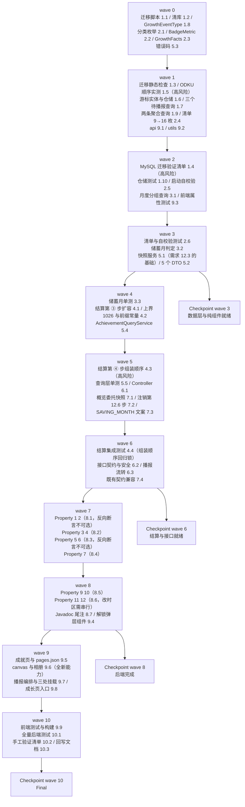

# Implementation Plan: 成就系统

## Overview

本 spec 是 growth-level-system 的一次扩容，因此实施顺序与它一致：**后端先行、由内向外**。
数据层（迁移 + 实体 + 仓储）→ 无外部依赖的纯组件（分类枚举、清单扩容 + 启动自校验）→
新增事实源（储蓄月判定、两条聚合查询）→ 结算集成 → 快照服务（需求 12.3 的构造性基础）→
查询层与控制器 → 改造既有代码（概览徽章派生、注销序列）→ 后端属性测试 → miniapp。
每完成一组运行 `./mvnw test`；前端改动完成后运行 `npm run test` 与 H5 构建。

**改造既有代码的 6 处必须一次改完再跑测试**：`GrowthBadgeCatalog`（9→16）、`BadgeMetric`（5→8，
含 `BUDGET_MET_EVENT` 改名）、`GrowthFacts`（5→8 分量）、`GrowthSettlementService`（第 ③④ 步 + 上界）、
`GrowthQueryService`（`assembleBadges` 委托快照服务）、`AccountDeletionService`（第 12.6 步）。
其中 `BadgeMetric` 与 `GrowthFacts` 是 record / enum 的签名变更，会让既有
`GrowthBadgeCatalogTest` 等测试编译失败——这是预期的，任务 2.4 负责同步更新。

四处高风险实现点单独立任务、单独验证：
**ODKU 的赋值求值顺序**（任务 1.5 的 `updated_at` 必须写在 `last_notified_event_id` 之前，
配任务 8.7 的反向断言）、
**`BADGE` 必须排在 `SAVING_MONTH` 之后组装**（任务 4.3，否则 `SAVING_MASTER` 无法与第 3 个储蓄月同次解锁）、
**迁移脚本在真实 MySQL 上的 CHECK 替换与游标回填**（任务 1.3 + 1.4，走 `deploy/dev-remote-db.sh`）、
**canvas 是全新能力**（任务 9.6，无既有范本，必须真机验证）。

## Tasks

- [x] 1. 数据层：迁移脚本、实体与仓储
  - [x] 1.1 新增迁移脚本 `V33__achievement.sql`
    - **开始时先重新核对 `src/main/resources/db/migration` 目录当前最大版本号与 `V30` 的占用情况**：设计定为 `V33__achievement.sql`（撰写设计时最大为 `V32__user_growth.sql`，`V30` 是历史缺号且已由 user-feedback-system spec 预占）；若届时占用情况有变，按「大于目录内全部已存在版本号且未被任何迁移文件或其它 spec 预占的最小值」重算。**不得占用缺号 V30**——已迁移环境会因此出现 Flyway out-of-order 失败
    - 不修改、不重命名、不删除任何已存在的迁移文件
    - `CREATE TABLE achievement_notices`：恰好 4 列、主键 `user_id`（**不声明 `AUTO_INCREMENT`、不声明 `DEFAULT`**、不另建自增代理键、不为 `user_id` 另加唯一约束）、`last_notified_event_id BIGINT NOT NULL DEFAULT 0`、两个 `DATETIME NOT NULL`（**均不声明 `DEFAULT`、不声明 `ON UPDATE`**）、CHECK `ck_achievement_notices_event_id`（`>= 0`）、**除主键外无其它索引**
    - **无任何指向 `users(id)` 的外键**（与 `user_growth` 同一取舍：注销时由服务层显式删除）
    - InnoDB + `utf8mb4` + `utf8mb4_unicode_ci`；4 个列注释 + 1 个表注释全部为中文（写法对齐 `V32__user_growth.sql`）
    - `ALTER TABLE growth_events DROP CONSTRAINT ck_growth_events_type;` 后 `ADD CONSTRAINT` 同名约束，取值集合从 6 个扩到 7 个（新增 `SAVING_MONTH`），表达式内**保留显式 `COLLATE utf8mb4_bin`**（写法与 `V32` 逐字一致）
    - `ALTER TABLE growth_events MODIFY COLUMN event_type` 同步更新中文注释，把 `SAVING_MONTH` 列进类型清单；**列类型、可空性、长度一字不改**（`VARCHAR(16)` 容得下 12 字符的 `SAVING_MONTH`）
    - 游标回填：`INSERT INTO achievement_notices SELECT user_id, MAX(id), NOW(), NOW() FROM growth_events WHERE event_type COLLATE utf8mb4_bin = 'BADGE' GROUP BY user_id`；**不为没有 `BADGE` 行的用户回填**（游标缺失按 0 处理，语义等价且省一行）
    - 脚本**不修改、不删除** `growth_events` 与 `user_growth` 的任何已存在行的任何列取值
    - 脚本头部中文注释写明：不建成就表、播报语义是「至少一次」（游标只增不减）、无外键是刻意选择、回填的理由（否则存量用户升级后第一次打开小程序会被 9 枚历史成就连续轰炸）
    - _Requirements: 10.1, 10.2, 10.3, 10.4, 10.5, 10.7, 10.8, 10.9, 10.10, 10.11_

  - [x] 1.2 清库脚本 `deploy/reset-db.sql` 增加游标表
    - 在 `TRUNCATE TABLE users` 之前、成长两表之后插入 `TRUNCATE TABLE achievement_notices;`，并加一行注释说明该表无外键、清空不依赖 `FOREIGN_KEY_CHECKS` 取值（注释风格对齐既有成长两表那两行）
    - 不新增任何针对 `flyway_schema_history` 的语句
    - _Requirements: 10.14_

  - [x] 1.3 迁移目录静态检查测试*
    - **复用既有 `MigrationDirectoryTest` 与 `src/test/resources/db/migration-baseline.sha256` 机制**：把新脚本纳入基线，断言新脚本存在且版本号大于全部既有版本、目录内版本号无重复、历史迁移文件内容未被改动
    - _Requirements: 10.9, 10.10_

  - [x] 1.4 在真实 MySQL 上执行迁移验证清单
    - 走 `bash deploy/dev-remote-db.sh` 连测试库（或本地 MySQL 建临时库全量 V1→V33）执行迁移，逐项核对 `information_schema`：
      `columns`（`achievement_notices` 恰好 4 列，逐列断言类型 / 可空性 / 缺省值 / 中文注释非空；**`user_id` 的 `EXTRA` 不含 `auto_increment`**、两个 `DATETIME` 列的 `EXTRA` 不含 `on update`）、
      `statistics`（**恰好 1 个索引即 `user_id` 单列主键**）、
      `table_constraints` + `check_constraints`（`ck_achievement_notices_event_id` 存在；`ck_growth_events_type` 的 `CHECK_CLAUSE` 含 `utf8mb4_bin` 且含 7 个取值）、
      `referential_constraints`（**`achievement_notices` 外键数为 0**）、
      `tables`（引擎 InnoDB / 排序规则 `utf8mb4_unicode_ci` / 表注释非空）
    - **CHECK 替换实测**：插入 `event_type = 'SAVING_MONTH'` 通过；`'saving_month'`、`'Badge'`、`'BADGE '`（带尾空格）、`''`、`'FOO'` 各一条断言被 `ERROR 3819` 拒绝；`UPDATE ... SET event_type = 'saving_month'` 同样被拒；被拒后表行数与全部列取值逐行不变
    - **CHECK 违例被拒时保持原值**：对已存在行执行越界 `UPDATE` 后重读该行，断言全列不变
    - **`last_notified_event_id = -1` 的插入与更新**被 `ck_achievement_notices_event_id` 拒绝，目标行原值不变
    - **游标回填正确性**：迁移前造若干用户（有 `BADGE` 行 / 只有非 `BADGE` 行 / 无任何成长事件三类），迁移后断言 `achievement_notices` 行数恰好等于有 `BADGE` 行的去重用户数，且每行 `last_notified_event_id` 等于该用户最大 `BADGE` 事件 `id`、`created_at` 与 `updated_at` 相等
    - 存量数据不受影响：迁移前后 `growth_events` 与 `user_growth` 行数相同、若干行快照逐列相同
    - 幂等性：连续两次启动应用，`flyway_schema_history` 中该版本记录数为 1，`achievement_notices` 行数与列定义与第一次执行后完全一致
    - 以生产配置（Hibernate `ddl-auto=validate`）在迁移后的库上启动应用，启动成功且无表结构校验失败信息
    - 执行 `deploy/reset-db.sql` 后断言 `achievement_notices` 行数为 0、表仍存在、列定义不变、`flyway_schema_history` 记录数不变
    - **在 design.md 的「Data Models / 迁移 `V33__achievement.sql`」小节补记实测所用 MySQL 版本号与上述每项的实际结论**（格式对齐 growth-level-system 设计文档 `V32` 的实测结论块）
    - _Requirements: 10.5, 10.6, 10.7, 10.8, 10.9, 10.12, 10.13, 10.15, 10.16, 10.17, 10.18_

  - [x] 1.5 实测 ODKU 的赋值求值顺序并回写设计文档
    - 在目标 MySQL 版本上实测游标推进语句（见 design.md「5. 播报游标」）：`updated_at` 的 `CASE WHEN ? > last_notified_event_id` 写在 `last_notified_event_id = GREATEST(...)` **之前**时，推进游标会同时推进 `updated_at`
    - **反例验证**：把两句顺序调换后重跑同一组数据，断言 `updated_at` 不再推进——用于证明「赋值按书写顺序从左到右求值」这条依赖是真实存在的，而非猜测
    - 实测 `GREATEST` 在重复确认（传入 ≤ 当前值）时保持 `last_notified_event_id` 与 `updated_at` 两列均不变
    - **在 design.md 的「5. 播报游标」小节补记实测版本号与两项结论**
    - _Requirements: 5.7, 5.8, 5.9, 5.11_

  - [x] 1.6 新增 `AchievementNotice` 实体与 `AchievementNoticeRepository`
    - `AchievementNotice`：`@Id @Column(name = "user_id")` 且**刻意不加 `@GeneratedValue`**；类级 Javadoc 写明原因（与 `UserGrowth` 同构：加了会让 Hibernate 认为该值由库分配、忽略我们写入的 `userId` 并要求一个自增列，与 DDL 冲突），并写明「因此推进游标不走 `save()` 而走 `JdbcTemplate` 的 ODKU + `GREATEST`，把单调性、幂等性与并发安全三条压到一条 SQL 里」
    - `userId` 声明为**裸 `Long`**，不得映射为 `@ManyToOne User`（表上无外键，关联映射会诱导后续开发者补外键）
    - `AchievementNoticeRepository`：只需 `findById`（继承）与 `@Modifying` 的 `deleteByUserId`；Javadoc 写明「不提供任何单行写入方法」以免有人绕开 ODKU 写出「先查再写」的竞态路径
    - _Requirements: 10.1, 10.4, 10.12, 11.1_

  - [x] 1.7 `GrowthEventRepository` 新增 3 个只读查询
    - `findPendingBadgeEvents(userId, cursor, Pageable)`：`event_type = 'BADGE' AND id > :cursor ORDER BY id ASC`，调用方传 `PageRequest.of(0, 10)`
    - `countPendingBadgeEvents(userId, cursor)`：给的是**截断前**的全部待播报条数
    - `maxBadgeEventId(userId)`：`COALESCE(MAX(id), 0)`，无 `BADGE` 行时返回 0，是 `lastEventId` 上界校验的唯一依据
    - 三个查询走既有索引 `idx_growth_events_user_type (user_id, event_type)`，**不新增任何索引**
    - Javadoc 提醒：JPQL 里的 `'BADGE'` 字面量必须与 `GrowthEventType.BADGE` 保持一致（JPQL 无法引用 Java 常量）
    - _Requirements: 5.2, 5.4, 5.5, 5.6, 5.14_

  - [x] 1.8 `GrowthEventType` 新增 `SAVING_MONTH` 常量
    - 加 `public static final String SAVING_MONTH = "SAVING_MONTH";`
    - 类级 Javadoc 补一句：该常量集合必须与迁移脚本 `ck_growth_events_type` 的取值集合逐项一致，改动时两处必须一起改
    - _Requirements: 10.5, 4.2_

  - [x] 1.9 `LedgerMemberRepository` 与 `TransactionRepository` 各新增 1 个查询
    - `LedgerMemberRepository.countEditorsOfOwnedLedgers(userId)`：`JOIN ledgers l ON l.id = m.ledger_id WHERE l.user_id = :userId AND m.role = 'EDITOR' AND m.user_id <> :userId`，**按成员行计数不去重用户**；Javadoc 写明三条排除（`OWNER` 行、本人行、本人加入他人账本的行）与「账本归属只认 `ledgers.user_id`」
    - `TransactionRepository.countTravelExpenses(userId)`：`nativeQuery = true`，`JOIN categories c ON c.id = t.category_id LEFT JOIN categories p ON p.id = c.parent_id`，条件含 `t.created_by = :userId`、`t.type = 'expense'`、`t.deleted_at IS NULL`、`t.ledger_id IS NOT NULL`、`(c.kind = 'EXPENSE' AND TRIM(c.name) = '旅行') OR (p.kind = 'EXPENSE' AND TRIM(p.name) = '旅行')`
    - `countTravelExpenses` 的 Javadoc 必须写明四点：① 归属只认 `created_by`，**不用 `t.user_id`**（`V9` 之后的历史遗留列，可空）；② 名称用 `TRIM(name) = '旅行'` **逐字符相等，绝不用 `LIKE '%旅行%'`**（「旅行保险」不该算进旅行达人）；③ `kind` 用普通 `=` 而**不加 `COLLATE utf8mb4_bin`**，因为库里只有大写两种取值、加 COLLATE 会让查询在 H2 测试库直接报错；④ 与 `categories` 是 1:1 join，因此同一交易至多被计 1 次，且 `categories` 只有一层 `parent_id`，`LEFT JOIN` 一次即覆盖父子两种情形，**不需要递归 CTE**
    - 两个查询均**不新增任何列与索引**
    - _Requirements: 3.3, 3.4, 3.5, 3.9, 3.10, 3.11_

  - [x] 1.10 仓储层映射与查询单元测试*
    - H2 上断言 `AchievementNotice` 实体与表结构一致；以显式 `userId` 保存后可按主键读回；`deleteByUserId` 在无行时影响行数为 0 且不抛错
    - `maxBadgeEventId` 无 `BADGE` 行时返回 0；`countPendingBadgeEvents` 在 cursor 等于最大 id 时返回 0
    - `countEditorsOfOwnedLedgers`：造「同一人加入本人 2 个账本」断言返回 2；造 `OWNER` 行、本人行、本人加入他人账本的行断言均不计入
    - `countTravelExpenses`：造「旅行」父分类交易 + 子分类交易 + 「旅行保险」分类交易 + 软删交易 + `ledger_id` 为 NULL 的交易 + `income` 交易，断言只有前两类被计入且同一交易只计 1 次
    - _Requirements: 3.3, 3.4, 3.9, 3.10, 5.5, 5.6, 11.3_

- [x] 2. 清单扩容与分类枚举（纯组件，无外部依赖）
  - [x] 2.1 新增 `AchievementCategory` 枚举
    - 五个取值 `START/STREAK/VOLUME/SOCIAL/THEME`，各带中文展示名「起步」「坚持」「积累」「协作」「主题」，暴露 `label()`
    - 类级 Javadoc 写明：**接口下发的是 `label()` 而非枚举 code**，因为需求 1.3 禁止在 miniapp 里重复定义分类、需求 9.3 又要求分组展示中文名，只有把中文名随响应下发两条才能同时成立；枚举 code 保持服务端内部使用
    - _Requirements: 1.1, 1.8, 6.2, 9.3_

  - [x] 2.2 `BadgeMetric` 从 5 个取值扩到 8 个
    - 新增 `SAVING_MONTH_COUNT`、`COLLAB_MEMBER_COUNT`、`TRAVEL_RECORD_COUNT`
    - **`BUDGET_MET_EVENT` 改名为 `BUDGET_MET_COUNT`**（布尔语义 → 计数语义）；枚举 Javadoc 写明：该枚举不落库、只在内存使用，因此改名零数据影响；门槛 1 加「取值 ≥ 门槛」与「存在至少一条 `BUDGET_MET` 事件」判定结果逐例相同
    - _Requirements: 1.1, 1.5, 3.6, 3.7_

  - [x] 2.3 `GrowthFacts` 从 5 分量扩到 8 分量
    - 新签名 `(long recordCount, int maxStreakDays, int totalRecordDays, long budgetMetCount, boolean firstInviteEvent, long savingMonthCount, long collabMemberCount, long travelRecordCount)`；`EMPTY` 同步更新
    - `budgetMetEvent`（boolean）→ `budgetMetCount`（long）
    - 类级 Javadoc 写明：**本 record 就是需求 3.16 要求的「每个统计口径在单次结算 / 单次请求内只求值一次」的载体**，任何新增口径都应加成它的一个分量而不是在调用点各自查一次
    - _Requirements: 3.1, 3.6, 3.7, 3.8, 3.12, 3.13, 3.16_

  - [x] 2.4 `GrowthBadgeCatalog` 清单 9 → 16 枚 + `BadgeDef` 扩字段
    - `BadgeDef` 新签名 `(String code, String name, String description, AchievementCategory category, int target, BadgeMetric metric)`
    - 按 design.md「1. 成就清单常量」的 16 行表格逐行填入；**既有 9 枚的 code / name / target 一字不改**（已解锁用户零数据迁移）
    - `metricValue` 的 `switch` 补三个新分支；`BUDGET_MET_EVENT` 分支改为 `facts.budgetMetCount()`
    - `qualified` 与 `currentOf` 逻辑**不变**（遍历整份清单、各判定之间没有 `else`、`max(0, min(值, target))` 三条钳制），只是清单变长
    - 同步更新既有 `GrowthBadgeCatalogTest`：`BUDGET_MET_EVENT` 改名、9 枚断言改 16 枚、`BadgeDef` 构造参数增加
    - 类级 Javadoc 补一段：清单从 9 扩到 16 枚、新增五个分类、`BADGE:` 前缀与命名空间隔离规则不变
    - _Requirements: 1.1, 1.2, 1.3, 1.4, 1.5, 1.6, 1.7, 1.8, 1.9, 1.10, 2.2, 6.4_

  - [x] 2.5 `GrowthBadgeCatalog` 启动自校验
    - `@PostConstruct` 断言：恰好 16 项；16 个 code 两两不同；16 个 name 两两不同且长度 ∈ [2, 10] 个 Unicode 码点；16 条 description 两两不同、长度 ∈ [6, 30] 个码点、且 target > 1 时含该门槛数值的十进制写法；`target ∈ [1, 1000]`；存在型口径（`FIRST_INVITE_EVENT`）的 target 恒为 1；同分类连续出现且分类首现顺序为 `START/STREAK/VOLUME/SOCIAL/THEME`
    - 任一条不成立抛 `IllegalStateException`，**消息指明首个违规项**（编码 + 违反的规则），使应用启动失败
    - Javadoc 写明理由：清单缺陷在启动即暴露，绝不以一份错误清单对外服务
    - **长度一律按 Unicode 码点计**（`String.codePointCount`），不用 `String.length()`——中文在 UTF-16 下多数是 1 个 char，但描述里若出现 emoji 或生僻字就会是 2 个 char，用 `length()` 会误判
    - _Requirements: 1.2, 1.3, 1.9, 1.13_

  - [x] 2.6 清单与自校验单元测试*
    - `GrowthBadgeCatalogTest` 扩展：16 项、顺序即展示顺序、同分类连续、分类首现顺序、既有 9 枚取值与 `V32` 时期逐项相同、两次调用 `badges()` 顺序恒同
    - `currentOf` 三条规则：已解锁恒等 target、未解锁取 `min`、结果恒落 `[0, target]`（含负统计量钳到 0、`Long.MAX_VALUE` 不溢出）
    - `eventKeyOf`：`null` / 空白抛 `IllegalArgumentException`
    - 新增 `AchievementCatalogSelfCheckTest`：用反射或子类注入构造六类缺陷清单（项数错 / 重复 code / 重复 name / 描述超长 / target 越界 / 分类不连续），断言自校验各自抛错且消息指明违规项
    - _Requirements: 1.1~1.9, 1.13, 6.4_

- [x] 3. 储蓄月判定
  - [x] 3.1 新增 `TransactionRepository.sumMonthlyAmountsByCreatedByGroupByMonthAndType`
    - `nativeQuery = true`，`SELECT YEAR(occurred_at), MONTH(occurred_at), type, COALESCE(SUM(amount), 0) ... GROUP BY YEAR(occurred_at), MONTH(occurred_at), type`
    - 条件：`created_by = :userId`、`deleted_at IS NULL`、`ledger_id IS NOT NULL`、`type IN ('expense','income')`、`occurred_at >= :fromInclusive AND occurred_at < :toExclusive`
    - Javadoc 写明三点：① 用 `YEAR()`/`MONTH()` 而**不用 `DATE_FORMAT`**，因为前者在 MySQL 与 H2 `MODE=MySQL` 上行为一致、后者在 H2 上的支持随版本漂移；② `type IN (...)` 顺带排除了 `transfer`；③ 一条查询覆盖 3 个回看月 × 2 个类型，是需求 4.11「读查询 ≤3 条」的组成部分
    - **一条查询，不按月循环**
    - _Requirements: 4.6, 4.7, 4.11_

  - [x] 3.2 新增 `GrowthSavingMonthEvaluator`
    - 与 `GrowthBudgetEvaluator` 同构：`@Component`、`LOOKBACK_MONTHS = 3`、`savingMonths(Long userId, LocalDate settleDate, Set<String> existingKeys)` 返回升序 `YYYY-MM` 列表
    - 回看窗口 = `settleDate.withDayOfMonth(1)` 往前 1/2/3 个月，**不判结算日所属月**；跨年由 `LocalDate.minusMonths` 天然处理（1 月 → 上年 10/11/12 月）
    - `fromInclusive` = 最早回看月 1 日 `00:00:00.000`（用 `atStartOfDay()`），`toExclusive` = 结算日所属月 1 日 `00:00:00.000`；恰好落在右边界的交易归次月（半开区间的直接结果）
    - 判定：`收入 >= 0.01 && 结余 >= 储蓄门槛值`，其中 `储蓄门槛值 = 收入.multiply(0.2).setScale(2, HALF_UP)`；**引入具名中间量而不是内联表达式**，Javadoc 写明理由（收入 `333.33` 时门槛是 `66.67` 而非 `66.666`，否则两名测试者在边界上会得出不同结论）
    - 全程 `BigDecimal` + `compareTo`，**不使用 `double`/`float`**；查询无结果的月份按 `0.00` 计并判为不是储蓄月
    - 存在性判定用传入的 `existingKeys`（前缀 `SAVING_MONTH:`），**不新增任何查询**
    - 判定不成立时不返回该月、不写任何负向标记
    - _Requirements: 4.1, 4.2, 4.3, 4.4, 4.5, 4.6, 4.7, 4.8, 4.10, 4.11, 4.20_

  - [x] 3.3 储蓄月判定单元测试*
    - 边界：收入 `0.00` / `0.009` / `0.01`；结余恰好等于门槛（取等号成立）、门槛 −0.01、负结余
    - 舍入：收入 `333.33` → 门槛 `66.67`；收入 `0.05` → 门槛 `0.01`
    - 回看窗口：结算日在 1 月时回看上年 10/11/12 月；结算日在 3 月 1 日 `00:00:00.000` 时不判 3 月
    - 月归属：`occurred_at` 恰好等于次月 1 日 `00:00:00.000` 的交易归次月；等于本月 1 日 `00:00:00.000` 的归本月
    - 排除：`deleted_at` 非空、`ledger_id` 为 NULL、`type = 'transfer'` 三类不计入
    - 幂等：`existingKeys` 已含某月时该月不再返回
    - `event_key` 格式 `SAVING_MONTH:YYYY-MM` 且长度恒为 20
    - _Requirements: 4.1~4.10, 4.20_

- [x] 4. 结算集成
  - [x] 4.1 `GrowthSettlementService` 注入新依赖并扩容第 ③ 步
    - 构造注入新增 `GrowthSavingMonthEvaluator`、`LedgerMemberRepository`（若尚未注入）
    - 第 ③ 步新增恰好 **3 条**读查询：`savingMonthEvaluator.savingMonths(...)`、`memberRepository.countEditorsOfOwnedLedgers(...)`、`transactionRepository.countTravelExpenses(...)`
    - `budgetMetCount` 与 `savingMonthCount` 由已读回的 `existingKeys` 做前缀计数并加上本次新判定的月份数得出，**零新增查询**（既有 `findEventKeysByUserId` 已把该用户全部事件键一次读完）
    - 抽一个私有 `countPrefix(Set<String> keys, String prefix)` 工具，替换既有 `anyKeyStartsWith` 的两处调用之一（`BUDGET_MET` 侧改为计数，`FIRST_INVITE` 侧仍是存在型）
    - 组装 8 分量 `GrowthFacts`
    - _Requirements: 3.1, 3.6, 3.7, 3.8, 4.11, 4.13_

  - [x] 4.2 新增 `SAVING_MONTH_PREFIX` 常量与上界更新
    - `private static final String SAVING_MONTH_PREFIX = "SAVING_MONTH:";`
    - `MAX_PENDING_EVENTS` 1016 → **1026**，注释同步更新为 `1000 + 1 + 2 + 3 + 1 + 3 + 16`
    - 既有「越界即抛 `IllegalStateException`」的断言保留不动
    - _Requirements: 4.2, 4.12_

  - [x] 4.3 第 ④ 步插入 `SAVING_MONTH` 组装，且必须在 `BADGE` 之前
    - 组装顺序改为：`DAILY_RECORD`(升序) → `FIRST_RECORD` → `STREAK_7` → `STREAK_30` → `BUDGET_MET` → `FIRST_INVITE` → **`SAVING_MONTH`(≤3, exp 0)** → `BADGE`(≤16, exp 0)
    - **在代码里写一条注释解释这个顺序为什么不能改**：`SAVING_MONTH` 必须先进 `pending`，`savingMonthCount` 才能把本次新判定的月份计入 `facts`，`SAVING_MASTER` 才能在同一次结算内与第 3 个储蓄月一起解锁（需求 2.6 的跨门槛不漏发）
    - `qualified` 返回 `LinkedHashSet` 且按清单序号升序，因此同批 `BADGE` 事件 `id` 相对大小与展示序号一致（需求 2.6 后半句），播报顺序随之确定——同样写进注释
    - `SAVING_MONTH` 与 `BADGE` 的 `expAmount` 参数一律传 `0`
    - 既有三条硬约束一字不改：`settle` 内不 catch 任何异常、`REQUIRES_NEW` 不改 `REQUIRED`、批量插入只用 `ON DUPLICATE KEY UPDATE id = id`（**绝不 `INSERT IGNORE`**）
    - _Requirements: 2.1, 2.6, 2.12, 2.14, 4.2, 4.13, 4.18, 4.19_

  - [x] 4.4 结算集成集成测试*
    - 造 3 个储蓄月的交易 → 一次结算内同时写入 3 条 `SAVING_MONTH` 与 `BADGE:SAVING_MASTER`（**这是任务 4.3 顺序约束的回归锁**）
    - 造笔数从 0 一跃到 1200 → 一次结算内写入 `FIRST_RECORD`/`RECORD_10`/`RECORD_100`/`RECORD_500`/`RECORD_1000` 五枚 `BADGE`，且 `id` 序与展示序号一致
    - 造连续天数从 0 跃到 400 → 四枚 `STREAK_*` 成就一枚不漏
    - 用查询计数拦截器断言新增读 SQL 恒为 3 条，且在账本 1→20 个、分类 1→200 个、交易 1→10000 笔时条数不变
    - 断言单次结算写入事件数 ≤1026
    - 断言解锁任意数量成就后 `exp` 与 `level` 与写入前逐项相等
    - 注入故障（让 `countTravelExpenses` 抛异常）断言：`REQUIRES_NEW` 事务整体回滚、三表无部分写入、`[GROWTH_SETTLE_FAILED]` WARN、记账接口状态码与响应字段集不变且不含成就字段；再次结算补齐
    - _Requirements: 2.6, 4.11, 4.12, 4.14, 4.15, 4.16, 1.11_

- [x] 5. 快照服务与查询层
  - [x] 5.1 新增 `AchievementSnapshotService`
    - `snapshot(Long userId)` 返回一个 `AchievementSnapshot(GrowthFacts facts, Map<String, GrowthEvent> unlockedByCode)`
    - 一处求值八个统计口径：`recordCount` 与两条新增聚合走仓储；`maxStreakDays`/`totalRecordDays` 取 `user_growth` 物化列（无档案时取 0）；三个计数 / 存在型口径由 `findEventKeysByUserId` 的结果前缀计数得出
    - `unlockedByCode` 由 `findBadgeEvents(userId)` 构建，key 是 `event_key` 去掉 `BADGE:` 前缀后的编码，value 是整行（供解锁时刻与成就事件 id）
    - **未知 `BADGE` 行的处理**：`event_key` 去前缀后不在清单内的行一律忽略、记一条含用户 id 与该 `event_key` 的 WARN、不报错、不改动该行
    - **单个聚合查询抛异常的降级**：该口径本次取 0、记一条含用户 id 与口径名的 WARN、其余口径照常返回、不向上抛（这条降级**只用于查询路径**；结算路径下异常必须穿出以回滚事务，Javadoc 里要写明这个分工）
    - 类级 Javadoc 写明：**本服务是需求 12.3「概览徽章列表与成就清单逐项相等」构造性成立的唯一基础**——两条读取路径必须都经过它，任何绕过它自行组装 facts 的代码都会让那条不变式退化成「靠测试凑巧对上」
    - _Requirements: 3.1~3.14, 3.16, 1.12, 6.4, 12.3_

  - [x] 5.2 新增 5 个响应 DTO（`service` 包，沿用既有 DTO 放 service 包的约定）
    - `AchievementListResponse(List<AchievementView> achievements, int unlockedCount, int total)` —— 顶层恰好 3 项
    - `AchievementView(String code, String name, String description, String category, int target, int current, boolean unlocked, LocalDateTime unlockedAt, Long eventId)` —— 恰好 9 项；`unlockedAt` 与 `eventId` 用**包装类型**使未解锁时为空值；键在全部 16 项上恒存在
    - `PendingAchievementResponse(List<PendingAchievementItem> items, long total)` —— 顶层恰好 2 项
    - `PendingAchievementItem(String code, String name, String description, String category, LocalDateTime unlockedAt, Long eventId)` —— 恰好 6 项，同名字段与 `AchievementView` 逐项相等
    - `AchievementAckRequest(String lastEventId)` / `AchievementAckResponse(long lastNotifiedEventId)`
    - `AchievementAckRequest.lastEventId` 声明为 **`String`**；Javadoc 写明理由（与 `GrowthController` 把 `page`/`size` 声明为 `String` 同一个理由：交给 Jackson 做类型转换，`"abc"` 会在进入方法体之前抛 `HttpMessageNotReadableException` → `REQUEST_BODY_INVALID`，既绕过「令牌用户仍存在」校验也违背需求 5.12；Jackson 会把 JSON 数字 `12` 也收成 `"12"`，故客户端传数字或字符串都能工作）
    - `category` 字段承载的是 `AchievementCategory.label()` 中文名；在 `AchievementView` 的 Javadoc 里写明理由
    - 全部 DTO 不含 `email`/`wx_openid`/`wx_unionid`/`invite_code`/`plan`/`role` 六个字段，也不含任何金额字段
    - _Requirements: 6.1, 6.2, 6.3, 6.12, 5.4, 5.7, 5.12_

  - [x] 5.3 `ApiException` 新增唯一错误码工厂方法
    - `achievementAckParamInvalid()` → `("ACHIEVEMENT_ACK_PARAM_INVALID", HttpStatus.BAD_REQUEST, "播报游标取值不合法", "lastEventId")`
    - 放在按域分组的注释块下（沿用既有 `// ---- 常用工厂方法（Xxx 域） ----` 风格）
    - `message` 中文、≤100 字符、**不含用户 id / 邮箱 / 令牌**
    - **本 spec 只新增这一个错误码**：结算失败、结算被节流、空待播报列表均不对外暴露错误码——在方法 Javadoc 里写明（沿用成长体系 `growthPageParamInvalid` 处的先例注释）
    - _Requirements: 6.13, 5.12_

  - [x] 5.4 新增 `AchievementQueryService`
    - `getAchievements(Long userId)`：① `try { settlementService.settle(userId, TriggerSource.OVERVIEW) } catch (Exception e) { log.warn("[GROWTH_SETTLE_FAILED] ...") }` → ② `snapshotService.snapshot(userId)` → ③ 遍历 `catalog.badges()` 投影成 16 个 `AchievementView` → ④ `unlockedCount` = 已解锁项个数
    - **不加 `@Transactional`**；Javadoc 写明理由（与 `GrowthQueryService.getOverview` 同一理由：处在结算事务边界之外，加事务会把「吞异常」挪进事务上下文、破坏隔离）
    - 结算失败或被节流时 ②③④ 照常执行，字段集与成功时相同，三表行数与列取值不变
    - **复用 `TriggerSource.OVERVIEW` 与既有 `GrowthSettlementThrottle`，不新增节流器**
    - `getPending(Long userId)`：读游标（无行按 0）→ `findPendingBadgeEvents(..., PageRequest.of(0, 10))` + `countPendingBadgeEvents(...)`；**不触发结算、不向 `growth_events`/`user_growth` 写任何语句**；total 是截断前条数；未知编码的行忽略
    - `ack(Long userId, String rawLastEventId)`：解析 → 校验（`null`/空白/不可解析/`< 0`/`> maxBadgeEventId` 一律抛 `achievementAckParamInvalid()`）→ 执行 ODKU + `GREATEST` 单条语句 → 返回推进后取值（重新读一次游标行，因为 `GREATEST` 的结果只有库知道）
    - ODKU 语句里 **`updated_at` 的赋值必须写在 `last_notified_event_id` 之前**，并在代码注释里写明「MySQL 的 ODKU 赋值按书写顺序从左到右求值，调换顺序会让 `updated_at` 永不推进」（任务 1.5 已实测）
    - 数据库访问抛异常时：记一条含用户 id 的 WARN、保持游标表不变、不向记账/登录/注销路径传播
    - _Requirements: 5.1~5.19, 6.1~6.7, 6.14, 1.12, 3.14_

  - [x] 5.5 查询层单元测试*
    - `AchievementSnapshotServiceTest`：八个口径各自取值正确；每口径只求值一次（用 Mockito `verify(times(1))`）；单个聚合抛异常时该口径取 0、其余照常、不抛出；未知 `BADGE` 行被忽略且列表仍 16 项
    - `AchievementAckParamTest`：`null` / `""` / `"  "` / `"abc"` / `"1.5"` / `"-1"` / `maxId + 1` 全部抛 `ACHIEVEMENT_ACK_PARAM_INVALID` 且 `field == "lastEventId"`；`"0"`（无 `BADGE` 行）与 `maxId` 通过；`" 12 "`（带空白）按 12 解析
    - _Requirements: 3.14, 3.16, 1.12, 5.12, 5.13_

- [x] 6. 接口层
  - [x] 6.1 新增 `AchievementController`
    - `@RestController @RequestMapping("/api/achievements")`，三个端点：`GET ""`、`GET "/pending"`、`POST "/notices/ack"`
    - 每个端点第一步调私有 `requireExistingUserId()`（照抄 `GrowthController` 的写法：`currentUser.requireUserId()` + `userRepository.findById(userId).orElseThrow(ApiException::unauthenticated)`），且该校验**先于**结算、入参校验与任何聚合查询；单次请求内至多执行 1 次
    - 控制器只做「令牌用户仍存在」校验与 DTO 转发，**不含任何业务判定**
    - 类级 Javadoc 写明：过滤链只验签不查库，「令牌合法但用户已注销」的缺口只能在这里补；三个端点与会话账本无关，**不要求也不检查 `X-Ledger-Id`**；`SecurityConfig` 不改动（`/api/achievements/**` 落在 `anyRequest().authenticated()`）
    - 忽略请求中任何用于指定目标用户身份的查询参数、路径参数、请求体字段与自定义请求头，且**不因携带此类字段而返回错误码**
    - 成就清单是写入型 GET（内含结算），**刻意不加任何 HTTP 缓存头**
    - _Requirements: 6.8, 6.9, 6.10, 6.11, 6.15_

  - [x] 6.2 接口契约与安全集成测试*
    - `AchievementApiContractIntegrationTest`：顶层恰好 3 项 / 视图恰好 9 项 / 待播报顶层 2 项 + 项 6 项 / ack 顶层 1 项；未解锁时 `unlockedAt` 与 `eventId` 的**键仍存在且为 null**（不省略、不用 0 / 空字符串 / 当前时刻替代）；响应不含 6 个敏感字段与任何金额字段；零数据新用户返回 16 项全未解锁、当前值全 0、`unlockedCount` 0、`total` 16 且不报错
    - `AchievementApiSecurityIntegrationTest`（照抄 `GrowthApiSecurityIntegrationTest` 的 `TestRestTemplate` + `Jwts` 手工签发范式，独立命名内存库）：无令牌 / 畸形 / 签名错 / 过期 / 已注销用户 → `UNAUTHENTICATED` 且响应不含任何成就数据、两表不变；`UNAUTHENTICATED` 优先于 `lastEventId` 非法（已注销用户 + `"abc"` 应返回 401 而非 400）；携带他人 user id 字段时结果与不携带逐项相同且不报错；不带 / 带任意 `X-Ledger-Id` 结果逐项相同；用户 A 的令牌读不到用户 B 的任何数据
    - 断言耗时：成就清单 ≤2000ms、待播报与 ack ≤2000ms
    - _Requirements: 6.1~6.5, 6.8~6.14, 6.16, 6.17, 6.18, 5.15_

  - [x] 6.3 播报流转集成测试*
    - `AchievementBroadcastIntegrationTest`：解锁 → pending 非空且按 `id` 升序 → ack → pending 为空且 total 0
    - 造 >10 项待播报：本次返回 `id` 最小的 10 项、`total` 为**截断前**条数、ack 后剩余项在后续请求返回
    - 查询不推进游标：连续两次 pending 请求返回相同项、相同顺序、相同 total；`achievement_notices` 行数与列取值不变
    - ack 幂等：传 ≤ 当前游标的值不改行、不报错、返回当前值；无游标行时首次 ack 创建行且 `created_at == updated_at`
    - 并发 8 个 ack 请求：终态等于全部合法取值与原值的最大者，行数终态为 1
    - _Requirements: 5.4, 5.5, 5.7~5.11, 5.16, 5.17, 5.18_

- [x] 7. 改造既有代码
  - [x] 7.1 `GrowthQueryService.assembleBadges` 改为委托快照服务
    - 删掉方法内自行构建 `GrowthFacts` 与 `unlockedAtByCode` 的两段代码，改为调用 `AchievementSnapshotService.snapshot(userId)`，再把快照投影成 16 个 `BadgeView`
    - 构造注入新增 `AchievementSnapshotService`；若 `growthEventRepository` / `transactionRepository` 因此不再被本类直接使用，一并清理
    - **`GrowthOverviewResponse` 顶层仍恰好 15 项、`BadgeView` 仍恰好 6 项**，一个字段不加不删不改名
    - 方法 Javadoc 补一段：改为委托是为了让需求 12.3 的「概览徽章列表与成就清单逐项相等」构造性成立，两条路径共用同一快照与同一份清单，**不存在两份独立实现可以漂移**
    - _Requirements: 12.1, 12.2, 12.3_

  - [x] 7.2 `AccountDeletionService` 注销序列插入第 12.6 步
    - 在既有第 12.5 步（成长两表硬删）之后、第 13 步（`userRepository.delete(user)`）之前插入 `achievementNoticeRepository.deleteByUserId(userId);`
    - 构造注入新增 `AchievementNoticeRepository`
    - **既有各步的相对顺序、过滤条件与影响行数一字不改**
    - 加注释（风格对齐既有 12.5 步）：无外键故数据库层无顺序约束，固定在这里只为可逐语句断言；无行时影响行数 0 即视为成功；**删除前不做任何存在性预查询**，不写软删除标记或归档副本；整个方法单事务，本步失败则整体回滚
    - _Requirements: 11.1, 11.2, 11.3, 11.4, 11.5_

  - [x] 7.3 `utils/growth.js` 的 `growthEventLabel` 新增 `SAVING_MONTH` 分支
    - `case 'SAVING_MONTH'`：带月份返回 `储蓄达成 ${month}`，无月份返回 `储蓄达成`；月份从 `event_key` 冒号后半段取，**不另发请求**
    - 既有 `default → '成长记录'` 兜底不动
    - 同步更新既有 `utils/growth.growthEventLabel.test.js`：七个已知类型各有互不相同的中文文案、未知类型仍走兜底
    - 经验明细接口本身的分页入参、排序与字段集**一字不改**
    - _Requirements: 12.5, 12.11_

  - [x] 7.4 既有契约兼容集成测试*
    - `AchievementOverviewParityIntegrationTest`：在零数据 / 部分解锁 / 全解锁 / 结算被节流的间隙态 / 结算失败的间隙态五种状态下，断言概览徽章列表第 N 项与成就清单第 N 项在 6 项上逐项相等（已解锁与未解锁都覆盖）；概览顶层仍 15 项、徽章项仍 6 项
    - 断言记账 / 预算 / 登录 / 注销 / 邀请五类接口的响应字段集与错误码不变，记账响应不含任何成就 / 播报 / 徽章字段
    - 断言经验明细返回 `SAVING_MONTH` 与 `BADGE` 行（`exp_amount = 0` 不被过滤）且计入总条数
    - 断言等级阈值函数与六类经验事件的经验值取值不变
    - `AchievementAccountDeletionIntegrationTest`：注销删游标行；无游标行时影响 0 且不中止；同邮箱重注册返回 16 项全未解锁 + 待播报 0 + 游标行 0；不影响其它用户三表；前置校验失败时游标表零副作用；注销前签发的令牌注销后请求三接口返回 `UNAUTHENTICATED` 且不创建孤儿游标行
    - _Requirements: 12.1~12.11, 11.1~11.11_

- [x] 8. 后端属性测试
  - [x] 8.1 Property 1 与 Property 2：幂等与单调*
    - `AchievementIdempotencyPropertyTest`：任意操作序列（长度 1–40，含 2–8 个结算在 1000ms 内并发）后，任一 `(user_id, 'BADGE:<编码>')` 行数 ∈ {0, 1}，首行 `id`/`event_type`/`exp_amount`/`created_at` 逐列不变（**读库比对，不是内存值**）
    - `AchievementMonotonicityPropertyTest`：任意含「软删某笔 / 清空回收站 / 改交易分类 / 把「旅行」分类改名或删除 / 下调删除预算 / 移除 `EDITOR` 成员 / 邀请关系置 `INVALID`」的序列后，已解锁成就数单调不减，全部 `BADGE` 行快照逐列相等
    - **反向断言**：把批量插入改为 `INSERT IGNORE` 时，「CHECK 违例必须抛错」的断言必须失败——锁死「只忽略重复键」这条实现约束
    - _Requirements: 2.1, 2.3, 2.4, 2.5, 2.7, 2.8, 2.9, 3.12_

  - [x] 8.2 Property 3 与 Property 4：当前值钳制与跨门槛*
    - `AchievementCurrentValuePropertyTest`：16 枚全枚举 × 口径取值 ∈ {负数, 0, 1, target−1, target, target+1, `Long.MAX_VALUE`} × `unlocked ∈ {true, false}`，断言 `0 ≤ current ≤ target`、已解锁恒等 target、未解锁等 `min`、永不为负永不溢出
    - `AchievementCrossThresholdPropertyTest`：任意跃迁下解锁集合 == `{code : metric ≥ target}`；同批 `BADGE` 事件 `id` 序与展示序号一致
    - _Requirements: 2.6, 2.12, 2.13, 3.13, 6.4_

  - [x] 8.3 Property 5 与 Property 6：经验不变与两接口一致*
    - `AchievementExpInvariantPropertyTest`：任意解锁 / 储蓄月组合后 `exp` 与 `level` 与写入前逐项相等；`exp == Σ expAmount`；含「同一次结算解锁 16 枚 + 写入 3 条储蓄月」的极端用例
    - **反向断言**：把任一 `BADGE` 或 `SAVING_MONTH` 的 `expAmount` 改成非 0 时本属性必须失败
    - `AchievementOverviewParityPropertyTest`：五种用户状态 × 两种调用顺序下六项逐项相等
    - _Requirements: 1.11, 12.3, 12.6_

  - [x] 8.4 Property 7：游标单调与并发*
    - `AchievementCursorMonotonicityPropertyTest`：请求序列（长度 1–30）取值 ∈ {`null`, `""`, `"abc"`, `"-1"`, `"0"`, 当前游标, ±1, maxId, maxId+1, 随机合法值} × 并发度 ∈ [1, 8] × 初始有/无游标行；断言单调不减、终态 == `max(合法取值 ∪ {初始值})`、行数 == 1、非法请求前后表快照逐列相等
    - _Requirements: 5.7~5.13_

  - [x] 8.5 Property 9 与 Property 10：查询条数与储蓄月算术*
    - `AchievementQueryCountPropertyTest`：账本 1–20 × 分类 1–200 × 交易 1–100000 × 成长事件 1–10000 的对数取样，断言新增读 SQL 条数恒为 3、总写入事件 ≤1026
    - `GrowthSavingMonthPropertyTest`：**另写一份朴素 `BigDecimal` 参考实现做等价性比对**（沿用 `GrowthCalendarScanPropertyTest` 的做法）；收入/支出取值含 `0`、`0.01`、`333.33`、`999999.99` 与随机 `DECIMAL(18,2)`；月份含跨年边界与闰年 2 月；断言取等号即成立、空收入按 `0.00`、键长恒 20
    - _Requirements: 4.1~4.5, 4.8, 4.10, 4.11, 4.12_

  - [x] 8.6 Property 11 与 Property 12：时区无关与故障隔离*
    - `SavingMonthTimezonePropertyTest`：默认时区 ∈ 8 个覆盖 UTC−12 到 UTC+14 的时区 × 结算时刻 ∈ {月首 `00:00:00.000`, 月首前 1ms, 月末 `23:59:59.999`, 1 月 1 日, 闰日} × 交易 `occurred_at` ∈ 月边界 ±1ms；断言全部结果与基准时区下逐项相同、恰好落在次月边界的交易归次月
    - `AchievementFaultIsolationPropertyTest`：故障点 ∈ {成就判定抛异常, 储蓄月判定抛异常, 单个聚合抛异常, 库里有未知 `BADGE` 行, 结算被节流, 行锁放弃} × 触发接口 ∈ {记账, 预算, 登录, 注销, 邀请}；断言状态码相等、响应键集合相等、记账响应不含成就/播报/徽章字段、三表无部分写入
    - _Requirements: 3.2, 4.6, 4.7, 4.14, 4.15, 4.16, 6.7, 12.4_

  - [x] 8.7 每个属性测试类补齐 Javadoc 尾注*
    - 每个 `*PropertyTest` 的类级 Javadoc 末尾固定两行（沿用成长体系既有格式）：
      `<p>Feature: achievement-system, Property N: <属性标题></p>`
      `<p>Validates: Requirements X.Y, X.Z</p>`
    - 与 design.md「Correctness Properties」的 12 条逐条对应，编号一致
    - _Requirements: 全部可属性化验收标准_

- [x] 9. miniapp
  - [x] 9.1 新增 `src/api/achievement.js`
    - `fetchAchievements()` / `fetchPendingAchievements()` / `ackAchievementNotices(lastEventId)`，三个方法**全部带 `noLedger: true`**
    - `ackAchievementNotices` 把入参转成 `String` 后放进请求体（服务端以 `String` 接收）
    - 模块头注释写明：成就数据与账本无关，全部成就请求收敛到本模块（对齐 `api/growth.js` 与 `api/invite.js` 的既有写法），不要在页面里另起 `http` 调用
    - _Requirements: 6.11, 9.12_

  - [x] 9.2 新增 `src/utils/achievement.js`（全部纯逻辑）
    - 常量：`ACHIEVEMENT_TOTAL = 16`、`PENDING_TIMEOUT_MS = 3000`、`LIST_TIMEOUT_MS = 10000`、`REFRESH_THROTTLE_MS = 3000`、`TOAST_DURATION_MS = 1500`、`TOAST_GAP_MS = 300`、`MODAL_EXIT_MS = 300`、`MAX_BROADCAST_ITEMS = 3`、`HIGHLIGHT_MS = 3000`、`CODE_MAX_LEN = 64`
    - `planBroadcast(items)` → `{ modal, toasts }`：第 1 项走弹层、第 2–3 项走 Toast、其余留待后续；畸形入参返回 `{ modal: null, toasts: [] }`
    - `ackCursorOf(shownItems)`：已展示项的最大 `eventId`；未展示任何项返回 `null`。**签名刻意只接受已展示子集**，Javadoc 写明这是需求 7.11「未播报的成就必须留在待播报集合内」的唯一防线
    - `groupByCategory(achievements)`：按 `category` 中文名分组，保持服务端返回的项顺序与分类首现顺序
    - `achievementProgressText(a)`：已解锁返回 `''`，否则 `` `${current} / ${target}` ``
    - `unlockedDateLabel(a)`：`LocalDateTime` 字符串 → `YYYY-MM-DD`；空值 / 畸形返回 `''`
    - `buildAchievementSharePayload(achievement)` → `{ title, path }`：`path` 为 `/pages/achievement/achievement?code=<encodeURIComponent(code)>`，`title` 含「有余」与成就名且长度 ≤30
    - `resolveHighlightCode(rawCode, achievements)`：解码 + 裁剪首尾空白 + 长度 >64 或不在清单内一律返回 `null`
    - `shouldRefresh(lastRequestAt, now)`：语义与 `utils/growth.js` 同名函数一致
    - 模块头注释写明：本模块只做算术与状态判定，不引入页面 / 请求 / store 依赖，因此能用 vitest + fast-check 直接测（`.vue` 里的逻辑测不到）；全部函数对畸形入参安全降级、**绝不抛出**
    - _Requirements: 7.6, 7.9, 7.11, 8.3, 8.10, 8.12, 9.3, 9.4, 9.5, 9.10_

  - [x] 9.3 `utils/achievement.js` 的属性测试*
    - `utils/achievement.planBroadcast-ackCursorOf.test.js`（**Property 8**）：`items` 长度 ∈ [0, 16]、`eventId` 严格递增；已展示前缀长度 ∈ [0, 3]；断言 `shown` 为空 ⇒ 返回 `null`，否则 `ack == max(shown.eventId)` 且 `ack < min(unshown.eventId)`；单次展示项数 ≤3
    - `utils/achievement.groupByCategory-progressText.test.js`：分组保序、分类首现顺序、已解锁不出进度文案、未解锁不出日期、畸形入参降级
    - `utils/achievement.sharePayload-highlightCode.test.js`：标题长度恒 ≤30 且含「有余」与成就名；`resolveHighlightCode` 对超长 / 空白 / 不在清单内的取值恒返回 `null`
    - _Requirements: 7.6, 7.9, 7.11, 8.3, 8.10, 8.12, 9.3, 9.4, 9.5_

  - [x] 9.4 新增 `AchievementUnlockModal` 组件
    - 目录结构 `components/AchievementUnlockModal/AchievementUnlockModal.vue`，沿用既有 Sheet 组件模式：`v-model:visible`（`update:visible`）+ 遮罩点击关闭 + 内容 `@click.stop` + `z-index: 600`（高于 TabBar 的 500）
    - 展示成就名称、描述、精确到自然日的解锁日期；提供「进入成就页」与「分享」两个入口
    - **不自动关闭**：保持展示直到用户触发关闭 / 遮罩点击 / 进入成就页；Javadoc 注释写明理由（自动消失的弹层会让用户来不及点分享）
    - 入场动画时长 900ms（落在 600–1500ms 闭区间内），**只用 `transform: translateY() scale()` 与 `opacity`**；注释写明理由（小程序里只有这两类属性走合成线程，用 `height`/`top` 做动画在中低端机上会掉帧）
    - 关闭在 300ms 内结束动画
    - 复用品牌绿 `#12a150`、浅绿底 `#e7f7ee` 与既有 `AppIcon`，**不新增第二套颜色体系**
    - _Requirements: 7.4, 7.5, 7.7, 7.8, 7.13, 9.13_

  - [x] 9.5 新增成就页 `pages/achievement/achievement.vue` 与 `pages.json` 注册
    - `pages.json` 新增一项：`{"path": "pages/achievement/achievement", "style": {"navigationBarTitleText": "我的成就", "enablePullDownRefresh": true}}`；**注册为非 tabBar 页面**（tabBar 只有首页 / 报表 / 我的三项）；`enablePullDownRefresh` 写在**页面级 style** 里，注释说明写进 `globalStyle` 会给全部页面打开下拉刷新
    - 三态互斥模板（`loading | ready | error`），照抄成长页的 `seq` 请求序号 + `withTimeout` 范式
    - READY：按 `groupByCategory` 分组渲染，每组标题是服务端下发的 `category` 中文名；每项展示名称与描述；已解锁 → 品牌绿 `AppIcon` + 解锁日期、**不展示进度文案**；未解锁 → 灰度 `#c7ccd2` + `current / target`、**不展示解锁日期**
    - **不展示成就编码、统计口径枚举取值与成就事件 id**
    - ERROR：**只有**失败文案 + 重试胶囊，绝不渲染任何成就项与计数；重试期间重试操作不可再次触发；成功后移除失败文案
    - LOADING：加载中指示，不展示失败文案与任何成就项
    - 下拉刷新：不满 3000ms 不发请求且 1000ms 内结束动效、取值一行不动；成功后 1000ms 内结束动效并整体替换取值；失败或 10000ms 超时后结束动效
    - 复用既有 `.page` / `.sect` / `.card` / `.row` / `.fail-card` / `.retry` 样式类
    - `onLoad(query)` 取 `code` 参数走 `resolveHighlightCode`，命中则 1000ms 内滚动到该项、高亮 3000ms 后恢复默认样式；不命中展示无高亮的默认页且不报错
    - 未登录经分享卡片进入：展示登录引导、**不发清单请求**、把 `code` 暂存（新增 `STORAGE_KEYS.pendingAchievementCode`，沿用 `pendingInviteCode` 的既有模式）；登录后带上它打开成就页
    - _Requirements: 9.2~9.11, 9.13, 9.16, 8.10, 8.11, 8.12, 8.13, 8.14_

  - [x] 9.6 成就卡片：canvas 绘制与保存到相册
    - **这是项目里第一处 canvas 绘图**（全仓 `createCanvasContext` / `canvasToTempFilePath` 零命中），无既有范本；能沿用的只有 `pages/invite/invite.vue` 里 `saveImageToPhotosAlbum` 的收尾与授权失败处理
    - 页面内放离屏 `<canvas type="2d" id="achv-card" style="position:fixed;left:-9999rpx">`；`uni.createSelectorQuery` 取 node → `node.getContext('2d')`
    - 绘制内容**恰好四项**：成就展示名称、成就描述、精确到自然日的解锁日期、产品名「有余」；**不画金额、邮箱、邀请码、账本名称，也不画其它用户的任何标识**
    - `uni.canvasToTempFilePath` → `uni.saveImageToPhotosAlbum`；成功 → `uni.showToast('已保存到相册', 1500ms)` 且停留当前页
    - 授权尚未授予 → 先发起授权请求；被拒 → 提示需要授权、不写相册、停留当前页、已展示的清单与进度取值不变；**此前已拒绝过** → 提示 + 提供「打开系统设置」操作、不发起绘制
    - 从触发起 3000ms 未全部完成 → 结束本次保存、不写相册、提示失败、停留当前页、允许再次触发
    - 绘制期间用 `saving` 标志做幂等守卫，重复触发直接丢弃、不发起第二次绘制、不叠加提示
    - 未解锁的成就**不提供**分享与保存入口；误触则提示尚未解锁、不绘制、不转发
    - `onShareAppMessage` 返回 `buildAchievementSharePayload` 的结果（页面只负责回调壳与降级提示，payload 构造在纯函数里）
    - _Requirements: 8.1, 8.2, 8.3, 8.4, 8.5, 8.6, 8.7, 8.8, 8.9, 8.15, 8.16_

  - [x] 9.7 播报编排与三处挂载点
    - 在成就页与 `AchievementUnlockModal` 之上实现 design.md「播报编排的状态机」：`IDLE → REQUESTING → MODAL → TOASTING → ACK → IDLE`
    - 模块级 `broadcasting` 标志做幂等守卫：「播报进行中」= 自待播报请求发出时刻起、至游标推进请求发出或本次播报被放弃时刻止；进行中再次触发**直接丢弃后一次请求**、不叠加展示 2 个及以上弹层
    - 未登录状态不发请求、不展示弹层与 Toast、页面展示内容不变
    - 待播报请求失败或 3000ms 超时 → 静默放弃、**不重试**、不展示任何提示、当前页面展示内容与跳转行为不变
    - 弹层关闭后依次 `uni.showToast`（1500ms，间隔 300ms）播报第 2–3 项
    - 全部播完 / 提前关闭 / 中途进入成就页 → 1000ms 内发 ack，`lastEventId` 取 `ackCursorOf(已展示项)`；未展示任何项**不发 ack**
    - ack 失败或 3000ms 超时 → 不重试、不提示、不阻断当前操作，接受后续重播
    - 三处挂载点：① `pages/record/record.vue` 记账请求成功后 1000ms 内触发，且**与记账结果展示互不等待**——页面返回、列表刷新、余额刷新照常先发起，播报进行中记账结果已展示的取值不变；② `pages/growth/growth.vue` 概览数据请求成功后触发；③ 成就页清单请求成功后触发
    - _Requirements: 7.1, 7.2, 7.3, 7.5, 7.6, 7.9, 7.10, 7.11, 7.12, 7.14, 7.15, 7.16_

  - [x] 9.8 成长页新增成就页入口
    - 在徽章墙上方加一行，与「我的」页成长入口同构（`.card` + `.row` + `.r-ic t-green` + `AppIcon` + `.r-v` + `.arrow ›`）
    - 计数取自概览响应 `badges` 数组：已解锁项个数 / 16，形如 `8 / 16`；取值落在 `[0, 16]`
    - 概览数据请求失败或 10000ms 超时 → 展示**不含计数**的入口，点击打开成就页的行为不变
    - 未登录不展示入口、不发清单请求
    - _Requirements: 9.1, 9.2, 9.14, 9.15_

  - [x] 9.9 运行前端测试与构建
    - `cd miniapp && npm run test`（vitest 全绿）
    - H5 构建通过；微信开发者工具编译无报错
    - _Requirements: 9.11, 9.12, 9.13_

- [ ] 10. 收尾验证
  - [x] 10.1 运行全量后端测试
    - `./mvnw test` 全绿；确认任务 2.2 / 2.3 的签名变更没有留下编译失败或被 `@Disabled` 掉的既有测试
    - _Requirements: 全部_

  - [~] 10.2 执行手工验证清单
    - MySQL 上 `ck_growth_events_type` 拒绝 `saving_month` / `Badge` / 空字符串（任务 1.4 已覆盖，此处复核）
    - MySQL 上 ODKU 赋值求值顺序的正反例（任务 1.5 已覆盖，此处复核）
    - 真机（iOS + Android 中低端各一台）：弹层入场动画不掉帧；canvas 卡片在 2x / 3x 屏下不模糊；相册授权的首次询问、拒绝后再触发、系统设置里改回来三条路径
    - 微信开发者工具：转发卡片 → 点击进入 → 成就页高亮正确项；未登录时的登录引导与登录后回跳
    - **迁移在有存量 `BADGE` 行的库上执行后，老用户第一次打开小程序不弹任何成就**（这是任务 1.1 游标回填的最终验收）
    - _Requirements: 10.5, 10.6, 10.7, 7.7, 8.4, 8.7, 8.11, 8.14, 8.16_

  - [x] 10.3 更新设计文档的实测结论与偏差记录
    - 把任务 1.4、1.5、10.2 的实测结论回写 design.md 对应小节
    - 若实现过程中出现与设计不一致的取舍，补记到 design.md 的「已知偏差与残留风险」小节
    - _Requirements: 无（文档维护）_

## Notes

- 标 `*` 的子任务为可选，可为快速 MVP 跳过。**三处刻意不标可选**：
  - **任务 8.1 的反向断言**（把批量插入改成 `INSERT IGNORE` 时「CHECK 违例必须抛错」必须失败）——它是锁死「只忽略重复键」的唯一防线，跳过等于允许后来人把 `ON DUPLICATE KEY UPDATE id = id` 换成 `INSERT IGNORE`，从而静默吞掉 CHECK 违例与非空违例。这条约束在成长体系已经立过，本 spec 只是不让它退化。
  - **任务 8.3 的反向断言**（把任一 `BADGE` / `SAVING_MONTH` 的 `expAmount` 改成非 0 时 Property 5 必须失败）——它是「成就不发经验、不影响等级」这条产品决策的唯一机器化防线。这条一旦破防，每次扩充成就清单都要重新论证不掉级。
  - **任务 9.3 的 Property 8**（`ack < min(未展示项 id)`）——`ackCursorOf` 的签名只能表达「接受一个列表」，无法在类型上约束「这个列表必须是已展示子集」，因此这条属性测试是需求 7.11「未播报的成就必须留在待播报集合内」的唯一防线。漏播一枚成就是产品事故，重播只是轻微冗余，这个不对称正是「至少一次」语义的全部理由。
- **任务 1.4 / 1.5 是必要的实现验证步骤而非部署活动**：H2 测试环境不执行 Flyway（表由实体生成），因此 CHECK 约束的替换、大小写敏感性、`information_schema` 元数据与 **ODKU 的赋值求值顺序**只能在真实 MySQL 上验证。沿用成长体系的决定：**刻意不引入 Testcontainers**（为一小簇断言让 CI 从纯 JVM 几十秒变成拉镜像几分钟不值），改走 `deploy/dev-remote-db.sh`。
- **任务 1.5 的正反例是本 spec 最容易写出假绿的一处**。`updated_at = CASE WHEN ? > last_notified_event_id ...` 依赖 MySQL「ODKU 赋值按书写顺序从左到右求值」这条行为。只测正例会得到一个「看起来对」的结论——因为在顺序正确时它必然通过；只有把两句调换后断言 `updated_at` 不再推进，才证明这条依赖真实存在而非猜测。
- **任务 2.2 / 2.3 是签名变更，会让既有测试编译失败**。`BadgeMetric.BUDGET_MET_EVENT → BUDGET_MET_COUNT` 与 `GrowthFacts` 从 5 分量到 8 分量都会波及既有 `GrowthBadgeCatalogTest`、`GrowthQueryService` 的调用点与若干 `*PropertyTest`。任务 2.4 负责同步更新，**不要用 `@Disabled` 绕过**——那等于把回归放归野外。建议把 2.2 / 2.3 / 2.4 当一个不可分割的提交。
- **任务 4.3 的组装顺序是一条隐形约束**。`SAVING_MONTH` 必须排在 `BADGE` 之前，否则 `SAVING_MASTER` 无法与第 3 个储蓄月在同一次结算内解锁——用户会看到「储蓄月记了 3 个但储蓄达人没亮」，直到下一次结算才补上。这条约束在代码里长得像「一个循环的位置」，因此任务 4.3 要求写明注释，任务 4.4 要求写一条专门的回归测试。
- **任务 5.1 的 `AchievementSnapshotService` 是需求 12.3 的构造性基础**。它存在的唯一理由是让「概览徽章列表与成就清单逐项相等」由代码结构保证，而不是靠两份独立实现凑巧对上。任何绕过它自行组装 `GrowthFacts` 的代码都会让 Property 6 从「构造性成立」退化成「测试碰巧通过」。任务 7.1 把 `GrowthQueryService` 也接到它上面，正是为了不留第二条路径。
- **jqwik 属性方法不经 JUnit Jupiter 引擎、`SpringExtension` 不生效**：依赖注入由 `TestContextManager` 在 `@BeforeTry` 手工完成（参照既有 `InviteSavepointPropertyTest` 与成长体系的 13 个 `*PropertyTest`）。默认 `tries = 200`，并发属性（Property 1、7）降到 `tries = 100`。
- **涉及时刻的属性（4、7、10、11）一律注入可推进的 `MutableClock`**（`@TestConfiguration` 里以 `@Primary` 覆盖 `TimeConfig` 的 `Clock` Bean），**不使用 `LocalDateTime.now()` 或 `Thread.sleep`**。Property 11 需改 `TimeZone.setDefault`，必须**串行执行**、在 `@AfterTry` 恢复原时区，且测试类 Javadoc 写明；它同时是「**不设 `hibernate.jdbc.time_zone`**」这条配置约定的回归锁。
- **`afterCommit` 在测试中的驱动方式**（成长体系已踩过的坑，本 spec 的任务 4.4 同样适用）：**不给测试方法加 `@Transactional`**，改用 `TransactionTemplate` 显式包裹被测调用。加了 `@Transactional` 后 Spring Test 在方法结束时回滚，`afterCommit` 永不触发，于是「断言结算已发生」会因为一条都没写而误判。测试数据清理改用 `@BeforeTry` 显式清库或全局自增序号保证 `userId` / `email` 唯一。
- **前端属性测试无需新增依赖**：`miniapp/package.json` 已有 `vitest 2.1.9` + `fast-check 4.9.0` 与 `npm run test` 脚本，`src/utils/` 下已有 `invite.property*.test.js` 与 `growth.*.test.js` 可作范例。前端只覆盖 `utils/achievement.js` 的纯函数；页面状态机与 `uni.*` 交互（下拉刷新动效、导航、失败态不展示占位数据、canvas 绘制、相册授权）由任务 10.2 手工验收。
- **canvas 是全新能力，无既有范本**（全仓 `createCanvasContext` / `canvasToTempFilePath` / `type="2d"` 零命中）。任务 9.6 唯一能抄的是 `pages/invite/invite.vue` 里 `saveImageToPhotosAlbum` 的收尾与授权失败处理。离屏 canvas 在不同小程序基础库版本上的 `type="2d"` 支持度必须真机确认，因此它在任务 10.2 的手工清单里，**不做单元测试**。
- **`SecurityConfig` 不改动**（任务 6.1）：`/api/achievements/**` 落在 `anyRequest().authenticated()` 之下，成就接口无公开端点。这一句要写进控制器 Javadoc，避免后续有人去补一条多余的放行规则。
- **概览侧节流被两个入口共享**是设计的已知代价（design.md「已知偏差」第 2 条）：打开成就页会消耗成长页的 10 秒结算窗口。这是需求 6.6「复用同一节流器、不新增节流器」的直接后果，任务 5.4 不要「顺手」再加一个成就专用节流器。
- 需求 3.15、4.17、5.15、6.14、10.18 属**性能上界**，需求 10.1–10.18 的大部分属 **schema 与迁移元数据**，需求 7.4–7.8、8.4–8.8、9.3–9.11 的**渲染与交互部分**属手工验收——这三类刻意不做属性测试（前者不可复现，中者 H2 无法承载，后者需要真机）。

## Task Dependency Graph

```json
{
  "waves": [
    { "id": 0, "tasks": ["1.1", "1.2", "1.8", "2.1", "2.2", "2.3", "5.3"] },
    { "id": 1, "tasks": ["1.3", "1.5", "1.6", "1.7", "1.9", "2.4", "9.1", "9.2"] },
    { "id": 2, "tasks": ["1.4", "1.10", "2.5", "3.1", "9.3"] },
    { "id": 3, "tasks": ["2.6", "3.2", "5.1", "5.2"] },
    { "id": 4, "tasks": ["3.3", "4.1", "4.2", "5.4"] },
    { "id": 5, "tasks": ["4.3", "5.5", "6.1", "7.1", "7.2", "7.3"] },
    { "id": 6, "tasks": ["4.4", "6.2", "6.3", "7.4"] },
    { "id": 7, "tasks": ["8.1", "8.2", "8.3", "8.4"] },
    { "id": 8, "tasks": ["8.5", "8.6", "8.7", "9.4"] },
    { "id": 9, "tasks": ["9.5", "9.6", "9.7", "9.8"] },
    { "id": 10, "tasks": ["9.9", "10.1", "10.2", "10.3"] }
  ]
}
```

可并行任务组（同层内彼此无文件冲突，可并行推进）：


