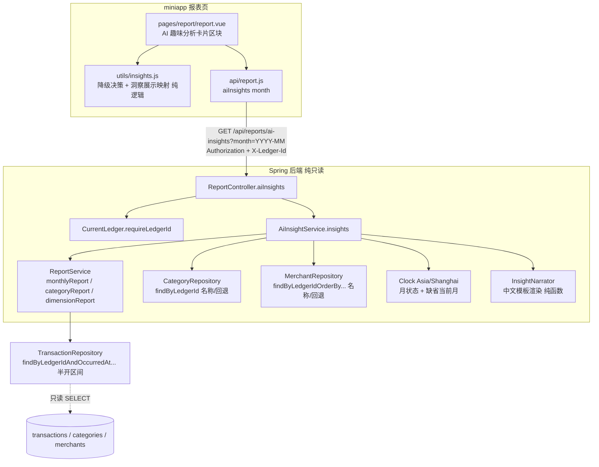

# Design Document

## Overview

AI 趣味分析（AI_Fun_Analysis_System）是「有余」报表能力的**纯只读、纯增量**扩展，与刚落地的智能月报
（smart-monthly-report）**并列且解耦**。它针对某一自然月，把用户最关心的消费变化算成**有故事感、有温度的
中文洞察**——不是干巴巴的数字，而是「你的餐饮消费下降 18%」「比上月节省 532 元」「本月奶茶次数减少 40%」
「外卖消费连续下降」这类一句话结论。

核心链路一句话：**复用既有报表口径把目标月 M 与上一自然月 M−1 的派生指标算出来 → 按显著度确定性挑出最值得说的
前 N 条 → 用一套内置中文模板讲成暖心俏皮的句子 → 打包给报表页一个新卡片渲染。把整块摘掉，报表/预算/月报/交易
原样成立。**

设计目标与边界（对齐需求 13「纯增量、纯只读」）：

- **不落库、不迁移、不新增错误码**：洞察是对既有 `transactions`、`categories`、`merchants` 的**实时聚合派生**，
  不新增数据库表、不新增/修改任何 Flyway 迁移脚本、不对任何表执行写操作、不新增任何错误码（需求 13.1、13.2、13.3、10）。
- **模板/规则驱动，非外部 LLM**：所有数值由后端从既有交易数据**确定性算出**，文案由内置中文叙事模板生成；
  v1 **不接入任何外部大模型/第三方 AI 服务**，用户财务数据**不出服务器**（需求 8.3、12.1、12.2）。
- **复用既有聚合口径**：金额一律 `BigDecimal` 保留 2 位小数（HALF_UP）；变化率（百分比）保留 2 位小数（HALF_UP）；
  自然月边界一律按 `Asia/Shanghai`（UTC+08:00）；所有金额/笔数统计排除 `type=transfer`。这些口径全部沿用
  `ReportService` 的既有实现，本设计**优先复用其方法**而非另起炉灶，从源头保证与 `/api/reports/*` 逐值一致
  （需求 13.5）。
- **一个只读接口**：新增单个只读接口 `GET /api/reports/ai-insights`，落在既有 `ReportController`，一次返回目标月挑选后
  的若干条趣味洞察或一条鼓励性兜底文案（需求 8、10）。
- **月状态语义与智能月报一致**：`partial`（目标月为当前自然月且当月未结束）/ `final`（目标月早于当前自然月）；
  依赖完整月对比的洞察在 `partial` 月优雅跳过（需求 1.3、1.4、9.3）。
- **降级不阻断**：接口失败或超时，报表页静默隐藏 AI 趣味分析卡片区块，其余既有报表照常展示（需求 11）。

### 关键设计决策（源自需求「范围与前提约定」）

| 决策 | 取值 | 依据 |
|------|------|------|
| 生成方式 | 模板/规则驱动叙事，v1 不接外部 LLM，数据不出服务器 | 范围约定 1；需求 8.3、12.1、12.2 |
| 比较基线 | 目标月 M vs 上一自然月 M−1（月环比）；连续趋势向前回看至多 6 个自然月 | 范围约定 2；需求 1.1、5.1 |
| 目标月缺省 | 当前自然月（`Asia/Shanghai`） | 需求 1.2、10.1 |
| 月状态 | `partial`（目标月=当前月且未结束）/ `final`（目标月早于当前月） | 需求 1.3、1.4 |
| partial 处理 | 依赖完整月对比的洞察全部跳过（v1 五类均为月环比）→ 跳过后为空则鼓励兜底 | 需求 9.3 |
| 洞察类型（v1） | `CATEGORY_DELTA` / `SAVINGS_TOTAL` / `FREQUENCY_DELTA` / `TREND_STREAK` / `TOP_MOVER` 五类 | 范围约定 4；需求 2–6 |
| 频次识别口径 | 仅按分类维度（`CATEGORY`）与商户维度（`MERCHANT`），不做 `note` 关键词匹配 | 范围约定 5；需求 4.7 |
| 分类涨跌/节省/频次 | 复用 `ReportService.categoryReport`（含笔数）与 `monthlyReport`（月度总支出） | 需求 2.1、3.1、4；13.5 |
| 商户频次 | 复用 `ReportService.dimensionReport(dim=merchant)`（含笔数） | 需求 4.2；13.5 |
| 连续趋势按月序列 | 复用 `ReportService.categoryReport` 逐月取每个自然月的分类支出（M−5..M，至多 6 次） | 需求 5.1；13.5 |
| 展示数量 N | 服务端可配置整数（1–20，默认 5）；不作为请求参数，保持接口契约最小 | 范围约定 6；需求 7.2、10.1 |
| 显著度打分与决胜键 | 确定性打分降序；并列按「洞察类型优先级（全序）→ 维度 id 升序」决胜 | 需求 7.1、7.3、7.4 |
| 去重 | 同一维度对象在同一洞察类型下至多一条 | 需求 7.5 |
| 空/新用户兜底 | 上月无可比数据、无候选、或 partial 跳空 → 一条鼓励文案 + `isFallback=true`，不隐藏模块 | 范围约定 7；需求 9 |
| 账本隔离 | 复用 `CurrentLedger`（`X-Ledger-Id` 解析 + 默认账本兜底）；全部账本聚合视图不展示 | 需求 1.5、1.9、10.3、10.7 |
| 删除名回退 | 分类 → `已删除分类`；商户 → `已删除商户`（固定、可复现） | 需求 2.7、4.6 |

## Architecture

AI 趣味分析是既有分层（Controller → Service → Repository）之上的一层**只读组合器（read-only composer）**：
`AiInsightService` 编排既有 `ReportService`，把 M 与 M−1（及 streak 的至多 6 个月）的派生指标算成一组**候选洞察**，
确定性打分挑选 → 交给 `InsightNarrator` 用中文模板渲染 → 打包成一个响应，由 `ReportController` 返回。



要点：

- **鉴权与隔离沿用既有链路**：Spring Security 过滤链统一校验令牌（无效/过期/用户不存在 → `UNAUTHENTICATED`）；
  `CurrentLedger` 解析 `X-Ledger-Id`（不可访问 → `LEDGER_NOT_ACCESSIBLE`）、无头则回退默认账本。本接口不新增任何鉴权逻辑。
- **组合优先于重写**：五类洞察的原始指标全部来自既有 `ReportService.monthlyReport / categoryReport /
  dimensionReport`，天然与 `/api/reports/*` 同口径（需求 13.5）；`AiInsightService` 只做**派生**（差值、变化率、
  连续段、打分、挑选）与**回退名解析**，不触碰任何取数与边界逻辑。
- **无新增仓库查询**：分类支出/笔数复用 `categoryReport`，商户支出笔数复用 `dimensionReport(dim=merchant)`，
  月度总支出复用 `monthlyReport`，连续趋势按月序列由 `categoryReport` 逐月取得（M−5..M）。因此**不新增任何
  repository 方法、不新增任何 SQL**，进一步坐实纯只读、纯增量（需求 13.1、13.2）。
- **单次事务只读**：`AiInsightService.insights` 标注 `@Transactional(readOnly = true)`，全过程无任何写语句（需求 13.1）。
- **文案与数值解耦**：`InsightNarrator` 是纯函数，输入洞察机器字段、输出中文串；不做任何 I/O、不调用任何外部服务
  （需求 8.3、12.1、12.2），从而可被单测/属性测试直接覆盖「文案数值 == 机器字段」（需求 8.4）。

### partial 月与比较窗口（重要）

v1 的五类洞察**全部是月环比**（M vs M−1）或以 M 为锚点的连续段，均**依赖完整月对比**。因此：

- **`final` 月**：M 已完结、M−1 完整可比 → 正常产出候选洞察。
- **`partial` 月**（含缺省的当前自然月）：按需求 9.3「跳过依赖完整月对比的洞察」，v1 五类全部跳过 →
  候选为空 → 返回一条鼓励性兜底文案（`isFallback=true`）。这是 v1 的保守取舍：拿「进行到一半的 M」与「完整的
  M−1」比会误导（例如月初就报「下降 80%」）。范围约定 3 的可选替代（缺省改取上一个已完结月）留待后续 spec。

## Components and Interfaces

### 后端

#### 1. `ReportController.aiInsights`（新增一个端点，落在既有控制器）

```java
/**
 * AI 趣味分析（需求 1、8、9、10）：month 为 YYYY-MM，缺省取 Asia/Shanghai 当前自然月。
 * 一次返回目标月挑选后不超过 N（默认 5）条趣味洞察，或一条鼓励性兜底文案。
 * 纯只读派生，复用既有报表聚合口径，不新增错误码。
 */
@GetMapping("/ai-insights")
public ResponseEntity<AiInsightsResponse> aiInsights(
        @RequestParam(name = "month", required = false) String month) {
    Long ledgerId = currentLedger.requireLedgerId();            // 未认证/账本不可访问在此抛既有错误
    YearMonth ym = (month == null || month.isBlank())
            ? YearMonth.now(clock)                              // 需求 1.2、10.1 缺省当前月
            : parseMonth(month, "month");                       // 非法格式 → REPORT_PARAM_INVALID（需求 10.4）
    return ResponseEntity.ok(aiInsightService.insights(ledgerId, ym));
}
```

- 复用 `ReportController` 既有的 `parseMonth`（`YearMonth.parse` 失败抛 `ApiException.reportParamInvalid("month", ...)`）、
  `currentLedger`、`clock`，**不新增任何解析或错误码**（需求 10.4、13.3）。
- 路径落在既有 `@RequestMapping("/api/reports")` 下，与 `monthly` / `monthly-digest` 同前缀、同模式。
- 鉴权/账本/参数三类错误的优先级由既有链路天然保证「鉴权 → 账本 → 参数」：`requireLedgerId()` 先触发鉴权与账本
  校验，`parseMonth` 后触发（需求 10.8）。

#### 2. `AiInsightService`（新增，只读组合器）

```java
@Service
public class AiInsightService {
    private final ReportService reportService;
    private final CategoryRepository categoryRepository;
    private final MerchantRepository merchantRepository;
    private final Clock clock;
    private final AiInsightProperties props;   // 阈值与 N（可配置，见下）

    @Transactional(readOnly = true)
    public AiInsightsResponse insights(Long ledgerId, YearMonth month) { ... }
}
```

**职责与编排步骤（全部只读）：**

1. **月状态**：`status = month.isBefore(YearMonth.now(clock)) ? "final" : "partial"`（需求 1.3、1.4）。
2. **partial 短路**：若 `status == "partial"`，v1 全部洞察依赖完整月对比 → 候选为空 → 直接走**鼓励兜底**
   （`isFallback=true`），仍携带 `month` 与 `monthStatus`（需求 9.3、9.6）。
3. **可比基线检查**：`prev = month.minusMonths(1)`。取 `monthlyReport(ledgerId, prev)`；若其总收入与总支出均为
   `0.00`（上月无任何计入交易 = 无可比基线）→ 候选为空 → **鼓励兜底**（需求 9.1、1.10）。
4. **取数（复用既有服务，同口径）**：
   - `monthlyReport(M)`、`monthlyReport(prev)` → 月度总支出（`SAVINGS_TOTAL`，需求 3.1）。
   - `categoryReport(M)`、`categoryReport(prev)`（默认 EXPENSE 口径，全月范围）→ 每分类金额与笔数
     （`CATEGORY_DELTA`、`TOP_MOVER`、`FREQUENCY_DELTA` 的分类维度，需求 2.1、4.2、6.1）。
   - `dimensionReport(M, dim=merchant)`、`dimensionReport(prev, dim=merchant)` → 每商户金额与笔数
     （`FREQUENCY_DELTA` 的商户维度，需求 4.2）。
   - `categoryReport(M−k)`（k=0..5，至多 6 次）→ 每分类逐月支出序列（`TREND_STREAK`，需求 5.1）。
5. **候选构建（五个 builder，纯派生）**：见下「候选构建规则」。每个候选携带完整机器字段。
6. **打分 + 排序 + 去重 + 截断**：见下「打分与确定性挑选」。
7. **叙事渲染**：对每条挑选后的洞察调用 `InsightNarrator.render(insight)` 生成 `narrativeText`；渲染失败（缺名或
   缺全部关键数值）则 `narrativeText=null` 并标记生成失败，保留机器字段、不报错（需求 8.8）。
8. **兜底判定**：若挑选后洞察列表为空 → `isFallback=true` + 一条鼓励文案；否则 `isFallback=false`、`fallbackText=null`
   （需求 9.2、9.4、9.5）。
9. **隐私净化**：响应 DTO 结构本身即为白名单（仅派生统计 + 名称 + 叙事文案），不含 email/token/其它账本数据/
   `external_id`/原始备注/商户原始标识（需求 12.3、12.4、12.5）。

> **性能（需求 10.6）**：单账本单月数据量小，上述至多约 12 次按账本+月份的窗口查询（含 streak 的 ≤6 次
> `categoryReport`）与内存派生，服务端处理远低于 2000ms。选择「组合既有服务」而非「一次取数自算全部」，是为
> 从实现上保证与既有接口逐值同口径（需求 13.5）；若未来需要，可在不改契约前提下改为单次取数聚合。

#### 3. `AiInsightProperties`（新增，`@ConfigurationProperties`，阈值与 N 可配置）

集中承载可配置阈值与展示上限，缺省值即需求默认值；不新增数据库、不新增错误码：

| 属性 | 默认 | 依据 |
|------|------|------|
| `maxCount`（N，展示上限，钳制到 1–20） | 5 | 需求 7.2、10.1 |
| `categoryRatePctMin`（分类涨跌变化率下限，绝对值） | 10.00 | 需求 2.3 |
| `categoryAmountMin`（分类涨跌金额下限，绝对值，元） | 20.00 | 需求 2.3 |
| `savingsAmountMin`（节省额下限，绝对值，元） | 50.00 | 需求 3.4、3.5 |
| `frequencyRatePctMin`（频次变化率下限，绝对值） | 20.00 | 需求 4.4 |
| `frequencyCountMin`（频次变化量下限，绝对值，笔） | 2 | 需求 4.4 |
| `streakMinMonths`（连续月数下限） | 3 | 需求 5.4、5.6 |

#### 4. 候选构建规则（`AiInsightService` 内部，逐类）

统一记号：目标月分类/商户支出记为 `cur`，上月记为 `prev`；`deltaAmount = cur − prev`（2dp，HALF_UP，可负）；
`changeRate = (cur − prev) / prev × 100`（2dp，HALF_UP，**仅在 `prev > 0` 时有定义**，否则为 `null`）。

- **`CATEGORY_DELTA`（分类消费涨跌，需求 2）**：对 M 的每个支出分类，取其 M 与 prev 的分类支出。仅当
  `prev > 0` 且 `|changeRate| ≥ categoryRatePctMin` 且 `|deltaAmount| ≥ categoryAmountMin` 三项全满足才生成候选
  （需求 2.3、2.8）。方向：`cur < prev` → `DOWN`（下降），`cur > prev` → `UP`（上升）（需求 2.5）。携带
  分类 id/名称、cur、prev、deltaAmount、changeRate（需求 2.4）。
- **`SAVINGS_TOTAL`（比上月节省/多花，需求 3）**：`savings = prevTotalExpense − curTotalExpense`（2dp，可负，
  需求 3.2）。`changeRate` 仅在 `prevTotalExpense > 0` 时有定义 = `savings / prevTotalExpense × 100`（需求 3.3）。
  仅当 `prevTotalExpense > 0` 且 `|savings| ≥ savingsAmountMin` 才生成候选（需求 3.4、3.5、3.8）。方向：
  `savings > 0` → `IMPROVE`（节省/省下），`savings < 0` → `OVERSPEND`（多花）（需求 3.6、3.7）。维度为账本总额
  （`dimension=null, dimensionId=null`）。
- **`FREQUENCY_DELTA`（商户或分类频次变化，需求 4）**：对 `CATEGORY` 维度取 `categoryReport` 的每分类笔数、对
  `MERCHANT` 维度取 `dimensionReport(dim=merchant)` 的每商户笔数（M 与 prev）。`deltaCount = curCount − prevCount`
  （整数）；`countRate` 仅在 `prevCount > 0` 时有定义 = `(curCount − prevCount) / prevCount × 100`（2dp，HALF_UP，
  需求 4.3）。仅当 `prevCount > 0` 且 `|countRate| ≥ frequencyRatePctMin` 且 `|deltaCount| ≥ frequencyCountMin` 才
  生成候选（需求 4.4）。方向：`curCount < prevCount` → `DOWN`（减少），`> ` → `UP`（增加）（需求 4.5）。携带
  维度、维度 id/名称、curCount、prevCount、deltaCount、countRate（需求 4.4）。**不使用 `note` 关键词匹配**（需求 4.7）。
- **`TREND_STREAK`（连续涨跌趋势，需求 5）**：对每个 `CATEGORY` 支出分类，构建 M−5..M（至多 6 个自然月、升序、
  无数据月计 `0.00`）的按月分类支出序列（由 `categoryReport(M−k)` 取得，需求 5.1）。以 M 为锚点**倒序**逐一比较
  相邻两月：连续严格递减或严格递增（需求 5.2）；遇相等（含两月均为 0.00）或方向反转即终止（需求 5.3）。连续月数
  （含两端计数）`≥ streakMinMonths` 才生成候选（需求 5.4、5.6）。方向：递减 → `DOWN`（连续下降），递增 → `UP`
  （连续上升，需求 5.5）。携带维度（`CATEGORY`）、分类 id/名称、方向、`streakMonths`、`streakStartMonth`（YYYY-MM）、
  `streakEndMonth`（= M）（需求 5.4）。
- **`TOP_MOVER`（最大改善/最超支，需求 6）**：候选分类集合 = 「prev 分类支出 > 0」的分类（需求 6.1）；每个候选的
  `deltaAmount = cur − prev`。集合非空时，选 `deltaAmount` **最小**者（下降最多）为「改善」（`role=IMPROVE`），选
  **最大**者（增加最多）为「超支」（`role=OVERSPEND`），各生成一条（需求 6.2）。并列最小/最大时，分别以**分类 id 升序**
  决胜，各选唯一一个（需求 6.4）。携带分类 id/名称、cur、prev、deltaAmount、changeRate、role（需求 6.3）。候选集合
  为空 → 不生成任何 `TOP_MOVER`（需求 6.5）。**去重细节**：若改善与超支落在同一分类（候选集合仅 1 个分类，min==max），
  按去重规则「同维度同类型至多一条」（需求 7.5）只保留一条，`role` 由 `deltaAmount` 符号决定（`<0`→IMPROVE、
  `>0`→OVERSPEND、`==0` 不生成）。

#### 5. 打分与确定性挑选（`AiInsightService` 内部）

- **显著度打分（需求 7.1）**：为每条候选计算非负确定性打分 `score`（`BigDecimal`），由该洞察机器字段算出，相同输入
  恒得相同打分：
  - 含金额变化的类型（`CATEGORY_DELTA`、`SAVINGS_TOTAL`、`TOP_MOVER`）：`score = |deltaAmount|`（元，2dp）。
  - `FREQUENCY_DELTA`：`score = |deltaCount|`（笔数绝对值，提升为 `BigDecimal`）。
  - `TREND_STREAK`：`score = |M值 − 连续段起始月值|`（连续段内的金额变化绝对值，元，2dp）。
  > 说明：跨类型打分以「金额/笔数变化绝对值」为共同量纲，货币量级通常主导排序（符合「最值得说」直觉）；跨类型的
  > 严格稳定性由下面的**并列决胜键**保证，故不同量纲不影响结果的确定性与可复现性。
- **排序与截断（需求 7.2、7.3、7.4）**：按 `score` 降序；`score` 相等时按**洞察类型优先级（全序）**再按**维度 id 升序**
  决胜，最终取前 `N`（`props.maxCount`，钳制 1–20）条。洞察类型全序（优先级由高到低，固定且预定义）：

  `SAVINGS_TOTAL > TOP_MOVER > CATEGORY_DELTA > TREND_STREAK > FREQUENCY_DELTA`

  维度 id 决胜：账本总额类（`SAVINGS_TOTAL`，无维度 id）视 id 为 `-1`（恒最前）；其余用 `dimensionId` 升序。
- **去重（需求 7.5）**：同一 `(type, dimension, dimensionId)` 至多保留一条（挑选前对候选去重，保留同键中打分更高者、
  再按决胜键取唯一）。
- **幂等可复现（需求 7.4）**：全过程为纯函数式的排序/挑选，且决胜键构成全序 → 同账本、同目标月、同底层数据、同 N
  多次调用返回完全一致的洞察集合与顺序。
- **不足 N 不补足（需求 7.6）**：候选少于 N 时按上述排序返回全部候选，不做任何补足。

#### 6. `InsightNarrator`（新增，中文模板渲染纯函数）

- **输入**：一条洞察的机器字段；**输出**：一段中文 `narrativeText`（≤100 个中文字符，需求 8.5）。纯函数，
  **不调用任何外部服务/LLM**（需求 8.3、12.1、12.2）。
- **数值一致（需求 8.4）**：模板中出现的每个数值都直接取自该洞察机器字段并按同口径格式化（金额 2dp、变化率
  百分比 2dp），保证「文案数值 == 机器字段」逐一相等。
- **至少含维度名 + 一项关键数值（需求 8.2）**：每条文案至少包含维度名称，及变化率/金额/次数三者中至少一项。
- **措辞方向（需求 8.6、8.7）**：
  - 方向为**下降 / 减少 / 改善**（`DOWN` 或 `role=IMPROVE`）→ **正向或中性**措辞，**不使用**任何提醒/警示词
    （如「省下」「继续保持」「稳稳的」）。
  - 方向为**上升 / 增加 / 超支**（`UP` 或 `role=OVERSPEND`）→ **提醒性**措辞（如「留意一下」「记得关注」）。
- **模板示例（每类，方向分支）**：
  - `CATEGORY_DELTA`：下降「你的{name}少花了 {|deltaAmount|} 元，降了 {|changeRate|}%，省钱有一手～」；
    上升「{name}这个月多花了 {|deltaAmount|} 元，涨了 {|changeRate|}%，留意一下哦。」
  - `SAVINGS_TOTAL`：节省「这个月比上月省下 {savings} 元，钱包稳稳的～」；多花「这个月比上月多花了 {|savings|} 元，
    记得关注下节奏。」
  - `FREQUENCY_DELTA`：减少「本月{name}次数减少了 {|deltaCount|} 次（{|countRate|}%），节制得不错～」；
    增加「本月{name}次数增加了 {|deltaCount|} 次（{|countRate|}%），留意一下频率哦。」
  - `TREND_STREAK`：下降「{name}已连续 {streakMonths} 个月下降，坚持得很棒～」；上升「{name}连续 {streakMonths}
    个月上升了，记得关注下。」
  - `TOP_MOVER`：改善「这个月{name}省得最多，少花 {|deltaAmount|} 元（{|changeRate|}%），最大功臣就是它～」；
    超支「这个月{name}超得最多，多花 {|deltaAmount|} 元（{|changeRate|}%），下月留意一下。」
- **回退名（需求 2.7、4.6）**：分类名缺失/空白 → `已删除分类`；商户名缺失/空白 → `已删除商户`；固定、可复现，且不因
  名称缺失丢弃洞察。
- **生成失败（需求 8.8）**：若某洞察缺维度名（在回退名机制下不应发生）或缺全部关键数值 → 跳过该条文案生成、
  `narrativeText=null` 标记失败、保留机器字段，整体不报错。

### 前端（miniapp）

#### 7. `api/report.js` 新增方法

```js
/**
 * AI 趣味分析。month 为 YYYY-MM（缺省时由后端取 Asia/Shanghai 当前自然月）。
 * 纯只读派生。沿用 utils/request.js 网络层：自动带 Authorization 与 X-Ledger-Id；
 * 401 清 token 跳登录；LEDGER_NOT_ACCESSIBLE 自动清本地账本并重试一次。
 * 返回 { month, monthStatus, isFallback, fallbackText, insights:[AiInsight...] }
 */
export function aiInsights(month) {
  return http.get(`/reports/ai-insights?month=${month}`)
}
```

#### 8. `utils/insights.js` 新增（纯逻辑，可测试，单一事实源）

镜像 `utils/digest.js` 的做法，把两类核心判定抽成纯函数供 `report.vue` 复用：

- `AI_INSIGHTS_TIMEOUT_MS = 5000`：请求超时常量（需求 11.1）。
- `shouldFetchInsights(isLoggedIn, isAll)`：已登录且非全部账本聚合视图才请求（需求 1.9、11.4）。
- `raceWithTimeout(promise, ms)`：`Promise.race` + 定时器超时包装（复用/同 digest）。
- `resolveInsightsState({ isLoggedIn, isAll, fetchInsights, timeoutMs, isStale })`：加载与静默降级决策核心，返回
  `{ requested, stale, insights, insightsVisible }`；未登录/聚合视图不请求不展示、失败或超时静默隐藏，且**从不触碰
  其它报表状态**（需求 11.1、11.2、11.4、11.5）。
- `insightToDisplay(insight)`：把一条洞察映射为展示项（图标/色调按方向、优先展示 `narrativeText`，`narrativeText`
  缺失时降级为「维度名 + 关键数值」的兜底串）。纯函数，便于单测覆盖「渲染只用白名单字段、不泄露账本外数据」。

#### 9. `pages/report/report.vue` 新增 AI 趣味分析卡片区块

- **数据加载**：在既有 `load()` 中，当 `!ledgerStore.isAll` 且已登录（有 token）时并行请求 `aiInsights(month.value)`
  （与智能月报同款并行、独立降级）；用独立的 `insights`/`insightsVisible` 响应式状态，**与其它报表相互独立**（需求 11.2）。
- **降级**（需求 11）：为请求设 5000ms 超时（`Promise.race` + 定时器）；失败或超时 → `insightsVisible=false` 静默隐藏
  卡片，不弹阻断性错误，不影响分类占比/趋势/智能月报等既有模块；未登录不发起请求也不展示；全部账本聚合视图
  （`ledgerStore.isAll`）不发起也不展示（需求 1.9、11.3、11.4、11.5）。
- **区块渲染**：展示目标月标识 + 月状态徽标（复用月报徽标样式）；`isFallback=true` 时渲染那条鼓励文案；否则逐条渲染
  洞察卡片（优先 `narrativeText`，配合方向色调：改善/下降为暖绿中性、超支/上升为提醒橙）。空/缺字段做兜底，不报错。

## Data Models

后端不新增任何持久化实体（需求 13.2），仅新增只读响应 DTO（`record`）。字段命名与既有报表 DTO 对齐；因五类洞察的
机器字段异构，采用**一个扁平 `AiInsight` record + 明确的 null 语义**表达（而非每类一个子类型），便于前端统一消费。

```java
/**
 * AI 趣味分析聚合响应（需求 1、8、9、10）。纯只读派生，不对应任何数据库表。
 *
 * @param month        目标月 YYYY-MM（Asia/Shanghai 边界，需求 1.1、9.6、10.4）
 * @param monthStatus  月状态：partial（进行中）/ final（已完结）（需求 1.3、1.4、9.6）
 * @param isFallback   兜底态标识：true=返回鼓励文案、insights 为空；false=返回 1..N 条洞察（需求 9.4、9.5）
 * @param fallbackText 鼓励性兜底文案（1..100 字符）；isFallback=false 时为 null（需求 9.1、9.2、9.3）
 * @param insights     挑选后的趣味洞察（0..N 条，按显著度降序 + 确定性决胜键排序）；兜底态为空列表（需求 7、9）
 */
public record AiInsightsResponse(
        String month,
        String monthStatus,
        boolean isFallback,
        String fallbackText,
        List<AiInsight> insights) {

    /**
     * 单条趣味洞察：机器可读字段 + 渲染好的中文叙事文案（需求 8.1）。
     * 因五类洞察字段异构，未用到的字段以 null 表达，各字段 null 语义见下。
     *
     * @param type           洞察类型：CATEGORY_DELTA / SAVINGS_TOTAL / FREQUENCY_DELTA / TREND_STREAK / TOP_MOVER
     * @param dimension      维度：CATEGORY / MERCHANT；SAVINGS_TOTAL（账本总额）为 null
     * @param dimensionId    维度对象 id（分类 id / 商户 id）；SAVINGS_TOTAL 为 null
     * @param dimensionName  维度名称（回退：分类→"已删除分类"、商户→"已删除商户"）；SAVINGS_TOTAL 为 null（需求 2.7、4.6）
     * @param currentValue   目标月金额值（元，2dp）；金额类洞察在场；纯频次类（若无金额）为 null
     * @param previousValue  上月金额值（元，2dp）；同 currentValue 语义
     * @param currentCount   目标月笔数；仅 FREQUENCY_DELTA 在场，其余为 null
     * @param previousCount  上月笔数；仅 FREQUENCY_DELTA 在场，其余为 null
     * @param deltaAmount    金额变化量 = 目标月 − 上月（元，2dp，可负）；金额类在场，纯频次类为 null
     * @param deltaCount     笔数变化量 = 目标月 − 上月（整数，可负）；仅 FREQUENCY_DELTA 在场，其余为 null
     * @param changeRate     变化率（百分比，2dp，HALF_UP）；上月基线为 0（无定义）时为 null（需求 2.2、3.3、4.3、6.3）
     * @param streakMonths   连续月数（含两端）；仅 TREND_STREAK 在场，其余为 null（需求 5.4）
     * @param streakStartMonth 连续段起始自然月 YYYY-MM；仅 TREND_STREAK 在场（需求 5.4）
     * @param streakEndMonth   连续段结束自然月 YYYY-MM（= 目标月 M）；仅 TREND_STREAK 在场（需求 5.4）
     * @param direction      语义方向：DOWN（下降/减少）/ UP（上升/增加）；SAVINGS_TOTAL/TOP_MOVER 用 role 表达故为 null
     * @param role           角色：IMPROVE（改善/节省）/ OVERSPEND（超支/多花）；仅 SAVINGS_TOTAL、TOP_MOVER 在场（需求 3.6/3.7、6.2）
     * @param score          显著度打分（非负，2dp，确定性）；用于排序，前端可忽略（需求 7.1）
     * @param narrativeText  渲染好的中文叙事文案（≤100 字符）；生成失败时为 null（需求 8.1、8.4、8.5、8.8）
     */
    public record AiInsight(
            String type,
            String dimension,
            Long dimensionId,
            String dimensionName,
            BigDecimal currentValue,
            BigDecimal previousValue,
            Integer currentCount,
            Integer previousCount,
            BigDecimal deltaAmount,
            Integer deltaCount,
            BigDecimal changeRate,
            Integer streakMonths,
            String streakStartMonth,
            String streakEndMonth,
            String direction,
            String role,
            BigDecimal score,
            String narrativeText) { }
}
```

设计说明：

- **不含任何被禁字段（需求 12.3、12.4、12.5）**：DTO 显式**不包含** email、任何令牌、其它账本数据、`external_id`、
  原始备注全文、商户原始标识、附件内容/链接；只含派生统计（金额、笔数、变化率、连续月数、打分）与由其生成的中文
  叙事文案。字段集即白名单，从结构上杜绝隐私外泄。
- **空/兜底语义**：兜底态 `isFallback=true`、`fallbackText` 为一条非空鼓励文案（1..100 字符）、`insights` 为空列表；
  非兜底态 `isFallback=false`、`fallbackText=null`、`insights` 为 1..N 条（需求 9.1–9.6）。
- **`changeRate` 的 null 语义**：上月基线（分类支出/总支出/笔数）为 0 时变化率无定义 → `null`，对应「不生成该候选」
  或（SAVINGS_TOTAL）不生成（需求 2.8、3.8、4.3）。
- **无持久化实体、无新表、无迁移**（需求 13.1、13.2）。

### 洞察类型全序与打分模型（补充）

| 类型 | 打分 `score` | 维度 | changeRate 定义域 | 方向/角色 |
|------|-------------|------|-------------------|-----------|
| `SAVINGS_TOTAL` | `|savings|` | 账本总额（无 id） | prevTotalExpense>0 | role: IMPROVE/OVERSPEND |
| `TOP_MOVER` | `|deltaAmount|` | CATEGORY | prev>0（候选前提） | role: IMPROVE/OVERSPEND |
| `CATEGORY_DELTA` | `|deltaAmount|` | CATEGORY | prev>0 | direction: DOWN/UP |
| `TREND_STREAK` | `|M值 − 段起始月值|` | CATEGORY | 不适用（null） | direction: DOWN/UP |
| `FREQUENCY_DELTA` | `|deltaCount|` | CATEGORY / MERCHANT | prevCount>0 | direction: DOWN/UP |

并列（`score` 相等）决胜：类型优先级（上表自上而下）→ 维度 id 升序（`SAVINGS_TOTAL` 视 id 为 `-1`，恒最前）。

## Correctness Properties

*A property is a characteristic or behavior that should hold true across all valid executions of a system—essentially, a formal statement about what the system should do. Properties serve as the bridge between human-readable specifications and machine-verifiable correctness guarantees.*

AI 趣味分析的核心是**对既有交易数据的纯只读派生 + 确定性挑选 + 模板渲染**，其行为随输入（交易分布、金额、笔数、
分类/商户、月份、月状态）显著变化，且存在大量通用不变式（同口径等值、门控正确、连续段检测、确定性幂等挑选、
去重、只读不写库、文案数值一致、隐私白名单）——非常适合属性测试。接口契约（缺省月、鉴权/账本/参数错误码、错误
优先级）、前端 UI 呈现与占位、性能、迁移事实、以及「不调用外部服务」等负向约束以示例/集成/冒烟/前端测试覆盖
（见下方测试策略），不在本节。

经属性反思，去重合并如下：同口径类（1.6、2.1、3.1、4.1、4.2、5.1、6.1、13.5）合并为一条**模型对照口径一致**属性；
分类涨跌各条（2.2–2.5、2.8）合并；节省各条（3.2–3.8）合并；频次各条（4.3–4.5）合并；连续段各条（5.2–5.6）合并；
最大改善/超支各条（6.1–6.5）合并；删除名回退（2.7、4.6）合并；打分挑选类（7.1–7.7）合并（去重作为其中一款不变式）；
叙事各条（8.1、8.2、8.4–8.8）合并；兜底各条（9.1–9.5）合并；隐私（12.3–12.5）合并；账本隔离（1.5、10.5）合并。

### Property 1: 响应完整性与月状态正确

*For any* 账本、目标月与交易集合，AI 趣味分析响应都应携带合法的目标月标识（`YYYY-MM`）与月状态，且月状态为
`final` 当且仅当目标月早于当前自然月、否则为 `partial`；无论兜底态还是非兜底态，`month` 与 `monthStatus` 均在场；
非兜底态时 `insights` 条数在 1 到 N 之间，兜底态时 `insights` 为空且 `fallbackText` 非空。

**Validates: Requirements 1.1, 1.3, 1.4, 9.6**

### Property 2: 同口径口径一致（模型对照）

*For any* 账本、目标月与交易集合，AI 趣味分析用于派生洞察的原始指标都与既有报表逐值相等：分类支出与笔数等于
`ReportService.categoryReport` 对同一账本与全月范围的结果、商户支出笔数等于 `ReportService.dimensionReport(dim=merchant)`
的结果、月度总支出等于 `ReportService.monthlyReport` 的结果、连续段的按月分类支出序列逐月等于 `categoryReport`
对应月份的结果（无数据月为 `0.00`）；三者均排除 `type=transfer`、按 `Asia/Shanghai` 半开区间、金额 2 位小数 HALF_UP。

**Validates: Requirements 1.6, 2.1, 3.1, 4.1, 4.2, 5.1, 6.1, 13.5**

### Property 3: 账本隔离

*For any* 两个账本 A、B 各自的随机交易集合，账本 A 的 AI 趣味分析结果与「仅存在 A 的交易」时生成的结果逐值相同——
B 的任何交易都不计入 A 的任一洞察。

**Validates: Requirements 1.5, 10.5**

### Property 4: 金额与变化率 2 位小数

*For any* 账本、目标月与交易集合，返回的每条洞察中，所有金额字段（`currentValue`、`previousValue`、`deltaAmount`、
`score`）均保留 2 位小数（HALF_UP），所有变化率字段（`changeRate`）在有定义时均保留 2 位小数（HALF_UP）。

**Validates: Requirements 1.7**

### Property 5: 分类涨跌门控、字段、方向与变化率

*For any* 账本、目标月与交易集合，某分类生成 `CATEGORY_DELTA` 洞察当且仅当「上月分类支出 > 0 且变化率绝对值不小于
变化率下限且变化量绝对值不小于金额下限」；生成时携带分类 id、名称、目标月支出、上月支出、变化量（= 目标月 − 上月）
与变化率（= 变化量 ÷ 上月支出 × 100，2dp，仅上月 > 0 时有定义）；方向为 `DOWN` 当且仅当目标月支出 < 上月支出、
为 `UP` 当且仅当 > 上月支出；上月支出为 0 时不生成该分类的 `CATEGORY_DELTA`。

**Validates: Requirements 2.2, 2.3, 2.4, 2.5, 2.8**

### Property 6: 节省总额门控、算术与角色

*For any* 账本、目标月与交易集合，`savings = 上月总支出 − 目标月总支出`（2dp，可负）；`SAVINGS_TOTAL` 洞察生成当且
仅当「上月总支出 > 0 且 `|savings|` 不小于金额下限」，其变化率仅在上月总支出 > 0 时有定义（= `savings ÷ 上月总支出 × 100`，
2dp）；`savings > 0` 时角色为 `IMPROVE`（节省措辞）、`savings < 0` 时角色为 `OVERSPEND`（多花措辞）；上月总支出为 0
时不生成且不报错。

**Validates: Requirements 3.2, 3.3, 3.4, 3.5, 3.6, 3.7, 3.8**

### Property 7: 频次变化门控、笔数算术与方向

*For any* 账本、目标月与交易集合，对每个分类维度与商户维度对象，`deltaCount = 目标月笔数 − 上月笔数`（整数），
笔数变化率仅在上月笔数 > 0 时有定义（2dp，HALF_UP）；生成 `FREQUENCY_DELTA` 洞察当且仅当「上月笔数 > 0 且笔数
变化率绝对值不小于变化率下限且笔数变化量绝对值不小于次数下限」，生成时携带维度、维度 id、名称、目标月笔数、上月
笔数、笔数变化量与变化率；方向为 `DOWN` 当且仅当目标月笔数 < 上月笔数、为 `UP` 当且仅当 >。

**Validates: Requirements 4.3, 4.4, 4.5**

### Property 8: 连续涨跌段检测、门控与方向

*For any* 账本、目标月与交易集合，某分类的连续月数等于「以目标月为锚点向前对按月分类支出序列做严格单调延伸、遇相邻
两月相等（含均为 0.00）或方向反转即终止」的含两端月数（与暴力参照实现一致）；生成 `TREND_STREAK` 洞察当且仅当连续
递减或连续递增月数不小于连续月数下限，生成时携带维度（`CATEGORY`）、分类 id、名称、方向、连续月数、连续段起始月与
结束月（结束月 = 目标月 M）；方向为 `DOWN`（连续下降）当且仅当为递减段、为 `UP`（连续上升）当且仅当为递增段。

**Validates: Requirements 5.2, 5.3, 5.4, 5.5, 5.6**

### Property 9: 最大改善/最超支选择与确定性决胜

*For any* 账本、目标月与交易集合，`TOP_MOVER` 的候选集合恰为「上月分类支出 > 0」的分类；候选非空时，改善洞察的分类
为变化量（= 目标月 − 上月）最小者、超支洞察的分类为变化量最大者，并列时分别以分类 id 升序各选唯一一个；每条携带
分类 id、名称、目标月支出、上月支出、变化量、变化率与角色（`IMPROVE`/`OVERSPEND`）；候选集合为空时不生成任何
`TOP_MOVER`。

**Validates: Requirements 6.2, 6.3, 6.4, 6.5**

### Property 10: 删除/无名维度对象回退命名且不丢弃

*For any* 账本、目标月与交易集合，任一维度对象（分类或商户）在当前账本中已删除或名称为空时，对应洞察的 `dimensionName`
取固定回退名（分类 → `已删除分类`，商户 → `已删除商户`，同一对象每次相同），且该洞察不因名称缺失被丢弃。

**Validates: Requirements 2.7, 4.6**

### Property 11: 确定性、幂等、有界与去重的洞察挑选

*For any* 账本、目标月与交易集合，每条候选洞察的显著度打分为其机器字段的确定性非负函数；返回洞察数不超过 N（N 钳制
在 1..20，默认 5），按打分降序排列，打分相等时先按预定义洞察类型全序、再按维度 id 升序决胜，使结果唯一确定且与输入
顺序无关；同账本、同目标月、同底层数据、同 N 的多次调用返回完全一致的集合与顺序（幂等可复现）；返回结果对同一
`(洞察类型, 维度, 维度 id)` 至多包含一条（去重）；候选总数少于 N 时按同一排序返回全部候选、不做任何补足。

**Validates: Requirements 7.1, 7.2, 7.3, 7.4, 7.5, 7.6**

### Property 12: 叙事文案正确性（含数值一致与措辞极性）

*For any* 非兜底态的洞察，其中每条要么携带一段中文叙事文案、要么被标记为生成失败（`narrativeText` 为 null 且不报错）；
当文案存在时：至少包含该洞察的维度名称与变化率/金额/次数三者中的至少一项；文案中出现的每个数值都与该洞察对应机器
字段完全相等（金额 2dp、变化率百分比 2dp）；长度不超过 100 个中文字符；方向为下降/减少/改善（`DOWN` 或 `IMPROVE`）
时采用正向或中性措辞且不含任何提醒/警示词、方向为上升/增加/超支（`UP` 或 `OVERSPEND`）时采用提醒性措辞。

**Validates: Requirements 8.1, 8.2, 8.4, 8.5, 8.6, 8.7, 8.8**

### Property 13: 鼓励性兜底语义

*For any* 账本与目标月，当上月无任何计入交易、或无任何满足显著变化阈值的候选、或目标月为 `partial` 而依赖完整月对比
的洞察被跳过后为空时，响应的 `insights` 为空、`isFallback` 为 `true`、`fallbackText` 恰为一条非空文案（长度 1..100）
且不返回错误；当返回一条或多条洞察时，`isFallback` 为 `false` 且 `fallbackText` 为 null。

**Validates: Requirements 9.1, 9.2, 9.3, 9.4, 9.5**

### Property 14: 隐私白名单（响应不含被禁字段）

*For any* 账本、目标月与交易集合，AI 趣味分析响应的全部字段集合仅为派生统计与中文叙事文案，绝不包含用户邮箱、任何
访问/刷新令牌、任何不属于当前请求账本的数据，也不包含 `external_id`、原始备注全文、商户原始标识或附件内容/链接。

**Validates: Requirements 12.3, 12.4, 12.5**

### Property 15: 纯只读不写库

*For any* 账本、目标月与初始数据库状态，调用 AI 趣味分析接口（一次或多次）后，`transactions`、`categories`、`merchants`
以及其它任何数据库表的行数与全部列取值均保持不变（零写入副作用、零 DDL）。

**Validates: Requirements 13.1**

### Property 16: 前端静默降级（`utils/insights.js` 纯逻辑）

*For any* 登录态与聚合视图状态、请求结果或超时，前端加载决策都满足：未登录或全部账本聚合视图时不发起请求且卡片不可见；
请求失败或达到 5000ms 超时时卡片不可见（`insightsVisible=false`、`insights=null`）；且该决策只产出 AI 趣味分析自身状态，
从不返回或改动任何其它报表字段。

**Validates: Requirements 11.1**

## Error Handling

AI 趣味分析接口**不新增任何错误码**，完全复用既有统一错误体 `{code, message, field}` 与既有工厂方法（对齐需求 10、13.3）：

| 场景 | 处理 | 错误码（既有） | 需求 |
|------|------|----------------|------|
| 未携带/签名失败/过期/用户不存在的令牌 | Security 过滤链 + `CurrentUser` 抛出，响应不含任何洞察数据 | `UNAUTHENTICATED`（401） | 10.2 |
| `X-Ledger-Id` 指向无权访问的账本 | `CurrentLedger.requireLedgerId` → `LedgerService.requireAccessible` 抛出 | `LEDGER_NOT_ACCESSIBLE`（404） | 10.3 |
| `month` 参数非 `YYYY-MM` | 控制器 `parseMonth` 捕获 `DateTimeParseException` | `REPORT_PARAM_INVALID`（400，`field=month`） | 10.4 |
| 未携带 `X-Ledger-Id` 头 | `CurrentLedger` 回退当前用户默认账本，正常处理 | —— | 10.7 |
| 上月无可比数据 / 无候选 / partial 跳空 | **非错误**：`isFallback=true` + 一条鼓励文案（见 Property 13） | —— | 9.1、9.2、9.3 |
| 单请求同时多种错误 | 既有链路天然按「鉴权 → 账本 → 参数」顺序触发，只返回最高优先级错误码 | 见上 | 10.8 |
| 某条洞察缺全部关键数值 | **非错误**：`narrativeText=null` 标记生成失败，保留机器字段（见 Property 12） | —— | 8.8 |

失败一律零副作用（纯只读，天然无写入回滚问题）。响应发生任何错误时不返回任何洞察数据（需求 10.2、10.3、10.4）。

前端降级（需求 11）：

- **超时/失败静默隐藏**：miniapp 对本请求设 5000ms 超时；接口返回错误标识或超时 → `insightsVisible=false` 隐藏卡片，
  不弹阻断性错误弹窗，报表页其余既有报表（分类占比、月度趋势、智能月报等）按各自逻辑照常展示且取值不受影响
  （需求 11.1、11.2、11.5）。
- **加载中占位**：请求发出至响应/超时期间展示加载中占位，不阻断其余模块的查看与交互（需求 11.3）。
- **未登录不请求**：无有效令牌时不发起请求、不展示卡片（需求 11.4）。
- **全部账本视图不展示**：`ledgerStore.isAll` 为真时不请求也不展示（无单一账本上下文，需求 1.9）。

## Testing Strategy

采用**单元测试 + 属性测试**双轨，并对不适合 PBT 的部分补充控制器契约测试、集成/冒烟测试与前端 vitest 测试。后端属性
测试沿用仓库既有技术栈 **jqwik**（见 `MonthlyDigestServicePropertyTest`、`ReportPropertyTest` 既有约定），服务层测试用
`@DataJpaTest` + H2（`MODE=MySQL`）+ 真实 Repository + 固定注入 `Asia/Shanghai` 的 `Clock`，编排真实 `ReportService`，
**不自造属性框架、不使用 mock**。

### 属性测试（后端，`AiInsightServicePropertyTest` 等）

- 每条属性对应上文 Property 1–15，各以**单个** jqwik `@Property` 实现，最少 100 次迭代（`@Property(tries = 100)` 起）。
- 生成器产出随机的目标月交易与上月交易（随机 type 含 transfer 噪声、随机金额/日期/分类/商户，跨账本），并随机化
  「当前时刻」与目标月的相对位置以覆盖 `partial`/`final`；随机化阈值边界附近的取值（刚好达到/刚好不足下限）以覆盖
  门控两侧；构造并列打分与并列 min/max 以触发决胜键；构造指向不存在分类/商户的交易以覆盖回退名；构造严格单调、
  含相等、含反转的按月序列以覆盖连续段检测（Property 8 采用**暴力参照实现**对照）。
- 每次迭代使用**独立 `ledgerId`**（共用同一内存 H2、跨迭代复用），隔离各次随机数据（沿用既有属性测试范式，jqwik 属性
  方法经 `TestContextManager` 在 `@BeforeTry` 手工完成依赖注入）。
- **模型对照（model-based）**：Property 2、5、6、7、8、9 以既有 `ReportService.monthlyReport/categoryReport/
  dimensionReport` 或就地暴力实现为参照，断言派生值逐值相等（`isEqualByComparingTo`），直接坐实需求 13.5 的同口径。
- **Property 15（只读不写库）**：在调用前后对 `transactions`/`categories`/`merchants`（及全表清单）做行数与内容快照，断言完全一致。
- **Property 14（隐私白名单）**：将响应序列化为 JSON，断言字段名集合是白名单的子集，且不含任何邮箱/令牌样式取值与
  `external_id`/`note` 字段。
- 每个属性测试须以 Javadoc 注释标注其对应设计属性，格式：
  `Feature: ai-fun-analysis, Property {number}: {property_text}`，并保留 `Validates: Requirements X.Y` 风格注释。

### 单元 / 边界测试（后端）

- `AiInsightServiceTest`（`@DataJpaTest`）：具体示例覆盖各类洞察的典型场景与边界——阈值刚好达到/刚好不足；上月基线为 0
  的无定义分支（2.8、3.8、4.3、6.5）；连续段恰好达到下限/差一个月（5.6）；`TOP_MOVER` 改善与超支落在同一分类时的去重
  取舍；`partial` 月全部跳过 → 兜底；`N` 边界（1、20、越界钳制）；文案长度上界与措辞极性（8.5–8.7）；生成失败分支（8.8）。
  避免与属性测试重复堆砌大量用例。
- `InsightNarratorTest`：纯函数直接单测各类模板与方向分支的数值一致与措辞极性。

### 控制器契约 / 集成 / 冒烟 / 回归

- `ReportControllerTest`（MockMvc / 既有集成测风格）：
  - 缺省 `month` 取当前月（需求 1.2）；
  - 无/坏令牌 → `UNAUTHENTICATED`，响应无洞察字段（需求 10.2）；
  - 越权 `X-Ledger-Id` → `LEDGER_NOT_ACCESSIBLE`（需求 10.3）；
  - 非法 `month` → `REPORT_PARAM_INVALID`（需求 10.4）；
  - 无 `X-Ledger-Id` → 采用默认账本（需求 10.7）；
  - 多错误并存时按「鉴权 → 账本 → 参数」优先级返回（需求 10.8）；
  - 返回结果类型为「≤N 条洞察」或「兜底文案」（需求 10.1）。
- **契约不回归（需求 13.3、13.4）**：既有报表/预算/交易接口的现有测试保持通过，字段集与错误码集合不变；本功能以独立
  端点、独立服务、独立 DTO 引入，不修改既有代码路径。
- **无迁移（需求 13.2）**：构建期/评审确认未新增或修改任何 Flyway 脚本、未新建任何表（冒烟/静态检查）。
- **不依赖外部服务（需求 8.3、12.1、12.2）**：`AiInsightService`/`InsightNarrator` 无任何 HTTP 客户端/外部依赖注入；
  代码评审 + 单测在无网络环境下通过即证。
- **性能（需求 10.6）**：可选集成计时冒烟，验证单账本单月服务端处理在 2000ms 内（不作为 PBT，避免环境波动误报）。

### 前端测试（miniapp vitest，需求 11、12）

- `utils/insights.js` 纯逻辑单测/属性测（对应 Property 16）：未登录/聚合视图不请求不展示；请求失败或 5000ms 超时静默
  隐藏卡片；`stale`（请求期间切换账本/月份）跳过应用；决策从不改动其它报表状态（需求 11.1、11.2、11.4、11.5）。
- `insightToDisplay` 字段隔离单测：展示映射只取白名单字段（维度名、关键数值、`narrativeText`），绝不引用邮箱/令牌/
  其它账本数据（需求 12.3、12.4）。
- 加载中占位、静默降级不弹阻断弹窗、切账本/月份 2 秒内刷新等 UI 行为以手测/组件级校验覆盖（需求 1.8、11.3、11.5）。
