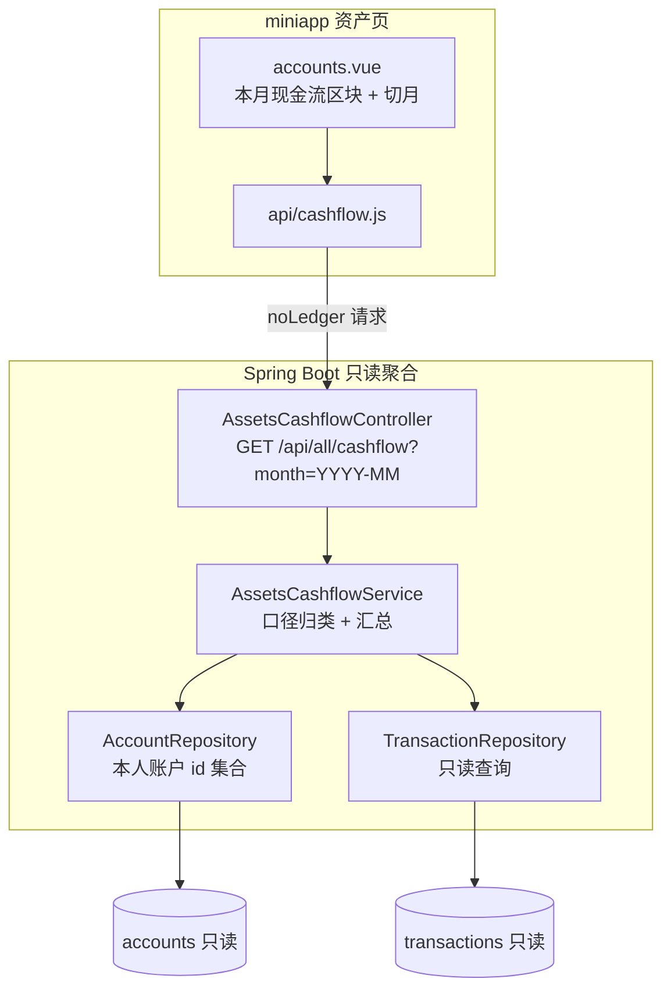

# Design Document

## Overview

资产现金流（Assets_Cashflow_System）在「资产」tab 净资产之下，新增一个**账户维度**的月度现金流区块：展示选定自然月的
**实际流出、实际流入、净流入**，以及**今日流出/流入**，并支持像账本页一样左右切月。功能为**纯只读聚合**，
不新增数据表、不新增迁移、不写入任何数据、不改变任何既有口径。

设计的核心是一条精确且可复现的口径：

> **实际现金流 = 本月内、使当前用户「拥有账户」余额真实增减、且非账户间转账的金额。**

关键结论（来自对既有写入逻辑的核对，决定聚合可仅基于 `transactions` 表完成）：

- **`expense`**：`account_id` 为本人账户，记账时减该账户 → **流出**（全额）。
- **`income`**：`account_id` 为本人账户，记账时增该账户 → **流入**（全额）。
- **`transfer`**：本人两账户间互转（`source_account_id` → `destination_account_id` 均属本人）→ **不计入**。
- **`aa_expense`**：仅当 `payer_user_id` 为本人时 `account_id` 才落本人账户并扣款（`AaExpenseService.create` 步骤 6）；
  付款人非本人时 `account_id` 为空、不动本人账户 → 本人实付全额记 **流出**，非本人实付自然不计入。
- **`aa_settlement`**：结算展示流水的 `account_id` 恒为**本人侧账户**、`created_by` 为本人、`payer_user_id=from`
  （`AaSettlementService.settle` 步骤 7）。本人为付款方时 `payer_user_id == created_by` 且账户被减 → **流出**；
  本人为收款方时 `payer_user_id != created_by` 且账户被增 → **流入**。

由此，全部现金流可统一表述为：**遍历 `account_id` 属于本人、当月、未软删的 `transactions`，按 type 归类流出/流入，
排除 `transfer`。** 该口径与"逐笔真实改变本人账户余额"一致，且天然含 AA 实付、排除他人实付。

### 与既有实现的边界

- **不复用 `AggregateService`**：它按账本聚合且**排除 AA**，与本口径（账户维度、含 AA 实付）不同。新增独立只读服务。
- **无数据模型变更**：不新增表 / 迁移；`db/migration` 当前最大版本 `V43` 保持不变。
- **时区**：复用注入的 `Clock`（`Asia/Shanghai`），与账本收支、净资产、预算同一口径。
- **金额**：全程 `BigDecimal`（`DECIMAL(18,2)` 语义），不使用二进制浮点。

## Architecture

### 组件全景



### 请求时序

```mermaid
sequenceDiagram
    participant V as accounts.vue
    participant C as AssetsCashflowController
    participant S as AssetsCashflowService
    participant R as Repository(只读)

    V->>C: GET /api/all/cashflow?month=YYYY-MM (Bearer)
    C->>C: requireUserId() 无效令牌→UNAUTHENTICATED
    C->>C: parseMonth(month) 非法→REPORT_PARAM_INVALID
    C->>S: cashflow(userId, month)
    S->>R: 本人账户 id 集合(accounts.user_id=userId)
    S->>R: 当月[from,to) 且 account_id∈本人账户 且 deleted_at is null 的交易
    S->>S: 逐笔按 type 归类流出/流入,排除 transfer;<br/>今日子集单独累加(仅当选定月=当前月)
    S-->>C: {outflow,inflow,netInflow,todayOutflow,todayInflow}
    C-->>V: 200 JSON(两位小数字符串)
```

### 关键设计决策

- **基于 `account_id` 归属过滤**：只聚合 `account_id` 落在「本人拥有账户 id 集合」内的交易，天然满足"只计本人账户变动"
  （需求 1.11），并使 AA 他人实付（`account_id` 为空或他人账户）被排除（需求 1.10）。
- **`transfer` 直接排除**：不进入流出/流入任一侧（需求 1.7）。转账两侧均本人账户、净额为零，排除即正确。
- **AA 结算方向判定**：对 `aa_settlement`，`payer_user_id == created_by` → 流出，否则 → 流入（对应 settle 时本人为付款/收款方）。
- **今日子集在服务端计算**：避免客户端再拉全月明细；仅当选定自然月等于当前自然月时，今日流出/流入才可能非零，
  否则返回 `0.00`（需求 2.3、2.4）。
- **只读、故障隔离**：服务 `@Transactional(readOnly = true)`；异常经既有 `GlobalExceptionHandler` 统一为 API_Error，
  不影响其它路径（需求 4.4）。

## Components and Interfaces

### 1. AssetsCashflowController（`/api/all/cashflow`）

置于 `/api/all` 命名空间（与聚合只读接口一脉相承），但**不改动** `AggregateController` / `AggregateService`。

| 方法 | 端点 | 说明 |
| --- | --- | --- |
| `GET` | `/api/all/cashflow?month=YYYY-MM` | 返回该自然月账户维度现金流 + 今日流出/流入（需求 2.1） |

- 首步 `currentUser.requireUserId()`：令牌无效 / 用户不存在 → `UNAUTHENTICATED`，先于参数校验（需求 3.2）。
- `parseMonth(month)`：非法 → 复用 `ApiException.reportParamInvalid("month", ...)`（需求 2.5）。
- 数据归属只认令牌 userId，忽略任何指定目标身份的参数 / 头；不要求 `X-Ledger-Id`（需求 2.8、3.3）。

### 2. AssetsCashflowService（只读聚合）

```java
@Transactional(readOnly = true)
CashflowResult cashflow(Long userId, YearMonth month);
```

步骤：

1. 取本人账户 id 集合：`accountRepository.findByUserId(userId)` → id set；为空则直接返回全 `0.00`。
2. 自然月半开区间：`from = month.atDay(1).atStartOfDay()`；`to = month.plusMonths(1).atDay(1).atStartOfDay()`（需求 1.12）。
3. 查当月、`account_id ∈ 本人账户 id 集合`、`deleted_at IS NULL` 的交易（软删由 `@SQLRestriction` 或显式条件排除，需求 1.9）。
4. 逐笔按 `classify(tx, userId)` 归类：
   - `expense` / `aa_expense` → 流出 += amount
   - `income` → 流入 += amount
   - `aa_settlement` → `payerUserId == createdBy` ? 流出 += amount : 流入 += amount
   - `transfer` → 跳过
5. `netInflow = 流入 − 流出`（可为负，需求 1.8）。
6. 今日子集：仅当 `month == YearMonth.now(clock)`，对 `occurredAt` 落在今日（`Asia/Shanghai`）的交易同法累加为今日流出/流入；
   否则今日两值为 `0.00`（需求 2.3、2.4）。
7. 归约用 `BigDecimal`，`setScale(2)` 输出（需求 1.13、2.6）。

> `classify` 为**纯函数**（输入 `(type, amount, payerUserId, createdBy)`，输出流出/流入分类），便于属性测试（需求 6）。

### 3. TransactionRepository 只读查询（新增方法，不改既有）

新增按 `account_id IN (:accountIds)` + 时间区间的只读查询方法；软删除交易由既有 `@SQLRestriction(deleted_at IS NULL)`
自动排除。若既有 Repository 已有可复用的按账户 + 区间查询，则复用；否则新增一个不破坏既有签名的方法。

```java
List<Transaction> findByAccountIdInAndOccurredAtGreaterThanEqualAndOccurredAtLessThan(
        Collection<Long> accountIds, LocalDateTime from, LocalDateTime to);
```

### 4. DTO：CashflowResponse

```java
record CashflowResponse(
    String month,          // 选定自然月 YYYY-MM
    String outflow,        // 实际流出，两位小数字符串
    String inflow,         // 实际流入
    String netInflow,      // 净流入(可为负)
    String todayOutflow,   // 今日实际流出(历史月为 0.00)
    String todayInflow     // 今日实际流入
) {}
```

### 5. miniapp：api/cashflow.js + accounts.vue 区块

- 新增 `api/cashflow.js`：`fetchCashflow(month)`，`noLedger:true`，复用既有 `http` 封装（需求 5.9）。
- `accounts.vue` 在净资产区之下、账户列表之上新增「本月现金流」区块（需求 5.1）：
  - onShow 以当前自然月请求一次；返回前占位、返回后渲染（需求 5.2）。
  - 左右切月复用账本页交互范式，切月后以新月请求（需求 5.3）；历史月今日值以 0 呈现或隐藏（需求 5.4）。
  - 金额两位小数；净流入为负以「净流出」/负号区分（需求 5.5）；金额隐藏与净资产一致（需求 5.6）。
  - 区块内简短说明「账户实际收支（含 AA 实付、不含转账）」，与账本收支区分（需求 5.7）。
  - 请求出错或 3000ms 超时 → 区块内失败 + 重试、自动重试 0 次、不影响净资产/借贷/账户列表（需求 5.8）。

## Data Models

**无数据库变更。** 不新增表、不新增迁移脚本、不修改既有实体。仅新增只读 DTO `CashflowResponse` 与聚合结果内部值对象
`CashflowResult`。复用既有 `Transaction`、`Account` 实体与 `TransactionType` 枚举。

## Correctness Properties

*属性由验收标准推导，供 jqwik 属性测试逐条覆盖。金额口径、方向判定、排除规则是纯逻辑，适合属性化。*

### Property 1: 归类与逐笔口径一致

*For any* 交易集合（含 `expense`/`income`/`transfer`/`aa_expense`/`aa_settlement` 与软删除、随机 `payer_user_id`/`created_by`/账户归属），
聚合得到的流出与流入，等于对「`account_id` 属本人、未软删、非 transfer」的交易按 `classify` 逐笔累加之和。

**Validates: Requirements 1.2, 1.3, 1.4, 1.5, 1.6, 1.7, 1.9, 6.1, 6.2**

### Property 2: 转账零贡献

*For any* 交易集合，移除或加入任意数量的 `transfer` 交易，流出、流入、净流入三值均不变。
**Validates: Requirements 1.7**

### Property 3: AA 实付归属

*For any* `aa_expense` 交易，当且仅当其 `payer_user_id` 为当前用户（其 `account_id` 属本人）时计入本人流出全额；
`payer_user_id` 非本人则零贡献。
**Validates: Requirements 1.3, 1.10, 1.11**

### Property 4: AA 结算方向

*For any* `aa_settlement` 展示流水，`payer_user_id == created_by` 记流出、否则记流入，金额为该笔 `amount`。
**Validates: Requirements 1.4, 1.6**

### Property 5: 净流入恒等与可负

*For any* 输入，`netInflow == inflow − outflow`，且当 outflow > inflow 时 netInflow 为负。
**Validates: Requirements 1.8**

### Property 6: 时区月界

*For any* 交易，其是否计入某自然月，恰由 `occurredAt` 是否落在该月 `Asia/Shanghai` 半开区间 `[1日00:00, 次月1日00:00)` 决定，
不受 JVM/DB/OS 默认时区影响。
**Validates: Requirements 1.12**

### Property 7: 今日子集与选定月的关系

*For any* 输入，若选定自然月不是当前自然月，则今日流出与今日流入均为 `0.00`；若为当前自然月，则今日两值等于该月中
`occurredAt` 落在今日的交易按同口径累加之和，且今日流出 ≤ 月流出、今日流入 ≤ 月流入。
**Validates: Requirements 2.3, 2.4**

### Property 8: 空集归零

*For any* 无计入交易的用户与月份，flow 五项（流出/流入/净流入/今日流出/今日流入）均为 `0.00`。
**Validates: Requirements 2.7**

### Property 9: 仅本人账户

*For any* 交易集合，只有 `account_id` 属于当前用户拥有账户的交易参与聚合，其他成员账户的交易零贡献。
**Validates: Requirements 1.11, 3.4**

### Property 10: 鉴权优先且零数值泄漏

*For any* 无效令牌（缺失/签名失败/过期/用户不存在）与任意 month 参数，接口恒返回 `UNAUTHENTICATED`（先于参数校验），
响应不含任何现金流数值。
**Validates: Requirements 3.1, 3.2**

### Property 11: 归属只认令牌、忽略目标身份与账本头

*For any* 携带伪造目标用户身份（查询/路径/请求体/自定义头）与任意 `X-Ledger-Id`（含缺失）的请求，聚合仍只作用于令牌用户，
且不因此返回错误码。
**Validates: Requirements 2.8, 3.3**

## Error Handling

- **鉴权**：`requireUserId()` 先于参数校验，无效令牌 → `UNAUTHENTICATED`，零数值泄漏（需求 3.2）。
- **参数**：`month` 非法复用既有 `REPORT_PARAM_INVALID`（`ApiException.reportParamInvalid`），不新增错误码（需求 2.5）。
- **只读隔离**：服务只读、无写入；任何异常经既有 `GlobalExceptionHandler` 统一为 API_Error，不影响记账/账本/资产/登录/注销
  等路径（需求 4.2、4.4）。
- **miniapp**：3000ms 客户端超时守卫 + 忽略迟到结果；失败态 + 重试、自动重试 0 次，保留净资产/借贷/账户列表（需求 5.8）。

## Testing Strategy

单元测试 + 属性测试双轨，微信/网络无关（纯聚合逻辑）。

- **属性测试（jqwik，≥100 次迭代）**：逐条覆盖上面 11 条属性；`classify` 纯函数与 `AssetsCashflowService` 聚合为主要被测对象。
  生成器覆盖：混合 type、软删除、随机 `payer_user_id`/`created_by`、他人账户、月界与今日边界时刻、金额边界。
  每条属性单独一个 `@Property`，注释标注 `// Feature: assets-monthly-cashflow, Property N: ...`。
- **EXAMPLE 单测**：接口返回字段集与两位小数格式（需求 2.1、2.6）、空集归零（需求 2.7）、历史月今日为 0（需求 2.4）、
  无效令牌 `UNAUTHENTICATED`（需求 3.2）。
- **INTEGRATION 回归**：现金流接口调用前后，账本收支 / `AggregateService` 聚合 / 净资产的代表性请求响应不变（需求 4.2）；
  确认无迁移、无写库（需求 4.1、4.3）。
- **miniapp 单测**：占位→渲染、切月、历史月今日处理、金额隐藏、超时失败态 + 重试、不影响其余区块（需求 5.2–5.8）。
