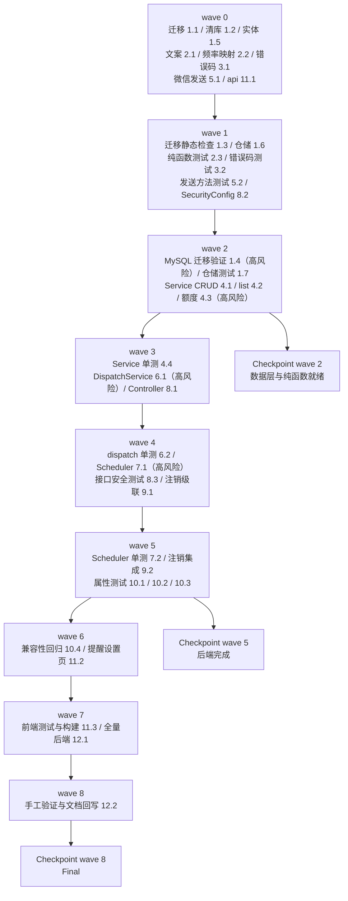

# Implementation Plan: 自定义提醒

## Overview

对齐 streak-system / growth-level-system 的「后端先行、由内向外」：
数据层（迁移 + 实体 + 仓储）→ 无外部依赖的纯函数（文案选择、频率↔星期几）→ 错误码 →
微信发送方法 → 服务层（CRUD + 额度）→ 发送与调度 → 改造既有代码（注销序列、`@EnableScheduling`）→
后端属性测试 → miniapp。每完成一组运行 `./mvnw test`；前端改动后运行 `npm run test` 与 H5 构建。

**本 spec 是纯增量**：只新增 `custom_reminders` / `reminder_quota` / `reminder_send_logs` 三张表，
只读 `user_growth.last_record_date` 与 `users.wx_openid`，不写这两张表；复用 `WeChatAccessTokenProvider`
（唯一 access_token 网关）与 `StreakJudgment.todayDone`（唯一「今日已记账」口径）。删掉这三张表，
记账/预算/登录/注销/邀请/成长/成就/连续记账全部原样成立——由任务 10.4 的兼容性回归锁住。

**改造既有代码的 3 处**：`WeChatClient`（新增 `sendSubscribeMessage`，其余方法一字不改）、
`AccountDeletionService`（在段删除之后、删除 users 行之前追加三表删除）、
`YouyuApplication` 或新增 `SchedulingConfig`（加 `@EnableScheduling`——本项目首个定时任务）。

**四处高风险实现点单独立任务、单独验证**：
调度器追补窗口与到点判定（任务 7.1，配任务 10.1 属性测试）、
发送幂等与故障隔离（任务 6.1，唯一键构造性保证，配任务 10.1）、
额度原子增减不丢更新（任务 4.3，配任务 10.1 属性测试）、
迁移脚本在真实 MySQL 上的 CHECK/唯一键/时区行为（任务 1.4，走 `deploy/dev-remote-db.sh`）。

**开工前需与需求对齐的一处取舍**（design.md「已知取舍与残留风险」）：
调度不追补跨自然日（00:00–00:10 扫描不补前一日 23:5x 的漏发）。已在设计记录理由，任务按设计实现。

## Tasks

- [x] 1. 数据层：迁移脚本、清库脚本、实体与仓储
  - [x] 1.1 新增迁移脚本 `V35__custom_reminder.sql`
    - **开始时重新核对 `src/main/resources/db/migration` 当前最大版本号与缺号占用**：设计定为 `V35`（撰写时最大为 `V34__streak.sql`，`V30` 由 user-feedback-system 预占）；若届时有变，按「大于目录内全部已存在版本号且未被任何迁移文件或其它 spec 预占的最小值」重算，**不得占用缺号 V30**
    - 不修改、不重命名、不删除任何已存在的迁移文件
    - `custom_reminders`：恰好 7 列——`reminder_id BIGINT NOT NULL AUTO_INCREMENT`（主键）、`user_id BIGINT NOT NULL`、`frequency VARCHAR(16) NOT NULL`、`remind_time TIME NOT NULL`、`enabled TINYINT(1) NOT NULL DEFAULT 1`、`created_at DATETIME NOT NULL`、`updated_at DATETIME NOT NULL`（两个 `DATETIME` **均不声明 `ON UPDATE`**）
    - 具名唯一约束 `uk_custom_reminders_user_freq_time`，列序恰为 `(user_id, frequency, remind_time)`
    - 具名非唯一复合索引 `idx_custom_reminders_enabled_time`，列序恰为 `(enabled, remind_time)`（全部列升序）
    - 具名 CHECK `ck_custom_reminders_frequency`：`frequency IN ('DAILY','WEEKDAY','WEEKEND')`（区分大小写）
    - `reminder_quota`：恰好 4 列——`user_id BIGINT NOT NULL`（主键）、`remaining INT NOT NULL DEFAULT 0`、`created_at DATETIME NOT NULL`、`updated_at DATETIME NOT NULL`；具名 CHECK `ck_reminder_quota_remaining`（`remaining >= 0`）
    - `reminder_send_logs`：恰好 8 列——`id BIGINT NOT NULL AUTO_INCREMENT`（主键）、`reminder_id BIGINT NOT NULL`、`user_id BIGINT NOT NULL`、`trigger_date DATE NOT NULL`、`result VARCHAR(24) NOT NULL`、`message_variant VARCHAR(16) NOT NULL`、`wx_errcode INT NULL`、`created_at DATETIME NOT NULL`；具名唯一约束 `uk_reminder_send_logs_reminder_date`，列序恰为 `(reminder_id, trigger_date)`
    - 三表均 InnoDB + `utf8mb4` + `utf8mb4_unicode_ci`；每张表与每一列写非空中文注释（写法对齐 `V34__streak.sql`）
    - **无任何指向 `users(id)` 的外键**（注销时由服务层显式删除）；不新建除这三张外的任何表、不为任何既有表增删改列、不对任何既有表执行 DML；不用窗口函数 / `CONVERT_TZ` / 存储过程 / 触发器；不用 `IF NOT EXISTS`
    - 脚本头部中文注释写明：三表用途、无外键是刻意选择、不接入法定节假日/调休、幂等由发送记录唯一键保证
    - _Requirements: 9.1, 9.2, 9.3, 9.4, 9.5, 9.6, 9.7, 9.8, 9.9, 9.10, 9.12_

  - [x] 1.2 清库脚本 `deploy/reset-db.sql` 增加三表
    - 在 `TRUNCATE TABLE streak_segments;` 之后、`TRUNCATE TABLE users;` 之前插入 `TRUNCATE TABLE reminder_send_logs;`、`TRUNCATE TABLE custom_reminders;`、`TRUNCATE TABLE reminder_quota;`，并加注释说明三表无外键、清空不依赖 `FOREIGN_KEY_CHECKS`（风格对齐既有段表那行）
    - 不新增任何针对 `flyway_schema_history` 的语句
    - _Requirements: 9.13_

  - [x] 1.3 迁移目录静态检查测试*
    - 复用既有 `MigrationDirectoryTest` 与 `migration-baseline.sha256` 机制：把新脚本纳入基线，断言新脚本存在、版本号大于全部既有版本、目录内版本号无重复、历史迁移文件内容未改动
    - _Requirements: 9.1_

  - [x] 1.4 在真实 MySQL 上执行迁移验证清单
    - 走 `bash deploy/dev-remote-db.sh`（或本地 MySQL 全量 V1→V35）执行迁移，逐项核对 `information_schema`：三表列数/类型/可空性/缺省/中文注释非空（`reminder_id`、`id` 的 `EXTRA` 含 `auto_increment`，`DATETIME` 列不含 `on update`）；索引组（主键、`uk_custom_reminders_user_freq_time`、`idx_custom_reminders_enabled_time`、`uk_reminder_send_logs_reminder_date`，列 `COLLATION` 为 `A`）；CHECK 子句；外键数为 0；引擎/排序规则/表注释
    - **CHECK 实测**：`frequency='X'` 被 `ck_custom_reminders_frequency` 拒绝、`frequency='daily'`（小写）被拒；`remaining=-1` 被 `ck_reminder_quota_remaining` 拒绝；被拒后行数不变
    - **唯一键实测**：同 `(user_id,frequency,remind_time)` 直插两次被拒（`ERROR 1062`）；同 `(reminder_id,trigger_date)` 直插两次被拒
    - 迁移后三表行数为 0；存量 `user_growth`/`users` 若干行快照迁移前后逐列不变
    - 幂等：连启两次应用，`flyway_schema_history` 该版本记录数为 1；以 `ddl-auto=validate` 启动成功、无针对三表的 schema 校验异常
    - 执行 `deploy/reset-db.sql` 后三表行数为 0、表仍存在、列定义不变、`flyway_schema_history` 保留
    - **在 design.md「Data Models」小节补记实测 MySQL 版本号与每项结论**（格式对齐 streak 设计 `V34` 实测块）；确认生产 MySQL ≥ 8.0.16
    - _Requirements: 9.1, 9.2, 9.5, 9.6, 9.8, 9.9, 9.10, 9.12, 9.13, 9.14_

  - [x] 1.5 新增实体 `CustomReminder` / `ReminderQuota` / `ReminderSendLog` 与枚举
    - `CustomReminder`：`@Entity @Table(name="custom_reminders")`，`@Id @GeneratedValue(IDENTITY)` 的 `id`（映射 `reminder_id`）、裸 `Long userId`（**不映射 `@ManyToOne`**）、`@Enumerated(STRING) ReminderFrequency frequency`、`LocalTime remindTime`、`boolean enabled`、`LocalDateTime createdAt/updatedAt`
    - `ReminderQuota`：`@Id Long userId`（应用赋值主键，不带 `@GeneratedValue`）、`int remaining`、`createdAt/updatedAt`
    - `ReminderSendLog`：`@Id @GeneratedValue(IDENTITY) Long id`、`Long reminderId/userId`、`LocalDate triggerDate`、`@Enumerated(STRING) ReminderSendResult result`、`String messageVariant`、`Integer wxErrcode`、`LocalDateTime createdAt`
    - 枚举 `ReminderFrequency{DAILY,WEEKDAY,WEEKEND}`、`ReminderSendResult{SENT,SKIPPED_NO_QUOTA,SKIPPED_STALE,FAILED}`
    - _Requirements: 9.2, 9.6, 9.7_

  - [x] 1.6 新增三个仓储接口
    - `CustomReminderRepository`：`existsByUserIdAndFrequencyAndRemindTime`、`countByUserId`、`findByUserIdOrderByCreatedAtAsc`、`findByIdAndUserId`、`findDue`（JPQL：`enabled=true and frequency in :freqs and remindTime between :start and :end`）、`deleteByUserId`
    - `ReminderQuotaRepository`：`findRemaining`、`addCapped`（原子上限累加 UPSERT）、`decrementFloorZero`、`zero`、`deleteByUserId`
    - `ReminderSendLogRepository`：`existsByReminderIdAndTriggerDate`、`deleteByUserId`
    - _Requirements: 5.3, 5.5, 5.8, 6.5, 7.1, 7.3_

  - [x] 1.7 仓储测试*（`@DataJpaTest`，H2 MODE=MySQL）
    - `findDue` 窗口边界（含 `now`、`now-10`、停用不入选、频率集合过滤）；`addCapped` 不存在→插入 min(delta,50)、存在→min(remaining+delta,50)；`decrementFloorZero` 在 0 时不变负；唯一键冲突抛 `DataIntegrityViolationException`
    - _Requirements: 3.3, 5.3, 5.5, 5.8_

- [x] 2. 纯函数：文案选择与频率↔星期几
  - [x] 2.1 新增 `ReminderMessageResolver`
    - `public static final String MSG_DONE = "今天已经完成啦~"`、`MSG_NOT_YET = "今天还没记账哦~"`；私有构造；`pick(boolean todayRecorded)` 返回两者之一（逐字符固定）
    - _Requirements: 4.1, 4.2, 4.3, 4.4_

  - [x] 2.2 频率↔星期几映射工具
    - 由 `DayOfWeek` 得当日命中的频率集合：`DAILY` 恒含；`WEEKDAY` 含 MON..FRI；`WEEKEND` 含 SAT/SUN；供 `ReminderScheduler.findDue` 传参。判定只依赖传入的 `LocalDate`/`DayOfWeek`，不读 JVM 默认时区
    - _Requirements: 2.1, 2.2, 2.3, 2.4, 2.8_

  - [x] 2.3 纯函数单测*
    - `pick`：两条、互斥、逐字符相等；频率映射：7 天 × 三频率全覆盖
    - _Requirements: 2.1, 2.2, 2.3, 4.1, 4.4_

- [x] 3. 错误码
  - [x] 3.1 `ApiException` 新增 5 个静态工厂
    - `reminderFrequencyInvalid()`(code `REMINDER_FREQUENCY_INVALID`, field `frequency`)、`reminderTimeInvalid()`(`REMINDER_TIME_INVALID`, `remindTime`)、`reminderDuplicate()`(`REMINDER_DUPLICATE`, `frequency`)、`reminderLimitExceeded()`(`REMINDER_LIMIT_EXCEEDED`, null)、`reminderGrantInvalid()`(`REMINDER_GRANT_INVALID`, `grantedCount`)；均 400，`message` ≤100 中文、不含 id/邮箱/令牌；不重命名任何既有码
    - _Requirements: 1.3, 1.4, 5.4, 8.6, 11.5_

  - [x] 3.2 错误码测试*
    - 断言 5 个码取值、field、status、message 约束；错误体字段集恰为 `{code,message,field}`，field 无关时省略
    - _Requirements: 8.6, 8.7, 11.5_

- [x] 4. 服务层：CRUD 与额度上报
  - [x] 4.1 `ReminderService.create` / `update` / `delete`
    - `create` 严格按需求 1.9 优先级短路：`parseFrequency`→`parseHhmm`→`existsBy...`→`countByUserId>=10`；`parseHhmm` 正则 `^([01]\d|2[0-3]):[0-5]\d$`；唯一键冲突捕 `DataIntegrityViolationException`→`REMINDER_DUPLICATE`；写 `created_at/updated_at`=`now(clock)`
    - `update`：`findByIdAndUserId` 空→统一 `NOT_FOUND`；只更新提交字段、其余保持原值；校验失败保持整行不变；改动后撞另一条→`REMINDER_DUPLICATE`
    - `delete`：删 `custom_reminders` 行，不删历史 `reminder_send_logs`
    - _Requirements: 1.1, 1.2, 1.3, 1.4, 1.5, 1.6, 1.7, 1.9, 7.3, 7.4, 7.5, 7.6, 7.7, 7.8_

  - [x] 4.2 `ReminderService.list`
    - 仅返回本人提醒，按 `created_at` 升序，每项 4 字段；空则空列表；一并返回 `remainingQuota`（无记录→0）
    - _Requirements: 5.7, 7.1, 7.2_

  - [x] 4.3 `ReminderService.grantQuota`（原子额度增减，高风险）
    - `grantedCount` 解析为整数且 ∈[1,5]，否则 `REMINDER_GRANT_INVALID`；`addCapped` 原子累加、上限 50；返回增加后剩余；确保并发上报不丢更新（`addCapped` 用 UPSERT，或退化为悲观锁/`@Version`，二选一但必须防丢更新）
    - _Requirements: 5.1, 5.2, 5.3, 5.4, 5.8_

  - [x] 4.4 服务层单测*（H2 MODE=MySQL）
    - create 校验优先级（同时命中多条只返回最高）、10 条上限、时间边界（`24:00`/`8:00`/`08:60`/空/小写）；update 部分更新与 NOT_FOUND 归属、改动撞重复；grantQuota 上限与非法值；list 空列表与额度默认 0；并发 addCapped 不丢更新
    - _Requirements: 1.5, 1.6, 1.9, 5.3, 5.4, 5.8, 7.2, 7.3, 7.5_

- [x] 5. 微信一次性订阅消息发送
  - [x] 5.1 `WeChatClient.sendSubscribeMessage`
    - 独立 `RestClient` + 独立超时（3000ms），`POST cgi-bin/message/subscribe/send?access_token=...`；请求体 `touser`/`template_id`（`app.wechat.subscribe.reminder-template-id`）/`data`（文案映射到配置化字段）；返回微信 `errcode`；识别 `40001` 时 `accessTokenProvider.forceRefresh` 重试一次；不新建第二套凭证获取
    - 新增配置项 `app.wechat.subscribe.*`（模板 id + 字段名映射），未配置时安全降级为 `FAILED`（由 6.1 处理）
    - _Requirements: 6.1, 11.3_

  - [x] 5.2 `WeChatClient` 发送方法单测*（Mock HTTP）
    - errcode=0 正常、非零透传、40001 触发一次 forceRefresh 后重试、超时/异常映射
    - _Requirements: 6.1, 6.4_

- [x] 6. 发送编排与幂等（高风险）
  - [x] 6.1 `ReminderDispatchService.dispatch(reminder, today, now)`
    - 顺序：① 幂等预检 `existsByReminderIdAndTriggerDate`→有则 return；② 读 `user_growth.last_record_date`（只读，失败/空→`done=false`）→`ReminderMessageResolver.pick`；③ 超追补窗口（`remindTime < now-10min`）→写 `SKIPPED_STALE`、不扣额度；④ 额度=0 或 `wx_openid` 空→写 `SKIPPED_NO_QUOTA`、不扣额度、不报错；⑤ 发微信：`errcode=0`→写 `SENT`+`decrementFloorZero`；非零/异常→写 `FAILED`（记 errcode）、额度不动；`43101`→额度 `zero()`
    - 写发送记录唯一键冲突（并发）→静默放弃本次、不重复发微信、不报错；`message_variant` 写 `DONE`/`NOT_YET`
    - **只读 `user_growth`/`users`，不 save**
    - _Requirements: 3.4, 4.5, 4.6, 4.7, 4.8, 5.5, 5.6, 6.1, 6.2, 6.3, 6.4, 6.5, 6.6, 6.8_

  - [x] 6.2 dispatch 单测*（Mock `WeChatClient`）
    - 幂等：重复 dispatch 只发一次；各 SendResult 分支（无额度/无 openid/超窗口/成功扣减/失败不扣/43101 归零）；读 user_growth 失败兜底选 NOT_YET；唯一键冲突静默放弃
    - _Requirements: 3.4, 4.5, 4.8, 5.5, 5.6, 6.1, 6.2, 6.3, 6.4, 6.6_

- [x] 7. 调度器与 `@EnableScheduling`（高风险）
  - [x] 7.1 `ReminderScheduler.scan` + 启用调度
    - `@Scheduled(cron="5 * * * * *", zone="Asia/Shanghai")`；`today=LocalDate.now(clock)`、`now=LocalTime.now(clock).truncatedTo(MINUTES)`、`windowStart=max(now-10min, 00:00)`（不追补跨自然日）；按当日 `DayOfWeek` 得频率集合调 `findDue(freqs, windowStart, now)`；逐条 `dispatch` 用 try/catch 隔离，单条异常只记告警日志、继续其余、绝不中断整轮
    - 在 `YouyuApplication` 或新增 `config/SchedulingConfig` 加 `@EnableScheduling`（本项目首个定时任务）
    - _Requirements: 3.1, 3.2, 3.3, 3.5, 3.6, 3.7, 3.8, 6.7_

  - [x] 7.2 调度器单测*
    - 单条抛异常不中断整轮；窗口边界（now、now-10、超窗、未来不处理）；停用不入选；跨天不追补前一日
    - _Requirements: 3.3, 3.4, 3.7, 3.8, 6.7_

- [x] 8. 控制器与安全边界
  - [x] 8.1 `ReminderController`（`/api/reminders`）
    - 5 个端点（GET 列表 / POST 创建 / PUT 更新 / DELETE 删除 / POST `quota:grant`）；每方法首步 `requireExistingUserId`（对齐 `StreakController`：令牌合法且用户存在，否则 `UNAUTHENTICATED`）；`frequency`/`remindTime`/`grantedCount` 以原文接收交服务层解析（不让框架类型转换抢先报 `FIELD_REQUIRED`）；数据归属只认令牌用户 id，忽略任何指定目标用户的入参
    - DTO 用 record：`ReminderItem`(4 字段)、`ReminderListResponse{reminders, remainingQuota}`、`GrantResponse{remainingQuota}`
    - _Requirements: 1.1, 5.1, 5.7, 7.1, 8.1, 8.3, 8.4, 8.5_

  - [x] 8.2 SecurityConfig 路由确认
    - `/api/reminders/**` 落在 `anyRequest().authenticated()` 下（若既有配置已覆盖则无需改）；确认不要求 `X-Ledger-Id`
    - _Requirements: 8.1, 8.5_

  - [x] 8.3 接口契约与安全测试*（`@SpringBootTest` / MockMvc）
    - 无/过期令牌→`UNAUTHENTICATED` 先于字段校验；用户 A 访问用户 B 的 `reminderId`→与不存在同一 `NOT_FOUND`；携带指定目标用户参数被忽略且不报错；缺 `X-Ledger-Id` 不被拒；错误体字段集恰为 `{code,message,field}`
    - _Requirements: 8.1, 8.2, 8.3, 8.4, 8.5, 8.7, 8.8_

- [x] 9. 改造既有代码：注销级联
  - [x] 9.1 `AccountDeletionService` 追加三表删除
    - 构造函数注入三个新仓库；在 `streakSegmentRepository.deleteByUserId` 之后、`userRepository.delete(user)` 之前，同一事务内按 `reminder_send_logs`→`custom_reminders`→`reminder_quota` 顺序删除；任一失败整个注销事务回滚；注销接口响应字段集/状态码/错误码不变
    - _Requirements: 9.11, 11.4_

  - [x] 9.2 注销集成测试*
    - 建提醒+额度+发送记录后注销，断言三表该用户行数均为 0、注销响应不变
    - _Requirements: 9.11, 11.4_

- [x] 10. 后端属性测试（jqwik）
  - [x] 10.1 Property 1/2/5/6：幂等、额度守恒有界、追补窗口单调、校验优先级
    - Property 1（幂等，需求 3.5/6.5/6.6）、Property 2（额度 ∈[0,50] 且 clamp(Σ授权−ΣSENT)，需求 5.3/5.5/5.8）、Property 5（追补窗口单调，需求 3.3/3.4/3.7）、Property 6（校验优先级确定，需求 1.9）
    - _Requirements: 1.9, 3.3, 3.4, 3.5, 3.7, 5.3, 5.5, 5.8, 6.5, 6.6_

  - [x] 10.2 Property 3/4：文案二选一、频率↔星期几且时区稳定
    - Property 3（值域两条、互斥、逐字符固定，需求 4.1/4.4）、Property 4（频率↔星期几，改 JVM 默认时区结果不变——**改时区的用例需串行**，需求 2）
    - _Requirements: 2.1, 2.2, 2.3, 2.7, 4.1, 4.4_

  - [x] 10.3 Property 7：纯增量只读
    - dispatch/CRUD 前后 `user_growth` 六项与 `users` 各列逐行相等
    - _Requirements: 6.8, 11.1, 11.2_

  - [x] 10.4 兼容性回归*
    - 删除三表全部行后，记账/预算/登录/注销/邀请/成长/成就/连续记账接口响应字段集/取值/状态码/错误码不变；源码扫描断言不新增第二套凭证获取、不自行调 `cgi-bin/token`
    - _Requirements: 11.3, 11.4, 11.6_

- [x] 11. miniapp：提醒设置页
  - [x] 11.1 `src/api/reminder.js`
    - 5 个函数全部 `noLedger:true`，对齐 `api/streak.js`
    - _Requirements: 10.11_

  - [x] 11.2 `src/pages/reminder/reminder.vue` + `pages.json` + `me.vue` 入口
    - 列表 + 剩余次数 + 新增/编辑（频率三选一 + 时:分 picker，本地校验小时 0–23/分钟 0–59）+ 开关/删除 + 订阅授权（`wx.requestSubscribeMessage`→允许才上报）；额度 0 提示再授权；未登录不发请求只显登录入口；接口错误或 3000ms 超时→失败提示+重试、自动重试 0 次；时间以 `Asia/Shanghai` 呈现，不展示金额/账本名/邮箱/邀请码；`pages.json` 注册 `pages/reminder/reminder`，`me.vue` 加入口
    - _Requirements: 10.1, 10.2, 10.3, 10.4, 10.5, 10.6, 10.7, 10.8, 10.9, 10.10, 10.11_

  - [x] 11.3 前端测试与构建*
    - 未登录不发请求、空列表渲染、本地校验拦截非法提交、授权拒绝不上报且不进错误态、额度 0 提示、3000ms 超时不重试；`npm run test` 与 H5 构建通过
    - _Requirements: 10.2, 10.3, 10.5, 10.7, 10.9_

- [x] 12. 收尾
  - [x] 12.1 全量后端测试与构建
    - `./mvnw test` 全绿；以 `ddl-auto=validate` 启动成功
    - _Requirements: 9.14_

  - [x] 12.2 手工验证清单与文档回写*
    - 真机走一遍授权→到点收到提醒→已记账文案切换；把任务 1.4 的 MySQL 实测结论回写 design.md
    - _Requirements: 3.2, 4.2, 4.3, 10.1_

## Notes

- 每条属性测试任务标注 `_Requirements`，与 design.md 的 Property 1–7 一一对应（10.1→P1/P2/P5/P6、10.2→P3/P4、10.3→P7）。
- 带 `*` 的任务为测试/验证类，可在其被测实现任务完成后并行推进。
- 需求 1.8（创建耗时上界）、10.x 的**渲染与交互**、9.x 的**schema 元数据实测**属手工/环境相关验收（分别由 12.1、11.3/12.2、1.4 承载），刻意不做属性测试。
- 每完成一组后端任务运行 `./mvnw test`；前端改动后运行 `npm run test` 与 H5 构建。
- 四处高风险任务（1.4 迁移实测、4.3 额度原子性、6.1 发送幂等、7.1 调度追补窗口）单独立任务并配属性/集成测试锁定。

## Task Dependency Graph

```json
{
  "waves": [
    { "id": 0, "tasks": ["1.1", "1.2", "1.5", "2.1", "2.2", "3.1", "5.1", "11.1"] },
    { "id": 1, "tasks": ["1.3", "1.6", "2.3", "3.2", "5.2", "8.2"] },
    { "id": 2, "tasks": ["1.4", "1.7", "4.1", "4.2", "4.3"] },
    { "id": 3, "tasks": ["4.4", "6.1", "8.1"] },
    { "id": 4, "tasks": ["6.2", "7.1", "8.3", "9.1"] },
    { "id": 5, "tasks": ["7.2", "9.2", "10.1", "10.2", "10.3"] },
    { "id": 6, "tasks": ["10.4", "11.2"] },
    { "id": 7, "tasks": ["11.3", "12.1"] },
    { "id": 8, "tasks": ["12.2"] }
  ]
}
```

同层内任务彼此无文件冲突，可并行推进：


