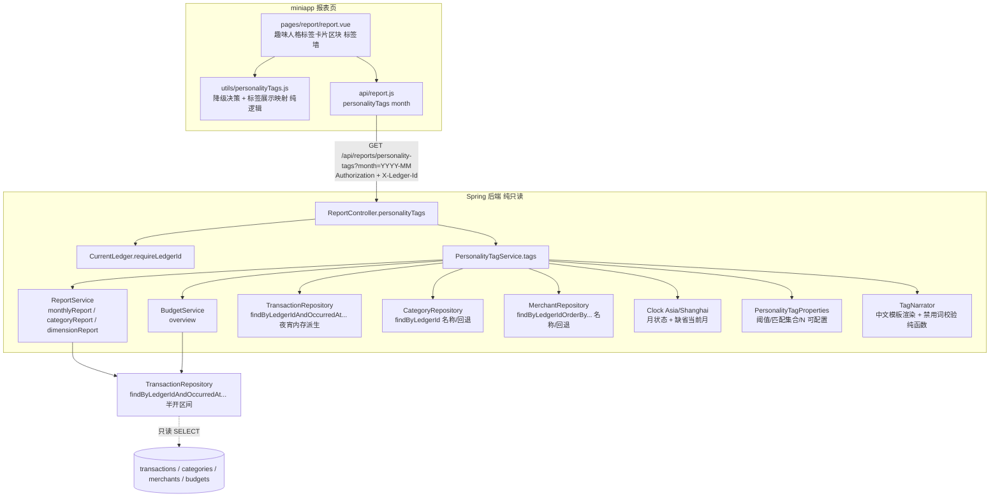

# Design Document

## Overview

趣味人格标签（Fun_Personality_Tags_System）是「有余」报表能力的**纯只读、纯增量**扩展，与已落地的智能月报
（smart-monthly-report）、AI 趣味分析（ai-fun-analysis）**并列且解耦**。它针对某一自然月，根据用户的记账与预算
数据，给用户贴上一组**轻松、俏皮、有温度**的人格标签——**省钱达人、理财新星、预算大师、外卖探索家、咖啡收藏家、
夜宵王、旅行狂人、购物生活家**，让打开报表页像拆一个小盲盒。

核心链路一句话：**复用既有报表/预算聚合口径把目标月 M 的派生指标（节省额、结余率、预算使用率、行为类分类/商户
笔数占比金额、夜宵时段笔数）算出来 → 对内置标签目录逐枚做确定性达标判定 → 按强度分确定性挑出最贴切的前 N 枚 →
用一套内置中文模板讲成暖心俏皮的标签文案 → 打包给报表页一个标签墙卡片渲染。把整块摘掉，报表/预算/月报/AI 趣味
分析/交易原样成立。**

设计目标与边界（对齐需求 14「纯增量、纯只读」）：

- **不落库、不迁移、不新增错误码、不新增仓库查询**：标签是对既有 `transactions`、`categories`、`merchants`、
  预算数据的**实时聚合派生**，不新增数据库表、不新增/修改任何 Flyway 迁移脚本、不对任何表执行写操作、不新增任何
  错误码、不新增任何 repository 方法（需求 14.1、14.2、14.3）。复用既有错误码 `UNAUTHENTICATED` /
  `LEDGER_NOT_ACCESSIBLE` / `REPORT_PARAM_INVALID`。
- **模板/规则驱动，非外部 LLM**：所有标签的达标判定与强度分由后端从既有交易/预算数据**确定性算出**，标签文案由
  一套内置中文模板生成；v1 **不接入任何外部大模型/第三方 AI 服务**，用户财务数据**不出服务器**（需求 8.2、13.1、
  13.2）。
- **复用既有聚合口径**：金额一律 `BigDecimal` 保留 2 位小数（HALF_UP）；占比/变化率（百分比）保留 2 位小数
  （HALF_UP）；自然月边界一律按 `Asia/Shanghai`（UTC+08:00）；所有金额/笔数统计排除 `type=transfer`。这些口径全部
  沿用 `ReportService` / `BudgetService` 既有实现，本设计**优先复用其方法**而非另起炉灶，从源头保证与 `/api/reports/*`、
  `/api/budgets` 逐值一致（需求 14.5）。
- **一个只读接口**：新增单个只读接口 `GET /api/reports/personality-tags`，落在既有 `ReportController`，一次返回目标月
  挑选后不超过 N（默认 4）枚人格标签或一条鼓励性兜底文案（需求 8、11）。
- **月状态语义与月报/AI 趣味分析一致**：`partial`（目标月为当前自然月且当月未结束）/ `final`（目标月早于当前自然月）；
  v1 全部标签均以完整自然月数据判定，故 `partial`（及未来月）时**全部跳过 → 鼓励兜底**，而非报错（需求 1.3、1.4、
  1.10、1.11、10.2）。
- **正向包装，绝不评判**：所有标签标题与文案一律采用**正向或中性**措辞，**禁用任何负面/评判/羞辱/警示词**；
  「冲动购物」等偏消费行为只以正向标签 `SHOPPING_LIFER`（购物生活家）呈现（需求 8.3、8.4、8.5）。这是本 spec 的
  核心约束，在 `TagNarrator` 设计中以**可枚举的禁用词汇表**硬性编码。
- **降级不阻断**：接口失败或超时，报表页静默隐藏标签卡片区块，其余既有报表照常展示（需求 12）。

### 关键设计决策（源自需求「范围与前提约定」）

| 决策 | 取值 | 依据 |
|------|------|------|
| 生成方式 | 模板/规则驱动，v1 不接外部 LLM，数据不出服务器 | 范围约定 1；需求 8.2、13.1、13.2 |
| 标签目录（v1） | 恰好 8 枚：`SAVINGS_MASTER`/`FINANCE_STAR`/`BUDGET_MASTER`/`TAKEOUT_EXPLORER`/`COFFEE_COLLECTOR`/`LATE_NIGHT_KING`/`TRAVEL_ENTHUSIAST`/`SHOPPING_LIFER` | 范围约定 2；需求 2.1、2.2 |
| 目标月缺省 | 当前自然月（`Asia/Shanghai`） | 需求 1.2、11.2 |
| 月状态 | `partial`（目标月=当前月且未结束）/ `final`（目标月早于当前月） | 需求 1.3、1.4 |
| partial/未来月处理 | 全部标签跳过（v1 均以完整月判定）→ 鼓励兜底 | 需求 1.10、1.11、10.2 |
| 省钱达人比较基线 | 目标月 M vs 上一自然月 M−1（月环比） | 需求 3.1 |
| 行为类识别口径 | 仅按分类维度 + 商户维度（可配置名称集合），不做 `note` 关键词匹配 | 范围约定 3；需求 6.1、6.5 |
| 夜宵识别口径 | 复用既有「按账本+`occurredAt` 半开区间」查询，内存派生 `Asia/Shanghai` 本地小时，默认 `[22:00, 次日 04:00)` | 范围约定 3；需求 7.1、7.2 |
| 节省/结余/预算 | 复用 `monthlyReport`、`BudgetService.overview` 口径 | 需求 3.1、4.1、5.1；14.5 |
| 分类/商户笔数占比金额 | 复用 `categoryReport`（含笔数）与 `dimensionReport(dim=merchant)`（含笔数） | 需求 6.3；14.5 |
| 展示数量 N | 服务端可配置整数（1–8，默认 4），越界回退默认 4；不作为请求参数 | 范围约定 5；需求 1.1、9.3、9.4 |
| 强度分与决胜键 | 判定指标相对阈值的归一化比值（6dp，非负有限），降序；并列按固定标签优先级（全序）决胜 | 需求 9.1、9.2、9.5 |
| 去重 | 同一标签键至多保留一枚（保留强度分更高者，再按决胜键） | 需求 9.7 |
| 阈值/文案可配置 | 每枚标签阈值与文案模板可配置，未配置/非法回退默认值 | 需求 2.4、2.5 |
| 空/新用户/兜底 | 无标签达标、数据不足、partial 跳空 → 一条鼓励文案（1..60 字符）+ `isFallback=true`，不隐藏模块 | 范围约定 7；需求 10 |
| 账本隔离 | 复用 `CurrentLedger`（`X-Ledger-Id` 解析 + 默认账本兜底）；全部账本聚合视图不展示 | 需求 1.5、1.9、11.6、11.8、11.9 |
| 删除名回退 | 分类 → `已删除分类`；商户 → `已删除商户`（固定、可复现） | 需求 6.8 |

## Architecture

趣味人格标签是既有分层（Controller → Service → Repository）之上的一层**只读组合器（read-only composer）**：
`PersonalityTagService` 编排既有 `ReportService`、`BudgetService` 与既有交易查询，把 M（及省钱达人所需的 M−1）
的派生指标算成一组**标签达标候选**，确定性打分挑选 → 交给 `TagNarrator` 用中文模板渲染 → 打包成一个响应，由
`ReportController` 返回。



要点：

- **鉴权与隔离沿用既有链路**：Spring Security 过滤链统一校验令牌（无效/过期/用户不存在 → `UNAUTHENTICATED`）；
  `CurrentLedger` 解析 `X-Ledger-Id`（不可访问 → `LEDGER_NOT_ACCESSIBLE`）、无头则回退默认账本。本接口不新增任何
  鉴权逻辑（需求 11.5、11.6、11.9）。
- **组合优先于重写**：8 枚标签的原始指标全部来自既有 `ReportService.monthlyReport / categoryReport /
  dimensionReport` 与 `BudgetService.overview`，天然与 `/api/reports/*`、`/api/budgets` 同口径（需求 14.5）；
  `PersonalityTagService` 只做**派生**（节省额、结余率、行为类匹配聚合、夜宵时段过滤、归一化打分、挑选）与
  **回退名解析**，不触碰任何取数与边界逻辑。
- **无新增仓库查询**：分类支出/笔数复用 `categoryReport`，商户支出笔数复用 `dimensionReport(dim=merchant)`，
  月度总收支复用 `monthlyReport`，预算使用率复用 `BudgetService.overview`，夜宵时段复用既有
  `findByLedgerIdAndOccurredAtGreaterThanEqualAndOccurredAtLessThan`（与 `BudgetService.monthExpenses` 同一查询）后
  在内存派生本地小时。因此**不新增任何 repository 方法、不新增任何 SQL**，坐实纯只读、纯增量（需求 14.1、14.2）。
- **单次事务只读**：`PersonalityTagService.tags` 标注 `@Transactional(readOnly = true)`，全过程无任何写语句（需求 14.1、14.6）。
- **文案与数值解耦**：`TagNarrator` 是纯函数，输入标签机器字段、输出中文标签文案；不做任何 I/O、不调用任何外部
  服务（需求 8.2、13.1、13.2），从而可被单测/属性测试直接覆盖「文案数值 == 机器字段」与「禁用词零命中」（需求 8.3、8.7）。

### partial 月与比较窗口（重要）

v1 的全部标签均以**完整自然月**数据判定：省钱达人是 M vs M−1 的月环比，其余标签依赖 M 的完整月度聚合。因此：

- **`final` 月**：M 已完结（且省钱达人的 M−1 完整可比）→ 正常评估全部标签。
- **`partial` 月**（含缺省的当前自然月）与**未来月**：按需求 1.10、1.11、10.2「跳过全部标签判定」→ 候选为空 →
  返回一条鼓励性兜底文案（`isFallback=true`），仍携带 `month` 与 `monthStatus`。这是 v1 的保守取舍：拿「进行到一半的
  M」判定会误导（例如月初就报「预算大师」或「省钱达人」）。范围约定 4 的可选替代（缺省改取上一个已完结月）留待后续 spec。

## Components and Interfaces

### 后端

#### 1. `ReportController.personalityTags`（新增一个端点，落在既有控制器）

```java
/**
 * 趣味人格标签（需求 1、8、9、10、11）：month 为 YYYY-MM，缺省取 Asia/Shanghai 当前自然月。
 * 一次返回目标月挑选后不超过 N（默认 4）枚人格标签，或一条鼓励性兜底文案。
 * 纯只读派生，复用既有报表/预算聚合口径，不新增错误码。
 *
 * <p>鉴权/账本/参数三类错误的优先级由既有链路天然保证「鉴权 → 账本 → 参数」：
 * requireLedgerId() 先触发鉴权与账本校验，parseMonth 后触发（需求 11.11、11.12、11.13）。</p>
 */
@GetMapping("/personality-tags")
public ResponseEntity<PersonalityTagsResponse> personalityTags(
        @RequestParam(name = "month", required = false) String month) {
    Long ledgerId = currentLedger.requireLedgerId();            // 未认证/账本不可访问在此抛既有错误
    YearMonth ym = (month == null || month.isBlank())
            ? YearMonth.now(clock)                              // 需求 1.2、11.2 缺省当前月
            : parseMonth(month, "month");                       // 非法格式 → REPORT_PARAM_INVALID（需求 11.7）
    return ResponseEntity.ok(personalityTagService.tags(ledgerId, ym));
}
```

- 复用 `ReportController` 既有的 `parseMonth`（`YearMonth.parse` 失败抛 `ApiException.reportParamInvalid("month", ...)`）、
  `currentLedger`、`clock`，**不新增任何解析或错误码**（需求 11.7、14.3）。`parseMonth` 亦覆盖「月份不在 01–12」
  （`YearMonth.parse` 会拒绝非法月份 → `REPORT_PARAM_INVALID`）。
- 路径落在既有 `@RequestMapping("/api/reports")` 下，与 `monthly` / `monthly-digest` / `ai-insights` 同前缀、同模式。
- 鉴权/账本/参数错误优先级由既有链路天然保证「鉴权 → 账本 → 参数」：`requireLedgerId()` 先触发鉴权与账本校验，
  `parseMonth` 后触发（需求 11.11、11.12、11.13）。

#### 2. `PersonalityTagService`（新增，只读组合器）

```java
@Service
public class PersonalityTagService {
    private final ReportService reportService;
    private final BudgetService budgetService;
    private final TransactionRepository transactionRepository;   // 仅复用既有半开区间查询（夜宵）
    private final CategoryRepository categoryRepository;
    private final MerchantRepository merchantRepository;
    private final Clock clock;
    private final PersonalityTagProperties props;                // 阈值/匹配集合/N，可配置
    private final TagNarrator narrator;

    @Transactional(readOnly = true)
    public PersonalityTagsResponse tags(Long ledgerId, YearMonth month) { ... }
}
```

**职责与编排步骤（全部只读）：**

1. **月状态**：`status = month.isBefore(YearMonth.now(clock)) ? "final" : "partial"`（需求 1.3、1.4）。
2. **partial/未来月短路**：若 `status == "partial"`（含目标月晚于当前月），v1 全部标签依赖完整月 → 候选为空 →
   直接走**鼓励兜底**（`isFallback=true`），仍携带 `month` 与 `monthStatus`（需求 1.10、1.11、10.2、10.5）。
3. **取数（复用既有服务，同口径）**——仅在 `final` 月执行：
   - `monthlyReport(ledgerId, M)`、`monthlyReport(ledgerId, M−1)` → 月度总收入/总支出（`SAVINGS_MASTER`、
     `FINANCE_STAR`，需求 3.1、4.1）。
   - `budgetService.overview(ledgerId, M)` → `BudgetOverviewResponse{hasBudget, totalBudget, spent, usedPercent}`
     （`BUDGET_MASTER`，需求 5.1）。
   - `categoryReport(ledgerId, from, to, EXPENSE)`（M 全月范围）→ 每分类支出金额、笔数、占比（行为类标签分类维度 +
     当月总支出，需求 6.3）。
   - `dimensionReport(ledgerId, from, to, EXPENSE, "merchant")` → 每商户支出金额、笔数（行为类标签商户维度，需求 6.3）。
   - `transactionRepository.findByLedgerIdAndOccurredAtGreaterThanEqualAndOccurredAtLessThan(ledgerId, from, to)`
     → 过滤 `type=EXPENSE`、内存派生 `Asia/Shanghai` 本地小时（`LATE_NIGHT_KING`，需求 7.1）。
4. **逐枚标签达标判定（8 个 evaluator，纯派生、互相独立）**：见下「标签达标判定规则」。每枚达标标签携带完整机器字段。
5. **强度打分 + 排序 + 去重 + 截断**：见下「强度打分与确定性挑选」。
6. **文案渲染**：对每枚挑选后的标签调用 `narrator.render(tag)` 生成 `narrativeText`；渲染失败（缺标题或缺全部关键
   数值）则 `narrativeText=null` 并标记生成失败，保留机器字段、不报错（需求 8.9）。
7. **兜底判定**：若挑选后标签列表为空 → `isFallback=true` + 一条鼓励文案（1..60 字符，来源为空则用内置默认）；否则
   `isFallback=false`、`fallbackText=null`（需求 10.1、10.3、10.4、10.6）。
8. **隐私净化**：响应 DTO 结构本身即为白名单（仅派生统计 + 标题/表情/维度名 + 标签文案），不含 email/token/其它账本
   数据/`external_id`/原始备注/商户原始标识（需求 13.3、13.4、13.5）。

> **性能（需求 11.10）**：单账本单月数据量小，上述至多约 5–6 次按账本+月份的窗口查询与内存派生，服务端处理远低于
> 2000ms。选择「组合既有服务」而非「一次取数自算全部」，是为从实现上保证与既有接口逐值同口径（需求 14.5）；若未来
> 需要，可在不改契约前提下改为单次取数聚合。

#### 3. `PersonalityTagProperties`（新增，`@ConfigurationProperties`，阈值/匹配集合/N 可配置）

集中承载可配置阈值、匹配集合与展示上限，缺省值即需求默认值；不新增数据库、不新增错误码。前缀 `youyu.personality-tags`，
镜像既有 `AiInsightProperties` 的 JavaBean 绑定风格。**任一阈值未配置或非法（金额/笔数为负、占比/比率不在 0.00–100.00、
夜宵时段无法解析）时回退该项默认值继续评估，不报错**（需求 2.4、2.5、7.3、9.4）。

| 属性 | 默认 | 依据 |
|------|------|------|
| `maxCount`（N，展示上限，钳制到 1–8，越界回退 4） | 4 | 需求 1.1、9.3、9.4 |
| `savingsAmountMin`（节省额下限，元，范围 0.01–999999999.99） | 200.00 | 需求 3.3 |
| `savingsRatePctMin`（节省率下限，%，范围 0.01–100.00） | 15.00 | 需求 3.3 |
| `financeSaveRatePctMin`（结余率下限，%，范围 0.00–100.00） | 20.00 | 需求 4.4 |
| `budgetUsedPctMax`（预算使用率上限，%，范围 0.00–100.00） | 90.00 | 需求 5.3 |
| `takeoutCountMin`（外卖笔数下限） | 8 | 需求 6.6 |
| `takeoutPctMin`（外卖占比下限，%） | 20.00 | 需求 6.6 |
| `coffeeCountMin`（咖啡笔数下限） | 5 | 需求 6.6 |
| `travelAmountMin`（旅行金额下限，元） | 1000.00 | 需求 6.6 |
| `travelCountMin`（旅行笔数下限） | 5 | 需求 6.6 |
| `shoppingCountMin`（购物笔数下限） | 8 | 需求 6.6 |
| `shoppingAmountMin`（购物金额下限，元） | 800.00 | 需求 6.6 |
| `lateNightCountMin`（夜宵笔数下限，范围 1–999999） | 5 | 需求 7.4 |
| `lateNightStartHour`（夜宵起始小时，含） | 22 | 需求 7.2 |
| `lateNightEndHour`（夜宵结束小时，不含，跨零点） | 4 | 需求 7.2 |
| `takeoutCategories` / `takeoutMerchants` | 外卖/餐饮相关名称集合 | 需求 6.1 |
| `coffeeCategories` / `coffeeMerchants` | 咖啡相关名称集合 | 需求 6.1 |
| `travelCategories` / `travelMerchants` | 旅行相关名称集合 | 需求 6.1 |
| `shoppingCategories` / `shoppingMerchants` | 购物相关名称集合 | 需求 6.1 |

约定：某项下限**未配置**时视为该项**不参与判定**（需求 6.6）；`maxCountClamped()` 将 N 越界（<1 或 >8）回退默认 4
（需求 9.4）；`lateNightWindow()` 将非法时段回退 `[22:00, 次日 04:00)`（需求 7.3）；金额/比率/笔数阈值经
`sanitize()` 校验，非法回退默认（需求 2.5）。

#### 4. 标签达标判定规则（`PersonalityTagService` 内部，逐枚）

统一记号：目标月总收入 `income`、总支出 `expense`、结余 `balance = income − expense`（2dp，可负）；上月总支出
`prevExpense`；金额一律 2dp HALF_UP，占比/比率一律 2dp HALF_UP。每枚标签**独立判定**：改变任一枚的达标结果不改变其余
（需求 2.3）。

- **`SAVINGS_MASTER`（省钱达人，需求 3）**：`savings = prevExpense − expense`（2dp，可负，需求 3.1）；`savingsRate`
  仅在 `prevExpense > 0` 时有定义 `= savings / prevExpense × 100`（2dp，需求 3.2）。达标当且仅当
  `prevExpense > 0 且 savings > 0 且（savings ≥ savingsAmountMin 或 savingsRate ≥ savingsRatePctMin）`（需求 3.4）；
  `prevExpense == 0` 或 `savings ≤ 0` 不授予、不报错、不中断其余（需求 3.5、3.6）。携带目标月总支出、上月总支出、
  节省额、节省率（需求 3.4）。
- **`FINANCE_STAR`（理财新星，需求 4）**：`saveRate` 仅在 `income > 0` 时有定义 `= balance / income × 100`（2dp，
  需求 4.3）。达标当且仅当 `income > 0 且 balance > 0 且 saveRate ≥ financeSaveRatePctMin`（需求 4.5）；
  `income == 0` 或 `balance ≤ 0` 或 `saveRate < 下限` 不授予、不报错（需求 4.6）。无任何计入交易时 income/expense/balance
  均取 0.00（需求 4.2）。携带总收入、总支出、结余、结余率（需求 4.5）。
- **`BUDGET_MASTER`（预算大师，需求 5）**：从 `budgetService.overview(ledgerId, M)` 取 `hasBudget`、`totalBudget`、
  `spent`。仅在 `hasBudget 且 totalBudget > 0.00` 时计算**2 位小数**预算使用率
  `usedRate = spent / totalBudget × 100`（BigDecimal，HALF_UP，与 `BudgetService` 的 `spent`/`totalBudget` 同源、
  同口径；`overview` 自身返回的 `usedPercent` 为 int，本设计据同一 `spent`/`totalBudget` 计算 2dp 使用率以满足需求 5
  的 2 位小数要求，需求 5.2）。达标当且仅当 `hasBudget 且 totalBudget > 0.00 且 spent ≤ totalBudget 且
  usedRate ≤ budgetUsedPctMax`（需求 5.3）；`spent > totalBudget` 或 `usedRate > 上限` 不授予（需求 5.4）；未设预算或
  预算 ≤ 0 不计算使用率、不授予、不报错（需求 5.5）。携带本月预算、已用支出、预算使用率（2dp，需求 5.3）。
- **行为类标签（`TAKEOUT_EXPLORER`/`COFFEE_COLLECTOR`/`TRAVEL_ENTHUSIAST`/`SHOPPING_LIFER`，需求 6）**：
  每枚配置一组**分类名称集合**与/或**商户名称集合**（`props`）。将目标月当前账本、未删除、`type=expense` 且其
  **分类名称或商户名称落在该标签匹配集合内**的交易计入统计；某笔交易同时命中同一标签的分类集合与商户集合时**只计一次**
  （去重，需求 6.2）。匹配笔数 `matchCount`（整数 ≥0）、匹配金额 `matchAmount`（2dp ≥0.00）、占比
  `matchPercent = matchAmount / 当月总支出 × 100`（2dp，当月总支出为 0 时记 0.00 且不授予任何行为类标签，需求 6.3、6.4）。
  数据来源：分类维度笔数/金额复用 `categoryReport`（按分类 id 聚合后按名称归入匹配集合），商户维度笔数/金额复用
  `dimensionReport(dim=merchant)`；去重在 `PersonalityTagService` 内以交易 id 集合合并实现（保证一笔至多计一次）。
  达标当且仅当「匹配笔数 ≥ 该标签笔数下限 或 匹配占比 ≥ 占比下限 或 匹配金额 ≥ 金额下限」（各下限可配置，未配置的项
  不参与；默认：外卖 8 笔或占比 20.00%、咖啡 5 笔、旅行金额 1000.00 元或 5 笔、购物 8 笔或金额 800.00 元，需求 6.6）；
  对每个已配置下限均严格不达标则不授予（需求 6.7）。携带判定维度、匹配笔数、金额、占比及其对应阈值（需求 6.6）。
  匹配对象已删除或无名称 → 固定回退名（分类 `已删除分类`、商户 `已删除商户`），不因缺名丢弃标签或漏计交易（需求 6.8）。
- **`LATE_NIGHT_KING`（夜宵王，需求 7）**：取目标月半开区间内当前账本、未删除、`type=expense` 交易，按
  `Asia/Shanghai` 内存派生每笔本地小时（0–23，需求 7.1）；落在夜宵时段（默认 `[22:00, 24:00) ∪ [00:00, 04:00)`，
  半开、可配置，需求 7.2）的记为夜宵笔数 `lateNightCount`。达标当且仅当 `lateNightCount ≥ lateNightCountMin`
  （默认 5，需求 7.4）；小于下限（含 0）不授予（需求 7.5）。携带夜宵时段、夜宵笔数、笔数下限（需求 7.4）。

#### 5. 强度打分与确定性挑选（`PersonalityTagService` 内部）

- **强度分（需求 9.1、9.2）**：为每枚达标标签计算**有限、非负、6 位小数**的确定性强度分 `strengthScore`，为**判定指标
  相对其阈值的归一化比值**，相同输入恒得逐位相等的分值：
  - `SAVINGS_MASTER`：`max(savings / savingsAmountMin, savingsRate / savingsRatePctMin)`（两项下限任一达标即授予，取
    更显著者归一化比值）。
  - `FINANCE_STAR`：`saveRate / financeSaveRatePctMin`。
  - `BUDGET_MASTER`：使用率**越低越好**，取 `budgetUsedPctMax / max(usedRate, ε)`（使用率越低强度越高；`usedRate`
    为 0 时用一个下限 ε 或直接记较高有界值，保证有限）。
  - 行为类标签：`max(matchCount / countMin, matchPercent / pctMin, matchAmount / amountMin)`，仅对**已配置**的下限
    参与比值（未配置项不计入）。
  - `LATE_NIGHT_KING`：`lateNightCount / lateNightCountMin`。
  - **阈值为 0 或无法按比值计算时（需求 9.2）**：强度分记为 `0`，该标签**仍参与**排序与挑选，且不中断其余打分。
  - 计算结果一律 `setScale(6, HALF_UP)`，保证「6 位小数、有限、非负」（需求 9.1）。
- **排序与截断（需求 9.3、9.5、9.6）**：按 `strengthScore` 降序；相等时按**固定标签优先级（全序）**决胜，取前 N
  （`props.maxCountClamped()`，钳制 1–8，默认 4）。标签优先级全序（由高到低，固定且预定义）：

  `SAVINGS_MASTER > FINANCE_STAR > BUDGET_MASTER > TAKEOUT_EXPLORER > COFFEE_COLLECTOR > LATE_NIGHT_KING > TRAVEL_ENTHUSIAST > SHOPPING_LIFER`

- **去重（需求 9.7）**：同一 `tagKey` 至多保留一枚（挑选前对候选去重，保留强度分更高者、再按决胜键取唯一）。因每枚
  标签本就至多产出一个候选，去重在此作为不变式保证。
- **幂等可复现（需求 9.6）**：全过程为纯函数式排序/挑选，决胜键构成全序 → 同账本、同目标月、同底层数据、同配置、同 N
  多次调用返回完全一致的标签集合与顺序。
- **不足 N 不补足（需求 9.8）**：达标标签少于 N 时按上述排序返回全部达标标签，不做任何补足。

#### 6. `TagNarrator`（新增，中文模板渲染纯函数 + 禁用词校验）

- **输入**：一枚标签的机器字段；**输出**：一段中文 `narrativeText`（1..60 个中文字符，需求 8.8）。纯函数，
  **不调用任何外部服务/LLM**（需求 8.2、13.1、13.2）。
- **禁用词汇表（核心约束，需求 8.3、8.4、8.5）**：`TagNarrator` 内置一份**可逐条枚举核对**的「负面/评判/羞辱/警示
  词汇表」（如「乱花、挥霍、超支、警告、冲动、剁手、败家、后悔、失控」等）。标签**标题**与**文案**中出现的每个词均
  **不得命中**该表；标签目录也**不含**任何标题命中该表的标签（如「冲动购物者」），对应购物行为以正向命名的
  `SHOPPING_LIFER`（购物生活家）表达。此约束以 `containsForbiddenWord(text)` 断言在渲染后自检，并由属性/单测覆盖。
- **数值一致（需求 8.7）**：模板中出现的每个数值都直接取自该标签机器字段并按同口径格式化（金额 2dp、占比/比率
  百分比 2dp、笔数/月数整数），保证「文案数值 == 机器字段」逐一相等。
- **至少含标题 + 一项关键数值（需求 8.6）**：每段文案至少包含该标签**标题**，及金额/占比/笔数/月数四类关键数值中的
  至少一项。
- **模板示例（每枚，正向/中性）**：
  - `SAVINGS_MASTER`：「省钱达人 🏆 这个月比上月省下 {savings} 元（{savingsRate}%），钱包稳稳的～」
  - `FINANCE_STAR`：「理财新星 🌟 本月结余 {balance} 元，结余率 {saveRate}%，攒钱有一套～」
  - `BUDGET_MASTER`：「预算大师 🎯 本月只用了预算的 {usedRate}%，把控得刚刚好～」
  - `TAKEOUT_EXPLORER`：「外卖探索家 🍱 本月点了 {matchCount} 次外卖，人间烟火气拉满～」
  - `COFFEE_COLLECTOR`：「咖啡收藏家 ☕ 本月喝了 {matchCount} 杯咖啡，续命全靠它～」
  - `LATE_NIGHT_KING`：「夜宵王 🌙 本月有 {lateNightCount} 次夜宵时光，深夜也要好好犒劳自己～」
  - `TRAVEL_ENTHUSIAST`：「旅行狂人 ✈️ 本月旅行花了 {matchAmount} 元，去看更大的世界～」
  - `SHOPPING_LIFER`：「购物生活家 🛍️ 本月置办了 {matchCount} 件好物，把日子过得有滋有味～」
- **回退名（需求 6.8）**：行为类标签的维度名缺失/空白 → 分类 `已删除分类`、商户 `已删除商户`；固定、可复现，且不因
  名称缺失丢弃标签。
- **生成失败（需求 8.9）**：若某标签缺标题或缺全部关键数值 → 跳过该条文案生成、`narrativeText=null`、标记失败原因
  （缺标题 / 缺关键数值），保留机器字段，整体不报错。

### 前端（miniapp）

#### 7. `api/report.js` 新增方法

```js
/**
 * 趣味人格标签。month 为 YYYY-MM（缺省时由后端取 Asia/Shanghai 当前自然月）。
 * 纯只读派生。沿用 utils/request.js 网络层：自动带 Authorization 与 X-Ledger-Id；
 * 401 清 token 跳登录；LEDGER_NOT_ACCESSIBLE 自动清本地账本并重试一次。
 * 返回 { month, monthStatus, isFallback, fallbackText, tags:[PersonalityTag...] }
 */
export function personalityTags(month) {
  return http.get(`/reports/personality-tags?month=${month}`)
}
```

#### 8. `utils/personalityTags.js` 新增（纯逻辑，可测试，单一事实源）

镜像 `utils/insights.js` 的做法，把两类核心判定抽成纯函数供 `report.vue` 复用：

- `PERSONALITY_TAGS_TIMEOUT_MS = 5000`：请求超时常量（需求 12.1）。
- `shouldFetchTags(isLoggedIn, isAll)`：已登录且非全部账本聚合视图才请求（需求 1.9、11.9、12.4）。
- `raceWithTimeout(promise, ms)`：`Promise.race` + 定时器超时包装（复用/同 insights）。
- `resolveTagsState({ isLoggedIn, isAll, fetchTags, timeoutMs, isStale })`：加载与静默降级决策核心，返回
  `{ requested, stale, tags, tagsVisible }`；未登录/聚合视图不请求不展示、失败或 5000ms 超时静默隐藏、成功但空体
  静默隐藏、过期响应丢弃，且**从不触碰其它报表状态**（需求 12.1、12.2、12.4、12.5、12.6、12.7）。
- `tagToDisplay(tag)`：把一枚标签映射为展示项（标题、表情、优先展示 `narrativeText`，缺失时降级为「标题 + 关键数值」
  兜底串）。白名单式只取展示字段（`tagKey`、`title`、`emoji`、`dimensionName`、关键数值、`narrativeText`），绝不引用
  邮箱/令牌/其它账本数据（需求 13.3、13.4）。

#### 9. `pages/report/report.vue` 新增趣味人格标签卡片区块

- **数据加载**：在既有 `load()` 中，当 `!ledgerStore.isAll` 且已登录（有 token）时并行请求 `personalityTags(month.value)`
  （与智能月报/AI 趣味分析同款并行、独立降级）；用独立的 `tags`/`tagsVisible` 响应式状态，**与其它报表相互独立**
  （需求 12.2）。
- **降级**（需求 12）：为请求设 5000ms 超时（`Promise.race` + 定时器）；失败或超时 → `tagsVisible=false` 静默隐藏
  卡片，不弹阻断性错误，不影响分类占比/趋势/智能月报/AI 趣味分析等既有模块；成功但标签体为空 → 静默隐藏；未登录不
  发起请求也不展示；全部账本聚合视图（`ledgerStore.isAll`）不发起也不展示（需求 1.9、12.3、12.4、12.5、12.6）；
  请求期间切账本/月份使响应过期 → 丢弃过期响应，不覆盖卡片（需求 12.7）。
- **区块渲染**：以**标签墙**形式展示目标月标识 + 月状态徽标（复用月报徽标样式）；`isFallback=true` 时渲染那条鼓励
  文案；否则逐枚渲染标签芯片（表情 + 标题 + `narrativeText`，正向暖色调）。切账本/月份 2 秒内刷新（需求 1.8）。

## Data Models

后端不新增任何持久化实体（需求 14.2），仅新增只读响应 DTO（`record`）。字段命名与既有报表 DTO 对齐；因 8 枚标签的
机器字段异构，采用**一个扁平 `PersonalityTag` record + 明确的 null 语义**表达（而非每类一个子类型），便于前端统一消费。

```java
/**
 * 趣味人格标签聚合响应（需求 1、8、9、10、11）。纯只读派生，不对应任何数据库表。
 *
 * @param month        目标月 YYYY-MM（Asia/Shanghai 边界，需求 1.1、10.5、11.7）
 * @param monthStatus  月状态：partial（进行中）/ final（已完结）（需求 1.3、1.4、10.5）
 * @param isFallback   兜底态标识：true=返回鼓励文案、tags 为空；false=返回 1..N 枚标签（需求 10.3、10.4）
 * @param fallbackText 鼓励性兜底文案（1..60 字符）；isFallback=false 时为 null（需求 10.1、10.2、10.6）
 * @param tags         挑选后的人格标签（0..N 枚，按强度分降序 + 固定标签优先级决胜排序）；兜底态为空列表（需求 9、10）
 */
public record PersonalityTagsResponse(
        String month,
        String monthStatus,
        boolean isFallback,
        String fallbackText,
        List<PersonalityTag> tags) {

    /**
     * 单枚人格标签：机器可读字段 + 渲染好的中文标签文案（需求 2.7、8.1）。
     * 因 8 枚标签字段异构，未用到的字段以 null 表达，各字段 null 语义见下。
     *
     * @param tagKey         标签键：SAVINGS_MASTER / FINANCE_STAR / BUDGET_MASTER / TAKEOUT_EXPLORER /
     *                       COFFEE_COLLECTOR / LATE_NIGHT_KING / TRAVEL_ENTHUSIAST / SHOPPING_LIFER
     * @param title          标签标题（正向/中性，禁用词零命中，需求 2.1、8.3、8.4）
     * @param emoji          标签表情符号（需求 2.1）
     * @param dimension      判定维度：CATEGORY / MERCHANT；非行为类标签为 null
     * @param dimensionId    维度对象 id（分类 id / 商户 id）；非行为类或聚合类标签为 null
     * @param dimensionName  维度名称（回退：分类→"已删除分类"、商户→"已删除商户"）；非行为类标签为 null（需求 6.8）
     * @param currentValue   目标月总支出（元，2dp）；SAVINGS_MASTER/FINANCE_STAR 在场，其余为 null
     * @param previousValue  上月总支出（元，2dp）；仅 SAVINGS_MASTER 在场，其余为 null
     * @param income         目标月总收入（元，2dp）；仅 FINANCE_STAR 在场，其余为 null
     * @param savings        节省额 = 上月总支出 − 目标月总支出（元，2dp，可负）；仅 SAVINGS_MASTER 在场（需求 3.1）
     * @param saveRate       节省率或结余率（%，2dp）；SAVINGS_MASTER=节省率、FINANCE_STAR=结余率；无定义为 null（需求 3.2、4.3）
     * @param budget         本月预算（元，2dp）；仅 BUDGET_MASTER 在场，其余为 null（需求 5.3）
     * @param used           本月已用支出（元，2dp）；仅 BUDGET_MASTER 在场（需求 5.3）
     * @param usedRate       预算使用率（%，2dp）；仅 BUDGET_MASTER 在场（需求 5.2、5.3）
     * @param matchCount     行为类标签匹配笔数（整数 ≥0）；仅行为类标签在场，其余为 null（需求 6.3、6.6）
     * @param matchAmount    行为类标签匹配金额（元，2dp ≥0.00）；仅行为类标签在场（需求 6.3、6.6）
     * @param matchPercent   行为类标签匹配占比（%，2dp）；仅行为类标签在场（需求 6.3、6.6）
     * @param lateNightCount 夜宵时段支出笔数（整数 ≥0）；仅 LATE_NIGHT_KING 在场，其余为 null（需求 7.4）
     * @param lateNightWindow 夜宵时段描述（如 "22:00-04:00"）；仅 LATE_NIGHT_KING 在场（需求 7.4）
     * @param threshold      主判定阈值取值（元/占比/笔数，随标签类型语义不同）；用于展示与追溯（需求 2.7、3.4、5.3、6.6、7.4）
     * @param strengthScore  强度分（有限非负，6dp，确定性）；用于排序，前端可忽略（需求 9.1）
     * @param narrativeText  渲染好的中文标签文案（1..60 字符）；生成失败时为 null（需求 8.1、8.7、8.8、8.9）
     */
    public record PersonalityTag(
            String tagKey,
            String title,
            String emoji,
            String dimension,
            Long dimensionId,
            String dimensionName,
            BigDecimal currentValue,
            BigDecimal previousValue,
            BigDecimal income,
            BigDecimal savings,
            BigDecimal saveRate,
            BigDecimal budget,
            BigDecimal used,
            BigDecimal usedRate,
            Integer matchCount,
            BigDecimal matchAmount,
            BigDecimal matchPercent,
            Integer lateNightCount,
            String lateNightWindow,
            BigDecimal threshold,
            BigDecimal strengthScore,
            String narrativeText) { }
}
```

设计说明：

- **不含任何被禁字段（需求 13.3、13.4、13.5）**：DTO 显式**不包含** email、任何令牌、其它账本数据、`external_id`、
  原始备注全文、商户原始标识、附件内容/链接；只含派生统计（金额、笔数、占比、结余率、预算使用率、强度分）与由其
  生成的中文标签文案 + 标题/表情/维度名。字段集即白名单，从结构上杜绝隐私外泄。若返回前检测到任一被禁字段则移除
  该字段、照常返回其余合法字段（需求 13.5）。
- **空/兜底语义**：兜底态 `isFallback=true`、`fallbackText` 为一条非空鼓励文案（1..60 字符）、`tags` 为空列表；
  非兜底态 `isFallback=false`、`fallbackText=null`、`tags` 为 1..N 枚（需求 10.1–10.6）。
- **`saveRate`/`usedRate` 的 null 语义**：基线为 0（上月支出/总收入为 0）时比率无定义 → `null`，对应「不生成该标签」；
  预算未设或 ≤0 时 `usedRate=null`（需求 3.2、4.3、5.5）。
- **无持久化实体、无新表、无迁移**（需求 14.1、14.2）。

### 标签目录、优先级全序与打分模型（补充）

| 标签键 | 标题 | 表情 | 主判定信号 | 复用口径 | 强度分（归一化比值） | 优先级 |
|--------|------|------|-----------|----------|---------------------|--------|
| `SAVINGS_MASTER` | 省钱达人 | 🏆 | 节省额/节省率达阈值 | `monthlyReport(M)`、`monthlyReport(M−1)` | `max(savings/min, savingsRate/min)` | 1 |
| `FINANCE_STAR` | 理财新星 | 🌟 | 结余为正且结余率达阈值 | `monthlyReport(M)` | `saveRate/min` | 2 |
| `BUDGET_MASTER` | 预算大师 | 🎯 | 有预算、未超支、使用率达标 | `BudgetService.overview(M)` | `usedMax/max(usedRate,ε)` | 3 |
| `TAKEOUT_EXPLORER` | 外卖探索家 | 🍱 | 外卖笔数或占比达阈值 | `categoryReport(M)`、`dimensionReport(M, merchant)` | `max(count/min, pct/min)` | 4 |
| `COFFEE_COLLECTOR` | 咖啡收藏家 | ☕ | 咖啡笔数达阈值 | `categoryReport(M)`、`dimensionReport(M, merchant)` | `count/min` | 5 |
| `LATE_NIGHT_KING` | 夜宵王 | 🌙 | 夜宵时段笔数达阈值 | 既有半开区间交易查询 + 内存派生小时 | `lateNightCount/min` | 6 |
| `TRAVEL_ENTHUSIAST` | 旅行狂人 | ✈️ | 旅行金额或笔数达阈值 | `categoryReport(M)`、`dimensionReport(M, merchant)` | `max(amount/min, count/min)` | 7 |
| `SHOPPING_LIFER` | 购物生活家 | 🛍️ | 购物笔数或金额达阈值 | `categoryReport(M)`、`dimensionReport(M, merchant)` | `max(count/min, amount/min)` | 8 |

并列（`strengthScore` 相等）决胜：按上表「优先级」列（数字小者优先）构成全序，结果唯一确定。

## Correctness Properties

*A property is a characteristic or behavior that should hold true across all valid executions of a system—essentially, a formal statement about what the system should do. Properties serve as the bridge between human-readable specifications and machine-verifiable correctness guarantees.*

趣味人格标签的核心是**对既有交易/预算数据的纯只读派生 + 逐枚确定性达标判定 + 确定性挑选 + 模板渲染**，其行为随输入
（交易分布、金额、笔数、分类/商户、发生时间、预算、月份、月状态、配置阈值）显著变化，且存在大量通用不变式（同口径
等值、门控当且仅当、去重、内存派生本地小时、归一化打分、确定性幂等挑选、只读不写库、文案数值一致与禁用词零命中、
隐私白名单）——非常适合属性测试。接口契约（缺省月、鉴权/账本/参数错误码与优先级）、性能、迁移/仓库查询事实、
「不调用外部服务」等负向约束、以及切换刷新时序与加载占位等 UI 行为，以示例/集成/冒烟/前端测试覆盖（见测试策略），
不在本节。

经属性反思，去重合并如下（记 P1..P16 为下列属性编号）：响应完整性/月状态/N 上界（1.1、1.3、1.4、10.5）归入 P1；
同口径模型对照（1.6、3.1、4.1、5.1、6.1、6.3、14.5）归入 P2；账本隔离（1.5、11.8）归入 P3；金额与占比 2dp（1.7）
归入 P4；省钱达人（3.2、3.4、3.5、3.6）归入 P5；理财新星（4.2、4.3、4.5、4.6）归入 P6；预算大师（5.2、5.3、5.4、
5.5）归入 P7；行为类标签（6.2、6.4、6.5、6.6、6.7）归入 P8；夜宵王（7.1、7.2、7.4、7.5）归入 P9；删除名回退（6.8）
归入 P10；强度打分/排序/去重/幂等/上界/不足不补/独立判定（2.3、2.6、2.7、9.1、9.2、9.3、9.5、9.6、9.7、9.8）归入
P11；文案正确性（8.1、8.3–8.9）归入 P12；兜底语义（1.10、1.11、10.1–10.6）归入 P13；隐私白名单（13.3、13.4、13.5）
归入 P14；只读不写库（11.1、14.1、14.6）归入 P15；前端静默降级（1.9、12.1、12.2、12.4、12.5、12.6、12.7）归入 P16。

### Property 1: 响应完整性与月状态正确

*For any* 账本、目标月与交易/预算集合，趣味人格标签响应都应携带合法的目标月标识（`YYYY-MM`）与月状态，且月状态为
`final` 当且仅当目标月早于当前自然月、否则为 `partial`；无论兜底态还是非兜底态，`month` 与 `monthStatus` 均在场；
非兜底态时 `tags` 枚数在 1 到 N 之间（N 钳制在 1..8，默认 4），兜底态时 `tags` 为空且 `fallbackText` 非空。

**Validates: Requirements 1.1, 1.3, 1.4, 10.5**

### Property 2: 同口径一致（模型对照）

*For any* 账本、目标月与交易/预算集合，趣味人格标签用于判定的原始指标都与既有报表/预算逐值相等：月度总收入/总支出
等于 `ReportService.monthlyReport` 的结果、分类支出与笔数等于 `ReportService.categoryReport`（同账本、全月范围、
EXPENSE）的结果、商户支出与笔数等于 `ReportService.dimensionReport(dim=merchant)` 的结果、预算与已用支出等于
`BudgetService.overview` 的 `totalBudget`/`spent`；三者均排除 `type=transfer`、按 `Asia/Shanghai` 半开区间、金额
2 位小数 HALF_UP。

**Validates: Requirements 1.6, 2.1, 3.1, 4.1, 5.1, 6.1, 6.3, 14.5**

### Property 3: 账本隔离

*For any* 两个账本 A、B 各自的随机交易/预算集合，账本 A 的趣味人格标签结果与「仅存在 A 的交易/预算」时生成的结果
逐值相同——B 的任何交易/预算都不计入 A 的任一标签判定与指标。

**Validates: Requirements 1.5, 11.8**

### Property 4: 金额与占比/比率 2 位小数

*For any* 账本、目标月与交易/预算集合，返回的每枚标签中所有金额字段（`currentValue`、`previousValue`、`income`、
`savings`、`budget`、`used`、`matchAmount`、`threshold`（金额语义时））均保留 2 位小数（HALF_UP），所有占比/比率字段
（`saveRate`、`usedRate`、`matchPercent`）在有定义时均保留 2 位小数（HALF_UP）。

**Validates: Requirements 1.7**

### Property 5: 省钱达人门控、算术与角色

*For any* 账本、目标月与交易集合，`savings = 上月总支出 − 目标月总支出`（2dp，可负），节省率仅在上月总支出 > 0 时
有定义（`= savings ÷ 上月总支出 × 100`，2dp）；授予 `SAVINGS_MASTER` 当且仅当「上月总支出 > 0 且 savings > 0 且
（savings ≥ 节省金额下限 或 节省率 ≥ 节省率下限）」，授予时携带目标月总支出、上月总支出、节省额与节省率；上月总支出
为 0 或 savings ≤ 0 时不授予、不报错、不中断其余标签评估。

**Validates: Requirements 3.2, 3.4, 3.5, 3.6**

### Property 6: 理财新星门控、算术与角色

*For any* 账本、目标月与交易集合，`balance = 目标月总收入 − 目标月总支出`（2dp，可负），无任何计入交易时收入/支出/
结余均取 0.00；结余率仅在总收入 > 0 时有定义（`= balance ÷ 总收入 × 100`，2dp）；授予 `FINANCE_STAR` 当且仅当
「总收入 > 0 且 balance > 0 且 结余率 ≥ 结余率下限」，授予时携带总收入、总支出、结余与结余率；总收入为 0、
或 balance ≤ 0、或结余率 < 下限时不授予、不报错。

**Validates: Requirements 4.2, 4.3, 4.5, 4.6**

### Property 7: 预算大师门控与使用率算术

*For any* 账本、目标月与交易/预算集合，仅在「已设预算且本月预算 > 0.00」时计算预算使用率
`usedRate = 已用支出 ÷ 本月预算 × 100`（2dp，HALF_UP，与 `BudgetService` 的 `spent`/`totalBudget` 同源）；授予
`BUDGET_MASTER` 当且仅当「已设预算 且 本月预算 > 0.00 且 已用支出 ≤ 本月预算 且 usedRate ≤ 预算使用率上限」，授予时
携带本月预算、已用支出与预算使用率（均 2dp）；超支或 usedRate > 上限时不授予；未设预算或预算 ≤ 0 时不计算使用率、
不授予、不报错。

**Validates: Requirements 5.2, 5.3, 5.4, 5.5**

### Property 8: 行为类标签匹配、去重、占比与门控

*For any* 账本、目标月与交易集合，对每枚行为类标签（外卖/咖啡/旅行/购物），其匹配交易恰为「当前账本、未删除、
`type=expense` 且分类名称或商户名称落在该标签匹配集合内」的交易，且同一笔同时命中该标签分类集合与商户集合时只计一次
（去重）；匹配笔数、金额（2dp）、占比（`= 匹配金额 ÷ 当月总支出 × 100`，2dp）随之确定，当月总支出为 0 时占比记
0.00 且不授予任何行为类标签；授予该标签当且仅当「匹配笔数 ≥ 笔数下限 或 匹配占比 ≥ 占比下限 或 匹配金额 ≥ 金额下限」
（仅对已配置的下限参与判定），对每个已配置下限均严格不达标则不授予；匹配不基于 `note` 关键词（`note` 含关键词但
分类/商户不在集合内的交易不计入）。

**Validates: Requirements 6.2, 6.4, 6.5, 6.6, 6.7**

### Property 9: 夜宵王本地时段派生与门控

*For any* 账本、目标月与交易集合，夜宵笔数恰为「目标月半开区间内当前账本、未删除、`type=expense` 且其 `occurredAt`
按 `Asia/Shanghai` 派生的本地小时落在夜宵时段（默认 `[22:00, 24:00) ∪ [00:00, 04:00)`，半开）」的交易数；授予
`LATE_NIGHT_KING` 当且仅当夜宵笔数 ≥ 夜宵笔数下限，授予时携带夜宵时段、夜宵笔数与笔数下限；夜宵笔数 < 下限（含 0）
时不授予；该判定不新增任何数据库查询（仅复用既有半开区间查询后内存派生小时）。

**Validates: Requirements 7.1, 7.2, 7.4, 7.5**

### Property 10: 删除/无名维度对象回退命名且不丢弃

*For any* 账本、目标月与交易集合，任一被行为类标签匹配到的维度对象（分类或商户）在当前账本中已删除或名称为空时，
对应标签的 `dimensionName` 取固定回退名（分类 → `已删除分类`，商户 → `已删除商户`，同一对象每次相同），且该标签不因
名称缺失被丢弃、其交易不被漏计。

**Validates: Requirements 6.8**

### Property 11: 确定性、幂等、有界、去重的强度打分与标签挑选

*For any* 账本、目标月、交易/预算集合与配置，每枚达标标签的强度分为其判定指标相对阈值的**有限、非负、6 位小数**
确定性归一化比值（阈值为 0 或不可算时记 0 且仍参与挑选）；返回标签数不超过 N（N 钳制在 1..8，默认 4），按强度分降序
排列，强度分相等时按预定义标签优先级全序决胜，使结果唯一确定且与判定顺序无关；同账本、同目标月、同底层数据、同配置、
同 N 的多次调用返回完全一致的集合与顺序（幂等可复现）；同一 `tagKey` 至多出现一枚（去重）；达标总数少于 N 时按同一
排序返回全部达标标签、不做任何补足；每枚达标标签均携带机器字段（`tagKey`、`title`、`emoji`、判定维度（如适用）、
判定指标、对应阈值、强度分），且改变任一枚标签的达标结果不改变其余标签的达标判定。

**Validates: Requirements 2.3, 2.6, 2.7, 9.1, 9.2, 9.3, 9.5, 9.6, 9.7, 9.8**

### Property 12: 标签文案正确性（含数值一致、禁用词与长度）

*For any* 非兜底态返回的标签，其中每枚要么携带一段中文标签文案、要么被标记为生成失败（`narrativeText` 为 null 且不
报错）；当文案存在时：至少包含该标签**标题**与金额/占比/笔数/月数四类关键数值中的至少一项；文案中出现的每个数值都与
该标签对应机器字段完全相等（金额 2dp、占比/比率百分比 2dp、笔数/月数整数）；长度为 1 到 60 个中文字符；标题与文案中
出现的每个词均**不命中**系统预定义且可枚举的「负面/评判/羞辱/警示词汇表」（即仅采用正向或中性措辞），标签目录中亦
不含任何标题命中该表的标签。

**Validates: Requirements 8.1, 8.3, 8.4, 8.5, 8.6, 8.7, 8.8, 8.9**

### Property 13: 鼓励性兜底语义

*For any* 账本与目标月，当无任何标签达标（新用户、数据不足）、或目标月为 `partial`、或目标月晚于当前自然月而全部标签
被跳过后为空时，响应的 `tags` 为空、`isFallback` 为 `true`、`fallbackText` 恰为一条非空文案（长度 1..60，来源为空时
取系统内置默认鼓励文案）且不返回错误；当返回一枚或多枚标签时，`isFallback` 为 `false` 且 `fallbackText` 为 null。

**Validates: Requirements 1.10, 1.11, 10.1, 10.2, 10.3, 10.4, 10.6**

### Property 14: 隐私白名单（响应不含被禁字段）

*For any* 账本、目标月与交易/预算集合，趣味人格标签响应的全部字段集合仅为派生统计（金额、笔数、占比、结余率、
预算使用率、强度分等）与标题/表情/维度名/中文标签文案，绝不包含用户邮箱、任何访问/刷新令牌、任何不属于当前请求
账本的数据，也不包含 `external_id`、原始备注全文、商户原始标识或附件内容/链接。

**Validates: Requirements 13.3, 13.4, 13.5**

### Property 15: 纯只读不写库

*For any* 账本、目标月与初始数据库状态，调用趣味人格标签接口（一次或多次）后，`transactions`、`categories`、
`merchants`、预算相关表以及其它任何数据库表的行数与全部列取值均保持不变（零写入副作用、零 DDL）；即使标签计算过程中
发生异常被隔离，既有数据同样保持不变。

**Validates: Requirements 11.1, 14.1, 14.6**

### Property 16: 前端静默降级（`utils/personalityTags.js` 纯逻辑）

*For any* 登录态与聚合视图状态、请求结果/超时/过期与空体，前端加载决策都满足：未登录或全部账本聚合视图时不发起请求
且卡片不可见；请求失败或达到 5000ms 超时时卡片不可见（`tagsVisible=false`、`tags=null`）；成功但标签体为空时卡片不
可见；请求期间切换账本/月份使响应过期时丢弃该响应（`stale=true`）不覆盖卡片；且该决策只产出趣味人格标签自身状态，
从不返回或改动任何其它报表字段。

**Validates: Requirements 1.9, 12.1, 12.2, 12.4, 12.5, 12.6, 12.7**

## Error Handling

趣味人格标签接口**不新增任何错误码**，完全复用既有统一错误体 `{code, message, field}` 与既有工厂方法（对齐需求 11、
13、14.3）：

| 场景 | 处理 | 错误码（既有） | 需求 |
|------|------|----------------|------|
| 未携带/签名失败/过期/用户不存在的令牌 | Security 过滤链 + `CurrentUser` 抛出，响应不含任何标签数据或兜底文案 | `UNAUTHENTICATED`（401） | 11.5 |
| `X-Ledger-Id` 指向无权访问的账本 | `CurrentLedger.requireLedgerId` → `LedgerService.requireAccessible` 抛出 | `LEDGER_NOT_ACCESSIBLE`（404） | 11.6 |
| `month` 非 `YYYY-MM` 或月份不在 01–12 | 控制器 `parseMonth` 捕获 `DateTimeParseException` | `REPORT_PARAM_INVALID`（400，`field=month`） | 11.7 |
| 未携带 `X-Ledger-Id` 头 | `CurrentLedger` 回退当前用户默认账本，正常处理 | —— | 11.9 |
| 无标签达标 / partial / 未来月 / 数据不足 | **非错误**：`isFallback=true` + 一条鼓励文案（见 Property 13） | —— | 10.1、10.2、1.10、1.11 |
| 单请求同时多种错误 | 既有链路天然按「鉴权 → 账本 → 参数」顺序触发，只返回最高优先级错误码 | 见上 | 11.11、11.12、11.13 |
| 某枚标签缺标题或缺全部关键数值 | **非错误**：`narrativeText=null` 标记生成失败，保留机器字段（见 Property 12） | —— | 8.9 |
| 非法配置阈值（负金额/负笔数/越界比率/时段无法解析） | **非错误**：回退该项默认值继续评估 | —— | 2.5、3.3、7.3、9.4 |
| 依赖的内部聚合统计不可用 | 不返回任何原始交易/金额/分类/商户/预算数据，向调用方返回指示标签暂不可用的错误响应 | 既有错误体 | 13.6 |

失败一律零副作用（纯只读，天然无写入回滚问题）。响应发生任何鉴权/账本/参数错误时不返回任何标签数据或兜底文案
（需求 11.5、11.6、11.7、11.13）。标签计算异常被隔离，既有接口仍按移除本功能前的行为成功返回、数据库数据保持不变
（需求 14.6）。

前端降级（需求 12）：

- **超时/失败静默隐藏**：miniapp 对本请求设 5000ms 超时；接口返回错误标识或超时 → `tagsVisible=false` 隐藏卡片，
  不弹阻断性错误弹窗，报表页其余既有报表（分类占比、月度趋势、智能月报、AI 趣味分析等）按各自逻辑照常展示且取值不受
  影响（需求 12.1、12.2、12.5）。
- **成功但空体静默隐藏**：5000ms 内返回成功但标签体为空 → 静默隐藏，不弹错误弹窗（需求 12.6）。
- **加载中占位**：请求发出至响应/超时期间展示加载中占位，不阻断其余模块的查看与交互（需求 12.3）。
- **未登录不请求**：无有效令牌时不发起请求、不展示卡片（需求 12.4）。
- **全部账本视图不展示**：`ledgerStore.isAll` 为真时不请求也不展示（无单一账本上下文，需求 1.9）。
- **过期响应丢弃**：请求期间切换账本/月份使响应过期 → 丢弃，不覆盖卡片、不改动其余报表（需求 12.7）。

## Testing Strategy

采用**单元测试 + 属性测试**双轨，并对不适合 PBT 的部分补充控制器契约测试、集成/冒烟测试与前端 vitest 测试。后端属性
测试沿用仓库既有技术栈 **jqwik**（见 `MonthlyDigestServicePropertyTest`、`ReportPropertyTest`、
`AiInsightServicePropertyTest` 既有约定），服务层测试用 `@DataJpaTest` + H2（`MODE=MySQL`）+ 真实 Repository + 固定
注入 `Asia/Shanghai` 的 `Clock`，编排真实 `ReportService` 与 `BudgetService`，**不自造属性框架、不使用 mock**。

### 属性测试（后端，`PersonalityTagServicePropertyTest` 等）

- 每条属性对应上文 Property 1–15，各以**单个** jqwik `@Property` 实现，最少 100 次迭代（`@Property(tries = 100)` 起）。
- 生成器产出随机的目标月交易（随机 `type` 含 transfer 噪声、随机金额/`occurredAt`/分类/商户，跨账本）与随机预算，以及
  省钱达人所需的上月交易；随机化「当前时刻」与目标月的相对位置以覆盖 `partial`/`final`/未来月；随机化阈值边界附近的
  取值（刚好达到/刚好不足下限、刚好等于上限）以覆盖门控两侧；构造并列强度分以触发标签优先级决胜；构造指向不存在
  分类/商户的交易以覆盖回退名；构造 `occurredAt` 恰好落在 22:00/00:00/04:00 边界以覆盖夜宵半开区间；构造 `note` 含
  关键词但分类/商户不匹配的交易以验证「不用 note」；构造分类与商户同时命中同一标签的交易以验证去重只计一次。
- 每次迭代使用**独立 `ledgerId`**（共用同一内存 H2、跨迭代复用），隔离各次随机数据（沿用既有属性测试范式，jqwik 属性
  方法经 `TestContextManager` 在 `@BeforeTry` 手工完成依赖注入）。
- **模型对照（model-based）**：Property 2、5、6、7、8、9 以既有 `ReportService.monthlyReport/categoryReport/
  dimensionReport`、`BudgetService.overview` 或就地暴力实现为参照，断言派生值逐值相等（`isEqualByComparingTo`），
  直接坐实需求 14.5 的同口径。夜宵本地小时以独立的 `Asia/Shanghai` 换算参照实现对照。
- **Property 15（只读不写库）**：在调用前后对 `transactions`/`categories`/`merchants`/预算表（及全表清单）做行数与
  内容快照，断言完全一致。
- **Property 14（隐私白名单）**：将响应序列化为 JSON，断言字段名集合是白名单的子集，且不含任何邮箱/令牌样式取值与
  `external_id`/`note` 字段。
- **Property 12（禁用词）**：以 `PersonalityTagProperties` 的可枚举禁用词表逐词断言标题与文案零命中，并断言数值一致与
  长度 1..60。
- 每个属性测试须以 Javadoc 注释标注其对应设计属性，格式：
  `Feature: fun-personality-tags, Property {number}: {property_text}`，并保留 `Validates: Requirements X.Y` 风格注释。

### 单元 / 边界测试（后端）

- `PersonalityTagServiceTest`（`@DataJpaTest`）：具体示例覆盖各枚标签的典型场景与边界——阈值刚好达到/刚好不足；上月
  支出为 0 的省钱达人无定义分支（3.5）；总收入为 0 的理财新星分支（4.2、4.6）；未设预算/预算为 0 的预算大师分支（5.5）；
  行为类标签「只满足金额下限」「只满足占比下限」「只满足笔数下限」各分支与去重（6.2、6.6）；当月总支出为 0（6.4）；
  夜宵恰好 5 笔/差一笔与边界时刻（7.4、7.5）；`partial`/未来月全部跳过 → 兜底（1.10、1.11）；N 边界（1、8、越界回退 4）；
  文案长度上界（60）与禁用词分支（8.8、8.3）；生成失败分支（8.9）；非法配置回退默认（2.5、3.3、7.3、9.4）；兜底来源
  为空用内置默认文案（10.6）。避免与属性测试重复堆砌大量用例。
- `TagNarratorTest`：纯函数直接单测各枚模板的数值一致、禁用词零命中、缺标题/缺关键数值的生成失败分支。
- `PersonalityTagPropertiesTest`：`maxCountClamped()`、`lateNightWindow()`、`sanitize()` 的越界/非法回退默认。

### 控制器契约 / 集成 / 冒烟 / 回归

- `ReportControllerTest`（MockMvc / 既有集成测风格）：
  - 缺省 `month` 取当前月（需求 1.2、11.2）；
  - 无/坏令牌 → `UNAUTHENTICATED`，响应无标签字段与兜底文案（需求 11.5）；
  - 越权 `X-Ledger-Id` → `LEDGER_NOT_ACCESSIBLE`（需求 11.6）；
  - 非法 `month`（格式错误、月份非 01–12）→ `REPORT_PARAM_INVALID`（需求 11.7）；
  - 无 `X-Ledger-Id` → 采用默认账本（需求 11.9）；
  - 多错误并存时按「鉴权 → 账本 → 参数」优先级返回（需求 11.11、11.12、11.13）；
  - 返回结果类型为「≤N 枚标签」或「兜底文案」（需求 11.3、11.4）。
- **契约不回归（需求 14.3、14.4）**：既有报表/预算/月报/AI 趣味分析/交易接口的现有测试保持通过，字段集与错误码集合
  不变；本功能以独立端点、独立服务、独立 DTO 引入，不修改既有代码路径。
- **无迁移 / 无新增仓库查询（需求 14.2）**：构建期/评审确认未新增或修改任何 Flyway 脚本、未新建任何表、未新增任何
  repository 方法（仅复用既有 `ReportService`/`BudgetService` 与既有半开区间交易查询）——冒烟/静态检查。
- **不依赖外部服务（需求 8.2、13.1、13.2）**：`PersonalityTagService`/`TagNarrator` 无任何 HTTP 客户端/外部依赖注入；
  代码评审 + 单测在无网络环境下通过即证。
- **性能（需求 11.10）**：可选集成计时冒烟，验证单账本单月服务端处理在 2000ms 内（不作为 PBT，避免环境波动误报）。
- **依赖不可用兜错（需求 13.6）**：注入使内部聚合抛错的场景，断言返回指示标签暂不可用的错误响应且不含任何原始数据。

### 前端测试（miniapp vitest，需求 12、13）

- `utils/personalityTags.js` 纯逻辑单测/属性测（对应 Property 16）：未登录/聚合视图不请求不展示；请求失败或 5000ms
  超时静默隐藏卡片；成功但空体静默隐藏；`stale`（请求期间切换账本/月份）跳过应用；决策从不改动其它报表状态
  （需求 1.9、12.1、12.2、12.4、12.5、12.6、12.7）。
- `tagToDisplay` 字段隔离单测：展示映射只取白名单字段（`tagKey`、`title`、`emoji`、`dimensionName`、关键数值、
  `narrativeText`），绝不引用邮箱/令牌/其它账本数据（需求 13.3、13.4）。
- 加载中占位、静默降级不弹阻断弹窗、切账本/月份 2 秒内刷新等 UI 行为以手测/组件级校验覆盖（需求 1.8、12.3、12.5）。
