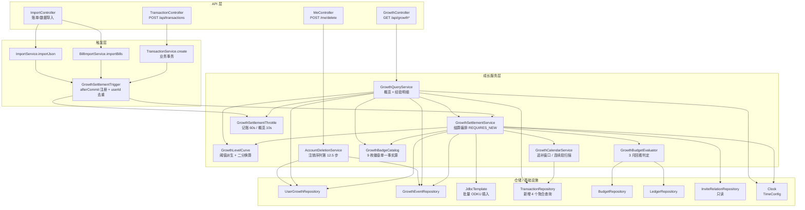
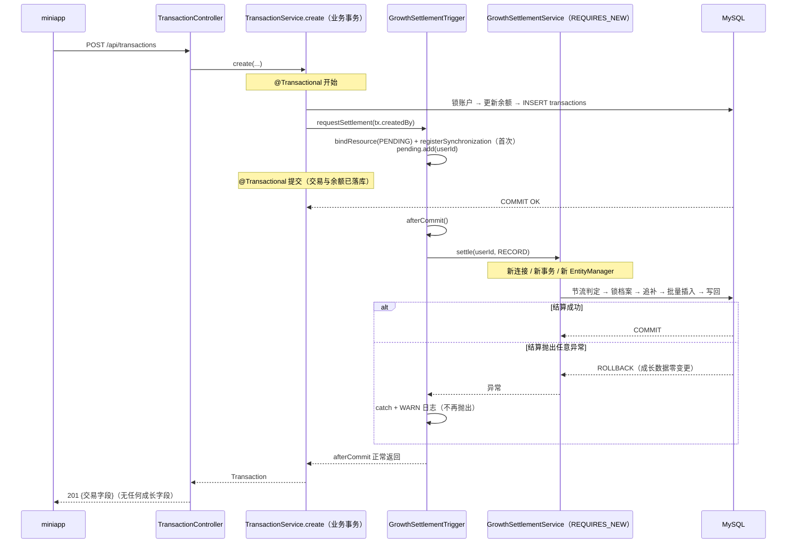
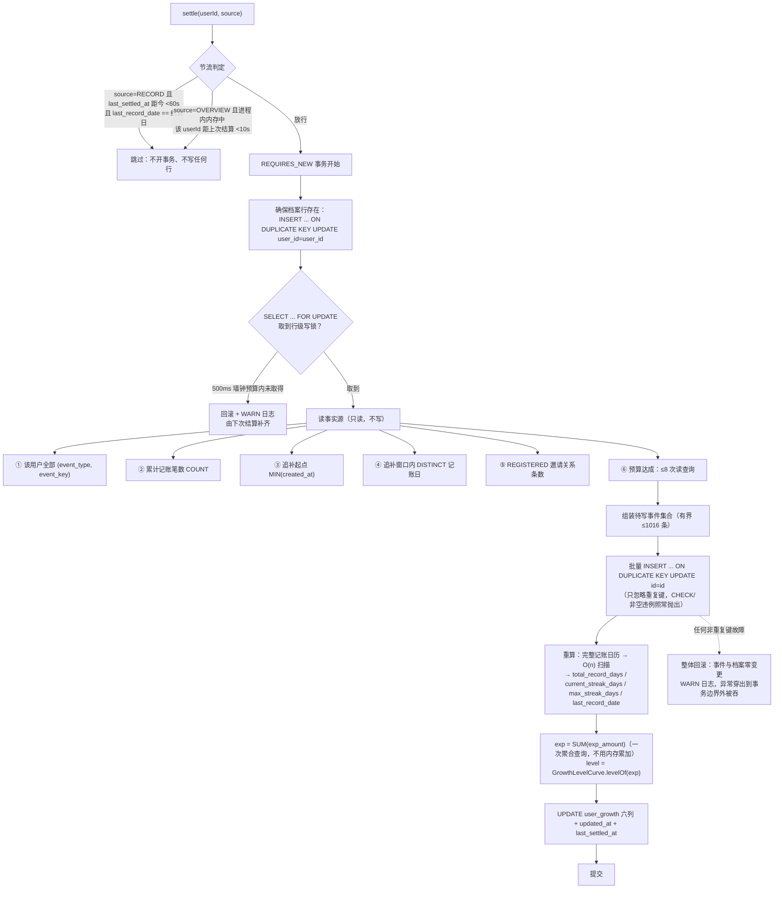
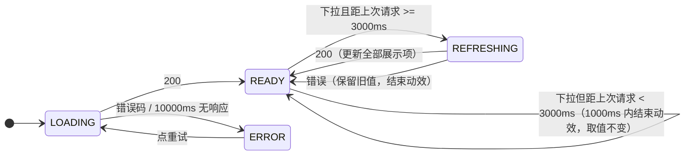
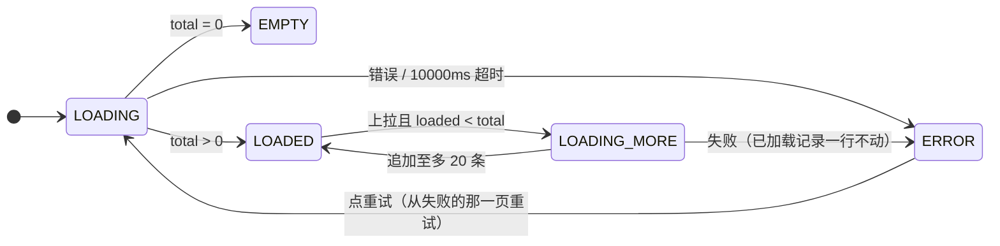

# Design Document

## Overview

本设计为有余新增**成长体系**：把用户的长期记账行为沉淀成一条只往前走的轨迹——经验（EXP）、等级
（Lv1–Lv100）、累计统计、记账日历与 9 枚徽章，并提供成长页与经验明细页两个 miniapp 页面。

服务端新增 8 个服务组件（`GrowthSettlementService`、`GrowthLevelCurve`、`GrowthCalendarService`、
`GrowthBudgetEvaluator`、`GrowthBadgeCatalog`、`GrowthQueryService`、`GrowthSettlementThrottle`、
`GrowthSettlementTrigger`）与 1 个控制器（`GrowthController`），新增 2 张表、2 个仓储、2 个实体，
改造 3 处既有代码（`TransactionService.create` 与两个导入服务的提交后回调挂载点、
`AccountDeletionService` 注销序列、`deploy/reset-db.sql`）。前端新增 2 个页面、1 个 api 模块、
1 个纯逻辑工具模块，并在「我的」页加一个入口。

### 设计不变式

- **经验与徽章只增不减**：`growth_events` 是只追加表。删交易、清回收站、改预算、被邀请人注销，
  一律不扣经验、不降级、不熄灭徽章。
- **幂等由数据库承担**：`uk_growth_events_user_key (user_id, event_key)` 是「同一事件只发一次」的
  唯一保证。应用层的「先查后写」只是减少无效写入的优化，不是正确性依据。
- **累计笔数与累计金额如实反映事实源**：这三项永远实时聚合，永不物化。与上一条刻意分工。
- **结算故障绝不外溢**：结算在业务事务提交之后、独立事务内执行，任何异常就地吞掉只记日志。
  记账接口的状态码与响应字段集不因结算成败而变化。
- **结算幂等可重入且有界**：单次结算写入 ≤1016 行、追补查询 ≤2 次、预算读查询 ≤8 次；
  任何一次失败都由下一次结算自愈，不需要补偿任务、定时任务或消息队列。
- **时区语义单点**：一切自然日边界都以 UTC+08:00 判定，来源是 `TimeConfig` 的
  `Clock(Asia/Shanghai)` 与 `DATETIME` 列里存的挂钟时刻，不读 JVM / 数据库 / 操作系统默认时区。
  挂钟值逐字进出数据库由 `hibernate.type.java_time_use_direct_jdbc=true`（写侧）与
  `getObject(LocalDate(Time).class)`（读侧）保证，不依赖 `YouyuApplication.main` 的 `TimeZone.setDefault`。
- **数据归属只认令牌用户 id**：两个查询接口没有任何可指定目标用户的入参，越权在接口形状上不可表达。

### 关键设计决策与理由

| 决策 | 理由 | 代价 |
|------|------|------|
| **经验只增不减、同一事件只发一次** | 经验是「做过某事」的历史事实。倒扣会让用户掉级（体验恶劣），且要求每个经验事件都能反查其事实依据（要么存外键、要么存快照，复杂度陡增） | 「累计笔数下降但等级不动」这件事需要在 UI 上说得通；`growth_events` 行数随账号存续单调增长，只能靠注销时删除回收 |
| **等级曲线是公式而非常量表** | `threshold(L) = 2(L−1)² + 8(L−1)` 一行代码就是唯一事实源，不会出现「迁移脚本里的表和代码里的表对不上」这种最难查的缺陷；`threshold(2) = 10` 让第一笔记账当场升 Lv2，首次体验最强 | 曲线一旦上线**不可下调**（下调会让已有用户掉级，破坏需求 1.4），调整空间只剩「向上加陡」或「加新等级段」 |
| **连续天数按 `created_at` 而非 `occurred_at`** | `occurred_at` 可任意补记甚至填未来。用它算连续天数，一次性补录 30 天历史即得「连续 30 天」，与「坚持记账」的激励意图完全相反 | 用户补记历史账目不增加连续天数，需要在文案上解释；`created_at` 与用户直觉的「记账日期」不完全一致 |
| **有界追补窗口（≤1000 天、≤2 次查询）** | 存量大户可能有多年历史。不设界的话首次结算会做一次全表日期聚合并写入数千行，直接撞穿 1000ms 预算 | 存量大户需要多次结算才能补齐日历，等级会「连着几次访问才涨到位」（见「风险与权衡」3） |
| **预算达成回看 3 个已结束自然月、且只看自己拥有的账本** | 回看容忍三个月不活跃，且使单次结算的预算读查询数固定为常数、不随账本数增长；只看自有账本是因为「预算达成」衡量的是「自己设的预算守住了没有」，协作账本的预算不由该成员设定 | 超过 3 个月不活跃的用户会永久丢掉更早月份的预算经验；同一口径（月度支出合计）在预算模块与成长体系各写一份，需要靠需求文档而非代码复用来保持一致 |
| **徽章复用 `growth_events`，不新增徽章表** | 徽章天然是「一次性、只增不减、带解锁时刻」的事件，与经验事件同构。复用同一张表后，「一经点亮永不熄灭」由唯一索引免费获得，解锁时刻就是行的 `created_at` | `event_key` 需要 `BADGE:` 前缀做命名空间隔离（`FIRST_RECORD`、`STREAK_7`、`STREAK_30`、`BUDGET_MET` 四个编码与经验事件键同名），隔离靠约定而非表结构 |
| **结算在提交后回调内同步执行、独立事务** | 提交后触发保证「结算回滚不影响已提交的记账」；同步执行保证「记完账立刻打开成长页就能看到经验到账」，省掉一整类「刚记完账等级还没涨」的观感问题与前端轮询 | 结算耗时计入记账接口响应耗时（1000ms 预算，见「风险与权衡」2）；`afterCommit` 有三条隐形约束，容易被后续维护者误改（见「风险与权衡」1） |
| **累计天数/连续天数物化，累计笔数/金额实时聚合** | 前两者需要 distinct 日期聚合 + 连续段扫描，成本随历史线性增长，且语义上只增不减；后两者必须如实反映删除，实时 `COUNT`/`SUM` 天然一致，物化反而制造对账负担 | 物化列可能与事实源漂移（结算失败时会略旧），需要读取时的实时判定兜底（`current_streak_days` 的判定日校正）与对账手段（见「风险与权衡」4） |
| **结算 = 追补事件 + 物化列全量重算** | 需求 1.12 要求「增量维护结果 == 全量重算结果」。与其写两套实现再对齐，不如**只写一套**：每次结算都读该用户完整的记账日历并整体重算三个物化列。两者相等因此是构造性成立，而非需要测试去追平的巧合 | 每次结算读一次该用户全部 `DAILY_RECORD` 行（十年日更用户约 3650 行），换来的是永不漂移的两条路径 |
| **不引入 `@Async` / 定时任务 / MQ / 线程池** | 结算幂等可重入，失败由下一次记账或下一次打开成长页自愈。异步化只会引入线程池容量、上下文传播、任务丢失、可观测性四类新问题，换回来的只是几十毫秒响应时间 | 结算耗时必须留在同步预算内，追补窗口与回看窗口的上界因此不能放宽 |

## Architecture

### 组件划分与依赖



### 与既有代码的集成点

| 既有组件 | 改动 | 说明 |
|----------|------|------|
| `TransactionService.create(...)`（11 参重载） | 方法体末尾追加一行 `growthSettlementTrigger.requestSettlement(tx.getCreatedBy())` | 该重载是**唯一**产生「有效记账交易」的入口：`transfer` 与 `adjustBalance` 各自建行且 `ledger_id` 为 null（`adjustBalance` 显式 `setLedgerId(null)`），`update` / `delete` / `restore` / `purge` 不新增行，因此需求 9.2 的「不触发路径」天然满足，无需额外判定。归属键取 `tx.getCreatedBy()` 而非 `userId`——协作代记时记账人可能不是会话用户（需求 7.1） |
| `BillImportService.importBills(...)` | `@Transactional` 方法体末尾、`return` 之前追加一行 `requestSettlement(userId)` | 整个导入是单个事务（已确认），一次请求恰好 1 次结算（需求 9.4）。该服务直连 `transactionRepository.saveAll`，不经 `TransactionService.create`，因此必须单独挂 |
| `ImportService.importJson(...)` | 同上 | 同为单事务；`restoreTransactions` 直接 `setCreatedBy(userId)` 且 `setCreatedAt(now)`，故导入的历史账目其记账日一律是导入当天 |
| `AccountDeletionService.deleteAccount` | 在第 12 步（`invite_relations` 置 `INVALID`）之后、第 13 步（删 `users` 行）之前插入一步：先删 `growth_events`、再删 `user_growth` | 需新增注入两个仓储；既有 13 步的相对顺序、过滤条件与影响行数一律不动（需求 12.8） |
| `ApiException` | 新增一个工厂方法 `growthPageParamInvalid(String field)`（「Growth 成长域」分节） | 本 spec 唯一新增错误码（需求 10.15） |
| `SecurityConfig` | **无需改动**：`/api/growth/**` 落在 `anyRequest().authenticated()` 下 | 成长接口无公开端点，不存在 invite-system 那种「permitAll 必须写在前面」的顺序陷阱 |
| `TransactionRepository` | 新增 4 个只读查询：累计笔数、按类型的金额合计、追补起点 `MIN(created_at)`、追补窗口内的 distinct 记账日 | 全部按 `created_by` 过滤，复用既有单列索引 `idx_tx_created_by`（`V13`）；不新增任何列与索引（需求 7.12） |
| `deploy/reset-db.sql` | `TRUNCATE TABLE users` 之前加两行：`TRUNCATE TABLE growth_events;`、`TRUNCATE TABLE user_growth;` | 两表无外键，清空不依赖 `FOREIGN_KEY_CHECKS`（需求 11.18） |
| `miniapp/src/pages.json` | 注册 `pages/growth/growth`（`enablePullDownRefresh: true`）与 `pages/growthlog/growthlog`，都不进 tabBar | 成长页是项目里**第一个**用下拉刷新的页面，需要在页面 `style` 里显式打开（需求 13.15、13.16） |
| `miniapp/src/pages/me/me.vue` | 在「邀请」分组块之后插入一个独立「成长」分组块，`onShow` 内追加一次 `fetchGrowthOverview()` | 位置与降级写法对齐既有邀请入口（需求 13.1、13.2） |

### 分层职责边界

- **`GrowthLevelCurve`**（无状态单例）：启动时由公式派生长度 100 的不可变 `long[]`，提供
  `threshold(int level)`、`levelOf(long exp)`、`MAX_LEVEL`。是「等级怎么算」的唯一定义处，
  只做整数比较，不碰浮点。
- **`GrowthBadgeCatalog`**（无状态单例）：9 枚徽章的编码、中文名、门槛、统计口径与展示顺序的
  **单一常量事实源**。提供 `badges()`（有序不可变列表）与 `evaluate(GrowthFacts)`（返回应点亮的编码集合）。
  迁移脚本、数据库与 miniapp 一律不重复定义任何门槛数值或展示名称（需求 8.10）。
- **`GrowthCalendarService`**：三件事——① 依 `last_record_date` 推导追补起点与追补窗口；
  ② 以 2 次查询取窗口内的记账日集合；③ 对「完整记账日历」做一次 O(n) 扫描得出累计天数、连续段长度、
  历史最长连续、最近记账日。第 ③ 项是纯函数，被结算与全量重算共用。
- **`GrowthBudgetEvaluator`**：给定用户 id 与结算时刻，返回「应发放 `BUDGET_MET` 的自然月集合」。
  内部固定 3 个回看月、读查询数固定，**不复用**任何累计统计的过滤条件（需求 5.13）。
- **`GrowthSettlementService`**：结算编排 + 事务边界。`settle(userId, source)` 标注
  `@Transactional(propagation = REQUIRES_NEW)`，是全 spec 唯一写 `growth_events` / `user_growth` 的地方。
  它**不**捕获异常（异常由 `GrowthSettlementTrigger` 与 `GrowthQueryService` 在事务边界之外吞掉，
  否则捕获在事务方法内部会让 Spring 照常提交一个已被标记回滚的事务）。
- **`GrowthSettlementTrigger`**：提交后回调的注册、同一事务内的 userId 去重合并、异常吞掉与告警日志、
  无事务上下文时的兜底路径。详见下一节。
- **`GrowthSettlementThrottle`**：两个互不相干的进程内内存节流器（记账侧 60 秒、概览侧 10 秒）。
- **`GrowthQueryService`**：成长概览与经验明细的组装。概览路径：节流判定 → 尝试结算（失败吞掉）→
  读档案（可能为空）→ 实时聚合 → 按判定日校正当前连续天数 → 组装徽章。明细路径：参数校验 → 分页查询。
- **`GrowthController`**：只做「令牌用户仍存在」的校验与 DTO 组装，不含任何业务判定。

## Components and Interfaces

### 服务接口

**`GrowthLevelCurve`**（无状态单例，等级曲线的唯一事实源）

```java
@Component
public class GrowthLevelCurve {
    public static final int MAX_LEVEL = 100;

    /** 升到等级 L 所需累计经验；L ∉ [1, 100] 抛 IllegalArgumentException。 */
    public long threshold(int level);

    /** 满足 threshold(L) <= exp 的最大 L，上限 100；全程整数比较（需求 2.3、2.4）。 */
    public int levelOf(long exp);
}
```

**`GrowthBadgeCatalog`**（无状态单例，9 枚徽章的单一常量事实源）

```java
public record BadgeDef(String code, String name, int target, BadgeMetric metric) { }
public enum BadgeMetric { RECORD_COUNT, MAX_STREAK, TOTAL_DAYS, BUDGET_MET_EVENT, FIRST_INVITE_EVENT }

@Component
public class GrowthBadgeCatalog {
    /** 9 枚徽章，顺序即展示顺序，不可变（需求 8.1、8.8、8.10）。 */
    public List<BadgeDef> badges();

    /** 返回点亮条件已成立的徽章编码集合（不判断是否已写入事件）。 */
    public Set<String> qualified(GrowthFacts facts);

    /** 事件键：'BADGE:' + code。BADGE: 是徽章的独占命名空间（需求 8.11）。 */
    public static String eventKeyOf(String code);
}
```

**`GrowthCalendarService`**

```java
public record CalendarScan(int totalDays, int currentSegment, int maxStreak, LocalDate lastDate) { }
public record BackfillResult(LocalDate windowStart, LocalDate windowEnd, List<LocalDate> dates) { }

@Component
public class GrowthCalendarService {
    /**
     * 有界追补：1 次 MIN(created_at) 定起点 + 1 次 distinct 日期聚合取窗口内记账日（需求 4.6）。
     * 无可追补日期时返回空 dates。查询次数恒 ≤2，dates.size() ≤1000。
     */
    public BackfillResult backfillDates(Long userId, LocalDate lastRecordDate, LocalDate settleDate);

    /**
     * 纯函数：对升序去重的记账日历做一次 O(n) 扫描。结算与全量重算共用（需求 1.12、4.13）。
     * 不读时钟、不查库；输入顺序与重复项不影响输出。
     */
    public static CalendarScan scan(List<LocalDate> ascendingDates);
}
```

**`GrowthBudgetEvaluator`**

```java
@Component
public class GrowthBudgetEvaluator {
    /**
     * 回看结算日所属月的前 1/2/3 个自然月，返回应发放 BUDGET_MET 的月份（YYYY-MM）。
     * 只判自有账本，多账本不叠加；读查询数 ≤8 且不随账本数增长（需求 5.13、5.15）。
     * existingKeys 用于跳过已发放的月份，不额外查库。
     */
    public List<String> metMonths(Long userId, LocalDate settleDate, Set<String> existingKeys);
}
```

**`GrowthSettlementService`**（全 spec 唯一写两张表的地方）

```java
public enum TriggerSource { RECORD, OVERVIEW }
public enum SettleOutcome { SETTLED, SKIPPED_THROTTLED }

@Service
public class GrowthSettlementService {
    /**
     * 一次结算：节流判定 → 加锁取/建档案 → 读事实源 → 批量补写事件 → 全量重算并写回。
     *
     * <p><b>本方法刻意不捕获任何异常</b>：REQUIRES_NEW 的语义要求异常穿出方法才会回滚，
     * 在方法体内 catch 会让 Spring 提交一个已被标记回滚的事务并可能留下部分写入（需求 9.7）。
     * 「吞异常只记日志」必须发生在事务边界之外，即 GrowthSettlementTrigger 与 GrowthQueryService。</p>
     *
     * <p><b>禁止把 REQUIRES_NEW 改为 REQUIRED</b>：结算必须与业务事务相互独立，
     * 否则结算回滚会连坐已提交的记账（需求 9.3）。</p>
     */
    @Transactional(propagation = Propagation.REQUIRES_NEW)
    public SettleOutcome settle(Long userId, TriggerSource source);

    /** 全量重算：与 settle 同一套重算代码，但不组装、不插入任何事件（需求 1.12）。 */
    @Transactional(propagation = Propagation.REQUIRES_NEW)
    public void recalculateOnly(Long userId);
}
```

**`GrowthSettlementTrigger`**（提交后回调的注册与异常隔离，详见下一章）

```java
@Component
public class GrowthSettlementTrigger {
    /**
     * 请求一次结算。在业务事务内调用时注册 afterCommit 回调并按 userId 去重合并；
     * 无事务上下文时就地结算（兜底）。本方法不抛出任何异常，也不改变调用方的事务状态。
     */
    public void requestSettlement(Long userId);
}
```

**`GrowthSettlementThrottle`**（两个互不相干的进程内内存节流器）

```java
@Component
public class GrowthSettlementThrottle {
    /** 概览侧：同一 userId 10 秒内已结算过则返回 true（需求 10.14）。 */
    public boolean overviewRecentlySettled(Long userId);

    /** 记录一次结算时刻（只用于概览侧窗口；记账侧的窗口读 last_settled_at 列）。 */
    public void markSettled(Long userId);
}
```

记账侧的 60 秒窗口刻意**不放在内存里**：它的判定条件包含
「`last_record_date` 已等于结算日」（需求 9.15），这本就要读档案行，顺手读 `last_settled_at`
比再维护一份内存状态更简单，也天然跨实例一致。概览侧的 10 秒窗口则被需求 10.14 明确规定为
「保存在应用实例进程内的内存中、进程启动后该用户的首次请求执行结算」，故只能用内存。

**`GrowthQueryService`**

```java
public record GrowthOverview(int level, long exp, long currentLevelExp, Long nextLevelExp,
                             long expInCurrentLevel, Long expToNextLevel, int maxLevel,
                             boolean maxLevelReached, long totalRecordCount,
                             BigDecimal totalExpense, BigDecimal totalIncome,
                             int totalRecordDays, int currentStreakDays, int maxStreakDays,
                             List<BadgeView> badges) { }
public record BadgeView(String code, String name, boolean unlocked,
                        LocalDateTime unlockedAt, int target, int current) { }
public record GrowthEventItem(Long id, String eventType, String eventKey,
                              int expAmount, LocalDateTime createdAt) { }
public record GrowthEventPage(List<GrowthEventItem> items, long total) { }

@Service
public class GrowthQueryService {
    /**
     * 成长概览：节流判定 → 尝试结算（异常就地吞掉只记日志）→ 读档案（可能不存在）
     * → 实时聚合三项累计 → 按判定日校正当前连续天数 → 组装 9 枚徽章。
     * 结算成败不改变响应字段集（需求 9.10、9.11）。
     */
    public GrowthOverview getOverview(Long userId);

    /** 经验明细分页：参数校验（非法即 GROWTH_PAGE_PARAM_INVALID）→ 查询。本方法不触发结算（需求 10.11）。 */
    @Transactional(readOnly = true)
    public GrowthEventPage listEvents(Long userId, String rawPage, String rawSize);
}
```

### 仓储

**`UserGrowthRepository`（新）**

```java
@Repository
public interface UserGrowthRepository extends JpaRepository<UserGrowth, Long> {

    /**
     * 加行级写锁读取档案（需求 1.9）。lock.timeout=0 使 MySQLDialect 渲染为 FOR UPDATE NOWAIT，
     * 「500ms 内取不到则放弃」由服务层的墙钟预算 + 有限次退避重试实现
     * （MySQL 的 innodb_lock_wait_timeout 最小粒度为 1 秒，无法表达 500ms）。
     */
    @Lock(LockModeType.PESSIMISTIC_WRITE)
    @QueryHints(@QueryHint(name = "jakarta.persistence.lock.timeout", value = "0"))
    @Query("select g from UserGrowth g where g.userId = :userId")
    Optional<UserGrowth> findForUpdateById(@Param("userId") Long userId);

    /** 注销级联：硬删该用户的档案行；无行时影响行数 0 即视为成功（需求 12.11）。 */
    @Modifying
    @Query("delete from UserGrowth g where g.userId = :userId")
    int deleteByUserId(@Param("userId") Long userId);
}
```

**`GrowthEventRepository`（新）**

```java
@Repository
public interface GrowthEventRepository extends JpaRepository<GrowthEvent, Long> {

    /** 该用户全部事件键（幂等判定 + 徽章判定 + BUDGET_MET 跳过，一次读完）。 */
    @Query("select e.eventKey from GrowthEvent e where e.userId = :userId")
    List<String> findEventKeysByUserId(@Param("userId") Long userId);

    /** 经验值：数据库聚合，不做内存累加，保证需求 1.2 的等式恒成立。 */
    @Query("select coalesce(sum(e.expAmount), 0) from GrowthEvent e where e.userId = :userId")
    long sumExpByUserId(@Param("userId") Long userId);

    /** 完整记账日历的事件键（'DAILY_RECORD:yyyy-MM-dd'），按键升序即日期升序。 */
    @Query("select e.eventKey from GrowthEvent e "
            + "where e.userId = :userId and e.eventType = 'DAILY_RECORD' order by e.eventKey asc")
    List<String> findDailyRecordKeys(@Param("userId") Long userId);

    /** 徽章行（含 created_at 作为解锁时刻），走 idx_growth_events_user_type。 */
    @Query("select e from GrowthEvent e where e.userId = :userId and e.eventType = 'BADGE'")
    List<GrowthEvent> findBadgeEvents(@Param("userId") Long userId);

    /** 经验明细：按 id 倒序分页，走 idx_growth_events_user_id 的反向扫描。 */
    Page<GrowthEvent> findByUserIdOrderByIdDesc(Long userId, Pageable pageable);

    long countByUserId(Long userId);

    /** 注销级联：硬删该用户全部事件；无行时影响行数 0 即视为成功（需求 12.11）。 */
    @Modifying
    @Query("delete from GrowthEvent e where e.userId = :userId")
    int deleteByUserId(@Param("userId") Long userId);
}
```

`findDailyRecordKeys` 返回**事件键字符串**而非 `LocalDate`：`YYYY-MM-DD` 的字典序与日期序一致，
因此 `order by event_key asc` 就是日期升序，无需在 SQL 里做类型转换（H2 与 MySQL 行为一致）。
服务层再 `LocalDate.parse(key.substring("DAILY_RECORD:".length()))`。这一步的解析失败应当抛异常
而不是跳过——库里出现畸形键说明写入路径有缺陷，静默跳过会让累计天数悄悄少算。

**`TransactionRepository`（增 4 个只读查询）**

```java
/** 累计记账笔数（需求 7.2）：四条件在原生 SQL 里逐条可见，不依赖 @SQLRestriction。 */
@Query(value = "SELECT COUNT(*) FROM transactions WHERE created_by = :userId "
        + "AND deleted_at IS NULL AND type IN ('expense','income') AND ledger_id IS NOT NULL",
       nativeQuery = true)
long countValidRecordsByCreatedBy(@Param("userId") Long userId);

/** 累计支出/收入金额（需求 7.3）：一次查询按 type 分组返回至多两行。 */
@Query(value = "SELECT type, COALESCE(SUM(amount), 0) FROM transactions WHERE created_by = :userId "
        + "AND deleted_at IS NULL AND type IN ('expense','income') AND ledger_id IS NOT NULL "
        + "GROUP BY type", nativeQuery = true)
List<Object[]> sumValidAmountsByCreatedByGroupByType(@Param("userId") Long userId);

/** 追补起点（需求 4.6 查询 A）：lowerBound 为 null 时不加时间下界。 */
@Query(value = "SELECT MIN(created_at) FROM transactions WHERE created_by = :userId "
        + "AND deleted_at IS NULL AND type IN ('expense','income') AND ledger_id IS NOT NULL "
        + "AND (:lowerBound IS NULL OR created_at >= :lowerBound)", nativeQuery = true)
LocalDateTime findEarliestRecordCreatedAt(@Param("userId") Long userId,
                                          @Param("lowerBound") LocalDateTime lowerBound);

/** 追补窗口内的记账日集合（需求 4.6 查询 B）：返回行数 ≤1000，两端都有界。 */
@Query(value = "SELECT DISTINCT CAST(created_at AS DATE) FROM transactions WHERE created_by = :userId "
        + "AND deleted_at IS NULL AND type IN ('expense','income') AND ledger_id IS NOT NULL "
        + "AND created_at >= :windowStart AND created_at < :windowEndExclusive "
        + "ORDER BY 1 ASC", nativeQuery = true)
List<java.sql.Date> findRecordDatesInWindow(@Param("userId") Long userId,
                                            @Param("windowStart") LocalDateTime windowStart,
                                            @Param("windowEndExclusive") LocalDateTime windowEndExclusive);
```

四个查询全部走 **nativeQuery**，理由已在「结算算法」一节说明：`Transaction` 实体带
`@SQLRestriction("deleted_at is null")`，走 JPQL 会让「有效记账交易」四个条件中的一个变成隐式的。
这里刻意把四个条件都写出来，代价是必须自己写 `deleted_at IS NULL`（漏写会把回收站记录算进来），
需在每个查询的 Javadoc 里点明。

**`BudgetRepository`（增 1 个）**

```java
/** 一次取回多个自有账本在某月的总预算行（预算判定用，使查询数不随账本数增长）。 */
List<Budget> findByLedgerIdInAndMonth(Collection<Long> ledgerIds, String month);
```

**`InviteRelationRepository`**：复用既有 `countByInviterIdAndStatus`，**只读**，不新增任何方法
（需求 6.4）。

### DTO 与控制器

```java
@RestController
@RequestMapping("/api/growth")
public class GrowthController {

    /** 成长概览（需令牌）。本项目唯一的写入型 GET：内含结算，不要加任何 HTTP 缓存头。 */
    @GetMapping
    public ResponseEntity<GrowthOverviewResponse> overview() { ... }

    /**
     * 经验明细（需令牌）。page/size 以原文 String 接收后交服务层解析：
     * 交给框架做类型转换会让非数字取值在进入方法体之前抛 MethodArgumentTypeMismatchException
     * （→ PARAM_INVALID，另一套字段集），既绕过「令牌用户仍存在」的校验，也违背需求 10.9。
     */
    @GetMapping("/events")
    public ResponseEntity<GrowthEventPageResponse> events(
            @RequestParam(name = "page", required = false) String page,
            @RequestParam(name = "size", required = false) String size) { ... }

    /** 取会话用户 id 并确认其在 users 表中仍存在（需求 10.6、10.7），先于任何其它判定。 */
    private Long requireExistingUserId() { ... }
}
```

### 前端模块

- `api/growth.js`：2 个方法，全部带 `noLedger: true`（成长数据与账本无关，不发 `X-Ledger-Id`）。
- `utils/growth.js`：升级进度计算、事件类型文案映射、徽章进度文案、分页停止条件、下拉刷新节流判定——
  全是纯函数，可被 vitest + fast-check 直接覆盖。
- `pages/growth/growth.vue`、`pages/growthlog/growthlog.vue`：详见「前端设计」。
- `pages/me/me.vue`：新增一个「成长」分组块与一次概览请求（失败静默降级）。

## 结算触发机制

这是本设计最关键的技术点。目标：**新增记账交易的业务事务成功提交之后**，在**调用线程内同步**、
以**独立事务**完成结算，且结算的任何故障都不影响已提交的记账与记账接口的响应。

### 方案选择

| 候选 | 结论 |
|------|------|
| 在 `TransactionService.create` 内直接调结算 | 否。结算与记账同一事务：结算回滚会连坐记账（违背需求 9.3、9.7），且结算读到的是未提交状态 |
| 内层 `@Transactional(REQUIRES_NEW)` 直接调用（不等提交） | 否。记账事务此后若回滚，会留下「有经验、没交易」的孤儿状态；且结算读不到本笔尚未提交的交易 |
| `@TransactionalEventListener(AFTER_COMMIT)` | 可行，但不采用。它需要 `ApplicationEventPublisher` 发一个事件类型，多出一层间接；且默认在**同一线程**同步执行、异常同样会传播回 `afterCommit` 阶段，与手写 `TransactionSynchronization` 在语义上完全等价。本项目服务层至今没有任何领域事件，引入事件机制会让「谁监听了什么」变成需要全局搜索才能回答的问题，与既有代码风格（服务直接调用服务）不一致。**结论：采用手写 `TransactionSynchronization`，把触发关系写在调用点上，看代码即知** |
| **`TransactionSynchronizationManager.registerSynchronization` + `afterCommit` 内调 `REQUIRES_NEW` 方法** | **采用** |
| `@Async` / 定时任务 / MQ | 否。需求 9.9 明确禁止；且结算幂等可重入，异步化的收益不足以抵消新增的失败模式 |

### 实现骨架

```java
@Component
public class GrowthSettlementTrigger {

    /** 绑定到当前事务的待结算 userId 集合的资源键。 */
    private static final String PENDING_KEY = GrowthSettlementTrigger.class.getName() + ".PENDING";

    /**
     * 请求一次结算。必须在业务事务内调用（无事务时走兜底路径）。
     * 本方法不抛出任何异常，也不改变调用方的事务状态。
     */
    public void requestSettlement(Long userId) {
        if (userId == null) {
            return;
        }
        if (!TransactionSynchronizationManager.isSynchronizationActive()) {
            // 兜底：没有事务上下文（被非事务方法直接调用、或将来有人在 @Transactional 之外用了它）。
            // 此时"提交后"无从判定，直接就地结算：settle 自己带 REQUIRES_NEW，会开一个新事务。
            settleQuietly(Set.of(userId), "NO_TX_CONTEXT");
            return;
        }
        @SuppressWarnings("unchecked")
        Set<Long> pending = (Set<Long>) TransactionSynchronizationManager.getResource(PENDING_KEY);
        if (pending == null) {
            // 关键 1：同一事务内只注册一次回调。用绑定资源做标记，多次调用只往集合里加 userId。
            pending = new LinkedHashSet<>();
            TransactionSynchronizationManager.bindResource(PENDING_KEY, pending);
            Set<Long> captured = pending;
            TransactionSynchronizationManager.registerSynchronization(new TransactionSynchronization() {
                @Override
                public void afterCommit() {
                    // 关键 2：绝不让异常穿出本方法（见下文陷阱 1）。
                    settleQuietly(captured, "AFTER_COMMIT");
                }
                @Override
                public void afterCompletion(int status) {
                    // 无论提交还是回滚都解绑，避免资源泄漏到下一个复用同线程的事务。
                    TransactionSynchronizationManager.unbindResourceIfPossible(PENDING_KEY);
                }
            });
        }
        pending.add(userId);
    }

    private void settleQuietly(Set<Long> userIds, String source) {
        for (Long userId : userIds) {
            long startedAt = clock.millis();
            try {
                settlementService.settle(userId, TriggerSource.RECORD);   // @Transactional(REQUIRES_NEW)
            } catch (Exception e) {
                // 需求 9.5：含运行时/受检异常、行锁超时、连接获取失败，一律只记日志。
                log.warn("[GROWTH_SETTLE_FAILED] source={} userId={} 结算失败，将在下次结算自愈",
                        source, userId, e);
            } finally {
                long cost = clock.millis() - startedAt;
                if (cost > 1000) {
                    log.warn("[GROWTH_SETTLE_SLOW] userId={} cost={}ms 超出 1000ms 预算", userId, cost);
                }
            }
        }
    }
}
```

### 逐条陷阱说明

1. **`afterCommit` 里抛出的异常会传播给调用方**。Spring 的
   `AbstractPlatformTransactionManager.triggerAfterCommit` 在 `processCommit` 内部调用同步回调；
   回调抛出的异常不会被吞掉，而是穿出 `commit()`，最终以异常形式出现在业务方法的调用点上——记账接口
   会因为成长体系的故障而返回 500，**尽管交易已经提交**。这是本设计里最容易踩的坑，因此
   `settleQuietly` 必须用 `try-catch` 把每个 userId 的结算包起来。
   刻意**不捕获 `Error`**：`OutOfMemoryError` / `StackOverflowError` 表示 JVM 级故障，吞掉只会
   掩盖问题；这是对需求 9.5「任何异常」的一处刻意收窄，需在代码注释写明。
2. **同一事务内多次注册要去重**。批量导入在单个事务里只会调一次 `requestSettlement`，但
   `TransactionService.create` 若将来被循环调用（例如模板批量记账），就会注册 N 个回调、执行 N 次结算，
   违背需求 9.4。做法是用 `TransactionSynchronizationManager.bindResource` 绑一个 `Set<Long>` 当标记：
   **有资源就说明回调已注册**，后续调用只往集合里加 userId，`afterCommit` 时把整个集合合并为一轮结算。
   集合用 `LinkedHashSet` 而非 `HashSet`，让多用户场景的结算顺序稳定可测。
   `afterCompletion` 里必须解绑——Spring 只清理它自己管理的同步回调列表，`bindResource` 的资源要自己
   解绑，否则线程池复用线程时会把上一个事务的集合带进下一个事务。
3. **`afterCommit` 阶段持久化上下文已经关闭**。`afterCommit` 在事务提交之后触发，此时
   `EntityManager` 已经 flush 并即将关闭（`afterCompletion` 中释放），共享的
   `EntityManagerHolder` 也已标记为不可再用。任何试图复用原 `EntityManager` 的操作（把实体传进回调、
   在回调里 lazy load 关联、在回调里 `em.find`）都会得到 `LazyInitializationException` 或对一个
   已关闭 Session 的调用。因此回调里**只传 `Long userId` 这种不可变值**，绝不传实体对象；
   结算内部的所有读写都由 `REQUIRES_NEW` 开出的新 `EntityManager` 完成。
4. **`REQUIRES_NEW` 在 `afterCommit` 中能正常拿到新连接**。`JpaTransactionManager` 在
   `afterCompletion` 之前不会解绑事务资源，但 `REQUIRES_NEW` 的语义是「挂起当前事务资源、开一个全新的
   物理事务」，这在 `afterCommit` 阶段同样成立（外层事务已提交，挂起的只是尚未清理的资源持有者）。
   代价是**同一请求会同时占用两个数据库连接**：外层的（尚未 `afterCompletion` 释放）与结算的。
   连接池容量因此要按「并发记账请求数 × 2」估算；记账高峰期若连接池打满，结算会以
   「获取连接超时」失败——这正是它被设计成「失败即吞、下次自愈」的原因，不会拖垮记账。
   实现任务需确认 HikariCP 的 `maximum-pool-size` 留有余量，并把这条写进部署说明。
5. **无事务上下文的兜底路径**。`TransactionSynchronizationManager.isSynchronizationActive()` 为
   `false` 时（`requestSettlement` 被非事务方法调用），「提交后」这个概念不存在。此时直接就地调
   `settle`，由 `REQUIRES_NEW` 自己开事务。这条路径在当前调用点上不会走到（三个挂载点都在
   `@Transactional` 方法体内），但保留它使该组件对调用方式不敏感——否则将来有人在非事务方法里调用它，
   会得到「静默什么都不做」这种最难查的行为。
6. **异常不能在 `GrowthSettlementService.settle` 内部捕获**。`settle` 标注了
   `REQUIRES_NEW`，Spring 只在异常**穿出**被通知方法时回滚该事务。若在 `settle` 方法体内 `catch` 掉
   数据库异常并正常返回，Spring 会照常提交——而底层连接可能已被标记为 rollback-only，或已产生部分写入。
   因此「吞异常」这件事必须发生在事务边界**之外**（`GrowthSettlementTrigger` 与
   `GrowthQueryService`），需求 9.7 的「不产生部分写入」正是靠这条约束成立。
7. **成长概览路径不走 `afterCommit`**。`GET /api/growth` 是无事务的控制器调用，
   `GrowthQueryService` 直接 `try { settlementService.settle(userId, OVERVIEW); } catch (Exception e) { log... }`，
   随后照常读档案并返回（需求 9.10、9.11）。这是全 spec 唯一的写入型 GET 接口（见「风险与权衡」7）。

### 结算触发时序



## Data Models

### `user_growth`（新表，10 列）

| 列 | 类型 | 说明 |
|----|------|------|
| `user_id` | BIGINT NOT NULL，**主键，无 AUTO_INCREMENT** | 等于 `users.id`，由服务层在首次结算时写入。以它直接作主键使「每个用户至多一行」由主键保证，且按 `user_id` 读写不经二级索引回表 |
| `exp` | BIGINT NOT NULL DEFAULT 0 | 经验值，恒等于该用户全部成长事件 `exp_amount` 之和 |
| `level` | INT NOT NULL DEFAULT 1 | 等级 1–100，`ck_user_growth_level` 约束 |
| `total_record_days` | INT NOT NULL DEFAULT 0 | 累计记账天数 = `DAILY_RECORD` 事件条数 |
| `current_streak_days` | INT NOT NULL DEFAULT 0 | **连续段长度**（不含「是否已中断」的判定，见下） |
| `max_streak_days` | INT NOT NULL DEFAULT 0 | 历史最长连续天数，恒 ≥ `current_streak_days` |
| `last_record_date` | DATE NULL | 记账日历中的最大日期；日历为空时为 NULL |
| `last_settled_at` | DATETIME NULL | 上次结算时刻，记账侧 60 秒节流的依据 |
| `created_at` | DATETIME NOT NULL | 创建时刻 |
| `updated_at` | DATETIME NOT NULL | 更新时刻；创建时与 `created_at` 相等 |

`current_streak_days` **只承载连续段长度**，不承载「连续是否已中断」。后者一律在读取时以判定日实时
判定（需求 4.15）：`last_record_date ∈ {判定日, 判定日−1}` 时返回该列，否则返回 0，且该读取不写库。
这样跨日之后或结算失败时都不会返回一个过期的非零连续天数。

### `growth_events`（新表，6 列）

| 列 | 类型 | 说明 |
|----|------|------|
| `id` | BIGINT NOT NULL AUTO_INCREMENT | 主键，经验明细按它倒序翻页 |
| `user_id` | BIGINT NOT NULL | 用户 id，**无外键**（注销时由服务层显式删除） |
| `event_type` | VARCHAR(16) NOT NULL | 六个区分大小写的取值之一 |
| `event_key` | VARCHAR(64) NOT NULL | 幂等键 |
| `exp_amount` | INT NOT NULL DEFAULT 0 | ≥0；`BADGE` 恒为 0 |
| `created_at` | DATETIME NOT NULL | 写入时刻；徽章的解锁时刻就是它 |

索引与约束：主键 `id`；唯一 `uk_growth_events_user_key (user_id, event_key)`；非唯一
`idx_growth_events_user_type (user_id, event_type)`；非唯一 `idx_growth_events_user_id (user_id, id)`；
CHECK `ck_growth_events_type`、`ck_growth_events_exp`。**全表无任何外键。**

两个索引的列全部升序，且名字不带 `_desc` 后缀（需求 11.4）：InnoDB 对
`WHERE user_id = ? ORDER BY id DESC` 反向扫描升序索引即可；带 `_desc` 的名字会与
`information_schema.statistics` 里两列 `COLLATION` 均为 `A` 的实际方向不符，属于会误导后续维护者的
命名。

### 迁移脚本

**版本号选取规则**（需求 11.11、11.12）：取满足「大于目录内全部已存在版本号、且未被任何迁移文件或
其它 spec 预占」的最小值。撰写本文档时已实测 `src/main/resources/db/migration` 的最大版本号为
**31**（`V31__user_invite.sql`），`V30` 由 user-feedback-system 预占（`V30__feedback.sql`，目录中尚不
存在该文件），故本 spec 取 **`V32__user_growth.sql`**。实现任务开始时需**重新核对目录**，若届时
V32 已被占用，按同一规则重算，且不修改、不重命名任何已存在的迁移文件。

DDL 草案（对齐 `V27__loan_repayments.sql` / `V31__user_invite.sql` 的中文注释、引擎与排序规则写法）：

```sql
-- ============================================================================
-- 有余(youyu) 成长体系：user_growth 成长档案 + growth_events 成长事件表
--
-- 经验只增不减：growth_events 是只追加表，幂等由 (user_id, event_key) 唯一索引在数据库层保证。
--   删交易 / 清回收站 / 改预算 / 被邀请人注销一律不扣经验、不降级、不熄灭徽章。
-- 徽章复用本表：event_type='BADGE'、event_key='BADGE:<编码>'、exp_amount=0，
--   解锁时刻即该行 created_at；BADGE: 前缀是徽章的独占命名空间，与经验事件键双向隔离。
-- 等级曲线不落库：threshold(L)=2(L-1)^2+8(L-1) 由应用启动时派生，本脚本刻意不建任何阈值表。
-- 刻意不建指向 users(id) 的外键：注销时由 AccountDeletionService 在同一事务内显式删除两表的行，
--   以免为注销路径再追加一层外键顺序约束。正常运行下两表不应出现悬空 user_id（与 invite_relations
--   刻意保留悬空 id 留痕的语义相反）。
-- 本脚本不回填任何存量用户的成长数据：迁移后两表行数均为 0，成长档案在各用户首次结算时惰性生成。
-- ============================================================================

CREATE TABLE user_growth (
    user_id             BIGINT   NOT NULL COMMENT '用户id(主键,非自增,由服务层以令牌用户id写入)',
    exp                 BIGINT   NOT NULL DEFAULT 0 COMMENT '经验值,等于该用户全部成长事件exp_amount之和',
    level               INT      NOT NULL DEFAULT 1 COMMENT '等级1-100,由经验按threshold公式换算',
    total_record_days   INT      NOT NULL DEFAULT 0 COMMENT '累计记账天数,等于DAILY_RECORD事件条数',
    current_streak_days INT      NOT NULL DEFAULT 0 COMMENT '连续段长度(是否已中断在读取时按判定日实时判定)',
    max_streak_days     INT      NOT NULL DEFAULT 0 COMMENT '历史最长连续天数,恒>=current_streak_days',
    last_record_date    DATE     NULL COMMENT '记账日历中的最大日期,日历为空时为NULL',
    last_settled_at     DATETIME NULL COMMENT '上次结算时刻,记账侧60秒节流的依据',
    created_at          DATETIME NOT NULL COMMENT '创建时间',
    updated_at          DATETIME NOT NULL COMMENT '更新时间',
    PRIMARY KEY (user_id),
    CONSTRAINT ck_user_growth_level CHECK (level >= 1 AND level <= 100)
) ENGINE = InnoDB
  DEFAULT CHARSET = utf8mb4
  COLLATE = utf8mb4_unicode_ci
  COMMENT = '用户成长档案(每用户至多一行,物化列可由growth_events与交易事实源完整重算)';

-- 表默认排序规则 utf8mb4_unicode_ci 大小写不敏感，若 CHECK 直接写 event_type IN (...)，
-- 则 'first_record' 也会通过，违背需求 11.5 的「区分大小写」。故在表达式内显式 COLLATE utf8mb4_bin
-- （写法对齐 V31__user_invite.sql 的 ck_invite_relations_status）。
CREATE TABLE growth_events (
    id         BIGINT      NOT NULL AUTO_INCREMENT COMMENT '成长事件主键(经验明细按其倒序翻页)',
    user_id    BIGINT      NOT NULL COMMENT '用户id,无外键(注销时由服务层显式删除)',
    event_type VARCHAR(16) NOT NULL COMMENT '事件类型:FIRST_RECORD/DAILY_RECORD/STREAK/BUDGET_MET/FIRST_INVITE/BADGE',
    event_key  VARCHAR(64) NOT NULL COMMENT '幂等键,如DAILY_RECORD:2025-06-01/BUDGET_MET:2025-05/BADGE:RECORD_100',
    exp_amount INT         NOT NULL DEFAULT 0 COMMENT '经验值,>=0;徽章行恒为0',
    created_at DATETIME    NOT NULL COMMENT '写入时间(徽章的解锁时刻即此列)',
    PRIMARY KEY (id),
    UNIQUE KEY uk_growth_events_user_key (user_id, event_key),
    KEY idx_growth_events_user_type (user_id, event_type),
    KEY idx_growth_events_user_id (user_id, id),
    CONSTRAINT ck_growth_events_type
        CHECK (event_type COLLATE utf8mb4_bin IN
               ('FIRST_RECORD', 'DAILY_RECORD', 'STREAK', 'BUDGET_MET', 'FIRST_INVITE', 'BADGE')),
    CONSTRAINT ck_growth_events_exp CHECK (exp_amount >= 0)
) ENGINE = InnoDB
  DEFAULT CHARSET = utf8mb4
  COLLATE = utf8mb4_unicode_ci
  COMMENT = '成长事件(只追加表,经验与徽章共用,(user_id,event_key)唯一索引承担幂等)';
```

**CHECK 约束的大小写陷阱与实测要求**：`V31` 已在 MySQL 8.0.45 上验证「表达式内 `COLLATE utf8mb4_bin`」
被接受，因此本 spec 沿用同一写法的**风险很低**，但仍需在实现任务中实测（需求 11.5、11.19）：
落库后 `information_schema.CHECK_CONSTRAINTS.CHECK_CLAUSE` 应含 `utf8mb4_bin`，
`event_type` 列的 `COLLATION_NAME` 与表 `TABLE_COLLATION` 应仍为 `utf8mb4_unicode_ci`，
并逐条断言 `'first_record'` / `'Badge'` / `'FOO'` 被 `ERROR 3819` 拒绝。若目标 MySQL 版本拒绝该写法，
退化方案是把 `event_type` 声明为 `VARCHAR(16) CHARACTER SET utf8mb4 COLLATE utf8mb4_bin NOT NULL`
（列级覆盖）、约束表达式改为不含 `COLLATE` 的 `event_type IN (...)`，保持约束名与取值集合不变，
并在本节补记偏差与实测所用的 MySQL 版本号。

> **实测结论（任务 1.5，MySQL `8.0.46-0ubuntu0.22.04.3` (Ubuntu)，即 `deploy/dev-remote-db.conf` 指向的
> 测试服务器实例；在同一实例上另建一次性探针库 `youyu_growth_probe`（`utf8mb4` /
> `utf8mb4_unicode_ci`）直接执行 `V32__user_growth.sql`，不触碰 `youyu` 业务库，跑完即删）**
>
> **① CHECK 表达式内 `COLLATE utf8mb4_bin` 被接受**，无需退化方案，`V32__user_growth.sql` 与上方 DDL
> 草案保持一致。`information_schema.CHECK_CONSTRAINTS` 三个约束齐备，`ck_growth_events_type` 的
> `CHECK_CLAUSE` 落库为
> ``((`event_type` collate utf8mb4_bin) in (_utf8mb4'FIRST_RECORD',_utf8mb4'DAILY_RECORD',_utf8mb4'STREAK',_utf8mb4'BUDGET_MET',_utf8mb4'FIRST_INVITE',_utf8mb4'BADGE'))``
> （含 `utf8mb4_bin`，满足任务 1.4 的对应断言；字面量前缀取客户端连接字符集，`V31` 那次实测显示为
> `_latin1` 只是当时客户端未设 `--default-character-set=utf8mb4`，与约束语义无关）；
> `ck_growth_events_exp` 为 ``(`exp_amount` >= 0)``、`ck_user_growth_level` 为
> ``((`level` >= 1) and (`level` <= 100))``。列 `growth_events.event_type` 的 `CHARACTER_SET_NAME` /
> `COLLATION_NAME` 仍为 `utf8mb4` / `utf8mb4_unicode_ci`，两表 `ENGINE` 为 `InnoDB`、
> `TABLE_COLLATION` 仍为 `utf8mb4_unicode_ci`（即大小写敏感只作用于该约束的比较，不改变列与表的排序规则）。
>
> **② 大小写敏感的行为断言全部成立**：六个正确取值（`FIRST_RECORD` / `DAILY_RECORD` / `STREAK` /
> `BUDGET_MET` / `FIRST_INVITE` / `BADGE`）一次插入 6 行全部成功；`'first_record'`、`'Badge'`、
> `'DAILY_record'`、`'FOO'` 四条插入均以
> `ERROR 3819 (HY000) Check constraint 'ck_growth_events_type' is violated` 被拒；
> `UPDATE growth_events SET event_type = 'badge' WHERE event_key = 'BADGE:FIRST_RECORD'` 同样以 3819 被拒。
> `exp_amount = -1` 以 `ERROR 3819 ... 'ck_growth_events_exp'` 被拒；`level = 0` 与 `level = 101` 的插入、
> 以及 `UPDATE user_growth SET level = 0` 均以 `ERROR 3819 ... 'ck_user_growth_level'` 被拒。
> **被拒后两表零变更**：每次被拒后重算 `COUNT(*)` 与「全部列按主键有序拼接的 MD5」，
> `growth_events` 恒为 `6 / b4c7d8ff76b154f72370fbe1765451d6`、`user_growth` 恒为
> `1 / d9dea8a1460fc6138c0ee217aa5c36b2`，逐行逐列不变。
>
> **③ `ON DUPLICATE KEY UPDATE id = id` 只忽略重复键（需求 11.7、11.8，任务 4.6 的依据）**：
> 对已存在的 `(user_id, event_key)` 再插一次（且刻意给不同的 `exp_amount` / `created_at`）**不报错**，
> `ROW_COUNT()` 为 0，行数不增，且**已存在行的列取值一字不改**（`exp_amount` 仍为 5、`created_at` 仍为
> 原值——`id = id` 是空更新，不会把新值写进去）；一条语句里「1 条新 + 1 条重复」时 `ROW_COUNT()` 为 1、
> 只落新行。而在同一 ODKU 语句形态下，非法 `event_type`（`'badge'`）与 `exp_amount = -1` **依旧**抛
> `ERROR 3819`。两条合起来证明「只忽略重复键、不忽略 CHECK 违例」。
> 反例对照：把同一条非法行改用 `INSERT IGNORE`，MySQL 只给一条
> `Warning 3819 Check constraint 'ck_growth_events_type' is violated.`、静默丢弃该行且语句成功——
> 这正是任务 4.6 禁止 `INSERT IGNORE` 的实证依据。
> 附带观察（无害，但值得知道）：ODKU 的空更新仍会消耗一个自增值，`growth_events.id` 会出现空洞
> （实测出现 id 6 → 8 的跳号）。经验明细按 `id` 倒序翻页不依赖连续性，故不处理。
>
> **④ `FOR UPDATE NOWAIT` 立即失败，任务 4.5 的应用层墙钟预算方案成立**：会话 A
> `START TRANSACTION` + `SELECT ... FROM user_growth WHERE user_id = 1 FOR UPDATE` 持锁期间，会话 B 的
> `SELECT ... FOR UPDATE NOWAIT` 以
> `ERROR 3572 (HY000) Statement aborted because lock(s) could not be acquired immediately and NOWAIT is set.`
> 返回，端到端 550ms，而同一形态下不加锁的空转基线（含 `docker run` 容器启动开销）为 448ms，
> 即语句自身耗时 ~100ms 量级、**不等待**。对照组：普通 `FOR UPDATE` 配
> `SET SESSION innodb_lock_wait_timeout = 3` 耗时 3551ms 后以 `ERROR 1205` 失败（确实在等）；
> `FOR UPDATE SKIP LOCKED` 411ms 返回空集且不报错。会话 A 提交后，会话 B 的 `FOR UPDATE NOWAIT` 立即成功。
> 同时实测确认了「`innodb_lock_wait_timeout` 最小粒度是 1 秒」这条设计前提：该实例 global 值为 50；
> `SET SESSION innodb_lock_wait_timeout = 0` 被**钳到 1**（读回为 1），
> `= 0.5` 直接报 `ERROR 1232 Incorrect argument type`。因此 500ms 这个预算**无法**交给数据库，
> 只能按任务 4.5 的方案在应用层用墙钟 + 退避重试实现，`NOWAIT`（对应 JPA 的
> `jakarta.persistence.lock.timeout = 0`）负责让每次尝试立即返回而不是阻塞。

> **实测结论（任务 1.4 迁移验证清单，MySQL `8.0.46-0ubuntu0.22.04.3` (Ubuntu)，即
> `deploy/dev-remote-db.conf` 指向的测试服务器实例。做法：在同一实例上另建一次性探针库
> `youyu_mig_probe14`（`utf8mb4` / `utf8mb4_unicode_ci`），用**应用自身的 Flyway** 跑完整迁移链，
> 不触碰 `youyu` 业务库，跑完即删。为把「存量数据不受影响」做成真实的前后对照，先以
> `--spring.flyway.target=31 --spring.jpa.hibernate.ddl-auto=none` 启动一次，只应用 V1→V31
> （目录内无 V30，故为 30 条记录），灌入 3 个用户 / 2 个账本 / 2 个账户 / 2 个分类 / 3 笔交易
> （含 1 笔软删）/ 1 条预算 / 1 条邀请关系后取快照，再以**未加任何覆盖的生产配置**启动，
> 由 Flyway 应用 V32）**
>
> **① `information_schema` 元数据逐项核对：19 条断言全部 PASS，0 条 FAIL。** 逐项实际值：
> `user_growth` 恰好 **10** 列、`growth_events` 恰好 **6** 列；16 列的
> 「名 / 序 / 类型 / 可空 / 缺省 / `EXTRA`」与期望表**双向比对 0 处差异**
> （`user_growth`：`user_id bigint NO ~NULL~ []`、`exp bigint NO 0`、`level int NO 1`、
> `total_record_days int NO 0`、`current_streak_days int NO 0`、`max_streak_days int NO 0`、
> `last_record_date date YES NULL`、`last_settled_at datetime YES NULL`、
> `created_at datetime NO NULL`、`updated_at datetime NO NULL`；`growth_events`：
> `id bigint NO NULL [auto_increment]`、`user_id bigint NO NULL`、`event_type varchar(16) NO NULL`、
> `event_key varchar(64) NO NULL`、`exp_amount int NO 0`、`created_at datetime NO NULL`）；
> 16 列注释**全部非空且 `REGEXP '\p{Han}'` 命中**（16/16）；
> **`user_growth.user_id` 的 `EXTRA` 为空串**（不含 `auto_increment`）。
> `statistics`：三个索引的名称 / 唯一性 / 列序与期望**0 处差异**
> （`uk_growth_events_user_key` `NON_UNIQUE=0` 列序 `user_id(1), event_key(2)`；
> `idx_growth_events_user_type` `NON_UNIQUE=1` 列序 `user_id(1), event_type(2)`；
> `idx_growth_events_user_id` `NON_UNIQUE=1` 列序 `user_id(1), id(2)`），
> 两表**全部 8 个索引列的 `COLLATION` 均为 `A`**（非 `A` 的行数为 0）、`INDEX_TYPE` 均为 `BTREE`；
> `user_growth` 的 `INDEX_NAME` 去重后只有 `PRIMARY` 一个。
> `table_constraints` 的集合精确等于
> `growth_events/ck_growth_events_exp/CHECK  growth_events/ck_growth_events_type/CHECK  growth_events/PRIMARY/PRIMARY KEY  growth_events/uk_growth_events_user_key/UNIQUE  user_growth/ck_user_growth_level/CHECK  user_growth/PRIMARY/PRIMARY KEY`；
> `check_constraints` 三条齐备且 `ck_growth_events_type` 的 `CHECK_CLAUSE` 含 `utf8mb4_bin`
> （落库原文与任务 1.5 那次一致）。
> `referential_constraints` 中两表**作为发起方与被引用方的外键条数均为 0**，
> `key_column_usage` 中 `REFERENCED_TABLE_NAME IS NOT NULL` 的列数也为 0。
> `tables`：两表 `ENGINE=InnoDB`、`TABLE_COLLATION=utf8mb4_unicode_ci`、
> `ROW_FORMAT=Dynamic`、表注释非空且含中文。
> **反向对照（证明这些断言不是恒真的空断言）**：另建一个刻意做坏的库（`user_id` 加
> `AUTO_INCREMENT`、`user_growth` 多一个 `idx_probe_extra`、把 `(user_id, id)` 索引改成
> `(user_id, id DESC)` 并改名带 `_desc`）跑同一份断言 SQL，**恰好 5 条相关断言转为 FAIL**
> （16 列比对 2 处差异、`EXTRA` 变 `[auto_increment]`、索引比对 5 处差异、
> 出现 1 个 `COLLATION='D'` 的索引列、`user_growth` 出现第二个索引），其余断言仍 PASS。
>
> **② 存量数据不受影响。** 迁移前后对**全部 20 张基表**逐表 `COUNT(*)`（不用 `TABLE_ROWS` 估算）
> 与 `CHECKSUM TABLE`（InnoDB 逐行逐列计算）取快照：除 `flyway_schema_history`（30 → 31，即新增
> V32 一条记录，属预期）外，**18 张既有表的行数与校验和逐表完全相同**；
> `users` / `ledgers` / `accounts` / `categories` / `transactions` / `budgets` / `invite_relations`
> 七张表的**整行转储（`SELECT *`）逐字节相同**。迁移后 `user_growth` 与 `growth_events` **行数均为 0**
> （脚本确实不回填存量用户）。
>
> **③ Flyway 幂等。** 以同一生产配置**连续启动两次**：第一次
> `Migrating schema to version "32 - user growth"` + `Successfully applied 1 migration, now at version v32`；
> 第二次只有 `Successfully validated 31 migrations` + `Current version: 32`，**不再执行 V32**。
> 之后 `flyway_schema_history` 中 `version='32'` 的记录数为 **1**（`success=1`、
> `installed_rank=31`、`checksum=343803463`）、总记录数为 **31**（V1–V29 + V31 + V32，目录内无 V30）、
> `success=0` 的记录数为 **0**，两表仍为 0 行。
>
> **④ 生产配置（Hibernate `ddl-auto=validate`）在迁移后的库上启动成功**，
> 即两个实体的 16 个列与 schema 一致（需求 11.17）。日志为
> `Successfully validated 31 migrations` → `Started YouyuApplication`，无任何 `Schema-validation` 告警。
> **反向对照**：`ALTER TABLE user_growth DROP COLUMN max_streak_days` 后同样配置启动**失败**，
> 报 `Schema-validation: missing column [max_streak_days] in table [user_growth]`；
> 把该列加回后再启动即成功。这证明上面那次「启动成功」确实是校验通过，而不是校验没跑。
>
> **⑤ `deploy/reset-db.sql`。** 先往两表写入真实数据（`user_growth` 2 行、`growth_events` 4 行，
> 使「清库后为 0 行」不是空断言），原样执行 `deploy/reset-db.sql`（不加任何参数）后：
> 两表行数均为 **0**、两表在 `information_schema.TABLES` 中**仍存在**、
> `flyway_schema_history` 记录数**仍为 31（不变）**、其余业务表（`users` / `transactions` 等）同被清空。
> 附带观察：`TRUNCATE` 语义下 `growth_events` 的 `AUTO_INCREMENT` 被重置为 1。
>
> **⑥ 与 1.5 那次实测的关系**：本次是用**应用自身的 Flyway 跑完整 V1→V32 链**，而 1.5 是用 mysql
> 客户端单独执行 `V32__user_growth.sql`。两条路径落库的元数据一致（列 / 索引 / 约束 / 引擎 /
> 排序规则 / 注释逐项相同），说明 V32 不依赖前序迁移留下的会话状态。
> 探针库 `youyu_mig_probe14` 与做坏对照库 `youyu_mig_probe14_neg` 均已 `DROP`，
> 临时脚本目录 `deploy/.tmp-growth-probe/` 已删除，`youyu` 业务库全程未被触碰。

### JPA 实体设计要点

```java
@Entity
@Table(name = "user_growth")
public class UserGrowth {
    // 主键是业务 id（等于 users.id），不是数据库生成的代理键：
    // 刻意不加 @GeneratedValue —— 加了会让 Hibernate 认为该值由库分配，
    // 从而在 persist 时忽略我们设定的 userId 并要求一个自增列，与 DDL 冲突。
    @Id
    @Column(name = "user_id", nullable = false)
    private Long userId;

    @Column(name = "exp", nullable = false) private long exp;
    @Column(name = "level", nullable = false) private int level;
    @Column(name = "total_record_days", nullable = false) private int totalRecordDays;
    @Column(name = "current_streak_days", nullable = false) private int currentStreakDays;
    @Column(name = "max_streak_days", nullable = false) private int maxStreakDays;
    @Column(name = "last_record_date") private LocalDate lastRecordDate;
    @Column(name = "last_settled_at") private LocalDateTime lastSettledAt;
    @Column(name = "created_at", nullable = false) private LocalDateTime createdAt;
    @Column(name = "updated_at", nullable = false) private LocalDateTime updatedAt;
}
```

两个必须写进代码注释的约束：

- **`@Id` 不带 `@GeneratedValue`**。因此 `save()` 一个新 `UserGrowth` 时，Hibernate 会先执行一次
  `SELECT` 判定是 insert 还是 update（`merge` 语义）。这是我们**不**用 `save()` 建档案的原因之一——
  建档案走 `JdbcTemplate` 的 `INSERT ... ON DUPLICATE KEY UPDATE`（见下一节），避免这次多余的探测查询，
  也顺手解决了并发建档的竞态。
- **`GrowthEvent.userId` 是裸 `Long`，不是 `@ManyToOne User`**。理由与 `InviteRelation` 相同但更强：
  表上没有外键，映射成关联实体会诱导 `ddl-auto` 与后续开发者补外键（与需求 11.9 冲突）；
  且成长事件的读取路径（经验明细分页）完全不需要用户对象，关联映射只会引入 N+1 与
  `EntityNotFoundException` 的风险。

```java
@Entity
@Table(name = "growth_events")
public class GrowthEvent {
    @Id @GeneratedValue(strategy = GenerationType.IDENTITY)
    @Column(name = "id") private Long id;
    @Column(name = "user_id", nullable = false) private Long userId;          // 裸 id，无关联映射
    @Column(name = "event_type", nullable = false, length = 16) private String eventType;
    @Column(name = "event_key", nullable = false, length = 64) private String eventKey;
    @Column(name = "exp_amount", nullable = false) private int expAmount;
    @Column(name = "created_at", nullable = false) private LocalDateTime createdAt;
}
```

`event_type` 用 `String` 而非 `@Enumerated`：写入路径全部走 `JdbcTemplate` 批量语句，实体只服务读取
（经验明细），用字符串可以在库里出现意外取值时仍然读得出来而不是抛映射异常。取值集合的正确性由
`ck_growth_events_type` 与 `GrowthEventType` 常量类共同保证。

### `deploy/reset-db.sql`

在 `TRUNCATE TABLE users` 之前加两行（两表无外键，清空不依赖 `FOREIGN_KEY_CHECKS`）：

```sql
-- 成长体系两表：无外键（注销时由服务层显式删除），清空不依赖 FOREIGN_KEY_CHECKS 取值
TRUNCATE TABLE growth_events;
TRUNCATE TABLE user_growth;
```

脚本仍不含任何针对 `flyway_schema_history` 的语句（需求 11.18）。

## 等级曲线实现

`GrowthLevelCurve` 在 Bean 初始化时由公式派生长度 100 的不可变 `long[]`，此后只做整数比较：

```java
@Component
public class GrowthLevelCurve {

    public static final int MAX_LEVEL = 100;

    /** THRESHOLDS[L-1] == threshold(L)；由公式派生，不是手写常量表（需求 2.11）。 */
    private static final long[] THRESHOLDS = buildThresholds();

    private static long[] buildThresholds() {
        long[] t = new long[MAX_LEVEL];
        for (int level = 1; level <= MAX_LEVEL; level++) {
            long n = level - 1L;                  // 用 long 参与乘法，避免 int 溢出（此处虽不会溢出，但意图明确）
            t[level - 1] = 2L * n * n + 8L * n;   // threshold(L) = 2(L-1)^2 + 8(L-1)
        }
        return t;
    }

    /** 升到等级 L 所需累计经验；L 不在 [1, 100] 抛 IllegalArgumentException。 */
    public long threshold(int level) { ... return THRESHOLDS[level - 1]; }

    /**
     * 由经验值换算等级：满足 threshold(L) <= exp 的最大 L，上限 100（需求 2.3、2.6）。
     * 全程整数比较，不使用浮点开方或除法（需求 2.4）。
     */
    public int levelOf(long exp) {
        if (exp <= 0) {
            return 1;                                  // exp 为 0（或异常负值）一律 Lv1
        }
        int idx = Arrays.binarySearch(THRESHOLDS, exp);
        if (idx >= 0) {
            return idx + 1;                            // 恰好命中阈值：取等号即升级（需求 2.5）
        }
        int insertionPoint = -(idx + 1);                // THRESHOLDS[insertionPoint-1] < exp < THRESHOLDS[insertionPoint]
        return insertionPoint;                          // 即满足 threshold(L) <= exp 的最大 L
    }
}
```

**`Arrays.binarySearch` 负返回值的处理**是这段代码唯一的陷阱：未命中时返回
`-(插入点) - 1`，插入点是「第一个大于 exp 的元素下标」。由于 `THRESHOLDS` 下标 `i` 对应等级 `i+1`，
插入点 `p` 恰好等于「最后一个 ≤ exp 的元素下标 `p-1`」所对应的等级 `p`。当 `exp > THRESHOLDS[99]` 时
插入点为 100，返回值自然就是 100，**无需额外的上限截断**——但仍在实现中显式写一行
`assert result <= MAX_LEVEL` 并加注释，防止后续有人把数组长度改了却忘了这层耦合。

严格单调递增（需求 2.2）由公式本身保证：
`threshold(L+1) − threshold(L) = 2(2L−1) + 8 = 4L + 6 > 0`，对 `L ≥ 1` 恒成立，
且步长随等级线性增大（Lv1→Lv2 需 10 点，Lv99→Lv100 需 402 点）。

### 边界表

| 经验值 E | 期望等级 | 依据 |
|----------|----------|------|
| 0 | 1 | `threshold(1) = 0`，取等号即 Lv1 |
| 9 | 1 | `threshold(2) = 10 > 9` |
| 10 | 2 | 恰好命中 `threshold(2)`（第一笔记账 +10 EXP 当场升 Lv2） |
| 23 | 2 | `threshold(3) = 24 > 23` |
| 24 | 3 | 恰好命中 `threshold(3)` |
| 234 | 10 | `threshold(10) = 234` |
| 5194 | 50 | `threshold(50) = 5194` |
| 19992 | 99 | `threshold(99) = 19992` |
| 20393 | 99 | `threshold(100) = 20394 > 20393` |
| 20394 | 100 | 恰好命中 `threshold(100)`，满级 |
| 20395 | 100 | 满级后经验继续累计、等级恒为 100 |
| `Long.MAX_VALUE` | 100 | 插入点为 100；`binarySearch` 不溢出（不做 `(lo+hi)/2` 的加法溢出，JDK 用 `>>> 1`） |

满级时成长概览的「下一等级所需经验」与「升级还需经验」两项以 **null** 返回，`maxLevelReached` 为
`true`（需求 2.9）；未满级时「升级还需经验」= `threshold(level+1) − exp ≥ 1`（需求 2.10），
因为 `exp < threshold(level+1)` 是 `levelOf` 的定义所保证的。

## 结算算法

### 流程图



### 伪代码

```
settle(userId, source):
    # ── 0. 节流（不开事务）───────────────────────────────────────────────
    if source == OVERVIEW and overviewThrottle.recentlySettled(userId, 10s):   # 需求 10.14
        return SKIPPED_THROTTLED
    if source == RECORD:
        profile = userGrowthRepository.findById(userId)                        # 无锁读，只为节流判定
        if profile.present and now - profile.lastSettledAt < 60s
                           and profile.lastRecordDate == settleDate:           # 需求 9.15
            return SKIPPED_THROTTLED

    # ── 以下全部在 @Transactional(REQUIRES_NEW) 内 ───────────────────────
    now       = LocalDateTime.now(clock)          # 服务端时刻，单次结算只读一次时钟
    settleDate = now.toLocalDate()                # 结算日（Asia/Shanghai 挂钟）

    # ── 1. 取/建档案并加行级写锁（需求 1.9、1.10）─────────────────────────
    jdbc.update("INSERT INTO user_growth(user_id, exp, level, total_record_days,
                 current_streak_days, max_streak_days, last_record_date, last_settled_at,
                 created_at, updated_at) VALUES (?,0,1,0,0,0,NULL,NULL,?,?)
                 ON DUPLICATE KEY UPDATE user_id = user_id", userId, now, now)
    profile = lockProfileWithBudget(userId, 500ms)     # 取不到锁 → 抛 LockAcquisitionAbandoned

    # ── 2. 读事实源（全部只读）──────────────────────────────────────────
    existingKeys   = eventRepo.findKeysByUserId(userId)          # Set<String>，含全部类型
    hasType        = 由 existingKeys 派生（BUDGET_MET 是否存在、FIRST_INVITE 是否存在）
    recordCount    = txRepo.countValidRecords(userId)            # 需求 7.2
    inviteCount    = inviteRelationRepo.countByInviterIdAndStatus(userId, REGISTERED)  # 只读
    backfill       = calendarService.backfillDates(userId, profile.lastRecordDate, settleDate)
    budgetMonths   = budgetEvaluator.metMonths(userId, settleDate, existingKeys)

    # ── 3. 组装待写事件（顺序固定，便于逐条断言）────────────────────────
    pending = []
    for d in backfill.dates:                       # ≤1000 条，日期升序（需求 4.6）
        add(pending, DAILY_RECORD, "DAILY_RECORD:" + d, 5)
    if recordCount >= 1:  add(pending, FIRST_RECORD, "FIRST_RECORD", 10)
    # 连续里程碑要用「把本次补发的日期并入日历之后」的最长连续（需求 3.6：跨门槛不漏发低门槛）
    calendarAfter = existing DAILY_RECORD dates ∪ backfill.dates
    scan          = calendarService.scan(calendarAfter)          # 纯函数，见下
    if scan.maxStreak >= 7:   add(pending, STREAK, "STREAK_7", 30)
    if scan.maxStreak >= 30:  add(pending, STREAK, "STREAK_30", 100)
    for m in budgetMonths:    add(pending, BUDGET_MET, "BUDGET_MET:" + m, 50)
    if inviteCount >= 1:      add(pending, FIRST_INVITE, "FIRST_INVITE", 80)
    for code in badgeCatalog.evaluate(recordCount, scan, hasBudgetMetEvent, hasFirstInviteEvent):
        add(pending, BADGE, "BADGE:" + code, 0)                  # ≤9 条，exp 恒 0
    # add(...) 内部先按 existingKeys 过滤（减少无效写入），唯一性仍由数据库兜底（需求 1.5）
    assert pending.size <= 1016                                  # 需求 3.10

    # ── 4. 批量插入（只忽略重复键）───────────────────────────────────────
    if pending 非空:
        jdbc.batchUpdate("INSERT INTO growth_events(user_id, event_type, event_key, exp_amount,
                          created_at) VALUES (?,?,?,?,?)
                          ON DUPLICATE KEY UPDATE id = id", pending)   # created_at 一律取 now（需求 3.9）

    # ── 5. 重算物化列与经验/等级（全量，唯一路径）──────────────────────
    calendar = eventRepo.findDailyRecordDates(userId)   # 从库里再读一次，含本次刚插入的
    scan     = calendarService.scan(calendar)           # 与第 3 步同一个纯函数
    exp      = eventRepo.sumExpByUserId(userId)         # 数据库聚合，不用内存累加（需求 1.2）
    level    = levelCurve.levelOf(exp)

    # ── 6. 写回（需求 1.11）─────────────────────────────────────────────
    profile.exp = exp; profile.level = level
    profile.totalRecordDays   = scan.totalDays
    profile.currentStreakDays = scan.currentSegment
    profile.maxStreakDays     = scan.maxStreak
    profile.lastRecordDate    = scan.lastDate
    profile.updatedAt = now; profile.lastSettledAt = now
    # user_id 与 created_at 不动
    userGrowthRepository.save(profile)
    overviewThrottle.markSettled(userId, now)           # 提交前记录即可：节流是降级机制，宁可多跳过
```

第 3 步与第 5 步各扫描一次日历，看似冗余，但第 3 步的扫描只为判定 `STREAK` 门槛（用内存里的并集，
避免为了拿门槛再往返一次数据库），第 5 步的扫描才是写回物化列的依据（从库里读，包含并发写入的结果）。
两次调用的是**同一个纯函数**，因此不存在实现漂移。

### `DAILY_RECORD` 追补的两次查询

需求 4.6 把追补限定为「1 次 `MIN(created_at)` + 1 次 distinct 日期聚合」。

**查询 A —— 定追补起点**（`last_record_date` 为空时省掉时间下界）：

```sql
SELECT MIN(t.created_at)
FROM transactions t
WHERE t.created_by = :userId
  AND t.deleted_at IS NULL
  AND t.type IN ('expense', 'income')
  AND t.ledger_id IS NOT NULL
  AND (:lowerBound IS NULL OR t.created_at >= :lowerBound)
```

`:lowerBound` = `last_record_date` 次日 00:00（`last_record_date` 为 NULL 时传 NULL）。
返回 NULL ⇒ 没有可追补的记账日 ⇒ 本次不写任何 `DAILY_RECORD`，继续做后面的步骤（需求 4.3）。

**查询 B —— 取窗口内的记账日集合**：

```sql
SELECT DISTINCT CAST(t.created_at AS DATE) AS record_date
FROM transactions t
WHERE t.created_by = :userId
  AND t.deleted_at IS NULL
  AND t.type IN ('expense', 'income')
  AND t.ledger_id IS NOT NULL
  AND t.created_at >= :windowStart
  AND t.created_at <  :windowEndExclusive
ORDER BY record_date ASC
```

- `windowStart` = 追补起点当日 00:00；
- `windowEnd` = `min(追补起点 + 999 天, 结算日)`，`windowEndExclusive` = `windowEnd` 次日 00:00；
- 因此**返回行数 ≤1000**、窗口两端都有界，绝不出现无上下界的全表扫描（需求 4.6）。

两个查询都必须是 **nativeQuery**：`Transaction` 实体带
`@SQLRestriction("deleted_at is null")`，走 JPQL 时软删过滤是隐式的，而这里我们要让
「有效记账交易」的四个条件在 SQL 里**逐条看得见**——这是最容易被后续维护者改错的地方，隐式条件是负债。
走原生 SQL 也意味着必须自己写 `deleted_at IS NULL`，实现任务需在代码注释里点明这一点。

**时区归属的结论**：本项目所有 `DATETIME` 列存的是 **`Asia/Shanghai` 挂钟时刻**——服务层一律用
`LocalDateTime.now(clock)` 且 `TimeConfig` 的 `Clock` 固定在 `Asia/Shanghai`。要让这个「挂钟时刻」
在任意 JVM 默认时区下都逐字进出数据库、`CAST(created_at AS DATE)` **直接就是记账日**，关键在于
**`LocalDateTime ↔ DATETIME`、`CAST(...) ↔ LocalDate` 的绑定不经 `java.sql.Timestamp/Date` 的默认
时区换算**：

- **写侧**：`application.yml`（及测试 profile）设 `hibernate.type.java_time_use_direct_jdbc=true`
  （Hibernate ≥6.5），让 Hibernate 用 JDBC 4.2 的 `setObject` 直接绑定 `java.time` 类型，挂钟值逐字
  落库、零时区换算——与服务层原生 JDBC 写入（邀请关系、成长事件用 `JdbcTemplate` 的 `setObject`）
  的绑定方式一致，两条写入路径不再分叉。
- **读侧**：追补的两条查询以 `ResultSet#getObject(idx, LocalDateTime/LocalDate.class)` 逐字回读
  （见「追补查询走 `TransactionRepositoryImpl`」一节），不走原生 `@Query` 标量的 `getTimestamp/getDate`。

> **历史坑（务必留意）**：此前没有 `java_time_use_direct_jdbc`，写侧靠 `YouyuApplication.main` 的
> `TimeZone.setDefault(Asia/Shanghai)` 让 `java.sql.Timestamp` 的默认时区换算「碰巧」逐字落库。
> 该前提在 `@SpringBootTest`（不走 `main`）且 CI 跑在 `UTC` 时失效——记账日整体平移。Property 9 最初
> 暴露的正是这个真实缺陷，现由上面的内在实现根治，不再依赖 `main` 的 `setDefault`。

据此逐一排除三个日期归属的候选写法：

| 候选 | 结论 |
|------|------|
| `DATE(CONVERT_TZ(created_at, '+00:00', 'Asia/Shanghai'))` | **否，且是错的**。列里存的已经是 Shanghai 挂钟时刻，再换一次会整体偏 8 小时。此外 `CONVERT_TZ` 的具名时区参数依赖 `mysql.time_zone*` 系统表，未执行 `mysql_tzinfo_to_sql` 的实例会静默返回 NULL——静默返回 NULL 意味着整个日期集合变空、追补永久停摆而不报错，这是最坏的失败模式 |
| `DATE(created_at + INTERVAL 8 HOUR)` 或 `ZoneOffset.ofHours(8)` 换算 | 否，同样多换一次。此写法仅在「列里存 UTC 挂钟」的前提下正确，而本项目不是。不过它给出了一条有用的事实：`Asia/Shanghai` 自 1991 年后不实行夏令时，任一自然日恒为 24 小时，故固定 `+08:00` 与具名时区在本项目的取值域内**完全等价**，任何需要偏移的地方都可以用固定偏移而不必依赖时区表 |
| **`CAST(created_at AS DATE)`** | **采用**。零换算、无外部依赖、MySQL 与 H2（`MODE=MySQL`）都支持同一写法（H2 对 `DATE(...)` 函数的支持随版本而异，`CAST` 是两边都稳的写法）。这条正确性**依赖「挂钟值逐字进出」这个内在约定**：写侧 `hibernate.type.java_time_use_direct_jdbc=true`、读侧 `getObject(LocalDate.class)`，且**仍刻意不设 `hibernate.jdbc.time_zone`**（它只会在默认时区换算之上再叠一层目标时区换算，把已经逐字进出的挂钟值重新平移）。这三条由属性测试（Property 9）在 5 个 JVM 默认时区下锁死 |

**追补查询走 `TransactionRepositoryImpl`（自定义读片段）**：查询 A（`MIN(created_at)` → `LocalDateTime`）
与查询 B（`CAST(created_at AS DATE)` → `LocalDate`）不用 Spring Data 的原生 `@Query`，而是走
`JdbcTemplate` + `getObject(..., LocalDateTime/LocalDate.class)`。原因：原生 `@Query` 标量会依
`ResultSetMetaData` 把 `DATETIME`/`DATE` 读成 `java.sql.Timestamp`/`java.sql.Date`，其 `getTimestamp/getDate`
取 JVM 默认时区的旧式 `Calendar`，非 `Asia/Shanghai` 时整体平移（如 UTC+14 下把 `00:00` 的追补起点推到
次日，窗口越过唯一那笔交易致漏补；NY 下把 `2024-02-29` 读成 `2024-02-28`）。`getObject(LocalDate.class)`
逐字取值、零时区换算，与写侧配成一对。窗口边界 `windowStart/windowEndExclusive` 为 `LocalDateTime`，
`JdbcTemplate` 也经 `setObject` 逐字绑定。此片段仍自己写 `deleted_at IS NULL`（走原生 JDBC，`@SQLRestriction`
不生效）。

同理，应用层的日期加减一律用 `LocalDate.plusDays` / `ChronoUnit.DAYS.between`（纯日历运算，不涉及时区），
不用 `Instant` + `ZoneId`，从根上避开夏令时与时区库版本问题（需求 4.16）。

### 批量插入：只忽略重复键

| 写法 | 行为 | 结论 |
|------|------|------|
| `INSERT IGNORE INTO growth_events ...` | 把**所有**可忽略错误降级为警告——包括 `ck_growth_events_type` / `ck_growth_events_exp` 的 CHECK 违例与非空违例，甚至会对超长字符串做截断 | **否**。它会把「代码算出了一个非法 `event_type`」这种真实缺陷静默吞掉，违背需求 11.7 与「只忽略重复键」的实现约束 |
| **`INSERT ... ON DUPLICATE KEY UPDATE id = id`** | 只把**重复键**冲突转成一次 no-op 更新；CHECK 违例、非空违例、超长值照常以错误抛出 | **采用**（需求 1.6） |

`ON DUPLICATE KEY UPDATE id = id` 的代价是**自增 id 空洞**：InnoDB 在
`innodb_autoinc_lock_mode = 1`（默认，consecutive）或 `2` 下会**先分配自增值、再检测重复键**，
被忽略的那一行占掉的 id 不会回收。空洞的影响：① `id` 只用于「经验明细按 `id` 倒序翻页」与
「同一用户内的稳定排序」，两者都不依赖连续性；② `BIGINT` 的取值空间相对空洞的产生速率可以忽略。
因此接受该代价。为把空洞压到最小，第 3 步的 `add(...)` 会先用 `existingKeys` 过滤掉已存在的键——
正常路径下几乎不会真的撞重复键，ODKU 只是并发下的兜底。

**为什么这里不需要 invite-system 那种 JDBC 保存点方案**：两者要解决的问题根本不同。
invite-system 的插入发生在**登录事务**内，冲突绝不允许连坐登录（否则用户登不进来），所以必须用保存点
做「同一事务内的局部回滚」。本 spec 的插入发生在**结算自己的独立事务**内：冲突不需要局部回滚，
因为整个事务回滚掉也无所谓——已提交的记账不受影响，应发的经验会在下一次结算被幂等补齐（需求 9.8）。
既然「整体回滚 + 自愈」是可接受的失败模式，就没有理由引入保存点这种对实现有强约束、容易被后续维护者
破坏的机制。这是两个 spec 在同一类问题上给出不同答案的原因，需在代码注释里写清，避免有人「顺手统一」。

**实现约束（必须写进代码注释并由测试锁死）**：捕获范围只能是重复键。批量语句用 ODKU 之后，
重复键根本不会抛异常，因此结算路径**不应该有任何 `catch DataIntegrityViolationException`**——
一旦出现，就说明有人试图吞掉 CHECK 或非空违例。这条由 Property 4 的反向断言守卫。

### 连续段与最长连续：O(n) 应用层扫描

```java
public record CalendarScan(int totalDays, int currentSegment, int maxStreak, LocalDate lastDate) { }

/**
 * 对记账日历做一次 O(n) 扫描。dates 必须是去重后升序的日期序列（SortedSet / 已排序 List）。
 * 纯函数：同一输入恒得同一输出，不读时钟、不查库。结算与全量重算共用它（需求 1.12、4.13）。
 */
public static CalendarScan scan(List<LocalDate> ascending) {
    if (ascending.isEmpty()) {
        return new CalendarScan(0, 0, 0, null);          // 需求 4.10
    }
    int seg = 1, max = 1;
    for (int i = 1; i < ascending.size(); i++) {
        LocalDate prev = ascending.get(i - 1), cur = ascending.get(i);
        seg = prev.plusDays(1).equals(cur) ? seg + 1 : 1;   // 相邻即同段，否则起新段（需求 4.12）
        if (seg > max) max = seg;
    }
    return new CalendarScan(ascending.size(), seg, max, ascending.get(ascending.size() - 1));
}
```

- `currentSegment` 是「以最近记账日为终点」的段长，正是循环结束时的 `seg`；
- `maxStreak ≥ currentSegment` 由 `max` 的更新方式直接保证（需求 4.9）；
- `totalDays == ascending.size()`，与「`DAILY_RECORD` 事件条数」相等（需求 4.7）。

**为什么不用窗口函数 SQL**（`ROW_NUMBER() OVER (...)` 减日期做「岛屿分组」的经典写法）：
① H2 在 `MODE=MySQL` 下对窗口函数的支持与 MySQL 存在差异，而本项目全部集成测试与属性测试都跑在 H2 上，
把核心不变式放到一段两边行为可能不同的 SQL 里，等于放弃自动化验证；
② 该写法的可读性远低于上面 10 行 Java，而它要解决的是本项目里绝不构成瓶颈的规模（十年日更 ≈ 3650 行）；
③ 纯函数可以被属性测试用「与朴素 O(n²) 实现比对」的方式验证（Property 7），SQL 不行。

### 增量维护结果 == 全量重算结果

需求 1.12 与 4.13 要求两者相等。本设计的做法是**不存在两条路径**：

- 每次结算的第 5 步都从 `growth_events` 读**完整**的 `DAILY_RECORD` 日期集合并整体重算，
  从不基于「上次的 `current_streak_days` 加一」这类增量公式；
- 所谓「全量重算操作」（需求 1.12）就是**跳过第 3、4 步的结算**——同一个方法，
  传 `RecalcOnly` 标志时不组装、不插入任何事件，只重算并写回物化列；
- 因此两者相等是构造性成立的，Property 6 与 Property 5 只是把这条事实锁住，防止有人未来出于性能直觉
  引入真正的增量公式。

`exp` 同理：一律取 `SELECT COALESCE(SUM(exp_amount), 0) FROM growth_events WHERE user_id = ?`，
不用「旧 exp + 本次新增」的内存累加。多一次聚合查询换来的是需求 1.2 的等式恒成立，
且并发结算时两个事务算出的 `exp` 终态一致（需求 1.8）。

### 预算达成判定

```
metMonths(userId, settleDate, existingKeys):
    months = [settleDate 所属月 −1, −2, −3]                    # 固定 3 个已结束自然月（需求 5.1、5.10）
    ownedLedgerIds = ledgerRepository.findByUserIdOrderBySortOrderAscIdAsc(userId) → ids   # 查询 1
    if ownedLedgerIds 为空: return {}                           # 协作账本不参与（需求 5.13）
    result = []
    for m in months:                                            # 每月 2 次查询 → 共 ≤6
        if existingKeys.contains("BUDGET_MET:" + m): continue    # 已发放，跳过（不额外查库）
        budgets = budgetRepository.findByLedgerIdInAndMonth(ownedLedgerIds, m.toString())   # 查询 2k
        if budgets 为空: continue                                # 未设总预算即无从达成（需求 5.4）
        spentByLedger = txRepo.sumMonthlyExpenseByLedgerIds(ownedLedgerIds, from, to)      # 查询 2k+1
        for b in budgets:
            spent = spentByLedger[b.ledgerId] ?: 0.00
            if spent > 0 and spent <= b.amount:                  # 零支出不算达成（需求 5.5）
                result.add(m); break                             # 多账本不叠加（需求 5.7）
    return result
```

读查询数：1（账本清单）+ 3×2 = **7 次 ≤ 8**，且不随账本数量增长（需求 5.15）——两个按月的查询都用
`ledger_id IN (:ids)` 一次取回全部自有账本的数据，在应用层按账本分组。

月度有效支出合计的 SQL 与 `BudgetService.monthExpenses` 的口径逐条对齐（需求 5.11）：

```sql
SELECT t.ledger_id, COALESCE(SUM(t.amount), 0)
FROM transactions t
WHERE t.ledger_id IN (:ledgerIds)
  AND t.type = 'expense'
  AND t.deleted_at IS NULL
  AND t.occurred_at >= :from AND t.occurred_at < :to      -- 半开区间 [月首 00:00, 次月首 00:00)
GROUP BY t.ledger_id
```

三点必须写进注释：① 这里按 **`occurred_at`** 聚合（与记账日历按 `created_at` 刻意不同——预算衡量的是
「这笔钱花在哪个月」，日历衡量的是「哪天来记账」）；② 过滤条件**不复用**累计统计那套（需求 5.13 明确
要求两处彼此独立，因为一处按 `created_by` 跨全部账本、另一处按 `ledger_id` 限自有账本）；
③ 口径以需求 5.11 自述为准，`BudgetService` 将来若变更**不自动跟随**（需求 5.14）。

### 累计统计的三个实时聚合

```sql
-- 累计记账笔数
SELECT COUNT(*) FROM transactions
WHERE created_by = :userId AND deleted_at IS NULL
  AND type IN ('expense','income') AND ledger_id IS NOT NULL;

-- 累计支出 / 收入金额（一次查询按 type 分组返回两行）
SELECT type, COALESCE(SUM(amount), 0) FROM transactions
WHERE created_by = :userId AND deleted_at IS NULL
  AND type IN ('expense','income') AND ledger_id IS NOT NULL
GROUP BY type;
```

- 走单列索引 `idx_tx_created_by`，其余三个条件回表过滤（需求 7.12 明确接受）；
- 不按会话账本过滤，跨全部账本合并（需求 7.8），因此接口不需要 `X-Ledger-Id`；
- 结果一律 `BigDecimal.setScale(2, HALF_UP)`，无匹配行返回 `0.00`（需求 7.3、7.10）；
- 上界钳制：任一合计 `> 9999999999999999.99` 时以该上界返回并记 WARN；`< 0` 时以 `0.00` 返回
  （需求 7.14、7.15），两种钳制都不使请求失败；
- 耗时守卫：三项聚合合计 >500ms 记一条 WARN（需求 7.13），不失败。

### 行级写锁与 500ms 预算

需求 1.9 要求先加行级写锁再更新，需求 9.16 要求「500ms 内未取得写锁则放弃」。这里有一个必须点明的
数据库事实：**MySQL 的 `innodb_lock_wait_timeout` 最小粒度是 1 秒**，无法直接表达 500 毫秒；
`SELECT ... FOR UPDATE` 在 MySQL 8 上只支持 `NOWAIT`（0 等待）与 `SKIP LOCKED` 两种非阻塞修饰，
没有「等 N 毫秒」的语法。因此 500ms 只能实现为**应用层的墙钟预算**：

```java
UserGrowth lockProfileWithBudget(Long userId, long budgetMillis) {
    long deadline = clock.millis() + budgetMillis;
    int attempt = 0;
    while (true) {
        try {
            // @Lock(PESSIMISTIC_WRITE) + @QueryHint("jakarta.persistence.lock.timeout", "0")
            // → MySQLDialect 渲染为 SELECT ... FOR UPDATE NOWAIT
            return userGrowthRepository.findForUpdateById(userId).orElseThrow(...);
        } catch (PessimisticLockingFailureException e) {          // NOWAIT 立即失败
            long remaining = deadline - clock.millis();
            if (remaining <= 0 || ++attempt > 3) {
                throw new GrowthLockAbandonedException(userId, e);  // 穿出 → 事务回滚 → 边界外被吞
            }
            sleepQuietly(Math.min(remaining, 20L << (attempt - 1)));  // 20 / 40 / 80ms 退避
        }
    }
}
```

- **锁等待的对手只有「同一用户的另一次结算」**，而并发结算是幂等的，因此放弃是完全安全的降级；
- `NOWAIT` 让失败立刻返回，把「等多久」的决策权收回应用层，也避免了一个长事务把连接占住 1 秒；
- **H2 兼容性**：H2（`MODE=MySQL`）对 `FOR UPDATE NOWAIT` 的支持随版本而异。实现任务需实测；
  若 H2 拒绝该写法，测试期改用不带 hint 的 `PESSIMISTIC_WRITE` 并以会话级 `SET LOCK_TIMEOUT 500`
  近似，同时把「500ms 放弃」这条分支的最终断言放到真实 MySQL 的手工验证清单里（见「Testing Strategy」）。

### 并发终态一致（需求 1.8）

两个结算并发时：行级写锁把它们**串行化**在第 1 步；后到者进入临界区时已能看到先到者插入的事件，
`existingKeys` 过滤掉重复项，ODKU 兜住极端交错。第 5 步的 `exp` 与日历都从库里重读，
因此后到者写回的终态一定满足「`exp == SUM(exp_amount)`」与「任一 `event_key` 至多一行」。
需要注意的是：**先到者的 `SUM` 与后到者的 `SUM` 可能不同**（后者看到更多行），
但由于两者串行且后者最后写回，终态取的是后者，等式成立。

## 接口设计

统一前缀 `/api`，统一错误体 `{code, message, field}`（沿用 `GlobalExceptionHandler`）。
两个接口都需**有效令牌**，都与会话账本无关（不要求也不检查 `X-Ledger-Id`，需求 10.12）。

### 1. 成长概览 `GET /api/growth`（需令牌）

响应 200 —— 字段**恰好**是以下 15 项（需求 10.1、10.13）：

| 字段 | 类型 | 说明 |
|------|------|------|
| `level` | number(int, 1–100) | 当前等级 |
| `exp` | number(long, ≥0) | 经验值 |
| `currentLevelExp` | number(long, ≥0) | 当前等级起始经验 = `threshold(level)` |
| `nextLevelExp` | number(long) \| null | 下一级所需经验 = `threshold(level+1)`；**满级为 null** |
| `expInCurrentLevel` | number(long, ≥0) | `exp − currentLevelExp` |
| `expToNextLevel` | number(long, ≥1) \| null | `nextLevelExp − exp`；**满级为 null** |
| `maxLevel` | number(int) | 恒为 100 |
| `maxLevelReached` | boolean | `level == 100` |
| `totalRecordCount` | number(long, ≥0) | 累计记账笔数（实时聚合） |
| `totalExpense` | string/number(decimal 2 位) | 累计支出金额，无匹配行为 `0.00` |
| `totalIncome` | string/number(decimal 2 位) | 累计收入金额，无匹配行为 `0.00` |
| `totalRecordDays` | number(int, ≥0) | 累计记账天数（物化列） |
| `currentStreakDays` | number(int, ≥0) | 当前连续天数（**按判定日实时校正后的取值**） |
| `maxStreakDays` | number(int, ≥0) | 历史最长连续天数（物化列） |
| `badges` | array(9 项，顺序固定) | 见下 |

`badges[]` 每项恰好 6 个字段（需求 8.5）：

| 字段 | 类型 | 说明 |
|------|------|------|
| `code` | string | 徽章编码，取自 9 个固定取值 |
| `name` | string | 中文展示名，由服务端下发（需求 8.10） |
| `unlocked` | boolean | 是否存在对应 `BADGE` 事件 |
| `unlockedAt` | string(datetime) \| null | 已点亮时为该 `BADGE` 行的 `created_at`，未点亮为 null |
| `target` | number(int) | 门槛数值（`BUDGET_MET` 与 `INVITE_1` 为 1） |
| `current` | number(int) | 已点亮时恒等于 `target`；未点亮时为 `min(当前统计量, target)`；恒落在 `[0, target]` |

固定顺序：`FIRST_RECORD`（开张）、`RECORD_10`（小有账目）、`RECORD_100`（百笔有余）、
`RECORD_1000`（千笔如一）、`STREAK_7`（七日不辍）、`STREAK_30`（卅日成习）、`DAYS_100`（百日记账）、
`BUDGET_MET`（预算达标）、`INVITE_1`（同行有余）。

响应中**不含** `email` / `wx_openid` / `wx_unionid` / `invite_code` / `plan` / `role` 六个键
（由「字段集恰好相等」推出，需求 10.13）。

错误：`UNAUTHENTICATED`(401)。**没有其它错误码**——结算失败与结算节流一律降级返回，不对外暴露
（需求 9.10、9.11、10.14、10.15）。

### 2. 经验明细 `GET /api/growth/events?page=0&size=20`（需令牌）

查询参数：`page`（整数 0–100000，缺省 0）、`size`（整数 1–50，缺省 20）。
与 `InviteController` 同样的理由，两个参数在 Controller 里声明为 **`String`** 而非 `Integer`：
交给框架做类型转换会让非数字取值在进入方法体之前抛 `MethodArgumentTypeMismatchException`
（→ `PARAM_INVALID`，另一套字段集），既绕过「令牌用户仍存在」的校验，也违背需求 10.9 的
「不可解析与越界同为 `GROWTH_PAGE_PARAM_INVALID`」。

响应 200 —— 顶层字段**恰好** 2 项，列表项字段**恰好** 5 项（需求 10.13）：

| 字段 | 类型 | 说明 |
|------|------|------|
| `items[].id` | number(long) | 事件主键 |
| `items[].eventType` | string | 六个取值之一 |
| `items[].eventKey` | string | 幂等键原文 |
| `items[].expAmount` | number(int, ≥0) | 经验值；徽章行为 0 |
| `items[].createdAt` | string(datetime) | 发生时刻 |
| `total` | number(long) | 该用户成长事件总条数，不受 `page`/`size` 影响 |

排序：`id` 倒序（走 `idx_growth_events_user_id` 的反向扫描）。本接口**不触发结算**（需求 10.11），
因此它返回的数据可能比成长概览旧，这是被显式允许的（同一时刻两接口的经验值合计可不相等）。

错误：`UNAUTHENTICATED`(401)、`GROWTH_PAGE_PARAM_INVALID`(400，`field` 为 `page` 或 `size`，
响应不含任何列表项与任何计数值)。

### 错误码汇总

| 错误码 | HTTP | 触发条件 |
|--------|------|----------|
| `GROWTH_PAGE_PARAM_INVALID` | 400 | `page`/`size` 不可解析为整数或越界 |
| `UNAUTHENTICATED` | 401 | 两个接口缺少 / 签名无效 / 已过期的令牌，或令牌用户已不在 `users` 表 |

### 越权与鉴权

- 两个接口只从令牌取 `userId`（`currentUser.requireUserId()`），随后所有查询都带
  `user_id = :userId`。DTO 与查询参数里**没有**任何指定目标用户的字段，越权在接口形状上不可表达
  （需求 10.8）。
- **「有效令牌」含「用户仍存在」**（需求 10.6、10.7）：`JwtAuthenticationFilter` 是无状态的，只验签
  与有效期、不查库，因此已注销用户的未过期令牌仍会被过滤链放行。两个端点的第一件事都是
  `userRepository.findById(userId).orElseThrow(ApiException::unauthenticated)`，
  且该校验**先于**结算、分页参数校验与任何聚合查询（与 `InviteController.requireExistingUserId`
  同一写法）。
- `SecurityConfig` 无需改动：`/api/growth/**` 落在末尾的 `anyRequest().authenticated()`。
  刻意**不**为它添加一条显式 `authenticated()` 规则——invite-system 需要显式规则是因为它有一个
  `permitAll` 端点需要「顺序可见」，成长体系没有公开端点，多写一条只会给后续维护者制造
  「这里是不是有什么顺序讲究」的疑问。

## 前端设计

### 页面注册（`pages.json`）

在 `pages` 数组末尾追加两项（成长页需要下拉刷新，这是项目里第一个用到它的页面）：

```json
{ "path": "pages/growth/growth",
  "style": { "navigationBarTitleText": "我的成长", "enablePullDownRefresh": true } },
{ "path": "pages/growthlog/growthlog",
  "style": { "navigationBarTitleText": "经验明细" } }
```

两者都**不进 tabBar**（需求 13.15）：成长页由「我的」进入，经验明细页由成长页进入。
`enablePullDownRefresh` 必须写在**页面级** `style` 里，写进 `globalStyle` 会给全部页面打开下拉刷新。

### `api/growth.js`

```js
import { http } from '../utils/request'

/**
 * 成长数据与账本无关：两个方法都带 noLedger: true，不发送 X-Ledger-Id 头（需求 13.13）。
 * 全部成长请求收敛到本模块，对齐 api/invite.js 的既有写法。
 */

/** 成长概览：15 项字段（含 9 枚徽章）。GET /api/growth。服务端在本请求内顺带结算。 */
export function fetchGrowthOverview() {
  return http.get('/growth', { noLedger: true })
}

/** 经验明细分页：{ items, total }。GET /api/growth/events。本接口不触发结算。 */
export function fetchGrowthEvents(page = 0, size = 20) {
  return http.get(`/growth/events?page=${page}&size=${size}`, { noLedger: true })
}
```

### `utils/growth.js`（纯逻辑，可被 vitest + fast-check 直接覆盖）

把页面里唯一有算术与状态判定的部分抽出来，理由与 `utils/invite.js` 相同：页面 `.vue` 里的逻辑测不到，
抽成纯函数就能用属性测试锁住边界。

```js
export const GROWTH_PAGE_SIZE = 20
export const GROWTH_REFRESH_THROTTLE_MS = 3000
export const GROWTH_TIMEOUT_MS = 10000

/**
 * 升级进度比例，恒落在 [0, 1]（需求 13.5、13.6）。
 * 满级（maxLevelReached 为真，此时 nextLevelExp 为 null）直接返回 1，不做除法。
 * 分母 <= 0 或任一取值不可解析为有限数时返回 0，绝不返回 NaN / Infinity / 负数。
 */
export function levelProgress(overview) { }

/** 事件类型 → 中文文案的映射（需求 13.10）。未知类型返回「成长记录」兜底，不显示原始枚举。 */
export function growthEventLabel(eventType, eventKey) { }

/** 徽章进度文案：未点亮返回 `${current} / ${target}`，已点亮返回 ''（需求 13.7）。 */
export function badgeProgressText(badge) { }

/** 是否还有下一页：已加载条数 < total（需求 13.10）。 */
export function hasMoreGrowthEvents(loaded, total) { }

/** 下拉刷新节流：距上次请求发出不足 3000ms 返回 false（需求 13.16、13.17）。 */
export function shouldRefresh(lastRequestAt, now) { }
```

`levelProgress` 的三条边界值得单独说明，它们是需求 13.5/13.6 的落点：
① 未满级时比例 = `expInCurrentLevel / (nextLevelExp − currentLevelExp)`，由服务端保证分子 ≥0、
分母 ≥1，但前端仍要 clamp 到 `[0, 1]` 以防服务端字段异常；
② 满级时 `nextLevelExp` 为 `null`，分母不成立，**直接取 1** 而不是执行除法（否则得到 `NaN`，
渲染成进度条宽度 `NaN%` 会在真机上表现为整条消失）；
③ 任何非数值都归 0，绝不把非数值文本或负数作为进度取值渲染。

### `pages/growth/growth.vue`（成长页）

职责：展示等级、经验与升级进度、四项累计统计、徽章墙，并提供进入经验明细页的入口。
**不在本页展示任何经验明细列表项**（需求 13.9）。

单一状态机（与邀请页刻意不同：成长概览是一次请求返回全部数据，没有「二维码挂了不该连坐邀请码」
那种需要拆分的独立子系统）：



| 区块 | 数据来源 | 失败态 |
|------|----------|--------|
| 等级卡 | `level` + 品牌绿 `#12a150` 强调 | ERROR 时整卡不渲染 |
| 经验与升级进度 | `expInCurrentLevel` / `nextLevelExp` / `currentLevelExp` / `expToNextLevel` / `maxLevelReached`，经 `levelProgress` 计算 | 满级：展示满级文案、进度条满格、不展示「还需 N 经验」 |
| 四项统计 | `totalRecordCount`、`totalExpense`、`totalRecordDays`、`currentStreakDays` | 与等级卡同生共死 |
| 徽章墙 | `badges` 9 项，顺序即响应顺序 | 已点亮：品牌绿图标 + 解锁时刻，不显示进度文案；未点亮：灰度图标 + `current / target`，不显示解锁时刻 |
| 经验明细入口 | 静态行 + 箭头 | 始终可点（明细页自己有失败态） |

三条硬性约束：

- **不展示占位假数据**（需求 13.8）：ERROR 态只渲染失败文案 + 重试胶囊，等级、经验、累计统计、
  徽章一律不渲染（不是渲染成 0 或 `--`）。理由：一个显示「Lv1 / 0 经验」的失败页会让用户以为自己的
  成长数据被清空了，比明说加载失败糟糕得多。
- **本期只展示 7 项**（需求 13.3、13.4）：当前等级、经验值、升级进度、累计记账笔数、累计支出金额、
  累计记账天数、当前连续天数。`totalIncome` 与 `maxStreakDays` 本期**不展示**但仍在响应里，
  留给后续迭代；`currentLevelExp` / `nextLevelExp` / `expInCurrentLevel` / `expToNextLevel` /
  `maxLevel` / `maxLevelReached` 六项只参与进度渲染与满级判定，不单独成项。
- **下拉刷新的 3000ms 客户端节流**（需求 13.16、13.17）：`onPullDownRefresh` 先用
  `shouldRefresh(lastRequestAt, Date.now())` 判定；不满 3000ms 则**不发请求**、在 1000ms 内
  `uni.stopPullDownRefresh()`、页面取值一行不动。这与服务端的 10 秒结算节流呼应——前者省掉无意义的
  网络往返，后者兜住绕过前端的直连请求。请求发出或 10000ms 超时后一律结束下拉动效
  （`finally` 里调 `stopPullDownRefresh`，避免动效卡死）。

沿用既有品牌绿 `#12a150` 作为等级、进度条与已点亮徽章的强调色，不引入新主色（需求 13.14）。
样式复用既有 `.sect` / `.card` / `.row` / `.r-ic` / `.r-v` 与 `AppIcon` 组件，不新增组件。

### `pages/growthlog/growthlog.vue`（经验明细页）



- 首屏 `fetchGrowthEvents(0, 20)`，`onReachBottom` 追加下一页；`loaded >= total` 后**停止发起请求**
  （需求 13.10）。请求序号机制沿用邀请页的写法：每次请求自增 `seq`，响应回来时 `seq` 不匹配即丢弃，
  避免重试时迟到的旧响应覆盖新结果。
- 每条记录展示「与事件类型一一对应的中文文案 + 经验值」，映射由 `growthEventLabel` 提供：
  `FIRST_RECORD`→首笔记账、`DAILY_RECORD`→每日记账（带日期）、`STREAK`→连续记账里程碑、
  `BUDGET_MET`→预算达成（带月份）、`FIRST_INVITE`→首次邀请好友、`BADGE`→点亮徽章。
  日期与月份从 `eventKey` 的冒号后半段取，**不再另发请求**。
- `total = 0` → 展示空状态提示与记账引导文案，**不渲染列表区域**（需求 13.11）。
- ERROR 态保留已加载记录、且不影响成长页已展示的内容（两页各自持有状态，需求 13.12）。

### 「我的」页入口（`pages/me/me.vue`）

在既有「邀请」分组块**之后**、「记账工具」分组之前插入一个独立「成长」分组块——与邀请入口同构
（都需要展示动态数值，故都不塞进静态 `groups` 数组）：

```
个人卡 → 快捷宫格 → 【邀请】邀请好友（已邀请 N 人）→ 【成长】我的成长（Lv N）→ 记账工具 → 标签体系 → 关于
```

`onShow` 中在既有 `auth.refreshUser()` 与 `fetchInviteInfo()` 之后追加一次 `fetchGrowthOverview()`，
降级写法与邀请入口**逐字对齐**（需求 13.2）：

```js
// 等级文案只是锦上添花：失败静默（不弹错误、不影响页面其余部分），入口保持只有标题与箭头
const growthLevel = ref(null)   // null 表示尚未取到（含请求失败）
fetchGrowthOverview()
  .then((res) => {
    const n = Number(res?.level)
    growthLevel.value = Number.isFinite(n) && n >= 1 ? n : null
  })
  .catch(() => { growthLevel.value = null })
```

模板里 `<text v-if="growthLevel !== null" class="r-v r-v-invite">Lv {{ growthLevel }}</text>`，
复用邀请入口的品牌绿加粗样式类。

**一处需要留意的代价**：`GET /api/growth` 是写入型 GET（内含结算），因此每次进入「我的」页都会触发一次
结算尝试。10 秒的服务端结算节流（需求 10.14）正是为这类「非成长页也在拉概览」的调用点准备的——
用户在「我的」和成长页之间来回切换时，实际只会结算一次。这一点必须写进 `me.vue` 的注释，
避免后续有人把这次调用挪到 `onLoad` 之外的更高频时机（例如每次 tab 切换）。

## Correctness Properties

*属性（property）是在系统所有合法执行下都应成立的特征或行为——它是一条关于"系统应该做什么"的形式化陈述。
属性是人类可读的规格说明与机器可验证的正确性保证之间的桥梁。*

以下 16 条属性覆盖需求文档中被判定为可做属性测试的验收标准。每条给出**生成器策略（输入空间）**与
**预期不变式**。已归入集成测试 / 迁移验证清单 / 手工验收清单的验收标准（性能上限、迁移元数据、
schema 断言、页面渲染）不在此列，见「Testing Strategy」。

### Property 1: 等级曲线的单调性与换算边界

*对任意*等级 `L ∈ [1, 100]` 与任意经验值 `E ∈ [0, Long.MAX_VALUE]`：`threshold` 严格单调递增
（`threshold(L) < threshold(L+1)` 对 `1 ≤ L < 100` 恒成立）且 `threshold(1) = 0`、
`threshold(2) = 10`、`threshold(100) = 20394`；`levelOf(E)` 返回满足 `threshold(L) ≤ E` 的最大 `L`
且不超过 100；`E == threshold(L)` 时恰好返回 `L`；`E ≥ 20394` 时恒返回 100；
`E1 ≤ E2 ⇒ levelOf(E1) ≤ levelOf(E2)`；换算过程不出现浮点运算。

- **生成器**：`L ∈ [1, 100]` 全枚举；`E` = 全部 100 个阈值 ∪ 每个阈值 ±1 ∪ `[0, 25000]` 均匀取样 ∪ `[20394, Long.MAX_VALUE]` 对数取样 ∪ {0, 1, 9, 10, 20393, 20394, 20395, Long.MAX_VALUE}；单调性用有序对 `(E1, E2)` 生成。
- **不变式**：`∀L: threshold(L) < threshold(L+1)`；`levelOf(E) == max{L : threshold(L) ≤ E}`（用朴素线性扫描作为参考实现比对）；`1 ≤ levelOf(E) ≤ 100`；`levelOf` 单调不减。
- **额外断言**：`GrowthLevelCurve` 的字节码/源码中不出现 `Math.sqrt`、`double`、`float` 参与换算（以源码静态断言或对全部阈值 ±1 的穷举比对间接锁定）。

**Validates: Requirements 2.1, 2.2, 2.3, 2.4, 2.5, 2.6, 2.7, 2.11**

### Property 2: 经验值等于事件之和，等级与经验一致

*对任意*由记账、删账、恢复、改预算、邀请、结算组成的操作序列，在每一次结算提交之后：
`user_growth.exp` 等于该用户 `growth_events` 全部行 `exp_amount` 之和；`user_growth.level`
等于 `levelOf(exp)`；`exp ≥ 0`、`level ∈ [1, 100]`；概览响应中
`currentLevelExp == threshold(level)`、`expInCurrentLevel == exp − currentLevelExp ≥ 0`；
未满级时 `nextLevelExp == threshold(level+1)` 且 `expToNextLevel == nextLevelExp − exp ≥ 1`；
满级时 `nextLevelExp` 与 `expToNextLevel` 均为空值且 `maxLevelReached` 为真。

- **生成器**：操作序列（长度 1–40），元素取自 {新增有效记账交易（随机账本/账户/类型/金额/`created_at` 偏移）、软删除某笔、从回收站恢复某笔、设置/下调/删除某月总预算、为该用户建立一条 `REGISTERED` 邀请关系、把某条邀请关系置 `INVALID`、直接触发一次结算、请求一次成长概览}；用户池 2–5 人；固定可推进的 `Clock`，时刻推进步长取 {分钟, 小时, 天, 月} 混合。
- **不变式**：`profile.exp == Σ events.expAmount`；`profile.level == levelOf(profile.exp)`；七项等级字段满足上述算术关系；满级分支的两项为 null。

**Validates: Requirements 1.1, 1.2, 1.3, 2.8, 2.9, 2.10**

### Property 3: 事件幂等（任意操作序列后每 `event_key` 至多一行）

*对任意*操作序列（含同一自然日内 2–100 次记账各触发一次结算、含 2–8 个结算在 1000ms 内并发）：
`growth_events` 中以任一 `(user_id, event_key)` 为键的行数恒 ≤1；已存在那一行的
`id`、`event_type`、`exp_amount`、`created_at` 在后续任意操作后逐列不变；
`growth_events` 从不被执行 UPDATE 或 DELETE（除注销路径）；直接重复插入同一 `(user_id, event_key)`
被数据库以唯一约束违例拒绝且不产生部分写入。

- **生成器**：操作序列（长度 1–40）× 同日记账次数 ∈ [2, 100] × 并发度 ∈ [2, 8] × 用户池 2–5；另生成「同一次结算内重复出现同一 `event_key`」的构造用例（例如追补日期集合被人为注入重复项）以验证 ODKU 的兜底。
- **不变式**：`∀(u,k): count == 1 ∨ count == 0`；行快照四列相等（读库比对，非内存值）；并发后终态行数与串行执行相同。
- **反向断言（防回归）**：把批量插入改为 `INSERT IGNORE` 时，「CHECK 违例必须抛错」这条断言必须失败——用于锁死「只忽略重复键」这条实现约束。

**Validates: Requirements 1.4, 1.5, 1.6, 1.8, 3.5, 3.7, 8.4, 11.7, 11.8**

### Property 4: 经验与等级单调不减（删账不降级）

*对任意*操作序列，同一用户的 `exp` 与 `level` 在时间上单调不减；特别地，删除交易、清空回收站、
修改交易、下调或删除预算、被邀请人注销之后，该用户的成长事件行数与全部列取值不变、
`exp` 与 `level` 不变；已点亮的徽章保持 `unlocked = true` 且其 `current == target`。

- **生成器**：先用 3–20 次记账 / 预算 / 邀请操作把用户推到某个等级与若干徽章，再生成 1–20 次「回撤型」操作（删除全部交易、清空回收站、把预算下调到 0.01、把全部邀请关系置 `INVALID`、把某记账日的全部交易删净），每次回撤后触发一次结算。
- **不变式**：`expAfter == expBefore ∧ levelAfter == levelBefore`；`eventRows` 逐行快照相等；`∀badge: unlockedBefore ⇒ unlockedAfter ∧ current == target`；序列上 `exp` 与 `level` 的差分恒 ≥0。

**Validates: Requirements 1.4, 5.8, 6.3, 7.6, 7.7, 8.4, 8.12**

### Property 5: 增量维护结果等于全量重算结果

*对任意*操作序列，先执行任意次结算，再执行一次全量重算：`exp`、`level`、`total_record_days`、
`current_streak_days`、`max_streak_days` 五列取值与重算前完全相同；`last_record_date` 亦不变；
且重算不新增、不修改、不删除任何 `growth_events` 行。

- **生成器**：操作序列（长度 1–40）× 结算次数 ∈ [1, 10] × 结算之间的时刻推进（含跨日、跨月）；刻意包含「追补窗口未覆盖到结算日」的存量大户场景（预置 1200–3000 个历史记账日）。
- **不变式**：五列 + `last_record_date` 逐列相等；`countEventsBefore == countEventsAfter`；事件行快照逐行相等。

**Validates: Requirements 1.7, 1.12, 4.13**

### Property 6: 连续段算法与朴素实现等价

*对任意*日期集合（含空集、单点、连续段、多段、跨月跨年、含闰日）：`scan` 返回的
`totalDays` 等于集合大小；`currentSegment` 等于「以最大日期为终点向前逐日回溯的连续天数」；
`maxStreak` 等于集合中最长连续自然日区间的长度且 `≥ currentSegment`；`lastDate` 等于集合最大值；
空集时四项为 `(0, 0, 0, null)`；含 D 与 D 次日的两日归同段，含 D 与 D 后第 2 日但不含次日的两日归不同段；
输入顺序与重复项不影响输出。

- **生成器**：日期集合规模 0–2000，由「起点 ∈ [2000-01-01, 2035-12-31] × 段长 ∈ [1, 400] × 段间空洞 ∈ [1, 60] × 段数 ∈ [0, 30]」构造，另叠加纯随机日期集合与全连续/全孤立两个极端；输入以随机打乱顺序与随机重复项各生成一份。
- **不变式**：与一份独立的朴素实现（对最大日期向前 `while (set.contains(d))` 回溯求 `currentSegment`；对每个日期判 `!set.contains(d-1)` 找段首再向后数求 `maxStreak`）逐字段相等；`maxStreak ≥ currentSegment`；打乱/去重后输出不变。

**Validates: Requirements 4.9, 4.10, 4.12, 4.13**

### Property 7: 追补的有界性与收敛性

*对任意*历史记账日集合（规模 0–3000，可含空洞）与任意次连续结算：单次结算写入的 `DAILY_RECORD`
条数 ≤1000、追补查询次数 ≤2、写入的成长事件总条数 ≤1016；每次结算的追补起点严格晚于上一次结算的
追补起点；只要仍有未补发的记账日，每次结算至少补发 1 个；补齐全部历史记账日所需结算次数不超过
未补发记账日的个数；补齐过程中的每一次提交后，`last_record_date` 恒等于记账日历的最大日期，
且不存在早于 `last_record_date` 而不在日历中的记账日（无空洞不变式）；
追补窗口末日早于结算日时，本次不写 `DAILY_RECORD:<结算日>`。

- **生成器**：历史记账日集合（跨度 1–4000 天、密度 5%–100%）× 结算次数 ∈ [1, 12] × 结算之间的时刻推进 ∈ {0, 1 天, 7 天, 400 天} × 「结算日当天是否也有记账」两种；查询次数用一个计数型 `JdbcTemplate`/仓储装饰器统计。
- **不变式**：`dailyRecordWrites ≤ 1000 ∧ totalWrites ≤ 1016 ∧ backfillQueries ≤ 2`；`startOf(n+1) > startOf(n)`；`|calendar|` 每次结算严格增长（在仍有欠补时）；`lastRecordDate == max(calendar)`；`∀d < lastRecordDate: d 是记账日 ⇒ d ∈ calendar`；`windowEnd < settleDate ⇒ !calendar.contains(settleDate)`。

**Validates: Requirements 3.10, 4.2, 4.3, 4.5, 4.6, 4.9, 4.14**

### Property 8: 累计天数与经验事件条数一致，且不随交易删除回落

*对任意*操作序列：`total_record_days` 恒等于该用户 `event_type = 'DAILY_RECORD'` 的事件条数；
同一自然日内任意多笔有效记账只产生 1 条 `DAILY_RECORD` 且该日经验合计恰为 5；
删除某记账日的全部有效记账交易后，`total_record_days`、`current_streak_days`、`max_streak_days`
三项不变；`max_streak_days ≥ current_streak_days` 恒成立；日历为空时三项均为 0 且
`last_record_date` 为空值。

- **生成器**：操作序列（长度 1–40）× 同日记账笔数 ∈ [1, 100] × 「删净某日/删部分」两种 × 跨日推进；用户池 2–5。
- **不变式**：`totalRecordDays == count(DAILY_RECORD)`；`Σ expOfDay == 5`；删除前后三列相等；`max ≥ current`；空日历分支四项取值。

**Validates: Requirements 3.1, 4.4, 4.7, 4.8, 4.9, 4.10**

### Property 9: 记账日与时区无关

*对任意*交易 `created_at` 取值（含 00:00:00、23:59:59、闰日、月末、年末）与任意 JVM 默认时区
（`UTC`、`America/New_York`、`Asia/Tokyo`、`Pacific/Kiritimati`、`Asia/Shanghai`）：
同一批交易算出的记账日、`DAILY_RECORD` 事件键、累计记账天数、连续段长度与历史最长连续天数完全相同；
`event_key` 中的日期恒为 `YYYY-MM-DD` 格式且长度使 `event_key` 不超过 64 字符。

- **生成器**：`created_at` ∈ {每日 00:00:00, 00:00:01, 12:00:00, 23:59:59, 23:59:59.999} × 日期 ∈ {闰日 2024-02-29, 2025-02-28, 月末, 年末, 随机} × JVM 默认时区 ∈ 上述 5 个 × 交易数 1–50。
- **不变式**：切换 `TimeZone.setDefault` 后重跑，五项输出逐项相等；`eventKey.matches("DAILY_RECORD:\\d{4}-\\d{2}-\\d{2}")`；`eventKey.length() <= 64`。
- **说明**：本属性是「记账日归属与 JVM 默认时区无关」这套内在实现的回归锁，锁死三条且任一被回退都会在非 `Asia/Shanghai` 默认时区下失败：① 写侧 `hibernate.type.java_time_use_direct_jdbc=true`（去掉它，Hibernate 退回 `java.sql.Timestamp` 的默认时区换算）；② 读侧追补两条查询以 `getObject(LocalDateTime/LocalDate.class)` 逐字回读（改回原生 `@Query` 标量的 `java.sql.Date` 即平移）；③ **仍不设 `hibernate.jdbc.time_zone`**（设上它会在逐字进出之上再叠一层平移）。因播种走 Hibernate 仓储 `save`，故它守护的正是①的写侧绑定路径。

**Validates: Requirements 3.7, 3.8, 4.1, 4.16**

### Property 10: 累计统计如实反映事实源（删除/恢复对称）

*对任意*交易集合（混合 `expense`/`income`/`transfer`/余额调整、混合软删与未删、跨多个账本含协作账本）：
累计记账笔数等于满足四条件的行数；累计支出/收入金额等于对应子集的 `amount` 合计（2 位小数）；
`transfer` 与 `ledger_id IS NULL` 的行一律不计入三项；把一笔移入回收站使笔数减 1、对应金额减去该笔，
从回收站恢复使其加回（**删除与恢复对称，回到原值**）；三项均 ≥0，笔数为 0 时两项金额均为 `0.00`；
合计超过 `9999999999999999.99` 时以该上界返回、为负时以 `0.00` 返回，且两种情形都不使请求失败；
全部计算不使用浮点类型；三项取值与会话账本无关（带任意 `X-Ledger-Id` 或不带，响应逐字段相等）。

- **生成器**：交易集合规模 0–300，`type` 按随机比例分布，`ledger_id` ∈ {自有账本, 协作账本, null}，`created_by` ∈ {本人, 他人}，`amount` ∈ {0.01, 0.02, 随机两位小数, 9999999999999999.99, 负值（模拟历史脏数据）}；删除/恢复操作序列长度 0–30；`X-Ledger-Id` ∈ {缺失, 自有账本, 不可访问的账本 id}。
- **不变式**：三项 == 参考实现（在内存里按四条件过滤后 `BigDecimal` 求和）；`delete` 后 `restore` 回到原值（往返恒等）；`count == 0 ⇒ sums == 0.00`；钳制边界；金额字段的运行时类型恒为 `BigDecimal`（不出现 `double`/`float`）；带/不带账本头响应相等。

**Validates: Requirements 7.1, 7.2, 7.3, 7.4, 7.5, 7.6, 7.7, 7.8, 7.10, 7.11, 7.14, 7.15, 10.12**

### Property 11: 预算达成的口径与多账本不叠加

*对任意*（自有账本集合、协作账本集合、各账本各月的总预算、各账本各月的支出集合、结算时刻）组合：
`BUDGET_MET:M` 事件当且仅当「M 是结算日所属月的前 1/2/3 个自然月」且「存在自有账本在 M 有总预算行、
M 内月度有效支出合计 >0 且 ≤ 预算金额」时被写入，且每月恰好 1 条（多账本不叠加）；
未设总预算、零支出、超支三种情形均不写入；协作账本达成不为该成员写入；
早于 4 个月的达成月不写入；结算日所属月永不判定；预算判定的读查询次数 ≤8 且不随账本数量增长；
`budgets` 与 `category_budgets` 两表在结算前后行数与列取值完全不变。

- **生成器**：自有账本数 ∈ [0, 8] × 协作账本数 ∈ [0, 4] × 月份跨度 ∈ [0, 8] 个已结束月 × 每账本每月预算 ∈ {无, 0.01, 随机, 极大值} × 每月支出集合（金额与 `occurred_at` 落在月内/月外边界 00:00 与次月 00:00）× 结算时刻 ∈ {月初 00:00:00, 月中, 月末 23:59:59}；查询次数用计数型仓储装饰器统计。
- **不变式**：`writtenMonths == expectedMonths`（由内存参考实现按需求 5.3 计算）；`∀M: count(BUDGET_MET:M) ≤ 1`；`budgetQueries ≤ 8` 且与账本数无关；两张预算表快照逐行相等；`occurred_at == 次月 1 日 00:00` 的支出不计入本月（半开区间边界）。

**Validates: Requirements 5.1, 5.2, 5.3, 5.4, 5.5, 5.6, 5.7, 5.9, 5.10, 5.11, 5.12, 5.13, 5.15**

### Property 12: 首次邀请经验的一次性与只读性

*对任意*邀请关系集合与状态变更序列：`REGISTERED` 行数从 0 变为 ≥1 后的首次结算写入恰好 1 条
`FIRST_INVITE`（80 经验）；`REGISTERED` 行数从 1 增长到 100 期间该事件条数恒为 1、经验不再增加；
`REGISTERED` 行数回落到 0 后该事件与经验不变；整个过程 `invite_relations` 表的行数与全部列取值不变
（成长体系只读该表）；被邀请人的注册请求内不为邀请人写入任何成长事件、不创建其成长档案。

- **生成器**：邀请关系数 ∈ [0, 100] × 状态变更序列（`REGISTERED` → `INVALID` 的任意子集与顺序）× 结算次数 ∈ [1, 6] × 「邀请人是否已有成长档案」两种；另生成「被邀请人注册」这一动作，断言其事务内成长两表零写入。
- **不变式**：`count(FIRST_INVITE) == (everHadRegistered ? 1 : 0)`；`invite_relations` 快照逐行相等（含 `updated_at`）；注册请求提交后 `user_growth` 中邀请人的行数不因该请求而由 0 变 1。

**Validates: Requirements 6.1, 6.2, 6.3, 6.4, 6.5**

### Property 13: 徽章的命名空间隔离、当前值区间与顺序

*对任意*成长事件集合（刻意包含 `event_type='BADGE'` 且 `event_key='BADGE:FIRST_RECORD'` 与
`event_type='FIRST_RECORD'` 且 `event_key='FIRST_RECORD'` 同时存在的构造）与任意统计量：
徽章已点亮当且仅当存在 `event_type='BADGE'` 且 `event_key='BADGE:<编码>'` 的行；
`BADGE` 行**不**计入经验事件判定、**不**计入累计记账天数、**不**计入 `BUDGET_MET` 徽章的点亮条件
（该条件只看 `event_type='BUDGET_MET'` 的行）；反向地非 `BADGE` 行不作为任何徽章已点亮的依据；
全部 `BADGE` 行 `exp_amount == 0` 且一次结算点亮 1–9 枚使经验增加 0；
响应恒返回 9 项且顺序与目录一致；已点亮项 `current == target` 且 `unlockedAt` 非空；
未点亮项 `current == min(统计量, target)` 且 `unlockedAt` 为空；`0 ≤ current ≤ target` 恒成立；
点亮条件已成立但事件尚未写入（结算失败或被节流）时返回未点亮 + `current == target` + `unlockedAt` 为空
且不报错。

- **生成器**：`(recordCount ∈ {0,1,9,10,99,100,999,1000,10^5}) × (maxStreak ∈ {0,6,7,29,30,400}) × (totalRecordDays ∈ {0,99,100,4000}) × (是否有 BUDGET_MET 事件) × (是否有 FIRST_INVITE 事件) × (已写入的 BADGE 行子集 ∈ 2^9 的随机抽样)`，外加同名键混杂的构造用例与「删除交易使统计回落」的后置回撤。
- **不变式**：`unlocked == events.contains("BADGE:" + code)`；`badges.size == 9 ∧ order == catalog.order`（两次连续请求顺序相同）；`unlocked ⇒ current == target ∧ unlockedAt != null`；`!unlocked ⇒ current == min(stat, target) ∧ unlockedAt == null`；`0 ≤ current ≤ target`；`Σ badgeExp == 0`；同名键混杂时 `total_record_days` 与经验判定不受 `BADGE` 行影响。

**Validates: Requirements 8.1, 8.2, 8.3, 8.5, 8.6, 8.7, 8.8, 8.11, 8.12, 8.13**

### Property 14: 结算的故障隔离、节流与并发终态

*对任意*（结算内部故障注入点、结算触发时机、节流窗口内的请求时刻序列、并发度）组合：
结算抛出任意异常（运行时/受检/行锁超时/连接获取失败/`GrowthLockAbandoned`）时，记账接口返回与结算成功
时相同的 HTTP 状态码与相同的响应字段集，且该笔交易与账户余额的已提交状态不变；
结算失败时成长事件行数与档案全部列取值与结算前逐列相同（无部分写入）；
失败后的下一次结算补齐上次未写入的事件；
成长概览内的结算失败时返回 200、字段集与成功时相同（可能略旧）；
该用户尚无档案且概览结算失败时返回 `level=1, exp=0, totalRecordDays=0, currentStreakDays=0,
maxStreakDays=0` 与 9 枚均未点亮，同时返回真实的累计笔数与累计金额；
记账触发的结算在「`last_settled_at` 距今 <60s 且 `last_record_date == 结算日`」时被跳过且不开事务、
零写入；概览触发的结算在 10 秒内已执行过时被跳过且响应字段集不变、不返回错误；
概览节流**不影响**记账触发的结算；2–8 个并发结算的终态满足 Property 3 与 Property 2 的不变式。
全程不存在 `@Async`、定时任务、消息队列或任何执行器驱动结算（结算调用栈恒在请求线程内）。

- **生成器**：故障注入点 ∈ {锁获取、批量插入、日历读取、`invite_relations` 读取、预算读取、档案写回} × 异常类型 ∈ {`DataAccessResourceFailureException`, `PessimisticLockingFailureException`, `RuntimeException`, 受检异常包装, `CannotCreateTransactionException`} × 触发时机 ∈ {单笔记账, 批量导入(1–200 行), 概览请求} × 请求时刻序列（跨 10s / 60s 窗口边界，含 59999ms 与 60000ms）× 并发度 ∈ [2, 8] × 「档案是否已存在」两种。
- **不变式**：`recordResponse == recordResponseWithoutGrowth`（状态码与字段集逐项相等）；`txRowExists ∧ accountBalance` 不变；失败后事件与档案快照相等；`settleCount(window) ≤ 1`（节流窗口内）；跳过时 `openedTransactions == 0`；概览失败时 `httpStatus == 200 ∧ fieldSet == 成功时`；空档案降级取值；结算调用栈的线程恒等于请求线程（用 `Thread.currentThread()` 断言）。

**Validates: Requirements 3.11, 6.6, 6.7, 9.1, 9.2, 9.3, 9.4, 9.5, 9.6, 9.7, 9.8, 9.9, 9.10, 9.11, 9.15, 9.16, 10.14**

### Property 15: 注销后清零且重新注册从 Lv1

*对任意*成长数据规模与注销前置状态：注销事务提交后 `growth_events` 中该用户的行数为 0、
`user_growth` 中该用户的行数为 0，且不存在任何软删除或归档副本；不修改其它任何用户的成长数据；
不修改 `invite_relations` 的任何行；删除步骤位于既有第 12 步之后、第 13 步之前且既有各步的
相对顺序、过滤条件与影响行数不变；成长数据删除失败时整个注销事务回滚，回滚后该用户 `users` 行的
`id`/`email`/`wx_openid`/`nickname`/`invite_code` 与其成长档案全列、全部成长事件的行数与列取值
与注销前相同，且注销前的有效令牌仍可成功请求成长概览；前置校验未通过时两表零副作用；
以同一邮箱或同一微信身份重新注册后 `level=1, exp=0` 且三项天数为 0、9 枚徽章均未点亮；
两表在任一时刻均不出现 `users.id` 中不存在的 `user_id`（悬空 id 对账数为 0）；
两表均无行时删除语句安全执行（影响行数 0 即成功）且删除前不做存在性预查询。

- **生成器**：成长数据规模（`DAILY_RECORD` 条数 ∈ [0, 5000]，`BUDGET_MET` 条数 ∈ [0, 60]，徽章子集 ∈ 2^9）× 前置校验结果 ∈ {通过, `DELETE_BLOCKED_COLLAB`, 二次验证失败} × 删除失败注入 ∈ {`growth_events` 删除抛错, `user_growth` 删除抛错, 不注入} × 「该用户是否曾邀请他人 / 曾被邀请」四种组合 × 重新注册身份 ∈ {同邮箱, 同 openid}。
- **不变式**：注销后两表该用户行数为 0；其它用户数据快照相等；`invite_relations` 快照相等（仅该用户作为 invitee 的那行由既有逻辑置 `INVALID`）；回滚后五列与成长数据快照相等且原令牌可用；重新注册后的初始取值；`danglingCount(growth_events) == 0 ∧ danglingCount(user_growth) == 0`；空数据删除返回 0 且无预查询（用计数型仓储断言）。

**Validates: Requirements 11.21, 12.1, 12.2, 12.3, 12.4, 12.5, 12.6, 12.7, 12.8, 12.9, 12.11**

### Property 16: 两个接口的字段集、分页与越权防护

*对任意*（令牌形态、分页参数、成长事件集合、伪造入参）组合：
成长概览成功响应的字段集**恰好**等于 15 项、徽章项字段集恰好 6 项；经验明细顶层字段集恰好 2 项、
列表项字段集恰好 5 项；两个响应的 JSON 文本中不出现 `email`/`wx_openid`/`wx_unionid`/`invite_code`/
`plan`/`role` 六个键及其取值；
经验明细仅返回 `user_id == 会话用户` 的行，按 `id` 倒序，自第 `page × size + 1` 条起返回，
单页条数 ≤ 生效 `size`，`total` 不受分页影响，以同一 `size` 逐页取完全部页时各页条数之和等于 `total`、
各页项的并集等于全集且互不重复；页码超范围或无事件时返回空列表 + 真实 `total` 且不报错；
`page`/`size` 不可解析或越界时返回 `GROWTH_PAGE_PARAM_INVALID` 且响应不含任何列表项与计数值；
令牌缺失/验签失败/过期/令牌用户已不存在时一律返回 `UNAUTHENTICATED`（**优先于**分页参数错误）
且两表数据不变；以 A 的令牌附加任何用于指定目标用户的伪造入参，响应恒等于 A 不带这些入参时的响应；
经验明细接口不触发结算（两表在该请求前后逐行相等）。

- **生成器**：事件集合规模 0–300（多用户交叉）× `page` ∈ {-1, 0, 1, 100000, 100001, 随机, "abc", "", " ", "1e3", 超大数} × `size` ∈ {0, 1, 20, 50, 51, 随机, 非数字, 缺失} × 令牌形态 ∈ {缺失, 伪造签名, 过期, 用户已删, 有效} × 伪造入参 ∈ {`userId`, `targetUserId`, `uid`, `level`, `exp`} × 任意取值 × `X-Ledger-Id` ∈ {缺失, 合法, 不可访问}。
- **不变式**：字段集**相等**断言（不是包含断言）；JSON 文本不含被排除的六个键；`⋃pages == all ∧ Σ|page_i| == total ∧ pairwise disjoint`；排序为全序列的稳定切片；`(非法令牌, 非法参数)` 组合恒得 `UNAUTHENTICATED` 而非 `GROWTH_PAGE_PARAM_INVALID`；伪造入参对响应无影响；明细请求前后两表快照相等。

**Validates: Requirements 10.1, 10.2, 10.3, 10.4, 10.5, 10.6, 10.7, 10.8, 10.9, 10.10, 10.11, 10.13, 10.15**

## Error Handling

统一错误体 `{code, message, field}`，由既有 `ApiException` + `GlobalExceptionHandler` 承载。
新增**一个**错误码工厂方法（放入 `ApiException` 的「Growth 成长域」分节，紧随既有「Invite 邀请域」）：

```java
// ---- 常用工厂方法（Growth 成长域） ----
// 本 spec 只新增这一个错误码：结算失败与结算节流一律降级返回，不对外暴露（需求 9.10、10.14、10.15）。

/** 经验明细分页参数非法（需求 10.9）。{@code field} 为 page 或 size。 */
public static ApiException growthPageParamInvalid(String field) {
    return new ApiException("GROWTH_PAGE_PARAM_INVALID", HttpStatus.BAD_REQUEST,
            "分页参数非法：page 取值 0-100000，size 取值 1-50", field);
}
```

刻意**不**复用 `INVITE_PAGE_PARAM_INVALID`：两个域的分页语义虽然相同，但错误码是对外契约的一部分，
复用会让客户端在成长页收到一个带 `INVITE` 前缀的错误码，日后拆分或修改任一方的取值范围时会互相牵连。

### 结算失败的分级处置

| 情形 | 处置 | 日志级别与前缀 |
|------|------|----------------|
| 记账触发的结算抛任意异常 | `GrowthSettlementTrigger` 就地捕获，记账响应不变 | WARN `[GROWTH_SETTLE_FAILED]`，含 `source` 与 `userId` |
| 概览触发的结算抛任意异常 | `GrowthQueryService` 就地捕获，继续返回档案当前持久化取值 + 实时聚合 | WARN `[GROWTH_SETTLE_FAILED]` |
| 500ms 内未取得档案写锁 | 抛 `GrowthLockAbandonedException` → 结算事务回滚 → 边界外被吞 | WARN `[GROWTH_LOCK_ABANDONED]`，含 `userId` 与实际等待毫秒数 |
| 结算耗时 >1000ms | 不中断、不回滚，只告警（需求 9.13） | WARN `[GROWTH_SETTLE_SLOW]`，含 `userId` 与实际耗时 |
| 三项累计聚合合计 >500ms | 不失败，只告警（需求 7.13） | WARN `[GROWTH_AGG_SLOW]` |
| 金额合计触及上界或为负 | 以上界 / `0.00` 返回，不失败（需求 7.14、7.15） | WARN `[GROWTH_AMOUNT_CLAMPED]` |
| 注销时成长数据删除耗时超阈值 | 不中止注销事务、不改响应（需求 12.10） | WARN `[GROWTH_DELETE_SLOW]` |
| 注销时成长数据删除失败 | **异常照常抛出**，整个注销事务回滚（需求 12.4） | 由既有注销路径的异常处理负责 |
| `Error`（OOM / StackOverflow） | **不捕获**，照常穿出 | 由容器与既有全局处理器负责 |

处理原则：

- **降级不升级**：成长体系的任何故障都不传导到记账、预算、登录、注销、邀请五条主路径。
  唯一会让别的事务回滚的地方是**注销**——那是因为需求 12.4 明确要求「成长数据删不掉就别注销」，
  留下悬空成长数据比注销失败更糟。
- **失败零副作用**：`GROWTH_PAGE_PARAM_INVALID` 与 `UNAUTHENTICATED` 一律不写库、不改状态、
  不触发结算。
- **结算的部分写入不可能存在**：结算全部读写在同一个 `REQUIRES_NEW` 事务内，异常必须穿出
  `settle` 方法（不在事务方法内部捕获），因此失败即整体回滚（需求 9.7）。
- **不新增错误码来表达降级**：结算节流与结算失败对客户端**不可见**（需求 10.14）。
  为一个只读自身数据的 GET 接口引入 429 或 503 只会损害体验，并且逼迫前端处理一个它无法应对的状态。
- **告警日志用固定前缀**：上表的 6 个 `[GROWTH_*]` 前缀是本 spec 唯一的可观测性信号。
  实现任务需把它们写进运维手册：`GROWTH_SETTLE_FAILED` 持续出现说明结算逻辑或数据库有真实问题；
  `GROWTH_LOCK_ABANDONED` 持续出现说明有异常高频的并发结算（例如客户端绕过前端节流在刷概览）。

## Testing Strategy

### 现有测试基建（先确认，再决定怎么写）

已逐项确认：

- **后端**：Spring Boot 3.4.1 + `spring-boot-starter-test`（JUnit 5 / Mockito / AssertJ）+
  `spring-security-test` + **H2**（`jdbc:h2:mem:youyu;MODE=MySQL`、`ddl-auto=create-drop`、
  **Flyway 关闭**）+ **jqwik**。仓库现有 20 余个 `*PropertyTest`，统一 `@Property(tries = 200)`，
  Javadoc 以 `Validates: Requirements X.Y` 回指设计文档属性。**未引入 Testcontainers。**
  jqwik 属性方法不经 JUnit Jupiter 引擎，`SpringExtension` 不生效，依赖注入由
  `TestContextManager` 在 `@BeforeTry` 中手工完成（见 `InviteSavepointPropertyTest`），
  Spring 上下文由静态缓存复用，200 次迭代只加载一次。
- **前端**：`miniapp/package.json` **已有** `vitest 2.1.9` + `fast-check 4.9.0` 与 `npm run test`
  脚本，`src/utils/` 下已有 3 个 `invite.propertyNN.test.js`。**无需再引入任何测试依赖**——
  这与 invite-system 设计文档写作时的状态不同（那时是「计划引入」，现已落地）。
- **测试配置的两个已知事实**：① 测试 profile 与生产一致——仍不设 `hibernate.jdbc.time_zone`，并同样设
  `hibernate.type.java_time_use_direct_jdbc=true`（挂钟值逐字进出，与 JVM 默认时区无关，见「时区归属的结论」）；
  ② H2 表由实体生成，因此**迁移脚本不在任何自动化测试的执行路径上**。

据此的取舍：

- **不引入 Testcontainers**。本 spec 需要真实 MySQL 的只有「迁移脚本 + 具名约束 + CHECK 大小写敏感 +
  `FOR UPDATE NOWAIT` 语法」这一小簇断言。为它引入 Docker 会让 CI 从「纯 JVM 几十秒」变成
  「拉镜像几分钟」，而 `deploy/dev-remote-db.sh` 已提供连测试库执行的现成通道。这些断言改为
  **迁移验证清单**（下文）在实现任务中人工执行一次并留档，与 invite-system 的做法一致。
- **前端只测纯逻辑**：`utils/growth.js` 的 5 个函数用 vitest + fast-check 覆盖；页面渲染与
  `uni.*` 交互（下拉刷新动效、上拉加载、导航）列入手工验收清单。

### `afterCommit` 回调在测试中如何驱动（本 spec 最需要提前定好的一条）

`TransactionSynchronization.afterCommit` 只在**真实提交**时触发。这一条决定了测试的写法：

| 测试写法 | 是否触发 `afterCommit` | 结论 |
|----------|------------------------|------|
| 测试方法本身标注 `@Transactional`（Spring Test 默认回滚） | **否**。测试事务在方法结束时回滚，`afterCommit` 永不触发，`afterCompletion` 以 `STATUS_ROLLED_BACK` 触发 | **不可用**。这是最容易写出「假绿」测试的陷阱：断言「结算已发生」会失败，而断言「结算未发生」会误以为通过 |
| `@Transactional` + `TestTransaction.flagForCommit()` + `TestTransaction.end()` | 是 | 可用，但一个测试方法里只能提交一次，写多步场景很别扭 |
| **不给测试方法加 `@Transactional`，改用 `TransactionTemplate` 显式包裹被测调用** | **是** | **采用**。每次 `transactionTemplate.execute(...)` 是一次真实提交，回调随之触发；一个测试方法内可以驱动任意多次「记账 → 结算」，与属性测试的操作序列天然契合（`InviteSavepointPropertyTest` 已在用这个模式） |
| 直接调 `GrowthSettlementTrigger.requestSettlement` 而不开事务 | 是（走兜底路径） | 只用于专门测试兜底路径本身，不能用来替代提交后回调的验证 |

三条配套约束：

- **测试数据的清理不能靠事务回滚**（因为我们要真实提交）。用 `@BeforeTry` 里的显式清库
  （`jdbcTemplate.update("DELETE FROM growth_events")` 等）或用全局自增序号保证每次迭代的
  `userId`/`email` 唯一（`InviteSavepointPropertyTest` 用的是后者，成本更低）。
- **`REQUIRES_NEW` 需要真实事务管理器**，因此这些测试必须是 `@DataJpaTest`
  （`@AutoConfigureTestDatabase(replace = NONE)`）或 `@SpringBootTest`，不能是纯 Mockito 单测。
- **「结算不在别的线程」这条断言**（需求 9.9）用 `Thread.currentThread()` 在结算内部记录并与测试线程
  比对，比断言「不存在线程池 Bean」更直接、也不会被将来引入的无关线程池误伤。

### `Clock` 注入

一切涉及时刻的测试都注入可推进的固定 `Clock`（项目已有 `TimeConfig` 提供 `Clock` Bean）：

```java
static final class MutableClock extends Clock {
    private Instant now; private final ZoneId zone = ZoneId.of("Asia/Shanghai");
    void advance(Duration d) { now = now.plus(d); }
    void setDate(LocalDate d, LocalTime t) { now = ZonedDateTime.of(d, t, zone).toInstant(); }
    // ...
}
```

必须用固定时钟的场景：跨日 / 跨月的追补与预算回看、60 秒与 10 秒节流的窗口边界
（59999ms vs 60000ms）、判定日校正当前连续天数、`created_at` 与 `last_settled_at` 的取值断言。
`@TestConfiguration` 里以 `@Primary` 覆盖 `Clock` Bean，**不要**用 `LocalDateTime.now()` 或
`Thread.sleep` 制造时间流逝。

### H2 兼容性与替代

| 用法 | H2（`MODE=MySQL`）行为 | 应对 |
|------|------------------------|------|
| `INSERT ... ON DUPLICATE KEY UPDATE id = id` | H2 在 MySQL 模式下**支持**该语法 | 直接用；同时保留一条断言「重复键不抛异常且行数不增」，若 H2 行为变化会立刻暴露 |
| `INSERT IGNORE` | H2 在 MySQL 模式下支持，但语义细节（是否吞 CHECK 违例）与 MySQL 不必然一致 | **本设计不用它**，因此无需对齐 |
| `CAST(created_at AS DATE)` | 支持（标准 SQL 转型） | 直接用；刻意不用 `DATE(...)` 函数与 `CONVERT_TZ`（后者 H2 不支持） |
| `SELECT ... FOR UPDATE NOWAIT` | 支持情况随版本而异，需实测 | 若被拒：测试期用不带 hint 的 `PESSIMISTIC_WRITE` + 会话级 `SET LOCK_TIMEOUT 500` 近似；「500ms 放弃」这条分支的最终确认放到真实 MySQL 手工清单 |
| 具名 CHECK / 具名唯一约束 / 表注释 / InnoDB 引擎 | H2 表由**实体**生成，DDL 里的具名约束与注释根本不参与 | 全部 schema 断言只能在真实 MySQL 上做，见迁移验证清单 |
| `BIGINT` 自增 id 的空洞行为 | H2 的自增分配策略与 InnoDB 不同 | 不对 id 连续性做任何断言（本设计也不依赖它） |

### 单元测试（示例与边界）

| 被测 | 用例 |
|------|------|
| `GrowthLevelCurve` | 100 个阈值全枚举比对公式；`threshold(0)` / `threshold(101)` 抛异常；`levelOf` 对边界表 12 行逐条断言；`levelOf(Long.MAX_VALUE) == 100` |
| `GrowthCalendarService.scan` | 空集 / 单点 / 全连续 / 全孤立 / 跨月 / 跨年 / 闰日 2024-02-29→03-01 / 输入乱序 / 输入含重复 |
| 追补窗口推导 | `last_record_date` 为 NULL；起点+999 天 < 结算日（窗口末日取前者）；起点+999 天 > 结算日（取后者）；起点 == 结算日；起点 > 结算日（时钟回拨，跳过） |
| `GrowthBadgeCatalog` | 9 枚编码与名称与顺序；`target` 取值；同名编码（`FIRST_RECORD` 等 4 个）的 `event_key` 恒带 `BADGE:` 前缀；`current` 的 `min` 与 clamp |
| `GrowthSettlementThrottle` | 固定 `Clock`：第 59999ms 跳过、60000ms 放行；概览侧 9999ms 跳过、10000ms 放行；进程启动后首次请求必放行；两个节流器互不干扰 |
| `GrowthSettlementTrigger` | 同一事务内调 5 次只注册 1 个回调、`afterCommit` 只结算 1 次；多用户合并为一轮；结算抛异常时 `requestSettlement` 的调用方感知不到；`afterCompletion` 解绑资源；无事务上下文走兜底路径 |
| 分页参数校验 | `-1`、`0`、`1`、`50`、`51`、`100000`、`100001`、`"abc"`、`""`、`" "`、`"1e3"`、`Long.MAX_VALUE` 字符串、缺省缺失 |
| `levelProgress`（前端） | 未满级正常值；分母为 0；`nextLevelExp` 为 null（满级）；字段缺失 / NaN / 负数 / 字符串 |

### 集成测试（Spring Boot Test + H2）

- **记账 → 结算全路径**：`POST /api/transactions` 提交后断言 `growth_events` 出现
  `FIRST_RECORD` + `DAILY_RECORD:<今日>` + 相应 `BADGE`，`user_growth` 出现一行且 `level == 2`；
  同时断言**记账响应体不含任何成长字段**。
- **不触发路径的零副作用**：转账、余额调整、交易修改、软删除、回收站恢复与彻底删除、预算写入、
  登录/注册、注销、邀请绑定各走一遍，断言两表行数与列取值不变（需求 9.2）。
- **批量导入一次结算**：账单导入 200 行与数据导入 200 笔各一次，用计数型装饰器断言
  `settle` 恰好被调用 1 次（需求 9.4）。
- **故障隔离**：用 `@MockBean`/`@SpyBean` 让 `GrowthSettlementService.settle` 抛异常，
  断言记账仍返回 201、交易与余额已提交、两表零变更；再触发一次正常结算，断言事件被补齐。
- **鉴权与越权**：两个接口在 5 种令牌形态下返回 `UNAUTHENTICATED`（含「令牌用户已注销」这一过滤链
  管不到的情形）；A 的令牌附加伪造入参只能读到 A 的数据；不带 `X-Ledger-Id` 与带一个不可访问的
  `X-Ledger-Id` 时响应逐字段相等。
- **概览的降级返回**：让结算抛异常且该用户无档案，断言 200 + `level=1/exp=0/三项天数 0/9 枚未点亮`
  且累计笔数与金额为真实值。
- **注销联动**：注销后两表该用户行数为 0；成长删除抛错时整事务回滚且原令牌仍可请求概览；
  前置校验失败时两表零副作用；重新注册后从 Lv1。

### 属性测试（jqwik，`@Property(tries = 200)`）

后端属性 1–16 各对应**恰好一个**属性测试方法，方法上以注释标注：

```java
/**
 * Feature: growth-level-system, Property 7: 追补的有界性与收敛性
 *
 * <p>Validates: Requirements 3.10, 4.2, 4.3, 4.5, 4.6, 4.9, 4.14</p>
 */
@Property(tries = 200)
void property7_backfillBoundedAndConverging(@ForAll("recordHistories") RecordHistory h) { }
```

- 生成器策略见每条属性的「生成器」小节。
- **并发属性（3、14）** 用 `ExecutorService` + `CountDownLatch` 驱动 2–8 并发度，
  jqwik 迭代次数降到 `tries = 100`（仍满足最低 100 次），避免测试时长失控。
- **涉及时刻的属性（2、5、7、9、11、14）** 一律注入 `MutableClock`，不使用真实时间。
- **Property 7 的大规模输入**（3000 个历史记账日）不适合每次迭代都造：用「按需生成 + 直接
  `jdbcTemplate.batchUpdate` 预置交易行」的方式构造，避免走 200×3000 次业务接口。
  规模最大的那档单独作为示例测试跑一次，属性测试里把上限压到 1200（仍能覆盖「窗口末日 < 结算日」分支）。
- **Property 9（时区无关）** 需要改 `TimeZone.setDefault`：该属性必须**串行执行**
  （jqwik 的 `@Property` 默认串行，但要显式禁止与其它测试类并行）并在 `@AfterTry` 里恢复原时区，
  否则会污染同一 JVM 内的其它测试。这条必须写进测试类的 Javadoc。
- **Property 3 的反向断言**（把 ODKU 改成 `INSERT IGNORE` 必须让测试失败）在测试 Javadoc 里写明，
  作为「只忽略重复键」这条实现约束的回归锁。

前端属性用 vitest + fast-check 覆盖 `utils/growth.js`：`levelProgress` 的 `[0,1]` 闭区间与满级分支、
`badgeProgressText`、`hasMoreGrowthEvents` 的分页累计与停止条件、`shouldRefresh` 的 3000ms 边界、
`growthEventLabel` 的映射完备性（六个类型都有文案、未知类型走兜底）。页面状态机与 `uni.*` 交互
（下拉刷新动效、上拉加载、导航、失败态不展示占位数据）列入手工验收清单。

### 迁移脚本的验证方式

H2 不执行 Flyway（表由实体生成），因此迁移脚本必须单独验证。实现任务中执行以下清单：

1. **静态检查（可自动化，复用既有 `MigrationDirectoryTest`）**：断言新脚本存在、版本号大于全部既有
   版本、目录内无重复版本号、历史文件内容未被修改（既有测试已有 `migration-baseline.sha256` 机制）。
2. **在真实 MySQL 上跑一遍**（`bash deploy/dev-remote-db.sh` 连测试库，或本地临时库全量 V1→V32）：
   - `information_schema.columns`：`user_growth` 恰好 10 列、`growth_events` 恰好 6 列，
     逐列断言类型 / 可空性 / 缺省值 / 中文注释非空；`user_growth.user_id` 的 `EXTRA` **不含**
     `auto_increment`。
   - `information_schema.statistics`：`uk_growth_events_user_key`（唯一，列序 `user_id, event_key`）、
     `idx_growth_events_user_type`（非唯一，列序 `user_id, event_type`）、
     `idx_growth_events_user_id`（非唯一，列序 `user_id, id`）；三者全部列的 `COLLATION` 均为 `A`；
     `user_growth` 除主键外**无**其它索引。
   - `information_schema.check_constraints`：`ck_growth_events_type`（`CHECK_CLAUSE` 含
     `utf8mb4_bin`）、`ck_growth_events_exp`、`ck_user_growth_level` 三者存在。
   - `information_schema.referential_constraints`：两表的外键数均为 **0**。
   - `information_schema.tables`：引擎 `InnoDB`、排序规则 `utf8mb4_unicode_ci`、表注释非空。
   - **CHECK 大小写敏感行为实测**（H2 无法替代，也是 `COLLATE utf8mb4_bin` 能否被目标 MySQL 版本
     接受的实测点）：插入 `'first_record'`、`'Badge'`、`'DAILY_record'`、`'FOO'` 各一条断言被
     `ERROR 3819` 拒绝；六个正确取值断言通过；`UPDATE ... SET event_type = 'badge'` 同样被拒；
     `exp_amount = -1` 被 `ck_growth_events_exp` 拒；`level = 0` 与 `level = 101` 被
     `ck_user_growth_level` 拒。被拒后两表行数与全部列取值逐行不变。
   - **`FOR UPDATE NOWAIT` 语法实测**：开两个会话验证第二个会话立即失败（而非等待），
     确认应用层墙钟预算方案在生产库上成立。
   - **`ON DUPLICATE KEY UPDATE id = id` 行为实测**：重复键不报错、行数不增、
     CHECK 违例仍报错（这三条一起证明「只忽略重复键」成立）。
   - **存量数据不受影响**：迁移前记录若干表的行数与快照，迁移后断言不变，且两张新表行数为 0。
3. **幂等性**：连续两次启动应用，断言 `flyway_schema_history` 中该版本记录数为 1。
4. **`ddl-auto=validate` 兜底**：以生产配置在迁移后的库上启动应用，启动成功即证明两个实体的
   16 个列与 schema 一致（需求 11.17）。
5. **清库脚本**：执行 `deploy/reset-db.sql` 后断言两表行数为 0、表仍存在、
   `flyway_schema_history` 记录数不变。
6. **实测结论回填**：把 MySQL 版本号与上述每项的实际结论写回本文档的「迁移脚本」小节
   （格式对齐 invite-system 设计文档里 `V31` 的实测结论块）。
   > 进度：**本清单已全部实测完成**，两块结论均在「迁移脚本」小节。
   > **CHECK 大小写敏感行为**、**`FOR UPDATE NOWAIT`**、**`ON DUPLICATE KEY UPDATE id = id`**
   > 三项由任务 1.5 完成；**`information_schema` 元数据逐项核对（19 条断言 + 反向对照）、
   > 存量数据前后快照、Flyway 幂等性、`ddl-auto=validate` 启动（含反向对照）、`reset-db.sql`**
   > 由任务 1.4 完成。两次均在 MySQL `8.0.46-0ubuntu0.22.04.3` 上、在一次性探针库内进行，
   > 未触碰 `youyu` 业务库。

### 手工验收清单（前端）

成长页：首屏成功态的 7 项统计与徽章墙；满级态（用测试账号直接 UPDATE `user_growth.exp = 20394`）
的满级文案与满格进度条、不显示「还需 N 经验」；失败态不展示任何占位数据、重试可恢复；
下拉刷新的两条分支（≥3000ms 发请求、<3000ms 不发且 1000ms 内结束动效）；
经验明细入口可点且成长页内无列表项。
经验明细页：首屏 20 条、上拉追加、取完即停；空状态不渲染列表；失败态保留已加载记录。
「我的」页：概览成功时显示 `Lv N`、失败时只有标题与箭头且不弹错误、页面其余部分不受影响。
两页均确认请求未携带 `X-Ledger-Id`（用微信开发者工具的 Network 面板核对）。

## 需求覆盖映射

| 需求 | 落地组件 / 流程 | 关键属性 |
|------|-----------------|----------|
| **需求 1**：成长档案与经验总账 | `user_growth` 表 + `UserGrowth` 实体（`@Id` 无 `@GeneratedValue`）、`GrowthSettlementService`（ODKU 建档 + 行级写锁 + 全量重算 + 幂等）、`uk_growth_events_user_key` | Property 2, 3, 4, 5, 14 |
| **需求 2**：等级曲线 Lv1–Lv100 | `GrowthLevelCurve`（启动派生 `long[100]` + `Arrays.binarySearch`）、概览响应的七项等级字段与满级分支 | Property 1, 2 |
| **需求 3**：经验来源与幂等键 | 结算第 3 步的固定组装顺序、六类事件的常量定义、`ck_growth_events_type`、单次写入 ≤1016 的断言 | Property 3, 7, 8, 9, 14 |
| **需求 4**：记账日历、累计天数与连续天数 | `GrowthCalendarService`（两次查询的有界追补 + O(n) `scan` 纯函数）、`CAST(created_at AS DATE)` 的时区结论、读取时按判定日校正 `currentStreakDays` | Property 5, 6, 7, 8, 9 |
| **需求 5**：预算达成经验 | `GrowthBudgetEvaluator`（3 月回看、≤8 次读查询、只看自有账本、`occurred_at` 半开区间聚合） | Property 4, 11 |
| **需求 6**：首次邀请好友经验 | 结算内 `InviteRelationRepository.countByInviterIdAndStatus` 只读调用；登录/注册路径**不改动** | Property 4, 12, 14 |
| **需求 7**：累计统计口径 | `TransactionRepository` 新增两个按 `created_by` 的聚合查询（复用 `idx_tx_created_by`）、`BigDecimal` 全程、上下界钳制、永不物化 | Property 4, 10 |
| **需求 8**：徽章体系 | `GrowthBadgeCatalog`（9 枚的单一常量事实源）、`BADGE:` 命名空间双向隔离、概览响应的六字段结构 | Property 4, 13 |
| **需求 9**：结算时机、事务边界与故障隔离 | `GrowthSettlementTrigger`（`afterCommit` + userId 去重 + 异常全吞 + 无事务兜底）、`GrowthSettlementService`（`REQUIRES_NEW`）、`GrowthSettlementThrottle`（60s）、三个挂载点 | Property 14, 3, 5 |
| **需求 10**：成长查询接口与权限 | `GrowthController`（`String` 分页参数 + `requireExistingUserId`）、`GrowthQueryService`、`GrowthSettlementThrottle`（10s）、`ApiException.growthPageParamInvalid` | Property 16, 13, 14 |
| **需求 11**：数据模型与迁移 | `V32__user_growth.sql`（两表、具名约束、无外键、CHECK 大小写敏感、中文注释、InnoDB + utf8mb4）、`deploy/reset-db.sql`、迁移验证清单 | Property 3, 15 |
| **需求 12**：账号注销与成长数据 | `AccountDeletionService.deleteAccount` 在第 12 步之后、第 13 步之前插入「先 `growth_events`、再 `user_growth`」两条硬删 | Property 15 |
| **需求 13**：miniapp 成长页 | `pages/growth/growth`、`pages/growthlog/growthlog`、`api/growth.js`、`utils/growth.js`、`pages/me/me.vue` 入口、`pages.json` 两页注册 | Property 16 + 前端属性 + 手工验收清单 |

**无遗漏检查**：需求 1–13 的全部验收标准已在 prework 中逐条分类。判定为 PROPERTY 的条目全部出现在
Property 1–16 的 `Validates` 列表中；判定为 EXAMPLE / EDGE_CASE 的落在「单元测试」与「集成测试」两张表；
判定为 INTEGRATION / SMOKE 的落在「迁移脚本验证清单」与「手工验收清单」。
其中需求 9.12/9.13/9.14、7.13、12.9/12.10、11.14 属**性能上界**，需求 11.1–11.6、11.10、11.13–11.20 属
**schema 与迁移元数据**，需求 13.3–13.8、13.10–13.12、13.14–13.17 的**渲染部分**属手工验收——
这三类刻意不做属性测试（前者不可复现，中者 H2 无法承载，后者需要真机）。

## 风险与权衡

### 1. `afterCommit` 的隐形约束与被误改的风险

**风险**：`GrowthSettlementTrigger` 依赖四条在代码里「长得不像约束」的事实：
① 回调内抛出的异常会穿出业务方法（所以必须自己吞）；② 同一事务内必须只注册一次回调
（所以要用绑定资源做标记）；③ 回调里不能复用原 `EntityManager`（所以只能传 `Long userId`）；
④ 异常必须在事务边界之外吞（所以 `settle` 内部不能 `catch`）。
任一条被破坏的后果都是「记账接口在特定条件下整体失败」或「结算悄悄提交了部分写入」——
两者都极难在 code review 中看出来，也不会被编译器或类型系统挡下。

最容易发生的三种误改：把 `catch (Exception e)` 挪进 `settle` 内部（出于「异常应该在源头处理」的直觉）；
把 `settle` 的 `REQUIRES_NEW` 改成 `REQUIRED`（出于「减少事务开销」的直觉）；
把回调参数从 `Long userId` 改成 `Transaction tx`（出于「反正对象都有了」的方便）。

**处置**：
- `GrowthSettlementTrigger` 与 `GrowthSettlementService` 的类级 Javadoc 逐条写出这四条禁令与各自后果；
- Property 14 是回归锁，且在测试 Javadoc 里写明「把 `catch` 挪进 `settle` 内部、或把 `REQUIRES_NEW`
  改成 `REQUIRED` 时，本测试必然失败」；
- 把回调注册与异常吞掉收在 `GrowthSettlementTrigger` 一个类、两个私有方法里，减少被「顺手重构」的表面积；
- 集成测试里保留一条「结算抛异常但记账返回 201」的最小用例，让破坏在 CI 上立刻可见。

### 2. 同步结算把耗时加到记账响应上

**风险**：结算耗时直接计入记账接口的响应耗时。1000ms 的结算预算是否现实？按结算的查询构成估算：
建档 ODKU 1 次 + 加锁 1 次 + 事件键读取 1 次（可能上千行）+ 累计笔数 1 次（10 万笔的用户约几十毫秒）+
追补 2 次 + 邀请 1 次 + 预算 7 次 + 日历重读 1 次 + `SUM` 1 次 + 写回 1 次 ≈ **17 次往返 + 1 次批量写入**。
在同机房 MySQL（单次往返 0.5–2ms）下，正常用户的结算应在 **30–80ms** 量级，1000ms 有充足余量。

真正的风险在三处尾部：
- **首次结算的存量大户**：批量插入 1000 行 + 日历读取 1000 行，估计 100–300ms，仍在预算内；
- **10 万笔交易的累计笔数聚合**：`idx_tx_created_by` 是单列索引，三个条件回表过滤。
  需求 7.13 给了 500ms 上界并接受不建覆盖索引——但这 500ms 是**概览接口**的口径，
  记账触发的结算同样要跑这次 `COUNT`。若某用户的笔数聚合真的到了 500ms，记账接口就会慢 0.5 秒。
- **连接池竞争**：`REQUIRES_NEW` 让同一请求同时占两个连接（见「结算触发机制」陷阱 4）。

**超时只告警的后果**：需求 9.13 规定超过 1000ms 只记 WARN、不中断。这意味着**没有任何机制会真的
把结算耗时压在 1000ms 内**——1000ms 是一个观测目标，不是一个执行中的约束。如果生产上出现持续的
`[GROWTH_SETTLE_SLOW]`，记账接口会真实变慢而用户只会感觉「记账卡」。

**处置与备选**（按改动量排序）：
- 把 `[GROWTH_SETTLE_SLOW]` 的出现率纳入上线后的观察项，这是唯一的预警信号；
- 若累计笔数聚合成为瓶颈：给 `transactions` 加复合索引 `(created_by, deleted_at, type, ledger_id)`。
  需求 7.12 说的是「本 spec 不新增索引」，加索引属于后续独立变更，不是本设计的退路；
- 若仍不够：把「记账触发的结算」降级为**只做追补与物化列**、把预算回看与邀请判定挪到概览触发的结算里。
  这会让预算经验延后到用户打开成长页时才到账——可接受，因为预算经验本就不是即时反馈；
- **不采用**的退路是异步化：它违背需求 9.9，且会把「记完账立刻看到经验」这个核心体验换掉。

### 3. 存量大户需多次结算才追齐记账日历

**现象**：一个记了 3 年（约 900 个记账日）的存量用户，首次结算只补 1000 天窗口内的日期——
若其历史跨度超过 1000 天，需要 2 次结算才能覆盖。跨度 5 年的用户需要 2 次，跨度 10 年需要 4 次。
每次结算发生在「下一次记账」或「下一次打开成长页」，因此**用户观感是「等级会连着几次访问才涨到位」**：
第一次打开成长页看到 Lv30，记一笔账再看变成 Lv45，第三次访问才稳定在 Lv52。

**为什么接受**：替代方案都更糟——
① 不设窗口上界：首次结算要写数千行并扫全量日期，撞穿 1000ms 预算，且这次慢发生在用户的记账请求上；
② 后台批量回填：需要定时任务（需求 9.9 禁止）且要为一次性迁移写一套只用一次的代码；
③ 循环追补直到追齐：把多次结算的耗时叠加到一次请求上，等于方案 ①。

**缓解**：追补窗口 1000 天的选择让绝大多数存量用户（本项目上线时间不足 1000 天）**一次结算即追齐**，
「多次才涨到位」实际只影响导入了超长历史账目的用户。若上线后发现该情形常见，
最小改动是把窗口上界提到 2000 天并重新评估耗时——上界是一个常量，不是结构性约束。
另一个可选缓解是在成长页失败/加载态之外增加一个「正在整理你的历史记账」提示，但这需要服务端把
「是否仍有欠补」下发给前端，会打破需求 10.1 的 15 项字段集，本期不做。

### 4. 物化列与事实源漂移的检测手段

**风险**：`total_record_days` / `current_streak_days` / `max_streak_days` / `last_record_date` / `exp` /
`level` 六列都是物化值。结算失败、结算被节流、或将来有人引入真正的增量公式，都会让它们与事实源漂移。
漂移不会报错，只会让用户看到偏低的等级或偏少的天数——这是最难被发现的一类缺陷。

**检测手段（三层，按成本递增）**：
- **免费的一致性等式**（应用层随时可算，建议做成一条只读对账 SQL 纳入运维手册）：
  ```sql
  -- 应为 0 行：exp 与事件之和不符、或 level 与 exp 不符（level 需在应用层比对，此处只查 exp 与天数）
  SELECT g.user_id, g.exp, e.sum_exp, g.total_record_days, e.day_count
  FROM user_growth g
  JOIN (SELECT user_id,
               COALESCE(SUM(exp_amount), 0) AS sum_exp,
               SUM(CASE WHEN event_type = 'DAILY_RECORD' THEN 1 ELSE 0 END) AS day_count
        FROM growth_events GROUP BY user_id) e ON e.user_id = g.user_id
  WHERE g.exp <> e.sum_exp OR g.total_record_days <> e.day_count;
  ```
  这条能抓住绝大多数漂移，因为 `exp` 与 `total_record_days` 都是纯计数，无需重放日历。
- **连续天数的对账**需要重放日历，成本高，不适合放进 SQL。建议做法：把「全量重算」暴露为一个
  只读的**校验模式**（算出来但不写回，比对后记日志），在实现任务中作为一个可手动触发的诊断入口，
  而不是定时任务。
- **悬空 `user_id` 对账**（需求 11.21）：两表分别左连接 `users` 统计 `users.id` 为 NULL 的行数，
  正常应恒为 0（与 `invite_relations` 刻意允许悬空的语义相反）。非 0 即说明注销路径漏删。

**自愈**：漂移不需要人工修复——任何一次成功结算都会重算并写回六列。因此上述手段的目标是**发现问题**，
不是修数据。

### 5. MySQL 时区表依赖（已排除，但值得留档）

`CONVERT_TZ('2025-06-01 12:00:00', '+00:00', 'Asia/Shanghai')` 这类具名时区参数依赖
`mysql.time_zone*` 系统表。未执行 `mysql_tzinfo_to_sql` 的实例会**静默返回 NULL**，
使整个日期集合变空、追补永久停摆而不报任何错——这是最坏的失败模式（无声、无告警、无异常）。

本设计通过「`DATETIME` 列存 `Asia/Shanghai` 挂钟时刻 + `CAST(created_at AS DATE)`」彻底避开了它，
因此**本 spec 不引入任何时区表依赖**。留档的理由是：这条结论建立在「挂钟值逐字进出数据库」这套内在
实现上——写侧 `hibernate.type.java_time_use_direct_jdbc=true`（Hibernate 用 JDBC 4.2 `setObject` 直接绑定
`java.time`，不经 `java.sql.Timestamp` 的默认时区换算，与原生 JDBC 写入一致）、读侧追补查询以
`getObject(LocalDate(Time).class)` 逐字回读、且**仍不设 `hibernate.jdbc.time_zone`**。三者共同保证记账日
归属与 JVM 默认时区无关，不依赖 `YouyuApplication.main` 的 `TimeZone.setDefault`（`@SpringBootTest` 不走
`main`、CI 又在 UTC，正是此前的真实缺陷来源）。任何一条被回退——去掉 `java_time_use_direct_jdbc`、把追补
读回退成 `java.sql.Date`、或加上 `hibernate.jdbc.time_zone`——都会让日期归属在非 `Asia/Shanghai` 默认时区
下平移。Property 9 是这三条的自动化回归锁，`application.yml` 里的既有注释是它们的文档锁，都必须保留。

顺带一条：`Asia/Shanghai` 自 1991 年后不实行夏令时，任一自然日恒为 24 小时。因此在任何确实需要偏移的
地方，固定 `+08:00` 与具名时区在本项目的取值域内完全等价，不必为此引入时区表。

### 6. 每日 +5 EXP 的长期通胀与曲线不可下调

**通胀测算**（只算最稳定的每日 +5，忽略预算与里程碑）：
`threshold(100) = 20394`，纯靠每日记账需要 `20394 / 5 ≈ 4079` 天 ≈ **11.2 年**。
加上首笔 10、两个 STREAK 共 130、以及每月最多 50 的预算达成（每年 600），
一个每天记账且每月都守住预算的用户约需 `20394 / (5×365 + 600) ≈ 8.1 年`。
Lv50（`threshold = 5194`）约需 2.1 年，Lv30（`threshold = 1914`）约需 0.75 年。
结论：曲线在**十年尺度**上不会饱和，对一个刚上线的记账产品是合适的。

**真正的风险是「曲线一旦上线不可下调」**。需求 1.4 要求等级永不下降，而等级是 `levelOf(exp)` 的纯函数——
如果将来把 `threshold` 改陡（例如把系数从 2 改成 3），**已有用户的等级会立刻掉**，因为同一个 `exp`
在新曲线下对应更低的等级。这不是数据迁移能解决的问题：`level` 虽然物化在 `user_growth`，
但每次结算都会用新曲线重算并写回，掉级会在用户下一次记账时发生。

**因此必须写进实现约束**：
- **`threshold` 公式一旦上线，只能向「更平缓」调整**（同一 `exp` 对应更高或相同等级），
  例如把系数从 2 降到 1.5——这会让所有人升级或不动，不会掉级；
- **绝不能向「更陡」调整**。若确实需要拉长成长曲线，正确做法是**加新等级段**
  （把 `MAX_LEVEL` 从 100 提到 150，`threshold` 在 L>100 段用新公式），
  Lv1–Lv100 的阈值一个都不改；
- 这两条必须写进 `GrowthLevelCurve` 的类级 Javadoc，并在 Property 1 的测试注释里点明
  「本属性钉死了 100 个阈值取值，任何改动都会让它失败——这是刻意的」。

副作用：**曲线的可调空间基本为零**。这是「等级永不下降」这条产品承诺的直接代价，
在设计阶段就必须接受，而不是等到想调曲线时才发现。

### 7. 无外键后注销漏删的对账手段

**风险**：两表都没有指向 `users(id)` 的外键（需求 11.9），数据库层不再阻止写入不存在的 `user_id`，
也没有 `ON DELETE CASCADE` 兜底。注销时若漏删（例如将来有人在 `deleteAccount` 里调整步骤顺序、
或新增了一条提前 `return` 的分支），会留下永久的悬空成长数据——而且**不会有任何报错**。

与 invite-system 的关键差别：那里的悬空 id 是**设计意图**（保留「谁带来谁」的历史链路），
因此对账只能发现「数量异常」；这里的悬空 id 是**纯粹的缺陷**，正常运行下应恒为 0，
所以对账是一条清晰的二值判定。

**补偿措施**：
- **写入口唯一**：全系统只有 `GrowthSettlementService` 一处写这两张表，`user_id` 只来自
  有效令牌所标识的用户 id（概览路径已用 `findById` 确认该用户存在），不接受任何外部传入；
- **删除口唯一**：只有 `AccountDeletionService.deleteAccount` 一处删，且在同一事务内、
  在删 `users` 行之前；
- **对账 SQL 纳入运维手册**（需求 11.21 的口径）：
  ```sql
  SELECT 'growth_events' AS t, COUNT(*) AS dangling FROM growth_events g
    LEFT JOIN users u ON u.id = g.user_id WHERE u.id IS NULL
  UNION ALL
  SELECT 'user_growth', COUNT(*) FROM user_growth p
    LEFT JOIN users u ON u.id = p.user_id WHERE u.id IS NULL;
  ```
  两行都应为 0。非 0 即为注销路径的缺陷证据，可直接按 `user_id` 清理。
- **Property 15 在每次注销后断言这两个计数为 0**，把「漏删」变成 CI 可见的失败；
- **接受的残留风险**：对账只在有人跑它的时候才有用。本项目没有定时任务基础设施（且需求 9.9 禁止为
  成长体系引入），因此这条对账是**运维动作**而非自动机制。考虑到删除逻辑只有两行 SQL、
  且被属性测试覆盖，这个残留风险是可接受的。

### 8. 成长概览是唯一写入型 GET 接口

**风险**：`GET /api/growth` 内含结算，因此是一个**会写库的 GET**。这违反了 HTTP 语义上
「GET 应当安全（safe）」的约定，带来四类具体隐患：
- **重复请求放大**：任何客户端重试、页面预加载、微信小程序的页面预热、CDN/网关的探活，
  都会触发一次结算尝试；
- **「我的」页也在拉概览**（需求 13.2 要求入口展示等级），于是每次进「我的」都是一次结算尝试；
- **可被用作放大攻击面**：一个已认证用户反复打这个接口，每次都会尝试取行级写锁 + 跑十几次查询；
- **误导后续维护者**：看到 GET 就以为可以随便缓存、随便重试、随便并发。

**已有的三道防线**：
- **10 秒进程内结算节流**（需求 10.14）：同一 `userId` 在 10 秒内只结算一次，其余请求直接读档案返回。
  这把「反复刷概览」的成本压回到「一次读 + 两次聚合」；
- **结算幂等**：重复结算的终态与单次结算相同，不会产生重复经验；
- **失败即降级**：结算失败不影响响应，因此高并发下的锁竞争只会让部分请求返回略旧的数据。

**为什么不改成 POST 或拆成两个接口**：
- 改成 `POST /api/growth`（或 `POST /api/growth/settle` + `GET /api/growth`）在语义上更干净，
  但会让前端每次进成长页都要发两个请求、并处理「结算失败但概览成功」的组合状态，
  为一个纯展示页引入了不必要的编排复杂度；
- 需求 9.1 明确把「已认证用户请求成长概览时（先结算再返回）」定为两类结算时机之一，
  这是需求层面的决策，设计层面不推翻。

**残留风险与监控**：
- 10 秒节流是**进程内内存**的，多实例部署时每个实例各享一份额度（与 invite-system 的限流是同一个
  「内存态 + 多实例」问题）。扩容时的最小处置是在 nginx 层对 `/api/growth` 加
  `limit_req_zone`，与应用层节流叠加；
- `[GROWTH_LOCK_ABANDONED]` 的出现率是该接口被滥用的直接信号，需纳入上线后的观察项;
- 实现任务需在 `GrowthController.overview` 的 Javadoc 里显式写明「这是本项目唯一的写入型 GET，
  不要给它加任何 HTTP 缓存头，也不要在客户端做自动重试」，避免后续有人出于「GET 可以缓存」的直觉
  加上 `Cache-Control` 而让结算永不发生。
