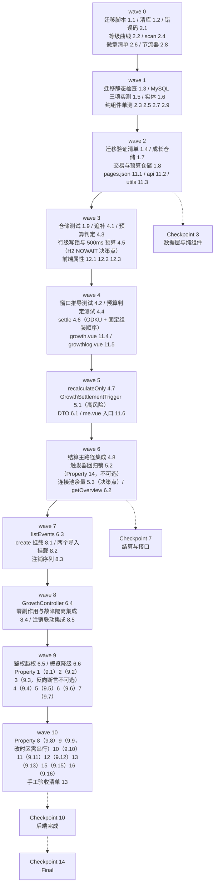

# Implementation Plan: 成长体系

## Overview

后端先行、由内向外：数据层（迁移 + 实体 + 仓储）→ 无外部依赖的纯组件（错误码、等级曲线、日历扫描、
徽章清单、节流器）→ 结算核心（追补 / 预算判定 / 行级写锁 / `settle` / 全量重算）→ 结算触发
（`afterCommit` 注册与异常隔离）→ 查询层与控制器 → 改造既有代码（三个结算挂载点、
`AccountDeletionService` 注销序列）→ 后端属性测试 → 前端 miniapp。
每完成一组运行 `./mvnw test`；前端改动完成后运行 `npm run test` 与 H5 构建。

三处高风险实现点单独立任务、单独验证：
**`GrowthSettlementTrigger` 的提交后回调**（任务 5.1 + 5.2 回归锁，Property 14）、
**批量插入只忽略重复键**（任务 4.6 的 `ON DUPLICATE KEY UPDATE id = id` + 任务 9.3 的反向断言）、
**迁移脚本在真实 MySQL 上的行为**（任务 1.4 + 1.5，走 `deploy/dev-remote-db.sh`）。

## Tasks

- [x] 1. 数据层：迁移脚本、实体与仓储
  - [x] 1.1 新增迁移脚本 `V<N>__user_growth.sql`
    - **开始时先重新核对 `src/main/resources/db/migration` 目录当前最大版本号，以及 `V30`/`V32` 的实际占用情况**：设计定为 `V32__user_growth.sql`（撰写设计时最大为 V31 即 `V31__user_invite.sql`、`V30` 由 user-feedback-system spec 预占且文件尚未落地）；若届时占用情况有变，按「大于目录内全部已存在版本号且未被任何迁移文件或其它 spec 预占的最小值」重算
    - 不修改、不重命名任何已存在的迁移文件
    - `CREATE TABLE user_growth`：恰好 10 列、主键 `user_id`（**不声明 `AUTO_INCREMENT`**、不另建自增代理键、不为 `user_id` 另加唯一约束）、CHECK `ck_user_growth_level`、除主键外无其它索引
    - `CREATE TABLE growth_events`：恰好 6 列、主键 `id`（`AUTO_INCREMENT`）、唯一 `uk_growth_events_user_key (user_id, event_key)`、非唯一 `idx_growth_events_user_type (user_id, event_type)`、非唯一 `idx_growth_events_user_id (user_id, id)`、CHECK `ck_growth_events_type`（表达式内显式 `COLLATE utf8mb4_bin`，写法对齐 `V31__user_invite.sql` 的 `ck_invite_relations_status`）与 `ck_growth_events_exp`
    - 索引列全部升序：**不声明 `DESC`、不使用 `_desc` 结尾的索引名**（InnoDB 反向扫描升序索引即可满足 `ORDER BY id DESC`）
    - 两表 InnoDB + `utf8mb4` + `utf8mb4_unicode_ci`、16 个列注释 + 2 个表注释全部为中文（对齐 `V27__loan_repayments.sql` / `V31__user_invite.sql` 写法）
    - **两表均无任何指向 `users(id)` 的外键**；脚本不回填任何存量用户的成长数据（迁移后两表行数为 0）
    - 脚本头部中文注释写明：经验只增不减与幂等由唯一索引承担、徽章复用本表且 `BADGE:` 为独占命名空间、等级曲线刻意不落库、无外键是刻意选择（注销时由服务层显式删除）
    - _Requirements: 11.1, 11.2, 11.3, 11.4, 11.5, 11.6, 11.9, 11.10, 11.11, 11.12, 11.13_

  - [x] 1.2 清库脚本 `deploy/reset-db.sql` 增加两表
    - 在 `TRUNCATE TABLE users` 之前插入 `TRUNCATE TABLE growth_events;` 与 `TRUNCATE TABLE user_growth;`，并加一行注释说明两表无外键、清空不依赖 `FOREIGN_KEY_CHECKS`
    - 不新增任何针对 `flyway_schema_history` 的语句
    - _Requirements: 11.18_

  - [x] 1.3 迁移目录静态检查测试*
    - **复用既有 `MigrationDirectoryTest` 与 `src/test/resources/db/migration-baseline.sha256` 机制**：把新脚本纳入基线，断言新脚本存在且版本号大于全部既有版本、目录内版本号无重复、历史迁移文件内容未被改动
    - _Requirements: 11.11, 11.12_

  - [x] 1.4 在真实 MySQL 上执行迁移验证清单
    - 走 `bash deploy/dev-remote-db.sh` 连测试库（或本地 MySQL 建临时库全量 V1→V32）执行迁移，逐项核对 `information_schema`：
      `columns`（`user_growth` 恰好 10 列、`growth_events` 恰好 6 列，逐列断言类型 / 可空性 / 缺省值 / 中文注释非空；**`user_growth.user_id` 的 `EXTRA` 不含 `auto_increment`**）、
      `statistics`（三个索引的名称 / 唯一性 / **列序**，且全部列的 **`COLLATION` 均为 `A`**；`user_growth` 除主键外无其它索引）、
      `table_constraints` + `check_constraints`（`ck_growth_events_type` 的 `CHECK_CLAUSE` 含 `utf8mb4_bin`、`ck_growth_events_exp`、`ck_user_growth_level` 三者存在）、
      `referential_constraints`（**两表外键数均为 0**）、
      `tables`（引擎 InnoDB / 排序规则 `utf8mb4_unicode_ci` / 表注释非空）
    - 存量数据不受影响：迁移前后既有表行数与若干行快照相同，两张新表行数为 0
    - 幂等性：连续两次启动应用，`flyway_schema_history` 中该版本记录数为 1
    - 以生产配置（Hibernate `ddl-auto=validate`）在迁移后的库上启动应用，启动成功（即两个实体的 16 列与 schema 一致）
    - 执行 `deploy/reset-db.sql` 后断言两表行数为 0、表仍存在、`flyway_schema_history` 记录数不变
    - _Requirements: 11.1, 11.2, 11.3, 11.4, 11.6, 11.10, 11.13, 11.14, 11.16, 11.17, 11.18, 11.20_

  - [x] 1.5 实测 CHECK 大小写敏感性、`FOR UPDATE NOWAIT` 与 ODKU 行为并回写设计文档
    - **CHECK 大小写敏感实测**：在目标 MySQL 版本上验证 `CHECK (event_type COLLATE utf8mb4_bin IN (...))` 表达式**是否被接受**；插入 `'first_record'`、`'Badge'`、`'DAILY_record'`、`'FOO'` 各一条断言被 `ERROR 3819` 拒绝，六个正确取值断言通过，`UPDATE ... SET event_type = 'badge'` 同样被拒；`exp_amount = -1` 被 `ck_growth_events_exp` 拒、`level = 0` 与 `level = 101` 被 `ck_user_growth_level` 拒；被拒后两表行数与全部列取值逐行不变
    - **退化方案**：若该表达式被目标 MySQL 版本拒绝，改用列级 `event_type VARCHAR(16) CHARACTER SET utf8mb4 COLLATE utf8mb4_bin NOT NULL` + 不含 `COLLATE` 的 `event_type IN (...)`，保持约束名与六个取值集合不变、表默认排序规则仍为 `utf8mb4_unicode_ci`，修改任务 1.1 的脚本
    - **`FOR UPDATE NOWAIT` 语法实测**：开两个会话，第二个会话对同一 `user_growth` 行执行 `SELECT ... FOR UPDATE NOWAIT`，断言**立即失败**而非等待，确认任务 4.5 的应用层墙钟预算方案在生产库上成立
    - **`ON DUPLICATE KEY UPDATE id = id` 行为实测**：重复键不报错且行数不增、CHECK 违例仍报错（这两条一起证明「只忽略重复键」成立）
    - **在 design.md 的「迁移脚本」小节补记实测所用 MySQL 版本号与上述每项的实际结论**（格式对齐 invite-system 设计文档 `V31` 的实测结论块）
    - _Requirements: 11.5, 11.7, 11.8, 11.19, 1.6, 9.16_

  - [x] 1.6 新增 `UserGrowth` 与 `GrowthEvent` 实体、`GrowthEventType` 常量类
    - `UserGrowth`：`@Id @Column(name = "user_id")` 且**刻意不加 `@GeneratedValue`**；类级 Javadoc 写明原因（加了会让 Hibernate 认为该值由库分配、忽略我们写入的 `userId` 并要求一个自增列，与 DDL 冲突），并写明「因此建档不走 `save()` 而走 `JdbcTemplate` 的 ODKU，避免 merge 语义的多余探测查询」
    - `GrowthEvent`：`userId` 声明为**裸 `Long`**，不得映射为 `@ManyToOne User`；类级 Javadoc 写明原因（表上无外键，关联映射会诱导后续开发者补外键，且读取路径不需要用户对象、只会引入 N+1 与 `EntityNotFoundException`）
    - `eventType` 用 `String` 而非 `@Enumerated`（写入走 `JdbcTemplate`，实体只服务读取；库里出现意外取值时仍读得出来），取值集合由 `ck_growth_events_type` 与 `GrowthEventType` 常量类共同保证
    - _Requirements: 11.1, 11.2, 11.9, 11.17_

  - [x] 1.7 新增 `UserGrowthRepository` 与 `GrowthEventRepository`
    - `UserGrowthRepository`：`findForUpdateById`（`@Lock(PESSIMISTIC_WRITE)` + `@QueryHints(jakarta.persistence.lock.timeout = 0)`，Javadoc 写明它渲染为 `FOR UPDATE NOWAIT`、500ms 由服务层墙钟预算实现，因为 `innodb_lock_wait_timeout` 最小粒度是 1 秒）、`@Modifying` 的 `deleteByUserId`
    - `GrowthEventRepository`：`findEventKeysByUserId`、`sumExpByUserId`（数据库聚合，Javadoc 写明不得改为内存累加）、`findDailyRecordKeys`（`order by event_key asc` 即日期升序，`YYYY-MM-DD` 字典序与日期序一致）、`findBadgeEvents`、`findByUserIdOrderByIdDesc(Pageable)`、`countByUserId`、`@Modifying` 的 `deleteByUserId`
    - `DAILY_RECORD` 键的解析失败必须抛异常而非静默跳过（畸形键说明写入路径有缺陷，跳过会让累计天数悄悄少算）——在 Javadoc 里写明
    - _Requirements: 1.2, 1.9, 3.8, 8.6, 10.3, 10.5, 12.11_

  - [x] 1.8 `TransactionRepository` 新增 4 个 nativeQuery、`BudgetRepository` 新增 1 个
    - `TransactionRepository`：`countValidRecordsByCreatedBy`、`sumValidAmountsByCreatedByGroupByType`、`findEarliestRecordCreatedAt(userId, lowerBound)`、`findRecordDatesInWindow(userId, windowStart, windowEndExclusive)`
    - 四个查询**全部 `nativeQuery = true`**，「有效记账交易」的四个条件（`created_by` / `deleted_at IS NULL` / `type IN ('expense','income')` / `ledger_id IS NOT NULL`）逐条写在 SQL 里；每个查询的 Javadoc 点明「因实体带 `@SQLRestriction("deleted_at is null")`，走 JPQL 会让软删过滤变成隐式条件，故刻意走原生 SQL 并自己写 `deleted_at IS NULL`，漏写会把回收站记录算进来」
    - 按 `created_by` 过滤复用既有单列索引 `idx_tx_created_by`，不新增任何列与索引
    - `BudgetRepository`：新增 `findByLedgerIdInAndMonth(Collection<Long> ledgerIds, String month)`，使预算判定的查询数不随账本数增长
    - _Requirements: 7.1, 7.2, 7.3, 7.4, 7.5, 7.6, 7.12, 4.6, 5.11_

  - [x] 1.9 仓储层映射与查询单元测试*
    - H2 上断言两个实体与表结构一致；`UserGrowth` 以显式 `userId` 保存后可按主键读回；`sumExpByUserId` 无行时返回 0；`findDailyRecordKeys` 的升序等于日期升序；两个 `deleteByUserId` 在无行时影响行数为 0 且不抛错
    - 四个交易聚合查询的口径：软删 / `transfer` / `ledger_id` 为 NULL 三类行一律不计入
    - _Requirements: 11.17, 10.3, 12.11, 7.2, 7.4, 7.5, 7.6_

- [x] 2. 错误码与无外部依赖的纯组件
  - [x] 2.1 `ApiException` 新增成长域 1 个错误码工厂方法
    - `growthPageParamInvalid(String field)`（400，`GROWTH_PAGE_PARAM_INVALID`），置于新增的「Growth 成长域」分节
    - 注释写明这是本 spec **唯一**新增的错误码：结算失败与结算节流均不对外暴露错误码；且**不复用** invite 域的分页错误码（跨域复用会让客户端在成长页收到带 `INVITE` 前缀的错误码）
    - _Requirements: 10.9, 10.15_

  - [x] 2.2 实现 `GrowthLevelCurve`
    - Bean 初始化时由公式 `threshold(L) = 2(L−1)² + 8(L−1)` 派生长度 100 的不可变 `long[]`（**不写手工常量表**，乘法用 `long` 参与）
    - `threshold(int level)`：`level ∉ [1, 100]` 抛 `IllegalArgumentException`
    - `levelOf(long exp)`：`Arrays.binarySearch` + **负返回值处理**（`-(insertionPoint) - 1` 转成 `insertionPoint - 1` 即等级），全程整数比较，不使用浮点开方或浮点除法；`exp >= 20394` 恒返回 100
    - 类级 Javadoc 必须写明：**曲线只能向更平缓调整，绝不能改陡（会让已有用户掉级，破坏需求 1.4）；要拉长成长曲线应新增等级段，而不是修改 Lv1–Lv100 的既有阈值**
    - _Requirements: 2.1, 2.2, 2.3, 2.4, 2.5, 2.6, 2.11_

  - [x] 2.3 `GrowthLevelCurve` 单元测试*
    - 100 个阈值全枚举比对公式；`threshold(1) == 0`、`threshold(2) == 10`、`threshold(100) == 20394`；严格单调递增
    - `threshold(0)` / `threshold(101)` / `threshold(-1)` 抛异常
    - **边界表 12 行逐条断言**（0 / 9 / 10 / 11 / 23 / 24 / 233 / 234 / 20393 / 20394 / 20395 / `Long.MAX_VALUE`），含「阈值取等号即升级」与满级钳制
    - _Requirements: 2.1, 2.2, 2.3, 2.4, 2.5, 2.6, 2.11_

  - [x] 2.4 实现 `GrowthCalendarService.scan`（O(n) 纯函数）
    - `static CalendarScan scan(List<LocalDate> ascendingDates)`：一次 O(n) 扫描得出 `totalDays` / `currentSegment` / `maxStreak` / `lastDate`；空集返回 `(0, 0, 0, null)`
    - **纯函数**：不读时钟、不查库，同一输入恒得同一输出；结算与全量重算共用它（这是「增量维护结果 == 全量重算结果」构造性成立的根据）
    - Javadoc 写明为什么不用窗口函数 SQL（H2 与 MySQL 行为可能不同，会让核心不变式失去自动化验证）
    - _Requirements: 4.9, 4.10, 4.12, 4.13_

  - [x] 2.5 `scan` 单元测试*
    - 空集 / 单点 / 全连续 / 全孤立 / 多段 / 跨月 / 跨年 / 闰日 `2024-02-29 → 03-01` / 输入乱序 / 输入含重复
    - 断言 `maxStreak >= currentSegment`、`totalDays == 去重后日期个数`
    - _Requirements: 4.9, 4.10, 4.12, 4.13_

  - [x] 2.6 实现 `GrowthBadgeCatalog`
    - **9 枚徽章的编码、中文名、门槛（`target`）、统计口径（`BadgeMetric`）与展示顺序的单一常量事实源**；`badges()` 返回有序不可变列表
    - `qualified(GrowthFacts)` 返回点亮条件已成立的编码集合（只判条件，不判是否已写入事件）
    - `eventKeyOf(code)` 恒返回 `"BADGE:" + code`；Javadoc 写明 `BADGE:` 是徽章的**独占命名空间**，与 `FIRST_RECORD` / `STREAK_7` / `STREAK_30` / `BUDGET_MET` 四个同名经验事件键**双向隔离**
    - 展示名称随响应下发，迁移脚本、数据库与 miniapp 一律不重复定义任何门槛数值或展示名称
    - _Requirements: 8.1, 8.7, 8.8, 8.10, 8.11, 8.12_

  - [x] 2.7 `GrowthBadgeCatalog` 单元测试*
    - 9 枚编码 / 名称 / `target` / 顺序逐条断言，两次调用顺序相同
    - 四个同名编码的 `event_key` 恒带 `BADGE:` 前缀；`BUDGET_MET` 徽章的条件只看 `event_type = 'BUDGET_MET'` 的行、不看 `BADGE:BUDGET_MET` 行
    - `current` 的 `min` 与 clamp：已点亮恒等于 `target`、未点亮取 `min(统计量, target)`、结果恒落在 `[0, target]`
    - _Requirements: 8.1, 8.7, 8.8, 8.11, 8.12_

  - [x] 2.8 实现 `GrowthSettlementThrottle`
    - **两个互不相干的节流器**：`overviewRecentlySettled(userId)`（概览侧 10 秒，进程内内存，进程启动后该用户首次请求必放行）与 `markSettled(userId)`
    - 记账侧的 60 秒窗口**刻意不放内存**：其判定条件含「`last_record_date` 已等于结算日」，本就要读档案行，顺手读 `last_settled_at` 更简单也天然跨实例一致——在类级 Javadoc 里写明这个分工
    - 注入 `Clock`（既有 `TimeConfig`），不得用 `System.currentTimeMillis()`
    - _Requirements: 9.15, 10.14_

  - [x] 2.9 `GrowthSettlementThrottle` 单元测试*
    - 固定 `Clock`：概览侧 9999ms 跳过 / 10000ms 放行；进程启动后首次请求必放行；两个节流器互不干扰；不同 `userId` 互不影响
    - _Requirements: 9.15, 10.14_

- [x] 3. Checkpoint - 数据层与纯组件
  - 运行 `./mvnw test`，确保全部测试通过；任务 1.5 的三项实测结论已回写 design.md。有疑问询问用户。

- [x] 4. 结算核心
  - [x] 4.1 实现 `GrowthCalendarService.backfillDates`（两次有界查询）
    - 查询 A：`MIN(created_at)` 定追补起点（`last_record_date` 为 NULL 时不加时间下界；返回 NULL ⇒ 本次无可追补日期，返回空 `dates` 并继续后续步骤）
    - 查询 B：`created_at ∈ [追补起点 00:00, 窗口末日次日 00:00)` 的 distinct 记账日，窗口末日 = `min(追补起点 + 999 天, 结算日)`，故返回行数 ≤1000、两端都有界
    - **查询次数恒 ≤2**；断言 `dates.size() <= 1000`
    - 日期归属用 **`CAST(created_at AS DATE)`**：注释写明时区结论——所有 `DATETIME` 列存的是 `Asia/Shanghai` 挂钟时刻（`application.yml` 刻意不设 `hibernate.jdbc.time_zone`、`TimeConfig` 的 `Clock` 固定 `Asia/Shanghai`），因此**零换算**；并逐条排除 `CONVERT_TZ`（依赖 `mysql.time_zone*` 系统表，缺失时静默返回 NULL 会让追补永久停摆）与 `+ INTERVAL 8 HOUR`（前提是列存 UTC，本项目不是）
    - 日期加减一律用 `LocalDate.plusDays` / `ChronoUnit.DAYS.between`，不用 `Instant` + `ZoneId`
    - _Requirements: 4.1, 4.6, 4.14, 4.16_

  - [x] 4.2 追补窗口推导单元测试*
    - `last_record_date` 为 NULL；起点 + 999 天 < 结算日（窗口末日取前者）；起点 + 999 天 > 结算日（取后者）；起点 == 结算日；起点 > 结算日（时钟回拨，跳过且不写任何事件）
    - 断言查询次数恒 ≤2（用计数型 spy 仓储）、`dates` 升序去重
    - _Requirements: 4.3, 4.6, 4.14_

  - [x] 4.3 实现 `GrowthBudgetEvaluator.metMonths`
    - 固定回看结算日所属月的**前 1 / 2 / 3 个自然月**，不判定结算日所属月
    - 1 次取自有账本清单（`ledgers.user_id` 等于该用户）→ 空则直接返回空；`existingKeys` 命中的月份直接跳过（不额外查库）；每月 2 次查询（预算行 + 按 `ledger_id` 分组的月度支出合计），**读查询数 ≤8 且不随账本数增长**（两个按月查询都用 `ledger_id IN (:ids)` 一次取回，在应用层分组）
    - 达成判定：该月有总预算行 AND 支出合计 > 0 AND 合计 ≤ 预算金额；多账本命中即 `break`，**每月至多 1 条**
    - 月度支出合计按 **`occurred_at` 半开区间 [月首 00:00, 次月首 00:00)** 聚合、只计 `expense`、排除 `deleted_at` 非空、`BigDecimal` 保留 2 位
    - 三条必须写进注释：① 这里按 `occurred_at`（与记账日历按 `created_at` 刻意不同）；② 过滤条件**不复用**累计统计那套（一处按 `created_by` 跨全部账本、一处按 `ledger_id` 限自有账本）；③ 口径以需求 5.11 自述为准，`BudgetService` 将来变更**不自动跟随**
    - _Requirements: 5.1, 5.3, 5.4, 5.5, 5.6, 5.7, 5.10, 5.11, 5.13, 5.15_

  - [x] 4.4 `GrowthBudgetEvaluator` 单元测试*
    - 无预算行 / 零支出 / 超预算 / 恰好等于预算（视为达成）/ 多账本均达成（返回 1 个月份）/ 协作账本达成（不返回）/ 3 个月都达成 / 第 4 个月不返回
    - 用计数型 spy 断言读查询数 ≤8，且账本数由 1 增到 20 时查询数不变
    - _Requirements: 5.4, 5.5, 5.6, 5.7, 5.10, 5.13, 5.15_

  - [x] 4.5 实现行级写锁获取与 500ms 墙钟预算
    - `lockProfileWithBudget(userId, 500ms)`：`findForUpdateById` → 捕 `PessimisticLockingFailureException` → 剩余预算内退避重试（20 / 40 / 80ms，至多 3 次）→ 预算耗尽抛 `GrowthLockAbandonedException`（**穿出方法**使事务回滚，由事务边界外吞掉）
    - 注释写明数据库事实：`innodb_lock_wait_timeout` 最小粒度 1 秒、`FOR UPDATE` 只有 `NOWAIT` / `SKIP LOCKED` 两种非阻塞修饰，故 500ms 只能是应用层墙钟预算；锁等待的对手只有「同一用户的另一次结算」，而并发结算幂等，因此放弃是安全降级
    - **决策点：实测 H2（`MODE=MySQL`）是否支持 `FOR UPDATE NOWAIT`**。支持则直接用；不支持则测试期改用不带 hint 的 `PESSIMISTIC_WRITE` + 会话级 `SET LOCK_TIMEOUT 500` 近似，并把「500ms 放弃」这条分支的**最终确认放进任务 1.5 的真实 MySQL 手工清单**；结论写进代码注释
    - _Requirements: 1.9, 9.16_

  - [x] 4.6 实现 `GrowthSettlementService.settle`
    - `@Transactional(propagation = REQUIRES_NEW)`；单次结算**只读一次时钟**（`now` 同时用于事件 `created_at`、`updated_at`、`last_settled_at`）
    - ① 节流（**在事务之外判定**）：`OVERVIEW` 走 10 秒内存窗口；`RECORD` 无锁读档案，`last_settled_at` 距今 <60s **且** `last_record_date` 已等于结算日则跳过、不开事务、不写任何行
    - ② 建档：`INSERT INTO user_growth (...) VALUES (...) ON DUPLICATE KEY UPDATE user_id = user_id`（走 `JdbcTemplate`，避开 `save()` 的 merge 探测查询，顺手解决并发建档竞态）→ 任务 4.5 的加锁读
    - ③ 读事实源（全部只读）：全部 `event_key` / 累计笔数 / `REGISTERED` 邀请关系条数 / 追补日期 / 预算达成月份
    - ④ **事件组装顺序固定**（便于逐条断言）：`DAILY_RECORD`（日期升序）→ `FIRST_RECORD` → `STREAK_7` → `STREAK_30` → `BUDGET_MET` → `FIRST_INVITE` → `BADGE`；`STREAK` 门槛用「已有日历 ∪ 本次补发日期」的 `maxStreak` 判定，**跨门槛不漏发低门槛**（≥30 时同次写入 `STREAK_7` 与 `STREAK_30`）；`add(...)` 先按 `existingKeys` 过滤；断言 `pending.size() <= 1016`
    - ⑤ 批量插入：`INSERT ... ON DUPLICATE KEY UPDATE id = id`（`jdbcTemplate.batchUpdate`）。注释写明**不得改用 `INSERT IGNORE`**（它会把 CHECK 违例、非空违例与超长截断一并静默吞掉），且结算路径**不应存在任何 `catch DataIntegrityViolationException`**——ODKU 之下重复键根本不会抛异常，出现该 catch 就说明有人试图吞掉 CHECK 违例；同时注释说明**为什么不用 invite-system 的 JDBC 保存点方案**（那里的插入在登录事务内、冲突绝不允许连坐；这里在结算自己的独立事务内，整体回滚 + 下次自愈是可接受的失败模式），避免有人「顺手统一」
    - ⑥ 全量重算写回：从库重读完整 `DAILY_RECORD` 日历 → `scan` 纯函数 → 四个物化列；`exp` 一律取 `SUM(exp_amount)` 聚合（**不用「旧 exp + 本次新增」的内存累加**）→ `levelOf(exp)`；写回六列 + `updated_at` + `last_settled_at`，**不动 `user_id` 与 `created_at`**
    - 类级 Javadoc 写明两条禁令：**本方法刻意不捕获任何异常**（`REQUIRES_NEW` 只在异常穿出被通知方法时回滚，方法体内 catch 会让 Spring 提交一个已标记回滚的事务并可能留下部分写入）、**禁止把 `REQUIRES_NEW` 改成 `REQUIRED`**（结算回滚会连坐已提交的记账）
    - _Requirements: 1.2, 1.5, 1.6, 1.7, 1.8, 1.10, 1.11, 3.1, 3.2, 3.3, 3.4, 3.5, 3.6, 3.7, 3.8, 3.9, 3.10, 4.2, 4.3, 4.7, 4.9, 4.10, 6.1, 6.2, 8.2, 8.3, 9.3, 9.15_

  - [x] 4.7 实现 `GrowthSettlementService.recalculateOnly`
    - `@Transactional(REQUIRES_NEW)`；与 `settle` 共用同一套第 ⑥ 步重算代码，但**不组装、不插入任何事件**
    - Javadoc 写明「全量重算」不是第二条实现路径，而是「跳过组装与插入的同一条路径」——两者相等因此是构造性成立的，Property 5 只负责锁住这条事实
    - _Requirements: 1.12, 4.13_

  - [x] 4.8 结算主路径集成测试*
    - 首次结算：`FIRST_RECORD` + `DAILY_RECORD:<今日>` + 相应 `BADGE` 全部出现，`user_growth` 一行且 `level == 2`
    - 幂等：连续两次结算之间无任何事实源变化时，事件行数与五个物化列取值完全相同
    - 同一自然日内 2–100 次记账各触发一次结算 → 该日 `DAILY_RECORD` 恰好 1 条、该日经验合计 5
    - 追补窗口末日 < 结算日时**不写 `DAILY_RECORD:<结算日>`**，`last_record_date` 取窗口内最大已补发日，下一次结算的追补起点严格更晚
    - _Requirements: 1.7, 1.10, 3.2, 3.6, 4.4, 4.14, 9.1_

- [x] 5. 结算触发（高风险，单独立任务 + 单独回归锁）
  - [x] 5.1 实现 `GrowthSettlementTrigger`
    - `requestSettlement(Long userId)`：`userId` 为 null 直接返回；无事务上下文（`isSynchronizationActive()` 为 false）走**兜底路径**就地结算（由 `settle` 自己的 `REQUIRES_NEW` 开事务）；有事务上下文则注册 `afterCommit` 回调
    - **同事务去重**：用 `TransactionSynchronizationManager.bindResource(PENDING_KEY, new LinkedHashSet<Long>())` 当「回调已注册」的标记，后续调用只往集合里加 `userId`，`afterCommit` 把整个集合合并为**一轮**结算；用 `LinkedHashSet` 而非 `HashSet` 使多用户结算顺序稳定可测
    - `afterCompletion(status)` 内 `unbindResourceIfPossible` **必须解绑**（Spring 只清理自己管理的同步回调列表，`bindResource` 的资源要自己解绑，否则线程池复用线程时会把上一个事务的集合带进下一个事务）
    - `settleQuietly`：逐 `userId` `try-catch`，**异常全吞只记 WARN**（含运行时 / 受检异常、行锁超时、连接获取失败）；**刻意不捕获 `Error`**（`OutOfMemoryError` / `StackOverflowError` 是 JVM 级故障，吞掉只会掩盖问题）——这是对「任何异常」的一处刻意收窄，需在注释写明；`finally` 内耗时 >1000ms 记一条 `[GROWTH_SETTLE_SLOW]` WARN
    - **类级 Javadoc 必须写明四条禁令**：① 异常不得穿出 `afterCommit` 回调（`triggerAfterCommit` 在 `processCommit` 内调用，回调异常会穿出 `commit()` 让记账接口返回 500，尽管交易已提交）② 同一事务只注册一次回调（否则循环调用 `create` 会注册 N 个回调、结算 N 次）③ 回调内只传 `Long userId` 这类不可变值，**绝不传实体对象**（`afterCommit` 阶段持久化上下文已关闭，复用原 `EntityManager` 会得到 `LazyInitializationException` 或对已关闭 Session 的调用）④ 异常必须在 `settle` 的事务边界**之外**吞掉（边界内 catch 会让 Spring 提交一个已标记回滚的事务）
    - _Requirements: 9.1, 9.3, 9.4, 9.5, 9.6, 9.7, 9.9, 9.13_

  - [x] 5.2 `GrowthSettlementTrigger` 的回归锁测试（**Property 14，不标可选**）
    - **Property 14: 结算的故障隔离、节流与并发终态**
    - **Validates: Requirements 3.11, 6.6, 6.7, 9.1, 9.2, 9.3, 9.4, 9.5, 9.6, 9.7, 9.8, 9.9, 9.10, 9.11, 9.15, 9.16, 10.14**
    - **驱动方式：不给测试方法加 `@Transactional`，改用 `TransactionTemplate` 显式包裹被测调用**——加 `@Transactional` 会让 Spring Test 在方法结束时回滚，`afterCommit` 永不触发，于是「断言结算未发生」会假绿通过。这条必须写在测试类 Javadoc 里
    - 断言：同一事务内调 5 次 `requestSettlement` 只结算 1 次；多 `userId` 合并为一轮且顺序稳定；`settle` 抛任意异常时调用方完全感知不到、已提交的交易与余额不变、两表零变更；`afterCompletion` 后资源已解绑（同线程下一个事务不受污染）；无事务上下文走兜底路径且确实结算；结算发生在**测试线程**（用 `Thread.currentThread()` 在结算内记录后比对，比断言「不存在线程池 Bean」更直接）
    - 测试数据清理**不能靠事务回滚**（我们要真实提交）：用 `@BeforeTry` 显式清库或全局自增序号保证每次迭代 `userId` / `email` 唯一
    - 必须是 `@SpringBootTest`（`REQUIRES_NEW` 需要真实事务管理器），不能是纯 Mockito 单测
    - **测试 Javadoc 必须写明：把 `catch` 挪进 `settle` 内部、或把 `REQUIRES_NEW` 改成 `REQUIRED` 时，本测试必然失败**
    - _Requirements: 9.3, 9.5, 9.7, 9.9_
    - _Properties: 14_

  - [x] 5.3 确认 HikariCP `maximum-pool-size` 余量并写进部署说明
    - **决策点**：`REQUIRES_NEW` 在 `afterCommit` 阶段会让**同一请求同时占用两个数据库连接**（外层尚未 `afterCompletion` 释放的 + 结算的）。核对 `application.yml` 现值，按「并发记账请求数 × 2」评估是否留有余量；若不足则调大并说明依据
    - 把这条写进 `deploy/README.md`：连接池打满时结算会以「获取连接超时」失败，这正是它被设计成「失败即吞、下次自愈」的原因，不会拖垮记账
    - _Requirements: 9.13, 9.14_

- [x] 6. 查询层、DTO 与控制器
  - [x] 6.1 新增成长接口 DTO
    - `GrowthOverviewResponse`（**恰好 15 项**）、`BadgeView`（6 字段）、`GrowthEventPageResponse`（顶层**恰好 2 项**：列表项 + 总条数）、`GrowthEventItem`（**恰好 5 字段**）
    - DTO 中**不得**出现任何用于指定目标用户的字段，也不得出现 `email` / `wx_openid` / `wx_unionid` / `invite_code` / `plan` / `role`
    - 金额一律 `BigDecimal`
    - _Requirements: 10.1, 10.3, 10.13, 8.5, 8.6_

  - [x] 6.2 实现 `GrowthQueryService.getOverview`
    - 顺序固定：10 秒节流判定 → 尝试结算（**异常就地吞掉只记日志**，因为这里在事务边界之外）→ 读档案（**可能为空**）→ 实时聚合三项累计 → **按判定日校正当前连续天数** → 组装 9 枚徽章
    - 判定日校正：`last_record_date ∈ {判定日, 判定日−1}` 时返回 `current_streak_days`，否则返回 0，且**该读取不写库**
    - 累计统计：`BigDecimal.setScale(2, HALF_UP)`，无匹配行 `0.00`；`> 9999999999999999.99` 钳到上界并记 WARN；`< 0` 以 `0.00` 返回；三项聚合合计 >500ms 记一条 WARN；三种情形**都不使请求失败**
    - 徽章：已点亮 → `current == target` + 解锁时刻取该 `BADGE` 行 `created_at`；未点亮 → `current = min(统计量, target)` + 解锁时刻为空；条件已成立但事件尚未写入时返回未点亮 + `current == target` + 空解锁时刻且不报错
    - 降级：结算失败且无档案时返回等级 1 / 经验 0 / 三项天数 0 / 9 枚未点亮，但**累计笔数与金额为真实值**；结算成败**不改变响应字段集**
    - _Requirements: 10.1, 10.14, 2.8, 2.9, 2.10, 4.11, 4.15, 7.9, 7.10, 7.13, 7.14, 7.15, 8.5, 8.6, 8.12, 8.13, 9.10, 9.11_

  - [x] 6.3 实现 `GrowthQueryService.listEvents`
    - `@Transactional(readOnly = true)`；**本方法不触发结算**
    - 以原文 `String` 接收 `page` / `size` 后自行解析：不可解析 / `page < 0` / `page > 100000` / `size < 1` / `size > 50` 一律抛 `GROWTH_PAGE_PARAM_INVALID` 并置 `field`；缺省 `page = 0`、`size = 20`
    - 按 `id` 倒序分页，同时返回不受分页影响的总条数；页码越界返回空列表 + 真实总条数且不报错
    - 允许明细比概览旧（两接口经验值合计可不相等），不因该差异报错、不写任何表
    - _Requirements: 10.2, 10.3, 10.4, 10.5, 10.9, 10.10, 10.11_

  - [x] 6.4 实现 `GrowthController`
    - `GET /api/growth`、`GET /api/growth/events`；只做校验与 DTO 组装，不含业务判定
    - `requireExistingUserId()`：取令牌 `userId` 后显式 `userRepository.findById(...).orElseThrow(ApiException::unauthenticated)`（过滤链只校验签名与有效期、不查库，已注销用户的未过期令牌仍会被放行），该校验**先于**结算、分页参数校验与任何聚合查询
    - 分页参数以 **`String`** 接收（`@RequestParam(required = false) String page/size`）：注释写明交给框架做类型转换会让非数字取值在进入方法体之前抛 `MethodArgumentTypeMismatchException` → `PARAM_INVALID`（另一套字段集），既绕过「令牌用户仍存在」的校验，也违背需求 10.9
    - 概览是本项目唯一的写入型 GET（内含结算），**不要加任何 HTTP 缓存头**
    - **`SecurityConfig` 明确不改动**：`/api/growth/**` 落在 `anyRequest().authenticated()` 之下，成长接口无公开端点，不存在 invite-system 那种「permitAll 必须写在前面」的顺序陷阱——在控制器类级 Javadoc 里写明这一句，避免后续有人去补一条多余规则
    - 两接口都与会话账本无关：不要求也不检查 `X-Ledger-Id`
    - _Requirements: 10.6, 10.7, 10.8, 10.12, 10.13, 10.15_

  - [x] 6.5 集成测试：鉴权与越权*
    - 两个接口在 5 种令牌形态下均返回 `UNAUTHENTICATED`（缺失 / 验签失败 / 过期 / **令牌用户已注销**（过滤链管不到的情形）/ 空 Bearer），且**优先于**非法分页参数
    - A 的令牌附加伪造入参（`userId` / `targetUserId` / `uid`）只能读到 A 的数据，响应与不带这些入参时逐字段相等
    - 不带 `X-Ledger-Id` 与带一个不可访问的 `X-Ledger-Id` 时响应逐字段相等
    - 断言序列化后的 JSON 文本不出现 `email` / `wx_openid` / `wx_unionid` / `invite_code` / `plan` / `role` 六个键与取值
    - _Requirements: 10.6, 10.7, 10.8, 10.12, 10.13_

  - [x] 6.6 集成测试：概览的降级返回*
    - 让结算抛异常且该用户**无档案**：断言 200 + 等级 1 / 经验 0 / 三项天数 0 / 9 枚未点亮，且累计笔数与金额为真实值
    - 让结算被 10 秒节流：断言响应字段集与执行结算时相同、不返回错误、不新增错误码
    - 明细接口断言零结算（用计数型装饰器断言 `settle` 调用数为 0）
    - _Requirements: 9.10, 9.11, 10.11, 10.14_

- [x] 7. Checkpoint - 结算与接口
  - 运行 `./mvnw test`，确保全部测试通过；任务 4.5 的 H2 `NOWAIT` 决策与任务 5.3 的连接池结论已落地。有疑问询问用户。

- [x] 8. 改造既有代码
  - [x] 8.1 `TransactionService.create`（11 参重载）挂结算
    - 方法体末尾追加 `growthSettlementTrigger.requestSettlement(tx.getCreatedBy())`
    - 归属键取 **`tx.getCreatedBy()` 而非 `userId`**（协作代记时记账人可能不是会话用户）——注释写明
    - 注释写明「不触发路径天然满足」：`transfer` 与 `adjustBalance` 各自建行且 `ledger_id` 为 null，`update` / `delete` / `restore` / `purge` 不新增行，因此**无需额外判定**
    - _Requirements: 9.1, 9.2, 9.3, 7.1_

  - [x] 8.2 两个导入服务挂结算
    - `BillImportService.importBills(...)` 与 `ImportService.importJson(...)`：各在 `@Transactional` 方法体末尾、`return` 之前追加一行 `requestSettlement(userId)`
    - 注释写明：整个导入是**单个事务**，故一次请求恰好 1 次结算；这两个服务直连 `transactionRepository.saveAll`、不经 `TransactionService.create`，因此必须单独挂
    - _Requirements: 9.1, 9.4_

  - [x] 8.3 `AccountDeletionService` 注销序列插入成长数据硬删
    - 在**第 12 步（`invite_relations` 置 `INVALID`）之后、第 13 步（删 `users` 行）之前**插入一步：先 `growthEventRepository.deleteByUserId`、再 `userGrowthRepository.deleteByUserId`（固定顺序只为使删除步骤可逐语句断言）
    - 新增注入两个仓储；**既有 13 步的相对顺序、过滤条件与影响行数一律不动**
    - 两表无行时影响行数 0 即视为成功，**删除前不做任何存在性预查询**；不写任何软删除或归档副本
    - 耗时超阈值只记一条含 `userId` 与耗时的 WARN，不中止注销事务、不改变响应字段集与状态码
    - _Requirements: 12.1, 12.2, 12.5, 12.6, 12.7, 12.8, 12.9, 12.10, 12.11_

  - [x] 8.4 集成测试：不触发路径、批量导入与故障隔离*
    - **不触发路径零副作用**：转账、余额调整、交易修改、软删除、回收站恢复与彻底删除、预算写入、登录/注册、注销、邀请绑定各走一遍，断言两表行数与列取值不变
    - **批量导入一次结算**：账单导入 200 行与数据导入 200 笔各一次，用计数型装饰器断言 `settle` 恰好被调用 1 次
    - **故障隔离**：`@SpyBean` 让 `settle` 抛异常，断言记账仍返回 201、响应体**不含任何成长字段**、交易与余额已提交、两表零变更；随后触发一次正常结算，断言事件被补齐（失败自愈）
    - 断言不存在任何 `@Async` / 定时任务 / 线程池驱动结算（结算线程 == 请求线程）
    - _Requirements: 9.2, 9.4, 9.5, 9.6, 9.7, 9.8, 9.9_

  - [x] 8.5 集成测试：注销联动*
    - 注销后两表该用户行数为 0；成长删除抛错时**整个注销事务回滚**且原令牌仍可成功请求成长概览、`users` 行五列与成长数据快照与注销前相同
    - 前置校验失败（`DELETE_BLOCKED_COLLAB` / 二次验证未过）时两表零副作用
    - 注销不修改其它用户的成长数据、不修改 `invite_relations` 任何行
    - 以同一邮箱重新注册后从 Lv1、9 枚未点亮；两表按 `user_id` 反查 `users.id` 不存在的行数为 0
    - _Requirements: 12.1, 12.2, 12.3, 12.4, 12.5, 12.6, 12.7, 12.11, 11.21_

- [x] 9. 后端属性测试（jqwik，Property 1–16 各一个 `@Property` 方法）
  - [x] 9.1 属性测试 Property 1*
    - **Property 1: 等级曲线的单调性与换算边界**
    - **Validates: Requirements 2.1, 2.2, 2.3, 2.4, 2.5, 2.6, 2.7, 2.11**
    - _Requirements: 2.1, 2.2, 2.3, 2.4, 2.5, 2.6, 2.7, 2.11_
    - _Properties: 1_

  - [x] 9.2 属性测试 Property 2*
    - **Property 2: 经验值等于事件之和，等级与经验一致**
    - **Validates: Requirements 1.1, 1.2, 1.3, 2.8, 2.9, 2.10**
    - 注入 `MutableClock`；操作序列由记账、删账、恢复、改预算、邀请、结算组合生成
    - _Requirements: 1.1, 1.2, 1.3, 2.8, 2.9, 2.10_
    - _Properties: 2_

  - [x] 9.3 属性测试 Property 3*
    - **Property 3: 事件幂等（任意操作序列后每 `event_key` 至多一行）**
    - **Validates: Requirements 1.4, 1.5, 1.6, 1.8, 3.5, 3.7, 8.4, 11.7, 11.8**
    - 并发维度用 `ExecutorService` + `CountDownLatch`（并发度 2–8），`tries` 降到 100
    - **反向断言（`ON DUPLICATE KEY UPDATE id = id` 的回归锁，不标可选）**：断言「非法 `event_type` / 负 `exp_amount` 的插入必须抛 CHECK 违例」；**测试 Javadoc 写明把批量语句改成 `INSERT IGNORE` 时这条断言必然失败**，因为 `INSERT IGNORE` 会把 CHECK 违例静默降级为警告
    - _Requirements: 1.4, 1.5, 1.6, 1.8, 3.5, 3.7, 8.4, 11.7, 11.8_
    - _Properties: 3_

  - [x] 9.4 属性测试 Property 4*
    - **Property 4: 经验与等级单调不减（删账不降级）**
    - **Validates: Requirements 1.4, 5.8, 6.3, 7.6, 7.7, 8.4, 8.12**
    - _Requirements: 1.4, 5.8, 6.3, 7.6, 7.7, 8.4, 8.12_
    - _Properties: 4_

  - [x] 9.5 属性测试 Property 5*
    - **Property 5: 增量维护结果等于全量重算结果**
    - **Validates: Requirements 1.7, 1.12, 4.13**
    - 注入 `MutableClock`；先任意次 `settle`，再一次 `recalculateOnly`，断言五列逐列相等
    - _Requirements: 1.7, 1.12, 4.13_
    - _Properties: 5_

  - [x] 9.6 属性测试 Property 6*
    - **Property 6: 连续段算法与朴素实现等价**
    - **Validates: Requirements 4.9, 4.10, 4.12, 4.13**
    - 与朴素 O(n²) 参考实现逐项比对；输入含空集、单点、连续段、多段、跨月跨年、闰日
    - _Requirements: 4.9, 4.10, 4.12, 4.13_
    - _Properties: 6_

  - [x] 9.7 属性测试 Property 7*
    - **Property 7: 追补的有界性与收敛性**
    - **Validates: Requirements 3.10, 4.2, 4.3, 4.5, 4.6, 4.9, 4.14**
    - 注入 `MutableClock`；历史记账日用 `jdbcTemplate.batchUpdate` 直接预置交易行（不走 200×N 次业务接口）；属性测试内规模上限压到 1200（仍覆盖「窗口末日 < 结算日」分支），3000 那档单独作示例测试跑一次
    - _Requirements: 3.10, 4.2, 4.3, 4.5, 4.6, 4.9, 4.14_
    - _Properties: 7_

  - [x] 9.8 属性测试 Property 8*
    - **Property 8: 累计天数与经验事件条数一致，且不随交易删除回落**
    - **Validates: Requirements 3.1, 4.4, 4.7, 4.8, 4.9, 4.10**
    - _Requirements: 3.1, 4.4, 4.7, 4.8, 4.9, 4.10_
    - _Properties: 8_

  - [x] 9.9 属性测试 Property 9*
    - **Property 9: 记账日与时区无关**
    - **Validates: Requirements 3.7, 3.8, 4.1, 4.16**
    - 该属性需改 `TimeZone.setDefault`：**必须串行执行**（显式禁止与其它测试类并行）并在 `@AfterTry` 里恢复原时区，否则会污染同一 JVM 内的其它测试——**这条必须写进测试类 Javadoc**
    - 同时是「**不设 `hibernate.jdbc.time_zone`**」这条配置约定的回归锁：Javadoc 写明一旦有人加上该配置，Hibernate 会按「JVM 默认时区 → 目标时区」再换一次挂钟值，本测试必然失败
    - `created_at` 取值覆盖 00:00:00、23:59:59、闰日、月末、年末
    - _Requirements: 3.7, 3.8, 4.1, 4.16_
    - _Properties: 9_

  - [x] 9.10 属性测试 Property 10*
    - **Property 10: 累计统计如实反映事实源（删除/恢复对称）**
    - **Validates: Requirements 7.1, 7.2, 7.3, 7.4, 7.5, 7.6, 7.7, 7.8, 7.10, 7.11, 7.14, 7.15, 10.12**
    - 交易集合混合 `expense` / `income` / `transfer` / 余额调整、混合软删与未删、跨多个账本含协作账本
    - _Requirements: 7.1, 7.2, 7.3, 7.4, 7.5, 7.6, 7.7, 7.8, 7.10, 7.11, 7.14, 7.15, 10.12_
    - _Properties: 10_

  - [x] 9.11 属性测试 Property 11*
    - **Property 11: 预算达成的口径与多账本不叠加**
    - **Validates: Requirements 5.1, 5.2, 5.3, 5.4, 5.5, 5.6, 5.7, 5.9, 5.10, 5.11, 5.12, 5.13, 5.15**
    - 注入 `MutableClock` 跨月推进；生成器覆盖自有账本集合、协作账本集合、各月预算与支出组合
    - _Requirements: 5.1, 5.2, 5.3, 5.4, 5.5, 5.6, 5.7, 5.9, 5.10, 5.11, 5.12, 5.13, 5.15_
    - _Properties: 11_

  - [x] 9.12 属性测试 Property 12*
    - **Property 12: 首次邀请经验的一次性与只读性**
    - **Validates: Requirements 6.1, 6.2, 6.3, 6.4, 6.5**
    - 含「对 `invite_relations` 只执行读取语句」的断言（该表行数与全部列取值在结算前后逐行不变）
    - _Requirements: 6.1, 6.2, 6.3, 6.4, 6.5_
    - _Properties: 12_

  - [x] 9.13 属性测试 Property 13*
    - **Property 13: 徽章的命名空间隔离、当前值区间与顺序**
    - **Validates: Requirements 8.1, 8.2, 8.3, 8.5, 8.6, 8.7, 8.8, 8.11, 8.12, 8.13**
    - 生成器刻意包含 `event_type='BADGE'` 且 `event_key='BADGE:FIRST_RECORD'` 与同名经验事件键并存的组合，验证双向隔离
    - _Requirements: 8.1, 8.2, 8.3, 8.5, 8.6, 8.7, 8.8, 8.11, 8.12, 8.13_
    - _Properties: 13_

  - [x] 9.14 Property 14 见任务 5.2
    - Property 14 已作为 `GrowthSettlementTrigger` 的回归锁测试单独实现（任务 5.2，**不标可选**）；本条只做交叉引用，不重复实现
    - _Requirements: 9.3, 9.5, 9.7, 9.9_
    - _Properties: 14_

  - [x] 9.15 属性测试 Property 15*
    - **Property 15: 注销后清零且重新注册从 Lv1**
    - **Validates: Requirements 11.21, 12.1, 12.2, 12.3, 12.4, 12.5, 12.6, 12.7, 12.8, 12.9, 12.11**
    - _Requirements: 11.21, 12.1, 12.2, 12.3, 12.4, 12.5, 12.6, 12.7, 12.8, 12.9, 12.11_
    - _Properties: 15_

  - [x] 9.16 属性测试 Property 16*
    - **Property 16: 两个接口的字段集、分页与越权防护**
    - **Validates: Requirements 10.1, 10.2, 10.3, 10.4, 10.5, 10.6, 10.7, 10.8, 10.9, 10.10, 10.11, 10.13, 10.15**
    - 断言字段集**相等**（非包含）；分页不重不漏（各页条数之和等于总条数）；伪造入参不改变响应
    - _Requirements: 10.1, 10.2, 10.3, 10.4, 10.5, 10.6, 10.7, 10.8, 10.9, 10.10, 10.11, 10.13, 10.15_
    - _Properties: 16_

- [x] 10. Checkpoint - 后端完成
  - 运行 `./mvnw test`，确认 Property 1–16 与全部集成测试通过。有疑问询问用户。

- [x] 11. 前端实现
  - [x] 11.1 `pages.json` 注册两个页面
    - `pages/growth/growth`（`navigationBarTitleText: 我的成长`、**`enablePullDownRefresh: true`**）与 `pages/growthlog/growthlog`（`navigationBarTitleText: 经验明细`）
    - 两者都**不进 tabBar**；`enablePullDownRefresh` 必须写在**页面级** `style` 里（写进 `globalStyle` 会给全部页面打开下拉刷新）——加一行注释说明，这是项目里第一个用下拉刷新的页面
    - _Requirements: 13.15, 13.16_

  - [x] 11.2 新增 `api/growth.js`
    - `fetchGrowthOverview()` 与 `fetchGrowthEvents(page = 0, size = 20)`，**两个方法都带 `noLedger: true`**（不发 `X-Ledger-Id`）
    - 全部成长请求收敛到本模块（对齐 `api/invite.js` 的既有写法）；注释写明概览是写入型 GET（服务端在该请求内顺带结算）、明细不触发结算
    - _Requirements: 13.13, 10.12_

  - [x] 11.3 新增 `utils/growth.js`（5 个纯函数 + 3 个常量）
    - `GROWTH_PAGE_SIZE = 20`、`GROWTH_REFRESH_THROTTLE_MS = 3000`、`GROWTH_TIMEOUT_MS = 10000`
    - `levelProgress(overview)`：恒落在 `[0, 1]`；满级（`maxLevelReached` 为真、`nextLevelExp` 为 null）**直接返回 1 不做除法**（否则得 `NaN`，渲染成 `NaN%` 在真机上整条进度条消失）；分母 ≤0 或任一取值不可解析为有限数时返回 0，绝不返回 `NaN` / `Infinity` / 负数
    - `growthEventLabel(eventType, eventKey)`：六个类型各有中文文案（`DAILY_RECORD` 带日期、`BUDGET_MET` 带月份，均从 `eventKey` 冒号后半段取、**不再另发请求**），未知类型返回「成长记录」兜底、不显示原始枚举
    - `badgeProgressText(badge)`：未点亮返回 `${current} / ${target}`，已点亮返回 `''`
    - `hasMoreGrowthEvents(loaded, total)`：`loaded < total`
    - `shouldRefresh(lastRequestAt, now)`：距上次请求发出不足 3000ms 返回 false
    - _Requirements: 13.5, 13.6, 13.7, 13.10, 13.16, 13.17_

  - [x] 11.4 新增 `pages/growth/growth.vue`
    - 单一状态机 `LOADING → READY / ERROR`、`READY → REFRESHING → READY`（与邀请页刻意不同：概览一次请求返回全部数据，没有需要拆分的独立子系统）
    - 展示且仅展示 7 项：当前等级、经验值、升级进度、累计记账笔数、累计支出金额、累计记账天数、当前连续天数；`totalIncome` 与 `maxStreakDays` 本期**不展示**；六个等级字段只参与进度渲染与满级判定
    - 满级：展示满级文案 + 进度条满格 + **不展示「还需 N 经验」**
    - 徽章墙 9 枚按响应顺序：已点亮 → 品牌绿图标 + 解锁时刻、不显示进度文案；未点亮 → 灰度图标 + `current / target`、不显示解锁时刻
    - **ERROR 态不展示任何占位假数据**（等级 / 经验 / 累计统计 / 徽章一律不渲染，不是渲染成 0 或 `--`）：只有失败文案 + 重试胶囊；理由写进注释（显示「Lv1 / 0 经验」会让用户以为成长数据被清空了）
    - 下拉刷新：`shouldRefresh` 判定，不满 3000ms 则**不发请求** + 1000ms 内 `uni.stopPullDownRefresh()` + 取值一行不动；请求发出或 10000ms 超时后一律在 `finally` 里结束动效
    - 提供进入经验明细页的入口，且**本页不展示任何经验明细列表项**
    - 沿用品牌绿 `#12a150`，复用既有 `.sect` / `.card` / `.row` / `.r-ic` / `.r-v` 与 `AppIcon`，不新增组件、不引入新主色
    - _Requirements: 13.3, 13.4, 13.5, 13.6, 13.7, 13.8, 13.9, 13.14, 13.16, 13.17_

  - [x] 11.5 新增 `pages/growthlog/growthlog.vue`
    - 状态机 `LOADING → EMPTY / LOADED / ERROR`、`LOADED → LOADING_MORE → LOADED`
    - 首屏 `fetchGrowthEvents(0, 20)`，`onReachBottom` 追加至多 20 条，`loaded >= total` 后**停止发起请求**
    - 请求序号机制沿用邀请页写法：每次请求自增 `seq`，响应回来时 `seq` 不匹配即丢弃（避免重试时迟到的旧响应覆盖新结果）
    - 每条记录展示 `growthEventLabel` 的中文文案 + 经验值；`total = 0` → 空状态提示 + 记账引导，**不渲染列表区域**
    - ERROR（错误码或 10000ms 超时）→ 失败文案 + 重试（从失败那一页重试），**保留已加载记录不变**、不影响成长页已展示内容
    - _Requirements: 13.10, 13.11, 13.12, 13.14_

  - [x] 11.6 `pages/me/me.vue` 插入成长入口
    - 在既有「**邀请**」分组块**之后**、「记账工具」分组之前插入独立「成长」分组块（与邀请入口同构，都因要展示动态数值而不塞进静态 `groups`）
    - `onShow` 在既有 `auth.refreshUser()` 与 `fetchInviteInfo()` 之后追加一次 `fetchGrowthOverview()`：成功显示 `Lv N`（品牌绿加粗，复用邀请入口样式类），失败只显示标题与箭头（不显示等级文案、不弹错误、不影响页面其余部分）
    - 点击 `uni.navigateTo('/pages/growth/growth')`
    - **注释必须写明**：`GET /api/growth` 是写入型 GET（内含结算），10 秒服务端结算节流正是为这类调用点准备的；**不要把这次调用挪到比 `onShow` 更高频的时机**
    - _Requirements: 13.1, 13.2_

- [x] 12. 前端属性测试（vitest + fast-check，**已有依赖无需新增**）
  - [x] 12.1 `levelProgress` 与 `badgeProgressText` 的属性测试*
    - `levelProgress` 恒落在 `[0, 1]`：未满级正常值 / 分母为 0 / `nextLevelExp` 为 null（满级取 1）/ 字段缺失 / `NaN` / `Infinity` / 负数 / 字符串数字 / 非数值文本，断言**永不返回 `NaN` / `Infinity` / 负数 / >1**
    - `badgeProgressText`：未点亮恒为 `${current} / ${target}`、已点亮恒为 `''`
    - _Requirements: 13.5, 13.6, 13.7_

  - [x] 12.2 `hasMoreGrowthEvents` 与 `shouldRefresh` 的属性测试*
    - 分页累计与停止条件：`requestCount == ceil(min(loaded, total) / 20)` 且 `loaded <= total`，`loaded >= total` 后恒为 false
    - `shouldRefresh` 的 3000ms 边界：`{0, 1, 2999, 3000, 3001, 负数, NaN, undefined}` 逐项断言，缺省/不可解析一律放行或安全降级且不抛错
    - _Requirements: 13.10, 13.16, 13.17_

  - [x] 12.3 `growthEventLabel` 映射完备性的属性测试*
    - 六个事件类型都有非空中文文案且互不相同（映射为双射）；`DAILY_RECORD` 文案含 `eventKey` 的日期、`BUDGET_MET` 含月份；未知类型 / 空串 / null / 畸形 `eventKey` 一律走「成长记录」兜底且**不出现原始枚举字符串**
    - _Requirements: 13.10_

- [x] 13. 手工验收清单*
  - 成长页：首屏成功态的 7 项统计与徽章墙（9 枚顺序与点亮态）；**满级态**（测试账号直接 `UPDATE user_growth SET exp = 20394`）的满级文案 + 满格进度条 + 不显示「还需 N 经验」；失败态不展示任何占位数据且重试可恢复；下拉刷新两条分支（≥3000ms 发请求、<3000ms 不发且 1000ms 内结束动效）；经验明细入口可点且成长页内无列表项
  - 经验明细页：首屏 20 条、上拉追加 20 条、取完即停；`total = 0` 时不渲染列表区域；失败态保留已加载记录且不影响成长页
  - 「我的」页：概览成功时显示 `Lv N`、失败时只有标题与箭头且不弹错误、页面其余部分不受影响；入口位置在邀请分组之后
  - 两页均用微信开发者工具 Network 面板确认请求**未携带 `X-Ledger-Id`**
  - _Requirements: 13.1, 13.2, 13.3, 13.4, 13.5, 13.6, 13.7, 13.8, 13.9, 13.10, 13.11, 13.12, 13.14, 13.15, 13.16, 13.17_

- [x] 14. Final checkpoint
  - 运行 `./mvnw test` 与 `npm run test`，确认 H5 构建通过；确认任务 1.5 的实测结论已回写 design.md、任务 4.5 的 H2 `NOWAIT` 决策与任务 5.3 的连接池结论已落地。有疑问询问用户。

## Notes

- 标 `*` 的子任务为可选，可为快速 MVP 跳过。**两处刻意不标可选**：
  - **任务 5.2（`GrowthSettlementTrigger` 回归锁，Property 14）**——它是锁死「异常必须在 `settle` 事务边界之外吞」与「`REQUIRES_NEW` 不得改成 `REQUIRED`」这两条隐形约束的唯一防线，跳过等于把一个「记账已提交却返回 500」的回归放归野外。
  - **任务 9.3（Property 3 的反向断言）**——它是锁死「批量插入只忽略重复键」的唯一防线，跳过等于允许后来人把 `ON DUPLICATE KEY UPDATE id = id` 换成 `INSERT IGNORE`，从而静默吞掉 CHECK 违例与非空违例。
- 任务 1.4 / 1.5 是必要的实现验证步骤而非部署活动：H2 测试环境不执行 Flyway（表由实体生成），迁移脚本、具名约束、CHECK 大小写敏感性、`FOR UPDATE NOWAIT` 语法与 ODKU 行为只能在真实 MySQL 上验证。本 spec 刻意**不引入 Testcontainers**（为一小簇断言让 CI 从纯 JVM 几十秒变成拉镜像几分钟不值），改走 `deploy/dev-remote-db.sh`。
- 后端 Property 1–16 各对应**恰好一个** jqwik `@Property` 方法，Javadoc 按既有约定标注 `Feature: growth-level-system, Property N: <标题>` 与 `Validates: Requirements X.Y`；默认 `tries = 200`，并发属性（3、14）降到 `tries = 100`。jqwik 属性方法不经 JUnit Jupiter 引擎、`SpringExtension` 不生效，依赖注入由 `TestContextManager` 在 `@BeforeTry` 手工完成（参照 `InviteSavepointPropertyTest`）。
- 涉及时刻的属性（2、5、7、9、11、14）一律注入可推进的固定 `MutableClock`（`@TestConfiguration` 里以 `@Primary` 覆盖既有 `TimeConfig` 的 `Clock` Bean），**不使用 `LocalDateTime.now()` 或 `Thread.sleep`**。
- **`afterCommit` 在测试中的驱动方式（全 spec 最容易写出假绿的一条）**：**不给测试方法加 `@Transactional`**，改用 `TransactionTemplate` 显式包裹被测调用。加了 `@Transactional` 后 Spring Test 在方法结束时回滚，`afterCommit` 永不触发，于是「断言结算未发生」会误以为通过。相应地测试数据清理不能靠事务回滚，改用 `@BeforeTry` 显式清库或全局自增序号保证 `userId` / `email` 唯一。这条已显式写入任务 5.2。
- **Property 9（时区无关）需改 `TimeZone.setDefault`**：必须串行执行、在 `@AfterTry` 恢复原时区，且测试类 Javadoc 写明；它同时是「**不设 `hibernate.jdbc.time_zone`**」这条配置约定的回归锁。
- 前端属性测试**无需新增依赖**：`miniapp/package.json` 已有 `vitest 2.1.9` + `fast-check 4.9.0` 与 `npm run test` 脚本，`src/utils/` 下已有 3 个 `invite.propertyNN.test.js` 可作范例。前端只覆盖 `utils/growth.js` 的 5 个纯函数（设计文档未给前端属性编号，故任务 12.x 不带 `_Properties: N_`）；页面状态机与 `uni.*` 交互（下拉刷新动效、上拉加载、导航、失败态不展示占位数据）由任务 13 手工验收。
- 两处设计留给实现决定的项已落为任务内的明确决策点：**H2 是否支持 `FOR UPDATE NOWAIT`**（任务 4.5，不支持则测试期用 `SET LOCK_TIMEOUT 500` 近似，最终确认放任务 1.5 的真实 MySQL 清单）与 **HikariCP `maximum-pool-size` 是否留有余量**（任务 5.3，`REQUIRES_NEW` 让同一请求占两个连接）。
- `SecurityConfig` **不改动**（任务 6.4）：`/api/growth/**` 落在 `anyRequest().authenticated()` 之下，成长接口无公开端点。这一句要写进控制器 Javadoc，避免后续有人去补一条多余的放行规则。
- 需求 9.12 / 9.13 / 9.14、7.13、12.9 / 12.10、11.14 属**性能上界**，需求 11.1–11.6 / 11.10 / 11.13–11.20 属 **schema 与迁移元数据**，需求 13.3–13.8 / 13.10–13.12 / 13.14–13.17 的**渲染部分**属手工验收——这三类刻意不做属性测试（前者不可复现，中者 H2 无法承载，后者需要真机）。

## Task Dependency Graph

```json
{
  "waves": [
    { "id": 0, "tasks": ["1.1", "1.2", "2.1", "2.2", "2.4", "2.6", "2.8"] },
    { "id": 1, "tasks": ["1.3", "1.5", "1.6", "2.3", "2.5", "2.7", "2.9"] },
    { "id": 2, "tasks": ["1.4", "1.7", "1.8", "11.1", "11.2", "11.3"] },
    { "id": 3, "tasks": ["1.9", "4.1", "4.3", "4.5", "12.1", "12.2", "12.3"] },
    { "id": 4, "tasks": ["4.2", "4.4", "4.6", "11.4", "11.5"] },
    { "id": 5, "tasks": ["4.7", "5.1", "6.1", "11.6"] },
    { "id": 6, "tasks": ["4.8", "5.2", "5.3", "6.2"] },
    { "id": 7, "tasks": ["6.3", "8.1", "8.2", "8.3"] },
    { "id": 8, "tasks": ["6.4", "8.4", "8.5"] },
    { "id": 9, "tasks": ["6.5", "6.6", "9.1", "9.2", "9.3", "9.4", "9.5", "9.6", "9.7"] },
    { "id": 10, "tasks": ["9.8", "9.9", "9.10", "9.11", "9.12", "9.13", "9.15", "9.16", "13"] }
  ]
}
```

可并行任务组（同层内彼此无文件冲突，可并行推进）：


