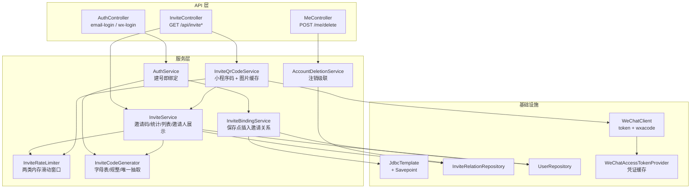
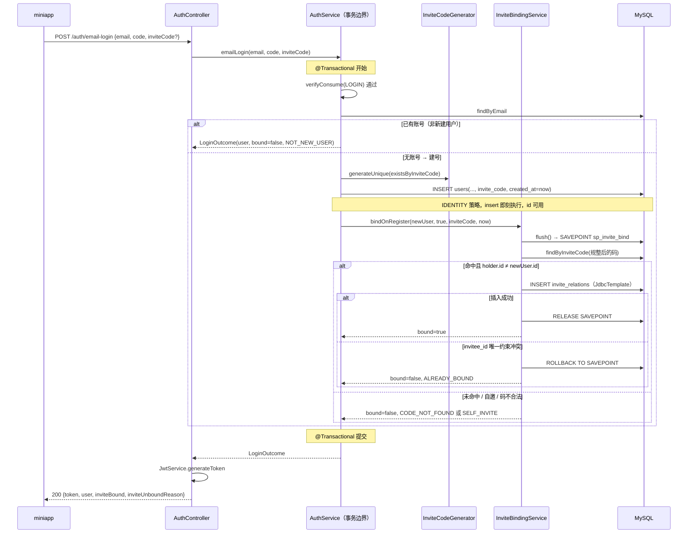
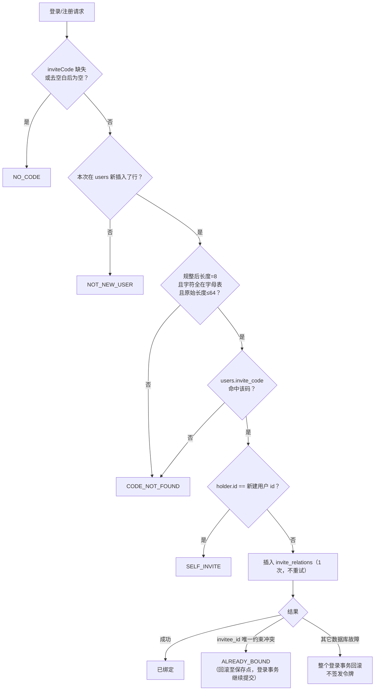
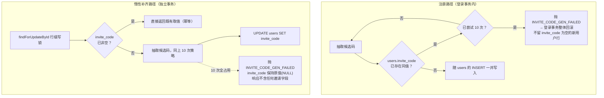
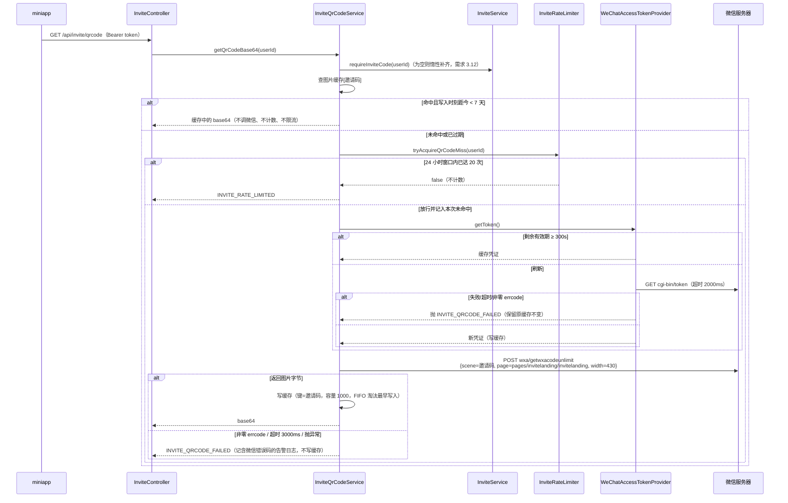
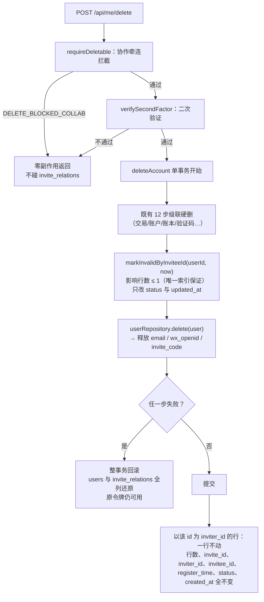
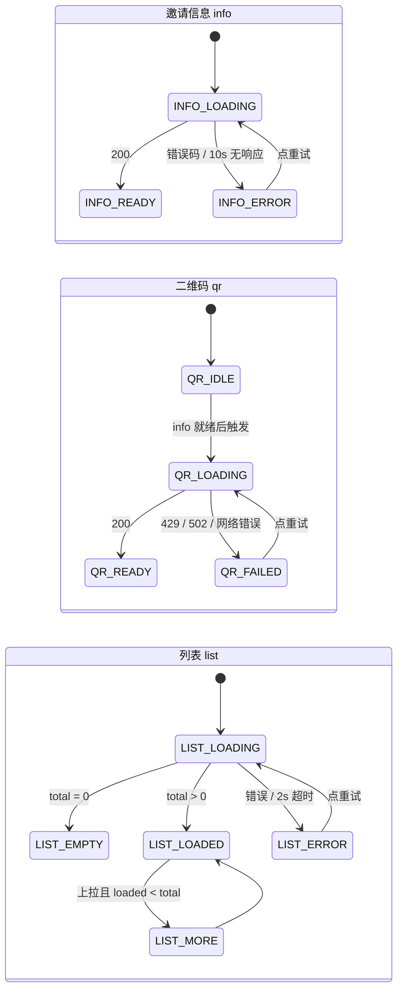
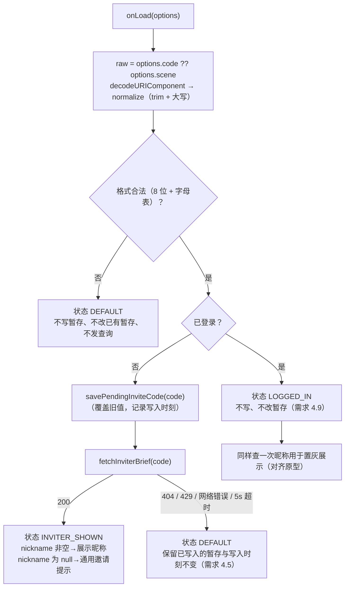

# Design Document

## Overview

本设计为有余新增**用户邀请系统**：给每个用户一个终身不变的 8 位个人邀请码，由邀请码派生邀请链接
（小程序页面路径）与邀请二维码（微信小程序码），并在「新账号被创建的那一刻」把邀请关系写进
`invite_relations`。本期只统计不发奖。

服务端新增 5 个组件（`InviteCodeGenerator`、`InviteService`、`InviteBindingService`、
`InviteQrCodeService`、`InviteRateLimiter`）与 1 个控制器（`InviteController`），改造 3 处既有代码
（`AuthService` 建号路径、`AccountDeletionService` 注销路径、`WeChatClient` 新增两个微信接口），
新增 1 张表与 1 个列。前端新增 2 个页面、1 个 api 模块、1 个工具模块，并在「我的」页加一个入口。

### 设计不变式

- **绑定时机唯一**：邀请关系只在 `users` 表新插入一行的那一刻建立。老用户带码登录一律不绑定。
- **一个 invitee 至多一条关系**：由 `uk_invite_relations_invitee` 唯一索引在数据库层保证，应用层不做「先查后插」兜底。
- **邀请码问题绝不阻断注册**：缺失 / 畸形 / 超长 / 查不到 / 自邀 / 已绑定，一律照常签发令牌，只在响应里说明未绑定原因。
- **邀请数据只追加 + 状态更新**：任何一方注销都不删除行；`status` 只描述被邀请人。
- **数据归属只认令牌用户 id**：邀请接口的数据范围硬性限定为 `inviter_id = 会话用户`，与邀请码取值无关。

### 关键设计决策与理由

| 决策 | 理由 | 代价 |
|------|------|------|
| **绑定时机唯一（只在建号那一刻）** | 从根上消除 A→B / B→A 互邀刷量与改绑争议：既然只有"新账号出生"这一个写入点，就不存在「后来改主意换邀请人」的语义空间，统计口径无歧义 | 老用户扫码带不上邀请关系，增长活动无法追溯存量用户；`SELF_INVITE`/`ALREADY_BOUND` 两条分支实际近乎不可达（见「风险与权衡」） |
| **邀请码问题不阻断注册主路径** | 邀请是增长功能，登录是生命线。任何把邀请码校验做成登录前置条件的设计，都会把增长功能的故障放大成"用户登不进来" | 客户端拿不到"为什么没绑上"的强提示，只能靠响应中的 `inviteUnboundReason` 静默上报 |
| **注销不删除任何邀请关系行，因而不建外键** | 邀请关系是增长对账用的历史事实，"谁带来谁"不因为某一方注销而消失。要保留悬空 id，就必须放弃 `users(id)` 外键 | 失去外键兜底，脏数据无数据库层防线；需应用层校验 + 后台对账（见「风险与权衡」1） |
| **邀请链接 = 小程序页面路径** | 微信外的普通 HTTP 链接无法直达小程序。可选方案 URL Link / H5 中转页都要额外域名、备案与接口额度，收益只是"能在微信外点开" | 链接只能用于分享卡片 `path` 与小程序码 `page`，不能贴到浏览器 |
| **二维码用小程序码 + 只做内存缓存** | `wxacode.getUnlimited` 的 `scene` 正好承载 8 位邀请码，扫码可直达落地页；项目当前无对象存储，落盘会引入部署期文件生命周期问题 | 重启即冷启动、多实例各自缓存、堆内存占用需要设上限（见「风险与权衡」3） |
| **唯一约束冲突走事务保存点** | 既要满足"唯一性由数据库保证"，又要满足"冲突不能连坐登录事务"。保存点是同一事务内实现局部回滚的唯一手段 | 实现受约束：插入必须绕开 Hibernate 且异常不得穿出任何 `@Transactional` 代理（见「核心流程」2） |

## Architecture

### 组件划分与依赖



### 与既有代码的集成点

| 既有组件 | 改动 | 说明 |
|----------|------|------|
| `AuthService.emailLogin` / `wxLogin` | 签名新增 `inviteCode` 入参；建号时写 `invite_code`；返回 `LoginOutcome`（用户 + 绑定结果） | 建号与绑定必须在**同一个** `@Transactional` 边界内（需求 5.2） |
| `AuthController` | `EmailLoginRequest` / `WxLoginRequest` 新增 `inviteCode`；`LoginResponse` 新增 `inviteBound` / `inviteUnboundReason` | 老客户端不传 `inviteCode` 时按 `NO_CODE` 处理，向后兼容 |
| `AccountDeletionService.deleteAccount` | 在 `userRepository.delete(user)` **之前**插入一步：把以该用户为 `invitee_id` 的行置 `INVALID`；`inviter_id` 行一行不动 | 需新增注入 `Clock` 与 `InviteRelationRepository`（需求 10.2、10.3） |
| `WeChatClient` | 新增 `getAccessToken()`（`cgi-bin/token`，超时 2000ms）与 `getUnlimitedQrCode(scene, page, width)`（`wxa/getwxacodeunlimit`，超时 3000ms） | 凭证缓存收敛到 `WeChatAccessTokenProvider`，全项目唯一入口（见「风险与权衡」4） |
| `LedgerService.generateUniqueCode` | 委托给新的 `InviteCodeGenerator`（同一字母表 / 同一 10 次重试策略） | 纯重构，账本邀请码行为不变；两套邀请机制仍彼此独立 |
| `SecurityConfig` | `GET /api/invite/inviter` 显式 `permitAll`（须置于 `/api/invite/**` 规则之前）；其余 `/api/invite/**` 需令牌 | 需求 8.1、8.4 |
| `deploy/reset-db.sql` | `TRUNCATE TABLE users` 之前加 `TRUNCATE TABLE invite_relations` | 需求 9.14 |

### 分层职责边界

- **`InviteCodeGenerator`**（无状态组件）：字母表常量、`normalize`（trim + 大写）、`isWellFormed`、
  `generateUnique(Predicate<String> occupied)`（SecureRandom 逐字符抽取，最多 10 次）。是"邀请码是什么"的唯一定义处。
- **`InviteBindingService`**：只做一件事——在既有事务内尝试插入 1 条邀请关系并返回绑定结果。
  标注 `@Transactional(propagation = MANDATORY)`，**所有异常在方法内消化**，绝不穿出代理边界。
- **`InviteService`**：邀请码惰性补齐、邀请信息组装、被邀请人列表分页、邀请人展示信息公开查询。
- **`InviteQrCodeService`**：图片缓存判定 → 限流判定 → 取凭证 → 调小程序码接口 → 写缓存。
- **`InviteRateLimiter`**：两个互不相干的内存滑动窗口计数器（IP/60s、user/24h）。
- **`InviteController`**：只做参数解析与 DTO 组装，不含业务判定。

## Components and Interfaces

### 服务接口

**`InviteCodeGenerator`**

```java
@Component
public class InviteCodeGenerator {
    public static final String ALPHABET = "ABCDEFGHJKLMNPQRSTUVWXYZ23456789";
    public static final int LENGTH = 8;
    private static final int MAX_ATTEMPTS = 10;

    /** trim + 转大写；null 视作空串。 */
    public String normalize(String raw);

    /** 规整后长度恰为 8 且每个字符属于字母表。 */
    public boolean isWellFormed(String normalized);

    /**
     * 用 SecureRandom 逐字符抽取候选码，以 occupied 判定占用，最多 10 次。
     * 10 次全被占用则抛 INVITE_CODE_GEN_FAILED，由调用方决定回滚还是降级。
     */
    public String generateUnique(Predicate<String> occupied);
}
```

**`InviteBindingService`**（登录事务内调用）

```java
public record InviteBindResult(boolean bound, UnboundReason reason) { }
public enum UnboundReason { NO_CODE, NOT_NEW_USER, CODE_NOT_FOUND, SELF_INVITE, ALREADY_BOUND }

@Service
public class InviteBindingService {
    /**
     * 必须在调用方的事务内执行（MANDATORY）。newUser 为 null 或 isNewUser=false 表示本次未建号。
     * now 与 newUser.createdAt 必须是同一个时刻取值（需求 5.8）。
     * 本方法不抛出任何异常：唯一约束冲突在内部经保存点消化为 ALREADY_BOUND。
     */
    @Transactional(propagation = Propagation.MANDATORY)
    public InviteBindResult bindOnRegister(User newUser, boolean isNewUser,
                                          String rawInviteCode, LocalDateTime now);
}
```

**`InviteService`**

```java
public record InviteInfoView(String inviteCode, String inviteLink, long invitedCount) { }
public record InviteeItemView(Long inviteId, String nickname,
                              LocalDateTime registerTime, String status) { }
public record InviteeListView(List<InviteeItemView> items, long total, long invitedCount) { }

@Service
public class InviteService {
    /** 邀请信息：惰性补齐邀请码 → 组装链接 → 统计已邀请人数（需求 1.3、1.10、2.1）。 */
    public InviteInfoView getInviteInfo(Long userId);

    /** 取当前用户邀请码，为空则惰性补齐并持久化。行级锁保证并发终态唯一（需求 1.12）。 */
    @Transactional
    public String requireInviteCode(Long userId);

    /** 被邀请人列表：参数校验 → 分页查询 → 批量补昵称（需求 7）。 */
    public InviteeListView listInvitees(Long userId, Integer page, Integer size);

    /** 公开查询邀请人昵称：限流 → 规整 → 校验 → 查库；三种失败同为 NOT_FOUND（需求 4.2、8.9）。 */
    public String findInviterNickname(String rawCode, String clientIp);

    /** 拼接邀请链接：/pages/invitelanding/invitelanding?code={邀请码}（需求 2.1）。 */
    public static String buildInviteLink(String inviteCode);
}
```

**`InviteQrCodeService`**

```java
@Service
public class InviteQrCodeService {
    /**
     * 返回不含 data URI 前缀的 PNG base64（需求 3.1）。
     * 顺序刻意固定：邀请码惰性补齐 → 缓存命中判定 → 限流判定 → 凭证 → 小程序码 → 写缓存。
     */
    public String getQrCodeBase64(Long userId);
}
```

**`InviteRateLimiter`**

```java
@Component
public class InviteRateLimiter {
    /** 邀请人展示信息查询：同一 IP，60 秒窗口，30 次。达上限返回 false 且不计数。 */
    public boolean tryAcquireInviterLookup(String ip);

    /** 邀请二维码未命中缓存：同一 userId，24 小时窗口，20 次。达上限返回 false 且不计数。 */
    public boolean tryAcquireQrCodeMiss(Long userId);
}
```

### 领域实体与仓储

**`InviteRelation`**（新）—— `inviter_id` / `invitee_id` 刻意声明为裸 `Long` 而非 `@ManyToOne User`：

- 这两个 id **可能是悬空 id**（指向已删除的 `users` 行）。若映射成关联实体，读取一条邀请人已注销的
  关系时 Hibernate 会因找不到目标行而抛 `EntityNotFoundException`，把"历史留痕"这个核心语义直接打断。
- 表上没有外键，映射成关联实体会诱导 `ddl-auto` 与后续开发者补外键，与需求 9.5/9.6 冲突。
- 被邀请人昵称由服务层单独批量查询后 `null`-安全地填充，见下文。

```java
@Entity
@Table(name = "invite_relations")
public class InviteRelation {
    @Id @GeneratedValue(strategy = GenerationType.IDENTITY)
    @Column(name = "invite_id") private Long inviteId;
    @Column(name = "inviter_id", nullable = false) private Long inviterId;   // 裸 id，可能悬空
    @Column(name = "invitee_id", nullable = false) private Long inviteeId;   // 裸 id，可能悬空
    @Column(name = "register_time", nullable = false) private LocalDateTime registerTime;
    @Enumerated(EnumType.STRING)
    @Column(name = "status", nullable = false, length = 16) private InviteStatus status;
    @Column(name = "created_at", nullable = false) private LocalDateTime createdAt;
    @Column(name = "updated_at", nullable = false) private LocalDateTime updatedAt;
}

public enum InviteStatus { REGISTERED, INVALID }   // 名称即库中取值，与 CHECK 约束一致
```

**`User`（改）**：新增 `@Column(name = "invite_code", length = 8, unique = true) private String inviteCode;`

**`InviteRelationRepository`（新）**

```java
long countByInviterId(Long inviterId);                                 // 邀请关系总条数（需求 7.5）
long countByInviterIdAndStatus(Long inviterId, InviteStatus status);   // 已邀请人数（需求 7.6）
Page<InviteRelation> findByInviterId(Long inviterId, Pageable pageable); // 排序由 Pageable 指定
Optional<InviteRelation> findByInviteeId(Long inviteeId);

/** 注销时把被邀请人关系置 INVALID；唯一索引保证影响行数 ≤ 1（需求 10.2）。 */
@Modifying
@Query("update InviteRelation r set r.status = 'INVALID', r.updatedAt = :now where r.inviteeId = :inviteeId")
int markInvalidByInviteeId(@Param("inviteeId") Long inviteeId, @Param("now") LocalDateTime now);
```

**`UserRepository`（增）**

```java
Optional<User> findByInviteCode(String inviteCode);
boolean existsByInviteCode(String inviteCode);

/** 惰性补齐时按行加锁，避免同一用户并发生成两个码（需求 1.12）。 */
@Lock(LockModeType.PESSIMISTIC_WRITE)
@Query("select u from User u where u.id = :id")
Optional<User> findForUpdateById(@Param("id") Long id);
```

**被邀请人昵称的取法**：`listInvitees` 先取当前页的 `inviteeId` 集合，再 `userRepository.findAllById(ids)`
建 `id → nickname` 映射；映射中缺失（已注销）或昵称为空白，一律以 `null` 填充（需求 7.7、10.8）。
单页最多 50 条，一次批量查询，无 N+1。

### 微信接口封装

```java
/** 微信凭证提供者：全项目唯一的 access_token 获取与缓存入口。 */
@Component
public class WeChatAccessTokenProvider {
    private record Cached(String token, long expiresAtMillis) { }
    private volatile Cached cached;                 // 单值缓存
    private final ReentrantLock refreshLock = new ReentrantLock();

    /**
     * 剩余有效期 ≥ 300 秒直接返回缓存；否则加锁刷新（双重检查，避免并发刷新风暴）。
     * 刷新失败抛 INVITE_QRCODE_FAILED，且保留原缓存值与到期时刻不变（需求 3.5、3.14）。
     */
    public String getToken();
}
```

`WeChatClient` 新增两个方法，配置缺失（appid/secret 去空白为空）时**先于任何网络调用**抛
`INVITE_QRCODE_FAILED`（需求 3.6）：

```java
String fetchAccessToken();                                        // GET cgi-bin/token，超时 2000ms
byte[] fetchUnlimitedQrCode(String token, String scene, String page, int width); // POST wxa/getwxacodeunlimit，超时 3000ms
```

`wxa/getwxacodeunlimit` 成功时返回图片字节流、失败时返回 JSON 且 HTTP 仍为 200。判定规则：响应
`Content-Type` 以 `image/` 开头 → 图片；否则按 JSON 解析 `errcode`/`errmsg`，记一条含微信错误码的
告警日志后抛 `INVITE_QRCODE_FAILED`（需求 3.7）。为兜底畸形响应，同时检查首字节是否为 `{`。

**`WeChatQrCodeGateway`（实现期新增，任务 4.3）**——「取凭证 → 调小程序码接口 → `40001` 强制刷新并重试一次」
封成一次调用：

```java
byte[] fetchQrCode(String scene, String page, int width);   // 内部可能打两次微信，但属同一次业务请求
```

- 放这一层是因为重试同时需要 `WeChatAccessTokenProvider` 与 `WeChatClient`：塞进凭证提供者会让它反向
  依赖具体用途（将来订阅消息、内容安全同样要用它），塞进客户端会让无状态协议层持有凭证缓存，
  塞进 `InviteQrCodeService` 会把「限流额度」与「微信重试」搅在一起。
- **额度契约**：`InviteQrCodeService`（任务 5.9）在一次未命中缓存的请求里只调 `fetchQrCode` 一次、
  只扣 1 次额度；网关内部的重试**不额外扣额度**（需求 3.9）。
- 只对 `40001` 重试、且只重试一次：其余错误码重试只会白耗微信额度；`40001` 反复出现说明有别的进程
  在持续踢掉凭证，继续重试会变成刷新风暴并撞穿需求 3.10 的 5000ms 预算。
- `40001` 与 `45009` 各记一条带固定前缀 `[WECHAT_ERRCODE_SIGNAL]` 的日志，作为多实例凭证/额度失控的
  监控信号（前者 ERROR 仅在重试后仍失败时记，避免同一请求两条同义告警）。

### 二维码内存缓存

```java
/** 键=邀请码，值=(base64, 写入时刻)。容量 1000，超出淘汰写入时刻最早项，TTL 7 天。 */
private final Map<String, CachedImage> cache = Collections.synchronizedMap(
        new LinkedHashMap<>(128, 0.75f, /* accessOrder */ false) {
            @Override protected boolean removeEldestEntry(Map.Entry<String, CachedImage> e) {
                return size() > MAX_ENTRIES;   // MAX_ENTRIES = 1000
            }
        });
```

- `accessOrder = false`（插入顺序）配合 `removeEldestEntry`，得到的是**按写入时刻 FIFO 淘汰**，
  正是需求 3.13 要求的语义（不是访问序 LRU：读取命中不应把冷门邀请码顶到队尾）。
- TTL 过期项在读取时判定并当作未命中，随后被新值覆盖（`put` 同键会保留原插入位置，因此过期刷新时
  先 `remove` 再 `put`，使其重新排到队尾）。
- 不写磁盘（需求 3.13）。容量与堆占用的权衡见「风险与权衡」3。

### 前端模块

- `api/invite.js`：4 个方法，全部带 `noLedger: true`（邀请数据与账本无关，不发 `X-Ledger-Id`）。
- `utils/invite.js`：字母表正则、`normalizeInviteCode`、待绑定邀请码的存 / 取 / 清与 7 天判定、`buildInviteLink`。
- `pages/invite/invite.vue`、`pages/invitelanding/invitelanding.vue`：详见「前端设计」。
- `stores/auth.js`：两个登录方法携带待绑定邀请码，成功后清除暂存。

## Data Models

### `users`（新增 1 列）

| 列 | 类型 | 说明 |
|----|------|------|
| `invite_code` | VARCHAR(8) NULL | 个人邀请码，8 位，全局唯一，终身不变；存量用户迁移后为 NULL，首次请求邀请信息时惰性补齐 |

具名唯一约束 `uk_users_invite_code`。因 `users` 表排序规则为 `utf8mb4_unicode_ci`（大小写不敏感），
该唯一约束会把仅大小写不同的两个邀请码判为重复（需求 9.1）——由于系统始终以大写存取，这只是额外的
安全边界，不影响正常写入。多行 NULL 不冲突（MySQL 唯一索引允许重复 NULL）。

### `invite_relations`（新表）

| 列 | 类型 | 说明 |
|----|------|------|
| `invite_id` | BIGINT NOT NULL AUTO_INCREMENT | 主键 |
| `inviter_id` | BIGINT NOT NULL | 邀请人用户 id；**无外键**，注销后成为悬空 id，行仍保留 |
| `invitee_id` | BIGINT NOT NULL | 被邀请人用户 id；**无外键**，具名唯一约束 `uk_invite_relations_invitee` |
| `register_time` | DATETIME NOT NULL（无缺省值） | 被邀请人注册时刻，与其 `users.created_at` 严格相等 |
| `status` | VARCHAR(16) NOT NULL DEFAULT 'REGISTERED' | `REGISTERED` / `INVALID`，**仅描述被邀请人** |
| `created_at` | DATETIME NOT NULL | 创建时刻 |
| `updated_at` | DATETIME NOT NULL | 更新时刻；创建时与 `created_at` 相等 |

索引与约束：主键 `invite_id`；唯一 `uk_invite_relations_invitee (invitee_id)`；非唯一复合
`idx_invite_relations_inviter_time (inviter_id, register_time)`（支撑"邀请人按注册时间倒序翻页"）；
CHECK `ck_invite_relations_status`。**全表无任何外键**。

### 迁移脚本

**版本号选取规则**（需求 9.10、9.16）：取满足「大于目录内全部已存在版本号，且该版本号尚未被任何
迁移文件或其它 spec 预占」的最小值。当前 `src/main/resources/db/migration` 最大版本号为 **29**，
`V30` 已被 user-feedback-system spec 预占（`V30__feedback.sql`），故本 spec 取
**`V31__user_invite.sql`**。实现任务开始时需重新核对目录，若届时 V30/V31 的占用情况有变，按同一
规则重算，且不修改、不重命名任何已存在的迁移文件。

DDL 草案（对齐 `V27__loan_repayments.sql` 的中文注释 / 引擎 / 排序规则写法）：

```sql
-- ============================================================================
-- 有余(youyu) 用户邀请系统：users.invite_code + invite_relations 邀请关系历史表
--
-- 邀请码：8 位，字母表 ABCDEFGHJKLMNPQRSTUVWXYZ23456789（剔除易混 I/O/0/1），
--   注册时生成，存量用户首次进邀请页惰性补齐，之后终身不变，随 users 行删除而释放。
-- 邀请关系：只在「新账号被创建的那一刻」写入，一次写定不可改绑。
--   刻意不建任何指向 users(id) 的外键：任一方注销都保留该行（悬空 id），
--   保住「谁带来谁」这条增长链路，代价是插入前需在应用层校验 inviter 存在。
-- status 仅描述被邀请人：REGISTERED（在册）/ INVALID（已注销）；邀请人注销不改任何行。
-- 本脚本不回填存量用户的 invite_code（迁移后一律为 NULL）。
-- ============================================================================
ALTER TABLE users
    ADD COLUMN invite_code VARCHAR(8)
        CHARACTER SET utf8mb4 COLLATE utf8mb4_unicode_ci NULL
        COMMENT '个人邀请码,8位,全局唯一,终身不变' AFTER nickname,
    ADD CONSTRAINT uk_users_invite_code UNIQUE (invite_code);

CREATE TABLE invite_relations (
    invite_id     BIGINT      NOT NULL AUTO_INCREMENT COMMENT '邀请关系主键',
    inviter_id    BIGINT      NOT NULL COMMENT '邀请人用户id,无外键,注销后为悬空id',
    invitee_id    BIGINT      NOT NULL COMMENT '被邀请人用户id,无外键,至多一条关系',
    register_time DATETIME    NOT NULL COMMENT '被邀请人注册时刻,等于其users.created_at',
    status        VARCHAR(16) NOT NULL DEFAULT 'REGISTERED' COMMENT '关系状态:REGISTERED在册/INVALID被邀请人已注销',
    created_at    DATETIME    NOT NULL COMMENT '创建时间',
    updated_at    DATETIME    NOT NULL COMMENT '更新时间',
    PRIMARY KEY (invite_id),
    UNIQUE KEY uk_invite_relations_invitee (invitee_id),
    KEY idx_invite_relations_inviter_time (inviter_id, register_time),
    CONSTRAINT ck_invite_relations_status
        CHECK (status COLLATE utf8mb4_bin IN ('REGISTERED', 'INVALID'))
) ENGINE = InnoDB
  DEFAULT CHARSET = utf8mb4
  COLLATE = utf8mb4_unicode_ci
  COMMENT = '用户邀请关系(只追加+状态更新的历史表,无外键)';
```

**CHECK 约束的大小写陷阱**：表排序规则 `utf8mb4_unicode_ci` 大小写不敏感，若直接写
`CHECK (status IN ('REGISTERED','INVALID'))`，则 `'registered'` 也会通过，违背需求 9.7 的
"区分大小写"。故在表达式内显式 `COLLATE utf8mb4_bin`。实现任务需在目标 MySQL 版本上实测该表达式
被接受；若被拒，退化方案是把该列声明为 `CHARACTER SET utf8mb4 COLLATE utf8mb4_bin`（列级覆盖，
表默认排序规则不变），并在设计文档补记该偏差。

> **实测结论（任务 1.5，MySQL 8.0.45，一次性本地容器 `mysql:8.0`，全量迁移 V1→V31 顺序执行）**：
> 表达式内 `COLLATE utf8mb4_bin` 的写法**被接受**，无需退化方案，`V31__user_invite.sql` 与上方 DDL
> 草案保持一致。`information_schema.CHECK_CONSTRAINTS.CHECK_CLAUSE` 落库为
> ``((`status` collate utf8mb4_bin) in (_latin1'REGISTERED',_latin1'INVALID'))``（含 `utf8mb4_bin`，
> 满足任务 1.4 的对应断言），列 `status` 的 `COLLATION_NAME` 仍为 `utf8mb4_unicode_ci`、
> 表 `TABLE_COLLATION` 仍为 `utf8mb4_unicode_ci`。行为断言：`'REGISTERED'`/`'INVALID'` 插入成功；
> `'registered'`/`'Invalid'`/`'FOO'` 三者均以 `ERROR 3819 (Check constraint ... is violated)` 被拒，
> 被拒后 `invite_relations` 行数与全部列取值逐行不变；附带确认 `UPDATE ... SET status='registered'`
> 同样被拒、以及省略 `status` 时缺省值 `'REGISTERED'` 可正常写入。

**`deploy/reset-db.sql`**：在 `TRUNCATE TABLE users` 之前加一行 `TRUNCATE TABLE invite_relations;`。
该表无外键，清空不依赖 `FOREIGN_KEY_CHECKS` 取值；脚本仍不含任何针对 `flyway_schema_history` 的语句。

## 接口设计

统一前缀 `/api`，统一错误体 `{code, message, field}`（沿用 `GlobalExceptionHandler`）。

### 1. 邀请信息 `GET /api/invite`（需令牌）

响应 200 —— 字段是且仅是三个（需求 1.10）：

| 字段 | 类型 | 说明 |
|------|------|------|
| `inviteCode` | string(8) | 当前用户 `users.invite_code`，为空时已惰性补齐 |
| `inviteLink` | string | `/pages/invitelanding/invitelanding?code={inviteCode}` |
| `invitedCount` | number(long, ≥0) | `inviter_id = 会话用户` 且 `status = REGISTERED` 的行数 |

错误：`UNAUTHENTICATED`(401)、`INVITE_CODE_GEN_FAILED`(500，响应不含上表任何字段值)。

### 2. 邀请二维码 `GET /api/invite/qrcode`（需令牌）

响应 200：`{ "imageBase64": "iVBORw0KG..." }`（不含 `data:image/png;base64,` 前缀）。

错误：`UNAUTHENTICATED`(401)、`INVITE_RATE_LIMITED`(429)、`INVITE_QRCODE_FAILED`(502)、
`INVITE_CODE_GEN_FAILED`(500)。

### 3. 被邀请人列表 `GET /api/invite/invitees?page=0&size=20`（需令牌）

查询参数：`page`（整数 0–100000，缺省 0）、`size`（整数 1–50，缺省 20）。

响应 200：

| 字段 | 类型 | 说明 |
|------|------|------|
| `items[].inviteId` | number | 邀请关系主键 |
| `items[].nickname` | string \| null | 被邀请人昵称；为空白或已注销一律 `null`，不用占位文本 |
| `items[].registerTime` | string(datetime) | 注册时刻 |
| `items[].status` | string | `REGISTERED` \| `INVALID` |
| `total` | number | 邀请关系总条数（含 INVALID），不受分页影响 |
| `invitedCount` | number | 已邀请人数（仅 REGISTERED） |

排序：`register_time` 倒序，相同则 `invite_id` 倒序。
错误：`UNAUTHENTICATED`(401)、`INVITE_PAGE_PARAM_INVALID`(400，`field` 为 `page` 或 `size`，
响应不含任何列表项与计数值)。

### 4. 邀请人展示信息 `GET /api/invite/inviter?code=K7M2Q9XT`（**公开**，无需令牌）

响应 200：`{ "nickname": "小林同学" }`；昵称为 NULL 或去空白后为空时 `nickname` 为 `null`。
成功响应有且仅有这一个字段——不含邀请人 `id`/`email`/`wx_openid`/`plan`/`role`，也不含任何
已邀请人数、注册时刻或账号状态（需求 8.5）。

错误：`NOT_FOUND`(404)、`INVITE_RATE_LIMITED`(429)。
格式非法、含非法字符、邀请码不存在**三种情形返回完全相同的 `NOT_FOUND` 与相同字段集**（需求 8.9）。
携带无效或过期令牌时忽略该令牌、按公开请求处理，不返回 `UNAUTHENTICATED`（需求 8.4）。

### 5. 两个登录接口（入参与响应扩展，公开端点）

`POST /api/auth/email-login`、`POST /api/auth/wx-login` 请求体新增可选字段：

| 字段 | 类型 | 说明 |
|------|------|------|
| `inviteCode` | string \| null，长度上限 64 | 待绑定邀请码；缺失 / null / 去空白为空一律按未携带处理 |

响应体新增两个字段：

| 字段 | 类型 | 说明 |
|------|------|------|
| `inviteBound` | boolean | 本次是否建立了邀请关系，恰好 1 个标识 |
| `inviteUnboundReason` | string \| null | `inviteBound=true` 时为 `null`；否则取 `NO_CODE`/`NOT_NEW_USER`/`CODE_NOT_FOUND`/`SELF_INVITE`/`ALREADY_BOUND` 之一 |

原有 `token` / `tokenType` / `user` 字段与语义不变，老客户端可忽略新字段。

### 错误码汇总

| 错误码 | HTTP | 触发条件 |
|--------|------|----------|
| `INVITE_CODE_GEN_FAILED` | 500 | 连续 10 次抽取的候选邀请码均被占用 |
| `INVITE_QRCODE_FAILED` | 502 | 微信配置缺失、凭证获取失败、小程序码接口非零错误码 / 超时 / 抛异常 |
| `INVITE_RATE_LIMITED` | 429 | IP 60 秒窗口超 30 次；或用户 24 小时未命中缓存超 20 次 |
| `INVITE_PAGE_PARAM_INVALID` | 400 | `page`/`size` 不可解析或越界 |
| `NOT_FOUND` | 404 | 邀请人展示信息查询的三种失败情形（复用既有错误码） |
| `UNAUTHENTICATED` | 401 | 三个受保护接口缺少 / 无效 / 过期令牌，或令牌用户已不存在 |

## 核心流程

### 1. 注册时绑定邀请关系（含未绑定原因判定链）



判定链的固定优先级（需求 5.11、6.10）——按下列顺序取**首个成立**者，实现上就是自上而下的早返回：



要点：

- **`NOT_NEW_USER` 优先于格式校验**：老用户带一个畸形码登录，原因是 `NOT_NEW_USER` 而非
  `CODE_NOT_FOUND`（需求 5.3、6.6）。这也是"重复登录第 2 次及以后为 `NOT_NEW_USER`"的由来。
- **格式非法与查不到合并为 `CODE_NOT_FOUND`**（需求 5.6）：对客户端而言这两者都只意味着"这个码没用"，
  没必要区分；也避免把内部校验细节暴露成可枚举信号。
- **`inviter_id` 存在性校验**（需求 9.19）：由 `findByInviteCode` 在同一事务内完成——查得到行就说明
  用户存在。这正是替代外键的应用层防线，故绝不允许用"缓存的码→id 映射"跳过这次查询。
- **最多 1 次插入尝试，失败不重试**（需求 5.12）。

### 2. 唯一约束冲突的保存点处理（本设计最关键的技术点）

需要在**同一个** Spring 事务内做到：插入邀请关系失败（仅唯一约束冲突）时只回滚这一条语句，
新建用户的 `users` 行与其 `invite_code` 照常提交、令牌照常签发。

#### 为什么不能用直觉方案

| 方案 | 为什么不可行 |
|------|--------------|
| `inviteRelationRepository.save()` + catch `DataIntegrityViolationException` | 冲突发生在 Hibernate **flush** 时。JPA 规范规定 `flush()` 抛异常即把事务标记为回滚；此后持久化上下文已污染（失败的实体仍在上下文里，任何后续 flush 会重放该插入），继续提交会得到 `RollbackException`/`UnexpectedRollbackException` |
| 把插入放进内层 `@Transactional`（REQUIRED）并让异常穿出 | Spring 的事务切面在异常穿出被通知方法时把**参与中的同一物理事务**标记 rollback-only，外层提交时抛 `UnexpectedRollbackException`，整个登录一起挂掉 |
| 内层 `@Transactional(REQUIRES_NEW)` | 会开一个独立物理事务：邀请关系先提交、登录事务后回滚时留下指向不存在用户的孤儿行，且违背需求 5.2 的"同一事务" |
| `TransactionTemplate` + `PROPAGATION_NESTED` | `JpaTransactionManager` 默认不支持嵌套事务（`nestedTransactionAllowed=false`）；即使打开，回滚到保存点也**不会**清理 Hibernate 持久化上下文，同样留下污染 |

#### 采用方案：绕开 Hibernate 的 JDBC 保存点

核心思路是：**让失败的语句从不经过 EntityManager**，冲突就只是一次普通的 JDBC 错误，
既不会污染 Hibernate 会话，也不会触发 Spring 的 rollback-only 标记。

```java
@Transactional(propagation = Propagation.MANDATORY)
public InviteBindResult bindOnRegister(User newUser, boolean isNewUser,
                                       String rawCode, LocalDateTime now) {
    // …前置判定链（NO_CODE / NOT_NEW_USER / CODE_NOT_FOUND / SELF_INVITE）省略，均直接返回…

    // 关键 1：先 flush，把 users 的 INSERT（及一切待办语句）落到连接上，
    //        保证保存点之后只剩「插入邀请关系」这一条语句可回滚。
    entityManager.flush();

    Connection conn = DataSourceUtils.getConnection(dataSource); // 事务绑定的同一连接
    Savepoint sp = null;
    try {
        sp = conn.setSavepoint("sp_invite_bind");
        jdbcTemplate.update(INSERT_SQL,
                inviter.getId(), newUser.getId(), now, "REGISTERED", now, now);
        conn.releaseSavepoint(sp);                 // 成功：释放（MySQL 支持 RELEASE SAVEPOINT）
        return InviteBindResult.bound();
    } catch (DuplicateKeyException dup) {
        // 关键 2：只回滚到保存点，事务继续存活，随后照常提交登录。
        conn.rollback(sp);
        log.info("邀请关系已存在，本次以 ALREADY_BOUND 完成登录：inviteeId={}", newUser.getId());
        return InviteBindResult.unbound(ALREADY_BOUND);
    } catch (SQLException e) {
        // 保存点自身操作失败：按「唯一约束冲突以外的数据库故障」处理，让整个登录事务回滚（需求 5.7）。
        throw new IllegalStateException("邀请关系保存点操作失败", e);
    } finally {
        DataSourceUtils.releaseConnection(conn, dataSource); // 事务绑定连接下为 no-op
    }
}
```

关于可行性与陷阱的逐条说明：

1. **MySQL / InnoDB 支持 `SAVEPOINT` / `ROLLBACK TO SAVEPOINT` / `RELEASE SAVEPOINT`**，且
   `ROLLBACK TO SAVEPOINT` 回滚保存点之后的行变更而不终止事务。需要注意 InnoDB 在回滚到保存点时
   **不释放**保存点之后获得的行锁，这些锁要到事务结束才释放（见
   [MySQL SAVEPOINT 文档](https://dev.mysql.com/doc/refman/en/savepoint.html)，内容经改写以符合许可要求）。
   本设计里回滚后紧接着就提交，锁的额外持有时间可忽略。
2. **异常类型**：`JdbcTemplate` 会用 `SQLExceptionTranslator` 把 MySQL 1062（`ER_DUP_ENTRY`）翻译成
   `DuplicateKeyException`（`DataIntegrityViolationException` 子类）。H2 在 `MODE=MySQL` 下同样翻译为
   `DuplicateKeyException`，因此该分支在现有 H2 集成测试基建上可被真实覆盖。捕获时**只捕
   `DuplicateKeyException`**，不要捕更宽的 `DataIntegrityViolationException`——否则 CHECK 约束违例、
   非空违例这类真实缺陷会被静默吞掉，违背需求 5.7。
3. **不得让异常穿出代理边界**：`bindOnRegister` 用 `MANDATORY` 复用调用方事务，且把
   `DuplicateKeyException` 在方法体内消化。Spring 只在异常**穿出**被通知方法时标记 rollback-only，
   因此内部消化不会影响外层提交。这条约束必须写进代码注释并由测试锁死（见「测试策略」）。
4. **不得把插入改回 `repository.save()`**：一旦改回，冲突会在 flush 时爆发，前述污染问题立刻复现。
   代码注释需明确写出这条禁令与原因。
5. **`entityManager.flush()` 的必要性**：`users` 用 IDENTITY 主键，`save()` 时 INSERT 已经发出，
   理论上无需再 flush。但显式 flush 是廉价的保险：它保证保存点建立时连接上没有任何"待发"语句会被
   后续 `rollback(sp)` 一起撤销。
6. **保存点后不要再触发 Hibernate 自动 flush**：`bindOnRegister` 内部除 `findByInviteCode`（在保存点
   **之前**执行）外不做任何 JPA 读写。查询会触发自动 flush，若放在保存点之后，等于把 Hibernate 的
   语句拉进保存点范围，回滚时可能撤销掉本该保留的写入。
7. **可观测性**：`ALREADY_BOUND` 分支记 INFO 级日志（不是 WARN——它是被显式建模的正常结果），
   便于事后核对该分支是否真的近乎不可达（见「风险与权衡」6）。

### 3. 邀请码生成与惰性补齐



并发下终态唯一的两道保证：

- **同一用户并发补齐**（需求 1.12）：`findForUpdateById` 取行级写锁把两个请求串行化，后到者进入临界区时
  已能读到非空取值，直接返回同一个码。终态恰好一个非空取值，两个响应中的邀请码相同。
- **不同用户抽到同一候选码**（需求 1.5、9.1）：`existsByInviteCode` 只是概率优化，真正的终态唯一由
  `uk_users_invite_code` 保证。极小概率的竞态会让 `users` 的 INSERT/UPDATE 触发唯一约束违例——
  该请求以登录失败 / 补齐失败结束且零副作用，客户端重试即可（32^8 ≈ 1.1×10¹² 的码空间下可忽略）。
- **注册路径 10 次全占用即回滚整个登录事务**（需求 1.7）：这是刻意选择——宁可让这次注册失败，
  也不接受"存在 `invite_code` 为空的新用户行"这种需要后续补偿的中间态。

### 4. 邀请二维码请求路径



**限流判定必须在缓存命中判定之后**（需求 3.9、8.8）：额度计的是"打到微信的次数"，不是"用户看二维码的
次数"。若把限流前置，一个只是反复打开邀请页的用户会被自己的缓存命中请求耗尽额度，属于纯误伤。
微信调用失败也计入额度（需求 3.7）——额度是对外部接口的保护，失败同样消耗了对方配额。

### 5. 注销流程中的邀请数据处理



顺序上的两个刻意选择：

- **先置 `INVALID`、再删 `users` 行**（需求 10.2、10.3）：虽然无外键，删除顺序在数据库层没有约束，
  但"先更新后删除"让这一步的语义与既有级联删除保持一致的"由外向内"节奏，也让失败时的回滚范围直观。
- **`inviter_id` 行完全不动**（需求 10.1）：注销的是邀请人时，其名下所有行的 `status` 一律不变——
  `status` 的语义被严格限定为"被邀请人的账号状态"，让邀请人注销污染这个字段会立刻破坏
  「总条数 − 已邀请人数 = INVALID 行数」这条统计恒等式。这些行此后不再能被任何已认证接口读出
  （该账号已无法登录，且接口数据范围只认令牌用户 id），仅供后台统计（需求 10.10）。
- **邀请码随 `users` 行删除而释放**（需求 10.4）：后续新用户可以重新抽到同一个码；因为归属判定用的是
  `inviter_id` 而非邀请码取值，历史行不会串到新持有者名下。

## 前端设计

### 页面注册（`pages.json`）

在 `pages` 数组追加两项（沿用既有写法，标题走 `navigationBarTitleText`；落地页用自定义导航以铺满品牌背景）：

```json
{ "path": "pages/invite/invite", "style": { "navigationBarTitleText": "邀请好友" } },
{ "path": "pages/invitelanding/invitelanding",
  "style": { "navigationBarTitleText": "有余邀请", "navigationStyle": "custom" } }
```

### `api/invite.js`

```js
import { http } from '../utils/request'

/** 邀请信息：邀请码 / 邀请链接 / 已邀请人数。GET /api/invite */
export function fetchInviteInfo() {
  return http.get('/invite', { noLedger: true })
}

/** 邀请二维码：{ imageBase64 }（无 data URI 前缀）。GET /api/invite/qrcode */
export function fetchInviteQrCode() {
  return http.get('/invite/qrcode', { noLedger: true })
}

/** 被邀请人列表：{ items, total, invitedCount }。GET /api/invite/invitees */
export function fetchInvitees(page = 0, size = 20) {
  return http.get(`/invite/invitees?page=${page}&size=${size}`, { noLedger: true })
}

/** 邀请人展示信息（公开）：{ nickname }。GET /api/invite/inviter?code= */
export function fetchInviterBrief(code) {
  return http.get(`/invite/inviter?code=${encodeURIComponent(code)}`,
                  { auth: false, noLedger: true })
}
```

### `utils/config.js` 与 `utils/invite.js`

`STORAGE_KEYS` 新增两个键（需求术语表指定取值，不可改名）：

```js
pendingInviteCode: 'youyu_pending_invite_code',
pendingInviteCodeAt: 'youyu_pending_invite_code_at'
```

`utils/invite.js` 集中放置邀请码的客户端规则，避免正则与 7 天常量散落到两个页面里：

```js
export const INVITE_CODE_RE = /^[ABCDEFGHJKLMNPQRSTUVWXYZ23456789]{8}$/
const PENDING_TTL_MS = 604800000 // 7 天

export function normalizeInviteCode(raw) { /* String(raw ?? '').trim().toUpperCase() */ }
export function isWellFormedInviteCode(code) { /* INVITE_CODE_RE.test(code) */ }
export function buildInviteLink(code) { /* `/pages/invitelanding/invitelanding?code=${code}` */ }

/** 写入待绑定邀请码 + 写入时刻（覆盖旧值）。存储异常吞掉并返回 false（需求 4.13）。 */
export function savePendingInviteCode(code) { }

/**
 * 取可用的待绑定邀请码：
 *  - 码为空 / 格式非法 → 清除并返回 ''
 *  - 写入时刻缺失 / 不可解析为数字 / 距今已满 7 天 → 清除并返回 ''（需求 4.7）
 *  - 否则返回该码（不清除，登录成功后才清）
 * 读取异常一律返回 ''，不抛出（需求 4.13）。
 */
export function takePendingInviteCode() { }

/** 登录/注册成功后清除码与写入时刻（需求 4.8）。 */
export function clearPendingInviteCode() { }
```

7 天判定用的是**客户端本地时刻**（需求术语表约定）：写入时 `Date.now()`，读取时
`Date.now() - at < PENDING_TTL_MS`。改过系统时间的设备可能提前失效或延后失效，这是刻意接受的
简化——服务端不参与该时效判定，也就不需要为增长功能引入时间同步。

### `stores/auth.js`

```js
async loginWithWeixin() {
  const code = await getWxLoginCode()
  const inviteCode = takePendingInviteCode()          // '' 表示不携带
  const res = await apiWxLogin(code, inviteCode)
  this.setSession(res.token, res.user)
  this.lastInviteBind = { bound: !!res.inviteBound, reason: res.inviteUnboundReason || null }
  clearPendingInviteCode()                             // 无论 bound 真假都清（需求 4.8）
  return res.user
}
```

`loginWithEmail(email, code)` 同构。三条约束：

- 清除动作只在**请求返回成功之后**执行；失败 / 网络错误 / 超时一律保留暂存，供重试时继续携带（需求 4.12）。
- `takePendingInviteCode()` 内部已完成 7 天与格式判定，store 不重复判定。
- `lastInviteBind` 只是留给后续增长运营做埋点 / 提示的落点，本期 UI 不据此展示任何东西
  （原型里登录成功后没有任何邀请相关提示）。

### `pages/invite/invite.vue`（邀请好友页）

职责：展示当前用户的邀请战绩、邀请码、二维码，并提供转发 / 复制 / 保存相册四个分享动作与被邀请人列表。

三条互相独立的状态机——刻意不做成一个整体 loading，因为二维码故障不应连坐邀请码与转发（需求 3.8）：



行为对齐原型的要点：

| 交互 | 实现 | 异常态降级（对齐原型） |
|------|------|------------------------|
| 首屏 | `onLoad` 并发发起 `fetchInviteInfo()` 与 `fetchInvitees(0, 20)`；info 成功后再取二维码 | info 失败 → 只显示失败文案 + 重试，**不展示邀请码 / 邀请链接 / 转发入口**（需求 2.8） |
| 邀请码 | 8 位大写等宽字体展示 | — |
| 复制邀请码 / 复制邀请链接 | `uni.setClipboardData`，内容为原文（无首尾空白、无附加文字），成功 toast 1500ms | 写入失败 → 失败文案，停留原页并继续展示码与链接文本供手动选取（需求 2.10） |
| 微信转发 | `onShareAppMessage` 返回 `{ title, path }`，`path = inviteLink`；标题含「有余」且 ≤30 字（如「我在用「有余」记账，一起来试试」共 17 字） | `inviteLink` 为空（info 未就绪）→ `path` 退化为不带 `code` 的 `/pages/invitelanding/invitelanding` + 提示"邀请码尚未就绪"（需求 2.9） |
| 二维码 | `imageBase64` 拼 `data:image/png;base64,` 后交给 `<image>` 渲染 | 失败 → 虚线占位框 + 「二维码暂时生成失败」+ 重试胶囊；文案下方标注"不影响转发与复制邀请码"（需求 3.8） |
| 保存到相册 | `getFileSystemManager().writeFile(base64 → 临时文件)` → `uni.saveImageToPhotosAlbum` | 拒绝授权 → 「需要相册权限才能保存」toast，停留原页，二维码 / 邀请码 / 链接展示不变（需求 3.11） |
| 战绩卡 | 主数字 = `invitedCount`；三栏细分 = `total` / `invitedCount` / `total - invitedCount` | 无关系时只显示 `0 人` + 「还没有好友通过你的邀请加入」 |
| 被邀请人列表 | 首屏 20 条，`onReachBottom` 追加 20 条；`loaded >= total` 停止请求；状态文案 `REGISTERED`→已注册、`INVALID`→已注销；昵称为 `null` → 灰色斜体「未设置昵称 / 昵称不可见」 | 列表失败 → 失败文案 + 重试，**保留已加载记录与已展示的邀请码 / 链接**（需求 7.12） |
| 空状态 | `total = 0` 时展示空状态卡与分享引导，**不渲染列表区域**（需求 7.14） | — |

### `pages/invitelanding/invitelanding.vue`（邀请落地页）

`onLoad(options)` 的判定顺序：



三个页面态与原型一一对应：

- **`INVITER_SHOWN`**：品牌区 + 邀请人卡片（「{昵称} 邀请你一起记账」）+ 黄底提示条
  「注册成功后自动记录这层邀请关系」+ 底部两个登录入口。
- **`DEFAULT`**（邀请码缺失 / 无效 / 查询失败）：品牌区 + 「欢迎使用有余」通用卡 + 同样的两个登录入口。
  刻意不显示任何错误：邀请码的任何问题都不该让一个想注册的人看到报错（需求 2.5、4.5、4.11）。
- **`LOGGED_IN`**：邀请人卡片置灰 + 「你已登录有余」说明 + 「回到首页」按钮 + 底部文案引导去
  「我的 → 邀请好友」生成自己的码；不写暂存，因此老用户点进来后再登录也不会绑定（需求 4.9）。

登录入口**仅**复用既有两种方式（微信一键、邮箱验证码登录/注册合一），不新增任何注册方式（需求 4.10）。
实现上直接调用 `authStore.loginWithWeixin()` / `loginWithEmail()`，邀请码的携带对页面透明。

### 「我的」页入口

`pages/me/me.vue` 的分组列表当前由静态 `groups` 数组驱动（记账工具 / 标签体系）。邀请入口需要展示动态
的已邀请人数，故不塞进 `groups`，而是在**快捷宫格之后、「记账工具」分组之前**插入一个独立分组块
（与原型一致：「邀请」组在「记账工具」上方）：

```
个人卡 → 快捷宫格 → 【邀请】邀请好友（右侧「已邀请 N 人」，品牌绿加粗）→ 记账工具 → 标签体系 → 关于
```

`onShow` 中在既有 `auth.refreshUser()` 之后追加一次 `fetchInviteInfo()`：成功则显示
`已邀请 {invitedCount} 人`，失败则只显示标题与箭头（不显示数字、不弹错误）。入口点击
`uni.navigateTo('/pages/invite/invite')`。样式复用既有 `.sect` / `.card` / `.row` / `.r-ic` / `.r-v`
与品牌绿 `#12a150`，不引入新组件。

## 限流与安全

### 两类内存计数器

两个计数器语义不同、维度不同、窗口不同，但共用同一套滑动窗口实现：

| 计数器 | 键 | 窗口 | 上限 | 计数对象 |
|--------|-----|------|------|----------|
| 邀请人展示信息查询 | 来源 IP（字符串） | 60 秒 | 30 | 每个未被拒绝的请求（存在与不存在同等计入，需求 8.10） |
| 邀请二维码 | `userId`（Long） | 24 小时 | 20 | 仅未命中缓存的请求（含微信调用失败，需求 3.7） |

数据结构与滑动窗口实现：

```java
// 每个键一条按时刻升序的时间戳队列；队列自身作为该键的互斥锁。
private final ConcurrentHashMap<K, ArrayDeque<Long>> windows = new ConcurrentHashMap<>();

boolean tryAcquire(K key, long windowMillis, int limit) {
    long now = clock.millis();                       // 一律用服务端时刻（需求 8.8）
    ArrayDeque<Long> q = windows.computeIfAbsent(key, k -> new ArrayDeque<>());
    synchronized (q) {
        while (!q.isEmpty() && now - q.peekFirst() >= windowMillis) {
            q.pollFirst();                            // 踢出滑出窗口的时刻
        }
        if (q.size() >= limit) {
            return false;                             // 拒绝：不写入，故不消耗额度（需求 8.8）
        }
        q.addLast(now);
        return true;
    }
}
```

三个实现细节：

- **精确滑动窗口而非固定窗口**：固定窗口在窗口边界处可放行 2 倍额度。这里存的是时刻队列，
  单键最多 30 / 20 个 `Long`，内存代价可忽略，没必要退化成计数近似。
- **键的回收**：`ConcurrentHashMap` 会随不同 IP 增长。清空后的空队列需要回收，否则长期运行会积累
  空条目。做法是每次 `tryAcquire` 后若队列为空则 `windows.remove(key, q)`（在同一 `synchronized`
  块内判定，配合 `remove(k, v)` 的原子两参数形式避免误删刚被别的线程填充的队列）；另外设一个键数
  上限（如 10000），超出时清理一遍空队列，防御 IP 伪造导致的内存膨胀。
- **时钟统一**：注入 `Clock`（项目已有 `TimeConfig` 提供）而不是 `System.currentTimeMillis()`，
  使窗口边界行为在测试中可用固定时钟精确驱动。
- **进程内、按实例独立累计**（需求 8.11）：进程启动时两类计数初始为 0。当前部署为单实例，
  多实例失效风险见「风险与权衡」2。

### 来源 IP 的取法

nginx 已配置 `proxy_set_header X-Forwarded-For $proxy_add_x_forwarded_for;`（见
`deploy/nginx-youyu.conf`），该指令会把 `$remote_addr` **追加到客户端原有取值之后**。因此：

```java
static String resolveClientIp(HttpServletRequest request) {
    String xff = request.getHeader("X-Forwarded-For");
    if (xff != null && !xff.isBlank()) {
        String[] parts = xff.split(",");
        String last = parts[parts.length - 1].trim();   // 取末位：nginx 追加的真实对端
        if (!last.isEmpty()) {
            return last;
        }
    }
    return request.getRemoteAddr();                      // 头缺失或末位为空 → TCP 远端地址
}
```

**取末位而非首位**是与既有 `AuthController.resolveClientIp`（发码限流取首位）的刻意区别：首位是
客户端自己填的，可以任意伪造，用它做限流键等于没有限流；末位是 nginx 追加的、客户端无法控制的地址。
发码限流沿用首位是既有行为，本 spec 不改动它，但新代码不复制这个模式——注释里需写明原因，
避免后续开发者"顺手统一"回首位。（若将来引入多层代理，需要改成"从右往左跳过 N 个可信代理"。）

### 邀请码枚举防护

邀请人展示信息查询是唯一的公开读接口，也是唯一可被用来枚举邀请码的入口。三道防线：

1. **IP 限流前置**：60 秒 30 次的判定**优先于**邀请码的格式校验与存在性查询（需求 8.6）。
   32^8 的码空间在 30 次/分钟下不可穷举。
2. **三种失败情形完全同构**（需求 8.9）：格式非法、含非法字符、库中不存在，返回同一个
   `NOT_FOUND`、同一个 HTTP 404、同一组响应字段（`{code, message, field}`，`field` 恒为 `null`），
   不带任何可区分标识。响应报文逐字节相同。
3. **耗时不可区分**（需求 8.10）：存在与不存在两种情形都是"一次 `uk_users_invite_code` 索引点查"，
   路径完全相同；不存在时**不追加等待、不重试**（刻意不做"随机延时抹平"这种反模式，它只会增加
   P99 而抹不掉统计差异）。格式非法时会短路掉那次点查而更快返回——这不构成信息泄露，
   因为攻击者本就知道字母表与长度，"这个串格式不对"不透露任何关于哪些码存在的信息。

另外：成功响应只含昵称一个字段，不含邀请人 id、邮箱、openid、plan、role，也不含其已邀请人数 /
注册时刻 / 账号状态（需求 8.5）——即便攻击者猜中一个真实邀请码，也只能拿到一个昵称。

### 越权防护

- 三个受保护接口（邀请信息、二维码、被邀请人列表）**只从令牌取 `userId`**：
  `Long userId = currentUser.requireUserId()`，随后所有查询都带 `inviter_id = userId` 条件。
  DTO 与查询参数中**没有**任何用于指定目标用户的字段，越权在接口形状上就不可表达（需求 8.3）。
- **"有效令牌"含"用户仍存在"**（需求 8.2）：`JwtAuthenticationFilter` 是无状态的，只验签不查库，
  因此令牌用户已注销时过滤链仍会放行。受保护接口需显式
  `userRepository.findById(userId).orElseThrow(ApiException::unauthenticated)`——这与
  `MeController.me()` / `AuthService` 各处的既有做法一致。该校验先于任何字段校验与限流判定。
- **公开端点忽略无效令牌**（需求 8.4）：过滤链在令牌无效时清空上下文并放行，
  `/api/invite/inviter` 与两个登录端点本就 `permitAll`，天然满足"不返回 `UNAUTHENTICATED`"。
- **`SecurityConfig` 规则顺序**：`GET /api/invite/inviter` 的 `permitAll` 必须写在
  `/api/invite/**` 的 `authenticated` **之前**（Spring Security 按声明顺序首个匹配生效）。

## Correctness Properties

*属性（property）是在系统所有合法执行下都应成立的特征或行为——它是一条关于"系统应该做什么"的形式化陈述。
属性是人类可读的规格说明与机器可验证的正确性保证之间的桥梁。*

以下 17 条属性覆盖需求文档中被判定为可做属性测试的验收标准。每条属性给出**生成器策略（输入空间）**
与**预期不变式**。已归入集成测试 / 冒烟测试 / schema 断言的验收标准（性能上限、迁移元数据、单一
配置缺失分支等）不在此列，见「Testing Strategy」。

### Property 1: 邀请码的格式不变式与全局唯一性

*对任意*由注册、惰性补齐、注销组成的操作序列，在每一步之后，`users` 表中每一行的 `invite_code`
要么为 NULL，要么长度恰为 8 且每个字符属于字母表 `ABCDEFGHJKLMNPQRSTUVWXYZ23456789`；
且全部非空取值两两不相同。

- **生成器**：操作序列（长度 1–40），元素取自 {注册新邮箱用户、注册新微信用户、对随机存量用户请求邀请信息、注销随机用户}；用户池 3–8 人；候选码抽取用可注入的随机源以便压缩码空间制造碰撞。
- **不变式**：`∀u: u.inviteCode == null ∨ (len == 8 ∧ chars ⊆ ALPHABET)`；`|{非空 inviteCode}| == |{invite_code 非空的行}|`。
- **额外断言**：`generateUnique` 在受控 `occupied` 谓词下返回首个未占用候选，且抽取次数 ≤10。

**Validates: Requirements 1.1, 1.2, 1.5, 1.6, 9.1**

### Property 2: 邀请码的稳定性与请求幂等

*对任意*不含注销的操作序列（重复登录、改昵称、绑定 / 解绑邮箱或微信、任意次数请求邀请信息），
同一用户的 `users.invite_code` 在首次由空变为非空之后不再改变，且所有成功响应中返回的邀请码相同；
并发触发惰性补齐时终态恰好一个非空取值。

- **生成器**：操作序列（长度 1–30）× 用户池 3–5 人 × 请求邀请信息的重复次数 1–5；并发场景另生成并发度 2–8。
- **不变式**：对每个用户，取值序列形如 `null*` 后接同一非空取值的重复（单调、一次性、终态唯一）；所有返回值集合大小 ≤1。

**Validates: Requirements 1.3, 1.4, 1.12, 1.13**

### Property 3: 登录/注册的活性（邀请码问题不阻断主路径）

*对任意*邀请码输入取值——缺失、null、纯空白、长度 ≠8、含字母表外字符（含 `I`/`O`/`0`/`1`、
中文、控制字符、emoji）、原始长度 >64、合法但库中不存在、自邀、指向已删除用户——
登录/注册请求均成功签发非空令牌，且本次新建的 `users` 行在事务提交后存在且其 `invite_code` 非空。

- **生成器**：邀请码输入空间 = 合法码 ∪ 合法码的大小写/带空白变形 ∪ 任意 Unicode 串(长度 0–200) ∪ null；账号形态 = {新邮箱、新 openid、已存在邮箱、已存在 openid}。
- **不变式**：`token != null ∧ token.nonBlank`；未绑定不产生任何 5xx；新建用户行存在且 `invite_code` 匹配格式不变式。

**Validates: Requirements 5.3, 5.5, 5.6, 6.2, 9.19**

### Property 4: 绑定结果与未绑定原因的确定性

*对任意*三元组（是否新建用户、邀请码输入、库中已有数据状态），登录/注册响应恰好含 1 个绑定结果标识
与至多 1 个未绑定原因；已绑定时原因为空值；未绑定时原因等于按固定优先级
`NO_CODE → NOT_NEW_USER → CODE_NOT_FOUND → SELF_INVITE → ALREADY_BOUND` 取的**首个成立**情形；
同一输入重复执行得到同一原因；单次请求对 `invite_relations` 的插入尝试次数 ≤1。

- **生成器**：`(isNewUser: bool) × (邀请码输入 ∈ Property 3 的输入空间) × (库状态 ∈ {码不存在、码属他人、码属本人、invitee 已有关系})`，刻意生成同时命中多个情形的组合（如"老用户 + 畸形码"、"新用户 + 自邀 + 目标已有关系"）。
- **不变式**：`bound XOR (reason != null)`；`reason ∈ 五取值集合`；`reason == firstMatching(priorityList, input)`；`insertAttempts ≤ 1`。

**Validates: Requirements 5.1, 5.4, 5.11, 5.12, 6.10**

### Property 5: 一个 invitee 至多一条邀请关系

*对任意*登录/注册请求序列（含同一被邀请人的重复登录 2–10 次、含多个请求在 1000ms 内并发以同一
`invitee_id` 插入），`invite_relations` 中以任一 `invitee_id` 为键的行数恒 ≤1；并发落败方以
`ALREADY_BOUND` 完成登录并签发令牌、不返回服务端错误；直接重复插入已存在的 `invitee_id` 被数据库以
唯一约束违例拒绝，且表行数与全部列取值不产生部分写入。

- **生成器**：请求序列（长度 1–30，含重复登录）× 并发度 2–8 × `invitee_id` 取自小值域池以制造冲突。
- **不变式**：`∀id: count(invitee_id == id) ≤ 1`；重复登录终态行数为 1；并发后终态行数为 1 且落败方响应状态码 <500。

**Validates: Requirements 6.1, 6.3, 6.4, 6.6, 6.9, 9.3**

### Property 6: 唯一约束冲突经保存点消化，登录事务照常提交

*对任意*会触发 `invitee_id` 唯一约束冲突的注册请求，本次登录/注册仍成功签发令牌，事务提交后新建的
`users` 行与其非空 `invite_code` 存在，`invite_relations` 的行数与已存在那一行的
`inviter_id`/`register_time`/`status` 均与请求前相同。

- **生成器**：随机注册请求 × 预置冲突数据（预先插入一行其 `invitee_id` 等于将被分配的新用户 id，或以受控 id 分配器构造）；另生成"冲突 + 其它待写数据"组合以验证保存点范围不过大。
- **不变式**：`token != null`；`users` 新行存在；`countBefore == countAfter`；已存在行三列快照相等；`reason == ALREADY_BOUND`。
- **反向断言（防回归）**：把插入改回 `repository.save()` 时该属性必须失败——用于锁死"插入不得经过 Hibernate"这条实现约束。

**Validates: Requirements 5.10, 6.8**

### Property 7: 关系行的取值不变式

*对任意*操作序列后，`invite_relations` 中每一行的 `inviter_id` 与 `invitee_id` 取值不相等；
且同一 `inviter_id` 允许存在任意多行（对任意行数 n，为该 `inviter_id` 插入第 n+1 行均成功）。

- **生成器**：操作序列（含自邀尝试、同一邀请人连续邀请 1–50 人）；规模化例子单独覆盖 10000 行。
- **不变式**：`∀r: r.inviterId != r.inviteeId`；`insert(inviter, newInvitee)` 的成功与该 inviter 已有行数无关。

**Validates: Requirements 6.5, 6.7**

### Property 8: 时刻一致与审计列

*对任意*成功建立的邀请关系，`register_time` 与被邀请人 `users.created_at` 的落库取值严格相等，
`created_at` 与 `updated_at` 相等；*对任意*后续操作序列，已存在行的
`inviter_id`/`invitee_id`/`register_time`/`invite_id`/`created_at` 不再改变，`updated_at` 单调不减。

- **生成器**：注册请求序列 × 固定 `Clock` 的时刻推进序列 × 随机状态更新（注销被邀请人）× 链式邀请（A→B、B→C…）。
- **不变式**：`row.registerTime == invitee.createdAt`（读库值比对，非内存值）；`createdAt == updatedAt` 于创建时；更新后仅 `status`/`updated_at` 变化。

**Validates: Requirements 5.2, 5.8, 5.9, 9.15**

### Property 9: 统计口径自洽与分页不重不漏

*对任意*邀请关系集合（`REGISTERED`/`INVALID` 混合、`register_time` 可重复）与任意生效分页参数
`(page, size)`：已邀请人数 = `REGISTERED` 行数 ≤ 总条数，且总条数 − 已邀请人数 = `INVALID` 行数；
总条数不随 `page`/`size` 变化；以同一 `size` 逐页取完全部页时各页条数之和等于总条数、
各页项的并集等于全集且互不重复；返回序列满足 `(register_time desc, invite_id desc)` 的字典序；
超出数据范围的页码返回空列表与真实总条数且不报错。

- **生成器**：关系集合规模 0–200，状态按随机比例分布，`register_time` 取自小值域以制造并列；`size ∈ [1,50]`，`page ∈ [0,100000]`；多用户交叉数据以验证 `inviter_id` 过滤。
- **不变式**：`invitedCount == count(REGISTERED) ∧ total - invitedCount == count(INVALID) ∧ invitedCount ≤ total`；`⋃pages == all ∧ Σ|page_i| == total ∧ pairwise disjoint`；排序为全序列的稳定切片；结果集全部满足 `inviterId == 会话用户`。

**Validates: Requirements 7.1, 7.2, 7.3, 7.5, 7.6, 7.10**

### Property 10: 分页参数的拒绝边界

*对任意*不可解析为整数或越界的 `page`/`size` 输入（`page < 0`、`page > 100000`、`size < 1`、
`size > 50`、非数字串、空串、超大数），响应为 `INVITE_PAGE_PARAM_INVALID`，且响应体不含任何列表项
与任何计数值。

- **生成器**：`page`/`size` 输入空间 = 整数边界集 {-1, 0, 1, 100000, 100001} ∪ 任意整数 ∪ 任意非数字串 ∪ 缺省缺失。
- **不变式**：合法域内 → 200；合法域外 → 400 且 `code == INVITE_PAGE_PARAM_INVALID`，响应 JSON 不含 `items`/`total`/`invitedCount` 的取值。

**Validates: Requirements 7.9**

### Property 11: 列表与展示信息的字段边界

*对任意*邀请关系集合与任意被邀请人状态（昵称正常 / NULL / 纯空白 / 已注销导致 `users` 行不存在）：
列表项字段集恰为 `invite_id`、昵称、`register_time`、`status` 四项；昵称在为 NULL、空白或被邀请人不存在
时一律以空值返回且不使用占位文本，其余三字段返回真实取值且请求成功；序列化后的响应中不出现
`email`、`wx_openid`、`wx_unionid`、`invite_code` 四个键及其取值；邀请人展示信息响应的字段集恰为
`nickname` 一项；以 A 的令牌附加任何用于指定目标用户的伪造入参，返回结果恒等于 A 自己的数据。

- **生成器**：`(昵称 ∈ {null, "", "   ", 正常, 64 字符, emoji}) × (被邀请人 ∈ {存在, 已删})`；伪造入参集合 = {`userId`, `inviterId`, `targetUserId`, `code`, `inviteCode`} × 任意取值。
- **不变式**：字段集相等断言（不是包含断言）；`nickname == null` 当且仅当原值空白或行不存在；JSON 文本不含被排除字段的键与值；越权入参对响应无影响（响应与不带这些入参时逐字段相等）。

**Validates: Requirements 7.4, 7.7, 7.8, 8.3, 8.5, 10.8**

### Property 12: 注销后的保留不变式

*对任意*注销序列与任意邀请关系集合：注销后以该用户 id 为 `inviter_id` 的行数与其
`invite_id`/`inviter_id`/`invitee_id`/`register_time`/`status`/`created_at` 逐行取值与注销前相同
（邀请人注销不改变任何行的 `status`）；以该用户 id 为 `invitee_id` 的行仍存在，其 `status` 为 `INVALID`、
`updated_at` 已刷新，而 `invite_id`/`inviter_id`/`invitee_id`/`register_time`/`created_at` 不变；
该用户的邀请码被释放（`users` 中该码行数为 0）且后续可被重新占用而不触发唯一冲突；
前置校验未通过时对 `invite_relations` 零副作用；被邀请人注销后邀请人的已邀请人数减少对应数量而总条数不变；
以已释放的码查询展示信息得 `NOT_FOUND`、带该码登录得 `CODE_NOT_FOUND` 且登录成功；
码被新用户重新占用后历史行不出现在新持有者的邀请信息与列表响应中。

- **生成器**：用户池 3–8 人 × 邀请关系图（含双重身份：既是若干行的 inviter 又是某行的 invitee）× 注销顺序的任意排列 × 前置校验结果 ∈ {通过, DELETE_BLOCKED_COLLAB, 二次验证失败}。
- **不变式**：inviter 侧六列逐行快照相等；invitee 侧仅 `status`/`updated_at` 变化；`count(users.inviteCode == 已释放码) == 0`；`totalAfter == totalBefore ∧ invitedCountAfter == invitedCountBefore - k`；新持有者的 `total == 0 ∧ invitedCount == 0`。

**Validates: Requirements 9.5, 9.6, 10.1, 10.2, 10.3, 10.4, 10.6, 10.7, 10.9, 10.10**

### Property 13: 二维码的缓存语义、限流与编码

*对任意*由「同一用户的二维码请求 + 服务端时刻推进」构成的序列：命中缓存（写入时刻距今 <7 天）的请求
不调用微信凭证接口与小程序码接口、不计入未命中计数、不被限流拒绝；任意 24 小时滑动窗口内打到微信
小程序码接口的调用次数 ≤20，达上限的请求返回 `INVITE_RATE_LIMITED` 且不消耗额度；微信调用失败
（任意非零 errcode / 超时 / 抛异常）计入未命中计数且不写缓存；凭证在剩余有效期 <300 秒时刷新、
刷新失败时保留原缓存值与到期时刻且不调用小程序码接口；缓存项数恒 ≤1000 且被淘汰者恰为写入时刻最早者；
成功响应字符串不含 data URI 前缀且 Base64 解码后与微信返回字节完全相等；
`invite_code` 为空的用户先被惰性补齐再以补齐后的码作为 `scene`。

- **生成器**：请求序列（长度 1–60）× 时刻推进步长（分钟至天级）× 微信响应形态 ∈ {图片字节(任意长度)、errcode ∈ {40001,41030,45009}、超时、抛异常} × 邀请码集合规模 1–1500（覆盖容量淘汰）× 凭证剩余有效期 ∈ [-60s, 7200s] × 同一用户的多令牌（多设备）。
- **不变式**：`wechatCalls == 未命中且未被拒的请求数`；`∀window(24h): wechatCalls(window) ≤ 20`；`cache.size ≤ 1000`；`evicted == argmin(writeTime)`；`base64Decode(resp) == wechatBytes`；`resp !startsWith "data:"`；限流被拒时 `wechatCalls` 不变且额度未减。

**Validates: Requirements 3.1, 3.2, 3.4, 3.5, 3.7, 3.9, 3.12, 3.13, 3.14, 8.8**

### Property 14: 公开查询的鉴权、限流与不可区分

*对任意*（来源 IP、`X-Forwarded-For` 头形态、请求时刻序列、邀请码输入）组合：计数键等于
`X-Forwarded-For` 末位去空白后的取值，该头缺失或末位为空时等于 TCP 远端地址，客户端自带的前序取值
永不作为计数键；任意 60 秒滑动窗口内被放行的请求数 ≤30，达上限的请求返回 `INVITE_RATE_LIMITED`
（该判定先于格式校验与存在性查询）且不消耗额度、两表数据不变；邀请码存在与不存在两种情形同等计入计数
且各只产生 1 次数据库查询（无重试）；格式非法、含非法字符、库中不存在三种情形返回的
状态码与完整响应 JSON 逐字段相同；受保护的三个接口在令牌缺失 / 验签失败 / 过期 / 令牌用户已不存在时
一律返回 `UNAUTHENTICATED`（优先于任何字段校验与限流错误）且两表数据不变；公开端点携带无效令牌时
不返回 `UNAUTHENTICATED`。

- **生成器**：`XFF ∈ {缺失, "1.2.3.4", "9.9.9.9, 1.2.3.4", "1.2.3.4,  ", "  ", 伪造前序}` × 请求时刻序列（跨 60 秒边界）× 邀请码输入 ∈ {存在的码、不存在的合法码、格式非法串、含非法字符串} × 令牌形态 ∈ {缺失, 伪造签名, 过期, 用户已删, 有效} × 分页参数 ∈ {合法, 非法}。
- **不变式**：`counterKey == expectedIp`；`∀window(60s): allowed(window) ≤ 30`；三类失败的响应报文相等；`(非法令牌, 非法参数)` 组合恒得 `UNAUTHENTICATED` 而非 `INVITE_PAGE_PARAM_INVALID`；限流/鉴权拒绝后两表快照不变。

**Validates: Requirements 4.2, 4.4, 8.1, 8.2, 8.4, 8.6, 8.7, 8.9, 8.10**

### Property 15: 待绑定邀请码的时效状态机

*对任意*（邀请码输入、写入时刻、当前时刻、本地存储行为）组合：合法码写入后覆盖旧值并记录写入时刻；
写入时刻距当前时刻 <604800000ms 时登录请求携带该码，已满 604800000ms 或写入时刻缺失 / 不可解析为
时刻时删除两个存储键且不携带；登录/注册**成功**后两个存储键被删除且此后请求不再携带（无论绑定结果
为已绑定或未绑定及其原因）；登录/注册**未成功**（错误响应 / 网络错误 / 超时）时两个存储键取值与调用前
逐字节相同；本地存储的读或写抛错时仍可发起并完成登录/注册，不中断主路径。

- **生成器**：时间差 ∈ {0, 1, 604799999, 604800000, 604800001, 负数, NaN, 缺失, "abc"} × 邀请码输入 ∈ Property 3 的输入空间 × 登录结果 ∈ {成功×(bound 真假×5 种原因), 4xx, 5xx, 网络错误, 超时} × 存储行为 ∈ {正常, get 抛错, set 抛错, remove 抛错}。
- **不变式**：`carried == (code 合法 ∧ 0 ≤ now - at < TTL)`；成功后 `storage[code] == null ∧ storage[at] == null`；失败后存储快照相等；存储抛错时 `loginInvoked == true`。

**Validates: Requirements 4.1, 4.6, 4.7, 4.8, 4.12, 4.13**

### Property 16: 落地页的邀请码解析与降级

*对任意* `code` / `scene` 启动参数取值（URL 编码变形、首尾空白、小写、长度 ≠8、含字母表外字符、缺失）
与任意登录态：解析结果等于「URL 解码 → 去首尾空白 → 转大写」后的取值；合法且未登录时写入待绑定邀请码
并发起邀请人展示信息查询，查询成功按昵称是否为空值分别展示昵称或通用邀请提示，并始终展示且仅展示
两个既有登录入口；查询失败（`NOT_FOUND` / `INVITE_RATE_LIMITED` / 网络错误 / 5000ms 超时）时展示不含
邀请人信息的默认登录引导且已写入的暂存与写入时刻保持不变；参数非法时展示默认引导、不发起查询、
不写入也不修改已有暂存；已登录时展示已登录提示与首页入口且不写不改暂存。

- **生成器**：`(参数名 ∈ {code, scene, 都无}) × (取值 ∈ 合法码的编码/空白/大小写变形 ∪ 任意串(0–200) ∪ 缺失) × (登录态 ∈ {已登录, 未登录}) × (查询结果 ∈ {昵称非空, 昵称为 null, 404, 429, 网络错误, 超时}) × (已有暂存 ∈ {无, 有效, 过期})`。
- **不变式**：`parsed == upper(trim(decode(raw)))`；`queryInvoked == (合法 ∧ 未登录)`；非法或已登录时存储快照相等；页面状态 ∈ {`INVITER_SHOWN`, `DEFAULT`, `LOGGED_IN`} 且由上述条件唯一确定；登录入口集合恒为两项。

**Validates: Requirements 2.4, 2.5, 3.3, 4.3, 4.5, 4.9, 4.11**

### Property 17: 邀请页的展示契约与分享降级

*对任意*邀请信息响应取值与任意二维码 / 列表接口结果：邀请链接等于
`/pages/invitelanding/invitelanding?code={邀请码}`（`code` 为 8 字符原文、不额外转义）；
邀请信息就绪时同屏展示邀请码、二维码位与已邀请人数（人数等于响应字段），转发卡片的 `path` 等于邀请链接
且标题包含「有余」、长度 ≤30；复制邀请码 / 复制邀请链接写入剪贴板的内容严格等于对应原文（无首尾空白、
无附加文字）并展示 1500ms 提示；邀请信息失败或 10 秒无响应时展示失败文案与重试且不展示邀请码 / 链接 /
转发入口；二维码失败（任意错误码）时仍展示邀请码与链接且复制码、复制链接、转发三个操作保持可用；
列表失败或 2 秒超时时保留已加载记录与已展示的邀请码 / 链接；列表首屏 ≤20 条、每次上拉追加 ≤20 条、
已加载条数等于总条数后不再发起请求，状态文案与 `REGISTERED`/`INVALID` 一一对应。

- **生成器**：邀请码 ∈ 任意合法码；`invitedCount ∈ [0, 10^6]`；`total ∈ [0, 200]`；上拉次数 ∈ [0, 15]；二维码结果 ∈ {成功, 429, 502, 网络错误}；列表结果 ∈ {成功, 错误码, 超时}；剪贴板 API ∈ {成功, 失败}。
- **不变式**：`link == template(code)`；`sharePath == link ∧ title.contains("有余") ∧ title.length ≤ 30`；`clipboard == code ∨ clipboard == link`（严格相等）；`requestCount == ceil(min(loaded, total)/20)` 且 `loaded ≤ total`；二维码失败时三个分享操作的可用性布尔值恒为真；状态文案映射为双射。

**Validates: Requirements 2.1, 2.2, 2.3, 2.7, 2.8, 3.8, 7.12, 7.13**

## Error Handling

统一错误体 `{code, message, field}`，由既有 `ApiException` + `GlobalExceptionHandler` 承载。
新增 4 个错误码工厂方法（放入 `ApiException` 的「邀请域」分节）：

```java
/** 连续 10 次抽取的候选邀请码均被占用（需求 1.7、1.8）。 */
public static ApiException inviteCodeGenFailed() {
    return new ApiException("INVITE_CODE_GEN_FAILED", HttpStatus.INTERNAL_SERVER_ERROR,
            "邀请码生成失败，请重试", null);
}

/** 微信配置缺失、凭证获取失败或小程序码接口失败（需求 3.6、3.7、3.14）。 */
public static ApiException inviteQrCodeFailed(String message) {
    return new ApiException("INVITE_QRCODE_FAILED", HttpStatus.BAD_GATEWAY,
            message == null ? "邀请二维码暂时不可用，请稍后重试" : message, null);
}

/** 邀请相关接口触发限流（需求 3.9、8.6）。 */
public static ApiException inviteRateLimited() {
    return new ApiException("INVITE_RATE_LIMITED", HttpStatus.TOO_MANY_REQUESTS,
            "请求过于频繁，请稍后再试", null);
}

/** 被邀请人列表分页参数非法（需求 7.9）。 */
public static ApiException invitePageParamInvalid(String field) {
    return new ApiException("INVITE_PAGE_PARAM_INVALID", HttpStatus.BAD_REQUEST,
            "分页参数非法：page 取值 0-100000，size 取值 1-50", field);
}
```

`INVITE_CODE_GEN_FAILED` 目前以匿名 `ApiException` 内联在 `LedgerService.generateUniqueCode` 中，
本次一并收敛到工厂方法（错误码字符串与 HTTP 状态均保持不变，账本邀请行为无感知）。

处理原则：

- **失败零副作用**：`INVITE_CODE_GEN_FAILED`（惰性补齐路径）、`INVITE_QRCODE_FAILED`、
  `INVITE_RATE_LIMITED`、`INVITE_PAGE_PARAM_INVALID`、`UNAUTHENTICATED` 五类错误一律不写库、不改状态。
- **降级不升级**：邀请码 / 二维码的任何故障都不传导到登录与注销主路径。唯一会让登录事务回滚的是
  「注册路径邀请码 10 次生成失败」与「唯一约束冲突以外的邀请关系插入故障」两种情形。
- **不泄漏可枚举信号**：邀请人展示信息查询的三种失败情形共用 `NOT_FOUND` 与同一报文。
- **告警日志分级**：微信接口失败记 WARN（含微信 `errcode`，便于对着微信文档定位额度 / 权限问题）；
  `ALREADY_BOUND` 记 INFO（被显式建模的正常结果）；`INVITE_CODE_GEN_FAILED` 记 ERROR（说明码空间或
  随机源出了问题，需要人介入）。
- **微信错误不透传给客户端**：`INVITE_QRCODE_FAILED` 的 `message` 只给用户可读文案，微信 `errcode`
  只进服务端日志。

## Testing Strategy

### 现有测试基建（先确认，再决定怎么写）

- **后端**：Spring Boot 3.4.1 + `spring-boot-starter-test`（JUnit 5 / Mockito / AssertJ）+
  `spring-security-test` + **H2**（`MODE=MySQL`、`ddl-auto=create-drop`、Flyway 关闭）+
  **jqwik** 作为属性测试库。仓库既有 11 个 `*PropertyTest`，统一用 `@Property(tries = 200)`，
  并在 Javadoc 里以 `Validates: Requirements X.Y` 回指设计文档属性。**未引入 Testcontainers**。
- **前端**：`miniapp/package.json` 中**没有任何测试依赖与测试脚本**，当前无前端测试基建。

据此的取舍：

- **不引入 Testcontainers**。理由：本 spec 需要真实 MySQL 的只有"迁移脚本 + 具名约束 + CHECK 大小写敏感"
  这一小簇断言，为它引入 Docker 依赖会让 CI 从"纯 JVM 几十秒"变成"拉镜像几分钟"，且 `deploy/dev-remote-db.sh`
  已提供连远库执行的现成通道。这些断言改为**迁移验证清单**（下文）在实现任务中人工执行一次并留档。
- **前端引入最小测试基建**：新增 `vitest` + `fast-check` 两个 devDependency 与 `npm run test` 脚本，
  只测**不依赖 uni API 的纯逻辑**（`utils/invite.js`）。页面渲染与 `uni.*` 交互部分改为手工验收清单。
  这样 Property 15/16/17 的核心判定逻辑仍被自动化覆盖，而不必为小程序页面搭一整套 DOM 环境。

### 单元测试（示例与边界）

| 被测 | 用例 |
|------|------|
| `InviteCodeGenerator` | 字母表不含 `I`/`O`/`0`/`1`；`normalize(null)`→`""`；`normalize("  k7m2q9xt ")`→`K7M2Q9XT`；`isWellFormed` 对 7/8/9 位与含 `I` 的串的判定；`occupied` 恒真时抛 `INVITE_CODE_GEN_FAILED` 且尝试恰好 10 次 |
| 未绑定原因判定链 | 参数化覆盖 5 种原因各自的最小输入，含"同时命中多个"的优先级用例 |
| `InviteRateLimiter` | 固定 `Clock` 驱动：第 30 次放行、第 31 次拒绝、拒绝不计数、窗口滑出后立即恢复满额；空队列被回收 |
| 二维码图片缓存 | 写入 1001 项后 size=1000 且被淘汰者是首个写入者；同键过期刷新后排到队尾；TTL 边界（第 7 天整） |
| `WeChatAccessTokenProvider` | 剩余 301s 复用 / 299s 刷新；刷新失败保留旧值与到期时刻；并发只刷新一次 |
| `WeChatClient` 响应解析 | `Content-Type: image/png` → 字节；`application/json` + `errcode=41030` → `INVITE_QRCODE_FAILED` 且日志含 41030；首字节为 `{` 的畸形响应同样按错误处理；appid/secret 为空白时零网络调用 |
| `resolveClientIp` | XFF 缺失 / 单值 / 多值取末位 / 末位空白回退 `getRemoteAddr` / 伪造前序不影响结果 |
| 分页参数校验 | `-1`、`0`、`1`、`50`、`51`、`100000`、`100001`、非数字、缺省 |

### 集成测试（Spring Boot Test + H2）

- **登录绑定全路径**：`/api/auth/email-login` 与 `/api/auth/wx-login` 各覆盖已绑定 / 5 种未绑定原因，
  断言响应新增两字段与库中行数。H2 在 `MODE=MySQL` 下支持 `SAVEPOINT` 且把重复键翻译为
  `DuplicateKeyException`，因此 **Property 6（保存点消化）可以在现有 H2 基建上真实验证**——这是不引入
  Testcontainers 的关键前提。
- **保存点回归锁**：一个专门的测试断言「冲突后登录成功 + 新用户行存在 + `invite_relations` 行数不变」，
  并在测试 Javadoc 中写明"若有人把插入改为 `repository.save()`，本测试必然失败"。
- **鉴权与越权**：三个受保护接口在 5 种令牌形态下返回 `UNAUTHENTICATED`（含"令牌用户已注销"这一
  过滤链管不到的情形）；A 的令牌附加伪造入参只能读到 A 的数据；`/api/invite/inviter` 携带无效令牌仍 200。
- **注销联动**：注销被邀请人后邀请人的 `invitedCount` 减 1、`total` 不变、列表仍返回该行且 `INVALID`；
  注销邀请人后其名下行一行不动；前置校验失败时两表零副作用；`markInvalidByInviteeId` 抛错时整事务回滚
  且原令牌仍可用。
- **公开查询**：存在 / 不存在 / 格式非法三种输入的响应报文逐字段相等；限流第 31 次返回 429。

### 属性测试（jqwik，`@Property(tries = 200)`）

后端属性 1–14 各对应**恰好一个**属性测试方法，方法上以注释标注：

```java
/**
 * Feature: invite-system, Property 6: 唯一约束冲突经保存点消化，登录事务照常提交
 *
 * <p>Validates: Requirements 5.10, 6.8</p>
 */
@Property(tries = 200)
void property6_uniqueConflictAbsorbedBySavepoint(@ForAll("registerRequests") ... ) { }
```

- 生成器策略见每条属性的「生成器」小节；邀请码生成器需同时覆盖**合法码族**与**畸形串族**，
  且合法码族刻意从小值域池抽取以制造碰撞与自邀。
- 并发属性（2、5、13）用 `ExecutorService` + `CountDownLatch` 驱动 2–8 并发度；
  jqwik 迭代次数在并发属性上可降到 `tries = 100`（仍满足最低 100 次），避免测试时长失控。
- 涉及时刻的属性（8、13、14、15）一律注入可推进的固定 `Clock`（项目已有 `TimeConfig` 提供 `Clock` Bean），
  不使用真实时间，保证可复现。
- Property 12（注销保留不变式）在 H2 上执行；其中"无外键"这一前提在 H2 由实体生成，与 MySQL 一致
  （实体本就没有关联映射），因此结论可迁移。

前端属性 15–17 的**纯逻辑部分**用 vitest + fast-check 覆盖：
`normalizeInviteCode` / `isWellFormedInviteCode` / `buildInviteLink` /
待绑定邀请码的时效判定 / 分页累计与停止条件。页面状态机与 `uni.*` 交互（转发卡片、剪贴板、相册授权、
上拉加载）列入手工验收清单，逐条对照 `design/invite-system-prototype.html` 的 9 个页面态验收。

### 微信接口的 mock 方式

三层，按测试目的选用：

1. **服务层测试**：Mockito mock `WeChatClient`（与既有 `AuthBindTest`、`AccountDeletionServiceTest`
   的做法一致），直接控制返回字节 / 抛 `ApiException`，用于覆盖缓存、限流、失败分支。
2. **客户端解析测试**：`MockRestServiceServer.bindTo(RestClient.builder())` 绑定 `WeChatClient` 内部的
   `RestClient`，构造真实的 HTTP 响应（`image/png` 字节流、`application/json` 错误体、超时），
   用于覆盖"200 但返回 JSON 错误"这类只有在协议层才能复现的情形。
3. **配置缺失测试**：直接以空 appid/secret 构造 `WeChatClient`，断言零网络调用。

**任何测试都不得访问真实的 `api.weixin.qq.com`**：`app.wechat.api-base-url` 在测试 profile 下指向
`MockRestServiceServer` 或不可路由地址，防止 CI 意外外呼并消耗真实凭证额度。

### 迁移脚本的验证方式

H2 测试环境不执行 Flyway（由实体生成表），因此迁移脚本必须单独验证。实现任务中执行以下清单：

1. **静态检查（可自动化）**：单元测试扫描 `src/main/resources/db/migration`，断言
   ①新脚本存在且版本号大于全部既有版本；②目录内版本号无重复；③历史文件内容未被修改（`git diff --stat` 为空）。
2. **在真实 MySQL 上跑一遍**（`deploy/dev-remote-db.sh` 连远库，或本地 MySQL 建临时库）：
   - `information_schema.columns`：`users.invite_code` 的类型 `varchar(8)`、可空、排序规则
     `utf8mb4_unicode_ci`、注释非空；`invite_relations` 恰好 7 列及各列类型 / 可空性 / 缺省值 / 注释。
   - `information_schema.statistics`：存在 `uk_users_invite_code`（唯一）、`uk_invite_relations_invitee`
     （唯一）、`idx_invite_relations_inviter_time`（非唯一、列序 `inviter_id, register_time`）。
   - `information_schema.table_constraints` / `check_constraints`：存在 `ck_invite_relations_status`
     且表达式含 `utf8mb4_bin`。
   - `information_schema.referential_constraints`：`invite_relations` 的外键数为 **0**。
   - `information_schema.tables`：引擎 `InnoDB`、排序规则 `utf8mb4_unicode_ci`、表注释非空。
   - **CHECK 大小写敏感行为**：插入 `'registered'`、`'Invalid'`、`'FOO'` 各一条断言被拒；
     `'REGISTERED'`、`'INVALID'` 断言通过。这是 H2 无法替代的一条，也是 `COLLATE utf8mb4_bin`
     表达式能否被目标 MySQL 版本接受的实测点。
   - **存量数据不受影响**：迁移前记录 `users` 行数与若干行快照，迁移后断言不变、全部 `invite_code` 为 NULL、
     `invite_relations` 行数为 0。
3. **幂等性**：连续两次启动应用，断言 `flyway_schema_history` 中该版本记录数为 1。
4. **`ddl-auto=validate` 兜底**：以生产配置在迁移后的库上启动应用，启动成功即证明实体与 schema 一致。
5. **清库脚本**：执行 `deploy/reset-db.sql` 后断言 `invite_relations` 行数为 0、表仍存在、
   `flyway_schema_history` 记录数不变。

## 需求覆盖映射

| 需求 | 落地组件 / 流程 | 关键属性 |
|------|-----------------|----------|
| **需求 1**：个人邀请码 | `InviteCodeGenerator`（字母表 / 规整 / 10 次抽取）、`AuthService` 建号写入、`InviteService.requireInviteCode` 惰性补齐（行级写锁）、`GET /api/invite`、`users.invite_code` + `uk_users_invite_code` | Property 1, 2, 3 |
| **需求 2**：邀请链接与分享卡片 | `InviteService.buildInviteLink`、`GET /api/invite` 的 `inviteLink`、`pages/invite/invite`（转发 / 复制 / 失败降级）、「我的」页入口 | Property 17, 16 |
| **需求 3**：邀请二维码 | `InviteQrCodeService`（缓存→限流→凭证→小程序码→写缓存）、`WeChatAccessTokenProvider`、`WeChatClient` 新增两方法、`GET /api/invite/qrcode`、前端二维码块与保存相册 | Property 13, 17 |
| **需求 4**：邀请落地与邀请码暂存 | `pages/invitelanding/invitelanding`、`utils/invite.js`（暂存 / 7 天判定 / 容错）、`stores/auth.js` 携带与清除、`GET /api/invite/inviter` | Property 15, 16, 14 |
| **需求 5**：注册时自动绑定 | `AuthService` 事务边界、`InviteBindingService.bindOnRegister`（判定链 + 保存点插入）、`LoginResponse` 新增两字段 | Property 3, 4, 6, 8 |
| **需求 6**：唯一性与拒绝条件 | `uk_invite_relations_invitee`、判定链的 `SELF_INVITE` 分支、保存点冲突消化、`inviter_id ≠ invitee_id` 应用层保证 | Property 5, 6, 7 |
| **需求 7**：邀请统计与列表 | `InviteService.listInvitees`（参数校验 / 排序 / 批量补昵称）、`InviteRelationRepository` 两个 count、`GET /api/invite/invitees`、前端列表状态机与空状态 | Property 9, 10, 11, 17 |
| **需求 8**：权限与防刷 | `SecurityConfig` 公开 / 受保护划分、`CurrentUser` + `findById` 校验"用户仍存在"、`InviteRateLimiter` 两类计数器、`resolveClientIp` 取 XFF 末位、三种失败同构为 `NOT_FOUND` | Property 14, 11, 13 |
| **需求 9**：数据模型与迁移 | `V31__user_invite.sql`（ALTER users + CREATE invite_relations，具名约束、无外键、CHECK 大小写敏感）、`InviteRelation` 实体（裸 id）、`deploy/reset-db.sql`、迁移验证清单 | Property 1, 8, 12（其余为集成 / 冒烟断言） |
| **需求 10**：注销与邀请数据 | `AccountDeletionService.deleteAccount` 新增一步 `markInvalidByInviteeId`（先于删 `users` 行）、inviter 行零改动、邀请码随行释放 | Property 12 |

无遗漏检查：需求 1–10 的全部 126 条验收标准已在 prework 中逐条分类，其中判定为 PROPERTY 的条目全部
出现在 Property 1–17 的 `Validates` 列表中；判定为 EXAMPLE / EDGE_CASE / INTEGRATION / SMOKE 的条目
分别落在「单元测试」「集成测试」「迁移脚本验证清单」「手工验收清单」四张表里。

## 风险与权衡

### 1. 去掉外键后的数据完整性风险

**风险**：`invite_relations` 没有任何指向 `users(id)` 的外键，数据库层不再阻止写入不存在的
`inviter_id`/`invitee_id`，也不再有 `ON DELETE` 语义兜底。任何绕过应用层的写入（手工 SQL、数据修复脚本、
未来新增的后台功能）都可能产生真正的脏数据，而不只是"合法的悬空 id"。

**补偿措施**：

- **写入口唯一**：全系统只有 `InviteBindingService.bindOnRegister` 一处插入该表。`inviter_id` 必须来自
  同一事务内 `findByInviteCode` 的返回值（需求 9.19 的应用层存在性校验），`invitee_id` 必须来自本次
  新建用户实体的 id——两者都不接受外部传入。
- **不变式测试**：Property 7 在每步操作后遍历全表断言 `inviter_id ≠ invitee_id`；Property 5 断言
  `invitee_id` 唯一。这两条把"能被应用层制造出来的脏数据形态"都覆盖了。
- **后台对账**：建议实现任务附带一条只读对账 SQL（左连接 `users` 统计悬空 id 比例），纳入运维手册。
  正常情况下悬空 id 的比例应等于注销率；显著偏离即说明有绕过应用层的写入。
- **接受的残留风险**：悬空 id 本身是**设计意图**而非缺陷，因此对账只能发现"数量异常"，无法区分
  "正常注销留下的悬空 id"与"脏数据"。这是保留历史链路必须付的价。

### 2. 内存限流在多实例部署下失效

**风险**：两类计数器都在进程堆内。一旦横向扩到 N 个实例，同一 IP / 同一用户在每个实例上各享一份额度，
实际额度变成 N 倍：邀请人展示信息查询变成 30N 次/分钟，二维码变成 20N 次/24 小时。前者削弱枚举防护，
后者可能触及微信接口的日调用额度。

**当前处置**：需求 8.11 已显式接受该行为（当前部署为单实例，见 `deploy/youyu.service`）。

**扩容前的三条备选**：

- **nginx 层兜底**：对 `/api/invite/inviter` 加 `limit_req_zone`（按 `$binary_remote_addr`），
  与应用层限流叠加。改动最小，且不依赖新中间件——推荐作为扩容时的第一步。
- **引入 Redis**：换成分布式计数器。代价是给一个纯增长功能引入新中间件，与项目"验证码状态存 MySQL、
  不引入 Redis"的既有取向冲突。
- **粘性会话**：让同一 IP 落到同一实例。运维复杂度高，收益有限，不推荐。

**监控信号**：`INVITE_RATE_LIMITED` 的发生率与微信 `errcode=45009`（调用超出限额）的出现即为扩容后
额度失控的直接证据，需在实现任务中把这两个指标记入日志。

### 3. 内存图片缓存的容量与冷启动

**容量估算**：430px 的小程序码 PNG 约 20–40KB，base64 后膨胀约 4/3 → 27–54KB/项。1000 项即
**27–54MB 常驻堆**。对一台跑单实例 Spring Boot 的小机器，这是一笔不该忽略的开销。

**建议的两处调整（实现任务中决定）**：

- **缓存 `byte[]` 而非 base64 字符串**：省掉 1/3 膨胀（→ 20–40MB），base64 编码放到响应组装时做。
  编码 30KB 数据的 CPU 开销远小于内存收益。
- **把容量上限做成配置项**（`app.invite.qrcode.cache-max-entries`，缺省 1000）：需求 3.13 定的是
  "不超过 1000"，配置成更小的值（如 300）仍满足需求，且给运维留了旋钮。

**冷启动**：重启后缓存全空，随后每个活跃邀请人的首次请求都会穿透到微信。按"每用户 24 小时 20 次未命中"
的额度看，单用户影响可忽略；但若重启恰逢分享高峰，可能出现一波集中的微信调用。考虑到本项目发版频率与
邀请功能的预期流量，**不做预热**是合理选择；若将来流量上来，最小改动是给二维码接口加一层
`Cache-Control` 让客户端也缓存。

### 4. 微信 access_token 的单一凭证竞态

**风险**：同一 appid 的 `access_token` 在微信侧是**全局唯一**的——任何一方重新获取都会让此前发出的
token 提前失效（新旧 token 有一个短暂并存窗口，但不可依赖）。本 spec 是项目里第一个需要
`access_token` 的功能；一旦将来新增订阅消息、客服消息、内容安全检测等功能各自实现一套获取逻辑，
它们会互相把对方的 token 踢掉，表现为随机的 `errcode=40001`（凭证无效），且极难定位。

**处置**：

- **收敛到单一入口**：`WeChatAccessTokenProvider` 是全项目**唯一**允许调用 `cgi-bin/token` 的地方。
  实现任务需在该类的 Javadoc 里写明这条约定，并要求后续任何用到 `access_token` 的功能都注入它而不是自己取。
- **刷新加锁**：`ReentrantLock` + 双重检查，保证同一实例内并发请求只触发一次刷新。
- **失败保留旧值**（需求 3.14）：刷新失败时不清空缓存——旧 token 可能仍在有效期内，清空等于自断退路。
- **`40001` 的单次重试**：小程序码接口返回 `40001` 时，强制刷新一次凭证并重试一次调用。这是对
  "被别处踢掉"的最小自愈；重试仍失败即返回 `INVITE_QRCODE_FAILED`。
- **多实例下的残留风险**：N 个实例各自持有一份凭证缓存，互相刷新会互相失效。这与风险 2 是同一个
  "内存态 + 多实例"问题，扩容时需一并处置（凭证移到 Redis 或改由单一实例负责刷新）。

### 5. `register_time` 与 `created_at` 严格相等的实现方式

**要求**：需求 5.8 要求两者时间差为 0 毫秒。

**实现方式**：在 `AuthService` 的建号路径**只读一次时钟**
（`LocalDateTime now = LocalDateTime.now(clock)`），把同一个 `now` 实例同时用于
`user.setCreatedAt(now)` 与邀请关系插入的 `register_time` 参数。两列都是 MySQL `DATETIME`
（0 位小数秒），落库时的截断行为完全一致，因此库中取值严格相等。

**三个陷阱**：

- **不能用 `NOW()` 或数据库默认值**：两条语句各自取一次数据库时刻，跨秒边界时会差 1 秒。
- **不能比较内存值**：`LocalDateTime.now()` 带纳秒，Hibernate 写入后实体里仍是带纳秒的值，
  而库里已被截断。**测试必须读库比对**（Property 8 已明确这一点），否则会写出"内存相等但库中不等"
  或反之的假绿测试。
- **将来若把列精度改为 `DATETIME(3)`**：截断行为改变，共享同一 `now` 仍然相等，但如果届时有人
  把其中一列换成 `CURRENT_TIMESTAMP(3)` 默认值，等值关系会静默破坏。Property 8 是防这类回归的锁。

### 6. `SELF_INVITE` 与 `ALREADY_BOUND` 近乎不可达

**观察**：在"只在建号那一刻绑定"的模型下：

- `SELF_INVITE` 要求新用户在同一事务内被分配到的邀请码，恰好等于他自己请求时携带的码——概率约 32⁻⁸
  ≈ 9×10⁻¹³。
- `ALREADY_BOUND` 要求一个**刚由自增主键分配的** `invitee_id` 已存在于 `invite_relations` 中——
  在正常运行下不可能（自增 id 不复用），只有 id 回绕、库被回滚重放、或手工插入脏数据才会发生。

**权衡**：仍然完整实现这两条分支，理由有三：①它们是响应契约的一部分（需求 5.4 的取值域），
客户端与后续增长功能可以依赖这个封闭枚举；②`ALREADY_BOUND` 的实现方式（保存点）是"数据库层保证唯一性"
这条设计原则的落地手段，去掉它就只能退回"先查后插"，与需求 6.1 冲突；③它们是廉价的保险——
一旦将来放宽绑定时机（例如允许老用户补绑），这两条分支立刻从"不可达"变成"高频"。

**代价**：测试必须靠注入受控随机源 / 预置冲突数据来构造这两条分支，无法通过端到端的自然输入触达。
Property 4 与 Property 6 的生成器已为此各留了一个受控注入点。同时 `ALREADY_BOUND` 分支的 INFO 日志
在生产环境若真的出现，应当被视为**数据异常信号**而非正常业务，需要人工核查。

### 7. 保存点方案对实现的强约束

**风险**：Property 6 依赖三条看不见的实现约束——插入必须走 JDBC 而非 Hibernate、异常必须在
`@Transactional` 方法体内消化、保存点之后不得触发 JPA 读写。这些约束在代码里不"长得像"约束，
后续维护者很容易出于"统一用 Repository 更整洁"的直觉把它们破坏掉，而破坏的后果是登录接口在
特定条件下整体失败——一个极难在 code review 中看出来的严重回归。

**处置**：①`InviteBindingService` 的类级 Javadoc 明确写出三条禁令与各自的后果；
②Property 6 作为回归锁，并在测试注释里写明"改用 `repository.save()` 时本测试必然失败"；
③把插入 SQL 与保存点操作收在一个私有方法里，减少被"顺手重构"的表面积。
