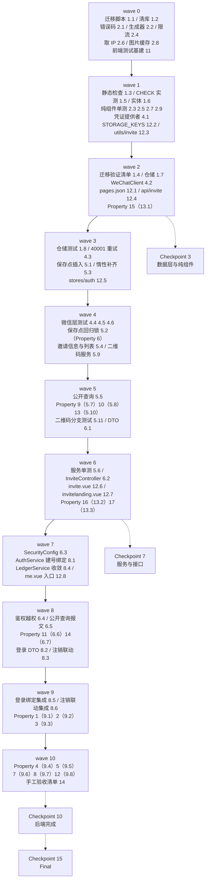

# Implementation Plan: 用户邀请系统

## Overview

后端先行、由内向外：数据层（迁移 + 实体 + 仓储）→ 无外部依赖的纯组件（邀请码生成器、限流器、图片缓存）
→ 微信接口层（凭证提供者 + 两个接口）→ 邀请业务服务 → 控制器与安全配置 → 改造既有代码
（`AuthService` 建号绑定、`AccountDeletionService` 注销联动、`LedgerService` 收敛）→ 前端 miniapp。
每完成一组运行 `./mvnw test`；前端改动完成后运行 `npm run test` 与 H5 构建。

两处高风险实现点单独立任务、单独验证：**唯一约束冲突的 JDBC 保存点方案**（任务 5.1 + 5.2 回归锁）与
**迁移脚本在真实 MySQL 上的行为**（任务 1.4 + 1.5，走 `deploy/dev-remote-db.sh`）。

## Tasks

- [x] 1. 数据层：迁移脚本、实体与仓储
  - [x] 1.1 新增迁移脚本 `V<N>__user_invite.sql`
    - **开始时先重新核对 `src/main/resources/db/migration` 目录当前最大版本号，以及 `V30`/`V31` 的实际占用情况**：设计定为 `V31__user_invite.sql`（撰写设计时最大为 V29、V30 由 user-feedback-system spec 预占）；若届时占用情况有变，按「大于目录内全部已存在版本号且未被任何迁移文件或其它 spec 预占的最小值」重算
    - 不修改、不重命名任何已存在的迁移文件
    - `ALTER TABLE users`：新增 `invite_code VARCHAR(8) NULL`（`utf8mb4` / `utf8mb4_unicode_ci`、中文列注释、`AFTER nickname`）+ 具名唯一约束 `uk_users_invite_code`
    - `CREATE TABLE invite_relations`：恰好 7 列、主键 `invite_id`、唯一 `uk_invite_relations_invitee`、复合索引 `idx_invite_relations_inviter_time (inviter_id, register_time)`、CHECK `ck_invite_relations_status`、InnoDB + `utf8mb4_unicode_ci`、7 个列注释 + 表注释（对齐 `V27__loan_repayments.sql` 写法）
    - **全表无任何指向 `users(id)` 的外键**；脚本不回填存量用户的 `invite_code`
    - 脚本头部中文注释写明：无外键是刻意选择（保留悬空 id / 历史留痕）、`status` 仅描述被邀请人
    - _Requirements: 9.1, 9.2, 9.3, 9.4, 9.5, 9.6, 9.7, 9.9, 9.10, 9.16, 9.17_

  - [x] 1.2 清库脚本 `deploy/reset-db.sql` 增加 `invite_relations`
    - 在 `TRUNCATE TABLE users` 之前插入 `TRUNCATE TABLE invite_relations;`
    - 不新增任何针对 `flyway_schema_history` 的语句
    - _Requirements: 9.14_

  - [x] 1.3 迁移目录静态检查测试*
    - 单元测试扫描迁移目录：新脚本存在且版本号大于全部既有版本；目录内版本号无重复；断言历史迁移文件未被改动
    - _Requirements: 9.10, 9.16_

  - [x] 1.4 在真实 MySQL 上执行迁移验证清单
    - 走 `deploy/dev-remote-db.sh` 连远库（或本地 MySQL 建临时库）执行迁移，逐项核对 `information_schema`：
      `columns`（`users.invite_code` 类型/可空/排序规则/注释；`invite_relations` 恰好 7 列的类型/可空性/缺省值/注释）、
      `statistics`（三个索引的名称/唯一性/列序）、
      `table_constraints` + `check_constraints`（`ck_invite_relations_status` 存在且表达式含 `utf8mb4_bin`）、
      `referential_constraints`（`invite_relations` 外键数为 **0**）、
      `tables`（引擎 InnoDB / 排序规则 / 表注释非空）
    - 存量数据不受影响：迁移前后 `users` 行数与若干行快照相同、全部 `invite_code` 为 NULL、`invite_relations` 行数为 0
    - 幂等性：连续两次启动应用，`flyway_schema_history` 中该版本记录数为 1
    - 以生产配置（Hibernate `ddl-auto=validate`）在迁移后的库上启动应用，启动成功
    - 执行 `deploy/reset-db.sql` 后断言 `invite_relations` 行数为 0、表仍存在、`flyway_schema_history` 记录数不变
    - _Requirements: 9.1, 9.2, 9.3, 9.4, 9.9, 9.11, 9.13, 9.14, 9.17, 9.18_

  - [x] 1.5 实测 CHECK 约束的大小写敏感性并按结果回写设计文档
    - 在目标 MySQL 版本上验证 `CHECK (status COLLATE utf8mb4_bin IN ('REGISTERED','INVALID'))` 表达式**是否被接受**
    - 插入 `'registered'`、`'Invalid'`、`'FOO'` 各一条断言被拒；`'REGISTERED'`、`'INVALID'` 断言通过；被拒时 `invite_relations` 行数与全部列取值不变
    - 若该表达式被 MySQL 拒绝：改用列级 `status VARCHAR(16) CHARACTER SET utf8mb4 COLLATE utf8mb4_bin`（表默认排序规则不变），修改任务 1.1 的脚本并**在 design.md 的「迁移脚本」小节补记该偏差**
    - _Requirements: 9.7, 9.8_

  - [x] 1.6 新增 `InviteRelation` 实体与 `InviteStatus` 枚举，`User` 增 `inviteCode`
    - `inviter_id` / `invitee_id` 声明为裸 `Long`，**不得映射为 `@ManyToOne User`**；类级 Javadoc 写明原因（悬空 id 会让关联实体读取抛 `EntityNotFoundException`，并诱导后续补外键）
    - `InviteStatus { REGISTERED, INVALID }` 以 `@Enumerated(EnumType.STRING)` 存取，名称即库中取值
    - `User` 新增 `@Column(name = "invite_code", length = 8, unique = true)`
    - _Requirements: 1.1, 9.2, 9.13_

  - [x] 1.7 新增 `InviteRelationRepository`，扩展 `UserRepository`
    - `InviteRelationRepository`：`countByInviterId`、`countByInviterIdAndStatus`、`findByInviterId(Pageable)`、`findByInviteeId`、`@Modifying` 的 `markInvalidByInviteeId(inviteeId, now)`（只改 `status` 与 `updated_at`）
    - `UserRepository`：`findByInviteCode`、`existsByInviteCode`、`findForUpdateById`（`@Lock(PESSIMISTIC_WRITE)`）
    - _Requirements: 1.3, 1.12, 7.5, 7.6, 10.2_

  - [x] 1.8 仓储层映射与查询单元测试*
    - H2 上断言实体与表结构一致；两个 count 的口径；`markInvalidByInviteeId` 影响行数 ≤ 1 且不改其余列
    - _Requirements: 7.5, 7.6, 9.15, 10.2_

- [x] 2. 错误码与无外部依赖的纯组件
  - [x] 2.1 `ApiException` 新增邀请域 4 个错误码工厂方法
    - `inviteCodeGenFailed()`(500)、`inviteQrCodeFailed(message)`(502)、`inviteRateLimited()`(429)、`invitePageParamInvalid(field)`(400)
    - _Requirements: 1.8, 3.6, 3.7, 3.14, 7.9, 8.6_

  - [x] 2.2 实现 `InviteCodeGenerator`
    - `ALPHABET`（32 字符，剔除 `I`/`O`/`0`/`1`）、`LENGTH = 8`、`normalize`（trim + 大写，null → `""`）、`isWellFormed`、`generateUnique(Predicate<String> occupied)`
    - `SecureRandom` 逐字符抽取，最多 10 次；10 次全被占用抛 `INVITE_CODE_GEN_FAILED`（ERROR 日志）
    - 随机源可注入，便于测试压缩码空间制造碰撞
    - _Requirements: 1.1, 1.6, 1.9_

  - [x] 2.3 `InviteCodeGenerator` 单元测试*
    - 字母表不含 `I`/`O`/`0`/`1`；`normalize(null)`→`""`、`normalize("  k7m2q9xt ")`→`K7M2Q9XT`；`isWellFormed` 对 7/8/9 位与含 `I` 串的判定；`occupied` 恒真时抛错且尝试恰好 10 次；受控 `occupied` 下返回首个未占用候选
    - _Requirements: 1.1, 1.6, 1.9_

  - [x] 2.4 实现 `InviteRateLimiter`
    - 两个互不相干的滑动窗口：`tryAcquireInviterLookup(ip)`（60s / 30 次）、`tryAcquireQrCodeMiss(userId)`（24h / 20 次）
    - `ConcurrentHashMap<K, ArrayDeque<Long>>`，队列自身作互斥锁；达上限返回 false 且**不计数**
    - 空队列以 `windows.remove(key, q)` 原子回收；键数上限（10000）时清理空队列
    - 注入 `Clock`（既有 `TimeConfig`），不得用 `System.currentTimeMillis()`
    - _Requirements: 3.9, 8.6, 8.8, 8.11_

  - [x] 2.5 `InviteRateLimiter` 单元测试*
    - 固定 `Clock` 驱动：第 30 次放行 / 第 31 次拒绝 / 拒绝不消耗额度 / 窗口滑出后恢复满额；24h 窗口同构；空队列被回收
    - _Requirements: 3.9, 8.6, 8.8, 8.11_

  - [x] 2.6 实现邀请接口的 `resolveClientIp`（取 `X-Forwarded-For` 末位）
    - 末位去空白非空则取末位；头缺失或末位为空回退 `request.getRemoteAddr()`
    - **代码注释写明与既有 `AuthController.resolveClientIp`（发码限流取首位）的区别与原因**：首位由客户端自填可伪造、末位由 nginx `$proxy_add_x_forwarded_for` 追加不可控；并注明「不要顺手统一回首位」
    - 本任务**不改动既有发码限流**的取值方式
    - _Requirements: 8.6_

  - [x] 2.7 `resolveClientIp` 单元测试*
    - XFF 缺失 / 单值 / 多值取末位 / 末位空白回退 `getRemoteAddr` / 伪造前序不影响结果
    - _Requirements: 8.6_

  - [x] 2.8 实现二维码图片内存缓存
    - `LinkedHashMap`（`accessOrder = false`）+ `removeEldestEntry` 得到**按写入时刻 FIFO 淘汰**；TTL 7 天，过期项读取时按未命中处理并先 `remove` 再 `put` 使其排到队尾；不落盘
    - **决策点：缓存值改存 `byte[]` 而非 base64 字符串**（省 1/3 内存膨胀，1000 项由 27–54MB 降到 20–40MB），base64 编码移到响应组装时做
    - **决策点：容量上限做成配置项 `app.invite.qrcode.cache-max-entries`，缺省 1000**（需求要求「不超过 1000」，配置更小值仍满足），写入 `application.yml`
    - _Requirements: 3.4, 3.13_

  - [x] 2.9 二维码缓存单元测试*
    - 写入 1001 项后 size 为 1000 且被淘汰者是首个写入者；同键过期刷新后排到队尾；TTL 边界（第 7 天整为过期）；配置项生效（如设为 3 时容量为 3）
    - _Requirements: 3.4, 3.13_

- [x] 3. Checkpoint - 数据层与纯组件
  - 运行 `./mvnw test`，确保全部测试通过；任务 1.5 的实测结论已回写。有疑问询问用户。

- [x] 4. 微信接口层
  - [x] 4.1 实现 `WeChatAccessTokenProvider`
    - 单值 `volatile` 缓存 + `ReentrantLock` 双重检查；剩余有效期 ≥ 300 秒直接返回缓存，否则刷新
    - 刷新失败（非零 errcode / 超时 2000ms / 抛异常）抛 `INVITE_QRCODE_FAILED`，且**保留原缓存值与到期时刻不变**
    - 类级 Javadoc 写明：这是**全项目唯一**允许调用 `cgi-bin/token` 的地方，后续任何需要 `access_token` 的功能必须注入本类（同 appid 的 token 全局唯一，多处各自获取会互相踢掉，表现为随机 `errcode=40001`）
    - _Requirements: 3.5, 3.14_

  - [x] 4.2 `WeChatClient` 新增两个接口方法
    - `fetchAccessToken()`：GET `cgi-bin/token`，超时 2000ms
    - `fetchUnlimitedQrCode(token, scene, page, width)`：POST `wxa/getwxacodeunlimit`，超时 3000ms
    - 响应判定：`Content-Type` 以 `image/` 开头 → 图片字节；否则（含首字节为 `{` 的畸形响应）按 JSON 解析 `errcode`/`errmsg`，记一条含微信错误码的 WARN 日志后抛 `INVITE_QRCODE_FAILED`（微信 `errcode` 只进日志，不透传客户端）
    - appid / secret 去空白为空时**先于任何网络调用**抛 `INVITE_QRCODE_FAILED`
    - 新增可配置 `app.wechat.api-base-url`（缺省指向微信正式域名）
    - _Requirements: 3.2, 3.6, 3.7_

  - [x] 4.3 `errcode=40001` 的强制刷新与单次重试
    - 小程序码接口返回 `40001`（凭证无效，通常是被别处刷新踢掉）时：强制刷新一次凭证并**重试一次**调用；重试仍失败返回 `INVITE_QRCODE_FAILED`
    - 重试整体仍受「未命中缓存计 1 次额度」约束，不额外扣额度
    - 日志中显式记录 `errcode=45009`（超出限额）与 `40001`，作为多实例凭证/额度失控的监控信号
    - _Requirements: 3.5, 3.7, 3.14_

  - [x] 4.4 `WeChatAccessTokenProvider` 单元测试*
    - 剩余 301s 复用 / 299s 刷新；刷新失败保留旧值与到期时刻且不调用小程序码接口；并发只刷新一次；`40001` 后强制刷新且总重试次数为 1
    - _Requirements: 3.5, 3.14_

  - [x] 4.5 `WeChatClient` 响应解析测试（`MockRestServiceServer`）*
    - `MockRestServiceServer.bindTo(RestClient.builder())` 绑定 `WeChatClient` 内部 `RestClient`，构造真实响应：`image/png` 字节流 → 字节；`application/json` + `errcode=41030` → `INVITE_QRCODE_FAILED` 且日志含 41030；首字节为 `{` 的畸形响应同样按错误处理；超时分支
    - _Requirements: 3.2, 3.7_

  - [x] 4.6 微信 mock 的第三层与测试 profile 隔离*
    - 以空 appid/secret 直接构造 `WeChatClient`，断言**零网络调用**
    - 确保测试 profile 下 `app.wechat.api-base-url` 指向 `MockRestServiceServer` 或不可路由地址，**任何测试都不得访问真实 `api.weixin.qq.com`**
    - _Requirements: 3.6_

- [x] 5. 邀请业务服务
  - [x] 5.1 实现 `InviteBindingService.bindOnRegister`（JDBC 保存点插入）
    - `@Transactional(propagation = MANDATORY)`；判定链按固定优先级早返回：`NO_CODE` → `NOT_NEW_USER` → `CODE_NOT_FOUND`（含格式非法与原始长度 >64）→ `SELF_INVITE`
    - `findByInviteCode` 在**保存点之前**执行，兼作 `inviter_id` 存在性校验（替代外键的应用层防线）；保存点之后不做任何 JPA 读写
    - `entityManager.flush()` → `conn.setSavepoint("sp_invite_bind")` → `jdbcTemplate.update(INSERT_SQL, ...)` → 成功 `releaseSavepoint`
    - 只捕 `DuplicateKeyException`（**不得**捕更宽的 `DataIntegrityViolationException`）→ `conn.rollback(sp)` 并返回 `ALREADY_BOUND`，记 INFO 日志；`SQLException` 按「唯一冲突以外的数据库故障」抛出使整个登录事务回滚
    - 最多 1 次插入尝试，失败不重试；**方法内消化全部异常，绝不穿出代理边界**
    - 插入 SQL 与保存点操作收进一个私有方法；类级 Javadoc 写明三条禁令与后果：①插入不得改回 `repository.save()`（冲突会在 flush 时爆发并污染持久化上下文）②异常不得穿出 `@Transactional` 方法（会被标记 rollback-only 连坐登录）③保存点之后不得触发 Hibernate 自动 flush
    - _Requirements: 5.1, 5.2, 5.6, 5.7, 5.10, 5.11, 5.12, 6.2, 6.3, 6.8, 9.19_

  - [x] 5.2 保存点方案的回归锁测试（**Property 6，不可跳过**）
    - **Property 6: 唯一约束冲突经保存点消化，登录事务照常提交**
    - **Validates: Requirements 5.10, 6.8**
    - 以 `TransactionTemplate` 在同一物理事务内构造：新建 `users` 行 → 预置一行 `invitee_id` 等于该新用户 id 的邀请关系 → 调用 `bindOnRegister`；断言提交成功、新用户行与其非空 `invite_code` 存在、`invite_relations` 行数不变、已存在那一行的 `inviter_id`/`register_time`/`status` 快照相等、返回 `ALREADY_BOUND`
    - 另生成「冲突 + 其它待写数据」组合，验证保存点范围不过大（保存点之前的写入不被回滚）
    - **测试 Javadoc 必须写明：若把插入改回 `repository.save()`，本测试必然失败**（这是锁死「插入不得经过 Hibernate」的唯一防线）
    - _Requirements: 5.10, 6.8_
    - _Properties: 6_

  - [x] 5.3 实现 `InviteService.requireInviteCode`（惰性补齐）
    - `@Transactional`：`findForUpdateById` 取行级写锁 → 已非空直接返回（幂等）→ 为空则按 10 次策略抽取并 `UPDATE`
    - 10 次全占用抛 `INVITE_CODE_GEN_FAILED`，`invite_code` 保持原值（NULL），响应不含任何邀请字段
    - _Requirements: 1.3, 1.4, 1.8, 1.12, 1.13_

  - [x] 5.4 实现 `InviteService` 的邀请信息与被邀请人列表
    - `getInviteInfo`：惰性补齐 → `buildInviteLink`（`/pages/invitelanding/invitelanding?code={邀请码}`，不额外转义）→ 已邀请人数（`REGISTERED` 计数）；响应字段**是且仅是**三个
    - `listInvitees`：参数校验（`page` 0–100000 缺省 0、`size` 1–50 缺省 20，越界/不可解析抛 `INVITE_PAGE_PARAM_INVALID` 并置 `field`）→ 排序 `(register_time desc, invite_id desc)` → 分页查询 → `findAllById` 批量补昵称（缺失或空白一律 `null`，不用占位文本）
    - 同时返回 `total`（含 `INVALID`，不受分页影响）与 `invitedCount`（仅 `REGISTERED`）
    - 全部查询硬性带 `inviter_id = 令牌用户 id`，不接受任何指定目标用户的入参
    - _Requirements: 1.10, 2.1, 7.1, 7.2, 7.3, 7.4, 7.5, 7.6, 7.7, 7.8, 7.9, 7.10, 8.3_

  - [x] 5.5 实现 `InviteService.findInviterNickname`（公开查询）
    - 顺序固定：**限流判定先于**规整与格式校验与存在性查询 → `normalize` → `isWellFormed` → `findByInviteCode`
    - 格式非法、含非法字符、查不到**三种情形返回完全相同的 `NOT_FOUND` 与相同字段集**（`{code, message, field}`，`field` 恒为 null）；不存在时不追加等待、不重试
    - 成功仅返回昵称一个字段（NULL 或空白以空值返回）
    - _Requirements: 4.2, 4.4, 8.5, 8.6, 8.7, 8.9, 8.10_

  - [x] 5.6 `InviteService` 单元测试*
    - 惰性补齐幂等；`invitedCount` 为 0 的空数据；分页参数边界 `-1`/`0`/`1`/`50`/`51`/`100000`/`100001`/非数字/缺省；昵称为 `null`/`""`/`"   "`/已注销的填充；公开查询三种失败同构
    - _Requirements: 1.4, 7.7, 7.9, 8.9_

  - [x] 5.7 属性测试 Property 9*
    - **Property 9: 统计口径自洽与分页不重不漏**
    - **Validates: Requirements 7.1, 7.2, 7.3, 7.5, 7.6, 7.10**
    - _Properties: 9_

  - [x] 5.8 属性测试 Property 10*
    - **Property 10: 分页参数的拒绝边界**
    - **Validates: Requirements 7.9**
    - _Properties: 10_

  - [x] 5.9 实现 `InviteQrCodeService.getQrCodeBase64`
    - 顺序刻意固定：惰性补齐邀请码 → **缓存命中判定** → **限流判定** → 取凭证 → 调小程序码接口（`scene` = 邀请码、`page` = `pages/invitelanding/invitelanding`、`width` = 430）→ 写缓存
    - 命中缓存的请求不调微信凭证与小程序码接口、不计数、不被限流；微信调用失败计入未命中额度且不写缓存
    - 返回不含 `data:image/png;base64,` 前缀的 base64（由缓存中的 `byte[]` 现场编码）
    - 注释写明「限流必须在缓存命中判定之后」：额度计的是打到微信的次数，前置会让只反复打开邀请页的用户被自己的缓存命中请求耗尽额度
    - _Requirements: 3.1, 3.2, 3.4, 3.7, 3.9, 3.12, 3.13, 8.8_

  - [x] 5.10 属性测试 Property 13*
    - **Property 13: 二维码的缓存语义、限流与编码**
    - **Validates: Requirements 3.1, 3.2, 3.4, 3.5, 3.7, 3.9, 3.12, 3.13, 3.14, 8.8**
    - 并发维度用 `ExecutorService` + `CountDownLatch`（并发度 2–8），`tries` 降到 100；时刻推进注入固定可推进 `Clock`
    - _Properties: 13_

  - [x] 5.11 `InviteQrCodeService` 分支单元测试*
    - Mockito mock `WeChatClient`：命中缓存零调用；限流第 21 次未命中返回 429；微信抛错时计数但不写缓存；`invite_code` 为空时先补齐再以补齐后的码作 `scene`
    - _Requirements: 3.4, 3.7, 3.9, 3.12_

- [x] 6. 控制器、DTO 与安全配置
  - [x] 6.1 新增邀请接口 DTO
    - `InviteInfoResponse`（3 字段）、`InviteQrCodeResponse`（`imageBase64`）、`InviteeListResponse` + `InviteeItemResponse`（4 字段）、`InviterBriefResponse`（仅 `nickname`）
    - DTO 中**不得**出现任何用于指定目标用户的字段，也不得出现 `email`/`wx_openid`/`wx_unionid`/`invite_code`
    - _Requirements: 1.10, 3.1, 7.4, 7.8, 8.3, 8.5_

  - [x] 6.2 实现 `InviteController`
    - `GET /api/invite`、`GET /api/invite/qrcode`、`GET /api/invite/invitees`、`GET /api/invite/inviter`（公开）
    - 三个受保护接口先做 `userRepository.findById(userId).orElseThrow(ApiException::unauthenticated)`（「有效令牌」含用户仍存在，过滤链不查库），该校验**先于**任何字段校验与限流判定
    - 只做参数解析与 DTO 组装，不含业务判定；公开接口用任务 2.6 的 `resolveClientIp` 取限流键
    - _Requirements: 8.1, 8.2, 8.3, 8.4_

  - [x] 6.3 `SecurityConfig` 放行规则
    - `GET /api/invite/inviter` 显式 `permitAll`，且**必须写在** `/api/invite/**` 的 `authenticated` 规则**之前**（按声明顺序首个匹配生效）；其余 `/api/invite/**` 需令牌
    - _Requirements: 8.1, 8.4_

  - [x] 6.4 集成测试：鉴权与越权*
    - 三个受保护接口在 5 种令牌形态下均返回 `UNAUTHENTICATED`：缺失 / 验签失败 / 过期 / **令牌用户已注销（过滤链管不到的情形）** / 空 Bearer；且优先于非法分页参数
    - 以 A 的令牌附加伪造入参（`userId`/`inviterId`/`targetUserId`/`code`/`inviteCode`）只能读到 A 的数据，响应与不带这些入参时逐字段相等
    - `/api/invite/inviter` 携带无效或过期令牌仍返回 200（不返回 `UNAUTHENTICATED`）
    - _Requirements: 8.1, 8.2, 8.3, 8.4_

  - [x] 6.5 集成测试：公开查询的报文同构与限流*
    - 存在的码 / 不存在的合法码 / 格式非法串 / 含非法字符串：后三者的 HTTP 状态与完整响应 JSON **逐字段相等**
    - 同一 IP 60 秒窗口内第 31 次返回 429；被拒后 `users` 与 `invite_relations` 数据不变、且不消耗额度
    - _Requirements: 8.6, 8.7, 8.9, 8.10_

  - [x] 6.6 属性测试 Property 11*
    - **Property 11: 列表与展示信息的字段边界**
    - **Validates: Requirements 7.4, 7.7, 7.8, 8.3, 8.5, 10.8**
    - 断言字段集**相等**（非包含）；序列化后的 JSON 文本不出现被排除字段的键与取值
    - _Properties: 11_

  - [x] 6.7 属性测试 Property 14*
    - **Property 14: 公开查询的鉴权、限流与不可区分**
    - **Validates: Requirements 4.2, 4.4, 8.1, 8.2, 8.4, 8.6, 8.7, 8.9, 8.10**
    - 时刻序列注入固定可推进 `Clock` 跨 60 秒边界
    - _Properties: 14_

- [x] 7. Checkpoint - 服务与接口
  - 运行 `./mvnw test`，确保全部测试通过。有疑问询问用户。

- [x] 8. 改造既有代码
  - [x] 8.1 `AuthService` 建号即绑定
    - `emailLogin` / `wxLogin` 签名新增 `inviteCode` 入参，返回 `LoginOutcome`（用户 + `InviteBindResult` + `isNewUser`）
    - 建号路径**只读一次时钟**（`LocalDateTime now = LocalDateTime.now(clock)`），同一个 `now` 同时用于 `user.setCreatedAt(now)` 与邀请关系的 `register_time`；**不得**使用 `NOW()` 或数据库默认值
    - 建号时以 `generateUnique(existsByInviteCode)` 写入 `invite_code`；10 次全占用抛 `INVITE_CODE_GEN_FAILED` 使整个登录事务回滚、不签发令牌
    - 建号与 `bindOnRegister` 必须在**同一个** `@Transactional` 边界内
    - _Requirements: 1.2, 1.7, 5.2, 5.3, 5.8, 5.9, 5.11_

  - [x] 8.2 `AuthController` 与登录 DTO 扩展
    - `EmailLoginRequest` / `WxLoginRequest` 新增可选 `inviteCode`（长度上限 64；缺失 / null / 去空白为空一律按 `NO_CODE`）
    - `LoginResponse` 新增 `inviteBound`（boolean）与 `inviteUnboundReason`（`null` 或五取值之一）；`token`/`tokenType`/`user` 语义不变，老客户端可忽略新字段
    - _Requirements: 5.1, 5.4_

  - [x] 8.3 `AccountDeletionService` 注销联动
    - 注入 `Clock` 与 `InviteRelationRepository`；在 `userRepository.delete(user)` **之前**调用 `markInvalidByInviteeId(userId, now)`
    - 以该 id 为 `inviter_id` 的行**一行不动**（含 `status`）；邀请码随 `users` 行删除而释放
    - 前置校验（`requireDeletable` 的 `DELETE_BLOCKED_COLLAB`、`verifySecondFactor`）未通过时对 `invite_relations` 零副作用
    - _Requirements: 10.1, 10.2, 10.3, 10.4, 10.5, 10.6_

  - [x] 8.4 `LedgerService.generateUniqueCode` 收敛到 `InviteCodeGenerator`
    - 纯重构：委托给同一字母表与同一 10 次重试策略；内联的匿名 `INVITE_CODE_GEN_FAILED` 改用工厂方法（错误码字符串与 HTTP 状态不变）
    - 账本邀请（`ledger_invites`）行为不变，两套邀请机制仍彼此独立；既有账本邀请测试须继续通过
    - _Requirements: 1.6_

  - [x] 8.5 集成测试：登录绑定全路径*
    - `/api/auth/email-login` 与 `/api/auth/wx-login` 各覆盖**已绑定 + 5 种未绑定原因**（`NO_CODE`/`NOT_NEW_USER`/`CODE_NOT_FOUND`/`SELF_INVITE`/`ALREADY_BOUND`），断言响应两个新字段与库中行数
    - 含「老用户 + 畸形码 → `NOT_NEW_USER`」的优先级用例，与「同一被邀请人重复登录 2–10 次 → 行数恒为 1 且第 2 次起为 `NOT_NEW_USER`」
    - 断言 `register_time` 与被邀请人 `users.created_at` **读库比对**严格相等（不比较内存值）
    - _Requirements: 5.2, 5.3, 5.4, 5.5, 5.8, 6.2, 6.6_

  - [x] 8.6 集成测试：注销联动*
    - 注销被邀请人后邀请人的 `invitedCount` 减 1、`total` 不变、列表仍返回该行且 `status` 为 `INVALID`、昵称为 `null`
    - 注销邀请人后其名下行六列逐行快照不变；双重身份（既是若干行 inviter 又是某行 invitee）用例
    - 前置校验失败时两表零副作用；`markInvalidByInviteeId` 抛错时整事务回滚且原令牌仍可请求邀请信息
    - 已释放的码：公开查询得 `NOT_FOUND`、带该码登录得 `CODE_NOT_FOUND` 且登录成功；被新用户重新占用后历史行不出现在新持有者响应中
    - _Requirements: 10.1, 10.2, 10.3, 10.4, 10.5, 10.6, 10.7, 10.9, 10.10_

- [x] 9. 注册与注销相关的后端属性测试
  - [x] 9.1 属性测试 Property 1*
    - **Property 1: 邀请码的格式不变式与全局唯一性**
    - **Validates: Requirements 1.1, 1.2, 1.5, 1.6, 9.1**
    - _Properties: 1_

  - [x] 9.2 属性测试 Property 2*
    - **Property 2: 邀请码的稳定性与请求幂等**
    - **Validates: Requirements 1.3, 1.4, 1.12, 1.13**
    - 并发惰性补齐用 `ExecutorService` + `CountDownLatch`（并发度 2–8），`tries` 降到 100
    - _Properties: 2_

  - [x] 9.3 属性测试 Property 3*
    - **Property 3: 登录/注册的活性（邀请码问题不阻断主路径）**
    - **Validates: Requirements 5.3, 5.5, 5.6, 6.2, 9.19**
    - _Properties: 3_

  - [x] 9.4 属性测试 Property 4*
    - **Property 4: 绑定结果与未绑定原因的确定性**
    - **Validates: Requirements 5.1, 5.4, 5.11, 5.12, 6.10**
    - 生成器刻意构造同时命中多个情形的组合，并以受控随机源触达 `SELF_INVITE`
    - _Properties: 4_

  - [x] 9.5 属性测试 Property 5*
    - **Property 5: 一个 invitee 至多一条邀请关系**
    - **Validates: Requirements 6.1, 6.3, 6.4, 6.6, 6.9, 9.3**
    - 并发以同一 `invitee_id` 插入用 `ExecutorService` + `CountDownLatch`（并发度 2–8），`tries` 降到 100；断言落败方状态码 < 500
    - _Properties: 5_

  - [x] 9.6 属性测试 Property 7*
    - **Property 7: 关系行的取值不变式**
    - **Validates: Requirements 6.5, 6.7**
    - _Properties: 7_

  - [x] 9.7 属性测试 Property 8*
    - **Property 8: 时刻一致与审计列**
    - **Validates: Requirements 5.2, 5.8, 5.9, 9.15**
    - 注入可推进的固定 `Clock`；`register_time` 与 `created_at` 的比对必须**读库取值**
    - _Properties: 8_

  - [x] 9.8 属性测试 Property 12*
    - **Property 12: 注销后的保留不变式**
    - **Validates: Requirements 9.5, 9.6, 10.1, 10.2, 10.3, 10.4, 10.6, 10.7, 10.9, 10.10**
    - _Properties: 12_

- [x] 10. Checkpoint - 后端完成
  - 运行 `./mvnw test`，确保 Property 1–14 与全部集成测试通过。有疑问询问用户。

- [x] 11. 前端测试基建
  - `miniapp/package.json` 新增两个 devDependency：`vitest`、`fast-check`（固定版本）
  - 新增 `npm run test` 脚本（单次执行，不用 watch 模式）与最小 vitest 配置
  - 只测**不依赖 uni API 的纯逻辑**（`src/utils/invite.js`），不引入 DOM/组件渲染环境
  - _Requirements: 4.1, 4.6, 4.7_

- [x] 12. 前端实现
  - [x] 12.1 `pages.json` 注册两个页面
    - `pages/invite/invite`（`navigationBarTitleText: 邀请好友`）与 `pages/invitelanding/invitelanding`（`navigationBarTitleText: 有余邀请`，`navigationStyle: custom`）
    - _Requirements: 2.6, 4.3_

  - [x] 12.2 `utils/config.js` 新增两个 `STORAGE_KEYS`
    - `pendingInviteCode: 'youyu_pending_invite_code'`、`pendingInviteCodeAt: 'youyu_pending_invite_code_at'`（术语表指定取值，不可改名）
    - _Requirements: 4.1_

  - [x] 12.3 新增 `utils/invite.js`
    - `INVITE_CODE_RE`、`PENDING_TTL_MS = 604800000`、`normalizeInviteCode`、`isWellFormedInviteCode`、`buildInviteLink`
    - `savePendingInviteCode`（覆盖旧值 + 记录 `Date.now()`）、`takePendingInviteCode`（格式非法 / 写入时刻缺失 / 不可解析 / 已满 7 天 → 清除并返回 `''`）、`clearPendingInviteCode`
    - 存储读写异常一律吞掉并返回 `''` / `false`，**不抛出、不阻断登录主路径**
    - _Requirements: 4.1, 4.6, 4.7, 4.13_

  - [x] 12.4 新增 `api/invite.js`
    - `fetchInviteInfo` / `fetchInviteQrCode` / `fetchInvitees(page, size)` / `fetchInviterBrief(code)`；全部带 `noLedger: true`，公开查询另带 `auth: false`
    - _Requirements: 1.10, 3.1, 4.2, 7.1_

  - [x] 12.5 `stores/auth.js` 携带与清除待绑定邀请码
    - `loginWithWeixin` / `loginWithEmail` 调用前 `takePendingInviteCode()` 并把结果作为 `inviteCode` 携带（`''` 表示不携带）
    - 请求**返回成功之后**才 `clearPendingInviteCode()`（无论 `inviteBound` 真假）；失败 / 网络错误 / 超时一律保留暂存供重试
    - 记录 `lastInviteBind = { bound, reason }` 备后续埋点，本期 UI 不据此展示任何内容
    - _Requirements: 4.6, 4.8, 4.12_

  - [x] 12.6 新增 `pages/invite/invite.vue`
    - **三条互相独立的状态机**（info / qr / list），不做整体 loading：二维码故障不得连坐邀请码与转发
    - `onLoad` 并发发起 `fetchInviteInfo()` 与 `fetchInvitees(0, 20)`；info 就绪后再取二维码
    - 四个分享动作：`onShareAppMessage` 返回 `{ title, path }`（`path = inviteLink`，标题含「有余」且 ≤30 字；`inviteLink` 为空时退化为不带 `code` 的落地页路径 + 「邀请码尚未就绪」提示）、复制邀请码、复制邀请链接（`uni.setClipboardData` 写入原文，成功 toast 1500ms，失败留在原页并继续展示文本）、保存到相册（base64 → 临时文件 → `uni.saveImageToPhotosAlbum`，拒绝授权时提示且展示不变）
    - 战绩卡：主数字 `invitedCount`，三栏 `total` / `invitedCount` / `total - invitedCount`
    - 列表：首屏 20 条，`onReachBottom` 追加 20 条，`loaded >= total` 停止请求；状态文案 `REGISTERED`→已注册、`INVALID`→已注销；昵称 `null` → 灰色斜体占位样式（不改数据）
    - info 失败或 10 秒无响应 → 失败文案 + 重试，**不展示邀请码 / 链接 / 转发入口**；二维码失败 → 虚线占位 + 重试胶囊 + 「不影响转发与复制邀请码」；列表失败或 2 秒超时 → 失败文案 + 重试且保留已加载记录；`total = 0` → 空状态卡 + 分享引导且不渲染列表区域
    - _Requirements: 2.2, 2.3, 2.7, 2.8, 2.9, 2.10, 3.8, 3.11, 7.12, 7.13, 7.14_

  - [x] 12.7 新增 `pages/invitelanding/invitelanding.vue`
    - `onLoad(options)`：`raw = options.code ?? options.scene` → `decodeURIComponent` → trim + 大写 → 格式判定
    - 三个页面态：`INVITER_SHOWN`（写暂存 → `fetchInviterBrief`，昵称非空展示昵称、为 `null` 展示通用邀请提示）、`DEFAULT`（参数缺失/非法，或查询 404/429/网络错误/5s 超时；不显示任何错误，保留已写入的暂存与写入时刻不变；参数非法时不写、不改暂存且不发查询）、`LOGGED_IN`（已登录：展示已登录提示 + 回到首页入口，**不写、不改暂存**）
    - 登录入口**仅**复用既有两种方式（微信一键、邮箱验证码登录/注册合一），不新增任何注册方式
    - _Requirements: 2.4, 2.5, 3.3, 4.1, 4.3, 4.5, 4.9, 4.10, 4.11_

  - [x] 12.8 `pages/me/me.vue` 插入邀请入口
    - 在**快捷宫格之后、「记账工具」分组之前**插入独立分组块（不塞进静态 `groups`，因为要展示动态人数）
    - `onShow` 在既有 `auth.refreshUser()` 之后追加一次 `fetchInviteInfo()`：成功显示「已邀请 N 人」（品牌绿加粗），失败只显示标题与箭头（不显示数字、不弹错误）
    - 点击 `uni.navigateTo('/pages/invite/invite')`；样式复用既有 `.sect`/`.card`/`.row`/`.r-ic`/`.r-v` 与 `#12a150`，不引入新组件
    - _Requirements: 2.6_

- [x] 13. 前端属性测试（vitest + fast-check，仅纯逻辑）
  - [x] 13.1 属性测试 Property 15*
    - **Property 15: 待绑定邀请码的时效状态机**
    - **Validates: Requirements 4.1, 4.6, 4.7, 4.8, 4.12, 4.13**
    - 覆盖 `utils/invite.js` 的存 / 取 / 清与 7 天判定；时间差取 `{0, 1, 604799999, 604800000, 604800001, 负数, NaN, 缺失, "abc"}`；mock 存储的 get/set/remove 抛错分支
    - _Properties: 15_

  - [x] 13.2 属性测试 Property 16 的纯逻辑部分*
    - **Property 16: 落地页的邀请码解析与降级**
    - **Validates: Requirements 2.4, 2.5, 4.11**
    - 只测「URL 解码 → 去首尾空白 → 转大写」的解析函数与「是否发起查询 / 是否写暂存」的判定函数；页面态渲染列入任务 14
    - _Properties: 16_

  - [x] 13.3 属性测试 Property 17 的纯逻辑部分*
    - **Property 17: 邀请页的展示契约与分享降级**
    - **Validates: Requirements 2.1, 7.13**
    - 只测 `buildInviteLink` 的模板等式、分享标题长度与含「有余」的判定、列表分页累计与停止条件（`requestCount == ceil(min(loaded, total)/20)` 且 `loaded <= total`）、状态文案映射为双射；剪贴板与转发交互列入任务 14
    - _Properties: 17_

- [x] 14. 手工验收清单（对照原型逐条核对）*
  - 逐条对照 `design/invite-system-prototype.html` 的 **9 个页面态**验收页面渲染
  - 邀请好友页：info 就绪态 / info 失败态 / 二维码失败态 / 空状态 / 列表加载失败态
  - 落地页：`INVITER_SHOWN`（含昵称为空的通用提示）/ `DEFAULT` / `LOGGED_IN`
  - 「我的」页邀请入口（含人数获取失败时只显示标题与箭头）
  - `uni.*` 交互逐项实机验收：转发卡片（`path` 与标题）、剪贴板（内容严格等于原文 + 1500ms 提示 + 失败降级）、相册授权（拒绝后停留原页且展示不变）、上拉加载（追加 20 条 / 到底停止）
  - _Requirements: 2.2, 2.3, 2.7, 2.8, 2.9, 2.10, 3.8, 3.11, 4.3, 4.5, 4.9, 7.12, 7.13, 7.14_

- [x] 15. Final checkpoint
  - 运行 `./mvnw test` 与 `npm run test`，确认 H5 构建通过；确认任务 1.5 的实测结论已回写设计文档。有疑问询问用户。

## Notes

- 标 `*` 的子任务为可选，可为快速 MVP 跳过；**任务 5.2（保存点回归锁）刻意不标可选**——它是锁死「插入不得经过 Hibernate」这条隐形实现约束的唯一防线，跳过等于把一个极难在 code review 中发现的登录接口回归放归野外。
- 任务 1.4 / 1.5 是必要的实现验证步骤而非部署活动：H2 测试环境不执行 Flyway（表由实体生成），迁移脚本、具名约束与 CHECK 大小写敏感性只能在真实 MySQL 上验证。本 spec 刻意**不引入 Testcontainers**（为一小簇断言换来 CI 从纯 JVM 几十秒变成拉镜像几分钟不值），改走 `deploy/dev-remote-db.sh`。
- 后端 Property 1–14 各对应**恰好一个** jqwik `@Property` 方法，Javadoc 按既有约定标注 `Feature: invite-system, Property N: <标题>` 与 `Validates: Requirements X.Y`；默认 `tries = 200`，并发属性（2、5、13）降到 `tries = 100`。
- 涉及时刻的属性（8、13、14）与限流测试一律注入可推进的固定 `Clock`（既有 `TimeConfig` 提供 Bean），不使用真实时间。
- 微信 mock 三层：Mockito mock `WeChatClient`（服务层分支）/ `MockRestServiceServer` 绑 `RestClient`（协议层解析）/ 空 appid 构造断言零网络调用。测试 profile 下 `app.wechat.api-base-url` 不得指向真实 `api.weixin.qq.com`。
- 前端 Property 15–17 只自动化覆盖纯逻辑；页面状态机与 `uni.*` 交互由任务 14 手工验收。
- 两处设计留给实现决定的调整已落为明确任务：缓存值改存 `byte[]`（任务 2.8）与 `errcode=40001` 的强制刷新重试（任务 4.3）。

## Task Dependency Graph

```json
{
  "waves": [
    { "id": 0, "tasks": ["1.1", "1.2", "2.1", "2.2", "2.4", "2.6", "2.8", "11"] },
    { "id": 1, "tasks": ["1.3", "1.5", "1.6", "2.3", "2.5", "2.7", "2.9", "4.1", "12.2", "12.3"] },
    { "id": 2, "tasks": ["1.4", "1.7", "4.2", "12.1", "12.4", "13.1"] },
    { "id": 3, "tasks": ["1.8", "4.3", "5.1", "5.3", "12.5"] },
    { "id": 4, "tasks": ["4.4", "4.5", "4.6", "5.2", "5.4", "5.9"] },
    { "id": 5, "tasks": ["5.5", "5.7", "5.8", "5.10", "5.11", "6.1"] },
    { "id": 6, "tasks": ["5.6", "6.2", "12.6", "12.7", "13.2", "13.3"] },
    { "id": 7, "tasks": ["6.3", "8.1", "8.4", "12.8"] },
    { "id": 8, "tasks": ["6.4", "6.5", "6.6", "6.7", "8.2", "8.3"] },
    { "id": 9, "tasks": ["8.5", "8.6", "9.1", "9.2", "9.3"] },
    { "id": 10, "tasks": ["9.4", "9.5", "9.6", "9.7", "9.8", "14"] }
  ]
}
```

可并行任务组（同层内彼此无文件冲突，可并行推进）：


