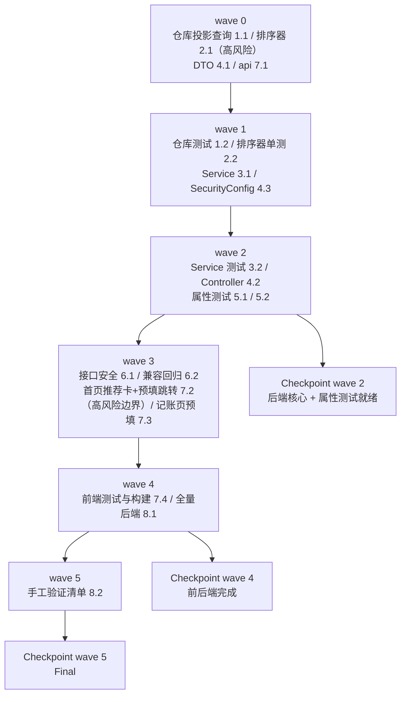

# Implementation Plan: 记账推荐

## Overview

对齐既有垂直切片，「后端先行、由内向外」：只读投影查询 → 纯函数排序器 → 只读服务 → 控制器与安全
→ 属性测试 → miniapp（首页推荐卡 + 记账页预填）。每完成一组后端任务运行 `./mvnw test`；
前端改动后运行 `npm run test` 与 H5 构建。

**本 spec 是纯增量、纯只读**：只新增一个只读查询接口、首页一张推荐卡、记账页对预填参数的扩展；
只读 `transactions`/`categories`/`accounts`，**不新增/不修改任何 Flyway 迁移、不新建任何表、不写任何业务数据**。
删掉推荐接口与推荐卡，其余功能原样成立——由任务 6.2 的兼容性回归锁住。

**改造既有代码的 2 处**：`TransactionRepository`（新增一个只读窗口投影查询方法，不改既有方法）、
`miniapp/src/pages/record/record.vue`（扩展既有 `onLoad(q)` 读取预填参数，既有编辑/转账逻辑一字不改）；
`miniapp/src/pages/index/index.vue` 新增推荐卡（既有模块不动）。

**两处高风险单独立任务、单独验证**：
排序器的分组去重与全序确定性（任务 2.1，配任务 5.1 属性测试）、
「不直接入账」边界——点候选只跳转预填、绝不调写接口（任务 7.2，配任务 6.2 源码扫描）。

**一处关键取舍需与设计对齐**（design.md「已知取舍」）：不加专用索引、不缓存、不记忆「忽略」。
按设计实现，不在本 spec 引入迁移或缓存。

## Tasks

- [x] 1. 只读投影查询
  - [x] 1.1 `TransactionRepository` 新增窗口投影查询
    - 新增接口投影 `SuggestionRow`（`type/amount/categoryId/accountId/note/occurredAt/id` 七项 getter）
    - 新增 `findSuggestionWindowRows(ledgerId, from, to)`：JPQL `where t.ledgerId=:ledgerId and t.type in ('expense','income') and t.occurredAt between :from and :to`；依赖 `Transaction` 的 `@SQLRestriction("deleted_at is null")` 自动排除软删
    - 不修改、不重命名 `TransactionRepository` 任何既有方法
    - `CategoryRepository` 若无 `findByIdIn(Collection<Long>)` 则新增一个只读派生查询（仅供取展示用 name/icon）
    - _Requirements: 2.1, 2.4, 8.1_

  - [x] 1.2 仓库查询测试*（`@DataJpaTest`，H2 MODE=MySQL）
    - 只返回本账本、未删除、`expense`/`income`、窗口内的行；软删行被排除；转账被排除；跨账本不串；`occurred_at` 边界（窗口起点当日 00:00、终点当日 23:59:59）纳入正确
    - _Requirements: 2.1, 2.4_

- [x] 2. 纯函数排序器（高风险）
  - [x] 2.1 `RecordSuggestionRanker`
    - `rank(List<SuggestionRow>)`：按形态 `ShapeKey(type, categoryId, accountId, amount规整, normalizeNote(note))` 分组；`amount` 以 `stripTrailingZeros` 参与 equals/hashCode（`35` 与 `35.00` 视为同额）
    - 每组聚合：`frequency`=组内行数、`recency`=代表行 `occurred_at`、代表行=组内 `occurred_at` 最大者（并列取 `id` 最大）
    - 排序比较器：`frequency desc → recency desc → 代表 id desc`（全序、确定），`limit(3)`
    - `normalizeNote`：null/空白→空串，否则 `strip()`
    - 纯函数：无 DB、无时钟、无静态可变状态
    - _Requirements: 2.2, 2.3, 3.1, 3.2, 3.3, 3.4, 3.5_

  - [x] 2.2 排序器单测*
    - 去重、三级键排序、并列决胜、截断 3、空输入、note 首尾空白并组、amount 标度并额、传入顺序无关
    - _Requirements: 2.2, 2.3, 3.1, 3.2, 3.3, 3.4, 3.5_

- [x] 3. 只读服务
  - [x] 3.1 `RecordSuggestionService.list(ledgerId)`
    - `@Transactional(readOnly=true)`；`Clock` 注入算窗口：`from=today.minusDays(29).atStartOfDay()`、`to=today.atTime(LocalTime.MAX)`（`Asia/Shanghai`）
    - 调 `findSuggestionWindowRows` → `RecordSuggestionRanker.rank` → 若结果 `< 2` 返回空列表（`MIN_SUGGESTIONS=2`，需求 7.1）
    - `>=2` 时批量 `findByIdIn` 取分类 name/icon（分类已删→null），组装 `RecordSuggestionItem`（含 `categoryName`/`categoryIcon`）
    - 常量 `WINDOW_DAYS=30`、`MAX_SUGGESTIONS=3`、`MIN_SUGGESTIONS=2`
    - _Requirements: 1.1, 2.5, 6.1, 6.6, 7.1_

  - [x] 3.2 服务层测试*（`@SpringBootTest`，H2 MODE=MySQL）
    - <2 组返回空；恰好 2、3 条；多于 3 条截断；分类已删 `categoryName` 为 null；账户已删仍带 `accountId`；不读取 `transaction_templates`
    - _Requirements: 1.1, 2.5, 6.6, 7.1_

- [x] 4. DTO 与控制器
  - [x] 4.1 DTO：`RecordSuggestionResponse` / `RecordSuggestionItem`
    - record 类型，字段对齐设计（`suggestions`；`type/amount/categoryId/accountId/note/categoryName/categoryIcon`）
    - _Requirements: 6.1_

  - [x] 4.2 `RecordSuggestionController`
    - `@RestController @RequestMapping("/api/transactions")`，`@GetMapping("/suggestions")`；注入 `CurrentLedger`
    - `Long ledgerId = currentLedger.requireLedgerId()`（无令牌→`UNAUTHENTICATED`；`X-Ledger-Id` 越权→既有账本不可访问错误），转发 `suggestionService.list(ledgerId)`
    - 数据归属只认令牌用户 + 解析账本，忽略任何入参指定的用户/账本
    - _Requirements: 6.1, 6.2, 6.3, 6.4, 6.5_

  - [x] 4.3 SecurityConfig 路由确认
    - 确认 `/api/transactions/**` 已在 `authenticated()` 下覆盖新端点（若已覆盖则无需改）
    - _Requirements: 6.2_

- [x] 5. 后端属性测试（jqwik）
  - [x] 5.1 Property 1/2/3：去重、全序确定、截断与代表选取
    - Property 1（去重，需求 3.1）、Property 2（全序 + 传入顺序无关确定性，需求 3.2/3.3/3.5）、Property 3（≤3 且代表取 occurred_at 最大并列 id 最大，需求 2.3/3.4）
    - _Requirements: 2.3, 3.1, 3.2, 3.3, 3.4, 3.5_

  - [x] 5.2 Property 4/5/6：门槛、范围、规整并额
    - Property 4（<2 空、≥2 返 2–3，需求 1.1/6.6/7.1）、Property 5（只 expense/income 且窗口内，需求 2.1/2.4）、Property 6（note 规整 + amount 标度并额，需求 2.2）
    - _Requirements: 1.1, 2.1, 2.2, 2.4, 6.6, 7.1_

- [x] 6. 接口安全与兼容性
  - [x] 6.1 接口与安全测试*（MockMvc）
    - 无/过期令牌→`UNAUTHENTICATED` 且无候选；`X-Ledger-Id` 越权→既有账本不可访问错误；只返回当前账本候选；携带指定用户/账本入参被忽略；耗时在 2s 内
    - _Requirements: 6.2, 6.3, 6.4, 6.5_

  - [x] 6.2 兼容性回归*
    - 源码扫描：本 spec 代码路径无对 `transactions`/`categories`/`accounts` 的写语句、无新增/修改迁移、无 `transaction_templates` 引用
    - 移除推荐端点后交易/账本/分类/模板/预算/报表既有测试全绿（契约不变）
    - _Requirements: 8.1, 8.2, 8.3, 8.4_

- [x] 7. miniapp：推荐卡与预填
  - [x] 7.1 `src/api/suggestion.js`
    - `fetchSuggestions(ledgerId)` → `GET /transactions/suggestions`，`opts(ledgerId)` 对齐 `api/template.js`
    - _Requirements: 6.1_

  - [x] 7.2 首页推荐卡（`index.vue`）与点击预填（高风险边界）
    - `onShow` 且已登录且非全部账本聚合视图（`!ledgerStore.isAll`）时调 `fetchSuggestions(当前账本)`；聚合视图/未登录不请求（需求 5.3、7.4）
    - 展示位置：快捷入口下方、预算卡之上；`suggestions.length >= 2` 才渲染，列出金额/分类名/方向/图标（图标缺省走 `AppIcon` 名称回退）
    - 账本切换触发重拉（需求 5.2）；`<2`/失败/3000ms 超时→不渲染卡、不占位、自动重试 0 次、首页其余模块不受影响（需求 1.5、1.6、1.7、7.2、7.5）
    - 点候选：`navigateTo('/pages/record/record?type=..&amount=..&categoryId=..&accountId=..&note=<encodeURIComponent>')`；**不调用任何写接口、不入账**（需求 4.2）；`fail` 回调提示并停留原页（需求 4.7）
    - _Requirements: 1.1, 1.2, 1.5, 1.6, 1.7, 4.2, 4.7, 5.2, 5.3, 7.2, 7.4, 7.5_

  - [x] 7.3 记账页预填（`record.vue`）
    - 扩展既有 `onLoad(q)`：记录 `amount/categoryId/note`（既有 `type/accountId/ledgerId` 解析不动）
    - 在 `load()`（分类/账户就绪）后应用预填：金额→`expr`、备注→`note`（`decodeURIComponent`）、分类存在才设 `categoryId`、账户在可选集才设 `accountId`
    - 分类/账户已删→留空由用户重选（需求 4.5）；金额缺失或非正→金额留空（需求 4.6）；仅编辑态（`isEditing`）不预填
    - 用户可改任意字段，保存仍走既有 `POST /api/transactions`（需求 4.3、4.4）
    - _Requirements: 4.1, 4.3, 4.4, 4.5, 4.6_

  - [x] 7.4 前端测试与构建*
    - 聚合视图/未登录不请求；<2/失败/超时不展示卡且不影响首页；点候选跳记账页且预填正确；分类/账户已删留空；`npm run test` 与 H5 构建通过
    - _Requirements: 1.6, 4.1, 4.5, 5.3, 7.2, 7.4_

- [x] 8. 收尾
  - [x] 8.1 全量后端测试
    - `./mvnw test` 全绿；以 `ddl-auto=validate` 启动成功（确认无意外 schema 改动）
    - _Requirements: 8.2_

  - [x] 8.2 手工验证清单*
    - 真机/预览：具体账本近 30 天有重复记录时首页出 2–3 条；点其一进记账页已预填、可改、保存入账；切账本推荐随之变；聚合视图无卡；新账本无卡
    - _Requirements: 1.1, 4.1, 5.2, 5.3, 7.1_

## Notes

- 每条属性测试任务标注 `_Requirements`，与 design.md 的 Property 1–6 一一对应（5.1→P1/P2/P3、5.2→P4/P5/P6）。
- 带 `*` 的任务为测试/验证类，可在其被测实现任务完成后并行推进。
- 需求 6.5（耗时上界）、7.x 的**渲染与降级交互**属环境/手工相关验收（分别由 6.1、7.4/8.2 承载）。
- 两处高风险任务（2.1 排序器全序确定性、7.2「不直接入账」边界）单独立任务并配属性/扫描测试锁定。
- 本 spec 无迁移、无新表、无注销级联改动——纯只读。

## Task Dependency Graph

```json
{
  "waves": [
    { "id": 0, "tasks": ["1.1", "2.1", "4.1", "7.1"] },
    { "id": 1, "tasks": ["1.2", "2.2", "3.1", "4.3"] },
    { "id": 2, "tasks": ["3.2", "4.2", "5.1", "5.2"] },
    { "id": 3, "tasks": ["6.1", "6.2", "7.2", "7.3"] },
    { "id": 4, "tasks": ["7.4", "8.1"] },
    { "id": 5, "tasks": ["8.2"] }
  ]
}
```

同层内任务彼此无文件冲突，可并行推进：


