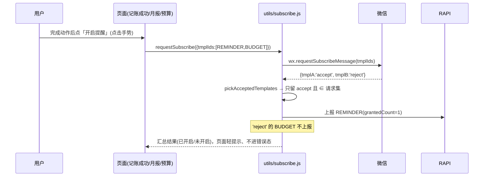

# Design Document

## Overview

retention-nudges 是一个**纯前端（miniapp）增量功能**，不新增 / 不改动任何后端接口、表与发送逻辑。它把两件「留存轻触达」的事落地：

1. **添加入口引导（Add_Entry_Guide）**：在低打扰时机引导用户把有余「添加到我的小程序 / 添加到桌面」，并在「我的」页保留常驻教程入口。微信无「一键添加」API，故这是**教育引导 + 本地记忆节流**，不承诺自动添加。
2. **订阅授权策略优化（Subscribe_Grant_Strategy）**：把稀缺的一次性订阅授权用到极致——在**用户点击手势**内、于高意愿时刻（记账保存成功 / 看完月报 / 设完预算）一次性批量请求记账+预算两个模板的授权，对已勾「总是保持」的模板做无弹窗续额，并按模板把 `accept` 结果上报到既有授权接口。

设计的三条主轴：

- **纯前端、零后端改造**：复用既有两个授权上报接口（`api/reminder.js` 的 `grantReminderQuota`、`api/budgetReminder.js` 的 `grantBudgetReminderQuota`）与既有模板 id 常量（`WX_REMINDER_TEMPLATE_ID` / `WX_BUDGET_REMINDER_TEMPLATE_ID`）。本 spec 只「请求授权 + 上报」，**绝不发送订阅消息**（需求 5.1）。
- **把「可测的纯逻辑」从「uni.* 交互」中剥离**：节流决策、`accept` 过滤、模板→上报器映射、「总是保持」解析全部做成 `src/utils` 下的纯函数，用 vitest + fast-check 覆盖（对齐 `utils/reminder.js` 既有范式）；`wx.requestSubscribeMessage` / `wx.getSetting` / 弹窗 / 跳转等 uni.* 交互归手工验收（对齐 `vitest.config.js` 只测 `src/utils` 纯逻辑的约定）。
- **两条微信硬约束贯穿设计**：①「添加到我的小程序/桌面」无编程接口→只引导；②`wx.requestSubscribeMessage` 必须在点击回调内调用→授权/续额只能挂在点击动作上，不能在 `onShow`/页面加载时静默发起。

### 研究要点与既有代码结论

- **授权当前只在提醒设置页 `pages/reminder/reminder.vue` 发起**：记账提醒、预算提醒各自 `wx.requestSubscribeMessage([单模板])`、各上报 `grantXxxQuota(1)`。本 spec 抽出统一的 `utils/subscribe.js` 编排，设置页与高意愿时刻共用，不改设置页每个区块的用户可见语义（需求 4）。
- **端上本地状态集中在 `utils/config.js` 的 `STORAGE_KEYS`**：本 spec 的节流记忆键并入其中（需求 5.3）。
- **前端测试基建**：`vitest run` + `fast-check`，既有 `utils/reminder.validation-quota.test.js` 已示范「常量 + 纯函数 + 属性测试」写法，本 spec 沿用。
- **微信一次授权语义**：一次 `requestSubscribeMessage` 对某模板至多得到一个 `accept`（即一次一条）。故按模板上报的 `grantedCount` 恒为 `1`，符合后端 1~5 约束。要攒更多额度靠「多次点击 / 总是保持」，不是一次多报。

## Architecture

### 组件全景

```mermaid
flowchart TD
    subgraph Utils[src/utils 纯逻辑（可单测/属性测试）]
      NUDGE[nudge.js<br/>节流决策 + 记忆状态迁移]
      SUB[subscribe.js<br/>accept过滤/模板→上报器/总是保持解析]
    end

    subgraph Storage[端上本地记忆]
      SK[(STORAGE_KEYS<br/>addGuide/grantPrompt 节流状态)]
    end

    subgraph UI[页面与组件（uni.* 交互，手工验收）]
      HOME[home.vue<br/>低打扰添加引导]
      ME[me.vue<br/>常驻「添加到桌面」教程入口]
      REC[record 保存成功<br/>高意愿授权入口]
      BUD[budget 设置成功<br/>高意愿授权入口]
      RPT[月报查看后<br/>高意愿授权入口]
      REM[reminder.vue<br/>设置页授权(复用统一编排)]
    end

    subgraph API[既有授权上报接口(不新增)]
      RAPI[grantReminderQuota]
      BAPI[grantBudgetReminderQuota]
    end

    HOME --> NUDGE
    ME --> NUDGE
    REC --> NUDGE
    REC -->|点击触发| SUB
    BUD -->|点击触发| SUB
    RPT -->|点击触发| SUB
    REM -->|点击触发| SUB
    NUDGE <--> SK
    SUB -->|wx.getSetting withSubscriptions| WX1[微信]
    SUB -->|wx.requestSubscribeMessage 批量tmplIds| WX2[微信]
    SUB -->|accept→按模板上报| RAPI
    SUB --> BAPI
```

### 授权请求的时序（高意愿时刻）



### 关键设计决策

- **统一编排 `utils/subscribe.js`**：把「批量请求 → 解析回调 → 按模板上报」收敛一处，设置页与三个高意愿时刻共用；避免各页各写一份 `requestSubscribeMessage` + 上报，逻辑漂移。
- **节流全部走 `utils/nudge.js` 的纯函数 + 集中记忆键**：`shouldShowAddGuide` / `shouldShowGrantPrompt` 只接收「当前记忆状态 + now + 配置」，返回布尔；读写 `STORAGE_KEYS` 的薄封装单独放，便于纯逻辑单测。
- **续额只对「总是保持」模板无感进行**：`readAlwaysKeep(setting, tmplId)` 解析 `wx.getSetting({withSubscriptions:true})` 结果；只有已「总是保持」的模板才在自然点击里静默续额，绝不对没勾的用户额外弹窗（需求 3.3）。
- **失败一律静默降级**：非微信环境（无 `wx.requestSubscribeMessage`/`wx.getSetting`）、未登录、上报接口失败、本地存储失败，均不报错、不阻断页面。

## Components and Interfaces

### 1. utils/subscribe.js（订阅授权统一编排）

```js
// 模板 id → 对应授权上报函数（未知模板忽略）
export const TEMPLATE_REPORTERS   // { [tmplId]: (count)=>Promise }（由 config 的两个模板 id 组装）

// 纯函数：从 requestSubscribeMessage 回调结果中筛出「accept 且属于本次请求集」的模板 id
export function pickAcceptedTemplates(res, requestedTmplIds)  // → string[]

// 纯函数：解析 getSetting.subscriptionsSetting，判定某模板是否处于「总是保持」已允许
export function isAlwaysKeep(subscriptionsSetting, tmplId)    // → boolean

// 编排（uni.*，须在点击回调内调用）：批量请求 + 按模板上报 accept；全程 try/catch 静默
export async function requestSubscribe(tmplIds)              // → { accepted: string[] }
```

- `requestSubscribe`：环境无 `wx.requestSubscribeMessage` → 直接 resolve `{accepted:[]}`（调用方给「请在微信内开启」提示）；否则在点击回调内 `wx.requestSubscribeMessage({tmplIds})`，回调里对 `pickAcceptedTemplates` 得到的每个模板调 `TEMPLATE_REPORTERS[id](1)` 上报（`reject`/`ban` 不报，需求 2.4）；任一上报失败只吞掉不影响其它（需求 2.5）。
- `tmplIds` 过滤空值并去重，最多 3 个（微信上限，需求 2.3）。

### 2. utils/nudge.js（节流决策，纯函数 + 薄记忆封装）

```js
export const ADD_GUIDE_MIN_INTERVAL_DAYS  // 两次自动展示最短间隔（如 7）
export const GRANT_PROMPT_REJECT_COOLDOWN_DAYS // 拒绝后冷却（如 7）

// 纯函数：是否展示添加引导（已永久关闭→false；从未展示→true；否则按最短间隔）
export function shouldShowAddGuide(state, nowMs)  // state:{dismissed, lastShownAt}

// 纯函数：某高意愿时刻是否展示授权入口（近期已拒绝→false；否则true）
export function shouldShowGrantPrompt(state, nowMs) // state:{lastRejectAt, dismissed}

// 记忆读写薄封装（uni.getStorageSync/setStorageSync，异常吞掉返回默认）
export function readNudgeState(key) / writeNudgeState(key, patch)
```

### 3. 页面接入（uni.* 交互，手工验收）

- **home.vue**：`onShow` 且已登录且在微信环境时，`shouldShowAddGuide` 为真则以低打扰卡片/浮层展示添加引导；用户「知道了/不再提示」→ 写记忆（需求 1.2~1.5、1.7）。
- **me.vue**：新增常驻「添加到桌面 / 我的小程序」教程入口，随时可看（需求 1.6）。
- **记账保存成功 / 预算设置成功 / 月报查看后**：在结果反馈处提供由**点击**触发的「开启提醒」入口；`shouldShowGrantPrompt` 控制是否出现；点击调 `requestSubscribe([REMINDER,BUDGET])`（需求 2.1、2.6）。
- **reminder.vue**：把既有两处 `requestSubscribeMessage`+上报替换为复用 `utils/subscribe.js`，保留两个区块各自的用户可见语义与开关（需求 4.1~4.3）；对「总是保持」模板可无感续额（需求 3）。

### 4. config.js（STORAGE_KEYS 扩充，无新文件级配置）

在既有 `STORAGE_KEYS` 增加：`addGuideState`（添加引导记忆）、`grantPromptState`（高意愿授权节流记忆）。模板 id 沿用既有 `WX_REMINDER_TEMPLATE_ID` / `WX_BUDGET_REMINDER_TEMPLATE_ID`。

## Data Models

无后端数据模型、无迁移。端上本地记忆（JSON，存于 `uni.setStorageSync`）：

```js
// STORAGE_KEYS.addGuideState
{ dismissed: boolean,      // 用户选择「不再提示」
  lastShownAt: number }    // 上次自动展示时间戳(ms, Asia/Shanghai 无关，用绝对时间戳)

// STORAGE_KEYS.grantPromptState
{ lastRejectAt: number,    // 上次明确拒绝时间戳(ms)
  dismissed: boolean }     // 可选：用户关闭高意愿入口
```

## Correctness Properties

*属性是「对任意合法输入都应成立」的系统行为断言，是需求与可机验之间的桥梁。* 本功能的纯逻辑（节流决策、accept 过滤、模板映射、总是保持解析）适合属性测试，故保留本节；uni.* 交互不在此列（手工验收）。经属性反思后，逻辑等价条款已合并。

### Property 1: 添加引导节流单调正确
*For any* 记忆状态与当前时间，`shouldShowAddGuide` 为真 **当且仅当**「未永久关闭」且「从未展示过，或距上次展示已达最短间隔天数」。已永久关闭时恒为假。
**Validates: Requirements 1.3, 1.4**

### Property 2: 高意愿授权入口的拒绝冷却
*For any* 记忆状态与当前时间，若距上次明确拒绝未超过冷却天数，`shouldShowGrantPrompt` 恒为假；超过冷却且未被关闭则为真。
**Validates: Requirements 2.6**

### Property 3: 只上报 accept 且属于本次请求集
*For any* `requestSubscribeMessage` 回调结果与本次请求的模板集，`pickAcceptedTemplates` 的输出恰为「结果为 `accept` 且属于请求集」的模板 id 集合；`reject`/`ban`/未请求的模板绝不出现。输出集合 ⊆ 请求集。
**Validates: Requirements 2.4**

### Property 4: 模板→上报器映射一致
*For any* 模板 id，`TEMPLATE_REPORTERS` 把记账提醒模板 id 唯一映射到记账提醒上报器、预算提醒模板 id 唯一映射到预算提醒上报器；未知模板 id 无映射（被忽略、不上报）。
**Validates: Requirements 2.4, 4.3**

### Property 5: 「总是保持」解析的安全默认
*For any* `subscriptionsSetting` 结构（含缺失 / 主开关关闭 / 模板项缺失 / 取值非 `accept`），`isAlwaysKeep` 仅在该模板明确为「总是保持已允许」时返回真，其余一律返回假（安全默认为「非总是保持」，即按普通授权处理）。
**Validates: Requirements 3.1, 3.3, 3.5**

### Property 6: 每模板每次上报次数恒为 1 且合法
*For any* 一次授权请求的回调，对每个被上报的模板，上报的 `grantedCount` 恒为 `1`（一次点击对单模板至多一个 accept），落在后端约定的 `[1,5]` 内。
**Validates: Requirements 4.4**

## Error Handling

- **非微信环境 / 无相关 API**：`requestSubscribe` 无 `wx.requestSubscribeMessage` → 返回 `{accepted:[]}`；`isAlwaysKeep` 面对无 `wx.getSetting`/`withSubscriptions` 的调用方降级为「非总是保持」；页面给「请在微信小程序内开启提醒」提示、不进错误态（需求 2.7、3.5）。
- **用户拒绝 / 全部未允许**：不上报、至多一次轻提示、写「拒绝冷却」记忆（需求 2.5、2.6）。
- **上报接口失败**：单模板上报失败只吞掉、不影响其它模板与页面（需求 2.5）。
- **本地存储读写失败**：`readNudgeState`/`writeNudgeState` 捕获异常、返回默认，至多按默认节流处理（需求 1.7、5.4）。
- **未登录**：不发起任何引导与授权请求（需求 6/5.4 对应的未登录降级）。
- **不新增错误码、不触发任何后端副作用与订阅消息发送（需求 5.1、5.2）。**

## Testing Strategy

采用 **vitest + fast-check**（前端既有基建），只对 `src/utils` 下不依赖 uni API 的纯逻辑做自动化测试；`wx.*` 交互、弹窗、跳转、点击触发时机等归**手工验收清单**（对齐 `vitest.config.js` 与 `utils/reminder.validation-quota.test.js` 的既有约定）。

### 属性测试要求
- 每条属性单独一个 `fast-check` 属性用例，`numRuns` ≥ 200，注释标注 `// Feature: retention-nudges, Property N: ...`。
- 生成器覆盖边界：`lastShownAt`/`lastRejectAt` 在间隔/冷却阈值附近、缺失记忆、`dismissed` 真假（P1、P2）；回调结果含 accept/reject/ban/未请求模板混合（P3）；已知与未知模板 id（P4）；`subscriptionsSetting` 缺失/主开关关/模板缺失/异常取值（P5）。

### 属性 → 被测对象映射
| 属性 | 被测对象 |
| --- | --- |
| P1 | `utils/nudge.js` `shouldShowAddGuide` |
| P2 | `utils/nudge.js` `shouldShowGrantPrompt` |
| P3 | `utils/subscribe.js` `pickAcceptedTemplates` |
| P4 | `utils/subscribe.js` `TEMPLATE_REPORTERS` 映射 |
| P5 | `utils/subscribe.js` `isAlwaysKeep` |
| P6 | 上报组装逻辑（grantedCount 恒 1） |

### 单元测试（EXAMPLE / EDGE_CASE）
- 节流阈值边界（恰好等于最短间隔 / 冷却）取值、缺失记忆默认放行/抑制。
- `pickAcceptedTemplates` 对空结果、全 reject、混合、含未请求模板的具体样例。
- `isAlwaysKeep` 对 `mainSwitch` 关、`itemSettings` 缺失、取值 `reject` 的具体样例。

### 手工验收清单（uni.* 交互，不自动化）
- 添加引导：低打扰时机出现、「不再提示」后不再自动弹、常驻入口可主动查看、H5 不出现。
- 高意愿授权：记账保存成功/月报/预算设置后点击才弹微信授权、批量两个模板、`accept` 才上报、拒绝不报且冷却生效、H5 提示不报错。
- 总是保持：已勾模板在自然点击里无弹窗续额；未勾模板不被额外骚扰。
- 设置页：两个区块语义不变、复用统一编排后行为不回归。
