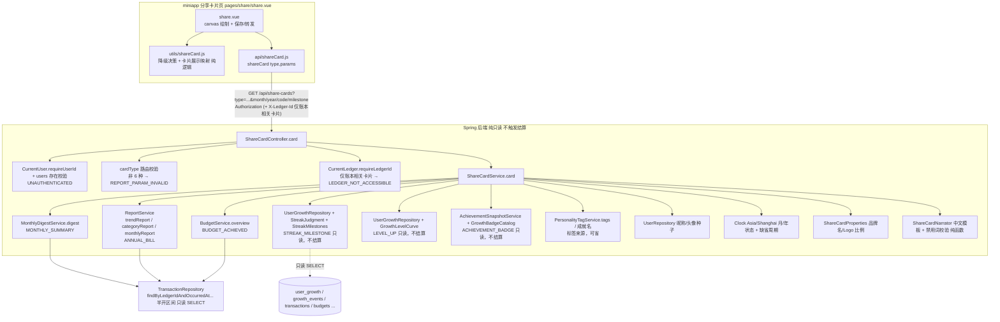

# Design Document

## Overview

分享卡片（Share_Card_System）是「有余」成就展示能力的**纯只读、纯增量**扩展，与已落地的智能月报
（smart-monthly-report）、AI 趣味分析（ai-fun-analysis）、趣味人格标签（fun-personality-tags）、连续记账
（streak-system）、成就（achievement-system）、成长体系（growth-level-system）与预算总览（budget）**并列且解耦**。
它把用户六类「值得晒一晒」的时刻各打包成一张卡片的展示数据——**连续记账里程碑、本月总结、年度账单、获得徽章、
预算达成、成长升级**——由 miniapp 端用 canvas 渲染成一张可保存到相册、可转发给微信好友的图片卡片。

核心链路一句话：**后端新增一个只读聚合接口，按卡片类型复用既有连续/月报/年度/成就/预算/成长的聚合口径，把该卡片的
展示数据包（昵称、文字头像种子、标签、一句 AI 文案、核心数据、卡片可用性、品牌名）打包返回；miniapp 端据此用
canvas 画出卡片并负责保存与转发。把分享卡片整块摘掉，报表/成长/连续/成就/预算/交易等其余功能原样成立。**

设计目标与边界（对齐需求 13「纯增量、纯只读」）：

- **不落库、不迁移、不新增错误码、不新增仓库查询、不产图不存图**：卡片数据是对既有派生指标的**实时只读聚合**，
  不新增数据库表、不新增/修改任何 Flyway 迁移脚本、不对任何表执行写操作、不新增任何错误码、不新增任何 repository
  方法（需求 13.1、13.2、13.3）。复用既有错误码 `UNAUTHENTICATED` / `LEDGER_NOT_ACCESSIBLE` / `REPORT_PARAM_INVALID`。
- **严格只读，不触发结算**：连续/成就/成长的既有「概览类 GET」（`/api/streak`、`/api/achievements`、`/api/growth`）
  是**写入型 GET**——它们在返回前会主动触发一次成长结算（可能写 `growth_events` / `user_growth`）。分享卡片为满足
  需求 13.1「写语句数量为 0」，**绝不复用这些会触发结算的 overview 方法**，而是直接复用它们的**只读判定/换算件**
  （`StreakJudgment`、`StreakMilestones`、`GrowthLevelCurve`、`GrowthBadgeCatalog`、`AchievementSnapshotService`）
  与只读仓库读取，因此取到的是**已持久化状态**——与源子系统 overview「先结算后读」返回的持久化取值同口径同值。
- **模板/规则驱动的一句 AI 文案，非外部 LLM**：卡片文案由一套内置中文模板从核心数据**确定性生成**，措辞轻松、暖心、
  正向；v1 **不接入任何外部大模型/第三方文本生成服务，用户财务数据不出「有余」服务端**（需求 9.2、12.1、12.2）。
- **复用既有聚合口径**：金额一律 `BigDecimal` 保留 2 位小数（HALF_UP）；占比/百分比保留 2 位小数（HALF_UP）；
  自然日/月/年边界一律按 `Asia/Shanghai`（UTC+08:00）；所有金额统计排除 `type=transfer`。这些口径全部沿用
  `ReportService` / `MonthlyDigestService` / `BudgetService` / 成长域既有实现，本设计**优先复用其方法**而非另起炉灶，
  从源头保证与 `/api/reports/*`、`/api/budgets`、`/api/streak`、`/api/achievements`、`/api/growth` 逐值一致（需求 1.10、13.5）。
- **一个只读接口**：新增单个只读接口 `GET /api/share-cards`，落在**新增的** `ShareCardController`，按 `type` 返回该卡片
  的数据包或不可用标识（需求 10）。
- **分享主体是用户自己**：卡片主视觉是用户的成就与数据，品牌 Logo 只作小尺寸点缀（面积占比 ≤5%、不置于视觉中心，
  需求 2.5、2.6）；卡片内不含任何促销、下载引导、二维码（需求 2.6）。
- **降级不阻断**：接口失败/超时或卡片不可用，miniapp 静默隐藏/禁用该卡片，其余页面模块照常（需求 11.7、11.9）。

### 关键设计决策（源自需求「范围与前提约定」）

| 决策 | 取值 | 依据 |
|------|------|------|
| 职责分层 | 后端出数据（只读聚合），前端出图（canvas + 保存/转发），服务端不产图不存图 | 约定 1；需求 10、11 |
| 一句 AI 文案 | 模板/规则驱动，v1 不接外部 LLM，数据不出服务器 | 约定 2；需求 9.2、12.1、12.2 |
| 卡片类型目录（v1） | 恰好 6 种：`STREAK_MILESTONE` / `MONTHLY_SUMMARY` / `ANNUAL_BILL` / `ACHIEVEMENT_BADGE` / `BUDGET_ACHIEVED` / `LEVEL_UP` | 约定 3；需求 1.1 |
| 卡片内容元素 | 头像、昵称、标签（可省）、一句 AI 文案、核心数据、小尺寸品牌 Logo | 约定 4；需求 2.1 |
| 头像口径 | 昵称首字符的文字头像（沿用 `pages/me/me.vue` 的 `nickname.slice(0,1)`），不引入头像图片上传/外链 | 约定 4；需求 2.2 |
| 昵称口径 | 当前登录用户 `nickname`，去空白后为空取「有余用户」（与 `me.vue` 一致） | 约定 4；需求 2.3 |
| 账本语义分层 | 账本无关：`STREAK_MILESTONE` / `ACHIEVEMENT_BADGE` / `LEVEL_UP`；账本相关：`MONTHLY_SUMMARY` / `ANNUAL_BILL` / `BUDGET_ACHIEVED` | 约定 9；需求 1.7、1.8 |
| 年度账单口径 | 自然年（`Asia/Shanghai`），缺省当前自然年；当前年 `partial`、早于当前年 `final`；`trendReport`/`categoryReport` 按年汇总 | 约定 8；需求 5 |
| 严格只读 | 不触发结算，只复用只读判定件与只读仓库读取，写语句数=0 | 约定 6；需求 13.1、13.6 |
| 不落分享记录、不埋点 | v1 无分享记录表、无埋点上报 | 约定 6；需求 13.2 |
| 不含小程序码/二维码 | 转发走微信原生图片分享；卡片图内不绘制小程序码/二维码 | 约定 7；需求 2.6 |
| DTO 形状 | 扁平信封 + 一个 `core` 子对象承载异构的 per-type 可空字段（`core` 为 null ⟺ 卡片不可用），沿用 fun-personality-tags「扁平 record + null 语义」先例 | 需求 1.2、10、12 |
| 品牌名/Logo 比例可配置 | `ShareCardProperties`：`brandName`（默认「有余」）、`logoMaxAreaRatio`（默认 0.05） | 需求 2.5、2.6 |
| 降级 | 接口失败/超时 5000ms、卡片不可用 → miniapp 静默隐藏/禁用，不阻断其余模块 | 需求 11.7、11.9 |

## Architecture

分享卡片是既有分层（Controller → Service → Repository）之上的一层**只读组合器（read-only composer）**：
`ShareCardService` 按卡片类型编排既有报表/预算聚合与既有成长域的**只读判定件**，把该卡片的核心数据算出，交给
`ShareCardNarrator` 用中文模板渲染一句文案，与昵称/头像种子/标签/品牌名一起打包成 `ShareCardResponse`，由
`ShareCardController` 返回。miniapp 端 `pages/share/share.vue` 拿到数据包后用 canvas 画卡片并保存/转发。



要点：

- **鉴权与隔离沿用既有链路**：Spring Security 过滤链统一校验令牌（无效/过期 → `UNAUTHENTICATED`）；控制器补一次
  `users` 存在校验（令牌合法但用户已注销 → `UNAUTHENTICATED`，与 `GrowthController`/`StreakController` 同构）。
  账本相关卡片经 `CurrentLedger.requireLedgerId` 解析 `X-Ledger-Id`（不可访问 → `LEDGER_NOT_ACCESSIBLE`）、无头则
  回退默认账本；账本无关卡片**完全不读取该头**（需求 1.7、10.4）。本接口不新增任何鉴权逻辑。
- **组合优先于重写**：六类卡片的原始指标全部来自既有 `MonthlyDigestService` / `ReportService` / `BudgetService`
  与成长域只读件，天然与源接口同口径（需求 1.10、13.5）；`ShareCardService` 只做**选取与打包**，不触碰任何取数与
  边界逻辑。
- **严格只读、不触发结算（需求 13.1、13.6）**：`ShareCardService.card` 标注 `@Transactional(readOnly = true)`，
  全过程只有 SELECT；连续/成就/成长三类账本无关卡片**不调用会结算的 overview 方法**，改用只读判定件（下文详列），
  写语句数恒为 0。
- **无新增仓库查询**：`ShareCardService` 只调用既有服务方法与既有仓库读取方法（`UserGrowthRepository.findById`、
  `AchievementSnapshotService.snapshot`、`ReportService.*`、`BudgetService.overview`、`UserRepository.findById`），
  **不新增任何 repository 方法、不新增任何 SQL**，坐实纯只读、纯增量（需求 13.1、13.2）。
- **文案与数值解耦**：`ShareCardNarrator` 是纯函数，输入卡片核心数据、输出一句中文文案；不做任何 I/O、不调用任何
  外部服务（需求 9.2、12.1、12.2），可被单测/属性测试直接覆盖「文案数值 == 机器字段」与「禁用词零命中」。

### 鉴权/账本/参数错误的优先级与账本语义分层（重要）

需求 10.6 要求单请求多错误时按「鉴权（`UNAUTHENTICATED`）→ 账本（`LEDGER_NOT_ACCESSIBLE`）→ 参数
（`REPORT_PARAM_INVALID`）」返回最高优先级；需求 1.7 又要求账本无关卡片**绝不因 `X-Ledger-Id` 缺失或不可访问被
拒绝**。二者只有一种自洽实现：**`cardType` 是决定账本语义的路由判别式，必须先于账本解析被识别**。因此控制器固定顺序为：

1. **鉴权**：`currentUser.requireUserId()` + `users` 存在校验 → `UNAUTHENTICATED`（最高优先级）。
2. **`cardType` 路由校验**：非 6 种取值之一 → `REPORT_PARAM_INVALID`（此时卡片账本语义未定义，账本不可访问条件无从
   评估，故不进入账本解析，需求 10.5）。
3. **账本解析（仅账本相关卡片）**：`MONTHLY_SUMMARY` / `ANNUAL_BILL` / `BUDGET_ACHIEVED` 调用
   `currentLedger.requireLedgerId()` → 不可访问抛 `LEDGER_NOT_ACCESSIBLE`；账本无关卡片跳过此步、**不读取
   `X-Ledger-Id`**（需求 1.7）。
4. **周期/标识参数校验**：账本相关卡片的 `month`（`YYYY-MM`）/ `year`（`YYYY`）非法 → `REPORT_PARAM_INVALID`
   （需求 4.7、5.7、7.6）。

对**已识别的账本相关卡片**，第 3 步（账本）严格先于第 4 步（周期参数），完整满足需求 10.6 的「账本 → 参数」次序；
账本无关卡片仅有鉴权与参数两级。这样在「无法归类的 `cardType`」这一唯一角落里返回参数错误，是唯一能同时满足需求
1.7 与 10.6 的取舍，本设计将其作为显式约束固化。

### `partial`/`final` 周期状态与年度汇总

- **月状态**（`MONTHLY_SUMMARY` / `BUDGET_ACHIEVED`）：`monthStatus = month.isBefore(YearMonth.now(clock)) ? "final" : "partial"`
  （需求 4.3）。`partial` 月核心数据基于截至当前时刻的数据（与 `MonthlyDigestService` 一致）。
- **年状态**（`ANNUAL_BILL`）：`yearStatus = year < currentYear ? "final" : "partial"`（需求 5.3）。
- **年度汇总**：`trendReport(ledgerId, YearMonth(year,1), YearMonth(year,12))` 得 12 个月点，年度总收入/总支出为各月点
  之和、年度结余 = 收入 − 支出、支出最高月 = 12 个月点中 expense 最大者（并列取月份小者）；`categoryReport(ledgerId,
  year-01-01, year-12-31, EXPENSE)` 的首项即支出占比最高的分类（需求 5.1）。一年 12 个月 < `trendReport` 的 24 月上限，
  不触发 `REPORT_RANGE_INVALID`。

## Components and Interfaces

### 后端

#### 1. `ShareCardController`（新增，`/api/share-cards`）

选择**新增独立控制器**而非扩展 `ReportController`：分享卡片同时涉及账本相关与账本无关两种语义，且账本无关卡片必须
不读取 `X-Ledger-Id`——`ReportController` 的每个端点都无条件 `currentLedger.requireLedgerId()`，语义不符；独立控制器
可按卡片类型分派账本解析，边界更清晰，也便于 miniapp 端按 `noLedger` 分派请求头（见前端）。

```java
/**
 * 分享卡片接口 /api/share-cards（关联需求 1、2、9、10、11、12、13）。
 *
 * <p>单个只读端点，按 cardType 返回该卡片的数据包或不可用标识。纯只读派生、不触发结算、不落库、
 * 不新增错误码。鉴权 → cardType 路由 → 账本（仅账本相关卡片）→ 周期参数 的固定顺序满足需求 10.6 与 1.7。</p>
 */
@RestController
@RequestMapping("/api/share-cards")
public class ShareCardController {

    private final CurrentUser currentUser;
    private final UserRepository userRepository;
    private final CurrentLedger currentLedger;
    private final ShareCardService shareCardService;
    private final Clock clock;

    // 构造注入省略

    /**
     * 分享卡片数据包（需令牌）。
     *
     * @param type      卡片类型（必填）：STREAK_MILESTONE / MONTHLY_SUMMARY / ANNUAL_BILL /
     *                  ACHIEVEMENT_BADGE / BUDGET_ACHIEVED / LEVEL_UP（区分大小写）
     * @param month     目标月 YYYY-MM（MONTHLY_SUMMARY / BUDGET_ACHIEVED 可选，缺省当前自然月）
     * @param year      目标年 YYYY（ANNUAL_BILL 可选，缺省当前自然年）
     * @param code      成就编码（ACHIEVEMENT_BADGE 可选，缺省取最近解锁）
     * @param milestone 里程碑天数（STREAK_MILESTONE 可选，缺省取已达成最高里程碑）
     */
    @GetMapping
    public ResponseEntity<ShareCardResponse> card(
            @RequestParam("type") String type,
            @RequestParam(value = "month", required = false) String month,
            @RequestParam(value = "year", required = false) String year,
            @RequestParam(value = "code", required = false) String code,
            @RequestParam(value = "milestone", required = false) String milestone) {

        // ① 鉴权（最高优先级）：令牌用户仍存在
        Long userId = requireExistingUserId();

        // ② cardType 路由校验：非 6 种 → REPORT_PARAM_INVALID（需求 10.5）
        ShareCardType cardType = ShareCardType.parse(type); // 非法抛 ApiException.reportParamInvalid("type", ...)

        // ③ 账本解析：仅账本相关卡片；账本无关卡片不读取 X-Ledger-Id（需求 1.7、10.4）
        Long ledgerId = cardType.isLedgerScoped() ? currentLedger.requireLedgerId() : null;

        // ④ 周期参数校验（在账本之后，满足需求 10.6 的账本 → 参数次序）
        ShareCardQuery query = ShareCardQuery.of(cardType, month, year, code, milestone, clock);

        return ResponseEntity.ok(shareCardService.card(userId, ledgerId, query));
    }

    /** 令牌用户仍存在校验，与 GrowthController/StreakController 同构（需求 10.3）。 */
    private Long requireExistingUserId() {
        Long userId = currentUser.requireUserId();
        userRepository.findById(userId).orElseThrow(ApiException::unauthenticated);
        return userId;
    }
}
```

- `ShareCardType.parse` 复用 `ApiException.reportParamInvalid("type", ...)`，**不新增错误码**（需求 10.5、10.9、13.3）。
- 账本相关卡片的 `month`/`year` 解析沿用与 `ReportController.parseMonth` 同款逻辑（`YearMonth.parse` /
  4 位年份校验，失败抛 `ApiException.reportParamInvalid`，需求 4.7、5.7、7.6）。`ShareCardQuery.of` 只解析当前 `type`
  相关的参数，忽略无关参数（需求 10.7）。
- 请求中任何用于指定他人身份的参数/头一律被忽略、且不因携带而报错（方法签名无目标用户入参，需求 10.7）。

#### 2. `ShareCardService`（新增，只读组合器）

```java
@Service
public class ShareCardService {
    private final MonthlyDigestService monthlyDigestService;   // MONTHLY_SUMMARY
    private final ReportService reportService;                 // ANNUAL_BILL（trend/category/monthly）
    private final BudgetService budgetService;                 // BUDGET_ACHIEVED
    private final UserGrowthRepository userGrowthRepository;   // STREAK / LEVEL 只读档案
    private final StreakMilestones streakMilestones;           // 里程碑集合（只读，不写死数值）
    private final GrowthLevelCurve growthLevelCurve;           // 等级曲线（只读）
    private final AchievementSnapshotService achievementSnapshotService; // 成就快照（只读，不结算）
    private final GrowthBadgeCatalog badgeCatalog;             // 成就清单（只读）
    private final PersonalityTagService personalityTagService; // 标签来源（账本相关卡片，可省）
    private final UserRepository userRepository;               // 昵称/头像种子
    private final ShareCardProperties props;                   // 品牌名/Logo 比例
    private final ShareCardNarrator narrator;                  // 中文模板渲染
    private final Clock clock;

    @Transactional(readOnly = true)
    public ShareCardResponse card(Long userId, Long ledgerId, ShareCardQuery query) { ... }
}
```

**职责与编排步骤（全部只读）：**

1. **昵称与头像种子**：读 `userRepository.findById(userId)`；`nickname = 去空白后非空 ? 原值 : "有余用户"`（需求 2.3）；
   `avatarSeed = nickname` 的首个 Unicode 码点（与 `me.vue` 的 `nickname.slice(0,1)` 同口径，需求 2.2）。
2. **按 `cardType` 取核心数据**：见下「4. 逐卡片数据来源与可用条件」。得到 `core`（可用时非空）与 `available` /
   `unavailableReason`。**不可用时 `core=null`、不返回核心数据**（需求 3.4、4.5、5.5、6.3、7.4、8.3）。
3. **标签解析**（可省，需求 2.4）：见下「5. 标签来源」。无可用来源 → `label=null`，不阻断出卡。
4. **文案渲染**：卡片可用时 `narrative = narrator.render(cardType, core)`（1..60 字符、含至少一项核心数值、禁用词零
   命中，需求 9）；关键数值缺失则取该类型内置默认文案兜底（需求 9.7）。不可用时 `narrative=null`。
5. **打包 + 隐私净化**：组装 `ShareCardResponse`；其字段集本身即白名单（见 Data Models），返回前做防御式净化，确保不含
   任何被禁字段（需求 12.3、12.5）。

> **性能（需求 10.8）**：单卡片至多约 1–5 次按账本/用户维度的窗口查询与内存派生，服务端处理远低于 2000ms。选择
> 「组合既有服务」而非「一次取数自算」，是为从实现上保证与既有接口逐值同口径（需求 13.5）。

#### 3. `ShareCardProperties`（新增，`@ConfigurationProperties(prefix = "youyu.share-card")`）

镜像既有 `AiInsightProperties` / `PersonalityTagProperties` 的 JavaBean 绑定风格，集中承载少量可配置项，缺省值即需求
默认值；不新增数据库、不新增错误码。非法取值回退默认。

| 属性 | 默认 | 依据 |
|------|------|------|
| `brandName`（品牌名，去空白后为空回退「有余」） | `有余` | 需求 1.2、2.5 |
| `logoMaxAreaRatio`（Logo 面积占比上限，钳制 0.00–1.00，越界回退 0.05） | `0.05` | 需求 2.5 |

`logoMaxAreaRatio` 供前端绘制与前端/契约测试断言「Logo 面积 ≤ 卡片可见区域 5%」使用（需求 2.5）。

#### 4. 逐卡片数据来源与可用条件（`ShareCardService` 内部，逐类型；全部只读、不触发结算）

统一记号：金额一律 2dp HALF_UP，占比/百分比一律 2dp HALF_UP，均排除 `type=transfer`，边界按 `Asia/Shanghai`。

- **`STREAK_MILESTONE`（连续记账里程碑，需求 3；账本无关）**
  - 来源（**只读、不结算**）：`profile = userGrowthRepository.findById(userId)`；`maxStreakDays = profile?.maxStreakDays`、
    `currentStreak = StreakJudgment.currentStreakDays(profile?.lastRecordDate, profile?.currentStreakDays, LocalDate.now(clock))`
    ——与 `StreakQueryService` 读取侧判定同一实现（需求 1.10、3.1）。里程碑集合取 `streakMilestones` 派生自成就清单
    `MAX_STREAK` 门槛（7/30/100/365），**不在本 spec 写死**（需求 3.1）。
  - 已达成里程碑 = 里程碑集合中 ≤ `maxStreakDays` 的取值；**核心里程碑 = 已达成里程碑的最大取值**（需求 3.2）。
  - 可用当且仅当存在至少一个已达成里程碑（`maxStreakDays ≥ 里程碑最小值`）；核心数据携带 `milestone`（核心里程碑）、
    `currentStreakDays`、`maxStreakDays`（需求 3.3）。否则不可用（`unavailableReason=NO_MILESTONE_ACHIEVED`，需求 3.4）。
  - `milestone` 参数：属于已达成里程碑则以其为核心里程碑；未达成或不属于集合则回退核心里程碑（需求 3.5）。
- **`MONTHLY_SUMMARY`（本月总结，需求 4；账本相关）**
  - 来源：`digest = monthlyDigestService.digest(ledgerId, month)`（复用月报数据包，需求 4.1）。核心数据携带
    `month`（`YYYY-MM`）、`monthStatus`、`income`、`expense`、`balance`（=`digest.netBalance`），
    `topCategoryName`/`topCategoryPercent` 取 `digest.categoryRanking` 首项（可空，需求 4.1、4.4）。
  - 可用当且仅当目标月存在至少一笔计入统计的交易，即 `income > 0 或 expense > 0`（转账已排除，需求 4.4）；否则不可用
    （`NO_TRANSACTIONS`，需求 4.5）。`month` 缺省当前自然月（需求 4.2），格式非法 → `REPORT_PARAM_INVALID`（需求 4.7）。
- **`ANNUAL_BILL`（年度账单，需求 5；账本相关）**
  - 来源：`trendReport` 按年 12 月点汇总 `annualIncome`/`annualExpense`、`annualBalance`、`topExpenseMonth`；
    `categoryReport(year-01-01..year-12-31, EXPENSE)` 首项为 `topCategoryName`（需求 5.1）。核心数据携带 `year`
    （`YYYY`）、`yearStatus`、`annualIncome`、`annualExpense`、`annualBalance`（+ 可空 `topExpenseMonth`/`topCategoryName`，需求 5.4）。
  - 可用当且仅当目标年存在至少一笔计入统计的交易（`annualIncome > 0 或 annualExpense > 0`，需求 5.4）；否则不可用
    （`NO_TRANSACTIONS`，需求 5.5）。`year` 缺省当前自然年（需求 5.2），非 4 位数字或超范围 → `REPORT_PARAM_INVALID`（需求 5.7）。
- **`ACHIEVEMENT_BADGE`（获得徽章，需求 6；账本无关）**
  - 来源（**只读、不结算**）：`snapshot = achievementSnapshotService.snapshot(userId)` + `badgeCatalog.badges()`——与成就
    清单同一份快照（需求 1.10、6.1）。仅以已解锁成就为候选（`snapshot.unlocked(code)`，需求 6.1）。
  - `code` 参数：命中清单且已解锁 → 该成就为核心成就；否则不可用（`BADGE_NOT_UNLOCKED`，需求 6.3）。`code` 缺省
    → 取**解锁时刻最新**的一枚已解锁成就（按对应 `BADGE` 事件 `created_at`，需求 6.4）；无任何已解锁成就 → 不可用
    （`NO_UNLOCKED_ACHIEVEMENT`，需求 6.4）。
  - 核心数据仅携带展示名称（`badgeName`）、中文描述（`badgeDescription`）、精确到自然日的解锁日期（`unlockedDate`
    `YYYY-MM-DD`）；**不下发成就编码之外的内部标识**（需求 6.2、6.6）。
- **`BUDGET_ACHIEVED`（预算达成，需求 7；账本相关）**
  - 来源：`ov = budgetService.overview(ledgerId, month)`（需求 7.1）。核心数据携带 `month`、`totalBudget`、
    `usedAmount`（=`ov.spent`）、`remaining`、`usedPercent`（2dp，据同一 `spent`/`totalBudget` 计算，与
    fun-personality-tags 预算大师同法满足 2dp，需求 7.1）、`budgetStatus`（OK/WARN/OVER）。
  - 可用当且仅当 `ov.hasBudget 且 totalBudget > 0.00 且 spent > 0.00 且 spent ≤ totalBudget`（即 `budgetStatus != OVER`，
    需求 7.3）；否则不可用（`NO_BUDGET_OR_OVER`，需求 7.4）。`month` 缺省当前自然月（需求 7.2），格式非法 →
    `REPORT_PARAM_INVALID`（需求 7.6）。
- **`LEVEL_UP`（成长升级，需求 8；账本无关）**
  - 来源（**只读、不结算**）：`profile = userGrowthRepository.findById(userId)`；`level = profile?.level ?? 1`、
    `exp = profile?.exp ?? 0`、`currentLevelExp = growthLevelCurve.threshold(level)`、
    `expInCurrentLevel = exp − currentLevelExp`、`maxLevelReached = level >= GrowthLevelCurve.MAX_LEVEL(100)`——与
    `GrowthQueryService` 等级换算同一实现同值（需求 1.10、8.1、8.6）。
  - 可用当且仅当 `level ≥ 2`（需求 8.2）；核心数据携带 `level`、`exp`、`expInCurrentLevel`（需求 8.2）。`level == 1`
    不可用（`LEVEL_TOO_LOW`，需求 8.3）。
  - 满级（`level == 100`）时以 `maxLevelReached=true` 替代升级进度，**不返回** `nextLevelExp` 与 `expToNextLevel`
    （置 null，需求 8.4）；未满级时二者非空（`nextLevelExp = threshold(level+1)`、`expToNextLevel = nextLevelExp − exp`）。

#### 5. 标签来源（`ShareCardService` 内部，可省，需求 2.4）

标签是「锦上添花」的一枚简短标签，无可用来源时优雅省略（`label=null`），绝不阻断出卡：

- **账本相关卡片**（`MONTHLY_SUMMARY` / `ANNUAL_BILL` / `BUDGET_ACHIEVED`）：复用
  `personalityTagService.tags(ledgerId, month/当年当月)` 的首枚标签标题为 `label`（同口径、只读）；无标签或兜底态 → null。
- **账本无关卡片**（`STREAK_MILESTONE` / `LEVEL_UP`）：取 `snapshot` 中**最近解锁成就名称**为 `label`；无已解锁成就 → null。
- **`ACHIEVEMENT_BADGE`**：`label` 取该成就的分类中文名（`AchievementCategory.label()`，如「坚持」「积累」），与核心的
  徽章名区分开；无则 null。

标签来源均为既有只读口径，不新增查询；解析失败一律降级为 null（需求 2.4）。

#### 6. `ShareCardNarrator`（新增，中文模板渲染纯函数 + 禁用词校验）

- **输入**：`cardType` 与该卡片 `core`；**输出**：一段中文文案（1..60 个中文字符，需求 9.6）。纯函数，
  **不调用任何外部服务/LLM**（需求 9.2、12.1、12.2）。镜像既有 `TagNarrator`。
- **禁用词汇表（核心约束，需求 9.3）**：内置一份**可逐条枚举核对**的「负面/评判/羞辱/警示词汇表」（如「超支、警告、
  挥霍、剁手、后悔、失控」等）。文案中出现的每个词均**不得命中**该表；渲染后以 `containsForbiddenWord(text)` 自检，
  由属性/单测覆盖。
- **数值一致（需求 2.8、9.5）**：模板中每个数值都直接取自 `core` 并按同口径格式化（金额 2dp、占比 2dp、天数/笔数/
  等级/年月为整数），保证「文案数值 == 机器字段」逐一相等。
- **至少含一项核心数值（需求 9.4）**：每段文案至少包含核心数据中的一项关键数值（里程碑/连续天数/金额/等级/成就名之一）。
- **模板示例（每类，正向/中性）**：
  - `STREAK_MILESTONE`：「连续记账 {milestone} 天达成 🏆 一路坚持到第 {currentStreakDays} 天，稳稳的！」
  - `MONTHLY_SUMMARY`：「{month} 小结 📅 收入 {income} 元、支出 {expense} 元、结余 {balance} 元，记账有条理～」
  - `ANNUAL_BILL`：「{year} 年度账单 ✨ 全年结余 {annualBalance} 元，这一年过得明明白白～」
  - `ACHIEVEMENT_BADGE`：「解锁徽章「{badgeName}」🎖 {unlockedDate} 收入囊中，成就感满满～」
  - `BUDGET_ACHIEVED`：「预算达成 🎯 {month} 只用了预算的 {usedPercent}%，把控得刚刚好～」
  - `LEVEL_UP`：「升到 Lv.{level} 🚀 已累计 {exp} 点成长值，继续向上！」
- **生成失败兜底（需求 9.7）**：若某类型关键数值缺失 → 取该类型内置默认文案（正向、含类型名，1..60 字符），
  不使请求返回错误。

### 前端（miniapp）

#### 7. `api/shareCard.js` 新增（按账本语义分派请求头）

```js
import { http } from '../utils/request'

/** 账本无关卡片：不发送 X-Ledger-Id（对齐 api/streak.js 的 noLedger 写法，需求 1.7）。 */
const LEDGER_INDEPENDENT = new Set(['STREAK_MILESTONE', 'ACHIEVEMENT_BADGE', 'LEVEL_UP'])

/**
 * 分享卡片数据包。type 为 6 种卡片类型之一；params 携带该类型可选周期/标识
 * （month=YYYY-MM / year=YYYY / code / milestone）。纯只读派生。
 * 账本无关卡片带 noLedger:true 不发送 X-Ledger-Id；账本相关卡片默认带 X-Ledger-Id。
 * 沿用 utils/request.js：自动带 Authorization；401 清 token 跳登录；
 * LEDGER_NOT_ACCESSIBLE 自动清本地账本并重试一次。
 */
export function shareCard(type, params = {}) {
  const qs = new URLSearchParams({ type, ...params }).toString()
  const opts = LEDGER_INDEPENDENT.has(type) ? { noLedger: true } : {}
  return http.get(`/share-cards?${qs}`, opts)
}
```

#### 8. `utils/shareCard.js` 新增（纯逻辑，可测试，单一事实源）

镜像 `utils/personalityTags.js` / `utils/insights.js`，把降级决策与展示映射抽成纯函数供 `share.vue` 复用：

- `SHARE_CARD_TIMEOUT_MS = 5000`：请求超时常量（需求 11.9）。
- `LEDGER_SCOPED_TYPES` / `isLedgerScoped(type)`：账本相关卡片集合判定。
- `shouldFetchCard(isLoggedIn, isAll, cardType)`：已登录才请求；账本相关卡片在「全部账本」聚合视图下**不请求不展示**
  （需求 1.9、11.8）。
- `raceWithTimeout(promise, ms)`：`Promise.race` + 定时器超时包装（同 insights/personalityTags）。
- `resolveCardState({ isLoggedIn, isAll, cardType, fetchCard, timeoutMs, isStale })`：加载与静默降级决策核心，返回
  `{ requested, stale, card, cardVisible }`——未登录/聚合视图（账本相关）不请求不展示；失败或 5000ms 超时静默隐藏；
  成功但卡片不可用（`available=false`）→ 隐藏出图/保存/分享入口并展示「暂不可用」；过期响应丢弃；**从不触碰其它页面
  状态**（需求 11.7、11.8、11.9）。
- `cardToDisplay(card)`：白名单式把数据包映射为展示项（`avatarSeed`、`nickname`、`label`、`narrative`、按类型选取的
  核心数值展示串、`brandName`）；优先展示 `narrative`；**绝不引用**邮箱/令牌/其它账本数据（需求 12.3、12.6）。

#### 9. `pages/share/share.vue` 新增（卡片渲染 + 保存 + 转发）

选择**独立分享页**承载出图：从报表页（`MONTHLY_SUMMARY`/`ANNUAL_BILL`/`BUDGET_ACHIEVED`）、连续记账/成长/成就页
（`STREAK_MILESTONE`/`LEVEL_UP`/`ACHIEVEMENT_BADGE`）以 `cardType`（+ 可选周期/编码）跳入；独立页便于集中复用 canvas
出图/保存/分享范式、集中处理授权与超时兜底。账本相关卡片在「全部账本」聚合视图下不提供入口（需求 1.9、11.8）。

- **渲染六元素（需求 2.1、11.1）**：复用 `utils/digest.js` 的 canvas 绘制范式，在卡片上绘制：
  1. **文字头像**：`avatarSeed`（昵称首字符）绘制为圆形文字头像（不含头像图片，需求 2.2）；
  2. **昵称**：`nickname`；
  3. **标签**：`label` 有则显示、无则省略（需求 2.4）；
  4. **一句 AI 文案**：`narrative`（主视觉之一）；
  5. **核心数据**：按 `cardType` 展示核心数值（主视觉，需求 2.5 使核心数据/昵称/文案占主视觉）；
  6. **小尺寸品牌 Logo**：`brandName`（「有余」）绘制于卡片一角（如右下），其占用面积 ≤ 卡片可见区域
     `logoMaxAreaRatio`（5%）、**不置于视觉中心**（需求 2.5）；卡片上不绘制任何促销/下载引导/二维码（需求 2.6）。
- **保存/转发（需求 11.2、11.3）**：复用 `canvasToTempFilePath` 出图、`saveImageToPhotosAlbum` 保存、
  `showShareImageMenu` / `onShareAppMessage` 转发（与 `report.vue` 月报海报、成就分享同源）。
- **相册授权（需求 11.4、11.5）**：保存前若相册写入授权未授予，先发起授权请求；用户拒绝 → 展示需授权提示、不写入、
  停留当前页、不进入错误态；写入成功 → 展示成功提示并停留当前页。
- **出图/保存超时（需求 11.6）**：自触发起 3000ms 内渲染与写入未全部完成 → 结束本次操作、展示失败提示、停留当前页、
  允许再次触发。
- **不可用卡片（需求 11.7）**：`available=false` 时不提供出图/保存/分享入口；用户触发相关入口 → 展示「暂不可用」提示，
  不发起 canvas 绘制、不写相册、不发起转发。
- **未登录（需求 11.8）**：无有效令牌时不发起数据请求、不展示卡片，展示登录入口。
- **数据接口降级（需求 11.9）**：接口返回错误标识或自发起请求起 5000ms 未响应 → 静默降级（隐藏/禁用该卡片），不弹
  阻断性弹窗，不阻断当前页其余交互。

## Data Models

后端不新增任何持久化实体（需求 13.2），仅新增只读响应 DTO（`record`）。因 6 类卡片核心数据异构，采用**扁平信封
`ShareCardResponse` + 一个 `ShareCardCore` 子 record（承载全部 per-type 可空字段）** 表达，`core` 为 null ⟺ 卡片不可用
——沿用 fun-personality-tags 的「扁平 record + 明确 null 语义」先例，便于前端统一消费，字段集即隐私白名单。

```java
/**
 * 分享卡片数据包（需求 1、2、9、10、12）。纯只读派生，不对应任何数据库表、不落库。
 *
 * <p>字段集即隐私白名单：仅含聚合派生统计、昵称、文字头像种子、标签、一句 AI 文案与品牌名；
 * 不含 email / 任何令牌 / plan / wx_openid / wx_unionid / 邀请码 / 其它账本数据 / 原始交易字段
 * （需求 12.3、12.4）。返回前做防御式净化确保不含任何被禁字段（需求 12.5）。</p>
 *
 * @param cardType          卡片类型键（6 种之一，区分大小写，需求 1.1）
 * @param available         卡片是否可用（需求 1.2）
 * @param unavailableReason 不可用原因（可用时为 null）：NO_MILESTONE_ACHIEVED / NO_TRANSACTIONS /
 *                          BADGE_NOT_UNLOCKED / NO_UNLOCKED_ACHIEVEMENT / NO_BUDGET_OR_OVER / LEVEL_TOO_LOW
 * @param nickname          昵称（去空白为空取「有余用户」，需求 2.3）
 * @param avatarSeed        文字头像种子（昵称首字符，需求 2.2）
 * @param label             标签（无可用来源时为 null，需求 2.4）
 * @param narrative         一句 AI 文案（卡片可用时非空、1..60 字符；不可用时为 null，需求 9.1）
 * @param brandName         品牌名（默认「有余」，需求 1.2）
 * @param core              卡片核心数据；卡片不可用时为 null，且不返回任何核心数值（需求 3.4、4.5、5.5、6.3、7.4、8.3）
 */
public record ShareCardResponse(
        String cardType,
        boolean available,
        String unavailableReason,
        String nickname,
        String avatarSeed,
        String label,
        String narrative,
        String brandName,
        ShareCardCore core) {

    /**
     * 卡片核心数据：6 类卡片字段异构，未用到的字段以 null 表达。金额 2dp、占比 2dp、天数/笔数/等级/年月为整数。
     *
     * @param milestone         STREAK_MILESTONE 核心里程碑（需求 3.3）
     * @param currentStreakDays STREAK_MILESTONE 当前连续天数（需求 3.3）
     * @param maxStreakDays     STREAK_MILESTONE 历史最长连续天数（需求 3.3）
     * @param month             MONTHLY_SUMMARY / BUDGET_ACHIEVED 目标月 YYYY-MM（需求 4.4、7.3）
     * @param monthStatus       月状态 partial/final（需求 4.3）
     * @param income            MONTHLY_SUMMARY 本月收入（2dp，需求 4.4）
     * @param expense           MONTHLY_SUMMARY 本月支出（2dp，需求 4.4）
     * @param balance           MONTHLY_SUMMARY 结余（2dp，可负，需求 4.4）
     * @param topCategoryName   MONTHLY_SUMMARY / ANNUAL_BILL 支出占比最高分类名（可空，需求 4.1、5.1）
     * @param topCategoryPercent MONTHLY_SUMMARY 支出占比最高分类占比（%，2dp，可空，需求 4.1）
     * @param year              ANNUAL_BILL 目标年 YYYY（需求 5.4）
     * @param yearStatus        年状态 partial/final（需求 5.3）
     * @param annualIncome      ANNUAL_BILL 年度总收入（2dp，需求 5.4）
     * @param annualExpense     ANNUAL_BILL 年度总支出（2dp，需求 5.4）
     * @param annualBalance     ANNUAL_BILL 年度结余（2dp，需求 5.4）
     * @param topExpenseMonth   ANNUAL_BILL 支出最高的自然月 YYYY-MM（可空，需求 5.1）
     * @param badgeName         ACHIEVEMENT_BADGE 成就展示名称（需求 6.2）
     * @param badgeDescription  ACHIEVEMENT_BADGE 成就中文描述（需求 6.2）
     * @param unlockedDate      ACHIEVEMENT_BADGE 解锁日期 YYYY-MM-DD（需求 6.2）
     * @param totalBudget       BUDGET_ACHIEVED 本月总预算（2dp，需求 7.3）
     * @param usedAmount        BUDGET_ACHIEVED 已用支出（2dp，需求 7.3）
     * @param remaining         BUDGET_ACHIEVED 剩余（2dp，需求 7.3）
     * @param usedPercent       BUDGET_ACHIEVED 已用百分比（%，2dp，需求 7.1、7.3）
     * @param budgetStatus      BUDGET_ACHIEVED 预算状态 OK/WARN/OVER（需求 7.1）
     * @param level             LEVEL_UP 当前等级（需求 8.2）
     * @param exp               LEVEL_UP 经验值（需求 8.2）
     * @param expInCurrentLevel LEVEL_UP 本级内已获得经验（需求 8.2）
     * @param maxLevelReached   LEVEL_UP 是否满级（需求 8.4）
     * @param nextLevelExp      LEVEL_UP 下一等级所需经验（满级为 null，需求 8.4）
     * @param expToNextLevel    LEVEL_UP 升级还需经验（满级为 null，需求 8.4）
     */
    public record ShareCardCore(
            Integer milestone,
            Integer currentStreakDays,
            Integer maxStreakDays,
            String month,
            String monthStatus,
            BigDecimal income,
            BigDecimal expense,
            BigDecimal balance,
            String topCategoryName,
            BigDecimal topCategoryPercent,
            String year,
            String yearStatus,
            BigDecimal annualIncome,
            BigDecimal annualExpense,
            BigDecimal annualBalance,
            String topExpenseMonth,
            String badgeName,
            String badgeDescription,
            String unlockedDate,
            BigDecimal totalBudget,
            BigDecimal usedAmount,
            BigDecimal remaining,
            BigDecimal usedPercent,
            String budgetStatus,
            Integer level,
            Long exp,
            Long expInCurrentLevel,
            Boolean maxLevelReached,
            Long nextLevelExp,
            Long expToNextLevel) { }
}
```

设计说明：

- **不含任何被禁字段（需求 12.3、12.4、12.5）**：DTO 显式**不包含** email、任何令牌、`plan`、`wx_openid`/`wx_unionid`、
  邀请码、其它账本数据、`external_id`、原始备注全文、商户原始标识、附件内容/链接；只含派生统计、昵称、头像种子、
  标签、由核心数据生成的中文文案与品牌名。字段集即白名单，从结构上杜绝隐私外泄；若返回前检测到任一被禁字段则移除
  该字段、照常返回其余合法字段（需求 12.5）。
- **可用/不可用语义**：`available=true` 时 `core` 非空、`narrative` 非空、`unavailableReason=null`；`available=false`
  时 `core=null`、`narrative=null`、`unavailableReason` 为原因串，仍返回 `nickname`/`avatarSeed`/`brandName`（这些为
  用户自身标识，非财务数据）。
- **无持久化实体、无新表、无迁移**（需求 13.1、13.2）。
- **辅助类型**：`ShareCardType`（6 值枚举 + `parse`/`isLedgerScoped`）与 `ShareCardQuery`（按类型解析后的周期/标识值
  载体）为内部只读辅助，非持久化实体。

## Correctness Properties

*A property is a characteristic or behavior that should hold true across all valid executions of a system—essentially, a formal statement about what the system should do. Properties serve as the bridge between human-readable specifications and machine-verifiable correctness guarantees.*

分享卡片的核心是**对既有连续/月报/年度/成就/预算/成长派生指标的纯只读聚合 + 逐卡片确定性门控 + 模板渲染**，其行为随
输入（交易分布、金额、笔数、发生时间、预算、连续天数、里程碑、成就解锁、等级、目标月/年、账本、配置）显著变化，且
存在大量通用不变式（同口径等值、账本隔离、2dp 精度、per-card 门控当且仅当、文案数值一致与禁用词零命中、隐私白名单、
纯只读不写库、前端静默降级、Logo 布局约束）——非常适合属性测试。接口契约（缺省周期、鉴权/账本/参数错误码与优先级、
忽略多余参数、6 种类型枚举）、性能、迁移/仓库查询事实、「不调用外部服务」等负向约束、以及授权/超时/渲染等 UI 交互，
以示例/集成/冒烟/前端手测覆盖（见测试策略），不在本节。

经属性反思，去重合并如下：响应完整性/字段在场/标签可省/文案在场（1.2、2.1、2.4、9.1）归入 P1；昵称与头像映射
（2.2、2.3）归入 P2；同口径模型对照含时区（1.5、1.10、3.1、4.1、5.1、6.1、7.1、8.1、8.6、13.5）归入 P3；账本隔离与
账本无关免疫（1.3、1.7、1.8、2.7、3.6、4.6、5.6、6.5、7.5、8.5、10.7）归入 P4；金额/占比 2dp（1.4）归入 P5；确定性
可复现（1.6）归入 P6；STREAK 门控/算术/参数回退（3.2、3.3、3.4、3.5）归入 P7；MONTHLY 门控与月状态（4.3、4.4、4.5）
归入 P8；ANNUAL 门控/年状态/年度聚合（5.1、5.3、5.4、5.5）归入 P9；ACHIEVEMENT 门控/最近解锁选取（6.2、6.3、6.4）
归入 P10；BUDGET 门控（7.3、7.4）归入 P11；LEVEL 门控/满级（8.2、8.3、8.4）归入 P12；文案正确性（2.8、9.3、9.4、9.5、
9.6、9.7）归入 P13；隐私白名单（6.6、12.3、12.4、12.5）归入 P14；纯只读不写库（10.1、13.1、13.6）归入 P15；前端静默
降级（1.9、11.7、11.8、11.9、12.6）归入 P16；前端 Logo 布局约束（2.5）归入 P17。

### Property 1: 响应完整性与可用/不可用语义

*For any* 用户、账本上下文、卡片类型与底层数据集合，分享卡片响应都携带 `cardType`、`available`、`nickname`、
`avatarSeed`、`brandName`；当 `available` 为真时 `core` 非空、`narrative` 为非空文案、`unavailableReason` 为 null，且
`nickname`/`avatarSeed`/`narrative`/`core`/`brandName` 五项恒在场、`label` 可为 null（无来源时省略而不使卡片失败）；
当 `available` 为假时 `core` 为 null、`narrative` 为 null、`unavailableReason` 为非空原因串，且不返回任何核心数值。

**Validates: Requirements 1.2, 2.1, 2.4, 9.1**

### Property 2: 昵称与文字头像种子映射

*For any* 用户 `nickname`（含含空白、纯空白或缺省），分享卡片的 `nickname` 在去首尾空白后为空时取「有余用户」、否则为
原昵称，且 `avatarSeed` 恒等于该 `nickname` 的首个 Unicode 码点（与 `pages/me/me.vue` 同口径），不引入任何头像图片
上传或外链。

**Validates: Requirements 2.2, 2.3**

### Property 3: 同口径一致（模型对照）

*For any* 用户、账本、目标周期与底层数据集合，分享卡片核心数据都与其来源子系统在相同用户/账本/周期/统计口径下逐值
相等（差值为 0）：`STREAK_MILESTONE` 的当前/最长连续天数与里程碑集合等于 `StreakJudgment`/`StreakMilestones` 的读取侧
取值；`MONTHLY_SUMMARY` 的收入/支出/结余等于 `MonthlyDigestService.digest`；`ANNUAL_BILL` 的年度收入/支出/结余等于
`ReportService.trendReport` 各月点之和、支出最高月等于其最大 expense 月、支出最高分类等于 `categoryReport` 首项；
`BUDGET_ACHIEVED` 的预算/已用等于 `BudgetService.overview` 的 `totalBudget`/`spent`；`ACHIEVEMENT_BADGE` 的名称/描述/
解锁日期等于成就快照对应 `BADGE` 事件；`LEVEL_UP` 的等级/经验/进度等于 `GrowthLevelCurve` 换算——全部排除
`type=transfer`、按 `Asia/Shanghai` 边界、金额 2dp HALF_UP。

**Validates: Requirements 1.5, 1.10, 3.1, 4.1, 5.1, 6.1, 7.1, 8.1, 8.6, 13.5**

### Property 4: 账本隔离与账本无关免疫

*For any* 两个账本 A、B 各自的随机数据，账本相关卡片（`MONTHLY_SUMMARY`/`ANNUAL_BILL`/`BUDGET_ACHIEVED`）在账本 A 下
的结果与「仅存在 A 数据」时逐值相同（B 的任何数据不计入）；账本无关卡片（`STREAK_MILESTONE`/`ACHIEVEMENT_BADGE`/
`LEVEL_UP`）的结果不随 `X-Ledger-Id`（缺失、任意合法值或指向不可访问账本）改变、且跨该用户全部账本按用户维度取数；
任一卡片都只派生自当前用户有权访问的数据，忽略请求中任何指定他人身份的参数/头且不因携带而改变结果。

**Validates: Requirements 1.3, 1.7, 1.8, 2.7, 3.6, 4.6, 5.6, 6.5, 7.5, 8.5, 10.7**

### Property 5: 金额与占比 2 位小数

*For any* 用户、账本、周期与数据集合，返回的 `core` 中所有金额字段（`income`、`expense`、`balance`、`annualIncome`、
`annualExpense`、`annualBalance`、`totalBudget`、`usedAmount`、`remaining`）均保留 2 位小数（HALF_UP），所有占比/
百分比字段（`topCategoryPercent`、`usedPercent`）在有定义时均保留 2 位小数（HALF_UP）。

**Validates: Requirements 1.4**

### Property 6: 确定性可复现

*For any* 用户、账本上下文、卡片类型、周期参数与固定的底层数据，在同一时钟时刻多次请求同一卡片返回完全一致的
`available`、`unavailableReason` 与全部核心数据取值（纯只读派生，无随机、无隐式时区依赖）。

**Validates: Requirements 1.6**

### Property 7: STREAK_MILESTONE 门控、里程碑算术与参数回退

*For any* 用户与历史最长连续天数，已达成里程碑恰为里程碑集合中不大于历史最长连续天数的取值，核心里程碑为已达成里程碑
的最大取值；授予 `STREAK_MILESTONE`（`available=true`）当且仅当存在至少一个已达成里程碑，授予时核心数据携带核心里程碑、
当前连续天数与历史最长连续天数；无任何已达成里程碑时 `available=false`、返回原因、不抛错；当 `milestone` 参数属于已达成
里程碑时以其为核心里程碑，否则（未达成或不属于集合）回退核心里程碑。

**Validates: Requirements 3.2, 3.3, 3.4, 3.5**

### Property 8: MONTHLY_SUMMARY 门控与月状态

*For any* 账本、目标月与交易集合，月状态为 `final` 当且仅当目标月早于当前自然月、否则为 `partial`；授予
`MONTHLY_SUMMARY` 当且仅当目标月在当前账本存在至少一笔计入统计的交易（收入 > 0 或支出 > 0，转账已排除），授予时核心
数据携带 `month`、`monthStatus`、`income`、`expense`、`balance`；无计入交易时 `available=false`、返回原因、不抛错。

**Validates: Requirements 4.3, 4.4, 4.5**

### Property 9: ANNUAL_BILL 门控、年状态与年度聚合

*For any* 账本、目标年与跨月交易集合，年状态为 `final` 当且仅当目标年早于当前自然年、否则为 `partial`；年度总收入/总支出
恰为该年 12 个自然月收入/支出之和、年度结余为二者之差、支出最高月为 12 月点中支出最大者；授予 `ANNUAL_BILL` 当且仅当
目标年在当前账本存在至少一笔计入统计的交易，授予时核心数据携带 `year`、`yearStatus`、`annualIncome`、`annualExpense`、
`annualBalance`；无计入交易时 `available=false`、返回原因、不抛错。

**Validates: Requirements 5.1, 5.3, 5.4, 5.5**

### Property 10: ACHIEVEMENT_BADGE 门控与最近解锁选取

*For any* 用户与成就解锁集合，仅已解锁成就为候选；当 `code` 参数命中清单且已解锁时以其为核心成就并携带展示名称、中文
描述与解锁日期；`code` 不在清单或未解锁时 `available=false`、返回原因、不抛错；`code` 缺省时取解锁时刻最新的一枚已解锁
成就，无任何已解锁成就时 `available=false`、返回原因、不抛错。

**Validates: Requirements 6.2, 6.3, 6.4**

### Property 11: BUDGET_ACHIEVED 门控

*For any* 账本、目标月与预算/支出集合，授予 `BUDGET_ACHIEVED` 当且仅当「已设总预算 且 总预算 > 0.00 且 已用支出 > 0.00
且 已用支出 ≤ 总预算（即状态非 OVER）」，授予时核心数据携带 `month`、`totalBudget`、`usedAmount`、`remaining`、
`usedPercent`（2dp）；未设预算、已用支出为 0.00 或超支时 `available=false`、返回原因、不抛错。

**Validates: Requirements 7.3, 7.4**

### Property 12: LEVEL_UP 门控与满级语义

*For any* 用户等级与经验，授予 `LEVEL_UP` 当且仅当当前等级 ≥ 2，授予时核心数据携带等级、经验与本级内已获得经验；
当前等级为 1 时 `available=false`、返回原因、不抛错；满级（等级 100）时 `maxLevelReached=true` 且 `nextLevelExp` 与
`expToNextLevel` 均为 null，未满级时二者非空。

**Validates: Requirements 8.2, 8.3, 8.4**

### Property 13: 一句 AI 文案正确性（数值一致、禁用词与长度）

*For any* 可用卡片，其 `narrative` 要么是一段渲染好的中文文案、要么在关键数值缺失时取该卡片类型内置默认文案（均不报错）；
当文案存在时：至少包含核心数据中一项关键数值（里程碑/连续天数/金额/等级/成就名之一）；文案中出现的每个数值都与对应
核心字段完全相等（金额 2dp、占比 2dp、天数/笔数/等级/年月为整数）；长度为 1 到 60 个中文字符；文案中出现的每个词均
**不命中**系统预定义且可枚举的「负面/评判/羞辱/警示词汇表」（即仅采用正向或中性措辞）。

**Validates: Requirements 2.8, 9.3, 9.4, 9.5, 9.6, 9.7**

### Property 14: 隐私白名单（数据包不含被禁字段）

*For any* 用户、账本、周期与数据集合，分享卡片响应的全部字段集合仅为聚合派生统计、昵称、文字头像种子、标签、一句 AI
文案与品牌名，绝不包含用户邮箱、任何访问/刷新令牌、`plan`、`wx_openid`/`wx_unionid`、邀请码、任何不属于当前请求账本
的其它账本数据，也不包含 `external_id`、原始备注全文、商户原始标识或附件内容/链接；`ACHIEVEMENT_BADGE` 核心数据仅含
名称/描述/解锁日期，不含成就编码之外的内部标识；若返回前检测到任一被禁字段则移除后照常返回其余合法字段、不改其取值。

**Validates: Requirements 6.6, 12.3, 12.4, 12.5**

### Property 15: 纯只读不写库

*For any* 用户、账本、卡片类型、周期与初始数据库状态，调用分享卡片接口（一次或多次，含账本无关卡片）后，`transactions`、
`categories`、`merchants`、`budgets`、`growth_events`、`user_growth`、`streak_segments` 及其它任何数据库表的行数与全部
列取值均保持不变（零写入副作用、零 DDL、不触发结算）；即使卡片聚合或渲染过程中发生异常被隔离，既有数据同样保持不变。

**Validates: Requirements 10.1, 13.1, 13.6**

### Property 16: 前端静默降级（`utils/shareCard.js` 纯逻辑）

*For any* 登录态、聚合视图状态、卡片类型、请求结果/超时/过期与卡片可用性，前端加载决策都满足：未登录时不发起请求且
卡片不可见；账本相关卡片在「全部账本」聚合视图下不发起请求且卡片不可见；请求失败或达到 5000ms 超时时卡片不可见；
卡片不可用（`available=false`）时不提供出图/保存/分享入口；请求期间切换账本/周期使响应过期时丢弃该响应不覆盖卡片；
展示映射 `cardToDisplay` 只取白名单展示字段（头像种子、昵称、标签、文案、按类型的核心数值、品牌名），绝不引用邮箱/
令牌/其它账本数据；且该决策只产出分享卡片自身状态，从不返回或改动任何其它页面状态。

**Validates: Requirements 1.9, 11.7, 11.8, 11.9, 12.6**

### Property 17: 前端品牌 Logo 布局约束（`utils/shareCard.js` / 布局纯函数）

*For any* 画布尺寸，卡片布局函数为品牌 Logo 计算的占用面积不超过卡片可见区域面积的 `logoMaxAreaRatio`（默认 5%），
且 Logo 的包围盒不落入卡片视觉中心区域（核心数据、昵称与一句 AI 文案占据主视觉），布局元素集合中不含任何促销文案、
下载引导或二维码元素。

**Validates: Requirements 2.5, 2.6**

## Error Handling

分享卡片接口**不新增任何错误码**，完全复用既有统一错误体 `{code, message, field}` 与既有工厂方法（对齐需求 10、12、13.3）：

| 场景 | 处理 | 错误码（既有） | 需求 |
|------|------|----------------|------|
| 未携带/签名失败/过期/用户不存在的令牌 | Security 过滤链 + 控制器 `users` 存在校验抛出，响应不含任何卡片数据 | `UNAUTHENTICATED`（401） | 10.3 |
| `cardType` 非 6 种取值之一 | `ShareCardType.parse` 抛 `ApiException.reportParamInvalid("type", ...)` | `REPORT_PARAM_INVALID`（400，`field=type`） | 10.5 |
| 账本相关卡片的 `X-Ledger-Id` 指向无权访问账本 | `CurrentLedger.requireLedgerId` → `LedgerService.requireAccessible` 抛出 | `LEDGER_NOT_ACCESSIBLE`（404） | 10.4 |
| `MONTHLY_SUMMARY`/`BUDGET_ACHIEVED` 的 `month` 非 `YYYY-MM` 或月份不在 01–12 | 控制器 `parseMonth` 捕获 `DateTimeParseException` | `REPORT_PARAM_INVALID`（400，`field=month`） | 4.7、7.6 |
| `ANNUAL_BILL` 的 `year` 非 4 位数字或超范围 | 控制器 `parseYear` 校验 | `REPORT_PARAM_INVALID`（400，`field=year`） | 5.7 |
| 账本相关卡片未携带 `X-Ledger-Id` 头 | `CurrentLedger` 回退当前用户默认账本，正常处理 | —— | 1.8 |
| 账本无关卡片携带任意/坏 `X-Ledger-Id` 头 | 完全不读取该头，正常处理 | —— | 1.7 |
| 卡片可用条件不满足（无里程碑/无交易/未解锁/无预算或超支/等级 1） | **非错误**：`available=false` + `unavailableReason`，`core`/`narrative` 为 null | —— | 3.4、4.5、5.5、6.3、6.4、7.4、8.3 |
| 单请求同时多种错误 | 固定顺序「鉴权 → `cardType` 路由 → 账本（仅账本相关卡片）→ 周期参数」，只返回最高优先级错误码 | 见上 | 10.6 |
| 某卡片关键数值缺失导致文案生成失败 | **非错误**：取该类型内置默认文案兜底，保留核心数据 | —— | 9.7 |
| 非法配置（品牌名空白、Logo 比例越界） | **非错误**：回退默认值（「有余」/0.05）继续 | —— | 2.5 |
| 依赖的内部聚合统计异常 | 隔离该失败，不返回任何原始数据；既有接口仍按移除本功能前行为成功返回、数据库不变 | —— | 13.6 |

失败一律零副作用（纯只读，天然无写入回滚问题）。发生任何鉴权/账本/参数错误时不返回任何卡片数据（需求 10.3、10.4、
10.5、10.6）。卡片聚合/渲染异常被隔离，既有接口仍按移除本功能前的行为成功返回、数据库数据保持不变（需求 13.6）。

前端降级（需求 11）：

- **未登录不请求**：无有效令牌时不发起请求、不展示卡片，展示登录入口（需求 11.8）。
- **聚合视图不展示账本相关卡片**：`ledgerStore.isAll` 为真时不请求也不展示 `MONTHLY_SUMMARY`/`ANNUAL_BILL`/
  `BUDGET_ACHIEVED`（需求 1.9、11.8）。
- **接口失败/5000ms 超时静默隐藏**：`Promise.race` + 定时器超时；错误标识或超时 → `cardVisible=false`，不弹阻断性
  弹窗，不阻断当前页其余交互（需求 11.9）。
- **卡片不可用**：`available=false` → 隐藏出图/保存/分享入口；用户触发相关入口 → 展示「暂不可用」提示，不发起 canvas
  绘制、不写相册、不发起转发（需求 11.7）。
- **相册授权拒绝**：展示需授权提示、不写入、停留当前页、不进入错误态（需求 11.4）。
- **出图/保存 3000ms 超时**：结束本次操作、展示失败提示、停留当前页、允许再次触发（需求 11.6）。
- **过期响应丢弃**：请求期间切换账本/周期使响应过期 → 丢弃，不覆盖卡片（需求 11.9）。

## Testing Strategy

采用**单元测试 + 属性测试**双轨，并对不适合 PBT 的部分补充控制器契约测试、集成/冒烟测试与前端 vitest 测试。后端属性
测试沿用仓库既有技术栈 **jqwik**（见 `MonthlyDigestServicePropertyTest`、`PersonalityTagServicePropertyTest`、
`ReportPropertyTest` 既有约定），服务层测试用 `@DataJpaTest` + H2（`MODE=MySQL`）+ 真实 Repository + 固定注入
`Asia/Shanghai` 的 `Clock`，编排真实 `MonthlyDigestService`/`ReportService`/`BudgetService` 与成长域只读件，
**不自造属性框架、不使用 mock**。

### 属性测试（后端，`ShareCardServicePropertyTest` 等）

- 每条属性对应上文 Property 1–15，各以**单个** jqwik `@Property` 实现，最少 100 次迭代（`@Property(tries = 100)` 起）。
- 生成器产出随机的交易（随机 `type` 含 transfer 噪声、随机金额/`occurredAt`/分类/商户，跨账本、跨月、跨年）、随机预算、
  随机 `user_growth` 档案（等级/经验/连续天数/最长连续/最近记账日）与随机 `growth_events`（`BADGE` 解锁事件）；随机化
  「当前时刻」与目标月/年的相对位置以覆盖 `partial`/`final`；随机化门控边界附近取值（刚好达到/刚好不足里程碑、收入/
  支出恰为 0、预算刚好等于已用、等级恰为 1/2/100）以覆盖门控两侧；随机化 `nickname`（含空白/纯空白/缺省）覆盖头像
  种子映射；随机化 `X-Ledger-Id`（缺失/合法/不可访问）覆盖账本无关卡片免疫。
- 每次迭代使用**独立 `userId`/`ledgerId`**（共用同一内存 H2、跨迭代复用），隔离各次随机数据（沿用既有属性测试范式，
  jqwik 属性方法经 `TestContextManager` 在 `@BeforeTry` 手工完成依赖注入）。
- **模型对照（model-based）**：Property 3、7–12 以既有 `MonthlyDigestService.digest`、`ReportService.trendReport/
  categoryReport/monthlyReport`、`BudgetService.overview`、`StreakJudgment`/`StreakMilestones`、`GrowthLevelCurve`、
  `AchievementSnapshotService` 或就地暴力实现为参照，断言核心数据逐值相等（`isEqualByComparingTo`），直接坐实需求 1.10、
  13.5 的同口径。年度聚合以「12 次 monthlyReport 之和」为参照对照 `ANNUAL_BILL`。
- **Property 15（只读不写库）**：在调用前后对 `transactions`/`categories`/`merchants`/`budgets`/`growth_events`/
  `user_growth`/`streak_segments`（及全表清单）做行数与内容快照，断言完全一致；额外断言分享卡片路径**未触发结算**
  （对照调用前后 `growth_events` 无新增）。
- **Property 14（隐私白名单）**：将响应序列化为 JSON，断言字段名集合是白名单的子集，且不含任何邮箱/令牌样式取值、
  `plan`/`wx_openid`/`wx_unionid`/邀请码字段与 `external_id`/原始 `note`/商户原始标识字段。
- **Property 13（禁用词）**：以 `ShareCardNarrator` 的可枚举禁用词表逐词断言文案零命中，并断言数值一致与长度 1..60。
- 每个属性测试须以 Javadoc 注释标注其对应设计属性，格式：
  `Feature: share-card, Property {number}: {property_text}`，并保留 `Validates: Requirements X.Y` 风格注释。

### 单元 / 边界测试（后端）

- `ShareCardServiceTest`（`@DataJpaTest`）：具体示例覆盖各卡片典型场景与边界——STREAK 恰好达成/差一天里程碑、
  milestone 参数命中/未命中/非集合值（3.5）；MONTHLY 空月/只含转账月（4.5）、`partial`/`final`（4.3）；ANNUAL 跨月
  聚合、支出最高月并列取小者、空年（5.5）；ACHIEVEMENT 指定/缺省/未解锁/未知 code（6.2–6.4）、最近解锁选取；
  BUDGET 未设预算/已用为 0/超支/达成四分支（7.3、7.4）；LEVEL 等级 1/2/100（8.2–8.4）；文案缺关键数值兜底（9.7）；
  非法配置回退默认（2.5）。避免与属性测试重复堆砌大量用例。
- `ShareCardNarratorTest`：纯函数直接单测各类型模板的数值一致、禁用词零命中、缺关键数值的默认文案分支。
- `ShareCardPropertiesTest`：`brandName` 空白回退「有余」、`logoMaxAreaRatio` 越界回退 0.05。

### 控制器契约 / 集成 / 冒烟 / 回归

- `ShareCardControllerTest`（MockMvc / 既有集成测风格）：
  - 6 种合法 `cardType` 均可返回、非法 `cardType` → `REPORT_PARAM_INVALID`（需求 1.1、10.5）；
  - 无/坏令牌 → `UNAUTHENTICATED`，响应无卡片数据（需求 10.3）；
  - 账本相关卡片越权 `X-Ledger-Id` → `LEDGER_NOT_ACCESSIBLE`（需求 10.4）；账本无关卡片带坏 `X-Ledger-Id` 仍正常返回
    （需求 1.7）；
  - 账本相关卡片非法 `month`/`year` → `REPORT_PARAM_INVALID`（需求 4.7、5.7、7.6）；无 `X-Ledger-Id` → 默认账本（需求 1.8）；
  - 缺省 `month`/`year` 取当前月/年（需求 4.2、5.2、7.2）；
  - 多错误并存按「鉴权 → cardType → 账本 → 参数」优先级返回（需求 10.6）；
  - 携带指定他人身份的多余参数/头被忽略且不报错（需求 10.7）。
- **契约不回归（需求 13.3、13.4）**：既有报表/预算/月报/连续/成就/成长/交易接口的现有测试保持通过，字段集与错误码集合
  不变；本功能以独立端点、独立控制器、独立服务、独立 DTO 引入，不修改既有代码路径。
- **无迁移 / 无新增仓库查询（需求 13.2）**：构建期/评审确认未新增或修改任何 Flyway 脚本、未新建任何表、未新增任何
  repository 方法（仅复用既有服务与既有查询）——冒烟/静态检查。
- **不依赖外部服务（需求 12.1、12.2）**：`ShareCardService`/`ShareCardNarrator` 无任何 HTTP 客户端/外部依赖注入；
  代码评审 + 单测在无网络环境下通过即证。
- **性能（需求 10.8）**：可选集成计时冒烟，验证单卡片服务端处理在 2000ms 内（不作为 PBT，避免环境波动误报）。
- **依赖不可用兜错（需求 13.6）**：注入使内部聚合抛错的场景，断言既有接口不受影响、数据库零写入。

### 前端测试（miniapp vitest，需求 1.9、2.5、11、12）

- `utils/shareCard.js` 纯逻辑单测/属性测（对应 Property 16）：未登录不请求不展示；账本相关卡片在聚合视图不请求不展示；
  请求失败或 5000ms 超时静默隐藏；`available=false` 关闭出图/保存/分享入口；`stale`（请求期间切换账本/周期）跳过应用；
  决策从不改动其它页面状态（需求 1.9、11.7、11.8、11.9）。
- `cardToDisplay` 字段隔离单测（Property 16 / 需求 12.6）：展示映射只取白名单字段（`avatarSeed`、`nickname`、`label`、
  `narrative`、按类型的核心数值、`brandName`），绝不引用邮箱/令牌/其它账本数据。
- 卡片布局纯函数单测/属性测（对应 Property 17，需求 2.5、2.6）：对任意画布尺寸 Logo 面积占比 ≤ `logoMaxAreaRatio`、
  Logo 不落入视觉中心、布局元素集合不含推广/二维码元素。
- 出图/保存 3000ms 超时决策单测（需求 11.6）；相册授权拒绝、写入成功、canvas 渲染六元素、转发等 UI 交互以手测/组件级
  校验覆盖（需求 11.1、11.3、11.4、11.5）。
