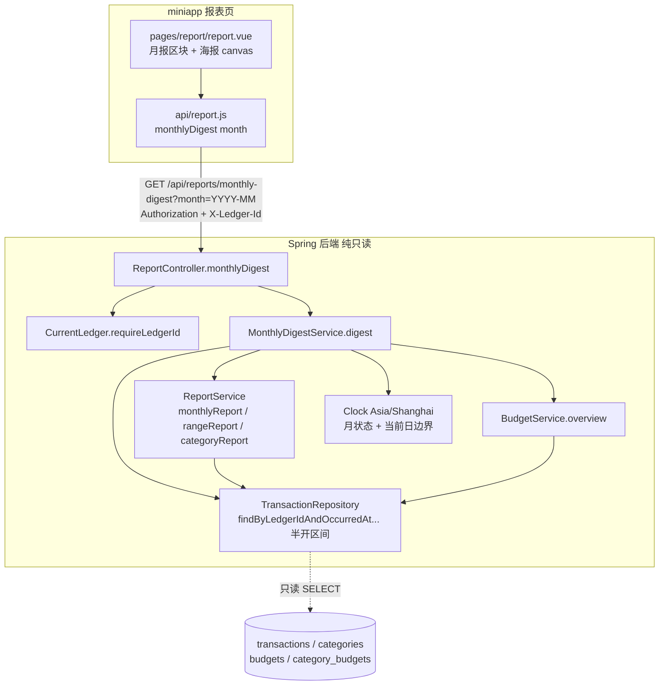

# Design Document

## Overview

智能月报（Smart_Monthly_Report_System）是「有余」报表能力的**纯只读、纯增量**扩展。它针对某一自然月，
把用户最关心的九项信息一次性聚合成一份可读、可分享的月度小结：本月收入、本月支出、结余、消费趋势、
分类排行、预算情况、最大单笔消费、最省钱的一周，以及一张在 miniapp 端渲染的可保存/分享月报配图。

设计目标与边界（对齐需求 11「纯增量、纯只读」）：

- **不落库、不迁移**：月报是对既有 `transactions`、`categories`、`budgets`、`category_budgets` 的**实时聚合派生**，
  不新增数据库表、不新增/修改任何 Flyway 迁移脚本、不对任何表执行写操作。
- **复用既有口径**：金额一律 `BigDecimal` 保留 2 位小数（HALF_UP）；百分比保留 2 位小数、分类占比之和恒为
  100.00（末项余数校正）；自然月/自然日边界一律按 `Asia/Shanghai`（UTC+08:00）；所有金额统计排除
  `type=transfer`。这些口径全部沿用 `ReportService` / `BudgetService` 的既有实现，本设计**优先复用其方法**
  而非另起炉灶，从源头保证与 `/api/reports/*`、`/api/budgets` 逐值一致（需求 11.5）。
- **一个只读接口**：新增单个只读接口 `GET /api/reports/monthly-digest`，一次返回九个模块的数据包。
  不新增错误码、不改任何既有接口的请求/响应契约（需求 9、11.3）。
- **配图在前端**：后端只提供数据；月报配图（海报）由 miniapp 用 canvas 渲染并保存/分享，卡片内容只含当前
  账本月报关键数据，绝不含其它账本数据、邮箱与令牌内容（需求 8）。
- **降级不阻断**：月报接口失败或超时，报表页静默隐藏月报区块，其余既有报表照常展示（需求 10）。

一句话：**聚合既有数据 + 组织成月报 + 前端出图；把整块摘掉，报表/预算/交易原样成立。**

### 关键设计决策（源自需求「范围与前提约定」）

| 决策 | 取值 | 依据 |
|------|------|------|
| 目标月缺省 | 当前自然月（`Asia/Shanghai`） | 需求 1.2 |
| 月状态 | `partial`（目标月=当前月）/ `final`（目标月早于当前月） | 需求 1.3、1.4 |
| 收支/结余口径 | 复用 `ReportService.monthlyReport`（全月半开区间，无未来交易故与「截至当前」等值） | 需求 2、11.5 |
| 消费趋势 | 复用 `ReportService.rangeReport` 按日明细，再补齐缺失日为 0.00（稠密化） | 需求 3 |
| 分类排行 | 复用 `ReportService.categoryReport`（排序 + 占比校正 + 笔数） | 需求 4 |
| 预算情况 | 复用 `BudgetService.overview`（总预算/已支出/剩余/usedPercent/status/health 前瞻） | 需求 5 |
| 最大单笔 / 最省钱的一周 | 新增内存计算，直接读取月内交易一次 | 需求 6、7 |
| 周分段 | 自 1 日起每 7 自然日一段，仅完整 7 日段参评；`partial` 仅评起止均 ≤ 当前日的完整段 | 需求 7 |
| 账本隔离 | 复用 `CurrentLedger`（`X-Ledger-Id` 解析 + 默认账本兜底）；全部账本聚合视图不展示 | 需求 1.5、1.9、9.3 |

## Architecture

月报是既有分层（Controller → Service → Repository）之上的一层**只读组合器（read-only composer）**：
`MonthlyDigestService` 编排既有 `ReportService` / `BudgetService`，并补充两项月内交易计算，打包成一个响应。



要点：

- **鉴权与隔离沿用既有链路**：Spring Security 过滤链统一校验令牌（无效/过期/用户不存在 → `UNAUTHENTICATED`）；
  `CurrentLedger` 解析 `X-Ledger-Id`（不可访问 → `LEDGER_NOT_ACCESSIBLE`）。月报接口不新增任何鉴权逻辑。
- **组合优先于重写**：收支、趋势、分类、预算四模块直接调用既有服务方法，天然与 `/api/reports/*`、`/api/budgets`
  同口径（需求 11.5）。仅「最大单笔消费」「最省钱的一周」为月报特有，作内存计算。
- **单次事务只读**：`MonthlyDigestService.digest` 标注 `@Transactional(readOnly = true)`，全过程无任何写语句
  （需求 11.1）。

## Components and Interfaces

### 后端

#### 1. `ReportController.monthlyDigest`（新增一个端点，落在既有控制器）

```java
/** 智能月报：month 为 YYYY-MM，缺省取 Asia/Shanghai 当前自然月。一次返回九个模块数据包。 */
@GetMapping("/monthly-digest")
public ResponseEntity<MonthlyDigestResponse> monthlyDigest(
        @RequestParam(name = "month", required = false) String month) {
    Long ledgerId = currentLedger.requireLedgerId();                  // 未认证/账本不可访问在此抛既有错误
    YearMonth ym = (month == null || month.isBlank())
            ? YearMonth.now(clock)                                    // 需求 1.2 缺省当前月
            : parseMonth(month, "month");                             // 非法格式 → REPORT_PARAM_INVALID（需求 9.4）
    return ResponseEntity.ok(digestService.digest(ledgerId, ym));
}
```

- 复用 `ReportController` 既有的 `parseMonth`（`YearMonth.parse` 失败抛 `ApiException.reportParamInvalid("month", ...)`）、
  `currentLedger`、`clock`，不新增任何解析或错误码。
- 路径落在既有 `@RequestMapping("/api/reports")` 下，与其余报表同前缀。

#### 2. `MonthlyDigestService`（新增，只读组合器）

```java
@Service
public class MonthlyDigestService {
    private final ReportService reportService;
    private final BudgetService budgetService;
    private final TransactionRepository transactionRepository;
    private final CategoryRepository categoryRepository;
    private final Clock clock;

    @Transactional(readOnly = true)
    public MonthlyDigestResponse digest(Long ledgerId, YearMonth month) { ... }
}
```

编排步骤（全部只读）：

1. **月状态**：`status = month.isBefore(YearMonth.now(clock)) ? "final" : "partial"`（需求 1.3、1.4）。
   计算趋势/周分段的「结束边界」：`final` → 月末日；`partial` → `LocalDate.now(clock)`（当前日）。
2. **收支结余**：`reportService.monthlyReport(ledgerId, month)` → `income/expense/netBalance`（需求 2、11.5）。
3. **消费趋势**：`reportService.rangeReport(ledgerId, monthStart, endBoundary)` 得稀疏按日明细，再**稠密化**：
   若月内有计入交易，则在 `[monthStart, endBoundary]` 内逐日补 0.00（升序、无缺日）；月内无任何计入交易则返回空序列
   （需求 3.1–3.6）。
4. **分类排行**：`reportService.categoryReport(ledgerId, monthStart, endBoundary)` → 排序 + 占比校正 + 笔数；
   对名称为空的分类项套用回退名 `"已删除分类"`（需求 4，尤其 4.5）。
5. **预算情况**：`budgetService.overview(ledgerId, month)` → 抽取 `hasBudget/totalBudget/spent/remaining/usedPercent/status`；
   前瞻 `health` 仅在 `overview` 返回非空时携带（其内部规则：当前月且已设预算才给），恰好满足「`partial` 且已设预算才前瞻、
   `final` 不前瞻」（需求 5.1–5.5）。
6. **最大单笔消费 / 最省钱的一周**：一次性读取月内交易 `transactionRepository
   .findByLedgerIdAndOccurredAtGreaterThanEqualAndOccurredAtLessThan(ledgerId, monthStart, nextMonthStart)`，
   过滤 `type=expense` 后在内存计算（需求 6、7）。
   - 最大单笔：按 `amount` 取最大，并列时 `occurred_at` 更晚者优先、再 `id` 更大者优先（需求 6.3）。
   - 最省钱的一周：按 `[1–7]、[8–14]…` 完整 7 日段分组；`partial` 仅纳入 `endDay ≤ 当前日` 的完整段；
     各段支出合计取最低，并列取起始更早者（需求 7）。

> **性能（需求 9.6）**：单账本单月数据量小，上述至多约 5 次按账本+月份的窗口查询与内存聚合，服务端处理远低于
> 2000ms。之所以选择「组合既有服务」而非「一次取数自算全部」，是为从实现上保证与既有接口逐值同口径（需求 11.5）；
> 若未来需要，可在不改契约的前提下改为单次取数聚合。

#### 3. `TransactionRepository`

**无新增方法**。复用既有 `findByLedgerIdAndOccurredAtGreaterThanEqualAndOccurredAtLessThan`（半开区间，账本隔离），
与 `ReportService` / `BudgetService` 同一查询，保证边界与隔离口径一致。

### 前端（miniapp）

#### 4. `api/report.js` 新增方法

```js
/**
 * 智能月报聚合。month 为 YYYY-MM（缺省由后端取当前月）。
 * 返回九模块数据包 { month, monthStatus, income, expense, netBalance,
 *   trend, categoryRanking, budget, largestExpense, mostFrugalWeek }。
 */
export function monthlyDigest(month) {
  return http.get(`/reports/monthly-digest?month=${month}`)
}
```

沿用 `utils/request.js`：自动带 `Authorization` 与 `X-Ledger-Id`；401 清 token 跳登录；`LEDGER_NOT_ACCESSIBLE`
自动清本地账本重试一次。月报请求同其它报表共用此网络层。

#### 5. `pages/report/report.vue` 新增月报区块 + 海报

- **数据加载**：在既有 `load()` 中，当 `!ledgerStore.isAll` 且已登录（有 token）时并行请求 `monthlyDigest(month.value)`；
  用独立的 `digest`/`digestVisible` 响应式状态，**与其它报表相互独立**（需求 10.2）。
- **降级**（需求 10）：为月报请求设 5000ms 超时（`Promise.race` + 定时器）；请求失败或超时 → `digestVisible=false`
  静默隐藏月报区块，不弹阻断性错误，不影响分类占比/趋势等既有模块；未登录不发起请求也不展示；全部账本聚合视图
  （`ledgerStore.isAll`）不展示月报区块（需求 1.9、10.3）。
- **区块渲染**：展示目标月标识 `YYYY-MM` 与月状态徽标（进行中/已完结）、收入/支出/结余、趋势迷你图、分类排行
  Top、预算情况、最大单笔、最省钱的一周（需求 2.5）。
- **海报（需求 8）**：月报数据加载成功后展示「生成月报配图」入口；点击后用 `<canvas>` +
  `uni.createCanvasContext` / `uni.canvasToTempFilePath` 渲染卡片（至少含目标月、收入、支出、结余），
  再经 `uni.saveImageToPhotosAlbum` 保存或 `uni.showShareMenu`/转发分享。卡片只绘制当前账本月报字段，
  不含任何邮箱/令牌/其它账本数据。相册授权被拒 → `uni.showModal` 提示去授权，报表页不进入错误态；
  出图失败 → `uni.showToast` 提示失败，月报数据与其余内容保持正常展示。

## Data Models

后端不新增任何持久化实体，仅新增只读响应 DTO（`record`）。字段命名与既有报表/预算 DTO 对齐，并复用既有嵌套
`record` 以显式表达「同口径」。

```java
/**
 * 智能月报聚合响应（需求 1、9）。纯只读派生，不对应任何数据库表。
 *
 * @param month          目标月 YYYY-MM（Asia/Shanghai 边界）
 * @param monthStatus    月状态：partial（进行中）/ final（已完结）
 * @param income         本月收入（排除转账，2 位小数）——与 /api/reports/monthly 同值
 * @param expense        本月支出（排除转账，2 位小数）——与 /api/reports/monthly 同值
 * @param netBalance     结余 = income - expense（可为负）
 * @param trend          消费趋势：按自然日升序、稠密（范围内每日一项）；空月为空列表
 * @param categoryRanking 分类排行：金额降序、id 升序、占比合计 100.00、含笔数
 * @param budget         预算情况；未设预算/前瞻缺省以字段空值表达
 * @param largestExpense 最大单笔消费；无支出为 null
 * @param mostFrugalWeek 最省钱的一周；无完整周分段为 null
 */
public record MonthlyDigestResponse(
        String month,
        String monthStatus,
        BigDecimal income,
        BigDecimal expense,
        BigDecimal netBalance,
        List<RangeReportResponse.DayPoint> trend,          // 复用：{date, income, expense}
        List<CategoryReportResponse.CategoryShare> categoryRanking, // 复用：{categoryId, categoryName, amount, percentage, count}
        BudgetDigest budget,
        LargestExpense largestExpense,
        FrugalWeek mostFrugalWeek) {

    /**
     * 预算情况（口径同 BudgetService.overview）。
     * @param hasBudget   是否已设月度总预算；false 时其余预算字段为 null（需求 5.3）
     * @param totalBudget 月度总预算（未设为 null）
     * @param spent       本月已支出（排除转账）
     * @param remaining   剩余 = 总预算 - 已支出（未设为 null）
     * @param usedPercent 已用百分比（未设为 0）
     * @param status      OK / WARN(>=80%) / OVER(>100%)；未设为 null
     * @param forecast    预算前瞻，仅 partial 且已设预算时非 null；final 或未设预算为 null（需求 5.4、5.5）
     */
    public record BudgetDigest(
            boolean hasBudget,
            BigDecimal totalBudget,
            BigDecimal spent,
            BigDecimal remaining,
            int usedPercent,
            String status,
            BudgetOverviewResponse.BudgetHealth forecast) { }  // 复用：{daysLeft, dailyAvailable, projectedBalance, projectedOver}

    /**
     * 最大单笔消费（需求 6）。
     * @param amount       金额（2 位小数）
     * @param categoryName 分类名称（已删除分类回退为 "已删除分类"）
     * @param date         发生日期 YYYY-MM-DD
     * @param note         备注（缺省为空串）
     */
    public record LargestExpense(
            BigDecimal amount,
            String categoryName,
            String date,
            String note) { }

    /**
     * 最省钱的一周（需求 7）：目标月内支出合计最低的完整 7 日分段。
     * @param startDate 起始日期 YYYY-MM-DD
     * @param endDate   结束日期 YYYY-MM-DD
     * @param expense   该段支出合计（排除转账，2 位小数）
     */
    public record FrugalWeek(
            String startDate,
            String endDate,
            BigDecimal expense) { }
}
```

设计说明：

- **复用嵌套 `record`**：`trend` 用 `RangeReportResponse.DayPoint`、`categoryRanking` 用
  `CategoryReportResponse.CategoryShare`、`budget.forecast` 用 `BudgetOverviewResponse.BudgetHealth`。这是**只读复用**，
  不改动这些既有 `record` 的字段集，因此不触碰既有接口契约（需求 11.3）。
- **空/缺省语义**：空月的 `trend` 为空列表、`categoryRanking` 为空列表、`largestExpense`/`mostFrugalWeek` 为 `null`、
  `income/expense/netBalance` 为 `0.00`（需求 1.7、3.6、4.6、6.4、7.5）；未设预算时 `budget.hasBudget=false` 且
  `totalBudget/remaining/status/forecast` 为 `null`（需求 5.3）。

### 周分段模型（需求 7）

对目标月第 `d` 日（`d` 从 1 起），段序号 `k = floor((d-1)/7)`，第 `k` 段覆盖第 `7k+1 … 7k+7` 日。
只有当 `7k+7 ≤ 当月天数` 时该段为**完整段**（恰好 7 日）。`partial` 时再要求 `7k+7 ≤ 当前日`。示例：
2 月（28 日）恰好 4 个完整段；7 月（31 日）4 个完整段（末 3 日 29–31 不成段）。

## Correctness Properties

*A property is a characteristic or behavior that should hold true across all valid executions of a system—essentially, a formal statement about what the system should do. Properties serve as the bridge between human-readable specifications and machine-verifiable correctness guarantees.*

智能月报的核心是**对既有交易/预算数据的纯只读聚合**，其收支、趋势、分类、预算模块的行为随输入（交易分布、金额、
日期、分类、预算设定）显著变化，且存在大量通用不变式（同口径等值、稠密无缺日、占比合计恒 100.00、确定性 tie-break、
只读不写库）——非常适合属性测试。海报渲染、前端降级、鉴权链、性能与迁移事实等则以示例/集成/冒烟测试覆盖（见下方
测试策略），不在本节。

经属性反思，去重合并如下：收支三项（2.1–2.4）合并入同口径与结余等式；月标识/月状态/九模块齐备（1.1、2.5、9.1）
合并为打包完整性属性；账本隔离（1.5、9.5）合并；预算字段与前瞻（5.1、5.2、5.4、5.5）合并为「预算同口径」属性；
空月各分支（1.7、3.6、4.6、6.4、7.5）合并为「空数据优雅返回」属性；口径一致（11.5）分散并入相应模块属性。

### Property 1: 月报打包完整性与月状态正确

*For any* 账本、目标月与月内交易集合，月报响应都应携带合法的目标月标识（`YYYY-MM`）、九个模块字段（收入、支出、
结余、消费趋势、分类排行、预算情况、最大单笔消费、最省钱的一周、以及供配图使用的上述关键数据），且月状态取值为
`final` 当且仅当目标月早于当前自然月、否则为 `partial`。

**Validates: Requirements 1.1, 1.3, 1.4, 2.5, 9.1**

### Property 2: 收支结余同口径且结余为差

*For any* 账本、目标月与月内交易集合，月报的本月收入、本月支出分别等于 `ReportService.monthlyReport` 对同一账本与月份
返回的收入、支出（均排除转账、2 位小数 HALF_UP），且结余恒等于本月收入减本月支出（当支出大于收入时为负）。

**Validates: Requirements 1.6, 2.1, 2.2, 2.3, 2.4, 11.5**

### Property 3: 账本隔离

*For any* 两个账本 A、B 各自的随机交易集合，账本 A 的月报与「仅存在 A 的交易」时生成的月报逐值相同——B 的任何交易
都不计入 A 的任一模块。

**Validates: Requirements 1.5, 9.5**

### Property 4: 消费趋势稠密、升序、双值且窗口正确

*For any* 账本、目标月与至少含一笔计入交易的月内交易集合，消费趋势序列按日期严格升序，覆盖结束边界内每个自然日恰
一项（无缺日，缺日的收入与支出均为 0.00），每项携带该日收入与支出合计（2 位小数）；其中结束边界为：`final` 月取月末日、
`partial` 月取当前日（不含任何晚于当前日的日期）。

**Validates: Requirements 3.1, 3.2, 3.3, 3.4, 3.5**

### Property 5: 分类排行同口径、确定性与占比守恒

*For any* 账本、目标月与月内交易集合，分类排行等于 `ReportService.categoryReport` 对同一账本与月份范围的结果：每项携带
分类 id、名称（对应分类缺失时回退为 `"已删除分类"` 且该项不丢失）、金额、占比、笔数；按金额降序、金额相等时分类 id
升序排列（结果确定唯一，与输入顺序无关）；当月内存在支出时全部占比之和恒为 `100.00`。

**Validates: Requirements 4.1, 4.2, 4.3, 4.4, 4.5, 11.5**

### Property 6: 预算情况同口径且前瞻按月状态给出

*For any* 账本、目标月与任意（含未设/已设）总预算，月报预算模块的 `hasBudget/totalBudget/spent/remaining/usedPercent/status`
与 `BudgetService.overview` 对同一账本与月份逐值一致（已支出排除转账；已用 >100% 为 OVER、>=80% 为 WARN、否则 OK）；
前瞻信息 `forecast` 非空当且仅当月状态为 `partial` 且已设总预算，`final` 月或未设预算时为 `null`。

**Validates: Requirements 5.1, 5.2, 5.3, 5.4, 5.5, 11.5**

### Property 7: 最大单笔消费选择与确定性 tie-break

*For any* 账本、目标月与月内交易集合，若存在计入的支出交易，则最大单笔消费的金额等于所有计入支出的最大金额，并携带该笔的
金额、分类名称、发生日期与备注（备注缺省为空串）；当多笔金额并列最大时，选中 `occurred_at` 更晚者、`occurred_at` 相同则
`id` 更大者（结果确定唯一）。

**Validates: Requirements 6.1, 6.2, 6.3**

### Property 8: 最省钱的一周分段、选择与窗口

*For any* 账本、目标月与月内交易集合，参与评比的周分段均为自 1 日起每 7 个自然日的**完整**分段（`partial` 月还要求整段起止
均不晚于当前日）；若存在至少一个可评比的完整分段，则最省钱的一周为其中支出合计（排除转账、2 位小数）最低者，并携带该段起始
日期、结束日期（= 起始 + 6 天）与支出合计；多个分段并列最低时取起始日期最早者（结果确定唯一）。

**Validates: Requirements 7.1, 7.2, 7.3, 7.4, 7.6**

### Property 9: 空数据优雅返回

*For any* 目标月内不存在任何计入交易（或不存在计入支出、或不存在完整周分段）的账本，月报都不抛出错误，并按语义返回空/零值：
本月收入、支出、结余为 `0.00`，消费趋势为空列表，分类排行为空列表，最大单笔消费为 `null`，最省钱的一周为 `null`。

**Validates: Requirements 1.7, 3.6, 4.6, 6.4, 7.5**

### Property 10: 纯只读不写库

*For any* 账本、目标月与初始数据库状态，调用月报聚合接口（一次或多次）后，`transactions`、`categories`、`budgets`、
`category_budgets` 以及其它任何数据库表的行数与全部列取值均保持不变（零写入副作用）。

**Validates: Requirements 11.1**

## Error Handling

月报接口**不新增任何错误码**，完全复用既有统一错误体 `{code, message, field}` 与既有工厂方法（对齐需求 9、11.3）：

| 场景 | 处理 | 错误码（既有） | 需求 |
|------|------|----------------|------|
| 未携带/签名失败/过期/用户不存在的令牌 | Security 过滤链 + `CurrentUser` 抛出，响应不含任何月报数据 | `UNAUTHENTICATED`（401） | 9.2 |
| `X-Ledger-Id` 指向无权访问的账本 | `CurrentLedger.requireLedger` → `LedgerService.requireAccessible` 抛出 | `LEDGER_NOT_ACCESSIBLE`（404） | 9.3 |
| `month` 参数非 `YYYY-MM` | 控制器 `parseMonth` 捕获 `DateTimeParseException` | `REPORT_PARAM_INVALID`（400，`field=month`） | 9.4 |
| 目标月无计入数据 | **非错误**：返回零值/空列表（见 Property 9） | —— | 1.7、3.6、4.6、6.4、7.5 |

失败一律零副作用（纯只读，天然无写入回滚问题）。响应发生任何错误时不返回任何月报字段（需求 9.2、9.3、9.4）。

前端降级（需求 10）：

- **超时/失败静默隐藏**：miniapp 对月报请求设 5000ms 超时；接口返回错误标识或超时 → `digestVisible=false` 隐藏月报区块，
  不弹阻断性错误弹窗，报表页其余既有报表（分类占比、月度趋势、成员占比等）按各自逻辑照常展示且取值不受影响。
- **未登录不请求**：无有效令牌时不发起月报请求、不展示月报区块。
- **全部账本视图不展示**：`ledgerStore.isAll` 为真时不请求也不展示月报（无单一账本上下文）。
- **海报错误**：相册授权被拒 → 提示去授权，报表页不进入错误态；出图失败 → 提示失败，月报数据与其余内容保持正常展示。

## Testing Strategy

采用**单元测试 + 属性测试**双轨，并对不适合 PBT 的部分补充集成/冒烟/前端测试。后端属性测试沿用仓库既有技术栈
**jqwik**（见 `src/test/java/.../*PropertyTest.java` 既有约定），服务层测试用 `@DataJpaTest` + H2（`MODE=MySQL`）
+ 真实 Repository（对齐既有 `ReportServiceTest`），不自造属性框架。

### 属性测试（后端，`MonthlyDigestServicePropertyTest` 等）

- 每条属性对应上文 Property 1–10，各以**单个** jqwik `@Property` 实现，最少 100 次迭代（`@Property(tries = 100)` 起）。
- 生成器产出随机月内交易（随机 type 含 transfer、随机金额/日期/分类、跨账本），并随机化目标月与固定注入的
  `Clock`（`Asia/Shanghai`）以覆盖 `partial`/`final`、空月、并列最大、并列最省钱周、缺失分类名、月末不足 7 日等边界。
- 每个属性测试须以 Javadoc 注释标注其对应设计属性，格式：
  `Feature: smart-monthly-report, Property {number}: {property_text}`，并保留既有 `Validates: Requirements X.Y` 风格注释。
- Property 2/5/6 采用**模型对照（model-based）**：以既有 `ReportService.monthlyReport/categoryReport`、
  `BudgetService.overview` 为参照实现，断言 digest 分量与之逐值相等，直接保证需求 11.5 的同口径。
- Property 10（只读不写库）：在调用前后对四表（及全表清单）做行数与内容快照，断言完全一致。

### 单元 / 边界测试（后端）

- `MonthlyDigestServiceTest`（`@DataJpaTest`）：具体示例覆盖 `partial`/`final` 月状态、稠密趋势填零、
  最大单笔 tie-break、周分段（2 月恰 4 段 / 7 月末 3 日不成段 / `partial` 当前日不足 7 天返回 null）、
  未设预算与已设预算前瞻、已删除分类回退名等。避免与属性测试重复堆砌大量用例。
- `ReportControllerTest`（MockMvc / `@WebMvcTest` 或既有集成测风格）：
  - 缺省 `month` 取当前月（需求 1.2）；
  - 无/坏令牌 → `UNAUTHENTICATED`，响应无月报字段（需求 9.2）；
  - 越权 `X-Ledger-Id` → `LEDGER_NOT_ACCESSIBLE`（需求 9.3）；
  - 非法 `month` → `REPORT_PARAM_INVALID`（需求 9.4）。

### 集成 / 冒烟 / 回归

- **契约不回归（需求 11.3、11.4）**：既有报表/预算/交易接口的现有测试保持通过，字段集与错误码集合不变；月报以独立端点、
  独立服务、独立 DTO 引入，不修改既有代码路径。
- **无迁移（需求 11.2）**：构建期/评审确认未新增或修改任何 Flyway 脚本、未新建任何表（冒烟/静态检查）。
- **性能（需求 9.6）**：可选集成计时冒烟，验证单账本单月服务端处理在 2000ms 内（不作为 PBT，避免环境波动误报）。

### 前端测试（miniapp，需求 8、10）

- 海报生成为 canvas 平台能力，采用**手测 / 组件级校验**：验证卡片仅绘制来自 `digest` 的当前账本字段（含目标月、收入、
  支出、结余），绝不含邮箱/令牌/其它账本数据；保存相册与分享入口可用；授权被拒与出图失败的提示不使页面进入错误态。
- 降级行为手测 / mock：月报请求失败或 5000ms 超时时静默隐藏区块、其余报表取值不变；未登录不请求；全部账本视图不展示。
