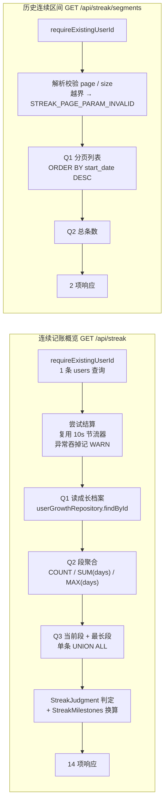
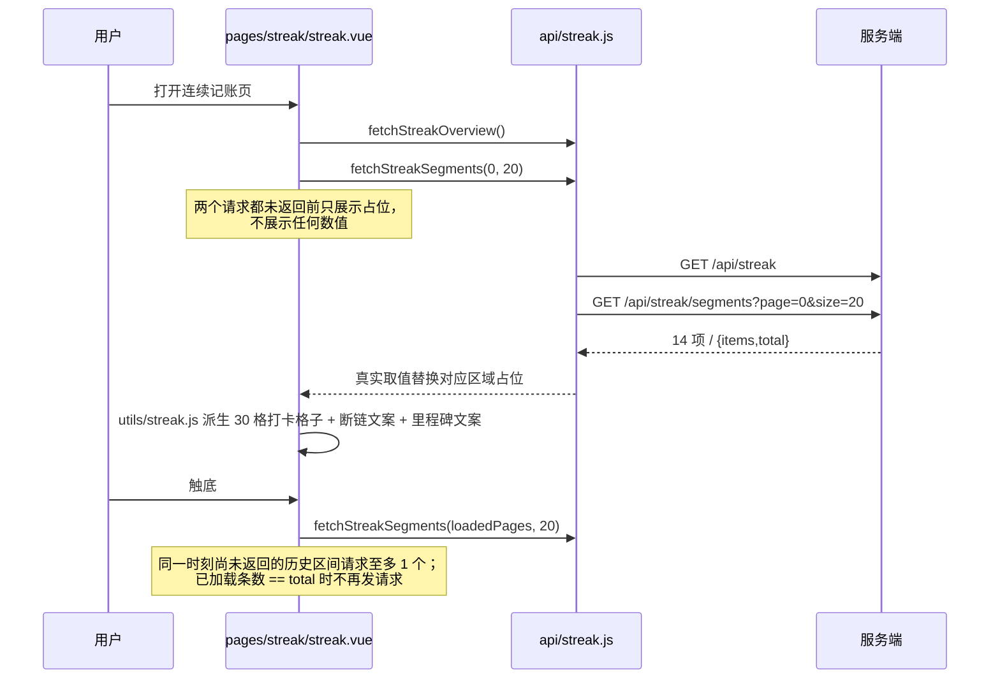
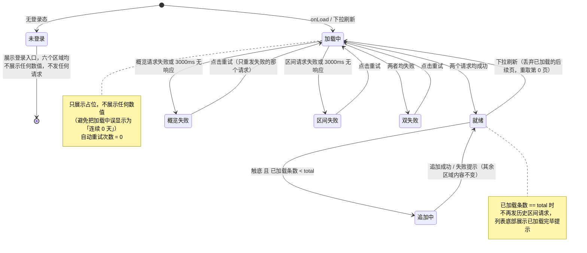

# Design Document

## Overview

连续记账（Streak）系统把「坚持」从 `user_growth` 里两个孤立的数字，扩成一条可分页回看的轨迹。
新增的唯一事实源是 `streak_segments`——把记账日历切成一段段极大的连续自然日区间逐段落表。

一句话概括实现：**段序列是记账日历的派生视图，段维护寄生在成长体系既有结算的末位，
每次结算做一次「全量重算 + 差异写入」的对账；两个新接口只读，不碰成长体系与成就系统的任何一行。**

「断一次不清零」由两件事共同落地：

1. **数据层**：中断只让当前段停止延长、下次记账另起一段。已落表的旧段一行不改，
   `max_streak_days` 不减，`STREAK_*` 成就不撤销。段总数单调不减。
2. **展示层**：中断时连续记账页展示「上次连续 N 天」与重新开始的引导，
   全页可见文案禁含「归零 / 清空 / 失败 / 中断」四类字样；历史区间墙把过去每一段永久留在页面上。

刻意**不做补签**——理由见 requirements.md「范围与前提约定」第 1 项，此处不重复。

### 边界（明确不做的事）

- **不建第二张表**。只新增 `streak_segments`，不为任何既有表增删列，不改 `ck_growth_events_type`
  的取值集合，不写任何 `event_type` 为 `BADGE` / `STREAK` 的成长事件。
- **不写 `growth_events` 与 `user_growth`**。段维护对这两表只有 SELECT。经验、等级、
  成就解锁状态、播报游标一律不动。
- **不新增结算触发时机**。段维护发生在 `GrowthSettlementService` 已有的
  `@Transactional(REQUIRES_NEW)` 事务内，复用它已经持有的 `user_growth` 行级写锁。
  不引入定时任务、消息队列、`@Async`、线程池与任何执行器。
- **不改成长概览的响应字段集**。growth-level-system 需求 10.13 把它钉死为 15 项，不加第 16 项。
  连续记账的数据一律由两个新接口下发。
- **不提供补签 / 断签保护 / 连续冻结接口**，不提供任何合并两个不相邻段的操作，
  不提供在运行期直写段行的接口与配置项。
- **不在 miniapp 内实现第二套连续段划分**，也不在任何地方写死里程碑数值 7 / 30 / 100 / 365。
- **不放宽既有耗时预算**：结算仍 ≤1000ms、记账端到端仍 ≤2000ms。
- **不回填存量用户的段**。`V34__streak.sql` 建完表即结束，各用户的段序列由其下一次结算惰性建立。

### 新增 / 改动一览

**服务端新增**

| 文件 | 作用 |
|---|---|
| `db/migration/V34__streak.sql` | 建 `streak_segments`（7 列 + 1 唯一约束 + 1 复合索引 + 2 具名 CHECK），不回填 |
| `domain/StreakSegment.java` | 段实体 |
| `repository/StreakSegmentRepository.java` | 段仓储：对账读全量、历史分页、概览聚合、注销硬删、修复删除 |
| `service/StreakSegmentView.java` | 段的不可变值对象（起始日 / 结束日 / 天数），纯函数的返回元素 |
| `service/StreakJudgment.java` | 「当前连续天数 / 是否中断 / 今日已完成」三项判定的**唯一**纯函数实现 |
| `service/StreakSegmentMaintainer.java` | 段维护：全量重算 + 差异写入（ODKU / 修复删除），结算末位步骤 |
| `service/StreakMilestones.java` | 里程碑集合，从成就清单常量中 `MAX_STREAK` 口径的门槛派生 |
| `service/StreakQueryService.java` | 两个查询接口的组装（概览 3 条读查询 / 历史分页 2 条） |
| `service/StreakOverviewResponse.java` | 概览响应，**恰好 14 个分量** |
| `service/StreakSegmentPageResponse.java` / `StreakSegmentItem.java` | 历史分页响应（顶层 2 项 / 每项 3 项） |
| `api/StreakController.java` | `GET /api/streak`、`GET /api/streak/segments` |

**服务端改动（全部为增量，不改既有语义）**

| 文件 | 改动 |
|---|---|
| `service/GrowthCalendarService.java` | 新增纯函数 `segments(List<LocalDate>)`；`scan` 的入参、返回值与行为**一字不改** |
| `service/GrowthSettlementService.java` | `recalculateAndWriteBack` 末尾追加一行段维护调用；其余步骤顺序、语义、写入内容不变 |
| `service/GrowthQueryService.java` | `correctedCurrentStreak` 改为委托 `StreakJudgment`（纯重构，取值逐例不变） |
| `service/AccountDeletionService.java` | 第 12.7 步：在游标硬删之后、删 `users` 行之前硬删该用户的段行 |
| `error/ApiException.java` | 新增 `streakPageParamInvalid(String field)` → `STREAK_PAGE_PARAM_INVALID` |
| `deploy/reset-db.sql` | 新增 `TRUNCATE TABLE streak_segments;` |

**miniapp 新增 / 改动**

| 文件 | 作用 |
|---|---|
| `src/api/streak.js` | 两个请求（`noLedger: true`，不发 `X-Ledger-Id`） |
| `src/utils/streak.js` | 纯逻辑：30 格打卡格子、断链文案、里程碑文案、翻页与刷新判定、禁词表 |
| `src/pages/streak/streak.vue` | 连续记账页（六个区域 + 下拉刷新 + 触底翻页 + 重试） |
| `src/pages.json` | 注册 `pages/streak/streak`，页面级 `enablePullDownRefresh: true` |
| `src/pages/growth/growth.vue` | 新增「连续记账」入口一行，展示今日打卡与当前连续两项 |

---

## Architecture

### 写入侧：段维护寄生在既有结算的末位

```mermaid
flowchart TD
    A[记账 / 导入提交\nTransactionService] -->|afterCommit| B[GrowthSettlementTrigger\nsettleQuietly 吞异常]
    A2[GET /api/growth 成长概览] -->|10s 节流| C
    A3[GET /api/streak 连续记账概览] -->|复用同一节流器| C
    B --> C[GrowthSettlementService.settle\n@Transactional REQUIRES_NEW]

    C --> D[① 节流判定 事务外]
    D --> E[② ODKU 建档 + FOR UPDATE NOWAIT\n500ms 墙钟预算取行锁]
    E --> F[③ 读事实源 / ④ 组装 / ⑤ 批量写 growth_events]
    F --> G[⑥ recalculateAndWriteBack\n重读完整日历 → scan → 写回物化列]
    G --> H["⑦ 段维护（本 spec 新增末位步骤）\nStreakSegmentMaintainer.maintain"]
    H --> I[事务提交]

    H -.->|任何异常穿出| J[整个结算事务回滚\n记账已提交结果不受影响]
    J -.->|边界外 catch| K["只记 WARN\n[STREAK_MAINTAIN_FAILED]"]
```

三条被复用而非新建的机制：

1. **触发时机**。段维护没有自己的入口，只在 `settle` / `recalculateOnly` 内被调用。
   记账侧 60 秒节流、概览侧 10 秒节流一律沿用，本 spec 不新增节流器。
2. **并发串行化**。`settle` 第 ② 步已对 `user_growth` 那一行加了行级写锁
   （`FOR UPDATE NOWAIT` + 500ms 墙钟预算 + 20/40/80ms 退避）。段维护在锁内执行，
   因此**同一用户的两次段维护天然串行**——不需要为段再加一把锁、也不需要应用层的先查后写。
   `uk_streak_segments_user_start` 是最后一道兜底（跨实例、锁被绕过等极端情形）。
3. **故障隔离**。`maintain` 刻意**不 catch 任何异常**（与 `settle` 同一条禁令）：
   异常必须穿出才能让 `REQUIRES_NEW` 事务回滚，吞异常只能发生在事务边界之外的
   `GrowthSettlementTrigger.settleQuietly` 与 `GrowthQueryService.getOverview` /
   `StreakQueryService.getOverview` 三处。段维护失败 ⇒ 本次结算整体回滚 ⇒ 段与物化列一起退回旧值，
   下一次结算重新对账自愈。

### 段维护 = 每次结算做一次全量对账

段维护只有**一条**代码路径，没有「增量路径」与「修复路径」之分：

```
读全量已持久化段  →  用本次已加载的日历重算应有段序列  →  逐项 diff  →  只写差异行
```

这样做的收益是三条不变式**构造性成立**，而不是靠测试凑巧对上：

- **增量结果 == 全量结果**（需求 4.9）：因为每次结算做的就是全量对账，不存在第二条增量路径。
- **无变化即无写入**（需求 4.8、4.11）：日历没新增日期 ⇒ 重算结果与已持久化段逐项相同 ⇒ diff 为空 ⇒ 0 条 SQL。
- **存量用户惰性建立 + 脏数据自愈**（需求 8.10、4.17）：两者都退化为「diff 非空 ⇒ 补齐」，
  不需要任何「回填完成」状态列，也不需要迁移脚本用窗口函数在 SQL 里做 gap-and-islands 分组。

稳态下 diff 是 0～2 行（尾段延长 / 另起新段），首次结算时 diff 等于该用户的全部段。

> **一处与需求文本的偏差（已知偏差 ①）**：需求 4.4 同时要求「与已持久化的段比对」与
> 「不为该重算与比对新增任何数据库读查询」。这两句无法并存——比对必须先把已持久化的段读出来。
> 本设计取**1 条读查询**（`SELECT ... WHERE user_id = ?`，走 `uk_streak_segments_user_start`），
> 换来上面三条不变式的构造性成立。详见「已知偏差与残留风险」。

### 读取侧：两个接口、三条读查询



- 概览的 3 条读查询与需求 7.10 的枚举逐项对齐（1 档案 / 1 当前段与最长段 / 1 段总数），
  且**条数为常量上界**——不随段总数与交易笔数增长。
- Q2 的 `SUM(days)` 与 `MAX(days)` 不仅是响应素材，也是不变式③④的在线校验材料（见「Error Handling」）。
- 历史区间接口**不触发结算**（需求 6.6），因此它可能比概览旧，这是预期行为。

### miniapp 数据流



---

## Components and Interfaces

### 1. 段的纯函数：`GrowthCalendarService.segments`

覆盖需求 4.1、4.2、4.3、4.5；10.8。

`scan` 只给聚合值（累计天数 / 连续段长度 / 最长连续 / 最近记账日），拿不到段边界。
因此新增一个**同类、同规则、共用同一份 `normalize`** 的纯函数，**`scan` 的入参、返回值与
连续段划分行为一字不改**：

```java
/**
 * 纯函数：把记账日历切成极大连续自然日区间，按起始日升序返回（需求 4.1、4.2、4.3）。
 *
 * 与 {@link #scan} 共用同一条相邻判定规则（toEpochDay 相减恰为 1 即同段）与同一个
 * {@link #normalize}（升序去重、含 null 即抛）。两者不是两套算法：
 * segments(dates) 的聚合投影与 scan(dates) 逐项相等，由 Property 2 锁住——
 *   totalDays      == Σ days
 *   maxStreak      == max days（空集时 0）
 *   currentSegment == 最后一段的 days（空集时 0）
 *   lastDate       == 最后一段的 endDate（空集时 null）
 * 一旦有人改了其中一个的判定规则，属性测试立刻变红。
 */
public static List<StreakSegmentView> segments(List<LocalDate> ascendingDates) {
    if (ascendingDates == null || ascendingDates.isEmpty()) {
        return List.of();
    }
    List<LocalDate> dates = normalize(ascendingDates);
    List<StreakSegmentView> out = new ArrayList<>();
    LocalDate segStart = dates.get(0);
    LocalDate prev = segStart;
    for (int i = 1; i < dates.size(); i++) {
        LocalDate d = dates.get(i);
        if (d.toEpochDay() - prev.toEpochDay() != 1L) {   // 断链：收口上一段，另起一段
            out.add(StreakSegmentView.of(segStart, prev));
            segStart = d;
        }
        prev = d;
    }
    out.add(StreakSegmentView.of(segStart, prev));         // 收口最后一段
    return List.copyOf(out);
}
```

`StreakSegmentView` 是不可变值对象，`days` 在构造时由两端算出，因此不变式①
（`days == 结束日 − 起始日 + 1`）在内存里**无法被构造出反例**：

```java
public record StreakSegmentView(LocalDate startDate, LocalDate endDate, int days) {
    public static StreakSegmentView of(LocalDate start, LocalDate end) {
        long span = end.toEpochDay() - start.toEpochDay() + 1L;   // 恒 ≥ 1
        if (span < 1L || span > Integer.MAX_VALUE) {
            throw new IllegalArgumentException("段跨度非法：" + start + " ~ " + end);
        }
        return new StreakSegmentView(start, end, (int) span);
    }
}
```

**为什么 `days` 冗余存一列而不每次由两端算**：历史区间分页要按 `days` 取最长段
（`idx_streak_segments_user_days`），而「两端相减」这个表达式无法走索引；
且 MySQL 与 H2 `MODE=MySQL` 的日期差函数（`DATEDIFF` / `TIMESTAMPDIFF`）行为不完全一致，
把它写进 SQL 会让核心不变式失去同一份自动化验证依据（与 `GrowthCalendarService`
不用窗口函数算连续段是同一条取舍）。冗余列的一致性由 `StreakSegmentView.of` 与
CHECK 约束 `ck_streak_segments_range` 双重保证。

### 2. 判定的唯一实现：`StreakJudgment`

覆盖需求 1.1、1.2、1.3、1.12；2.1、2.2、2.3、2.4、2.10。

「今日已完成 / 当前连续天数 / 是否中断」三项在两处被消费（成长概览、连续记账概览），
需求 2.3 要求两处取值相等、需求 10.5 要求同名两项相等。做法是把判定抽成一个纯函数类，
`GrowthQueryService.correctedCurrentStreak` 改为**委托**它——两条读取路径此后共用同一实现，
相等性构造性成立，不依赖两份实现靠测试凑巧对上。

```java
/** 连续记账的三项读取侧判定，全部为不读时钟、不查库的静态纯函数。 */
public final class StreakJudgment {

    /** 当前连续天数（growth-level-system 需求 4.11、4.15 的口径，逐字不变）。 */
    public static int currentStreakDays(LocalDate lastRecordDate, int currentSegmentDays,
                                        LocalDate judgmentDay) {
        if (lastRecordDate == null) {
            return 0;
        }
        if (lastRecordDate.equals(judgmentDay) || lastRecordDate.equals(judgmentDay.minusDays(1))) {
            return Math.max(0, currentSegmentDays);
        }
        return 0;                                   // 含 lastRecordDate 晚于判定日的时钟偏移情形
    }

    /** 今日已完成：判定日在记账日历中，等价于最近记账日不早于判定日（需求 1.1、1.12）。 */
    public static boolean todayDone(LocalDate lastRecordDate, LocalDate judgmentDay) {
        return lastRecordDate != null && !lastRecordDate.isBefore(judgmentDay);
    }

    /** 连续中断：日历非空、且最近记账日早于判定日的前一日（需求 2.2、2.7）。 */
    public static boolean broken(LocalDate lastRecordDate, LocalDate judgmentDay) {
        return lastRecordDate != null && lastRecordDate.isBefore(judgmentDay.minusDays(1));
    }
}
```

三处刻意的取舍：

- **`todayDone` 用 `!isBefore` 而不是 `equals`**。需求 1.1 说「等于判定日」，需求 1.12 又要求
  「最近记账日晚于判定日（时钟偏移或数据异常）时返回今日已完成为真」。`!isBefore` 一次覆盖两条，
  不需要在服务层再补一个分支。晚于判定日时另记一条 `[STREAK_CLOCK_SKEW]` WARN。
- **`broken` 在日历为空时返回 `false`**（需求 2.7）：从未开始不等于已中断。
  因此「记账日历为空」时 `broken=false`、`lastStreakDays=null`，而不是 `broken=true`。
- **时钟偏移下 `todayDone=true` 且 `currentStreakDays=0` 会同时出现**。这是需求 1.12 与需求 2.3
  共同决定的结果（2.3 要求与成长概览逐项相等，而成长概览在这一情形下返回 0）。
  页面文案以 `todayDone` 为主、不并列展示这两项，避免用户看到自相矛盾的措辞。

判定日一律由注入的 `Clock`（`TimeConfig` 提供，固定 `Asia/Shanghai`）取
`LocalDate.now(clock)`，**不用** `LocalDate.now()` 无参重载、不读 JVM / 数据库会话 / 操作系统默认时区。

### 3. 段维护：`StreakSegmentMaintainer`

覆盖需求 4.4、4.6、4.7、4.8、4.10～4.17；5.1、5.2、5.9；7.1～7.7、7.12、7.13。

```java
@Component
public class StreakSegmentMaintainer {

    /** 段维护耗时告警阈值（需求 7.7）：超过只记 WARN，不使结算失败。 */
    static final long SLOW_MAINTAIN_MILLIS = 300L;

    /** 单次维护写入行数的硬上界（需求 4.11）：max(1000, 累计记账天数) + 1。 */
    static final int MIN_WRITE_CEILING = 1000;

    /**
     * 段的插入 / 更新一律走这一条 ODKU（需求 4.13、4.14）。
     * 唯一键 (user_id, start_date) 冲突时只更新 end_date / days / updated_at 三列，
     * user_id / start_date / created_at 三列不动，且不抛异常。
     * 绝不改成 INSERT IGNORE：那会把 CHECK 违例、非空违例一并静默降级为警告。
     */
    private static final String UPSERT_SQL =
            "INSERT INTO streak_segments (user_id, start_date, end_date, days, created_at, updated_at) "
                    + "VALUES (?, ?, ?, ?, ?, ?) "
                    + "ON DUPLICATE KEY UPDATE end_date = VALUES(end_date), days = VALUES(days), "
                    + "updated_at = VALUES(updated_at)";

    /**
     * 一次结算内的段维护：全量对账（需求 4.4）。
     *
     * 本方法刻意不捕获任何异常：它运行在 GrowthSettlementService 的
     * @Transactional(REQUIRES_NEW) 事务内，异常必须穿出才能让该事务回滚（需求 7.3、4.16）。
     * 吞异常只能发生在事务边界之外（GrowthSettlementTrigger / 两个 QueryService）。
     *
     * @param calendar 本次结算已加载的完整记账日历（复用第 ⑥ 步的入参，零额外日历查询）
     * @param now      本次结算唯一的那一次时钟读数
     */
    void maintain(Long userId, List<LocalDate> calendar, LocalDateTime now) {
        long startedAt = clock.millis();

        // ① 应有的段序列：纯函数，与 scan 共用同一判定规则（需求 4.5）
        List<StreakSegmentView> desired = GrowthCalendarService.segments(calendar);

        // ② 已持久化的段：1 条读查询，走 uk_streak_segments_user_start（已知偏差 ①）
        List<StreakSegment> persisted = repository.findByUserIdOrderByStartDateAsc(userId);

        // ③ 逐项 diff。键是 start_date：唯一约束保证同一用户同一起始日至多一段
        Map<LocalDate, StreakSegment> byStart = index(persisted);
        List<Object[]> upserts = new ArrayList<>();
        for (StreakSegmentView want : desired) {
            StreakSegment have = byStart.remove(want.startDate());
            if (have == null
                    || !have.getEndDate().equals(want.endDate())
                    || have.getDays() != want.days()) {
                upserts.add(new Object[] {userId, want.startDate(), want.endDate(), want.days(), now, now});
            }
        }
        // byStart 里的剩余项 = 起始日不在重算结果中的段行 ⇒ 数据修复路径的删除（需求 4.15）
        List<Long> orphanIds = byStart.values().stream().map(StreakSegment::getId).toList();

        // ④ 有界性断言（需求 4.11）：越界说明重算或 diff 有缺陷，宁可炸响也不静默写超量
        int writes = upserts.size() + orphanIds.size();
        int ceiling = Math.max(MIN_WRITE_CEILING, calendar.size()) + 1;
        if (writes > ceiling) {
            throw new IllegalStateException("单次段维护写入 " + writes + " 行超过上界 " + ceiling
                    + "，userId=" + userId);
        }

        // ⑤ diff 为空即零 SQL（需求 4.8、4.10、5.2）
        if (!orphanIds.isEmpty()) {
            log.warn("[STREAK_SEGMENT_REPAIRED] userId={} 删除 {} 条起始日不在重算结果中的段行",
                    userId, orphanIds.size());
            repository.deleteByIdIn(orphanIds);
        }
        if (!upserts.isEmpty()) {
            jdbcTemplate.batchUpdate(UPSERT_SQL, upserts);
        }

        long cost = clock.millis() - startedAt;
        if (cost > SLOW_MAINTAIN_MILLIS) {
            log.warn("[STREAK_MAINTAIN_SLOW] userId={} cost={}ms 超出 {}ms 预算",
                    userId, cost, SLOW_MAINTAIN_MILLIS);
        }
    }
}
```

**diff 的键为什么是 `start_date` 而不是 `id`**：段是派生数据，`id` 不承载任何业务语义，
而 `start_date` 在唯一约束的保护下是该用户段序列的天然主键。以 `start_date` 为键，
「延长尾段」表现为一次 UPDATE（`start_date` 不变、`end_date` 与 `days` 变），
「另起一段」表现为一次 INSERT，两者都是 ODKU 的一次调用，不需要区分。

**为什么删除分支几乎永不触发**：记账日历只追加、且 `GrowthCalendarService.backfillDates`
的追补起点恒为「`last_record_date` 的次日」之后，因此新日期只会落在**尾段之后**——
既不会在两段之间架桥把两段合成一段，也不会让某个已存在的段起始日消失。
删除分支只在数据被外部改动（人工改库、迁移出错、跨版本回滚）后的修复路径上生效。
它保留在代码里是为了让「段序列与日历互为充要」这条不变式在任何脏数据下都能自愈，
而不是为了应对正常流程。

**幂等性论证（需求 4.8、4.10、4.9）**：`segments(calendar)` 是纯函数，同一日历恒得同一段序列；
diff 比较的是「应有值」与「已持久化值」的逐项相等，因此第二次维护在日历未变时必然得到空 diff。
换言之幂等不是靠「先查是否存在再决定写不写」这种时序判断，而是**值幂等**——
即便重复执行 ODKU，写入的也是同一组值。

### 4. 结算集成

覆盖需求 7.1、7.2、10.8。

段维护挂在 `recalculateAndWriteBack` 的**最末**，仅追加一行调用：

```java
private void recalculateAndWriteBack(UserGrowth profile, Long userId, LocalDateTime now) {
    List<LocalDate> calendar = parseDailyRecordDates(growthEventRepository.findDailyRecordKeys(userId));
    CalendarScan scan = GrowthCalendarService.scan(calendar);
    // ...（经验聚合、等级换算、六个物化列写回：一字不改）...
    profile.setLastSettledAt(now);

    // ⑦ 段维护：本 spec 唯一的新增步骤，置于编排末位（需求 10.8）。
    //    calendar 是第 ⑤ 步批量插入之后重读的完整日历，因此本次追补的新记账日已包含在内
    //    （需求 7.2）；复用它作为入参 ⇒ 段维护不新增任何日历查询。
    segmentMaintainer.maintain(userId, calendar, now);
}
```

挂在这里而不是 `settle` 方法体末尾，有三个好处：

1. `settle`（记账 / 概览触发）与 `recalculateOnly`（全量重算）**都**走这条路径，
   两者的段维护结果因此构造性相同——不存在「只有某条路径维护了段」的漂移。
2. 入参 `calendar` 正是第 ⑤ 步批量插入 `DAILY_RECORD` 之后从库重读的完整日历，
   满足需求 7.2「以追补之后的记账日历作为输入」，且**零额外日历查询**。
3. 仍在 `user_growth` 行锁的保护之内、仍在同一个 `REQUIRES_NEW` 事务之内，
   并发串行化与事务边界一并继承，不需要新的同步原语。

**耗时预算**（需求 7.6、7.8、7.9）：段维护在稳态下是「1 次索引读 + 0～2 行 ODKU」，
相对既有结算（≥5 条读查询 + 至多 1026 行批量插入）可忽略。既有的
`[GROWTH_SETTLE_SLOW]`（>1000ms）与新增的 `[STREAK_MAINTAIN_SLOW]`（>300ms）两层告警
共同看住这条路径，两者都只告警、不使结算失败、不中断已提交的记账结果。
1000ms 与 2000ms 两个预算**不因新增段维护而放宽**。

### 5. 里程碑派生：`StreakMilestones`

覆盖需求 3.5～3.9、3.11；10.10。

```java
@Component
public class StreakMilestones {

    private final GrowthBadgeCatalog catalog;
    /** 升序、去重、不可变；由成就清单常量派生，不含任何写死的数值。 */
    private List<Integer> thresholds = List.of();

    @PostConstruct
    void derive() {
        thresholds = catalog.badges().stream()
                .filter(b -> b.metric() == BadgeMetric.MAX_STREAK)   // 口径过滤，不按编码前缀
                .map(BadgeDef::target)
                .distinct()
                .sorted()
                .toList();
        if (thresholds.isEmpty()) {
            // 需求 3.11：只告警，不使应用启动失败、不使概览请求失败。
            log.warn("[STREAK_MILESTONES_EMPTY] 成就清单中没有 MAX_STREAK 口径的门槛，里程碑区域将展示为已全部达成");
        }
    }

    /** 下一里程碑：集合中大于当前连续天数的最小取值；不存在时 null（需求 3.6、3.7）。 */
    public Integer nextAfter(int currentStreakDays) {
        for (Integer t : thresholds) {
            if (t > currentStreakDays) {
                return t;
            }
        }
        return null;
    }
}
```

四处刻意的取舍：

- **按 `BadgeMetric.MAX_STREAK` 过滤，不按 `STREAK_` 编码前缀**。前缀是命名巧合，口径才是语义。
  将来若新增一枚 `YEAR_ROUND` 成就仍用 `MAX_STREAK` 口径，它会自动成为里程碑；
  反之若某枚 `STREAK_*` 改了口径，它会自动退出里程碑集合，不需要改本类一个字。
- **进度按「当前连续天数」算，成就解锁按 `max_streak_days` 判**（需求 3.9）。两者刻意不同：
  里程碑是激励语义（你现在连到第几天），成就是收集语义（你曾经连到第几天）。
  因此响应**不返回任何成就编码、解锁状态与解锁时刻**，以免用户把「还差 3 天」误读成「成就没拿到」。
- **不写死 7 / 30 / 100 / 365**。服务端代码、迁移脚本、数据库与 miniapp 四处都不出现这四个数值，
  也不新增任何配置项来改里程碑集合（需求 3.5、10.10、9.16）。
- **门槛为空时不炸启动**。空集合让 `nextAfter` 恒返回 `null`，页面据此展示「已全部达成」。
  成就清单本身另有 `GrowthBadgeCatalog.selfCheck()` 的启动自校验兜底，
  本类再抛一次异常只会把一个可降级的展示问题升级为不可用。

> **一处与需求文本的偏差（已知偏差 ②）**：需求 3.7 与 3.11 提到「返回全部里程碑已达成标识为真」，
> 而需求 6.1 把成功响应的顶层字段集钉死为**恰好 14 项**且其中不含该标识。本设计**不加第 15 个字段**：
> 该标识可由 `nextMilestone == null` 完全等价推出，前端直接据此渲染。详见「已知偏差与残留风险」。

### 6. 查询组装：`StreakQueryService`

覆盖需求 1.4、1.7、1.11；2.5、2.6、2.7；3.1～3.3；6.1～6.7、6.12、6.17；7.8～7.11。

```java
@Service
public class StreakQueryService {

    /** 分页参数缺省值与取值范围（需求 6.2、6.12），与成长域逐项相同。 */
    private static final int DEFAULT_PAGE = 0, PAGE_MIN = 0, PAGE_MAX = 100_000;
    private static final int DEFAULT_SIZE = 20, SIZE_MIN = 1, SIZE_MAX = 50;

    /** 连续记账概览：14 项字段（需求 6.1）。本方法不加 @Transactional——它处在结算事务边界之外。 */
    public StreakOverviewResponse getOverview(Long userId) {
        // ① 尝试结算：复用 OVERVIEW 来源的 10 秒进程内节流器，不新增节流器（需求 6.6）。
        //    异常在事务边界之外吞掉只记 WARN；结算成败与是否被节流都不改变响应字段集（需求 6.7）。
        try {
            settlementService.settle(userId, TriggerSource.OVERVIEW);
        } catch (Exception e) {
            log.warn("[STREAK_SETTLE_FAILED] 连续记账概览触发的结算失败，返回已持久化取值 userId={}", userId, e);
        }

        LocalDate judgmentDay = LocalDate.now(clock);            // 只读一次时钟
        UserGrowth profile = userGrowthRepository.findById(userId).orElse(null);   // Q1
        StreakAggregate agg = repository.aggregateOf(userId);                       // Q2
        StreakEndpoints ends = repository.endpointsOf(userId);                      // Q3

        LocalDate lastRecordDate = (profile == null) ? null : profile.getLastRecordDate();
        int currentStreak = StreakJudgment.currentStreakDays(
                lastRecordDate,
                (profile == null) ? 0 : profile.getCurrentStreakDays(),
                judgmentDay);
        boolean broken = StreakJudgment.broken(lastRecordDate, judgmentDay);
        boolean todayDone = StreakJudgment.todayDone(lastRecordDate, judgmentDay);
        if (lastRecordDate != null && lastRecordDate.isAfter(judgmentDay)) {
            log.warn("[STREAK_CLOCK_SKEW] 最近记账日晚于判定日 userId={}", userId);   // 需求 1.12
        }

        assertInvariants(userId, profile, agg);                  // 在线校验，只告警（见 Error Handling）

        Integer next = milestones.nextAfter(currentStreak);
        Integer daysToNext = (next == null) ? null : next - currentStreak;

        return new StreakOverviewResponse(
                todayDone, currentStreak, broken,
                ends.currentStart(), ends.currentEnd(),
                broken ? ends.currentDays() : null,              // 上次连续天数（需求 2.5、2.6）
                broken ? ends.currentEnd() : null,               // 上次连续结束日
                (profile == null) ? 0 : profile.getMaxStreakDays(),
                ends.longestStart(), ends.longestEnd(),
                (profile == null) ? 0 : profile.getTotalRecordDays(),
                agg.segmentCount(), next, daysToNext);
    }
}
```

几处需要点明的判定：

- **「上次连续」就是当前段本身**（需求 2.5）：中断状态下当前段的结束日即最近记账日，
  它的天数正是「用户最近一次坚持了多少天」。因此不需要第 4 条读查询去找「倒数第二段」——
  `broken` 为真时把当前段的 `days` / `end_date` 投影成这两个字段即可。
  `broken` 为假时两项一律以空值返回（连续未中断时不存在「上一次」）。
- **无档案 / 空日历的降级**（需求 1.4）：`profile` 为 `null` 或日历为空时，
  `todayDone=false`、`currentStreak=0`、`maxStreak=0`、`segmentCount=0`、四个端点日期为空值、
  `broken=false`，**不返回错误、不写任何表**。字段集与正常路径完全相同。
- **14 个键恒存在**（需求 6.1）：Java `record` 序列化为 JSON 时字段恒存在，
  取值为空时输出 `null` 而不省略键。Jackson 的 `NON_NULL` 包含策略若被全局开启会破坏这一条，
  集成测试用 `jsonPath` 逐项断言 14 个键的存在性把它锁住。
- **结算失败 / 被节流时的三表零写入**（需求 6.7）：`settle` 自身在节流命中时在写入任何行之前返回，
  在异常时由 `REQUIRES_NEW` 整体回滚，因此 `growth_events` / `user_growth` / `streak_segments`
  三表的行数与全部列取值均不变。

历史分页与成长域的 `listEvents` 同构，只有排序键与表不同：

```java
@Transactional(readOnly = true)          // 让「取当页 + 取总条数」读到同一份快照
public StreakSegmentPageResponse listSegments(Long userId, String rawPage, String rawSize) {
    int page = parseInRange(rawPage, DEFAULT_PAGE, PAGE_MIN, PAGE_MAX, "page");
    int size = parseInRange(rawSize, DEFAULT_SIZE, SIZE_MIN, SIZE_MAX, "size");
    Page<StreakSegment> rows =
            repository.findByUserIdOrderByStartDateDesc(userId, PageRequest.of(page, size));
    // 页码越界时 content 为空列表，getTotalElements() 仍是真实总条数（需求 6.17）
    List<StreakSegmentItem> items = rows.getContent().stream()
            .map(s -> new StreakSegmentItem(s.getStartDate(), s.getEndDate(), s.getDays()))
            .toList();
    return new StreakSegmentPageResponse(items, rows.getTotalElements());
}
```

`parseInRange` 与成长域逐字同构，只把错误码换成 `ApiException.streakPageParamInvalid(field)`。
**不复用** `growthPageParamInvalid`：跨域复用会让客户端在连续记账页收到带 `GROWTH` 前缀的错误码，
既误导排查也让前端无法按域分派提示文案（沿用成长域拒绝复用 `INVITE_` 前缀的同一条先例）。

### 7. 接口设计

覆盖需求 6.1～6.18。

#### `GET /api/streak` — 连续记账概览

- **鉴权**：需有效令牌。控制器第一步 `requireExistingUserId()`——过滤链只验签与验有效期、不查库，
  「令牌合法但用户已注销」这一情形只能在这里补上（1 条 `users` 查询，单次请求至多 1 次），
  且**先于**结算、分页校验与任何聚合查询（需求 6.8、6.9）。
- **入参**：无。请求中任何用于指定目标用户身份的查询参数、路径参数、请求体字段与自定义请求头
  一律忽略且不因此报错（需求 6.10、6.16）。
- **账本无关**：不要求也不检查 `X-Ledger-Id`（需求 6.11）。
- **响应**：顶层**恰好 14 项**。

| # | 字段 | 类型 | 说明 |
|---|---|---|---|
| 1 | `todayDone` | boolean | 今日已完成 |
| 2 | `currentStreakDays` | int | 当前连续天数，∈ [0, `maxStreakDays`] |
| 3 | `broken` | boolean | 连续中断标识（日历为空时为 `false`） |
| 4 | `currentSegmentStart` | date / null | 当前段起始日 |
| 5 | `currentSegmentEnd` | date / null | 当前段结束日（= 最近记账日） |
| 6 | `lastStreakDays` | int / null | 上次连续天数，仅 `broken` 为真且日历非空时非空 |
| 7 | `lastStreakEnd` | date / null | 上次连续结束日，同上 |
| 8 | `maxStreakDays` | int | 历史最长连续天数（= `user_growth.max_streak_days`） |
| 9 | `longestSegmentStart` | date / null | 最长段起始日 |
| 10 | `longestSegmentEnd` | date / null | 最长段结束日 |
| 11 | `totalRecordDays` | int | 累计记账天数 |
| 12 | `segmentCount` | long | 段总数 |
| 13 | `nextMilestone` | int / null | 下一里程碑；为空即全部里程碑已达成 |
| 14 | `daysToNextMilestone` | int / null | 距下一里程碑还需天数，非空时 ∈ [1, 里程碑最大值] |

响应**不含** `email` / `wx_openid` / `wx_unionid` / `invite_code` / `plan` / `role` 六个字段的键与取值，
不含任何金额字段与任何交易标识，不含任何成就编码与解锁状态（需求 6.14、3.9）。

#### `GET /api/streak/segments?page=&size=` — 历史连续区间

- `page` ∈ [0, 100000]，缺省 0；`size` ∈ [1, 50]，缺省 20。两者以**原文 `String`** 接收后在服务层解析
  （交给框架转型会让非数字取值在进入方法体之前抛 `PARAM_INVALID`，既绕过「令牌用户仍存在」的校验、
  也让「不可解析」与「越界」返回两套错误码）。
- 排序：`start_date DESC`（最近的一段在最前）。
- 响应顶层**恰好 2 项**：`items`（每项恰好 `startDate` / `endDate` / `days` 三项）、`total`。
- **不触发结算**（需求 6.6）。
- 越界页码返回空列表 + 真实总条数，不报错（需求 6.17）。

#### 错误码

| 错误码 | HTTP | field | 触发条件 |
|---|---|---|---|
| `UNAUTHENTICATED` | 401 | null | 未携带令牌 / 无法解析 / 验签失败 / 已过期 / 令牌用户已注销。**优先于任何字段校验** |
| `STREAK_PAGE_PARAM_INVALID` | 400 | `page` 或 `size` | 无法解析为整数，或越出取值范围 |

统一错误体 `{code, message, field}`，字段集恰好 3 项。`message` 为 ≤100 字符的中文文案，
不含用户 id、邮箱与令牌。**结算失败与结算被节流一律不对外暴露错误码**——两者都降级返回已持久化取值，
字段集与成功时相同。除上表一个新增码之外**不新增任何错误码**，也不复用、不重命名成长域与成就域的既有码。

`SecurityConfig` **不改动**：`/api/streak/**` 落在 `anyRequest().authenticated()` 之下，
连续记账没有公开端点，不存在 invite-system 那种「permitAll 必须写在前面」的顺序陷阱。

概览是写入型 GET（内含结算），因此**不加任何 HTTP 缓存头**：缓存会让「记完账立刻看到今日已打卡」失效。

### 8. 注销集成

覆盖需求 8.8、8.9；3.4；5.8。

在 `AccountDeletionService.deleteAccount` 的既有编排中插入**第 12.7 步**，
置于第 12.6 步（`achievement_notices` 硬删）之后、第 13 步（删 `users` 行）之前：

```java
// 12.7) 连续记账段硬删（streak-system 需求 8.8、8.9）：置于游标硬删之后、删 users 行之前，
//     且不改变既有各步骤的相对顺序、过滤条件与影响行数。streak_segments 无指向 users(id)
//     的外键（与 user_growth / growth_events / achievement_notices 同一取舍），删除顺序在
//     数据库层没有约束；固定在这里只为使删除步骤可逐语句断言。以 user_id 为唯一过滤条件的
//     1 条硬删除语句，无行时影响行数 0 即视为成功，删除前不做存在性预查询，也不写软删标记
//     或归档副本。整个 deleteAccount 是单个事务：本步失败则整体回滚，users、成长两表、
//     游标表与段表全列还原（需求 8.9）。
streakSegmentRepository.deleteByUserId(userId);
```

注销接口的响应字段集、HTTP 状态码与既有错误码**不因此变化**（需求 8.8）。
前置校验（`requireDeletable` / `verifySecondFactor`，均只读）失败时段表零副作用。

---

## Data Models

### 迁移 `V34__streak.sql`

覆盖需求 8.1～8.7、8.10～8.14。

版本号取 34：`db/migration` 当前最大为 33（`V33__achievement.sql`），
30 由 user-feedback-system 预占（`V30__feedback.sql`，尚未落地）。本脚本**不修改任何已存在的迁移文件**。

```sql
-- ============================================================================
-- 有余(youyu) 连续记账(Streak)：streak_segments 历史连续区间表
--
-- 段是记账日历的派生视图,不是第二套事实源:唯一输入是 growth_events 里
--   event_type='DAILY_RECORD' 的日期集合,段边界由 GrowthCalendarService.segments 纯函数算出。
--   落表只为让历史区间能走索引分页回看(每次请求重扫全量日历再在内存里分页,成本随历史线性增长)。
-- 断一次不清零:中断只让当前段停止延长、下次记账另起一段;旧段一行不改,段总数单调不减。
--   本表刻意不提供补签/合并两段的任何入口,段只能由日历派生。
-- 不回填任何存量用户的段:迁移后本表行数为 0,各用户的段序列由其下一次结算做一次全量对账惰性建立。
--   刻意不在 SQL 里用窗口函数做 gap-and-islands 分组回填——H2(MODE=MySQL) 与 MySQL 的窗口函数
--   在排序稳定性、空集与单行分区、DATE 与整数隐式换算上行为可能不同,一旦核心不变式依赖它,
--   H2 上全绿并不能说明生产正确(与 V32 拒绝用窗口函数算连续段是同一条取舍)。
-- 刻意不建指向 users(id) 的外键:注销时由 AccountDeletionService 在同一事务内显式删除,
--   与 user_growth / growth_events / achievement_notices 同一取舍。
-- ============================================================================

CREATE TABLE streak_segments (
    id         BIGINT   NOT NULL AUTO_INCREMENT COMMENT '主键(段是派生数据,id不承载业务语义)',
    user_id    BIGINT   NOT NULL COMMENT '用户id,无外键(注销时由服务层显式删除)',
    start_date DATE     NOT NULL COMMENT '该连续区间的起始日(前一日不在记账日历中)',
    end_date   DATE     NOT NULL COMMENT '该连续区间的结束日(次日不在记账日历中)',
    days       INT      NOT NULL COMMENT '段天数,等于end_date与start_date之差加1,>=1',
    created_at DATETIME NOT NULL COMMENT '该段首次落表时间(更新时不动)',
    updated_at DATETIME NOT NULL COMMENT '该段最后一次延长时间',
    PRIMARY KEY (id),
    UNIQUE KEY uk_streak_segments_user_start (user_id, start_date),
    KEY idx_streak_segments_user_days (user_id, days),
    CONSTRAINT ck_streak_segments_days CHECK (days >= 1),
    CONSTRAINT ck_streak_segments_range CHECK (end_date >= start_date)
) ENGINE = InnoDB
  DEFAULT CHARSET = utf8mb4
  COLLATE = utf8mb4_unicode_ci
  COMMENT = '连续记账区间(记账日历的派生视图,(user_id,start_date)唯一索引承担幂等与并发兜底)';
```

**七列，一列不多**（需求 8.2）。没有「是否当前段」「是否最长段」这类冗余标记：
当前段恒为 `start_date` 最大的那一行，最长段恒为 `days` 最大（并列时取 `start_date` 最晚）的那一行，
两者都由索引一次取出，落成列只会制造第二个会漂移的事实。

**两个索引的分工**：

- `uk_streak_segments_user_start (user_id, start_date)` 同时承担三件事——
  ① 「同一用户同一起始日至多一段」的**唯一保证手段**（需求 4.13：不以应用层先查后写作为保证）；
  ② ODKU 冲突转更新的依据（需求 4.14）；
  ③ 历史区间按 `start_date DESC` 翻页与「取当前段」的排序支撑。
- `idx_streak_segments_user_days (user_id, days)` 支撑「取最长段」。

**索引列全部升序声明、名字不带 `_desc` 后缀**（需求 8.4）：InnoDB 对
`WHERE user_id = ? ORDER BY start_date DESC` 反向扫描升序索引即可，无需降序索引
（写法与 `V32__user_growth.sql` 的两个非唯一索引一致）。

**两条具名 CHECK，刻意不写第三条**（需求 8.5）。`days >= 1` 与 `end_date >= start_date` 都是
不依赖任何日期函数的纯比较，两种库上行为一致。而「`days` 等于两日期之差加 1」这条**不写成 CHECK**：
它必须用 `DATEDIFF` / `TIMESTAMPDIFF` 之类的日期函数，而这些函数在 MySQL 与 H2 `MODE=MySQL` 下
行为不完全一致——约束会在测试库与生产库表现不同，那时「测试通过」就不再是「生产正确」的证据。
这条不变式改由应用层的 `StreakSegmentView.of`（构造时算出 `days`，无法构造出反例）
与 Property 1 的属性测试共同锁住。

**H2 兼容性**（需求 8.12）：脚本不使用窗口函数、`CONVERT_TZ`、存储过程与触发器四类构造；
`AUTO_INCREMENT`、具名 `UNIQUE KEY` / `KEY` / `CONSTRAINT ... CHECK`、`ENGINE` / `CHARSET` /
`COLLATE` 子句在 H2 `MODE=MySQL` 下均可执行（与 `V32` / `V33` 同一套写法，已在既有测试中验证）。

**幂等由 Flyway 承担**（需求 8.13）：脚本**不用** `IF NOT EXISTS`——Flyway 按版本校验跳过已执行的脚本，
`IF NOT EXISTS` 只会掩盖「校验和不一致」这类真问题。

**`days` 用 32 位整型**（需求 8.14）：与 `user_growth.max_streak_days`（`INT`）同一宽度，
取值 ∈ [1, 2147483647]。段天数的现实上界是用户的账龄，`INT` 有 580 万年余量。

> **实测结论（任务 1.4 迁移验证清单 / 任务 10.2 手工验证清单，回写日期 2026-08-05）**
>
> 分三部分：① 自动化环境（H2 `MODE=MySQL`）全量测试；② 真实测试库 MySQL 的迁移 / 约束 / 行锁结构验证
> （**本轮已在测试服务器 `47.120.65.57` 上实测**）；③ 需运行中应用或微信真机的运行时 / UI 项（仍待补测）。
> 不把未产出的结果写成已通过。
>
> **① 自动化环境（H2 `MODE=MySQL`）：全量后端测试 832 项全绿（`Failures: 0, Errors: 0, Skipped: 0`）。**
> 以 `./mvnw test` 跑完整测试链（工作目录为项目根，H2 内存库、表由 Hibernate 依实体生成、Flyway 关闭），
> surefire 汇总为 `Tests run: 832, Failures: 0, Errors: 0, Skipped: 0`，进程退出码 0。其中与本迁移直接相关的
> **迁移目录静态检查 `MigrationDirectoryTest` 通过**：`V34__streak.sql` 存在且版本号（34）严格大于目录内
> 其余全部版本号、目录内版本号无重复、历史迁移脚本以 `db/migration-baseline.sha256`（文件名 + sha-256）
> 逐项比对未被改动。`StreakSegmentRepositoryTest`（数据层映射与查询）、`StreakMilestoneSourceScanTest`
> （源码不写死 7/30/100/365）等与本 spec 相关的用例亦在这 832 项之内、同为绿。
>
> **② 真实测试库 MySQL 结构 / 约束 / 行锁验证：38/38 项全部通过（已实测，回写日期 2026-08-05）。**
> 在测试服务器（`47.120.65.57:3306`，版本 **8.0.46**，≥ 8.0.16 故 CHECK 真实生效）上，
> 用 `youyu` 账号 `CREATE DATABASE` 建一次性探针库、跑 `V34__streak.sql` 全部核对后 `DROP DATABASE`——
> **完全不触碰共享 `youyu` 业务库（业务表一行未动）**。逐项结论：
> - `information_schema.columns`：`streak_segments` 恰好 **7 列**，逐列类型 / 可空 / 中文注释均符；
>   `id` 的 `EXTRA` 含 `auto_increment` 而其余 6 列不含；`created_at` / `updated_at` 两个 `DATETIME`
>   列 `EXTRA` 均不含 `on update`。
> - `information_schema.statistics`：恰好三组索引 `PRIMARY` / `uk_streak_segments_user_start` /
>   `idx_streak_segments_user_days`；唯一索引 `NON_UNIQUE=0` 列序 `(user_id, start_date)`、复合索引
>   `NON_UNIQUE=1` 列序 `(user_id, days)`；全部索引列 `COLLATION='A'`（升序，无 `_desc`）。
> - `check_constraints`（join `table_constraints`）：`ck_streak_segments_days` 落库为 `(`days` >= 1)`、
>   `ck_streak_segments_range` 落库为 `(`end_date` >= `start_date`)`。**CHECK 实测**：`days=0`、`days=-1`、
>   `end_date < start_date` 三条插入均以 `ERROR 3819` 被拒、被拒后表行数不变。
> - `referential_constraints`：`streak_segments` 外键数为 **0**。
> - `tables`：`ENGINE=InnoDB`、`TABLE_COLLATION=utf8mb4_unicode_ci`、表注释非空含中文。
> - **唯一约束实测**：同 `(user_id, start_date)` 二次直插以 `ERROR 1062` 被拒（行数不变）。
> - **ODKU 转更新实测**：`INSERT ... ON DUPLICATE KEY UPDATE end_date/days/updated_at` 后 `id` 与
>   `created_at` 不变、`end_date`/`days` 已更新、`updated_at` 晚于 `created_at`（不抛异常）。
> - **`deploy/reset-db.sql` 语义**：`TRUNCATE TABLE streak_segments` 后行数 0、表仍存在、定义不变。
>
> **③ 本地启动连测试库的运行时验证：Flyway 应用 / 幂等 / `ddl-auto=validate` / 迁移后空表，均已实测通过
> （回写日期 2026-08-05）。** 经 `bash deploy/dev-remote-db.sh` 以生产默认 profile（`application.yml` →
> `ddl-auto: validate`）启动应用连测试库 `47.120.65.57/youyu`：
> - **Flyway 应用 V34**：日志 `Migrating schema youyu to version "34 - streak"` →
>   `Successfully applied 1 migration ... now at version v34`；`flyway_schema_history` 中 V34 记录
>   `type=SQL, success=1`、**记录数为 1**。
> - **`ddl-auto=validate` 通过**：应用以 validate 模式对含 `StreakSegment` 的全部实体校验后正常
>   `Started YouyuApplication`（validate 失败会阻止启动）。
> - **迁移后空表（需求 8.10 不回填）**：迁移后 `SELECT COUNT(*) FROM streak_segments` 为 **0**。
> - **迁移幂等**：第二次启动日志 `Current version of schema youyu: 34` →
>   `Schema youyu is up to date. No migration necessary.`，V34 **未重跑**、`flyway_schema_history`
>   记录数仍为 1、validate 再次通过。此步已把 V34 附加地落到共享测试库（空表、无外键，是下次部署本会
>   发生的状态）。
>
> **④ 本地启动 + 一次性账号端到端的运行时验证：惰性建立与不变式已实测通过（回写日期 2026-08-05）。**
> 以万能验证码在本地注册一个一次性账号（结束时清理），经真实 HTTP 走完「建账户 / 分类 → 记一笔（afterCommit
> 触发 RECORD 结算）→ 概览」全链路，对测试库核对：
> - **存量空表 → 结算建段**：记账触发结算后 `streak_segments` 从 0 行变为恰好 **1 段**（当日、`days=1`）。
> - **不变式**：`Σ days == total_record_days`（1==1）、`MAX(days) == max_streak_days`（1==1）、
>   末段 `end_date == last_record_date`（同为当日）。
> - **概览接口**：`GET /api/streak` 返回 `todayDone=true`、`currentStreakDays=1`。
> - **注销级联段删除**：清理该账号后 `streak_segments` 该用户行数为 0（段删除步骤 12.7 生效）。
>
> **⑤ 真实 MySQL 行锁并发的应用层半：由「DB 层 NOWAIT 语义（②已实测）+ 自动化故障隔离测试」共同覆盖，
> 未再单独经 HTTP 复现。** 原因：外部会话对 `user_growth` 持 `FOR UPDATE` 会阻塞结算最前面的 ODKU 建档
> （走默认 `innodb_lock_wait_timeout` 而非 `lockProfileWithBudget` 的 500ms `FOR UPDATE NOWAIT` 预算），
> 无法干净复现「500ms 放弃」路径；该路径的确定触发条件是**两个结算并发**竞争同一行锁，HTTP 层难稳定复现。
> 其正确性由两部分保证：② 已在真实 MySQL 实测 `FOR UPDATE NOWAIT` → `ERROR 3572`（16ms，`GrowthLockAbandonedException`
> 依赖的语义成立）；`StreakFaultIsolationPropertyTest`（Property 14）与 `StreakSettlementIntegrationTest`
> 已在自动化环境证明「结算失败 → `REQUIRES_NEW` 整体回滚 → `streak_segments` 无部分写入 → 记账响应不变 →
> 下次结算自愈」。
>
> **⑥ 仍待补测——微信真机 UI（任务 10.2 / 需求 9.4、9.6，唯一需真机的项）。** iOS 与 Android 中低端各一台：
> 30 格打卡格子在小屏（iPhone SE 宽度）不折行错位；下拉刷新动效在概览与历史两请求均返回后才结束；
> 中断态整页文案不出现「归零 / 清空 / 失败 / 中断」四类禁词。前端逻辑已由 `miniapp` vitest 单测覆盖
> （任务 9.6）、禁词已由源码静态扫描确认、30 格布局用 `flex-wrap` 静态确认，仅剩真机视觉与交互确认归本项。
>
> **⑦ 附带发现（与 streak-system 无关，供后续跟进）**：在真实 MySQL 上经 HTTP 走注销流程时，
> `AccountDeletionService` 删除 `accounts` 早于删除引用它的 `transactions`，触发外键
> `fk_tx_account`（`ERROR 1451`）致注销返回 500、整事务回滚。H2（`MODE=MySQL`）对该外键顺序不如 InnoDB
> 严格，故既有集成测试（含 `StreakAccountDeletionIntegrationTest`）在 H2 上不暴露此问题。**这是账号注销
> 既有流程的外键删除顺序问题，不属于 streak-system 范围**（streak 的段删除是第 12.7 步、在删 `accounts`
> 之前，未被触及）；建议在账号注销 spec 内单独跟进。

### `deploy/reset-db.sql`

新增一行，置于 `TRUNCATE TABLE achievement_notices;` 之后、`TRUNCATE TABLE users;` 之前
（与注销编排的顺序一致，便于对照）：

```sql
TRUNCATE TABLE streak_segments;
```

### 仓储：`StreakSegmentRepository`

```java
@Repository
public interface StreakSegmentRepository extends JpaRepository<StreakSegment, Long> {

    /** 对账用：该用户全部段，按起始日升序（段维护的 1 条读查询）。 */
    List<StreakSegment> findByUserIdOrderByStartDateAsc(Long userId);

    /** 历史区间分页：按起始日倒序（需求 6.3、6.4、6.5）。走 uk_streak_segments_user_start 反向扫描。 */
    Page<StreakSegment> findByUserIdOrderByStartDateDesc(Long userId, Pageable pageable);

    /**
     * 概览 Q2：段总数 + 天数合计 + 最大段天数，一条聚合语句（需求 7.10）。
     * sumDays 与 maxDays 除了作响应素材，还是不变式③④的在线校验材料。
     * COALESCE 使空表返回 0 而不是 null——空值一旦流到校验处，比较就恒为假、校验形同虚设。
     */
    @Query("SELECT COUNT(s), COALESCE(SUM(s.days), 0), COALESCE(MAX(s.days), 0) "
            + "FROM StreakSegment s WHERE s.userId = :userId")
    Object[] aggregateRaw(@Param("userId") Long userId);

    /**
     * 概览 Q3：当前段与最长段，一条 UNION ALL 语句（需求 7.10）。
     * kind=0 取 start_date 最大者（当前段）；kind=1 取 days 最大、并列时 start_date 最晚者（最长段）。
     * 用原生 SQL 而非两个 JPQL：需求 7.10 按「执行的 SQL 语句条数」计上界，两个方法就是两条语句。
     */
    @Query(value = "(SELECT 0 AS kind, start_date, end_date, days FROM streak_segments "
            + "  WHERE user_id = :userId ORDER BY start_date DESC LIMIT 1) "
            + "UNION ALL "
            + "(SELECT 1 AS kind, start_date, end_date, days FROM streak_segments "
            + "  WHERE user_id = :userId ORDER BY days DESC, start_date DESC LIMIT 1)",
            nativeQuery = true)
    List<Object[]> endpointsRaw(@Param("userId") Long userId);

    /** 数据修复路径：删除起始日不在重算结果中的段行（需求 4.15）。正常流程永不触发。 */
    @Modifying
    @Query("DELETE FROM StreakSegment s WHERE s.id IN :ids")
    int deleteByIdIn(@Param("ids") List<Long> ids);

    /** 注销级联硬删（需求 8.8）。无行时影响行数 0 即视为成功，删除前不做存在性预查询。 */
    @Modifying
    @Query("DELETE FROM StreakSegment s WHERE s.userId = :userId")
    int deleteByUserId(@Param("userId") Long userId);
}
```

**本仓储刻意不暴露任何单行写入方法**（不提供自定义 upsert，也不应调用继承来的 `save` /
`saveAndFlush` / `deleteById`）。段的插入与更新只能走 `StreakSegmentMaintainer` 里那条
`INSERT ... ON DUPLICATE KEY UPDATE` 批量语句——放出一个 `save` 就会有人写成
「先 `findByUserIdAndStartDate` 查一下、没有就 `save`」，那是一条典型的读改写竞态路径，
唯一约束会在并发下把它变成异常而不是更新（沿用 `GrowthEventRepository` 与
`AchievementNoticeRepository` 的同一条立场）。

`aggregateRaw` / `endpointsRaw` 返回 `Object[]`，由服务层包成 `StreakAggregate` /
`StreakEndpoints` 两个 record，日期列以 `getObject(LocalDate.class)` 逐字回读、
**不经 `java.sql.Date`**（那条路径会经默认时区换算致整日平移，与 `TransactionRepository`
读记账日的取舍一致）。

---

## miniapp 设计

### 文件清单

| 文件 | 内容 |
|---|---|
| `src/api/streak.js` | `fetchStreakOverview()`、`fetchStreakSegments(page, size)`，均 `noLedger: true` |
| `src/utils/streak.js` | 纯逻辑：30 格打卡格子、断链文案、里程碑文案、翻页/刷新判定、禁词表 |
| `src/pages/streak/streak.vue` | 连续记账页 |
| `src/pages.json` | 注册页面 + 页面级 `enablePullDownRefresh` |
| `src/pages/growth/growth.vue` | 「连续记账」入口一行 |

### `api/streak.js`

与 `api/growth.js` 同构：全部连续记账请求收敛到本模块，不在页面里另起 `http` 调用。

```js
import { http } from '../utils/request'

/**
 * 连续记账概览：14 项字段，对应后端 GET /api/streak。
 * 需登录态；与成长概览同为写入型 GET——服务端在该请求内顺带结算（复用概览侧 10 秒节流），
 * 因此不要加任何 HTTP 缓存，也不要在同一屏内重复调用。
 */
export function fetchStreakOverview() {
  return http.get('/streak', { noLedger: true })
}

/**
 * 历史连续区间分页：{ items, total }，对应后端 GET /api/streak/segments。
 * page 从 0 开始。本接口只读、不触发结算，故可能比概览旧，属预期行为。
 */
export function fetchStreakSegments(page = 0, size = STREAK_PAGE_SIZE) {
  return http.get(`/streak/segments?page=${page}&size=${size}`, { noLedger: true })
}
```

两个方法都带 `noLedger: true`，不发送 `X-Ledger-Id` 头（需求 6.11）。

### 纯逻辑：`utils/streak.js`

与 `utils/growth.js` / `utils/invite.js` 同构——只做算术与状态判定，不引入页面、请求与 store 依赖，
因此能在纯 node 环境下用 vitest + fast-check 直接测。所有函数对畸形入参一律安全降级
（返回 `[]` / `''` / `false` / `0`），**绝不抛出**：连续记账页是次要功能，字段异常不允许把整页搞崩。

```js
/** 历史区间分页大小：首屏 20 条，每次触底追加 20 条（需求 9.2、9.9）。 */
export const STREAK_PAGE_SIZE = 20

/** 打卡格子固定 30 格（需求 9.6）。 */
export const STREAK_CELL_COUNT = 30

/** 下拉刷新的客户端节流窗口（毫秒），与 utils/growth.js 同值。 */
export const STREAK_REFRESH_THROTTLE_MS = 3000

/** 单个请求的客户端超时：超过即进入失败态（需求 9.10）。 */
export const STREAK_TIMEOUT_MS = 3000

/**
 * 反挫败感的禁词表（需求 9.4）。
 * 只做测试断言用：单测把该页渲染出的全部可见文案（页面标题、区域标题、提示文案、
 * 按钮文案、列表项文案）逐条过一遍这四个词，命中即失败。运行期不做过滤——
 * 过滤会把缺陷藏起来，让人以为文案没问题。
 */
export const STREAK_FORBIDDEN_WORDS = ['归零', '清空', '失败', '中断']

/**
 * 30 格打卡格子：以判定日为末格、向前覆盖 30 个连续自然日（需求 9.6、9.7）。
 *
 * - 末格日期取设备当前时刻按 Asia/Shanghai 折算所得，不随设备时区变化——
 *   一律用 UTC+8 的固定偏移换算，不用 toLocaleDateString('zh-CN')（那会跟随设备时区）。
 * - 已打卡判定：该自然日落在某已加载区间项的 [startDate, endDate] 闭区间内，当且仅当。
 *   段边界一律取服务端下发的取值，miniapp 内不实现第二套连续段划分逻辑（需求 9.15）。
 * - 恒返回 30 项，日期两两不同、按自然日升序；segments 畸形时全部记为未打卡。
 */
export function checkinCells(nowMs, segments) { /* ... */ }

/**
 * 断链文案（需求 9.4）：broken 为真且 lastStreakDays 非空时返回
 * 「上次连续 N 天，今天重新开始」这类措辞；否则返回 ''。
 * 文案里不含禁词表中的任何一个词。
 */
export function restartHint(overview) { /* ... */ }

/**
 * 里程碑文案（需求 9.8）：nextMilestone 非空且 daysToNextMilestone >= 1 时返回
 * 「距 N 天里程碑还差 M 天」；nextMilestone 为空时返回「已达成全部里程碑」。
 * daysToNextMilestone 小于 1 时按空处理，不展示 0 或负数。
 * 里程碑数值一律取接口下发的取值,本模块不写死 7/30/100/365（需求 9.16）。
 */
export function milestoneText(overview) { /* ... */ }

/** 首次记账引导的判定（需求 9.5）：累计记账天数为 0 且段总数为 0。 */
export function isFirstTimeUser(overview) { /* ... */ }

/** 还有下一页（需求 9.9、9.18）：已加载条数 < total。 */
export function hasMoreSegments(loadedCount, total) { /* ... */ }

/** 下拉刷新节流（需求 9.12）：距上次请求发出不足节流窗口则不再发请求。 */
export function shouldRefresh(lastRequestAtMs, nowMs) { /* ... */ }
```

**`isFirstTimeUser` 为什么不看「记账日历为空」**：日历不是接口下发的字段，前端无从判断。
改用可从 14 项响应直接断言的「`totalRecordDays === 0 && segmentCount === 0`」，
两者与「日历为空」在服务端是等价条件（不变式③：Σ days == totalRecordDays）。

### 连续记账页的状态机



四条落地约束：

1. **失败只影响对应区域**（需求 9.10）。概览失败时里程碑与打卡格子区域展示失败提示，
   历史区间列表若已加载成功则保持展示；反之亦然。不展示任何取值为 0 的默认数值。
2. **重试去抖**（需求 9.17）。点击重试后该入口在请求返回之前不可再次触发，成功后移除失败提示。
3. **并发上限**（需求 9.9、9.12）。同一时刻尚未返回的历史区间请求至多 1 个；
   下拉刷新不重复发起尚未返回的同类请求，并在两个请求均返回或均判定失败后结束加载态。
4. **超时按单请求计**（需求 9.10）。两个请求各自计时，不共用一个总超时。

### 连续记账页布局

六个区域，自上而下（需求 9.1）：

1. **今日打卡状态**。`todayDone` 为真展示已完成标识与提示；为假展示未完成标识、
   引导记账的文案与跳转记账页的操作（需求 9.3）。
2. **当前连续天数**。`broken` 为真且 `lastStreakDays` 非空时，其下追加 `restartHint()` 的文案。
3. **历史最长连续天数**，附 `longestSegmentStart` ~ `longestSegmentEnd`。
4. **里程碑进度**。`milestoneText()` 的文案；`nextMilestone` 为空时展示「已达成全部里程碑」，
   不展示小于 1 的还需天数（需求 9.8）。
5. **打卡格子**。`checkinCells()` 的 30 格，升序排列、末格为判定日。
6. **历史区间列表**。按起始日降序，每项展示起始日、结束日与段天数三项；
   触底追加、不重复展示同一起始日的区间项；加载完毕展示到底提示（需求 9.9、9.18）。

首次记账用户（`isFirstTimeUser()` 为真）只展示首次记账引导与跳转记账页的操作，
**不展示历史区间列表区域的空列表骨架**（需求 9.5）。

页面**不展示**任何金额、账本名称、邮箱与邀请码，不展示任何其它用户的数据（需求 9.14）。
日期一律复用 `utils/format.js` 的既有格式化工具、以 `Asia/Shanghai` 呈现（需求 9.15）。

### `pages.json` 注册

```json
{
  // 非 tabBar 页面（tabBar 只有首页 / 报表 / 我的三项）：从成长页入口进入。
  // enablePullDownRefresh 必须写在页面级 style 里，
  // 写进 globalStyle 会给全部页面打开下拉刷新（需求 9.12）。
  "path": "pages/streak/streak",
  "style": {
    "navigationBarTitleText": "连续记账",
    "enablePullDownRefresh": true
  }
}
```

### 成长页入口

覆盖需求 9.1、9.13。

在 `pages/growth/growth.vue` 的成就入口一行之下新增「连续记账」一行，与成就入口同构：
行尾展示今日打卡状态与当前连续天数两项，点击进入连续记账页。

**这两项的数据来源必须是连续记账概览接口**，不能从成长概览的响应里读——
成长概览的 15 项字段集**不含**今日打卡状态（本 spec 明确不加第 16 项）。
因此成长页会多发一次 `fetchStreakOverview()`。

这与成就入口的做法（计数完全取自已有概览响应的 `badges`、零额外请求）**刻意不同**，
代价与收益都要说清：

- **代价**：成长页多一次请求。该请求会触发一次结算，但概览侧 10 秒节流器会把
  「成长概览 + 连续记账概览」两次触发合并为一次实际结算，因此**不增加结算次数**。
- **收益**：不动成长概览已被钉死的 15 项字段集（growth-level-system 需求 10.13、
  本 spec 需求 10.4），也不制造「今日打卡状态」的第二个下发通道。

未登录时不展示该入口、不发该请求（与成就入口同一条规则）。
请求失败时入口仍可点击进入连续记账页，只是行尾两项不展示取值——
入口的可用性不依赖这次请求成功。

---

## Correctness Properties

属性测试用 jqwik（服务端，仓库根已有 `.jqwik-database`）与 fast-check（miniapp）。
生成器一律以「记账日历」为输入源：随机生成一组 `LocalDate`（含空集、单点、
全连续、全离散、跨月跨年跨闰日、重复、乱序），再驱动被测路径。

### Property 1: 段序列五条不变式

对任意日历，`segments(calendar)` 与其落表结果同时满足需求 4.2 的五条：

1. 每段 `endDate >= startDate` 且 `days == endDate − startDate + 1`；
2. 按起始日升序时，任一段的 `startDate` 严格晚于前一段 `endDate` 的次日
   （相邻两段之间至少隔 1 个不在日历中的自然日 ⇒ 任意两段既不相交也不相邻）；
3. `Σ days == totalRecordDays`（= 去重后的日历日期个数）；
4. `max(days) == scan(calendar).maxStreak()`；
5. 非空时最后一段 `endDate == scan(calendar).lastDate()`；空时日历为空且 `lastDate == null`。

- **生成器**：日历（长度 0–400，含空集 / 单点 / 全连续 / 全离散 / 重复 / 乱序 / 跨月跨年闰日）。
- **成立方式**：不变式①**构造性**（`StreakSegmentView.of` 由两端算出 `days`，构造不出反例）；
  ②③⑤由 `segments` 的收口逻辑构造性成立；④由 Property 2 的等价性传导。本属性额外断言落表后仍成立。

**Validates: Requirements 4.2, 4.1, 8.14**

### Property 2: `segments` 与 `scan` 逐项一致

对任意日历，`segments(c)` 的四项聚合投影与 `scan(c)` 逐项相等
（`Σ days` / `max days` / 末段 `days` / 末段 `endDate` ↔ `totalDays` / `maxStreak` /
`currentSegment` / `lastDate`）。这条锁住「不实现第二套连续段划分算法」（需求 4.5）——
一旦有人改了其中一个的相邻判定规则，测试立刻变红。

- **生成器**：同 Property 1。
- **成立方式**：**构造性**——两者共用同一条 `toEpochDay` 相邻判定与同一个 `normalize`。

**Validates: Requirements 4.5, 3.2**

### Property 3: 段与日历互为充要

对任意日历与任意自然日 D：D 落在段序列的某一项内 ⟺ D 在日历中；且 D 至多落在 1 项内
（需求 4.3）。

- **生成器**：日历 × 探测日期（覆盖日历内、日历外、段两端相邻日、段间空隙日）。
- **成立方式**：**构造性**——段边界由日历本身收口而来，任意两段既不相交也不相邻（不变式②）。

**Validates: Requirements 4.3**

### Property 4: 增量维护结果 == 全量重算结果

对任意「日历追加序列」（逐批追加日期，每批后执行一次段维护），
最终的段序列与直接用完整日历执行一次段维护的结果逐项相同（需求 4.9、4.10）。
由于段维护只有一条全量对账路径，这条构造性成立；属性测试负责把它锁住——
一旦有人为了「优化」加一条增量捷径并与全量产生分歧，测试立刻变红。

- **生成器**：日历 × 追加批次划分（1–20 批，每批 0–50 个日期）。
- **成立方式**：**构造性**——段维护只有一条全量对账路径，不存在第二条增量路径。

**Validates: Requirements 4.9, 4.10, 4.4**

### Property 5: 无变化即无写入

日历未新增日期时，第二次段维护执行的插入、更新、删除语句条数均为 0，
且段行数与全部列取值（含 `created_at`、`updated_at`）与第一次维护后逐项相同
（需求 4.8、4.10、4.11 后半句、5.2）。

- **生成器**：日历 × 重复维护次数（2–5）；用 Hibernate `Statistics` 计 SQL 条数。
- **成立方式**：**构造性**——值幂等的 diff（比较应有值与已持久化值的逐项相等），不依赖时序判断。

**Validates: Requirements 4.8, 4.10, 4.11, 5.2**

### Property 6: 中断不清零

对任意「连续 N 天 → 中断 M 天 → 再记 1 天」的序列（N, M ∈ [1, 400]）：

- 那段 N 天的段行的 `start_date` / `end_date` / `days` 三列取值不变；
- 新增一条 `start_date == end_date == 重新开始那一日` 且 `days == 1` 的段行；
- 段总数 == 前值 + 1；当前连续天数 == 1；
- `user_growth.max_streak_days` 不减少；
- `growth_events` 行数与全部列取值不变，`user_growth` 的 `exp` / `level` /
  `total_record_days` / `max_streak_days` 四列不变（需求 5.1、5.3）。

并额外断言：中断持续期间任意多次读取概览，`lastStreakDays` / `lastStreakEnd` /
`maxStreakDays` / `longestSegmentStart` / `longestSegmentEnd` / `segmentCount`
六项取值逐项相同——历史不随中断时长衰减（需求 5.10）。

- **生成器**：N ∈ [1, 400] × M ∈ [1, 400] × 中断期间读取次数 ∈ [1, 10]；可推进的固定 `Clock`。
- **成立方式**：**靠测试排除分歧**——diff 只对「应有值与已持久化值不同」的段发 SQL，
  旧段不在 diff 内是推论而非语法保证，需属性测试锁住。

**Validates: Requirements 5.1, 5.2, 5.3, 5.6, 5.7, 5.10, 2.8**

### Property 7: 段总数单调不减

对任意操作序列（记账、删交易、清回收站、改分类、多次结算、跨日），
同一用户在某时刻观察到的段总数 ≥ 其在任一更早时刻观察到的段总数
（例外只有注销与需求 4.15 的修复删除，两者在本属性中不生成）（需求 5.8）。

- **生成器**：操作序列（长度 1–40）× 观察时刻序列；用户池 2–5。
- **成立方式**：**靠测试排除分歧**——单调性来自「记账日历只追加」这一外部事实，
  而该事实由 `backfillDates` 的追补起点保证，属性测试负责把两者的耦合锁住。

**Validates: Requirements 5.8, 3.4**

### Property 8: 段维护不改成长与成就

对任意操作序列，执行段维护与不执行段维护两种情形下：
`user_growth` 的六项（`exp` / `level` / `total_record_days` / `current_streak_days` /
`max_streak_days` / `last_record_date`）、`growth_events` 的行数与全部列取值、
`achievement_notices` 的行数与全部列取值、已解锁成就集合与解锁时刻，全部逐项相同
（需求 10.1、10.2、10.3）。这条把「纯增量」这个说法变成可执行的断言。

- **生成器**：操作序列（长度 1–40）× 开关段维护的布尔标志；两次运行用同一随机种子与同一 `Clock`。
- **成立方式**：**靠测试排除分歧**——段维护对两表只有 SELECT 是代码事实，
  但「将来有人在 maintainer 里顺手写一行 profile」这种回归只能靠断言拦住。

**Validates: Requirements 10.1, 10.2, 10.3, 7.12, 3.1, 3.10**

### Property 9: 当前连续天数两处相等

对任意日历与任意判定日，连续记账概览与成长概览返回的 `currentStreakDays` 与
`maxStreakDays` 两项取值相等（需求 2.3、10.5）。

- **生成器**：日历 × 判定日（覆盖最近记账日的前后 3 天）。
- **成立方式**：**构造性**——两条读取路径共用 `StreakJudgment.currentStreakDays` 这一份实现。

**Validates: Requirements 2.3, 10.5, 2.1, 2.4**

### Property 10: 里程碑的单调性与边界

对任意当前连续天数 s ≥ 0：

- `nextAfter(s)` 为空 ⟺ s ≥ 里程碑集合最大值；
- 非空时 `nextAfter(s) > s`，且 `nextAfter(s) − s ∈ [1, 里程碑最大值]`（需求 3.6、3.7、3.8）；
- s 递增时 `nextAfter(s)` 单调不减；
- 里程碑集合恒等于成就清单中 `MAX_STREAK` 口径门槛的升序去重结果，
  且代码里不出现 7 / 30 / 100 / 365 四个字面量（用源码扫描断言，需求 3.5）。

- **生成器**：s ∈ [0, 500] × 门槛集合（正常清单、单元素、空集、乱序、含重复）。
- **成立方式**：**构造性**——`nextAfter` 在升序集合上取首个大于 s 的元素；空集恒返回 `null`。

**Validates: Requirements 3.5, 3.6, 3.7, 3.8, 3.9, 3.11, 10.10**

### Property 11: 时区无关性

把 JVM 默认时区依次设为 UTC、`America/New_York`、`Australia/Sydney`、`Asia/Kolkata`，
同一份日历与同一请求时刻算出的 `todayDone` / `currentStreakDays` / 段序列三项取值不变
（需求 1.5）。判定日只在按 `Asia/Shanghai` 折算的 `23:59:59.999` 与次日 `00:00:00.000`
之间切换恰好一次，同一自然日内任意两个时刻算出的判定日相同（需求 1.13）。

- **生成器**：日历 × 默认时区 ∈ {UTC, `America/New_York`, `Australia/Sydney`, `Asia/Kolkata`}
  × 一日内时刻（含 `00:00:00.000`、`23:59:59.999`）。`@AfterProperty` 复原默认时区。
- **成立方式**：**构造性**——一律用注入的 `Clock`（固定 `Asia/Shanghai`）与 `LocalDate` 层算术，
  不经 `Instant` + `ZoneId` 往返。

**Validates: Requirements 1.5, 1.13, 9.15**

### Property 12: 并发终态唯一

同一用户的 2～8 次结算在 1000ms 内并发执行后：任一 `start_date` 的段行数至多 1，
且段序列满足 Property 1 的五条不变式（需求 4.12）。
串行化由既有的 `user_growth` 行锁承担，唯一约束兜底。

> H2 `MODE=MySQL` 复现不出 InnoDB 真实的行锁竞争（`FOR UPDATE NOWAIT` 在 H2 上不会
> 「另一会话持锁时立即抛错」），因此这条属性在 H2 上验证的是「唯一约束兜底 + ODKU 转更新」
> 这一半；行锁那一半属真实 MySQL 的手工验证清单。

- **生成器**：并发度 ∈ [2, 8] × 日历 × 用户池 2–5。
- **成立方式**：**构造性**——既有 `user_growth` 行锁串行化，`uk_streak_segments_user_start` 兜底。

**Validates: Requirements 4.12, 4.13, 4.14**

### Property 13: 概览查询次数为常量上界

对任意段总数（0 ~ 5000）与任意交易笔数，单次概览请求内为段与成长档案执行的读查询
恒为 3 条、单次历史分页请求恒为 2 条，不随数据量增长（需求 7.10、7.11）。
用 Hibernate 的 `Statistics.getPrepareStatementCount()` 计数断言。

- **生成器**：段总数 ∈ [0, 5000] × 交易笔数 ∈ [0, 2000] × `page` / `size` 组合。
- **成立方式**：**构造性**——三条 / 两条查询在服务方法里逐条写死，无循环、无 N+1、无懒加载。

**Validates: Requirements 7.10, 7.11, 7.8, 7.9**

### Property 14: 故障不改变主路径契约

段维护抛出任意异常（运行时 / 受检 / 行锁超时 / 连接获取失败）时：
记账接口的 HTTP 状态码与响应字段集与成功时相同、响应不含任何连续记账字段；
段行数与全部列取值退回本次结算之前的状态、不产生部分写入；
`transactions` / `budgets` / `ledgers` / `ledger_members` / `invite_relations` /
`achievement_notices` 六表任何行不变（需求 7.3、7.4、7.13、4.16、5.9）。

- **生成器**：异常类型 ∈ {运行时、受检、`PessimisticLockingFailureException`、
  `CannotGetJdbcConnectionException`} × 注入点（diff 前 / 批量写中途 / 删除中途）。
- **成立方式**：**构造性**——`maintain` 不 catch 任何异常，`REQUIRES_NEW` 整体回滚，
  边界外的 `settleQuietly` 吞掉；属性测试锁住「没人在 maintain 里加了 catch」。

**Validates: Requirements 7.3, 7.4, 7.13, 4.16, 5.9, 7.5**

### Property 15: 打卡格子与文案（miniapp）

对任意 `segments` 数组与任意时刻：`checkinCells()` 恒返回 30 项、日期两两不同、按升序排列；
某格已打卡 ⟺ 该日落在某已加载区间项的闭区间内；`todayDone` 为真时末格为已打卡、为假时为未打卡。
并断言页面渲染出的全部可见文案不含 `STREAK_FORBIDDEN_WORDS` 中的任何一个词（需求 9.4、9.6、9.7）。

- **生成器**（fast-check）：`segments` 数组（0–50 项，含重叠 / 乱序 / 缺字段 / 非法日期串）
  × `nowMs` × `process.env.TZ` ∈ {UTC, `America/New_York`, `Asia/Shanghai`}。
- **成立方式**：**构造性**——格子数量与排序由 `checkinCells` 的生成循环写死；
  已打卡判定只做闭区间包含，不实现第二套段划分。畸形入参一律降级为未打卡、不抛出。

**Validates: Requirements 9.4, 9.6, 9.7, 9.8, 9.15, 9.16**

---

## Error Handling

| 情形 | 处理 | 对外表现 |
|---|---|---|
| 段维护抛任何异常 | 异常穿出 `maintain` → `settle` 的 `REQUIRES_NEW` 事务回滚；边界外 `catch (Exception)` 记 `[STREAK_MAINTAIN_FAILED]` WARN | 记账 / 预算 / 登录 / 注销 / 邀请路径完全无感；下次结算对账自愈 |
| 500ms 内未取得 `user_growth` 行锁 | 沿用既有 `GrowthLockAbandonedException`，穿出使事务回滚 | 同上，不新增错误码 |
| 段维护耗时 > 300ms | `[STREAK_MAINTAIN_SLOW]` WARN | 不使结算失败、不中断已提交的记账结果 |
| 起始日不在重算结果中的段行 | `[STREAK_SEGMENT_REPAIRED]` WARN + 删除 | 不使结算失败 |
| 不变式③④在线校验不通过 | `[STREAK_INVARIANT_VIOLATED]` WARN（含 userId 与首个被违反的不变式序号）；下一次结算的全量对账自动覆盖 | **不使概览请求失败**，照常返回当前取值（自愈优先于报错，需求 4.17） |
| 概览内的结算失败 / 被节流 | `[STREAK_SETTLE_FAILED]` WARN 或静默跳过 | 返回已持久化取值，字段集与成功时相同；三表零写入（需求 6.7） |
| 无成长档案 / 空日历 | 降级：`todayDone=false`、三个天数 0、四个端点日期空值、`broken=false` | 不报错、不写表（需求 1.4） |
| 最近记账日晚于判定日（时钟偏移） | `[STREAK_CLOCK_SKEW]` WARN | `todayDone=true`、不报错、不改任何表（需求 1.12） |
| 里程碑集合为空 | `[STREAK_MILESTONES_EMPTY]` WARN（启动时一次） | `nextMilestone` / `daysToNextMilestone` 为空；不使启动失败、不使请求失败（需求 3.11） |
| `page` / `size` 不可解析或越界 | 抛 `STREAK_PAGE_PARAM_INVALID`，`field` 为出错参数名 | 400；响应不含任何列表项与计数值；段表零写入（需求 6.12） |
| 令牌缺失 / 无效 / 用户已注销 | 控制器第一步 `requireExistingUserId()` 抛 `UNAUTHENTICATED` | 401，**优先于分页参数校验**；响应不含连续天数、最长连续与列表项（需求 6.8） |

**不变式③④的在线校验**（`assertInvariants`）用概览 Q2 已经取到的
`segmentCount` / `sumDays` / `maxDays` 与 Q1 的 `totalRecordDays` / `maxStreakDays` 比对，
**零额外查询**：

```java
private void assertInvariants(Long userId, UserGrowth profile, StreakAggregate agg) {
    int totalDays = (profile == null) ? 0 : profile.getTotalRecordDays();
    int maxStreak = (profile == null) ? 0 : profile.getMaxStreakDays();
    if (agg.sumDays() != totalDays) {
        log.warn("[STREAK_INVARIANT_VIOLATED] userId={} 不变式③ Σdays={} != totalRecordDays={}",
                userId, agg.sumDays(), totalDays);
    } else if (agg.maxDays() != maxStreak) {
        log.warn("[STREAK_INVARIANT_VIOLATED] userId={} 不变式④ max(days)={} != maxStreakDays={}",
                userId, agg.maxDays(), maxStreak);
    }
}
```

**为什么只告警不报错**：段是派生数据，不一致的唯一后果是历史区间墙少展示或多展示一段，
而修复只需下一次结算的全量对账。为此让概览返回 500，是把一个自愈的展示瑕疵升级为功能不可用。
`else if` 是刻意的——日志只指明**首个**被违反的不变式，避免一次异常刷出多条相互印证的告警。

**存量用户首次访问会命中一次告警**：迁移不回填、段在下一次结算惰性建立，
因此若概览请求内的结算被节流跳过，Q2 会读到 `sumDays == 0` 而 `totalRecordDays > 0`。
这属于预期的一次性噪声，10 秒后的下一次概览请求即收敛。
`[STREAK_INVARIANT_VIOLATED]` 因此不应配置为告警上报项，只作排查线索。

---

## Testing Strategy

### 单元测试

- `GrowthCalendarServiceSegmentsTest`：空集 / 单点 / 全连续 / 全离散 / 重复 / 乱序 /
  跨月 / 跨年 / 闰日（2024-02-28、29、03-01）/ 含 `null` 抛异常。
- `StreakJudgmentTest`：`lastRecordDate` 取判定日、判定日−1、判定日−2、判定日+1、`null`
  五种情形 × 三个方法的真值表逐格断言。
- `StreakSegmentMaintainerTest`（桩仓储 + 固定 `Clock`）：
  首次建立（diff = 全部段）、尾段延长（1 行 UPDATE）、另起新段（1 行 INSERT）、
  无变化（0 条 SQL）、孤儿段删除、写入行数越界抛 `IllegalStateException`、
  耗时 > 300ms 记 WARN、异常不被吞掉（断言穿出）。
- `StreakMilestonesTest`：正常清单派生出 `[7, 30, 100, 365]`；构造一份无 `MAX_STREAK`
  口径的清单 → 空集合 + 一条 WARN + 不抛异常；`nextAfter` 在 0 / 6 / 7 / 8 / 364 / 365 / 366 的取值。
- `StreakQueryServiceTest`：无档案降级、`broken` 三态下 `lastStreakDays` 的空/非空、
  分页参数解析的 12 条边界（`null` / 空白 / `"abc"` / `-1` / `0` / `100000` / `100001` /
  `"0"` / `"1"` / `"50"` / `"51"` / 前后空白）。
- `ApiExceptionTest`：`STREAK_PAGE_PARAM_INVALID` 的码、状态、`field`、
  `message` 长度 ≤100 且不含用户 id / 邮箱 / 令牌。

### 属性测试（jqwik）

上面 Property 1～14 逐条落一个 `@Property`。生成器：

```java
@Provide
Arbitrary<List<LocalDate>> calendars() {
    return Arbitraries.integers().between(0, 3000)                 // epochDay 偏移
            .list().ofMaxSize(400)
            .map(offsets -> offsets.stream()
                    .map(o -> LocalDate.of(2024, 1, 1).plusDays(o))
                    .toList());                                    // 刻意不去重不排序：normalize 要被测到
}
```

Property 11 用 `TimeZone.setDefault` 在测试内切换默认时区并在 `@AfterProperty` 复原。

### 集成测试（MockMvc + H2 `MODE=MySQL`）

- `StreakControllerIT`：
  - 概览响应的 **14 个键逐项存在**（含取值为 `null` 时键仍在），且不存在第 15 个键；
  - 响应不含 `email` / `wx_openid` / `wx_unionid` / `invite_code` / `plan` / `role` 六个键；
  - 历史分页顶层恰好 2 项、每项恰好 3 项；
  - 无令牌 / 畸形令牌 / 过期令牌 / 用户已注销 → 401 `UNAUTHENTICATED`；
  - **已注销用户 + 非法 `page`** → 401（而非 400），锁住「鉴权优先于字段校验」；
  - 携带他人 `userId` 参数 / 请求体字段 / 自定义头 → 与不携带时逐项相同、不报错；
  - 携带任意 `X-Ledger-Id` / 不携带 → 逐项相同；
  - 越界页码 → 空列表 + 真实 `total`；
  - 用户 A 的令牌读不到用户 B 的任何段。
- `StreakSettlementIT`：记账 → 结算 → 断言段行；跨日再记账 → 尾段延长；
  跳一天再记账 → 新段 + 旧段不变；同日多笔 → 段不变；删除交易 → 段不变。
- `StreakMigrationIT`：`V34` 在 H2 上成功执行；表结构、唯一约束名、索引名、
  两条 CHECK 约束名逐项断言；插入 `days = 0` 与 `end_date < start_date` 各被 CHECK 拒绝；
  同一 `(user_id, start_date)` 插两次 → 唯一约束拒绝（不走 ODKU 时）。
- `AccountDeletionStreakIT`：注销后段行数为 0；注销接口响应字段集、状态码与错误码不变；
  段删除失败（桩仓储抛异常）→ 整个注销事务回滚，`users` / `user_growth` / `growth_events` /
  `streak_segments` 四表全列还原。
- **兼容性回归**（需求 10.4、10.7）：
  - 成长概览响应字段集仍恰好 15 项、成就清单顶层仍恰好 3 项；
  - `DELETE FROM streak_segments`（清空全表）后，成长体系与成就系统的全部接口的
    响应字段集、取值与错误码逐项不变。

### miniapp 测试（vitest + fast-check）

- `utils/streak.checkinCells.test.js`：Property 15；设备时区切换（`process.env.TZ`）后
  末格日期不变。
- `utils/streak.restartHint-milestoneText.test.js`：断链文案与里程碑文案的边界
  （`daysToNextMilestone` 为 0 / 负数 / `null` 时不展示数值），并断言输出不含禁词。
- `utils/streak.hasMoreSegments-shouldRefresh.test.js`：翻页与节流判定的边界。
- `pages/streak` 的文案禁词扫描：把该 `.vue` 的模板静态文本 + 三个文案函数的输出
  逐条过 `STREAK_FORBIDDEN_WORDS`。

### 手工验证清单（H2 覆盖不到的）

1. **真实 MySQL 上 `V34__streak.sql` 执行成功**，且 `SHOW CREATE TABLE streak_segments`
   的引擎为 InnoDB、字符集 utf8mb4、排序规则 utf8mb4_unicode_ci、表与七列均有中文注释。
2. **ODKU 冲突转更新**：手工插一行，再以同一 `(user_id, start_date)` 走 ODKU 更新，
   断言 `id` 与 `created_at` 不变、`end_date` / `days` / `updated_at` 已变。
3. **行锁并发**：会话 A 对 `user_growth` 某行 `FOR UPDATE` 后，会话 B 的结算在 500ms 内放弃
   （`ERROR 3572 ... NOWAIT is set` → `GrowthLockAbandonedException`），
   段行不产生部分写入，下一次结算补齐。
4. **CHECK 约束在 MySQL 上真实生效**：`INSERT ... days = 0` 与 `end_date < start_date`
   各被 `ck_streak_segments_days` / `ck_streak_segments_range` 拒绝
   （MySQL 8.0.16 之前 CHECK 被解析后忽略，需确认生产版本 ≥ 8.0.16）。
5. **存量用户惰性建立**：在有历史数据的库上跑 `V34`，确认表为空；
   触发一次结算后确认段序列与该用户日历一致、`Σ days == total_record_days`。
6. **微信小程序真机**：连续记账页的 30 格布局在小屏（iPhone SE 宽度）不折行错位；
   下拉刷新动效在两个请求均返回后结束。

---

## 需求覆盖矩阵

| 需求 | 设计落点 |
|---|---|
| 1.1～1.3、1.12、1.13 | `StreakJudgment.todayDone`；`[STREAK_CLOCK_SKEW]` |
| 1.4 | `StreakQueryService.getOverview` 的无档案降级 |
| 1.5 | 注入 `Clock`（`Asia/Shanghai`）；Property 11 |
| 1.6 | 段与判定全部只读 `growth_events` / `user_growth`，不查 `transactions` |
| 1.7、1.9、1.10 | 记账日历只追加；`todayDone` 只看 `last_record_date` |
| 1.8 | 同日多笔只写一条 `DAILY_RECORD`（既有行为，不改） |
| 1.11 | `StreakController.requireExistingUserId()` 先于一切 |
| 2.1～2.4、2.10 | `StreakJudgment.currentStreakDays`；`GrowthQueryService` 委托 |
| 2.5～2.7 | 「上次连续」= 当前段投影，`broken` 为假时置空 |
| 2.8、2.9 | Property 6；`StreakSegmentMaintainer` 的 diff |
| 3.1～3.4 | `maxStreakDays` 只读 `user_growth`；最长段端点由 Q3 取 |
| 3.5～3.9、3.11 | `StreakMilestones`（`MAX_STREAK` 口径派生）；Property 10 |
| 3.10 | 段维护不写任何 `BADGE` 事件；Property 8 |
| 4.1～4.5 | `GrowthCalendarService.segments` + `StreakSegmentView`；Property 1～3 |
| 4.6～4.11 | `StreakSegmentMaintainer.maintain` 的 diff 与有界性断言；Property 4、5 |
| 4.12～4.14 | 既有 `user_growth` 行锁串行化 + `uk_streak_segments_user_start` + ODKU；Property 12 |
| 4.15～4.17 | 孤儿段删除；异常穿出回滚；`assertInvariants` 只告警 |
| 5.1～5.10 | 段维护的 diff 只动受影响段；Property 6、7 |
| 6.1～6.18 | `StreakController` + 两个响应 record + `ApiException.streakPageParamInvalid` |
| 7.1～7.7 | 结算末位步骤 + `REQUIRES_NEW` + 两层耗时告警；Property 14 |
| 7.8～7.11 | 概览 3 条 / 分页 2 条读查询；Property 13 |
| 7.12～7.15 | 段维护对两表只 SELECT；不碰六表；沿用既有锁预算 |
| 8.1～8.7、8.10～8.14 | `V34__streak.sql` |
| 8.8、8.9 | `AccountDeletionService` 第 12.7 步 |
| 9.1～9.18 | `pages/streak/streak.vue` + `utils/streak.js` + 成长页入口；Property 15 |
| 10.1～10.10 | Property 8；兼容性回归集成测试 |

**两处未按字面落地且已裁决**（见下节，两处均已定案、按设计实现）：需求 4.4 末句、需求 3.7 / 3.11 的「全部里程碑已达成标识」。

---

## 已知偏差与残留风险

> **实现与裁决一致性复核（任务 10.3，复核日期 2026-08-05）**：偏差①与偏差②的两条「裁决（已定案）」
> 已逐项对照实现源码复核，**实现与裁决完全一致，无新增偏差**。
> - **偏差①**：`StreakSegmentMaintainer.maintain` 内**恰好一条**读查询
>   `repository.findByUserIdOrderByStartDateAsc(userId)`（步骤②，走 `uk_streak_segments_user_start`）；
>   应有段序列由纯函数 `GrowthCalendarService.segments(calendar)` 算出、不读库，diff 之后仅有写入
>   （ODKU 批量 upsert 与孤儿段删除），维护路径无第二条读查询。与裁决「至多新增 1 条读查询用于比对」一致。
> - **偏差②**：`StreakOverviewResponse` 为 `record`，**恰好 14 个分量**（无第 15 个「全部里程碑已达成标识」）；
>   `StreakQueryService.getOverview` 以 `milestones.nextAfter(currentStreak)` 求 `nextMilestone`，
>   「全部里程碑已达成」由 `nextMilestone == null` 等价表达。与裁决「保持恰好 14 项、不加第 15 个字段」一致。

### 偏差 ①：段维护新增了 1 条读查询（需求 4.4）

需求 4.4 同时要求「SHALL 与已持久化的段比对」与「SHALL 不为该重算与比对新增任何数据库读查询」。
这两句无法并存——比对必须先把已持久化的段读出来。

本设计取 **1 条读查询**（`findByUserIdOrderByStartDateAsc`，走 `uk_streak_segments_user_start`），
换来的是需求 4.8（无变化即无写入）、4.9（增量 == 全量）、4.15（修复删除）、4.17（自愈）、
8.10（存量用户惰性建立）五条**全部构造性成立**，且段维护只有一条代码路径。

考虑过并放弃的三个替代方案：

1. **不读段，只按「结算前的 `last_record_date`」upsert 受影响后缀。** 零新增读查询，
   但**无法区分「段已建立且一致」与「段从未建立」**，于是存量用户在「今天已记过账、
   本次结算未新增日期」时段序列永远建不起来（8.10 落空）；且修复删除与自愈全部无从实现。
2. **在 `user_growth` 加一列「段已建立」标记。** 需求 8.11 明确禁止为既有表新增列，
   且这会引入第二个可能与事实漂移的状态位。
3. **迁移脚本用窗口函数回填。** 需求 8.12 禁止窗口函数，理由已在 `V32` 的注释里论证过
   （H2 与 MySQL 的行为差异会让核心不变式失去同一份自动化验证依据）。

代价评估：稳态下这条查询返回数十行、走唯一索引、在已持有行锁的事务内执行，
相对既有结算的 ≥5 条读查询与至多 1026 行批量插入可忽略。
需求 7.6 的 1000ms 结算预算与需求 7.10 的概览 3 条查询上界均不受影响。

**裁决（已定案）**：接受。需求 4.4 末句读作「至多新增 1 条读查询用于比对，不因该重算与比对新增
除此之外的任何数据库读查询」。理由：末句与同条前半句「与已持久化的段比对」字面矛盾，
而 1 条走唯一索引的读查询换来五条不变式构造性成立，是明确的正向权衡。按此实现，不再回头。

### 偏差 ②：不返回「全部里程碑已达成标识」（需求 3.7、3.11）

需求 3.7 与 3.11 要求「返回全部里程碑已达成标识为真」，而需求 6.1 把成功响应的顶层字段集
钉死为**恰好 14 项**、其中不含该标识，并明令「不返回第 15 个字段」。

本设计**不加第 15 个字段**：该标识与 `nextMilestone == null` **完全等价**
（`nextAfter` 返回空的唯一条件就是当前连续天数 ≥ 里程碑集合最大值，或集合为空），
前端 `milestoneText()` 直接据此渲染「已达成全部里程碑」。
选 6.1 而非 3.7 的理由是：字段集相等性是可被集成测试逐项断言的接口契约，
而一个可完全推导的布尔字段只会给客户端两个可能不一致的判断依据。

**裁决（已定案）**：接受。需求 3.7、3.11 的「返回全部里程碑已达成标识为真」读作
「以 `nextMilestone` 为空值表达全部里程碑已达成」，响应保持恰好 14 项、不加第 15 个字段。
前端 `milestoneText()` 据 `nextMilestone == null` 渲染「已达成全部里程碑」。按此实现，不再回头。

### 残留风险

1. **成长页多一次请求**。今日打卡状态不在成长概览的 15 项里，成长页只能另发一次
   `fetchStreakOverview()`。10 秒节流器保证不增加结算次数，但增加一次 HTTP 往返。
   若将来成长页首屏耗时成为问题，可考虑放宽 15 项字段集的约束——那需要改
   growth-level-system 需求 10.13，不在本 spec 范围内。
2. **`[STREAK_INVARIANT_VIOLATED]` 的一次性噪声**。存量用户在段建立之前的第一次概览请求
   （且该请求内的结算被 10 秒节流跳过）会命中一条告警。该日志因此**不应配置为告警上报项**。
3. **H2 复现不出真实行锁竞争**。Property 12 在 H2 上只验证了「唯一约束兜底 + ODKU 转更新」
   这一半，行锁那一半落在手工验证清单第 3 项。这与 growth-level-system 的既有取舍一致。
4. **MySQL CHECK 约束的版本依赖**。MySQL 8.0.16 之前 CHECK 被解析后忽略。
   两条 CHECK 是防御性的第二道闸（第一道是 `StreakSegmentView.of` 的构造校验），
   即便在旧版本上失效也不影响正确性，但需在手工验证清单第 4 项确认生产版本。
5. **段总数的长期增长**。极端情况下（用户每隔一天记一次账）段数约为记账天数的一半。
   10 年 = 约 1800 段，分页与索引完全无压力；`aggregateRaw` 的 `SUM` / `MAX` 走覆盖索引。
   不设上限、不做归档。
