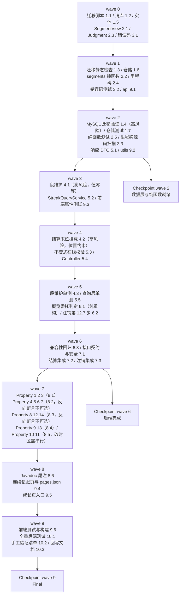

# Implementation Plan: 连续记账系统

## Overview

本 spec 与 growth-level-system、achievement-system 同为「后端先行、由内向外」：
数据层（迁移 + 实体 + 仓储）→ 无外部依赖的纯函数（段划分、判定、里程碑）→
段维护（结算末位步骤）→ 查询层与控制器 → 改造既有代码（结算集成、概览委托判定、注销序列）→
后端属性测试 → miniapp。每完成一组运行 `./mvnw test`；前端改动完成后运行 `npm run test` 与 H5 构建。

**本 spec 对成长体系与成就系统是纯增量**：只新增 `streak_segments` 一张表，
只读 `growth_events` / `user_growth`，不发经验、不改等级、不改成就解锁与播报游标。
删掉这张表，两个既有 spec 的全部行为原样成立——这条由任务 8.5 的兼容性回归锁住。

**改造既有代码的 4 处**：`GrowthCalendarService`（新增 `segments` 纯函数，`scan` 一字不改）、
`GrowthSettlementService`（`recalculateAndWriteBack` 末尾追加一行段维护调用）、
`GrowthQueryService`（`correctedCurrentStreak` 改为委托 `StreakJudgment`，取值逐例不变）、
`AccountDeletionService`（第 12.7 步硬删段行）。四处都是增量，不改既有语义；
`GrowthQueryService` 的改造是纯重构，须由任务 8.4 的两处相等性属性测试证明取值不变。

四处高风险实现点单独立任务、单独验证：
**段维护的 diff 与幂等性**（任务 4.1，值幂等而非时序判断，配任务 8.2 的属性测试）、
**段维护挂在结算末位而非 `settle` 方法体末尾**（任务 4.2，否则 `recalculateOnly` 路径不维护段）、
**迁移脚本在真实 MySQL 上的 CHECK 与 ODKU 行为**（任务 1.4，走 `deploy/dev-remote-db.sh`）、
**里程碑从成就清单 `MAX_STREAK` 口径派生、绝不写死数值**（任务 3.3，配任务 8.5 的源码扫描断言）。

**两处已知偏差需在开工前与需求对齐**（design.md「已知偏差与残留风险」）：
偏差①段维护新增 1 条读查询（需求 4.4 末句「不新增读查询」无法与「与已持久化段比对」并存）；
偏差②不返回「全部里程碑已达成标识」（需求 3.7/3.11 与需求 6.1 的「恰好 14 项」冲突，
改由 `nextMilestone == null` 等价表达）。两处都已在设计文档记录理由，任务按设计实现。

## Tasks

- [x] 1. 数据层：迁移脚本、实体与仓储
  - [x] 1.1 新增迁移脚本 `V34__streak.sql`
    - **开始时先重新核对 `src/main/resources/db/migration` 目录当前最大版本号与 `V30` 的占用情况**：设计定为 `V34__streak.sql`（撰写设计时最大为 `V33__achievement.sql`，`V30` 是历史缺号且已由 user-feedback-system spec 预占）；若届时占用情况有变，按「大于目录内全部已存在版本号且未被任何迁移文件或其它 spec 预占的最小值」重算。**不得占用缺号 V30**——已迁移环境会因此出现 Flyway out-of-order 失败
    - 不修改、不重命名、不删除任何已存在的迁移文件
    - `CREATE TABLE streak_segments`：恰好 7 列——`id BIGINT NOT NULL AUTO_INCREMENT`（主键）、`user_id BIGINT NOT NULL`、`start_date DATE NOT NULL`、`end_date DATE NOT NULL`、`days INT NOT NULL`、`created_at DATETIME NOT NULL`、`updated_at DATETIME NOT NULL`（两个 `DATETIME` **均不声明 `DEFAULT`、不声明 `ON UPDATE`**）
    - 具名唯一约束 `uk_streak_segments_user_start`，列序恰为 `(user_id, start_date)`
    - 具名非唯一复合索引 `idx_streak_segments_user_days`，列序恰为 `(user_id, days)`；**两个索引的全部列升序、名字不带 `_desc` 后缀**（InnoDB 反向扫描升序索引即可满足 `ORDER BY start_date DESC`）
    - 两条具名 CHECK：`ck_streak_segments_days`（`days >= 1`）、`ck_streak_segments_range`（`end_date >= start_date`）；**刻意不写第三条「days 等于两日期之差加 1」的 CHECK**——它依赖日期函数在 MySQL 与 H2 `MODE=MySQL` 下的一致行为，两者不一致时约束会在测试库与生产库表现不同；该不变式改由应用层 `StreakSegmentView.of` 与属性测试锁住
    - **无任何指向 `users(id)` 的外键**（与 `user_growth` / `growth_events` / `achievement_notices` 同一取舍：注销时由服务层显式删除）
    - InnoDB + `utf8mb4` + `utf8mb4_unicode_ci`；7 个列注释 + 1 个表注释全部为中文（写法对齐 `V32__user_growth.sql`）
    - **不回填任何存量用户的段行**（迁移后表行数为 0）；脚本**不用 `IF NOT EXISTS`**（Flyway 按版本校验跳过已执行脚本，`IF NOT EXISTS` 只会掩盖校验和不一致）
    - 脚本**不新建除 `streak_segments` 外的任何表、不为任何既有表增删改列、不改 `ck_growth_events_type`、不对 `growth_events`/`user_growth`/`achievement_notices`/`transactions` 执行任何 DML**
    - 脚本头部中文注释写明：段是记账日历的派生视图（不是第二套事实源）、断一次不清零的落地方式、不回填的理由、不用窗口函数回填的理由（H2 与 MySQL 的窗口函数行为差异会让核心不变式失去同一份自动化验证依据）、无外键是刻意选择
    - _Requirements: 8.1, 8.2, 8.3, 8.4, 8.5, 8.6, 8.7, 8.10, 8.11, 8.12, 8.13, 8.14_

  - [x] 1.2 清库脚本 `deploy/reset-db.sql` 增加段表
    - 在 `TRUNCATE TABLE achievement_notices;` 之后、`TRUNCATE TABLE users;` 之前插入 `TRUNCATE TABLE streak_segments;`，并加一行注释说明该表无外键、清空不依赖 `FOREIGN_KEY_CHECKS`（注释风格对齐既有成长两表与游标表那三行）
    - 不新增任何针对 `flyway_schema_history` 的语句
    - _Requirements: 8.8_

  - [x] 1.3 迁移目录静态检查测试*
    - **复用既有 `MigrationDirectoryTest` 与 `src/test/resources/db/migration-baseline.sha256` 机制**：把新脚本纳入基线，断言新脚本存在且版本号大于全部既有版本、目录内版本号无重复、历史迁移文件内容未被改动
    - _Requirements: 8.1_

  - [x] 1.4 在真实 MySQL 上执行迁移验证清单
    - 走 `bash deploy/dev-remote-db.sh` 连测试库（或本地 MySQL 建临时库全量 V1→V34）执行迁移，逐项核对 `information_schema`：
      `columns`（`streak_segments` 恰好 7 列，逐列断言类型 / 可空性 / 缺省值 / 中文注释非空；**`id` 的 `EXTRA` 含 `auto_increment`、其余列不含**、两个 `DATETIME` 列的 `EXTRA` 不含 `on update`）、
      `statistics`（恰好三组索引：主键 `id`、唯一 `uk_streak_segments_user_start (user_id, start_date)`、非唯一 `idx_streak_segments_user_days (user_id, days)`；**每个索引列的 `COLLATION` 为 `A`（升序）**）、
      `table_constraints` + `check_constraints`（`ck_streak_segments_days` 的 `CHECK_CLAUSE` 含 `days >= 1`、`ck_streak_segments_range` 含 `end_date >= start_date`）、
      `referential_constraints`（**`streak_segments` 外键数为 0**）、
      `tables`（引擎 InnoDB / 排序规则 `utf8mb4_unicode_ci` / 表注释非空）
    - **CHECK 实测**：`INSERT ... days = 0` 与 `days = -1` 各被 `ck_streak_segments_days` 拒绝（`ERROR 3819`）；`end_date < start_date` 被 `ck_streak_segments_range` 拒绝；被拒后表行数不变
    - **唯一约束实测**：同一 `(user_id, start_date)` 直插两次被 `uk_streak_segments_user_start` 拒绝（`ERROR 1062`）；再以 `INSERT ... ON DUPLICATE KEY UPDATE end_date=VALUES(end_date), days=VALUES(days), updated_at=VALUES(updated_at)` 执行，断言 `id` 与 `created_at` 不变、`end_date`/`days`/`updated_at` 已更新
    - **迁移后表为空**：`SELECT COUNT(*) FROM streak_segments` 为 0；存量 `growth_events` / `user_growth` 行数与若干行快照迁移前后逐列不变
    - 幂等性：连续两次启动应用，`flyway_schema_history` 中该版本记录数为 1，表结构与第一次一致
    - 以生产配置（Hibernate `ddl-auto=validate`）在迁移后的库上启动应用，启动成功且无表结构校验失败信息
    - 执行 `deploy/reset-db.sql` 后断言 `streak_segments` 行数为 0、表仍存在、列定义不变
    - **确认生产 MySQL 版本 ≥ 8.0.16**（更早版本 CHECK 被解析后忽略）；**在 design.md 的「Data Models / 迁移 `V34__streak.sql`」小节补记实测所用 MySQL 版本号与上述每项的实际结论**（格式对齐 achievement-system 设计文档 `V33` 的实测结论块）
    - _Requirements: 8.1, 8.2, 8.3, 8.4, 8.5, 8.6, 8.7, 8.10, 8.12, 8.13, 8.14, 4.13, 4.14_

  - [x] 1.5 新增 `StreakSegment` 实体
    - `@Entity @Table(name = "streak_segments")`；`@Id @GeneratedValue(strategy = IDENTITY)` 的 `id`（与 `GrowthEvent` 同构，本表 `id` 是自增代理键，**与 `UserGrowth` / `AchievementNotice` 的应用赋值主键不同**，此处该带 `@GeneratedValue`）
    - 字段：`userId`（裸 `Long`，**不映射为 `@ManyToOne User`**——表上无外键，关联映射会诱导后续开发者补外键）、`startDate` / `endDate`（`LocalDate`）、`days`（`int`）、`createdAt` / `updatedAt`（`LocalDateTime`）
    - 类级 Javadoc 写明：段是记账日历的派生视图，唯一输入是 `DAILY_RECORD` 日期集合；段的写入只走 `StreakSegmentMaintainer` 的 ODKU 批量语句，不走 `save()`
    - _Requirements: 8.2, 4.1_

  - [x] 1.6 新增 `StreakSegmentRepository`
    - `findByUserIdOrderByStartDateAsc(Long userId)`：对账用，段维护的 1 条读查询
    - `findByUserIdOrderByStartDateDesc(Long userId, Pageable pageable)`：历史区间分页，走 `uk_streak_segments_user_start` 反向扫描
    - `aggregateRaw(userId)`：`SELECT COUNT(s), COALESCE(SUM(s.days), 0), COALESCE(MAX(s.days), 0)`；Javadoc 写明 `COALESCE` 的理由（空表返回 0 而非 `null`，否则不变式在线校验的比较恒为假、形同虚设）
    - `endpointsRaw(userId)`：`nativeQuery = true` 的 `UNION ALL`——`kind=0` 取 `start_date` 最大者（当前段）、`kind=1` 取 `days DESC, start_date DESC` 首行（最长段并列时取起始日最晚）；Javadoc 写明用一条 UNION ALL 而非两个 JPQL 方法的理由（需求 7.10 按 SQL 语句条数计上界）
    - `deleteByIdIn(List<Long> ids)`（`@Modifying`）：数据修复路径删孤儿段
    - `deleteByUserId(Long userId)`（`@Modifying`）：注销级联硬删；Javadoc 写明无行时影响行数 0 即视为成功、删除前不做存在性预查询
    - **类级 Javadoc 写明「不提供任何单行写入方法」**：段的插入 / 更新只能走 `StreakSegmentMaintainer` 的 ODKU 批量语句，放出 `save` 会诱导「先查后写」的竞态路径（沿用 `GrowthEventRepository` / `AchievementNoticeRepository` 的同一立场）
    - `aggregateRaw` / `endpointsRaw` 的日期列由服务层以 `getObject(LocalDate.class)` 逐字回读，**不经 `java.sql.Date`**（那条路径会经默认时区换算致整日平移）
    - 两个查询走既有 / 新建索引，**除迁移已建的两个索引外不新增任何索引**
    - _Requirements: 6.3, 6.4, 6.5, 7.10, 7.11, 8.8, 4.15_

  - [x] 1.7 仓储层映射与查询单元测试*
    - H2 上断言 `StreakSegment` 实体与表结构一致；以自增主键保存后可读回；`deleteByUserId` / `deleteByIdIn` 在无行 / 空列表时影响行数为 0 且不抛错
    - `aggregateRaw` 空表返回 `(0, 0, 0)`；造 3 段断言 `COUNT=3`、`SUM(days)`、`MAX(days)` 正确
    - `endpointsRaw`：造「当前段与最长段是同一段」「当前段短于最长段」「两段并列最长」三种数据，断言当前段取 `start_date` 最大者、最长段取 `days` 最大并列时 `start_date` 最晚者
    - `findByUserIdOrderByStartDateDesc` 分页越界返回空列表、`getTotalElements` 仍为真实总条数
    - _Requirements: 6.3, 6.4, 6.5, 6.17, 7.10, 7.11_

- [x] 2. 段划分与判定纯函数（无外部依赖）
  - [x] 2.1 新增 `StreakSegmentView` 值对象
    - `record StreakSegmentView(LocalDate startDate, LocalDate endDate, int days)` + 静态工厂 `of(start, end)`：`days = end.toEpochDay() - start.toEpochDay() + 1`，落在 `[1, Integer.MAX_VALUE]` 之外抛 `IllegalArgumentException`
    - Javadoc 写明：`days` 在构造时由两端算出，因此不变式①（`days == 结束日 − 起始日 + 1`）在内存里无法构造出反例；`days` 冗余存一列是为了让「取最长段」走 `idx_streak_segments_user_days` 索引
    - _Requirements: 4.1, 4.2, 8.14_

  - [x] 2.2 `GrowthCalendarService` 新增 `segments` 纯函数
    - `public static List<StreakSegmentView> segments(List<LocalDate> ascendingDates)`：空 / `null` 返回 `List.of()`；复用**同一个** `normalize`（升序去重、含 `null` 抛异常）与**同一条** `toEpochDay` 相邻判定（相差恰为 1 即同段），按设计伪代码收口每一段，返回不可变列表
    - **`scan` 的入参、返回值、连续段划分行为一字不改**——只新增方法，不动既有方法
    - 类级 Javadoc 补一段：`segments(c)` 的四项聚合投影与 `scan(c)` 逐项相等（`Σ days` / `max days` / 末段 `days` / 末段 `endDate` ↔ `totalDays` / `maxStreak` / `currentSegment` / `lastDate`），两者不是两套算法，由 Property 2 锁住
    - _Requirements: 4.1, 4.2, 4.3, 4.5, 10.8_

  - [x] 2.3 新增 `StreakJudgment` 纯函数类
    - `final class`，三个不读时钟、不查库的静态方法：
      `currentStreakDays(LocalDate lastRecordDate, int currentSegmentDays, LocalDate judgmentDay)`——`lastRecordDate` 等于判定日或判定日前一日时返回 `max(0, currentSegmentDays)`，否则 0（含晚于判定日的时钟偏移情形）；
      `todayDone(LocalDate lastRecordDate, LocalDate judgmentDay)`——`lastRecordDate != null && !lastRecordDate.isBefore(judgmentDay)`（`!isBefore` 一次覆盖「等于判定日」与需求 1.12「晚于判定日返回真」两条）；
      `broken(LocalDate lastRecordDate, LocalDate judgmentDay)`——`lastRecordDate != null && lastRecordDate.isBefore(judgmentDay.minusDays(1))`（日历为空返回 `false`，从未开始不等于已中断）
    - 类级 Javadoc 写明：这是「今日已完成 / 当前连续天数 / 是否中断」三项判定的**唯一实现**，成长概览与连续记账概览两处必须都委托它，需求 2.3 / 10.5 的相等性由此构造性成立
    - _Requirements: 1.1, 1.2, 1.3, 1.12, 2.1, 2.2, 2.3, 2.4, 2.7, 2.10_

  - [x] 2.4 新增 `StreakMilestones` 组件
    - `@Component`，`@PostConstruct derive()`：`catalog.badges().stream().filter(b -> b.metric() == BadgeMetric.MAX_STREAK).map(BadgeDef::target).distinct().sorted().toList()`——**按 `BadgeMetric.MAX_STREAK` 口径过滤，不按 `STREAK_` 编码前缀**；Javadoc 写明理由（口径才是语义，前缀是命名巧合）
    - **服务端代码里不出现 7 / 30 / 100 / 365 四个字面量**（由任务 8.5 的源码扫描断言锁死）
    - `nextAfter(int currentStreakDays)`：升序集合中首个大于入参者，无则 `null`
    - 派生结果为空时记一条 `[STREAK_MILESTONES_EMPTY]` WARN，**不抛异常、不使应用启动失败**（成就清单本身另有 `GrowthBadgeCatalog.selfCheck()` 兜底）
    - _Requirements: 3.5, 3.6, 3.7, 3.8, 3.9, 3.11, 10.10_

  - [x] 2.5 纯函数单元测试*
    - `GrowthCalendarServiceSegmentsTest`：空集 / 单点 / 全连续 / 全离散 / 重复 / 乱序 / 跨月 / 跨年 / 闰日（2024-02-28、29、03-01）/ 含 `null` 抛异常
    - `StreakJudgmentTest`：`lastRecordDate` 取判定日、判定日−1、判定日−2、判定日+1、`null` 五种 × 三个方法的真值表逐格断言
    - `StreakMilestonesTest`：正常清单派生出 `[7, 30, 100, 365]`；构造一份无 `MAX_STREAK` 口径的清单 → 空集合 + 一条 WARN + 不抛异常；`nextAfter` 在 0 / 6 / 7 / 8 / 364 / 365 / 366 的取值
    - `StreakSegmentViewTest`：`of` 的 `days` 计算、单日段 `days=1`、`end < start` 抛异常
    - _Requirements: 4.1, 4.2, 4.3, 4.5, 1.1, 1.2, 1.3, 2.1, 2.2, 3.5, 3.6, 3.7, 3.8_

- [x] 3. 里程碑与错误码
  - [x] 3.1 `ApiException` 新增唯一错误码工厂方法
    - `streakPageParamInvalid(String field)` → `("STREAK_PAGE_PARAM_INVALID", HttpStatus.BAD_REQUEST, "分页参数非法：page 取值 0-100000，size 取值 1-50", field)`
    - 放在按域分组的注释块下（新增 `// ---- 常用工厂方法（Streak 连续记账域） ----`，沿用既有风格）
    - `message` 中文、≤100 字符、**不含用户 id / 邮箱 / 令牌**
    - **本 spec 只新增这一个错误码**：结算失败、结算被节流均不对外暴露错误码；未认证走既有 `unauthenticated()`——在方法 Javadoc 里写明（沿用成长域 `growthPageParamInvalid`、成就域 `achievementAckParamInvalid` 处的先例注释：**不复用** `growthPageParamInvalid`，跨域复用会让客户端在连续记账页收到带 `GROWTH` 前缀的错误码）
    - _Requirements: 6.12, 6.13, 10.9_

  - [x] 3.2 错误码单元测试*
    - `ApiExceptionTest` 扩展：`STREAK_PAGE_PARAM_INVALID` 的码、状态 400、`field` 取入参、`message` 长度 ≤100 且不含用户 id / 邮箱 / 令牌
    - _Requirements: 6.13_

  - [x] 3.3 里程碑不写死数值的源码扫描断言*
    - 新增测试断言 `StreakMilestones` / `StreakQueryService` / `StreakOverviewResponse` 等本 spec 服务端源码中不出现 `7` / `30` / `100` / `365` 四个里程碑数值字面量（读取源文件做正则扫描，排除注释与 import；或断言里程碑集合恒等于 `GrowthBadgeCatalog` 中 `MAX_STREAK` 口径门槛的升序去重结果）
    - 这条对应 Property 10 的「源码扫描」子句，是「里程碑数值不重复定义」的机器化防线
    - _Requirements: 3.5, 10.10_

- [x] 4. 段维护与结算集成
  - [x] 4.1 新增 `StreakSegmentMaintainer`
    - `@Component`，`maintain(Long userId, List<LocalDate> calendar, LocalDateTime now)`：① `GrowthCalendarService.segments(calendar)` 得应有段序列 → ② `repository.findByUserIdOrderByStartDateAsc(userId)` 读已持久化段（**这是偏差①的那 1 条读查询**）→ ③ 以 `start_date` 为键逐项 diff，`have == null || end_date 不同 || days 不同` 则加入 upsert 批 → ④ 已持久化中起始日不在重算结果里的段收进 `orphanIds`（数据修复路径删除，需求 4.15）→ ⑤ 有界性断言（写入行数 > `max(1000, calendar.size()) + 1` 抛 `IllegalStateException`）→ ⑥ 空 diff 即零 SQL；`orphanIds` 非空先记 `[STREAK_SEGMENT_REPAIRED]` WARN 再删；upsert 批走 `jdbcTemplate.batchUpdate`
    - upsert 用 `INSERT ... ON DUPLICATE KEY UPDATE end_date = VALUES(end_date), days = VALUES(days), updated_at = VALUES(updated_at)`——冲突时 `user_id`/`start_date`/`created_at` 三列不动；**绝不改成 `INSERT IGNORE`**（会静默吞掉 CHECK 违例、非空违例）；Javadoc 写明该禁令（沿用 `GrowthSettlementService` 的同一立场）
    - **本方法刻意不 catch 任何异常**：它运行在 `GrowthSettlementService` 的 `REQUIRES_NEW` 事务内，异常必须穿出才能回滚该事务；吞异常只能发生在事务边界之外（`GrowthSettlementTrigger` / 两个 QueryService）。Javadoc 写明这条禁令
    - diff 的键为什么是 `start_date` 而非 `id`：`id` 不承载业务语义，`start_date` 在唯一约束保护下是段序列的天然主键；「延长尾段」= 一次 UPDATE、「另起新段」= 一次 INSERT，两者都是 ODKU 一次调用。写进注释
    - 耗时 > 300ms 记 `[STREAK_MAINTAIN_SLOW]` WARN，**不使结算失败**
    - 时钟统一用注入的 `Clock`（`TimeConfig` 提供）
    - _Requirements: 4.4, 4.6, 4.7, 4.8, 4.10, 4.11, 4.13, 4.14, 4.15, 4.16, 5.1, 5.2, 7.7, 7.13_

  - [x] 4.2 `GrowthSettlementService.recalculateAndWriteBack` 末尾追加段维护
    - 构造注入新增 `StreakSegmentMaintainer`
    - 在 `recalculateAndWriteBack` 的**最末**（`profile.setLastSettledAt(now)` 之后、方法返回前）追加 `segmentMaintainer.maintain(userId, calendar, now);`——`calendar` 是该方法开头已从库重读的完整 `DAILY_RECORD` 日历，**复用它作为入参，零额外日历查询**（满足需求 7.2「以追补之后的记账日历作为输入」）
    - **挂在 `recalculateAndWriteBack` 而非 `settle` 方法体末尾**：`settle`（记账/概览触发）与 `recalculateOnly`（全量重算）都走这条路径，两者段维护结果因此构造性相同；写进注释说明「挂错位置会导致 `recalculateOnly` 路径不维护段」
    - **既有各步骤的顺序、语义、写入内容一字不改**；`settle` 内不 catch 异常、`REQUIRES_NEW` 不改 `REQUIRED`、批量插入只用 `ON DUPLICATE KEY UPDATE id = id` 三条既有禁令保持不动
    - 段维护在 `user_growth` 行锁与同一 `REQUIRES_NEW` 事务的保护之内，并发串行化与事务边界一并继承，不新增同步原语
    - _Requirements: 7.1, 7.2, 4.12, 10.8_

  - [x] 4.3 段维护单元测试*
    - `StreakSegmentMaintainerTest`（桩仓储 + 固定 `Clock`）：首次建立（diff = 全部段）、尾段延长（1 行 UPDATE）、另起新段（1 行 INSERT）、无变化（0 条 SQL）、孤儿段删除、写入行数越界抛 `IllegalStateException`、耗时 > 300ms 记 WARN、**异常不被吞掉**（注入失败断言穿出而非被 catch）
    - _Requirements: 4.4, 4.6, 4.7, 4.8, 4.10, 4.11, 4.15, 4.16, 7.7_

- [x] 5. 查询层与控制器
  - [x] 5.1 新增查询响应 DTO
    - `StreakOverviewResponse`：**恰好 14 个分量**，顺序与字段名按 design.md「7. 接口设计」的表格——`todayDone` / `currentStreakDays` / `broken` / `currentSegmentStart` / `currentSegmentEnd` / `lastStreakDays` / `lastStreakEnd` / `maxStreakDays` / `longestSegmentStart` / `longestSegmentEnd` / `totalRecordDays` / `segmentCount` / `nextMilestone` / `daysToNextMilestone`；可空项（六个日期、`lastStreakDays`、两个里程碑字段）用**包装类型**使空值序列化为 `null` 而非省略键
    - `StreakSegmentPageResponse(List<StreakSegmentItem> items, long total)`——顶层恰好 2 项
    - `StreakSegmentItem(LocalDate startDate, LocalDate endDate, int days)`——恰好 3 项
    - 全部 DTO 不含 `email`/`wx_openid`/`wx_unionid`/`invite_code`/`plan`/`role` 六字段、不含任何金额字段与交易标识、**不含任何成就编码与解锁状态**
    - **不新增第 15 个字段**（偏差②）：「全部里程碑已达成」由 `nextMilestone == null` 等价表达；在 `StreakOverviewResponse` 的 Javadoc 里写明这条取舍
    - _Requirements: 6.1, 6.2, 6.3, 6.14, 3.9_

  - [x] 5.2 新增 `StreakQueryService`
    - `getOverview(Long userId)`：① `try { settlementService.settle(userId, TriggerSource.OVERVIEW) } catch (Exception e) { log.warn("[STREAK_SETTLE_FAILED] ...") }`（**复用 `TriggerSource.OVERVIEW` 与既有 `GrowthSettlementThrottle`，不新增节流器**）→ ② `LocalDate.now(clock)` 只读一次时钟 → ③ Q1 `userGrowthRepository.findById` → ④ Q2 `repository.aggregateRaw` → ⑤ Q3 `repository.endpointsRaw` → ⑥ 三项判定全部委托 `StreakJudgment` → ⑦ `lastRecordDate` 晚于判定日记 `[STREAK_CLOCK_SKEW]` WARN → ⑧ 不变式在线校验（见任务 5.3）→ ⑨ 里程碑换算 → 组装 14 项
    - **不加 `@Transactional`**（处在结算事务边界之外，加事务会把「吞异常」挪进事务上下文破坏隔离）；Javadoc 写明
    - 「上次连续」= 当前段本身的投影：`broken` 为真时 `lastStreakDays` / `lastStreakEnd` 取当前段的 `days` / `end_date`，为假时两项置 `null`（**不发第 4 条查询去找倒数第二段**）
    - 无档案 / 空日历降级：`todayDone=false`、三个天数 0、四个端点日期空值、`broken=false`、`segmentCount=0`，不报错、不写表
    - **概览恰好 3 条读查询**（Q1 档案 / Q2 聚合 / Q3 端点），条数为常量上界、不随段总数与交易笔数增长
    - `listSegments(Long userId, String rawPage, String rawSize)`：`@Transactional(readOnly = true)`（让取当页 + 取总条数读同一快照）；`parseInRange` 与成长域逐字同构，错误码换成 `streakPageParamInvalid`；`page ∈ [0,100000]` 缺省 0、`size ∈ [1,50]` 缺省 20；按 `start_date DESC` 分页；越界页码返回空列表 + 真实 `total`；**不触发结算**；恰好 2 条读查询
    - _Requirements: 1.4, 1.7, 1.11, 1.12, 2.5, 2.6, 2.7, 3.1, 3.2, 3.3, 6.1, 6.2, 6.3, 6.4, 6.5, 6.6, 6.7, 6.12, 6.17, 7.8, 7.9, 7.10, 7.11_

  - [x] 5.3 不变式在线校验
    - `StreakQueryService` 内私有 `assertInvariants`：用 Q2 已取的 `segmentCount` / `sumDays` / `maxDays` 与 Q1 的 `totalRecordDays` / `maxStreakDays` 比对，**零额外查询**；不变式③（`sumDays == totalRecordDays`）与④（`maxDays == maxStreakDays`）任一不成立记 `[STREAK_INVARIANT_VIOLATED]` WARN（含 userId 与首个被违反的不变式序号，用 `else if` 只报首个）
    - **只告警、不使概览请求失败**（自愈优先于报错，需求 4.17）——段是派生数据，不一致只导致历史区间墙少展示或多展示一段，修复只需下一次结算的全量对账
    - Javadoc 写明：存量用户在段建立之前的第一次概览请求（且该请求内结算被节流跳过）会命中一次 `sumDays=0 != totalRecordDays` 的告警，属预期的一次性噪声，**该日志不应配置为告警上报项**
    - _Requirements: 4.17, 3.2_

  - [x] 5.4 新增 `StreakController`
    - `@RestController @RequestMapping("/api/streak")`，两个端点：`GET ""`（概览）、`GET "/segments"`（历史区间分页）
    - 每个端点第一步调私有 `requireExistingUserId()`（照抄 `GrowthController`：`currentUser.requireUserId()` + `userRepository.findById(userId).orElseThrow(ApiException::unauthenticated)`），且该校验**先于**结算、分页校验与任何聚合查询；单次请求内至多执行 1 次
    - `/segments` 的 `page` / `size` 以**原文 `String`** 接收（`@RequestParam(required = false)`），交由服务层解析——交给框架转型会让非数字取值在进入方法体前抛 `PARAM_INVALID`（另一套错误码），既绕过「令牌用户仍存在」校验也违背需求 6.12
    - 控制器只做「令牌用户仍存在」校验与 DTO 转发，**不含任何业务判定**
    - 类级 Javadoc 写明：过滤链只验签不查库，「令牌合法但用户已注销」的缺口只能在这里补；两端点与会话账本无关，**不要求也不检查 `X-Ledger-Id`**；`SecurityConfig` 不改动（`/api/streak/**` 落在 `anyRequest().authenticated()`）；概览是写入型 GET（内含结算），**刻意不加任何 HTTP 缓存头**
    - 忽略请求中任何指定目标用户身份的查询参数、路径参数、请求体字段与自定义请求头，且**不因携带此类字段而返回错误码**
    - _Requirements: 6.8, 6.9, 6.10, 6.11, 6.16, 6.18_

  - [x] 5.5 查询层单元测试*
    - `StreakQueryServiceTest`：无档案降级；`broken` 三态下 `lastStreakDays` 的空/非空；时钟偏移记 WARN；分页参数解析的 12 条边界（`null` / 空白 / `"abc"` / `-1` / `0` / `100000` / `100001` / `"0"` / `"1"` / `"50"` / `"51"` / 前后空白）；`assertInvariants` 不一致时记 WARN 但不抛出
    - _Requirements: 1.4, 2.5, 2.6, 2.7, 6.12, 6.17, 4.17_

- [x] 6. 改造既有代码
  - [x] 6.1 `GrowthQueryService.correctedCurrentStreak` 改为委托 `StreakJudgment`
    - 删掉方法内自行判定「等于判定日或前一日」的两行，改为调用 `StreakJudgment.currentStreakDays(lastRecordDate, profile.getCurrentStreakDays(), judgmentDay)`
    - **纯重构，取值逐例不变**；`GrowthOverviewResponse` 顶层仍恰好 15 项，一个字段不加不删不改名
    - 方法 Javadoc 补一句：改为委托是为了让需求 2.3 / 10.5 的「两处当前连续天数相等」构造性成立，两条读取路径共用同一份判定实现
    - _Requirements: 2.3, 10.4, 10.5_

  - [x] 6.2 `AccountDeletionService` 注销序列插入第 12.7 步
    - 在既有第 12.6 步（`achievement_notices` 硬删）之后、第 13 步（`userRepository.delete(user)`）之前插入 `streakSegmentRepository.deleteByUserId(userId);`
    - 构造注入新增 `StreakSegmentRepository`
    - **既有各步的相对顺序、过滤条件与影响行数一字不改**
    - 加注释（风格对齐既有 12.5 / 12.6 步）：无外键故数据库层无顺序约束，固定在这里只为可逐语句断言；无行时影响行数 0 即视为成功；**删除前不做任何存在性预查询**，不写软删除标记或归档副本；整个方法单事务，本步失败则整体回滚
    - _Requirements: 8.8, 8.9_

  - [x] 6.3 既有契约兼容集成测试*
    - `StreakCompatibilityIntegrationTest`：断言成长概览响应顶层仍恰好 15 项、成就清单顶层仍恰好 3 项；`DELETE FROM streak_segments`（清空全表）后，成长体系与成就系统的全部接口的响应字段集、取值与错误码逐项不变
    - 断言成长概览与连续记账概览返回的 `currentStreakDays` 与 `maxStreakDays` 在同一时刻相等
    - 断言 `STREAK_7/30/100/365` 四枚成就的解锁与段序列自洽（最大段天数 ≥ 门槛且成就已解锁时，成就当前值等于门槛）
    - _Requirements: 10.1, 10.4, 10.5, 10.6, 10.7_

- [x] 7. 接口契约与集成测试
  - [x] 7.1 接口契约与安全集成测试*
    - `StreakApiContractIntegrationTest`：概览响应**14 个键逐项存在**（含取值为 `null` 时键仍在、不省略、不用 0/空串替代），且不存在第 15 个键；响应不含 `email`/`wx_openid`/`wx_unionid`/`invite_code`/`plan`/`role` 六个键与任何金额/交易标识；历史分页顶层恰好 2 项、每项恰好 3 项；零数据新用户返回 `todayDone=false`、三个天数 0、四个端点空值、`broken=false`、空区间列表且不报错
    - `StreakApiSecurityIntegrationTest`（照抄 `GrowthApiSecurityIntegrationTest` 的 `TestRestTemplate` + `Jwts` 手工签发范式，独立命名内存库）：无令牌 / 畸形 / 签名错 / 过期 / 已注销用户 → `UNAUTHENTICATED` 且响应不含连续天数/最长连续/区间项、段表不变；**`UNAUTHENTICATED` 优先于分页参数校验**（已注销用户 + 非法 `page` 应返回 401 而非 400）；携带他人 user id 字段 / 请求体字段 / 自定义头 → 与不携带逐项相同且不报错；不带 / 带任意 `X-Ledger-Id` → 逐项相同；用户 A 的令牌读不到用户 B 的任何段；越界页码 → 空列表 + 真实 `total`
    - 断言耗时：概览 ≤2000ms、历史分页 ≤2000ms
    - _Requirements: 6.1, 6.2, 6.3, 6.8, 6.9, 6.10, 6.11, 6.12, 6.14, 6.15, 6.16, 6.17, 7.8, 7.9_

  - [x] 7.2 结算集成测试*
    - `StreakSettlementIntegrationTest`（用 `TransactionTemplate` 显式包裹，**不给测试方法加 `@Transactional`** 否则 `afterCommit` 不触发）：记账 → 结算 → 断言段行；跨日再记账 → 尾段延长（`end_date`/`days` 更新、`start_date`/`created_at` 不变）；跳一天再记账 → 新段 + 旧段全列不变、段总数 +1；同日多笔 → 段不变；删除交易 → 段不变（日历只追加）
    - 用查询计数拦截器断言概览请求为段与档案执行的读 SQL 恒为 3 条、历史分页恒为 2 条，且段总数 0→5000、交易笔数变化时条数不变
    - 段维护失败（注入 `countTravelExpenses` 之外的段仓储异常）断言：`REQUIRES_NEW` 事务整体回滚、段表无部分写入、退回本次结算前状态、`[STREAK_MAINTAIN_FAILED]` WARN、记账接口状态码与响应字段集不变且不含连续记账字段；再次结算补齐；`transactions`/`budgets`/`ledgers`/`ledger_members`/`invite_relations`/`achievement_notices` 六表任何行不变
    - _Requirements: 4.6, 4.7, 4.8, 5.1, 5.2, 7.3, 7.4, 7.10, 7.11, 7.12, 7.13_

  - [x] 7.3 注销集成测试*
    - `StreakAccountDeletionIntegrationTest`：注销后段行数为 0；注销接口响应字段集、状态码与错误码不变；段删除失败（桩仓储抛异常）→ 整个注销事务回滚，`users`/`user_growth`/`growth_events`/`streak_segments` 四表全列还原；前置校验（`requireDeletable` / `verifySecondFactor`）失败时段表零副作用；不影响其它用户的段
    - _Requirements: 8.8, 8.9_

- [x] 8. 后端属性测试
  - [x] 8.1 Property 1、2、3：段序列不变式、`segments` 与 `scan` 一致、段与日历互为充要*
    - `StreakSegmentInvariantsPropertyTest`（Property 1）：任意日历（长度 0–400，含空/单点/全连续/全离散/重复/乱序/跨月跨年闰日）落表后满足五条不变式（`days == end − start + 1`、两段既不相交也不相邻、`Σ days == totalDays`、`max days == maxStreak`、末段 `endDate == lastDate`）
    - `StreakSegmentsScanParityPropertyTest`（Property 2）：`segments(c)` 四项聚合投影与 `scan(c)` 逐项相等
    - `StreakSegmentCoveragePropertyTest`（Property 3）：任意日历 × 探测日期，D 落在某段内 ⟺ D 在日历中，且至多落在 1 段内
    - _Requirements: 4.1, 4.2, 4.3, 4.5, 8.14, 3.2_

  - [x] 8.2 Property 4、5、6、7：增量==全量、无变化即无写入、中断不清零、段总数单调*
    - `StreakIncrementalEqualsFullPropertyTest`（Property 4）：任意「日历追加序列」（1–20 批），逐批维护的终态与直接全量维护逐项相同
    - `StreakNoChangeNoWritePropertyTest`（Property 5）：日历未新增日期时第二次维护 0 条 SQL、段行与全部列（含 `created_at`/`updated_at`）不变；用 Hibernate `Statistics` 计 SQL 条数
    - `StreakBreakNoResetPropertyTest`（Property 6）：任意「连续 N 天 → 中断 M 天 → 再记 1 天」（N,M ∈ [1,400]）后旧段三列不变、新增 `days=1` 段、段总数 +1、当前连续天数=1、`max_streak_days` 不减、`growth_events` 与 `user_growth` 四列不变；中断持续期间多次读取六项历史取值逐项相同
    - `StreakSegmentCountMonotonicPropertyTest`（Property 7）：任意操作序列后段总数单调不减（注销与修复删除不生成）
    - **Property 6 的反向断言不可选**：断言旧段被误改（模拟一个会动旧段的错误 diff）时本属性必须失败——锁死「断一次不清零」这条产品核心
    - _Requirements: 4.8, 4.9, 4.10, 4.11, 5.1, 5.2, 5.3, 5.6, 5.7, 5.8, 5.10, 2.8_

  - [x] 8.3 Property 8、12、14：段维护不改成长成就、并发终态唯一、故障不改主路径*
    - `StreakPurelyAdditivePropertyTest`（Property 8）：任意操作序列 × 开关段维护布尔标志（同种子同 `Clock`），`user_growth` 六列 / `growth_events` 行与列 / `achievement_notices` 行与列 / 已解锁成就集合与解锁时刻全部逐项相同。**反向断言不可选**：在 maintainer 里插一行改 `profile` 时本属性必须失败——锁死「纯增量」
    - `StreakConcurrentTerminalPropertyTest`（Property 12）：2–8 次结算 1000ms 内并发后，任一 `start_date` 的段行数至多 1、段序列满足五条不变式（`tries = 100`）；Javadoc 注明 H2 复现不出真实行锁竞争，只验证唯一约束兜底 + ODKU 转更新那一半，行锁那一半在任务 1.4 手工验证
    - `StreakFaultIsolationPropertyTest`（Property 14）：故障点 ∈ {diff 前 / 批量写中途 / 删除中途} × 异常类型 ∈ {运行时 / 受检 / `PessimisticLockingFailureException` / `CannotGetJdbcConnectionException`} × 触发接口 ∈ {记账 / 预算 / 登录 / 注销 / 邀请}；断言状态码与响应键集合相等、记账响应不含连续记账字段、段表无部分写入、六表任何行不变
    - _Requirements: 10.1, 10.2, 10.3, 7.3, 7.4, 7.5, 7.13, 4.12, 4.13, 4.14, 4.16, 5.9_

  - [x] 8.4 Property 9、13：当前连续天数两处相等、查询条数常量上界*
    - `StreakCurrentStreakParityPropertyTest`（Property 9）：任意日历 × 判定日（覆盖最近记账日前后 3 天），连续记账概览与成长概览的 `currentStreakDays` 与 `maxStreakDays` 相等（由共用 `StreakJudgment` 构造性成立，本测试锁住任务 6.1 的重构没改变取值）
    - `StreakQueryCountPropertyTest`（Property 13）：段总数 ∈ [0,5000] × 交易笔数 ∈ [0,2000] × `page`/`size` 组合，概览读 SQL 恒 3 条、历史分页恒 2 条；用 `Statistics.getPrepareStatementCount()` 计数
    - _Requirements: 2.3, 10.5, 7.10, 7.11_

  - [x] 8.5 Property 10、11：里程碑单调与边界、时区无关*
    - `StreakMilestonePropertyTest`（Property 10）：s ∈ [0,500] × 门槛集合（正常/单元素/空集/乱序/含重复），`nextAfter` 为空 ⟺ s ≥ 最大值、非空时 `> s` 且 `nextAfter(s) − s ∈ [1, 最大值]`、s 递增时单调不减；**含源码扫描子句**（复用任务 3.3，断言里程碑集合恒等于 `MAX_STREAK` 口径门槛升序去重、代码无 7/30/100/365 字面量）
    - `StreakTimezonePropertyTest`（Property 11）：默认时区 ∈ {UTC, `America/New_York`, `Australia/Sydney`, `Asia/Kolkata`} × 一日内时刻（含 `00:00:00.000`、`23:59:59.999`），`todayDone` / `currentStreakDays` / 段序列三项取值不变；判定日在 `Asia/Shanghai` 折算的 `23:59:59.999` 与次日 `00:00:00.000` 之间切换恰好一次；**串行执行**、`@AfterTry` 复原默认时区、类 Javadoc 写明它同时是「不设 `hibernate.jdbc.time_zone`」的回归锁
    - _Requirements: 3.5, 3.6, 3.7, 3.8, 3.9, 3.11, 10.10, 1.5, 1.13, 9.15_

  - [x] 8.6 每个属性测试类补齐 Javadoc 尾注*
    - 每个 `*PropertyTest` 的类级 Javadoc 末尾固定两行（沿用成长体系与成就系统既有格式）：
      `<p>Feature: streak-system, Property N: <属性标题></p>`
      `<p>Validates: Requirements X.Y, X.Z</p>`
    - 与 design.md「Correctness Properties」的 15 条逐条对应，编号一致（Property 15 是 miniapp，见任务 9.3）
    - _Requirements: 全部可属性化验收标准_

- [x] 9. miniapp
  - [x] 9.1 新增 `src/api/streak.js`
    - `fetchStreakOverview()` / `fetchStreakSegments(page = 0, size = STREAK_PAGE_SIZE)`，两个方法**全部带 `noLedger: true`**
    - 模块头注释写明：连续记账数据与账本无关，全部请求收敛到本模块（对齐 `api/growth.js`、`api/achievement.js` 的既有写法），不在页面里另起 `http` 调用；概览是写入型 GET（服务端顺带结算，复用 10 秒节流），不加缓存、不在同屏重复调用；历史区间只读、不触发结算、可能比概览旧
    - _Requirements: 6.11, 9.12_

  - [x] 9.2 新增 `src/utils/streak.js`（全部纯逻辑）
    - 常量：`STREAK_PAGE_SIZE = 20`、`STREAK_CELL_COUNT = 30`、`STREAK_REFRESH_THROTTLE_MS = 3000`、`STREAK_TIMEOUT_MS = 3000`、`STREAK_FORBIDDEN_WORDS = ['归零','清空','失败','中断']`
    - `checkinCells(nowMs, segments)`：以判定日为末格、向前覆盖 30 个连续自然日；**末格日期以 `Asia/Shanghai` 固定 UTC+8 偏移换算，不随设备时区变化**（不用 `toLocaleDateString('zh-CN')`）；某格已打卡 ⟺ 该日落在某已加载区间项的 `[startDate, endDate]` 闭区间内（段边界一律取服务端下发值，**miniapp 内不实现第二套段划分**）；恒返回 30 项、日期两两不同、按升序；`segments` 畸形时全部记为未打卡
    - `restartHint(overview)`：`broken` 为真且 `lastStreakDays` 非空时返回「上次连续 N 天，今天重新开始」这类文案，否则 `''`；文案不含 `STREAK_FORBIDDEN_WORDS` 中任何一个词
    - `milestoneText(overview)`：`nextMilestone` 非空且 `daysToNextMilestone >= 1` 时返回「距 N 天里程碑还差 M 天」；`nextMilestone` 为空返回「已达成全部里程碑」；`daysToNextMilestone < 1` 按空处理不展示数值；**里程碑数值一律取接口下发值，不写死 7/30/100/365**
    - `isFirstTimeUser(overview)`：`totalRecordDays === 0 && segmentCount === 0`（**不看「记账日历为空」**，日历不是接口字段；两者在服务端等价）
    - `hasMoreSegments(loadedCount, total)`：`loadedCount < total`
    - `shouldRefresh(lastRequestAtMs, nowMs)`：语义与 `utils/growth.js` 同名函数一致
    - 模块头注释写明：只做算术与状态判定，不引入页面/请求/store 依赖，可用 vitest + fast-check 直接测；全部函数对畸形入参安全降级、**绝不抛出**
    - _Requirements: 9.4, 9.5, 9.6, 9.7, 9.8, 9.9, 9.12, 9.15, 9.16, 9.18_

  - [x] 9.3 `utils/streak.js` 的属性测试*（Property 15）
    - `utils/streak.checkinCells.test.js`：`segments` 数组（0–50 项，含重叠/乱序/缺字段/非法日期串）× `nowMs` × `process.env.TZ ∈ {UTC, America/New_York, Asia/Shanghai}`；断言恒 30 项、日期两两不同升序、已打卡 ⟺ 落在某区间闭区间内、`todayDone` 为真时末格已打卡为假时未打卡、设备时区切换后末格日期不变
    - `utils/streak.restartHint-milestoneText.test.js`：断链文案与里程碑文案的边界（`daysToNextMilestone` 为 0/负数/`null` 时不展示数值），并断言输出不含禁词
    - `utils/streak.hasMoreSegments-shouldRefresh.test.js`：翻页与节流判定的边界
    - _Requirements: 9.4, 9.6, 9.7, 9.8, 9.15, 9.16_

  - [x] 9.4 新增连续记账页 `pages/streak/streak.vue` 与 `pages.json` 注册
    - `pages.json` 新增：`{"path": "pages/streak/streak", "style": {"navigationBarTitleText": "连续记账", "enablePullDownRefresh": true}}`；**注册为非 tabBar 页面**；`enablePullDownRefresh` 写在**页面级 style** 里，注释说明写进 `globalStyle` 会给全部页面打开下拉刷新
    - 三态互斥模板（`loading | ready | error`），照抄成长页的 `seq` 请求序号 + `withTimeout` 范式；两个请求各自计时（超时按单请求计）、自动重试次数为 0
    - 打开页：`fetchStreakOverview()` + `fetchStreakSegments(0, 20)`；**两请求返回前只展示占位、不展示任何数值**；返回后以真实取值替换对应区域占位
    - 六个区域（自上而下）：① 今日打卡状态（`todayDone` 真→已完成标识+提示；假→未完成标识+引导记账文案+跳转记账页操作）；② 当前连续天数（`broken` 真且 `lastStreakDays` 非空时其下追加 `restartHint()`）；③ 历史最长连续天数 + 最长段起止日；④ 里程碑进度（`milestoneText()`；`nextMilestone` 空→「已达成全部里程碑」，不展示 <1 的还需天数）；⑤ 打卡格子（`checkinCells()` 的 30 格）；⑥ 历史区间列表（按起始日降序，每项起始日/结束日/段天数；触底追加、不重复同一起始日的项；已加载条数 == total 时不再发请求且底部展示到底提示）
    - 首次记账用户（`isFirstTimeUser()` 真）：只展示首次记账引导 + 跳转记账页操作，**不展示历史区间列表区域的空列表骨架**
    - **该页全部可见文案（页面标题、区域标题、提示、按钮、列表项）不含 `STREAK_FORBIDDEN_WORDS` 四个词**
    - ERROR：失败请求对应区域展示失败提示 + 重试胶囊，其余区域保持已加载内容；重试只重发失败的那个请求、重试期间入口不可再次触发、成功后移除失败提示
    - 下拉刷新：`shouldRefresh` 不满 3000ms 不发请求；重取第 0 页、丢弃已加载后续页、不重复发起尚未返回的同类请求；两请求均返回或均判失败后结束动效
    - 未登录：不发两个请求、六个区域均不展示任何数值、展示登录入口
    - **不展示任何金额、账本名称、邮箱、邀请码，不展示其它用户数据**；日期复用 `utils/format.js` 以 `Asia/Shanghai` 呈现
    - 复用既有 `.page` / `.sect` / `.card` / `.row` / `.fail-card` / `.retry` 样式类与品牌绿体系，**不新增第二套颜色**
    - _Requirements: 9.1, 9.2, 9.3, 9.4, 9.5, 9.6, 9.7, 9.8, 9.9, 9.10, 9.11, 9.12, 9.14, 9.15, 9.16, 9.17, 9.18_

  - [x] 9.5 成长页新增连续记账入口
    - 在 `pages/growth/growth.vue` 的成就入口一行之下新增「连续记账」一行，与成就入口同构（`.card` + `.row` + `.r-ic t-green` + `AppIcon` + `.r-v` + `.arrow ›`）
    - 行尾展示今日打卡状态与当前连续天数两项，**数据来源必须是 `fetchStreakOverview()`**——成长概览 15 项字段集不含今日打卡状态（本 spec 不加第 16 项），因此成长页多发一次连续记账概览请求；Javadoc/注释写明这与成就入口「零额外请求」的做法刻意不同及其理由
    - 该请求触发的结算被 10 秒节流器与成长概览合并，**不增加结算次数**
    - 未登录不展示入口、不发该请求；请求失败时入口仍可点击进入连续记账页、只是行尾两项不展示取值
    - _Requirements: 9.1, 9.13_

  - [x] 9.6 运行前端测试与构建
    - `cd miniapp && npm run test`（vitest 全绿）
    - H5 构建通过；微信开发者工具编译无报错
    - _Requirements: 9.1, 9.11, 9.12_

- [x] 10. 收尾验证
  - [x] 10.1 运行全量后端测试
    - `./mvnw test` 全绿；确认任务 6.1 的 `GrowthQueryService` 重构没有留下编译失败或被 `@Disabled` 掉的既有测试
    - _Requirements: 全部_

  - [x] 10.2 执行手工验证清单
    - MySQL 上两条 CHECK 与唯一约束、ODKU 转更新（任务 1.4 已覆盖，此处复核）
    - 真实 MySQL 行锁并发：会话 A 对 `user_growth` 某行 `FOR UPDATE` 后，会话 B 的结算 500ms 内放弃、段行不产生部分写入、下次结算补齐（Property 12 在 H2 上覆盖不到的那一半）
    - 存量用户惰性建立：在有历史数据的库上跑 `V34` 后表为空；触发一次结算后段序列与该用户日历一致、`Σ days == total_record_days`
    - 微信小程序真机（iOS + Android 中低端各一台）：30 格打卡格子在小屏（iPhone SE 宽度）不折行错位；下拉刷新动效在两请求均返回后结束；中断态页面文案不出现「归零/清空/失败/中断」
    - _Requirements: 8.12, 4.12, 4.13, 4.14, 8.10, 9.4, 9.6_

  - [x] 10.3 更新设计文档的实测结论与偏差记录
    - 把任务 1.4、10.2 的实测结论回写 design.md 对应小节
    - 若实现过程中出现与设计不一致的取舍，补记到 design.md 的「已知偏差与残留风险」小节
    - 偏差①（段维护新增 1 条读查询）、偏差②（不返回「全部里程碑已达成标识」）已定案接受（见 design.md「已知偏差与残留风险」的两条「裁决（已定案）」），按设计实现，本任务只需复核实现与裁决一致
    - _Requirements: 无（文档维护）_

## Notes

- 标 `*` 的子任务为可选，可为快速 MVP 跳过。**三处刻意不标可选**：
  - **任务 8.2 的反向断言**（模拟会动旧段的错误 diff 时 Property 6 必须失败）——它是「断一次不清零」这条产品核心的唯一机器化防线。中断后旧段被误改、`max_streak_days` 回退、历史区间墙丢一段，都是用户能直接看到的挫败感来源，正是这个 spec 存在的理由。
  - **任务 8.3 的反向断言**（在 maintainer 里插一行改 `profile` 时 Property 8 必须失败）——它是「纯增量、删掉 `streak_segments` 两个既有 spec 原样成立」这条边界的唯一防线。一旦破防，段维护就可能悄悄改动经验/等级/成就，本 spec 对成长体系与成就系统就不再是纯增量。
  - **任务 3.3 / 8.5 的源码扫描**（代码里不出现 7/30/100/365）——它是「里程碑数值不重复定义」的唯一机器化防线。写死一次数值就制造了一份会与成就清单漂移的第二事实源，而漂移在成就清单改门槛那天才暴露。
- **任务 1.4 是必要的实现验证步骤而非部署活动**：H2 测试环境不执行 Flyway（表由实体生成），因此 CHECK 约束、唯一约束、ODKU 转更新与 `information_schema` 元数据只能在真实 MySQL 上验证。沿用成长体系与成就系统的决定：**刻意不引入 Testcontainers**（为一小簇断言让 CI 从纯 JVM 几十秒变成拉镜像几分钟不值），改走 `deploy/dev-remote-db.sh`。**并须确认生产 MySQL 版本 ≥ 8.0.16**，否则两条 CHECK 被解析后忽略（第一道闸仍是 `StreakSegmentView.of` 的构造校验，CHECK 是防御性第二道闸）。
- **任务 4.1 的 diff 是值幂等而非时序判断**。幂等不靠「先查是否存在再决定写不写」，而靠「比较应有值与已持久化值的逐项相等」——即便重复执行 ODKU，写入的也是同一组值。这条区别决定了并发下的正确性：两个并发结算即便都进到写入，写的也是同一组值，唯一约束 + ODKU 让后者退化为无副作用的自更新。任务 8.2 的 Property 4、5 锁住这条。
- **任务 4.2 的挂载位置是一条隐形约束**。段维护必须挂在 `recalculateAndWriteBack` 里、而非 `settle` 方法体末尾——因为 `recalculateOnly`（全量重算路径）只调 `recalculateAndWriteBack`、不走 `settle` 的完整流程。挂错位置会导致「全量重算不维护段」，表现为某些结算路径后段序列与日历不一致，且极难定位。这条在代码里长得像「一行调用的位置」，因此任务 4.2 要求写明注释。
- **任务 6.1 是纯重构，必须由属性测试证明取值不变**。`GrowthQueryService.correctedCurrentStreak` 改为委托 `StreakJudgment` 后，成长概览的 `currentStreakDays` 取值必须逐例不变——这不是靠肉眼比对两段代码，而是靠任务 8.4 的 Property 9 在任意日历 × 任意判定日下断言两处相等。重构与属性测试建议同一提交。
- **偏差①与偏差②已定案接受**（design.md「已知偏差与残留风险」的两条「裁决（已定案）」）。偏差①：需求 4.4 末句「不新增读查询」与「与已持久化段比对」无法并存，取 1 条走唯一索引的读查询换来五条不变式构造性成立；偏差②：需求 3.7/3.11 的「全部里程碑已达成标识」与需求 6.1 的「恰好 14 项」冲突，改由 `nextMilestone == null` 等价表达。两处按设计实现、不再回头，任务 10.3 只做实现与裁决的一致性复核。
- **jqwik 属性方法不经 JUnit Jupiter 引擎、`SpringExtension` 不生效**：依赖注入由 `TestContextManager` 在 `@BeforeTry` 手工完成（参照既有 `InviteSavepointPropertyTest` 与成长体系、成就系统的 `*PropertyTest`）。默认 `tries = 200`，并发属性（Property 12）降到 `tries = 100`。
- **涉及时刻的属性（9、11、12）一律注入可推进的 `MutableClock`**（`@TestConfiguration` 以 `@Primary` 覆盖 `TimeConfig` 的 `Clock` Bean），**不使用 `LocalDateTime.now()` 或 `Thread.sleep`**。Property 11 需改 `TimeZone.setDefault`，必须**串行执行**、在 `@AfterTry` 恢复原时区，且测试类 Javadoc 写明；它同时是「**不设 `hibernate.jdbc.time_zone`**」这条配置约定的回归锁。
- **`afterCommit` 在测试中的驱动方式**（成长体系与成就系统已踩过的坑，本 spec 的任务 7.2 同样适用）：**不给测试方法加 `@Transactional`**，改用 `TransactionTemplate` 显式包裹被测调用。加了 `@Transactional` 后 Spring Test 在方法结束时回滚，`afterCommit` 永不触发，于是「断言段维护已发生」会因为一条都没写而误判。测试数据清理改用 `@BeforeTry` 显式清库或全局自增序号保证 `userId` / `email` 唯一。
- **前端属性测试无需新增依赖**：`miniapp/package.json` 已有 `vitest 2.1.9` + `fast-check 4.9.0` 与 `npm run test` 脚本，`src/utils/` 下已有 `invite.property*.test.js`、`growth.*.test.js`、`achievement.*.test.js` 可作范例。前端只覆盖 `utils/streak.js` 的纯函数；页面状态机与 `uni.*` 交互（下拉刷新动效、导航、失败态不展示占位数据、禁词渲染）由任务 9.4 的模板断言与任务 10.2 手工验收。
- **`SecurityConfig` 不改动**（任务 5.4）：`/api/streak/**` 落在 `anyRequest().authenticated()` 之下，连续记账接口无公开端点。这一句要写进控制器 Javadoc，避免后续有人去补一条多余的放行规则。
- **概览侧节流被三个入口共享**是设计的已知代价：打开连续记账页、成长页入口的额外请求、成长概览本身都消耗同一个 10 秒结算窗口。这是需求 6.6「复用同一节流器、不新增节流器」的直接后果，任务 5.2 与 9.5 不要「顺手」再加一个连续记账专用节流器。
- **`[STREAK_INVARIANT_VIOLATED]` 会有一次性噪声**（design.md「残留风险」第 2 条）：存量用户在段建立之前的第一次概览请求（且该请求内结算被 10 秒节流跳过）会命中一条 `sumDays=0 != totalRecordDays` 的告警，10 秒后收敛。任务 5.3 要求在 Javadoc 写明该日志**不应配置为告警上报项**。
- 需求 6.1 的「恰好 14 项字段集」是可被集成测试逐项断言的接口契约，任务 7.1 用 `jsonPath` 逐项断言 14 个键的存在性（含取值为 `null` 时键仍在）与「不存在第 15 个键」。Jackson 的 `NON_NULL` 包含策略若被全局开启会破坏这一条——若届时发现，须在 DTO 上显式关掉而非改字段集。
- 需求 7.6、7.8、7.9 的**耗时上界**、需求 8.x 的大部分 **schema 与迁移元数据**、需求 9.3–9.11 的**渲染与交互部分**属手工验收——这三类刻意不做属性测试（前者不可复现，中者 H2 无法承载，后者需要真机）。

## Task Dependency Graph

```json
{
  "waves": [
    { "id": 0, "tasks": ["1.1", "1.2", "1.5", "2.1", "2.3", "3.1"] },
    { "id": 1, "tasks": ["1.3", "1.6", "2.2", "2.4", "3.2", "9.1"] },
    { "id": 2, "tasks": ["1.4", "1.7", "2.5", "3.3", "5.1", "9.2"] },
    { "id": 3, "tasks": ["4.1", "5.2", "9.3"] },
    { "id": 4, "tasks": ["4.2", "5.3", "5.4"] },
    { "id": 5, "tasks": ["4.3", "5.5", "6.1", "6.2"] },
    { "id": 6, "tasks": ["6.3", "7.1", "7.2", "7.3"] },
    { "id": 7, "tasks": ["8.1", "8.2", "8.3", "8.4", "8.5"] },
    { "id": 8, "tasks": ["8.6", "9.4", "9.5"] },
    { "id": 9, "tasks": ["9.6", "10.1", "10.2", "10.3"] }
  ]
}
```

可并行任务组（同层内彼此无文件冲突，可并行推进）：


