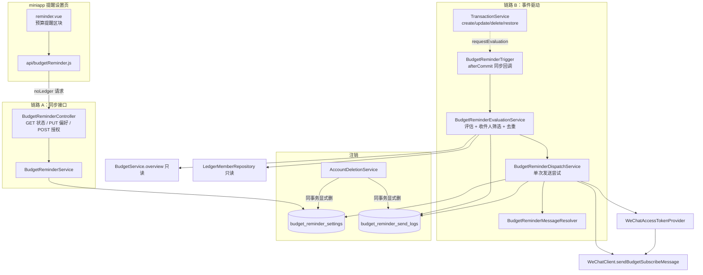

# Design Document

## Overview

预算提醒（Budget_Reminder_System）在已上线的**预算模块**与**自定义提醒（custom-reminder）**之上做纯增量扩展：
当用户的一笔支出写入 / 修改 / 删除 / 恢复导致**当前 `Asia/Shanghai` 自然月**某个预算范围（月度总预算或某分类预算）
的已用比例达到预警线（`WARN`，>= 80% 且 <= 100%）或超支线（`OVER`，> 100%）时，就地评估并经微信一次性订阅消息
向该账本的合格成员各推送一条提醒，用于留存。

设计的三条主轴，直接决定了每个组件的形态：

1. **复用而非重建判定口径**。超支 / 预警口径完全复用 `BudgetService` 的自然月 `type=expense` 聚合与
   `WARN` / `OVER` 阈值——评估服务直接调用 `BudgetService.overview(ledgerId, 当前月)`，读取其返回的总预算
   `status` 与每个分类明细的 `status`，不新开第二套聚合或阈值逻辑（需求 2.4、9.1）。

2. **绝不阻断记账主路径**。评估与发送挂在交易写事务的 `afterCommit` 阶段（照抄 `GrowthSettlementTrigger`
   的事务同步范式），在请求线程内、以独立事务执行；任何异常都在事务边界之外就地吞掉、只记不含金额 / 邮箱 /
   令牌的告警日志，绝不穿回记账、登录、注销、结算路径（需求 2.8、4.5、9.4）。

3. **构造性幂等 + 独立额度**。「每月每范围每级别至多一条」由发送记录表的唯一键
   `uk_budget_reminder_send_logs_scope (user_id, ledger_id, budget_month, scope_ref, level)` 构造性保证，
   不依赖时序巧合（需求 3.1、3.4）。预算提醒的偏好、额度、发送记录、微信模板全部独立新增，与 custom-reminder 的
   `reminder_quota` / `reminder_send_logs` 及其模板互不影响（需求 6.6、9.6）。

功能整体由两条链路组成：

- **链路 A（同步接口，低风险）**：miniapp 提醒设置页对预算提醒偏好与额度的查询 / 更新 / 授权上报，
  经 `BudgetReminderController` → `BudgetReminderService`，只认令牌用户 id、与账本无关（需求 1、6、7、10）。
- **链路 B（事件驱动，高风险，就地隔离）**：交易写成功后经 `BudgetReminderTrigger`（afterCommit）→
  `BudgetReminderEvaluationService`（评估 + 收件人筛选 + 去重）→ `BudgetReminderDispatchService`（单收件人单范围单级别
  的一次发送尝试）→ `WeChatClient.sendSubscribeMessage`，全过程隔离故障（需求 2、3、4、5）。

### 研究要点与既有代码结论

- **`BudgetService` 的口径可直接复用**：`overview()` 对总预算返回 `status ∈ {OK, WARN, OVER}`，对每个已设分类预算返回
  `CategoryBudgetItem.status`；`OVER` 判定为 `spent > budget`，`WARN` 判定为 `usedPct >= 80` 且非 `OVER`，
  未设预算或预算 <= 0 时不进入判定（总预算返回 `hasTotalBudget=false`、分类明细不出现该项）。这与需求 2.4/2.5/2.6 逐字一致。
- **`WeChatClient.sendSubscribeMessage(token, openid, message)` 已存在且语义完备**：返回微信 `errcode`（`0` 成功），
  本地失败（模板未配置 / 凭证为空 / 网络异常 / 响应不可解析）返回哨兵 `ERRCODE_LOCAL_FAILURE(-1)`，本方法不抛异常。
  但它当前只持有 custom-reminder 的模板 id（`app.wechat.subscribe.reminder-template-id`）。预算提醒需**独立模板**，
  故需扩展一个 `sendBudgetSubscribeMessage(...)`（或带模板参数的重载），复用同一 `WeChatAccessTokenProvider` 凭证网关与 40001 重试逻辑（需求 4.7、4.8）。
- **`WeChatAccessTokenProvider` 是全项目唯一凭证入口**，预算提醒发送必须复用它，不得新建凭证获取或缓存（需求 4.7）。
- **`GrowthSettlementTrigger` 提供了 afterCommit 非阻断范式的现成样板**：`TransactionService.create` 等写方法在提交后
  触发副作用、异常在边界外吞掉。预算提醒触发器照抄此范式，并把触发点扩展到 update / delete / restore。
- **`AccountDeletionService` 已按 `user_id` 显式硬删多组无外键新表**（growth / achievement / streak / custom-reminder 三表），
  预算提醒两张新表按同一取舍、同一事务内追加删除即可（需求 8.8、8.9）。
- **miniapp `api/reminder.js` + `pages/reminder/reminder.vue`** 提供了 `noLedger:true` 请求封装、`withTimeout` 3000ms
  客户端超时守卫、seq 序号忽略迟到结果、未登录不发请求的现成范式，预算提醒区块照此扩展（需求 10）。

## Architecture

### 组件全景



### 链路 B 的评估—发送时序

```mermaid
sequenceDiagram
    participant TX as TransactionService
    participant TG as BudgetReminderTrigger
    participant EV as EvaluationService
    participant BS as BudgetService(只读)
    participant DP as DispatchService
    participant WX as WeChatClient

    TX->>TX: 写交易(create/update/delete/restore) 成功
    TX->>TG: requestEvaluation(ledgerId, occurredMonth)
    Note over TG: 注册 afterCommit 同步回调(同一事务只注册一次,去重合并)
    TX-->>TX: 事务提交(交易接口响应已定型)
    TG->>EV: afterCommit: evaluate(ledgerId) [独立事务, try-catch 包裹]
    EV->>EV: 校验 occurredMonth==当前月 且 账本为 PERSONAL/COLLABORATIVE
    EV->>BS: overview(ledgerId, 当前月)
    BS-->>EV: 总预算 status + 各分类 status
    EV->>EV: 逐范围求级别(OVER 优先 WARN;预算<=0 跳过)
    EV->>EV: 筛收件人(账本成员 ∩ enabled ∩ openid非空 ∩ remaining>0)
    loop 每个 (收件人, 范围, 级别)
        EV->>EV: OVER 已发则跳过同范围 WARN;已有记录则跳过
        EV->>DP: dispatch(收件人, ledgerId, 月, scopeRef, level, 分类名)
        DP->>WX: sendBudgetSubscribeMessage(token, openid, 文案)
        WX-->>DP: errcode
        DP->>DP: 写发送记录(SENT/SKIPPED_*/FAILED) + 额度增减
    end
```

### 关键设计决策

- **评估在 afterCommit、独立事务、请求线程内**（不使用 `@Async` / 线程池）：与 `GrowthSettlementTrigger` 一致。
  这样评估只在交易**确已提交**后进行（避免脏读未提交的交易金额），且异常穿不回交易接口（需求 2.8）。
- **触发器只携带不可变的 `ledgerId` + `occurredMonth`（YearMonth）**，绝不携带交易实体（afterCommit 阶段持久化上下文已关闭）。
  当前月判定与账本类型判定都在回调内用新事务重新读取。
- **每次发送尝试独立事务 + 幂等预检 + 唯一键双保险**：`DispatchService.dispatch` 标注 `@Transactional`，
  先按唯一键预检是否已有记录（友好短路），写记录时再靠唯一键兜住并发；撞唯一键捕
  `DataIntegrityViolationException` 后静默放弃（需求 3.4）——完全照抄 `ReminderDispatchService` 的双保险。
- **额度增减走原子条件更新**（不走 `save()` 的先查后写），镜像 `ReminderQuotaRepository`：授权走
  `INSERT ... ON DUPLICATE KEY UPDATE remaining = LEAST(remaining + delta, 50)`，成功发送走
  `remaining = remaining - 1 WHERE remaining > 0`，43101 走归零——防并发丢更新（需求 6.5）。
- **预算提醒模板独立**：新增配置项 `app.wechat.subscribe.budget-template-id`；未配置时发送安全降级为 `FAILED`、
  不消耗额度、不外呼微信、不影响主路径（需求 4.8）。

## Components and Interfaces

### 1. BudgetReminderController（链路 A，`/api/budget-reminders`）

镜像 `ReminderController`：每个端点第一步 `requireExistingUserId()` 把「令牌合法但用户已注销」归入
`UNAUTHENTICATED`（先于任何字段校验，需求 7.2）；请求体字段以原文（String）接收，交服务层解析以精确返回本域错误码；
数据归属只认令牌用户 id，忽略任何指定目标身份的参数 / 头（需求 7.3）；三端点均 `noLedger`、不要求 `X-Ledger-Id`（需求 7.4）。

| 方法 | 端点 | 说明 |
| --- | --- | --- |
| `GET` | `/api/budget-reminders` | 返回本人预算提醒状态 `{enabled, remainingQuota}`（需求 1.1、1.2） |
| `PUT` | `/api/budget-reminders/preference` | 接收 `{enabled}`（布尔），更新偏好，返回 `{enabled, remainingQuota}`（需求 1.3、1.4、1.5） |
| `POST` | `/api/budget-reminders/quota:grant` | 接收 `{grantedCount}`（1..5），上限累加至 50，返回增加后的 `remainingQuota`（需求 6.1~6.4） |

### 2. BudgetReminderService（链路 A 业务）

```java
BudgetReminderStatus getStatus(Long userId);              // 无记录 → {enabled=true, remainingQuota=0}
BudgetReminderStatus updatePreference(Long userId, Boolean enabled); // enabled 缺失/不可解析 → BUDGET_REMINDER_PREF_INVALID
int grantQuota(Long userId, String grantedCountRaw);      // 解析+范围校验(1..5) → 原子上限累加;否则 BUDGET_REMINDER_GRANT_INVALID
```

- `getStatus`：读 `budget_reminder_settings`；无记录返回缺省 `{true, 0}`（不建行，需求 1.2）。
- `updatePreference`：`enabled` 为 `null` 或不可解析为布尔 → 抛 `BUDGET_REMINDER_PREF_INVALID`、偏好不变（需求 1.5）；
  合法则 UPSERT 偏好、置 `updated_at` 为服务端当前时刻，返回最新 `{enabled, remainingQuota}`。
- `grantQuota`：解析 `grantedCountRaw`，非整数 / <1 / >5 → `BUDGET_REMINDER_GRANT_INVALID`、额度不变（需求 6.4）；
  合法则 `addCapped(userId, delta, now)` 原子上限累加（封顶 50，需求 6.3）。

### 3. BudgetReminderTrigger（链路 B 触发，afterCommit）

照抄 `GrowthSettlementTrigger` 的四条禁令（异常不穿出回调、同一事务只注册一次回调、只携带不可变值、异常在事务边界外吞）。

```java
void requestEvaluation(Long ledgerId, YearMonth occurredMonth);
```

- 在 `TransactionService` 的 create / update / delete / restore 成功路径调用；仅当交易属账本（`ledgerId != null`）时调用
  （转账 / 余额调整 `ledger_id=null`，天然不触发，需求 2.2 之外的自然排除）。
- afterCommit 回调内以待评估 `(ledgerId, occurredMonth)` 去重集合合并为一轮，逐项调
  `evaluationService.evaluateQuietly(...)`，每项 try-catch 包裹（需求 2.8）。

### 4. BudgetReminderEvaluationService（评估 + 收件人筛选 + 去重）

```java
@Transactional // REQUIRES_NEW 独立事务
void evaluate(Long ledgerId, YearMonth occurredMonth);
```

评估步骤：

1. **月份闸门**：`occurredMonth != YearMonth.now(clock, Asia/Shanghai)` → 直接返回，不评估（需求 2.3、2.7）。
2. **账本类型闸门**：读 `Ledger`，若为 AA（`isAa()`）→ 直接返回（需求 2.2）；仅个人 / 协作账本继续（需求 5）。
3. **求各范围级别**：调 `budgetService.overview(ledgerId, 当前月)`；
   - 总预算：`hasTotalBudget && status ∈ {WARN, OVER}` → 记 `scopeRef=0`、该 `status` 为级别；`OVER` 优先于 `WARN`
     （`overview` 的 `status` 已是二者取一，天然满足需求 2.6）。
   - 每个 `CategoryBudgetItem`：`status ∈ {WARN, OVER}` → 记 `scopeRef=categoryId`、级别为该 `status`；未设 / <=0 的分类不出现在明细中（需求 2.5）。
4. **收件人集合**：该账本 `ledger_members` 中，满足「`budget_reminder_settings.enabled` 为真（无记录视真）、`users.wx_openid` 非空、
   `budget_reminder_settings.remaining > 0`」的全部用户（需求 4.1）。
5. **逐 (收件人 × 范围) 去重后派发**：
   - 若该范围级别为 `OVER`：若该收件人该账本该月该范围已存在任一 `OVER` 记录 → 跳过（需求 3.2）；否则派发 `OVER`。
   - 若该范围级别为 `WARN`：若同范围同月该收件人**已存在 `OVER` 记录** → 跳过 `WARN`（超支已推不补预警，需求 3.3）；
     若已存在该 `WARN` 记录 → 跳过（需求 3.2）；否则派发 `WARN`。

> 时区：当前月与交易发生月一律用注入的 `Clock`（`Asia/Shanghai`），不依赖 JVM / DB / OS 默认时区（需求 2.7）。

### 5. BudgetReminderDispatchService（单收件人单范围单级别的一次发送尝试）

```java
@Transactional
void dispatch(Long userId, Long ledgerId, YearMonth month, long scopeRef,
              String level, String categoryNameOrNull, String openid);
```

镜像 `ReminderDispatchService.dispatch` 的顺序与故障隔离：

1. **幂等预检**：`(userId, ledgerId, budgetMonth, scopeRef, level)` 已有记录 → 直接返回（需求 3.2）。
2. **选文案**：`BudgetReminderMessageResolver.pick(level, scopeRef, categoryName)`（需求 5）。
3. **额度 / openid**：`remaining <= 0` → 写 `SKIPPED_NO_QUOTA`、不发、不扣额度（需求 4.3）；
   `openid` 空 → 写 `SKIPPED_NO_OPENID`、不发、不扣额度、不报错（需求 4.4）。
4. **发微信**：`WeChatAccessTokenProvider.getToken()` → `weChatClient.sendBudgetSubscribeMessage(token, openid, 文案)`：
   - `errcode == 0` → 写 `SENT`（撞唯一键则本次作废、不扣额度），成功写入后 `decrementFloorZero`（-1 且不小于 0，需求 4.2）；
   - `errcode != 0` → 写 `FAILED`（记 `wx_errcode`）、额度不动、记含 userId 不含金额 / 邮箱 / 令牌的告警日志（需求 4.5）；
     其中 `43101`（拒收 / 无额度）→ 额度归零对齐（需求 4.6）；
   - 调用抛异常 → 写 `FAILED`（`wx_errcode` 空）、额度不动、不外抛（需求 4.5）。
5. 写记录撞唯一键 → 捕 `DataIntegrityViolationException` 静默放弃（需求 3.4）。

### 6. BudgetReminderMessageResolver（文案）

```java
static String pick(String level, long scopeRef, String categoryNameOrNull);
```

- 范围表述：`scopeRef == 0` → 「月度总预算」；否则用分类当前名称；名称不可得（分类已删）→ 「该分类」占位（需求 5.4）。
- 级别文案：`OVER` → 「{范围}本月已超支」；`WARN` → 「{范围}本月已接近预算上限」（需求 5.2、5.3）。
- 文案落入模板字段长度限制内，不含收件人邮箱 / 令牌 / 他人信息（需求 5.5）；按级别恰好选一条（需求 5.6）。

### 7. WeChatClient 扩展（复用凭证网关）

新增 `int sendBudgetSubscribeMessage(String accessToken, String openid, String message)`（或给现有
`sendSubscribeMessage` 增加模板参数并保留旧签名），使用**独立**模板 id `app.wechat.subscribe.budget-template-id`，
其余（凭证复用、40001 强制刷新重试一次、本地失败返回 `ERRCODE_LOCAL_FAILURE`、不抛异常）与既有实现一致（需求 4.7、4.8）。

### 8. AccountDeletionService 集成

在既有单注销事务内、删 `users` 行之前，追加：先删 `budget_reminder_send_logs`、再删 `budget_reminder_settings`
（按 `user_id`，无存在性预查询、无软删副本）。两表无外键，删除顺序仅为可逐语句断言。任一步失败整体回滚（需求 8.8、8.9）。

### 9. miniapp（提醒设置页预算提醒区块）

- 新增 `api/budgetReminder.js`：`fetchBudgetReminderStatus()` / `updateBudgetReminderPreference(enabled)` /
  `grantBudgetReminderQuota(count)`，全部 `noLedger:true`，复用既有 `http` 封装（需求 10.9）。
- `reminder.vue` 新增「预算提醒」区块，与既有记账提醒区块并列、不改其行为（需求 10.1）：
  onShow 时若已登录则请求一次状态，返回前占位、返回后渲染开关与剩余次数（需求 10.2）；未登录不发请求、展示登录入口（需求 10.8）。
  切换开关调更新偏好、成功后就地更新（需求 10.3）；授权入口调 `wx.requestSubscribeMessage`（预算提醒模板 id，新增
  `WX_BUDGET_REMINDER_TEMPLATE_ID`），点「允许」后上报（需求 10.4）；拒绝 / 失败不上报、展示未授权与再次授权入口、不进入错误态（需求 10.5）；
  剩余为 0 展示再次授权引导（需求 10.6）；任一请求出错或 3000ms 无响应展示失败 + 重试、自动重试 0 次（需求 10.7）；
  区块不展示任何金额 / 账本名 / 邮箱 / 邀请码（需求 10.9）。

## Data Models

### 领域实体

```java
// budget_reminder_settings 一人一行，主键即 user_id
class BudgetReminderSetting {
    Long userId;            // @Id, 无 @GeneratedValue
    boolean enabled;        // 缺省 true
    int remaining;          // [0,50]
    LocalDateTime createdAt;
    LocalDateTime updatedAt;
}

// budget_reminder_send_logs 每次发送尝试一行
class BudgetReminderSendLog {
    Long id;                // 自增主键
    Long userId;
    Long ledgerId;
    String budgetMonth;     // "YYYY-MM"
    long scopeRef;          // 0=月度总预算, >0=分类 id
    String level;           // WARN / OVER
    String result;          // SENT / SKIPPED_NO_QUOTA / SKIPPED_NO_OPENID / FAILED
    Integer wxErrcode;      // 可空
    LocalDateTime createdAt;
}
```

### 迁移脚本 V43__budget_reminder.sql

```sql
CREATE TABLE budget_reminder_settings (
    user_id    BIGINT     NOT NULL COMMENT '用户id(主键,一人一行),无外键(注销时由服务层显式删除)',
    enabled    TINYINT(1) NOT NULL DEFAULT 1 COMMENT '预算提醒偏好:1开启0关闭(无记录视为开启)',
    remaining  INT        NOT NULL DEFAULT 0 COMMENT '预算提醒剩余订阅次数,取值范围[0,50],独立于记账提醒',
    created_at DATETIME   NOT NULL COMMENT '首次建档时间',
    updated_at DATETIME   NOT NULL COMMENT '最后一次偏好/额度更新时间',
    PRIMARY KEY (user_id),
    CONSTRAINT ck_budget_reminder_settings_remaining CHECK (remaining >= 0)
) ENGINE = InnoDB DEFAULT CHARSET = utf8mb4 COLLATE = utf8mb4_unicode_ci
  COMMENT = '预算提醒偏好与独立订阅额度(授权累加,成功发送扣减,微信43101归零对齐)';

CREATE TABLE budget_reminder_send_logs (
    id           BIGINT      NOT NULL AUTO_INCREMENT COMMENT '主键',
    user_id      BIGINT      NOT NULL COMMENT '收件人用户id,无外键(注销时由服务层显式删除)',
    ledger_id    BIGINT      NOT NULL COMMENT '账本id,无外键',
    budget_month VARCHAR(7)  NOT NULL COMMENT '预算自然月(Asia/Shanghai,格式YYYY-MM)',
    scope_ref    BIGINT      NOT NULL COMMENT '预算范围:0表示月度总预算,大于0表示分类id',
    level        VARCHAR(8)  NOT NULL COMMENT '预警级别:WARN预警/OVER超支(区分大小写)',
    result       VARCHAR(24) NOT NULL COMMENT '发送结果:SENT/SKIPPED_NO_QUOTA/SKIPPED_NO_OPENID/FAILED',
    wx_errcode   INT         NULL     COMMENT '微信errcode(SENT为0,SKIPPED为空,FAILED为微信码或空)',
    created_at   DATETIME    NOT NULL COMMENT '发送尝试时间',
    PRIMARY KEY (id),
    UNIQUE KEY uk_budget_reminder_send_logs_scope (user_id, ledger_id, budget_month, scope_ref, level),
    CONSTRAINT ck_budget_reminder_send_logs_level CHECK (level IN ('WARN','OVER'))
) ENGINE = InnoDB DEFAULT CHARSET = utf8mb4 COLLATE = utf8mb4_unicode_ci
  COMMENT = '预算提醒发送记录(唯一键构造性保证每月每范围每级别至多一条→幂等)';
```

- 命名 `V43__budget_reminder.sql`，置于 `src/main/resources/db/migration`，不改任何既有迁移（需求 8.1）。
- 两表恰好 5 列 / 9 列，具名 CHECK 与唯一约束齐备（需求 8.2~8.5）；InnoDB + utf8mb4 + 每表每列中文注释（需求 8.6）；
  不建外键（需求 8.7）；不使用窗口函数 / `CONVERT_TZ` / 存储过程 / 触发器，MySQL 与 H2 `MODE=MySQL` 均可执行（需求 8.10）；
  Hibernate `ddl-auto=validate` 可通过（需求 8.12）。
- `deploy/reset-db.sql` 在 `FOREIGN_KEY_CHECKS=0/1` 之间、`TRUNCATE TABLE users` 之前追加清空这两张表（需求 8.11）。

### scope_ref 编码约定

`scope_ref = 0` 唯一表示月度总预算；`scope_ref > 0` 为分类 id。由于分类 id 恒 > 0，`0` 与任何分类 id 不冲突，
唯一键因此能把「总预算 WARN / OVER」与「每个分类 WARN / OVER」两两区分。

## Correctness Properties

*A property is a characteristic or behavior that should hold true across all valid executions of a system—essentially, a formal statement about what the system should do. Properties serve as the bridge between human-readable specifications and machine-verifiable correctness guarantees.*

预算提醒的核心是一批纯逻辑：级别判定、去重、额度算术、文案选择、收件人筛选、故障隔离。这些都能写成「对任意输入 X，性质 P(X) 成立」，因此适用属性测试。下面每条属性由验收标准推导而来，并标注其校验的需求条款。经属性反思后，逻辑冗余的条款已被合并为更综合的属性。

### Property 1: 级别判定与 BudgetService 一致且超支优先

*For any* 预算范围的已支出金额 spent 与预算金额 budget（budget > 0），预算提醒评估器对该范围求得的级别，
应与 `BudgetService` 对同一 (spent, budget) 的 `status` 一致：`spent > budget` 恒为 `OVER`（即使已用比例也 >= 80%，
超支优先于预警），`spent <= budget 且已用比例 >= 80%` 为 `WARN`，否则不产生级别。

**Validates: Requirements 2.4, 2.6**

### Property 2: 未设或非正预算不产生级别

*For any* 预算范围，若其预算金额未设或 <= 0，则评估该范围不产生任何级别、不生成任何发送尝试。

**Validates: Requirements 2.5**

### Property 3: 评估范围恰为已设范围集合

*For any* 个人 / 家庭账本的预算配置（月度总预算是否已设 + 任意一组已设分类预算），当前月触发评估时被考虑的
预算范围集合，恰为「已设的月度总预算（若有）」与「全部已设分类预算」的并集，不多不少。

**Validates: Requirements 2.1**

### Property 4: AA 账本与非当前月零发送尝试

*For any* 触发交易，若其所属账本为 AA 账本，或其发生月不是当前 `Asia/Shanghai` 自然月，则评估不产生任何发送尝试
（发送记录零新增）。

**Validates: Requirements 2.2, 2.3**

### Property 5: 收件人恰为三谓词交集（含偏好为假被排除）

*For any* 账本成员集合与各成员的 (预算提醒偏好 enabled、wx_openid 是否非空、预算提醒剩余次数 remaining)，
某范围某级别触发时的收件人集合，恰为满足「enabled 为真（无记录视真）且 openid 非空且 remaining > 0」的全部成员，
且每名收件人恰生成一次发送尝试。偏好为假的成员绝不在收件人集合中。

**Validates: Requirements 1.6, 4.1**

### Property 6: 发送尝试的结果与额度变化状态机

*For any* 一次发送尝试（给定收件人的 remaining、openid、模板是否配置、微信返回的 errcode 或抛出的异常），
其落表结果与额度变化遵循同一状态机：
- `remaining = 0` → 结果 `SKIPPED_NO_QUOTA`、不调微信、remaining 不变；
- `openid` 为空 → 结果 `SKIPPED_NO_OPENID`、不调微信、remaining 不变；
- 微信 `errcode = 0` → 结果 `SENT`、`remaining' = max(remaining - 1, 0)` 且 remaining' >= 0；
- 微信 `errcode = 43101` → 结果 `FAILED`（记 errcode）、`remaining' = 0`；
- 微信其它非零 errcode / 本地降级（模板未配置）/ 调用抛异常 → 结果 `FAILED`、remaining 不变、不外抛异常。

在所有分支中 remaining 恒落在 [0, 50] 且不小于 0。

**Validates: Requirements 4.2, 4.3, 4.4, 4.5, 4.6, 4.8**

### Property 7: 同键至多一条 SENT 且已存在即短路

*For any* 由「同一收件人 / 账本 / 自然月 / 预算范围 / 级别」重复触发构成的任意长度评估序列，该键的 `SENT` 发送记录
数至多为 1；且一旦该键已存在任一发送记录，后续对该键的评估不再生成第二次发送尝试、不再调用微信发送接口。

**Validates: Requirements 3.1, 3.2**

### Property 8: 超支已推则不补预警

*For any* 预算范围与收件人，若该收件人该账本该自然月该范围已存在 `OVER` 发送记录，则后续对该范围该月的 `WARN`
级别不生成任何发送尝试。

**Validates: Requirements 3.3**

### Property 9: 跨自然月独立计次

*For any* 预算范围、级别与收件人，两个不同的自然月互为独立的去重键：某收件人在某月已收到某范围某级别提醒后，
进入另一自然月再次达到该级别时，允许各自产生一条 `SENT`。

**Validates: Requirements 3.5**

### Property 10: 文案与级别一一对应且体现范围要素

*For any* (级别, 预算范围) 组合，生成的文案恰选一条并与级别严格一致：`OVER` 选超支类文案、`WARN` 选预警类文案，
不产生级别与文案不一致的尝试；文案同时体现预算范围（月度总预算或具体分类名称）与级别两要素。

**Validates: Requirements 5.1, 5.2, 5.3, 5.6**

### Property 11: 分类名称缺失的占位健壮性

*For any* 分类范围，即使其分类已被删除或名称不可得，文案生成也不抛异常、不中止发送，并以「该分类」之类的占位表述替代。

**Validates: Requirements 5.4**

### Property 12: 文案长度与隐私约束

*For any* (级别, 预算范围)（含超长分类名），生成的文案长度落入微信订阅消息模板对应字段的长度限制之内，
且不包含收件人邮箱、令牌与任何其它用户的信息。

**Validates: Requirements 5.5**

### Property 13: 偏好更新往返

*For any* 布尔值 b，更新预算提醒偏好为 b 后再查询状态，得到的 `enabled` 应等于 b。

**Validates: Requirements 1.4**

### Property 14: 偏好非法输入拒绝且零副作用

*For any* 无法解析为布尔值（或缺失）的偏好更新输入，系统拒绝更新并返回 `BUDGET_REMINDER_PREF_INVALID`，
且该用户的预算提醒偏好保持更新前的取值不变。

**Validates: Requirements 1.5**

### Property 15: 授权额度净和（带 [0,50] 钳制）

*For any* 由授权上报（每次 +grantedCount，grantedCount ∈ [1,5]）与成功发送扣减（每次 -1）构成的任意操作序列，
最终的 remaining 等于对初值 0 按序施加每步操作并在每步后钳制到 [0,50] 的结果（每次增加封顶 50、每次扣减不小于 0），
并发执行不产生丢失更新。

**Validates: Requirements 6.2, 6.3, 6.5**

### Property 16: 授权非法输入拒绝且零副作用

*For any* 缺失、不可解析为整数、小于 1 或大于 5 的 grantedCount 输入，系统拒绝上报并返回
`BUDGET_REMINDER_GRANT_INVALID`，且该用户的预算提醒剩余次数保持不变。

**Validates: Requirements 6.4**

### Property 17: 两套提醒额度与记录互不影响

*For any* 预算提醒的额度操作（授权 / 扣减 / 归零），custom-reminder 的 `reminder_quota` 与 `reminder_send_logs`
逐项不变；反之，任意 custom-reminder 的额度操作也不改变预算提醒的剩余次数与发送记录。

**Validates: Requirements 6.6, 9.6**

### Property 18: 鉴权优先且零副作用

*For any* 无效令牌（缺失 / 签名失败 / 过期 / 用户不存在）与任意（含非法）请求体，三个接口恒返回 `UNAUTHENTICATED`
（优先于任何字段校验），预算提醒偏好与剩余次数保持不变，响应中不含任何偏好或额度字段值。

**Validates: Requirements 7.2, 7.6**

### Property 19: 归属只认令牌用户、忽略目标身份与账本头

*For any* 携带任意伪造目标用户身份（查询参数 / 路径参数 / 请求体字段 / 自定义头）与任意 `X-Ledger-Id`（含缺失 / 不可访问）
的请求，操作仍只作用于令牌所标识的用户，且不因携带此类字段或缺失账本头而返回错误码。

**Validates: Requirements 7.3, 7.4**

### Property 20: 本域错误体形态一致

*For any* 触发本域错误码的输入，错误体字段集恰为 `{code, message, field}` 三项，`message` 为长度 <= 100 的中文且不含
用户 id / 邮箱 / 令牌；与具体字段无关的错误（如 `UNAUTHENTICATED`）其 `field` 取空值且 `code`、`message` 两项不省略。

**Validates: Requirements 7.5**

### Property 21: 主路径隔离不变量

*For any* 在评估 / 微信调用 / 额度耗尽处注入的失败（抛异常、非零 errcode、模板未配置），交易（及登录 / 注销 / 结算）
接口的响应字段集、字段取值、HTTP 状态码与错误码，与未注入失败时逐字节相同，且无异常穿回主路径。

**Validates: Requirements 2.8, 9.4**

### Property 22: 既有表只读不变量

*For any* 预算提醒接口调用或一次评估执行，`budgets` / `category_budgets` / `transactions` / `ledgers` /
`ledger_members` / `categories` / `users.wx_openid` 各表各列取值在其前后逐项不变（预算提醒对既有表不执行任何写语句）。

**Validates: Requirements 9.1**

### Property 23: 注销级联删除且注销响应不变

*For any* 在 `budget_reminder_settings` 与 `budget_reminder_send_logs` 有任意行的用户，账号注销后该用户在这两张表的
行数均为 0，且注销接口的响应字段集、HTTP 状态码与既有错误码不因这两张表的删除而改变。

**Validates: Requirements 8.8**

## Error Handling

### 新增错误码（仅两个）

| 错误码 | HTTP | field | 触发场景 |
| --- | --- | --- | --- |
| `BUDGET_REMINDER_PREF_INVALID` | 400 | `enabled` | 更新偏好时 `enabled` 缺失或不可解析为布尔（需求 1.5） |
| `BUDGET_REMINDER_GRANT_INVALID` | 400 | `grantedCount` | 授权上报时 `grantedCount` 缺失 / 不可解析 / <1 / >5（需求 6.4） |

二者以工厂方法加入 `ApiException`，`message` 为 <= 100 字符中文、不含 id / 邮箱 / 令牌；错误体经既有
`GlobalExceptionHandler` 统一输出 `{code, message, field}`（需求 7.5、7.6）。复用既有 `UNAUTHENTICATED`，
不新增第三个错误码、不重命名任何既有码（需求 9.3）。

### 链路 A（同步接口）错误处理

- 鉴权先于字段校验：每端点首步 `requireExistingUserId()`，令牌无效 / 用户已注销 → `UNAUTHENTICATED`，零副作用（需求 7.2）。
- 字段以原文接收并在服务层解析，避免框架类型转换抢先抛出他域错误码（照抄 `ReminderController` 取舍）。
- 所有失败路径零副作用：偏好 / 额度保持不变（需求 1.5、6.4）。

### 链路 B（事件驱动）故障隔离——绝不阻断主路径

- **触发层**：`BudgetReminderTrigger` 在 afterCommit 回调内 try-catch 逐项包裹评估调用，异常绝不穿出回调
  （否则会穿出交易方法的 `commit()` 令记账接口 500）——照抄 `GrowthSettlementTrigger` 禁令①（需求 2.8）。
- **评估层**：`evaluate` 独立事务（`REQUIRES_NEW`），异常在事务边界外吞掉、记不含金额 / 邮箱 / 令牌的告警日志（需求 2.8、9.4）。
- **发送层**：`WeChatClient.sendBudgetSubscribeMessage` 本身不抛异常（本地失败返回哨兵 `-1`）；即便如此
  `DispatchService` 仍对发送与写库整体 try-catch，任何异常只落 `FAILED`、不外抛、不扣额度（需求 4.5）。
- **模板未配置**：写 `FAILED`、安全降级为不发、不消耗额度、不外呼微信（需求 4.8）。
- **并发唯一键冲突**：捕 `DataIntegrityViolationException` 静默放弃本次、不重复调微信、不报错（需求 3.4）。
- **注销事务**：两表删除任一步失败 → 整个注销事务回滚、经既有错误码返回失败（需求 8.9）。

### miniapp 错误处理

- 复用 `withTimeout` 3000ms 客户端超时守卫 + seq 序号忽略迟到结果；任一请求出错或超时切失败态 + 重试入口，
  自动重试 0 次、保留其余已加载内容（需求 10.7）。
- 未登录不发任何请求、展示登录入口（需求 10.8）；`wx.requestSubscribeMessage` 拒绝 / 失败不上报、展示再授权入口、
  不进入错误态（需求 10.5）。

## Testing Strategy

采用**单元测试 + 属性测试**双轨，覆盖互补：单元测试钉住具体样例、边界与接口形态；属性测试用随机输入验证上面 23 条
通用属性。属性测试库沿用项目既有的 **jqwik**（仓库根已有 `.jqwik-database`，与既有 `*PropertyTest` 一致），
miniapp 侧沿用其既有测试框架（如 `utils/reminder.validation-quota.test.js` 所用）。

### 属性测试要求

- 每条属性用**单个**属性测试实现，最少 **100** 次迭代（jqwik `@Property` 缺省即随机多次，显式设 `tries = 100` 起）。
- 每个属性测试以注释标注其对应设计属性，格式：
  `// Feature: subscribe-message-reminders, Property {number}: {property_text}`。
- 生成器需覆盖边界：spent/budget 在阈值 80% 与 100% 附近（Property 1）、remaining 在 0 / 1 / 50 边界（Property 6、15）、
  分类名为 null 与超长（Property 11、12）、跨月边界时刻（Property 9）、grantedCount 越界与非整数原文（Property 16）。
- 微信调用在属性测试中一律 **mock**（`WeChatClient` / `WeChatAccessTokenProvider` 打桩返回指定 errcode 或抛异常），
  不外呼真实微信、不消耗凭证额度；保证 100+ 次迭代成本可控。

### 属性 → 测试对象映射（示例）

| 属性 | 主要被测对象 | 生成什么 |
| --- | --- | --- |
| P1、P2、P3 | `BudgetReminderEvaluationService` + `BudgetService` | 随机 (spent, budget) 与预算配置 |
| P4 | `BudgetReminderEvaluationService` | 随机账本类型与交易发生月 |
| P5 | 收件人筛选 | 随机成员及其 (enabled, openid, remaining) |
| P6、P15 | `BudgetReminderDispatchService` + 额度仓库 | 随机 remaining / openid / errcode / 操作序列 |
| P7、P8、P9 | 去重逻辑 + 发送记录 | 随机重复触发序列、跨月序列 |
| P10、P11、P12 | `BudgetReminderMessageResolver` | 随机 (level, scope, 分类名含 null/超长) |
| P13、P14、P16 | `BudgetReminderService` | 随机布尔 / 非法原文 / grantedCount |
| P17、P21、P22、P23 | 隔离与注销 | 随机既有表快照 + 注入失败 |
| P18、P19、P20 | `BudgetReminderController` | 随机无效令牌 / 伪造目标身份 / 触发错误码的输入 |

### 单元 / 集成 / 冒烟测试（不适合属性化的部分）

- **EXAMPLE 单测**：接口形态与默认值（需求 1.1、1.2、1.3、6.1）、并发唯一键冲突模拟（需求 3.4）、
  注销删除失败回滚（需求 8.9）、miniapp 区块的渲染与交互（需求 10.1~10.9，用 mock `wx` 与假计时器）。
- **EDGE_CASE 单测**：`Asia/Shanghai` 跨月边界归月（需求 2.7）、模板未配置降级（需求 4.8）。
- **SMOKE / 迁移测试**：迁移在 H2 `MODE=MySQL` 与 MySQL 均成功、表结构 / 约束名 / 引擎 / 字符集 / 注释 / 无外键校验
  （需求 8.1~8.7、8.10~8.12）、`ddl-auto=validate` 启动、错误码集合仅增两项（需求 9.3）、发送路径经
  `WeChatAccessTokenProvider` 取凭证（需求 4.7）、`reset-db.sql` 清空两表（需求 8.11）。
- **INTEGRATION 回归**：删除两表全部行后，既有记账 / 预算 / 登录 / 注销 / 成长 / 成就 / 连续记账 / custom-reminder
  的代表性请求响应不变（需求 9.2），用 1~3 个代表样例而非属性化。
